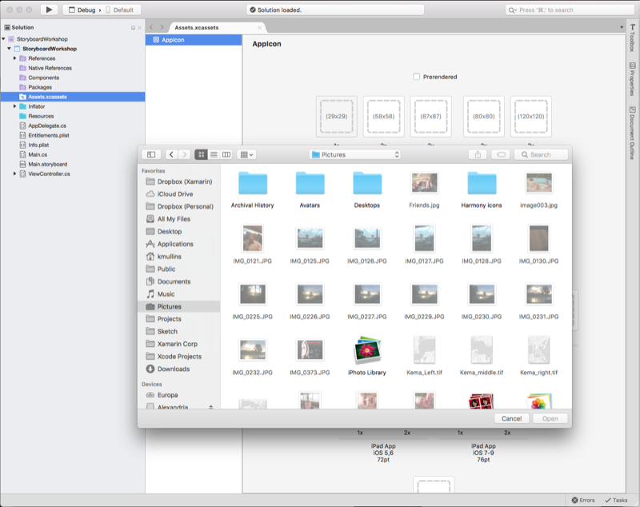
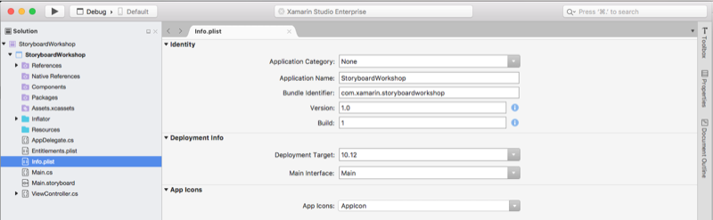
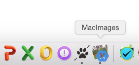

# Application icon for Xamarin.Mac apps

_This article covers creating the images required for a Xamarin.Mac application's icon, bundling the images into a .icns file, and including the icon in the Xamarin.Mac project._

## Overview

When working with C# and .NET in a Xamarin.Mac application, a developer has access to the same Image and Icon tools that a developer working in *Objective-C* and *Xcode* does.

A great Icon should convey the main purpose of a Xamarin.Mac app and hint experience the user should expect when using the app. This article covers all of the steps necessary to create the Image Assets required for an Icon, packaging those assets into a `AppIcon.appiconset` file and consuming that file in a Xamarin.Mac app.

## Application icon

A great Icon should convey the main purpose of a Xamarin.Mac app and hint experience the user should expect when using an app. Every macOS app must include several sizes of its Icon for display in the Finder, Dock, Launchpad, and other locations throughout the computer.

## Designing the icon

Apple suggests the following tips when designing an application's icon:

- Consider giving the icon a realistic and unique shape.
- If the macOS app has an iOS counterpart, don’t reuse the iOS app's icon.
- Use universal imagery that people can easily recognize.
- Strive for simplicity.
- Use color and shadow sparingly to help the icon tell the app's story.
- Avoid mixing actual text with _greeked_ text or lines to suggest text.
- Create an idealized version of the icon's subject rather than using an actual photo.
- Avoid using macOS UI elements in the icons.
- Don’t use replicas of Apple icons in the icons.

Please read the [App Icon Gallery](https://developer.apple.com/library/mac/documentation/UserExperience/Conceptual/OSXHIGuidelines/Gallery.html#//apple_ref/doc/uid/20000957-CH88-SW1) and [Designing App Icons](https://developer.apple.com/library/mac/documentation/UserExperience/Conceptual/OSXHIGuidelines/Designing.html#//apple_ref/doc/uid/20000957-CH87-SW1) sections of Apple's [OS X Human Interface Guidelines](https://developer.apple.com/library/mac/documentation/UserExperience/Conceptual/OSXHIGuidelines/) before designing a Xamarin.Mac app's icon.

## Required image sizes and filenames

Like any other Image Resource that the developer is going to use in a Xamarin.Mac app, the app Icon needs to provided both a Standard and Retina Resolution version. Again, like any other image, use a `@2x` format when naming the Icon files:

- **Standard-Resolution**  - _ImageName_**.**_filename-extension_ (Example: **icon_512x512.png**)
- **High-Resolution**  - _ImageName_**@2x.**_filename-extension_ (Example: **icon_512x512@2x.png**)

For example, to supply the 512 x 512 version of the app's icon, the file would be named **icon_512x512.png** and **icon_512x512@2x.png**.

To ensure that the icon looks great in all the places that users see it, provide resources in the sizes listed below:

|Filename|Size in Pixels|
|---|---|
|icon_512x512@2x.png|1024 x 1024|
|icon_512x512.png|512 x 512|
|icon_256x256@2x.png|512 x 512|
|icon_256x256.png|256 x 256|
|icon_128x128@2x.png|256 x 256|
|icon_128x128.png|128 x 128|
|icon_32x32@2x.png|64 x 64|
|icon_32x32.png|32 x 32|
|icon_16x16@2x.png|32 x 32|
|icon_16x16.png|16 x 16|

For more information, see Apple's [Provide High-Resolution Versions of All App Graphics Resources](https://developer.apple.com/library/mac/documentation/GraphicsAnimation/Conceptual/HighResolutionOSX/Optimizing/Optimizing.html#//apple_ref/doc/uid/TP40012302-CH7-SW3) documentation.

## Packaging the icon resources

With the icon designed and saved out to the required file sizes and names, Visual Studio for Mac makes it easy to assign them to the image assets for use in Xamarin.Mac.

Do the following:

1. In the **Solution Pad**, open **Assets.xcassets** > **AppIcons.appiconset**: 

    
2. For each icon size required, click the icon and select the corresponding image file that were created above: 

    
3. Save your changes.

## Using the icon

Once the `AppIcon.appiconset` file has been built, it will need to assign it to the Xamarin.Mac project in Visual Studio for Mac.

Do the following:

1. Double-click the **Info.plist** in the **Solution Pad** to open the **Project Options**.
2. In the **Mac OS X Application Target** section and click the **App Icons** to select the `AppIcon.appiconset` file: 

    
3. Save the changes.

When the app is run, the new icon will be displayed in the dock:

## Summary

This article has taken a detailed look at working with Images required to create an macOS app Icon, packaging an Icon and including an Icon in a Xamarin.Mac project.

## Related Links

- [MacImages (sample)](/samples/xamarin/mac-samples/macimages)
- [Hello, Mac](~/mac/get-started/hello-mac.md)
- [Working with Images](~/mac/app-fundamentals/image.md)
- [macOS Human Interface Guidelines - Foundations](https://developer.apple.com/design/human-interface-guidelines/foundations)
- [About High Resolution for OS X](https://developer.apple.com/library/content/documentation/GraphicsAnimation/Conceptual/HighResolutionOSX/Introduction/Introduction.html)
- [Icns Builder](https://itunes.apple.com/us/app/icns-builder/id554660130?mt=12)