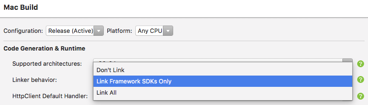

# Xamarin.Mac linker options

_Linking is a powerful optimization tool that reduces the size of your application by removing unused code._

## Overview

Based upon the [Target Framework](~/mac/platform/target-framework.md) your project uses, the linker options available may be limited. This is due to the fact that linking requires the creation of an object graph of every type used by your application and this is not possible in Full (or Unsupported) due to System.Configuration.

There are four options available:

- **None** – Disable all linking. Default in Debug configuration in Modern and all configurations in Full.
- **SDK** – Links all SDK assembly, excluding user assemblies. Default in Release configuration in Modern. Unavailable on Full.
- **Full** – Link all assemblies. This requires user code to be linker safe, see the [notes](~/ios/deploy-test/linker.md) for more information. Unavailable on Full.
- **Platform** – Link just Xamarin.Mac.dll. See below for details.

## Platform linking

Linking applications using the Full [Target Framework](~/mac/platform/target-framework.md) is generally unsafe, but there are a number of scenarios where a very limited form of linking is required.

For example, Applications submitted to the macOS App Store must not reference a number of deprecated APIs (such as QTKit), some of which Xamarin.Mac contains bindings of. Even if an applications does not call those bindings, the invocation will exist in the SDK and be rejected.

Platform linking assumes the application and the BCL are linker unsafe and just remove unused code from Xamarin.Mac.dll. 

Any applications not reflecting on Xamarin.Mac.dll types will see a minor startup improvement from the removal of unnecessary types.

Platform linking is generally only useful for applications using the Full target framework, as Modern application can use the more powerful SDK option.

## Setting the linker configuration

To change to the linker configuration for a Xamarin.Mac project, do the following:

1. Open the Xamarin.Mac project in Visual Studio for Mac.
2. In the **Solution Explorer**, double-click the project file to open the **Project Options** dialog box.
3. From the **Mac Build** tab, select the type of **Linker Behavior** that suits your application's needs:

  

4. Platform linking for Full Target Frameworks will not appear in the IDE until a future update. Until then, add `--linkplatform`  to the **Additional mmp arguments** instead.
5. Click the **OK** button to save your changes.

## Related Links

- [Linking on iOS](~/ios/deploy-test/linker.md)
