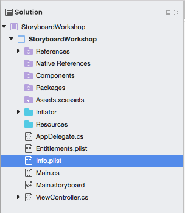
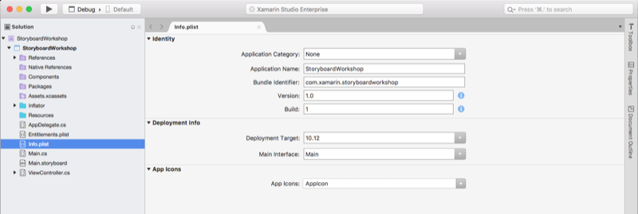
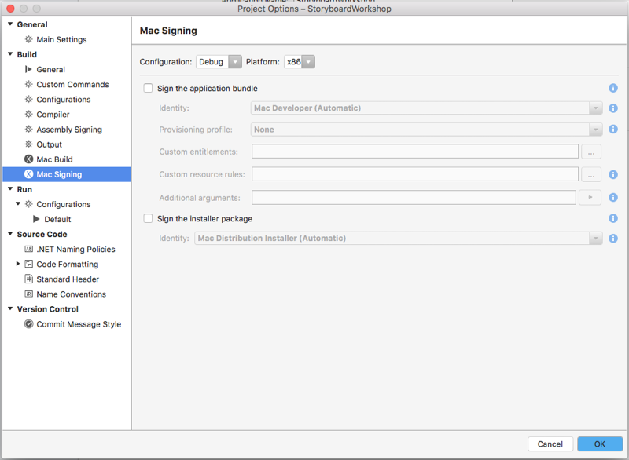
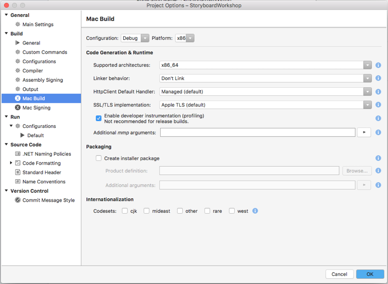

# Mac app configuration

## Mac app configuration

Right-click on the Mac application project in Visual Studio for Mac and choose **Options**.

### Application settings

To change a Xamarin.Mac app's Application Settings, double-click the **Info.plist** file in the **Solution Pad**:

This will display the available options for the app:

 

Running Mac applications created with Xamarin.Mac have the following system requirements:

- A Mac computer running Mac OS X 10.7 or greater.

### Signing settings

The **Mac Signing** section of the **Project Options** dialog allows the developer to sign a Xamarin.Mac app for testing, for self release or for release through the Apple App Store:

From here select the Identity, Provisioning Profile and any custom entitlements used to sign the app when it is compiled. The developer can optionally sign the Installer used to install the app on an other Mac.

### Build settings

The **Mac Build** section of the **Project Options** dialog allows the developer to select the architecture for a Xamarin.Mac app, to control what version of macOS the app will support and to optionally create an install package when the app is successfully compiled:

 

## Related links

- [Installation](/visualstudio/mac/installation/)
- [Hello, Mac sample](~/mac/get-started/hello-mac.md)
- [Distribute your apps on the Mac App Store](https://developer.apple.com/devcenter/mac/checklist/)
- [Developer ID and GateKeeper](https://developer.apple.com/developer-id/)
