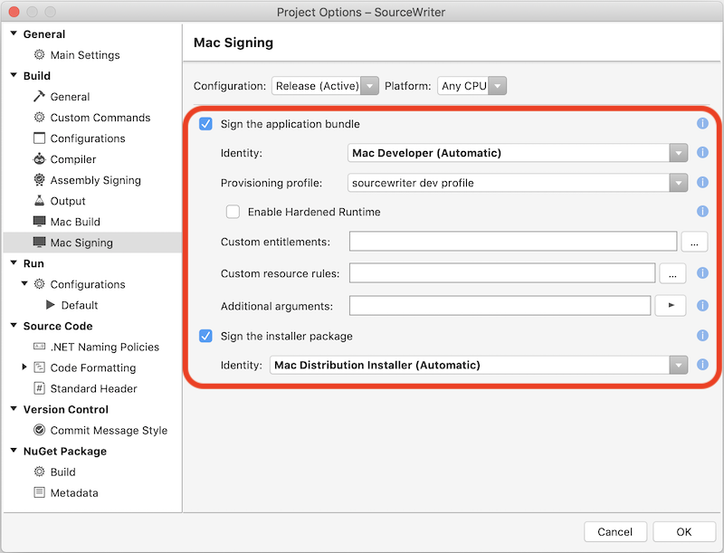
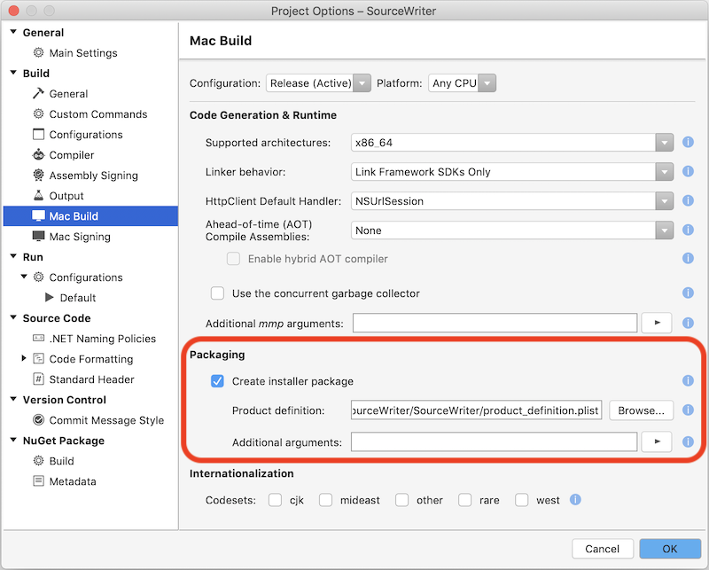
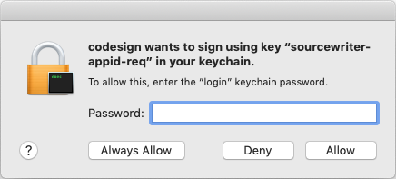
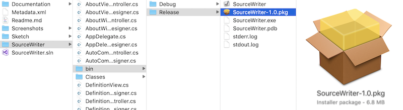

# Bundling for the Mac App Store

This section describes the basics of building an application for release in the Mac App Store using Visual Studio for Mac. Based on additional features (such as iCloud access and push notifications), further setup may be required that goes beyon the scope of this article.

> [!NOTE]
> Before starting this section, the developer must have created a production provisioning profile to build for the Mac App Store. See the [profile instructions](profiles.md) for creating the required provisioning profiles.

## Code signing options

Change the **Configuration** to **Release** before updating the code signing and packaging options. The developer needs to make sure that they use their company **Identity** and the provisioning profile that we created above when signing the application for release in the App Store.

Ensure that the option to create an installer package has been checked in the **Mac Build** settings:

## Build

Before building, ensure that the **Release** configuration has been selected. When the developer builds the app, they’ll be prompted _twice_ (to use both the application and installer certificates):

After the application has been built, the developer can right-click on the project and choose **Reveal in Finder** to find the package file (in the `bin/Release/AppStore` directory in the example shown below).  This package file includes an installer for the app that can be submitted to Apple for inclusion in the Mac App Store.

> [!div class="mx-imgBorder"]
> 

## Related links

- [Installation](/visualstudio/mac/installation/)
- [Hello, Mac sample](~/mac/get-started/hello-mac.md)
- [Distribute your apps on the Mac App Store](https://developer.apple.com/devcenter/mac/checklist/)
- [Developer ID and GateKeeper](https://developer.apple.com/developer-id/)
