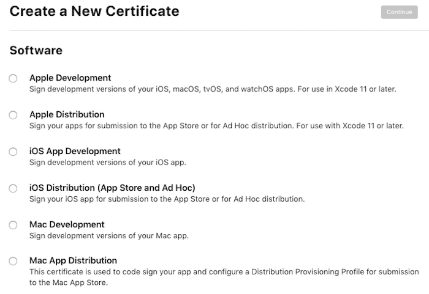
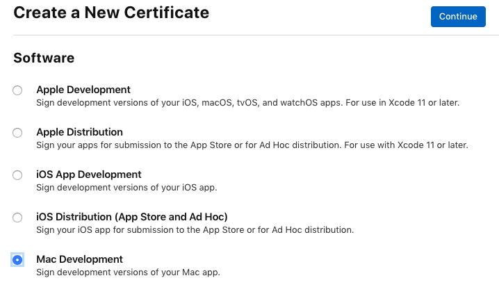
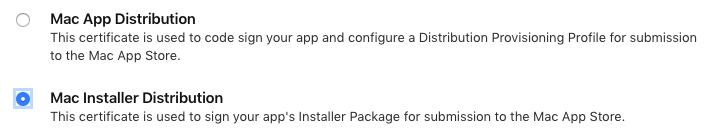
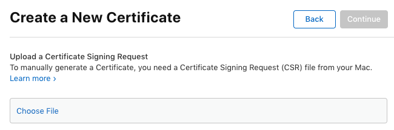
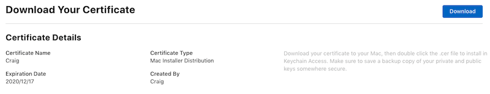

# Certificates and identifiers in Xamarin.Mac

_This guide walks through creating the necessary certificates and identifiers that will be required to publish a Xamarin.Mac app._

## Setup

Visit the [Apple Developer Member Center](https://developer.apple.com) to configure the Mac for development. Click on the **Account** link and sign-in. The main menu is shown below:

> [!div class="mx-imgBorder"]
> 

Click on the **Certificates, Identifiers & Profiles** button (or the plus button near the **Certificates** heading):

> [!div class="mx-imgBorder"]
> 

Select a certificate type and click **Continue**:

> [!div class="mx-imgBorder"]
> 

From here you can download the **Intermediate Certificates** (Worldwide Developer Relations Certificate Authority and Developer ID Certificate Authority) if required (last item at the bottom of the page). However, these should automatically be setup for the developer by Xcode.

The remainder of this section walks through the sections relevant to Mac developers:

- **Register Mac App ID** – The developer will need to follow these steps for each application they write.
- **Register macOS Systems** – This is only required when adding computers to test with.
- **Create Certificates** – Only required once when setting-up the certificates, and later when renewing them.
- **Create Provisioning Profile** – The developer will need to follow these steps for each new application written, and when adding new systems.

## Register Mac App ID

You need to register an App ID for every application. Follow the steps below to create an entry:

1. Press the "+" (plus sign) or **Register an App ID**:

    > [!div class="mx-imgBorder"]
    > 

1. Choose **App IDs**

    > [!div class="mx-imgBorder"]
    > 

1. Enter a **Description**,  and select any **App Services** that the application will require:
    a. Platform should be **macOS**
    a. Choose a **Description** (used only in this portal)
    a. Enter the **Bundle ID**, which should match your **Info.plist**
    a. Select the capabilities that your app requires

    > [!div class="mx-imgBorder"]
    > 

    Press **Continue** to review your selections.

1. If the information is correct, click **Register** to complete the setup:

    > [!div class="mx-imgBorder"]
    > 

1. Verify the information and click the **Submit** button:

    > [!div class="mx-imgBorder"]
    > 

Some **App Services** might require further configuration (for example, iCloud). If that is the case, select the new App ID just created and click the **Edit** button:

> [!div class="mx-imgBorder"]
> 

To configure the iCloud services, for example, click the **Edit** button:

> [!div class="mx-imgBorder"]
> 

## Register macOS devices

To create a provisioning profile for testing, the developer will need to have their Mac
computers registered. A maximum of 100 computers can be registered for testing.

1. In the Mac Developer Center, select **All** from the **Devices** section and click the **+** button:

    > [!div class="mx-imgBorder"]
    > 

1. Enter a **Name** and the **UUID** of the computer to add and click the **Continue** button. Review the information and the click **Register** button:

    > [!div class="mx-imgBorder"]
    > 

1. Review and confirm the data entered:

    > [!div class="mx-imgBorder"]
    > 

## Create certificates

Use the Certificates section to create several different types of certificates that will be used to sign Mac Applications:

> [!div class="mx-imgBorder"]
> 

There are five main types of certificate relevant to macOS development:

- **Mac Development** – Optional for general app development, but required if the developer plans to use features like iCloud or push notifications. The developer will need a Development Certificate before they can create Provisioning Profiles that allow them to access those features.
- **Mac App Distribution** – The developer will need a certificate for their app and another certificate for the installer.
- **Mac Installer Distribution** – The developer will need a certificate for their app and another certificate for the installer.
- **Developer ID Installer** – Certificates for the installer to distribute outside the Mac App Store.
- **Developer ID Application** – Certificates for the app to distribute outside the Mac App Store.

The following sections will provide examples of creating some of these certificate types.

### Mac development certificate

As mentioned previously, Mac Development certificate isn't required unless macOS features like iCloud or push notifications are being used.

Do the following to created a new Development Certificate:

1. Select the **Mac Development** radio button and click **Continue**:

    > [!div class="mx-imgBorder"]
    > 

1. Upload a _certificate signing request_. The certificate request file (extension `.certSigningRequest`) will be saved locally on the Mac. Click **Choose file** to select the certificate request, then press **Continue**.

    > [!div class="mx-imgBorder"]
    > 

    Follow the [Learn more >](https://help.apple.com/developer-account/#/devbfa00fef7) link for instructions on how to use **Keychain Access** to create a certificate request file.

1. Press **Download** to get the certificate file, and double-click it to install:

    > [!div class="mx-imgBorder"]
    > 

As previously mentioned the Developer certificate is not always required
unless the developer is implementing macOS features like iCloud and push notifications. It is also required to create a **Development Provisioning Profile**, which will be needed to test Mac App Store apps.

### Mac App Store certificates

To release an app on the App Store, you'll need two certificates:

- **Mac App Distribution** certificate that will be used to sign the application; and
- **Mac Installer Distribution** certificate, to sign the installer.

> [!TIP]
> Be careful when naming the certificate requests for these keys: use descriptive names that include the text `Application` and `Installer` so they can be distinguished later.

First, create the installer certificate:

1. Select **Mac Installer Distribution** as the certificate type and click the **Continue** button:

    > [!div class="mx-imgBorder"]
    > 

1. The next page explains how to use **Keychain Access** to generate a certificate request file. Follow the instructions:

    > [!div class="mx-imgBorder"]
    > 

    Follow the [Learn more >](https://help.apple.com/developer-account/#/devbfa00fef7) link for instructions on how to use **Keychain Access** to create a certificate request file. Remember to choose a certificate name that reflects the _type_ of certificate (Application or Installer).

1. Click **Download** to get your certificate and double-click to install it in the **Keychain**:

    > [!div class="mx-imgBorder"]
    > 

**Follow the same steps for the Mac App Distribution certificate.**

### Developer ID certificates

To self-release a Xamarin.Mac application (not release via the Apple App Store), you'll need two certificates:

- **Developer ID Installer** certificate that will be used to sign the application; and
- **Developer ID Application** certificate, to sign the installer.

> [!TIP]
> Be careful when naming the certificate requests for these keys: use descriptive names that include the text `Application` and `Installer` so they can be distinguished later.

Once you have created, downloaded, and installed certificates, they'll be visible in **Keychain Access**:

[Keychain Access certificate list](certificates-identifiers-images/certif09.png)

## Related links

- [Installation](/visualstudio/mac/installation/)
- [Hello, Mac sample](~/mac/get-started/hello-mac.md)
- [Distribute your apps on the Mac App Store](https://developer.apple.com/devcenter/mac/checklist/)
- [Developer ID and GateKeeper](https://developer.apple.com/developer-id/)
