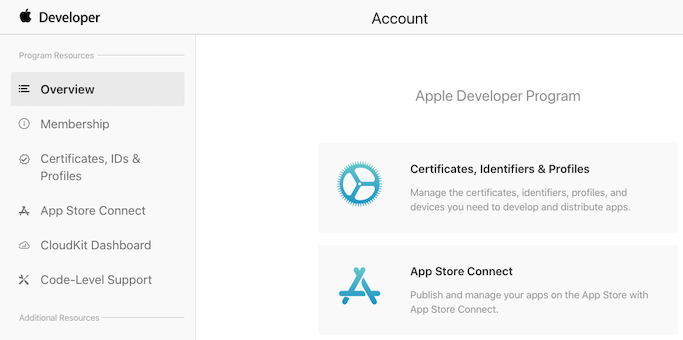
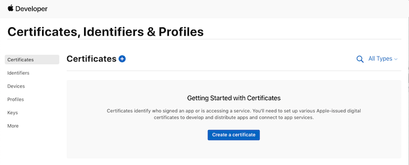
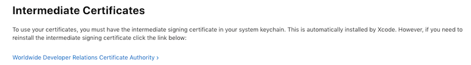
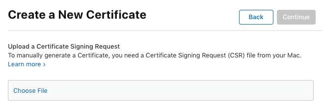
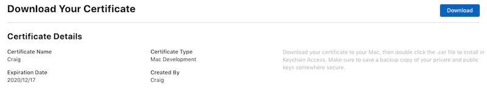
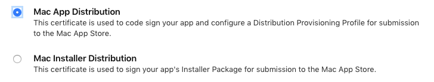
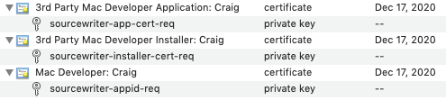

# Certificates and identifiers in Xamarin.Mac

_This guide walks through creating the necessary certificates and identifiers that will be required to publish a Xamarin.Mac app._

## Certificates and identifiers

Visit the [Apple Developer Member Center](http://developer.apple.com) to configure the Mac for development. The main menu is shown below:

Click on the **Certificates, Identifiers & Profiles** link:

Next, click on the **Certificates Link** under the **Mac Apps** section:

Click on the **All** link and click the **+** button:

From here download the **Intermediate Certificates** (Worldwide Developer Relations Certificate Authority and Developer ID Certificate Authority) if required. However, these should automatically be setup for the developer by Xcode.

The remainder of this section walks through each of the four sections to
complete a Mac Developer Account setup.

-   **Register Mac App ID** – The developer will need to follow these steps for each application they write.
-   **Register macOS Systems** – This is only required when adding computers to test with.
-   **Create Certificates** – Only required once when seting-up the certificates, and later when renewing them.
-   **Create Provisioning Profile** – The developer will need to follow these steps for each new application written, and when adding new systems.

Click the **Overview** link at the top left of the page
to return to this menu at any time.

### Register Mac App ID

The developer needs to register an App ID for each application written. Use the steps below to create an entry for a basic sample app called “MacWriter”.

1. Enter a **App ID Description** and select any **App Services** that the application will require: 

	
2. Enter a **Bundle ID** for the app and click the **Continue** button: 

	
3. Verify the information and click the **Submit** button: 

	

Some **App Services** might require further configuration (for example, iCloud). If that is the case, select the new App ID just created and click the **Edit** button:

To configure the iCloud services, click the **Edit** button:

From here the developer can configure the databases that they will be using:

### Register macOS systems

To create a provisioning profile for testing, the developer will need to have their Mac
computers registered. They can register a maximum of 100 computers for testing their Mac Apps.

In the Mac Developer Center, select **All** from the **Devices** section and click the **+** button:

Enter a **Name** and the **UUID** of the computer to add and click the **Continue** button. Review the information and the click **Register** button:

### Create certificates

Use the Certificates section to create several different types of certificates that will be used to sign Mac Applications:

There are three main types of certificate:

-   **Mac Development Certificate** – Optional for general app development, but required if the developer plans to use features like iCloud or push notifications. The developer will need a Development Certificate before they can create Provisioning Profiles that allow them to access those features.
-   **Mac App Store** – The developer will need a certificate for their app and another certificate for the installer.
-   **Developer ID** – Certificates for the app and installer if choosing to distribute outside the Mac App Store.

The following sections will provide examples of creating each of the above certificate types.

#### Mac development certificate

As mentioned previously, Mac App Development Certificate isn't required unless macOS features like iCloud or push notifications are being used.

Do the following to created a new Development Certificate:

1. Select the **Mac Development** radio button and click **Continue**: 

	 
2. The next screen explains how to use Keychain Access to create a certificate signing request file to upload: 

	
3. Choose a meaningful Common Name for the certificate, so that it’s easily recognizable later when the final certificate is created. Remember where the file is saved, so it can be found in the next step: 

	 
4. A certificate request file (extension `.certSigningRequest`) will
be saved locally on the Mac. Remember where it is saved (the default locationis the Desktop) it will need to be chosen in the next step: 

	 
5. Click **Download** to get the certificate and double-click to install it in the **Keychain**: 

	 
6. Click **Download** to get the certificate and double-click to install it in the **Keychain**. The **Developer Certificate Utility** will show the certificates like this: 

	 
7. It will also appear in the **Keychain** like this: 

	 

As previously mentioned the Developer certificate is not always required
unless the developer is implementing macOS features like iCloud and push notifications. It is also required to create a **Development Provisioning Profile**, which will be needed to test Mac App Store apps.

#### Mac App Store certificates

To release an app on the App Store, **Mac App Store** certificate that will be used to sign the application and the Mac Installer Package will need to be created.

1. Select **Mac App Store** as the certificate type and click the **Continue** button: 

	
2. Select the type of certificate that to create (one of each type to release to the App Store will be needed): 

	
3. The next page explains how to use **Keychain Access** to
generate a certificate request file. Follow the instructions: 

	 
4. Choose a descriptive **Common Name** – for example use
the text “App Store Application” in the name: 

	 
5. A certificate request file (extension `.certSigningRequest`) will
be saved locally on the Mac. Remember where it is saved (the default location is the Desktop): 

	 
6. Click **Download** to get your certificate and double-click to install it in the **Keychain**: 

	  
7. Click **Continue** and follow the exact same steps to download another certificate, this time it will be for the *installer*: 

	 
8. Choose a descriptive **Common Name** – for example use
the text “AppStore Installer” in the name: 

	 
9. A certificate request file (extension `.certSigningRequest`) will
be saved locally on the Mac. Remember where it is saved (the default location is the Desktop): 

	  

	 
10. Click **Download** to get the certificate and double-click to install it in the **Keychain**. The Developer Certificate Utility will show the certificates like this: 

	 
11. The two new certificates will now be visible in the **Keychain**: 

	 

#### Developer ID certificates

To self-release a Xamarin.Mac application (not release via the Apple App Store), the developer will need a Developer ID Certificate to sign the app for release and installation.

Do the following:

1. From the **Certificates** section, start by click the **+** button, then select the **Developer ID** radio button: 

	
2. Click the **Continue** button and select the type of Developer ID to create: 

	
3. Two will be required, one to sign the application itself and one to sign the application's installer. Be careful when naming the certificate requests for these keys: use descriptive names that include the text `Application` and `Installer` so they can be distinguished later.
4. The next screen will gives detailed directions on how to create the certificate, click the **Continue** button: 

	
5. Choose a descriptive **Common Name** – for example use
the text “Developer ID Application” in the name: 

	 
6. A certificate request file (extension `.certSigningRequest`) will
be saved locally on your Mac. Remember where it is saved (the default location is the Desktop): 

	  

	 
7. Click **Download** to get the certificate and
double-click to install it in the **Keychain**.
8. Click **Continue** and follow the exact same steps to download another certificate, this time it will be for the *installer*.
9. Choose a descriptive **Common Name** – for example use
the text “Developer ID Installer” in the name: 

	 
10. A certificate request file (extension `.certSigningRequest`) will
be saved locally on the Mac. Remember where it is saved (the default location is the Desktop): 

	 
11. The certificate is then available for download – click the **Download** button before clicking **Done**: 

	 
12. Click **Download** to get the certificate and double-click to install it in the **Keychain**. The **Developer Certificate Utility** will show the certificates like this: 

	 
13. The following items visible in the **Keychain**: 

	 

## Related Links

- [Installation](/visualstudio/mac/installation/)
- [Hello, Mac sample](~/mac/get-started/hello-mac.md)
- [Distribute your apps on the Mac App Store](https://developer.apple.com/devcenter/mac/checklist/)
- [Developer ID and GateKeeper](https://developer.apple.com/resources/developer-id/)
