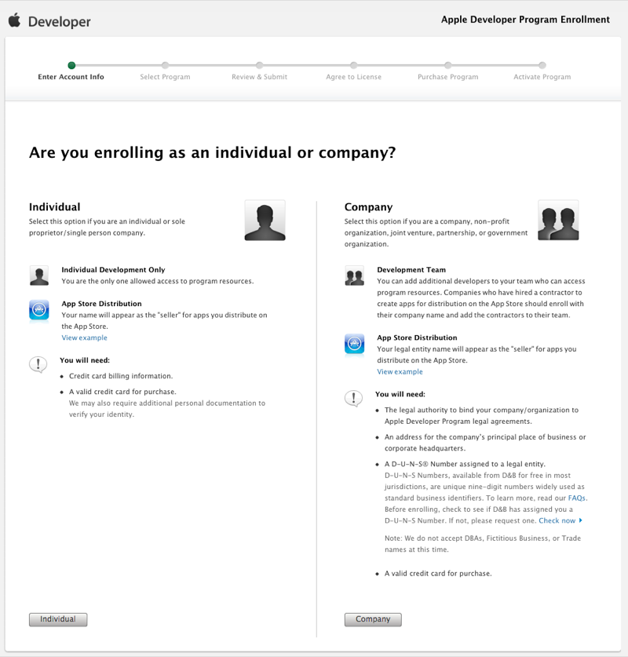

# Publishing Xamarin.Mac Apps to the Mac App Store

## Overview

Xamarin.Mac apps can be distributed in two different ways:

- **Developer ID** – Applications signed with a Developer ID can be distributed outside of the App Store but are recognized by GateKeeper and allowed to install.
- **Mac App Store** – Apps must have an installer package, and both the app and the installer must be signed, for submission to the Mac App Store.

This document explains how to use Visual Studio for Mac and Xcode to setup a Apple
Developer account and configure a Xamarin.Mac project for each deployment
type.

## Mac developer program

When you join the [Mac Developer Program](https://developer.apple.com/devcenter/mac/) the developer will be offered a choice to join as an Individual or a Company, as shown in the screenshot below:

Choose the correct enrollment type for your situation.

> [!NOTE]
> The choices made here will affect the way some screens appear when configuring a developer account. The descriptions and screenshots in this document are done from the perspective of an **Individual** developer account. In a **Company**, some options will only be available to **Team Admin** users.

### [Certificates and identifiers](~/mac/deploy-test/publishing-to-the-app-store/certificates-identifiers.md)

This guide walks through creating the necessary Certificates and Identifiers that will be required to publish a Xamarin.Mac app.

### [Create provisioning profile](~/mac/deploy-test/publishing-to-the-app-store/profiles.md)

This guide walks through creating the necessary Provisioning Profiles that will be required to publish a Xamarin.Mac app.

### [Mac app configuration](~/mac/deploy-test/publishing-to-the-app-store/app-configuration.md)

This guide walks through configuring a Xamarin.Mac app for publication.

### [Sign with Developer ID](~/mac/deploy-test/publishing-to-the-app-store/signing.md)

This guide walks through signing a Xamarin.Mac app with a Developer ID for publication.

### [Bundle for Mac App Store](~/mac/deploy-test/publishing-to-the-app-store/bundling.md)

This guide walks through bundling a Xamarin.Mac app for publication to the Mac App Store.

### [Upload to Mac App Store](~/mac/deploy-test/publishing-to-the-app-store/uploading.md)

This guide walks through uploading a Xamarin.Mac app for publication to the Mac App Store.

## Related links

- [Installation](/visualstudio/mac/installation/)
- [Hello, Mac sample](~/mac/get-started/hello-mac.md)
- [Developer ID and GateKeeper](https://developer.apple.com/developer-id/)
