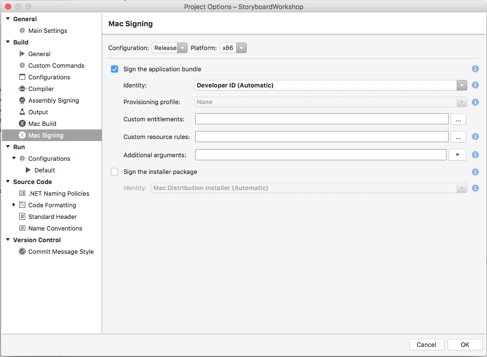
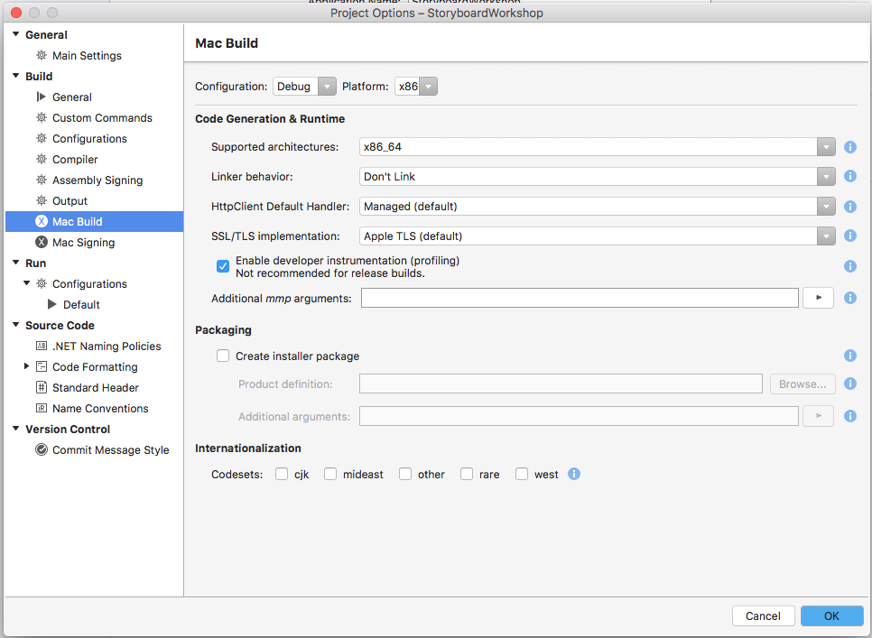
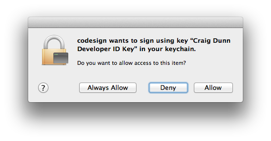
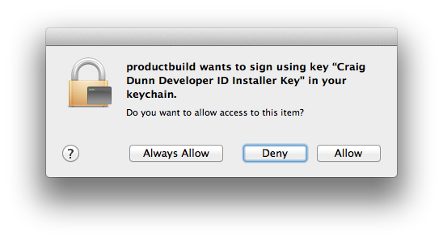

# Signing Xamarin.Mac Apps with a Developer ID

If the developer plans to distribute an app directly to macOS
users, Apple recommends that they code-sign it with their Developer ID so that it can be installed on macOS systems with **GateKeeper** enabled. If the app has not been signed, **GateKeeper** will prevent users from installing with an alert message (they can bypass this restricting by holding down the Control key while launching).

Read more about [Developer ID and GateKeeper](https://developer.apple.com/developer-id/) and [Distributing Outside the Mac App Store](https://developer.apple.com/library/content/documentation/IDEs/Conceptual/AppDistributionGuide/Introduction/Introduction.html) on Apple’s
website.

## Code signing options

To build an app for deployment directly to users (NOT via the Mac App
Store) set the **Signing Settings** to use the **Developer ID**. Ensure to edit the **Release** configuration.

 

## Build

Before building, ensure to selected the correct configuration and select to create an install package in the **Mac Build** settings:

When building the app, the developer will be prompted to use both certificates:

 

 

After the application has been built, the developer can right-click on the project and choose **Open Containing Folder** to find the package file (in the `bin/Release` directory). This package file includes an
installer for the application, so it can be distributed to any macOS user
for installation.

 

## Related links

- [Installation](~//mac/get-started/installation.md)
- [Hello, Mac sample](~//mac/get-started/hello-mac.md)
- [Distribute your apps on the Mac App Store](https://developer.apple.com/devcenter/mac/checklist/)
- [Tools Guide : Code Signing Your App](https://developer.apple.com/library/mac/#documentation/ToolsLanguages/Conceptual/OSXWorkflowGuide/CodeSigning/CodeSigning.html)
- [Developer ID and GateKeeper](https://developer.apple.com/developer-id/)
