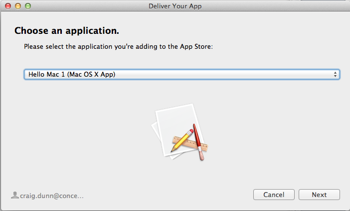
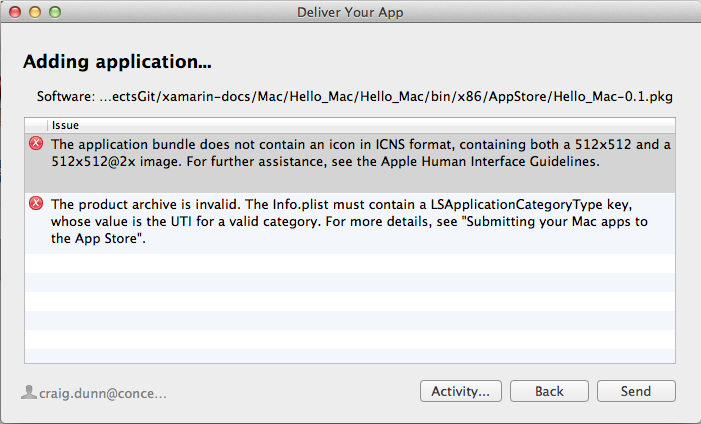

# Upload to Mac App Store

_This guide walks through uploading a Xamarin.Mac app for publication to the Mac App Store._

Applications are submitted for Mac App Store approval via [iTunes Connect](http://itunesconnect.apple.com/).

1. Choose a **macOS App** to create: 

	

2. Enter the application’s name and other details. The developer can only choose from an existing **Bundle ID** that has been created
previously: 

	

3. Select the availability date and price. Regardless of the availability
date the developer selects, the app will only become available for sale after it has been approved. This value can be set far in the future if the developer wants more control over the actual availability date: 

	

4. Enter the app’s information, including the App Store category it
belongs in: 

	 

	Select the ratings that apply: 

	 

	Description, keywords and contact URLs: 

	 

	Contact information and advice for the App Store reviewers: 

	 

	And finally, screenshots: 

	 

	Screenshots should be in JPG, TIF or PNG format, 1280x800, 1440x900,
2880x1800 or 2560x1600 pixels in size. Press **Save** to
finish.

5. The app information is shown for review. Click **View Details** to change the status: 

	

6. In the details view, click Ready to Upload Binary to submit
The application package file: 

	

7. Answer the cryptography question: 

	

8. The site will advise when it is ready to accept the application
package file: 

	

9. Start Application Loader and ensure to be logged in with the Apple ID.
Choose **Deliver Your App** to proceed: 

	

10. Select from the list of applications in **Ready to Upload
Binary** status and click **Next**: 

	

11. Review the application metadata and click **Choose...** to find the package file: 

	

12. Find the package file that was built in Visual Studio for Mac using the App Store build configuration: 

	

13. Press **Send**: 

	

14. The package will be validated and any errors reported. Fix these errors and re-upload. When the upload is successfully completed, the app will be automatically submitted for review by the App Store team: 

	

When the application has been approved, it will be available for download or purchase from the Mac App Store.

## Related Links

- [Installation](~//mac/get-started/installation.md)
- [Hello, Mac sample](~//mac/get-started/hello-mac.md)
- [Distribute your apps on the Mac App Store](https://developer.apple.com/devcenter/mac/checklist/)
- [Tools Guide : Code Signing Your App](https://developer.apple.com/library/mac/#documentation/ToolsLanguages/Conceptual/OSXWorkflowGuide/CodeSigning/CodeSigning.html)
- [Developer ID and GateKeeper](https://developer.apple.com/resources/developer-id/)
