# Hello, Mac – Walkthrough

Xamarin.Mac allows for the development of fully native Mac apps in C# and .NET using the same macOS APIs that are used when developing in *Objective-C* or *Swift*. Because Xamarin.Mac integrates directly with Xcode, the developer can use Xcode's _Interface Builder_ to create an app's user interfaces (or optionally create them directly in C# code).

Additionally, since Xamarin.Mac applications are written in C# and .NET, code can be shared with Xamarin.iOS and Xamarin.Android mobile apps; all while delivering a native experience on each platform.

This article will introduce the key concepts needed to create a Mac app using Xamarin.Mac, Visual Studio for Mac and Xcode's Interface Builder by walking through the process of building a simple **Hello, Mac** app that counts the number of times a button has been clicked:

[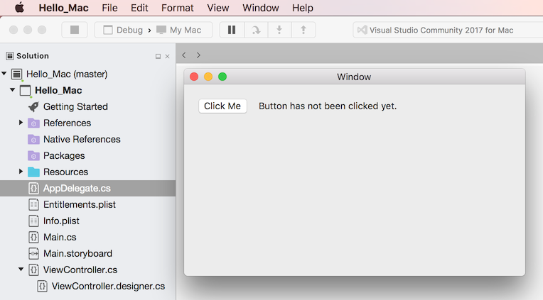](hello-mac-images/run02.png#lightbox)

The following concepts will be covered:

- **Visual Studio for Mac**  – Introduction to the Visual Studio for Mac and how to create Xamarin.Mac applications with it.
- **Anatomy of a Xamarin.Mac Application** – What a Xamarin.Mac application consists of.
- **Xcode’s Interface Builder** – How to use Xcode’s Interface Builder to define an app’s user interface.
- **Outlets and Actions** – How to use Outlets and Actions to wire up controls in the user interface.
- **Deployment/Testing** – How to run and test a Xamarin.Mac app.

## Requirements

Xamarin.Mac application development requires:

- A Mac computer running macOS High Sierra (10.13) or higher.
- [Xcode 10 or higher](https://itunes.apple.com/us/app/xcode/id497799835?mt=12).
- The latest version of [Xamarin.Mac and Visual Studio for Mac](/visualstudio/mac/installation/).

To run an application built with Xamarin.Mac, you will need:

- A Mac computer running macOS 10.7 or greater.

> [!WARNING]
> The upcoming Xamarin.Mac 4.8 release will only support macOS 10.9 or higher.
> Previous versions of Xamarin.Mac supported macOS 10.7 or higher, but
> these older macOS versions lack sufficient TLS infrastructure to support
> TLS 1.2. To target macOS 10.7 or macOS 10.8, use Xamarin.Mac 4.6 or
> earlier.

## Starting a new Xamarin.Mac App in Visual Studio for Mac

As stated above, this guide will walk through the steps to create a Mac app called `Hello_Mac` that adds a single button and label to the main window. When the button is clicked, the label will display the number of times it has been clicked.

To get started, do the following steps:

1. Start Visual Studio for Mac:

    [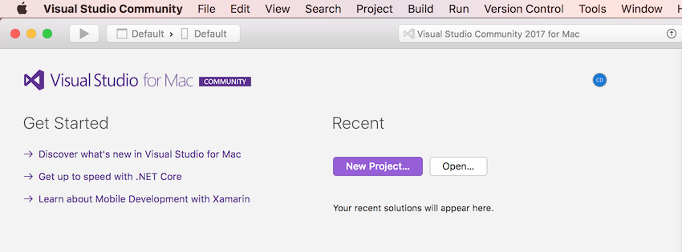](hello-mac-images/setup01.png#lightbox)

2. Click on the **New Project...** button to open the **New Project** dialog box, then select **Mac** > **App** > **Cocoa App** and click the **Next** button:

    [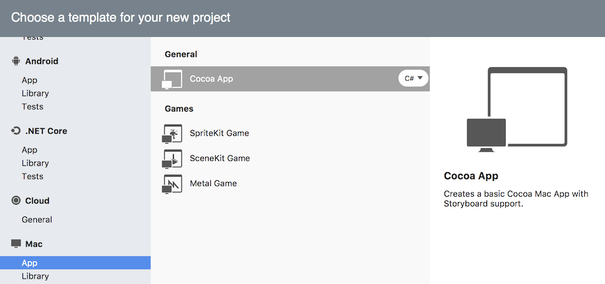](hello-mac-images/setup02.png#lightbox)

3. Enter `Hello_Mac` for the **App Name**, and keep everything else as default. Click **Next**:

    [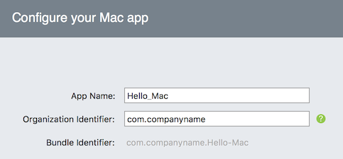](hello-mac-images/setup03.png#lightbox)

4. Confirm the location of the new project on your computer:

    [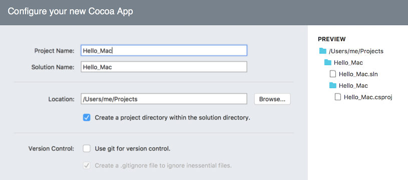](hello-mac-images/setup04.png#lightbox)

5. Click the **Create** button.

Visual Studio for Mac will create the new Xamarin.Mac app and display the default files that get added to the app's solution:

[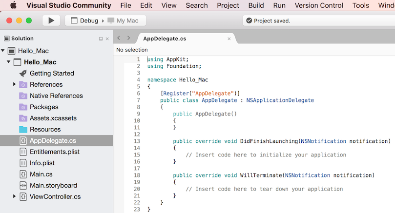](hello-mac-images/project01.png#lightbox)

Visual Studio for Mac uses the same **Solution** and **Project** structure as Visual Studio 2019. A solution is a container that can hold one or more projects; projects can include applications, supporting libraries, test applications, etc. The **File > New Project** template creates a solution and an application project automatically.

## Anatomy of a Xamarin.Mac Application

Xamarin.Mac application programming is very similar to working with Xamarin.iOS. iOS uses the CocoaTouch framework, which is a slimmed-down version of Cocoa, used by Mac.

Take a look at the files in the project:

- **Main.cs** contains the main entry point of the app. When the app is launched, the `Main` class contains the very first method that is run.
- **AppDelegate.cs** contains the `AppDelegate` class that is responsible for listening to events from the operating system.
- **Info.plist** contains app properties such as the application name, icons, etc.
- **Entitlements.plist** contains the entitlements for the app and allows access to things such as Sandboxing and iCloud support.
- **Main.storyboard** defines the user interface (Windows and Menus) for an app and lays out the interconnections between Windows via Segues. Storyboards are XML files that contain the definition of views (user interface elements). This file can be created and maintained by Interface Builder inside of Xcode.
- **ViewController.cs**  is the controller for the main window. Controllers will be covered in detail in another article, but for now, a controller can be thought of the main engine of any particular view.
- **ViewController.designer.cs** contains plumbing code that helps integrate with the main screen’s user interface.

The following sections, will take a quick look through some of these files. Later, they will be explored in more detail, but it’s a good idea to understand their basics now.

### Main.cs

The **Main.cs** file is very simple. It contains a static `Main` method which creates a new Xamarin.Mac app instance and passes the name of the class that will handle OS events, which in this case is the `AppDelegate` class:

```csharp
using System;
using System.Drawing;
using Foundation;
using AppKit;
using ObjCRuntime;

namespace Hello_Mac
{
    class MainClass
    {
        static void Main (string[] args)
        {
            NSApplication.Init ();
            NSApplication.Main (args);
        }
    }
}
```

### AppDelegate.cs

The `AppDelegate.cs` file contains an `AppDelegate` class, which is responsible for creating windows and listening to OS events:

```csharp
using AppKit;
using Foundation;

namespace Hello_Mac
{
    [Register ("AppDelegate")]
    public class AppDelegate : NSApplicationDelegate
    {
        public AppDelegate ()
        {
        }

        public override void DidFinishLaunching (NSNotification notification)
        {
            // Insert code here to initialize your application
        }

        public override void WillTerminate (NSNotification notification)
        {
            // Insert code here to tear down your application
        }
    }
}
```

This code is probably unfamiliar unless the developer has built an iOS app before, but it’s fairly simple.

The `DidFinishLaunching` method runs after the app has been instantiated, and it’s responsible for actually creating the app's window and beginning the process of displaying the view in it.

The `WillTerminate` method will be called when the user or the system has instantiated a shutdown of the app. The developer should use this method to finalize the app before it quits (such as saving user preferences or window size and location).

### ViewController.cs

Cocoa (and by derivation, CocoaTouch) uses what’s known as the *Model View Controller* (MVC) pattern. The `ViewController` declaration represents the object that controls the actual app window. Generally, for every window created (and for many other things within windows), there is a controller, which is responsible for the window’s lifecycle, such as showing it, adding new views (controls) to it, etc.

The `ViewController` class is the main window’s controller. The controller is responsible for the life cycle of the main window. This will be examined in detail later, for now take a quick look at it:

```csharp
using System;

using AppKit;
using Foundation;

namespace Hello_Mac
{
    public partial class ViewController : NSViewController
    {
        public ViewController (IntPtr handle) : base (handle)
        {
        }

        public override void ViewDidLoad ()
        {
            base.ViewDidLoad ();

            // Do any additional setup after loading the view.
        }

        public override NSObject RepresentedObject {
            get {
                return base.RepresentedObject;
            }
            set {
                base.RepresentedObject = value;
                // Update the view, if already loaded.
            }
        }
    }
}
```

### ViewController.Designer.cs

The designer file for the Main Window class is initially empty, but it will be automatically populated by Visual Studio for Mac as the user interface is created with Xcode Interface Builder:

```csharp
// WARNING
//
// This file has been generated automatically by Visual Studio for Mac to store outlets and
// actions made in the UI designer. If it is removed, they will be lost.
// Manual changes to this file may not be handled correctly.
//
using Foundation;

namespace Hello_Mac
{
    [Register ("ViewController")]
    partial class ViewController
    {
        void ReleaseDesignerOutlets ()
        {
        }
    }
}
```

Designer files should not be edited directly, as they’re automatically managed by Visual Studio for Mac to provide the plumbing code that allows access to controls that have been added to any window or view in the app.

With the Xamarin.Mac app project created and a basic understanding of its components, switch to Xcode to create the user interface using Interface Builder.

### Info.plist

The `Info.plist` file contains information about the Xamarin.Mac app such as its **Name** and **Bundle Identifier**:

[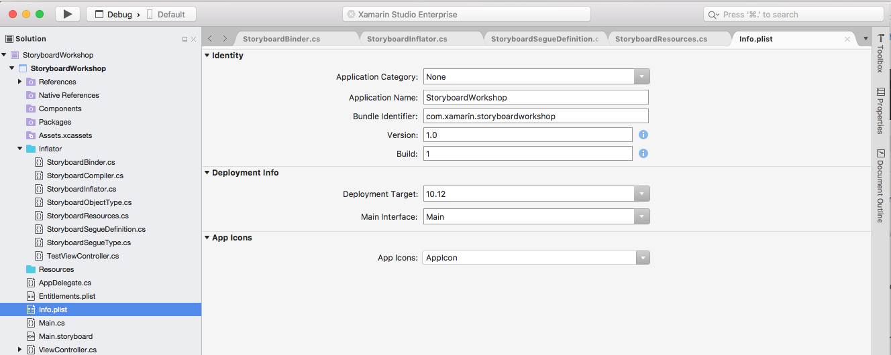](hello-mac-images/infoplist01.png#lightbox)

It also defines the _Storyboard_ that will be used to display the user interface for the Xamarin.Mac app under the **Main Interface** dropdown. In example above, `Main` in the dropdown relates to the `Main.storyboard` in the project's source tree in the **Solution Explorer**. It also defines the app's icons by specifying the *Asset Catalog* that contains them (**AppIcon** in this case).

### Entitlements.plist

The app's `Entitlements.plist` file controls entitlements that the Xamarin.Mac app has such as **Sandboxing** and **iCloud**:

[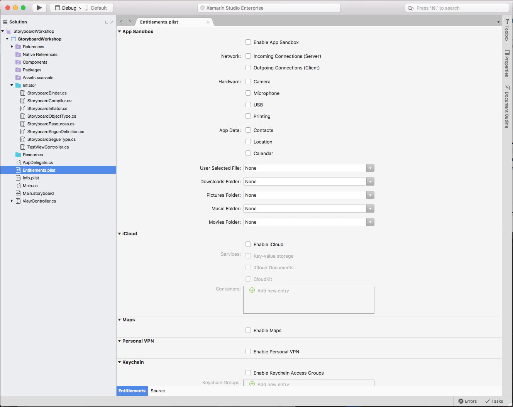](hello-mac-images/entitlements01.png#lightbox)

For the Hello World example, no entitlements will be required. The next section shows how to use Xcode's Interface Builder to edit the **Main.storyboard** file and define the Xamarin.Mac app's UI.

## Introduction to Xcode and Interface Builder

As part of Xcode, Apple has created a tool called Interface Builder, which allows a developer to create a user interface visually in a designer. Xamarin.Mac integrates fluently with Interface Builder, allowing UI to be created with the same tools as Objective-C users.

To get started, double-click the `Main.storyboard` file in the **Solution Explorer** to open it for editing in Xcode and Interface Builder:

[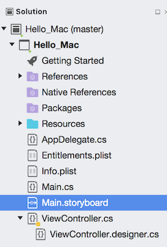](hello-mac-images/xcode01.png#lightbox)

This should launch Xcode and look like this screenshot:

[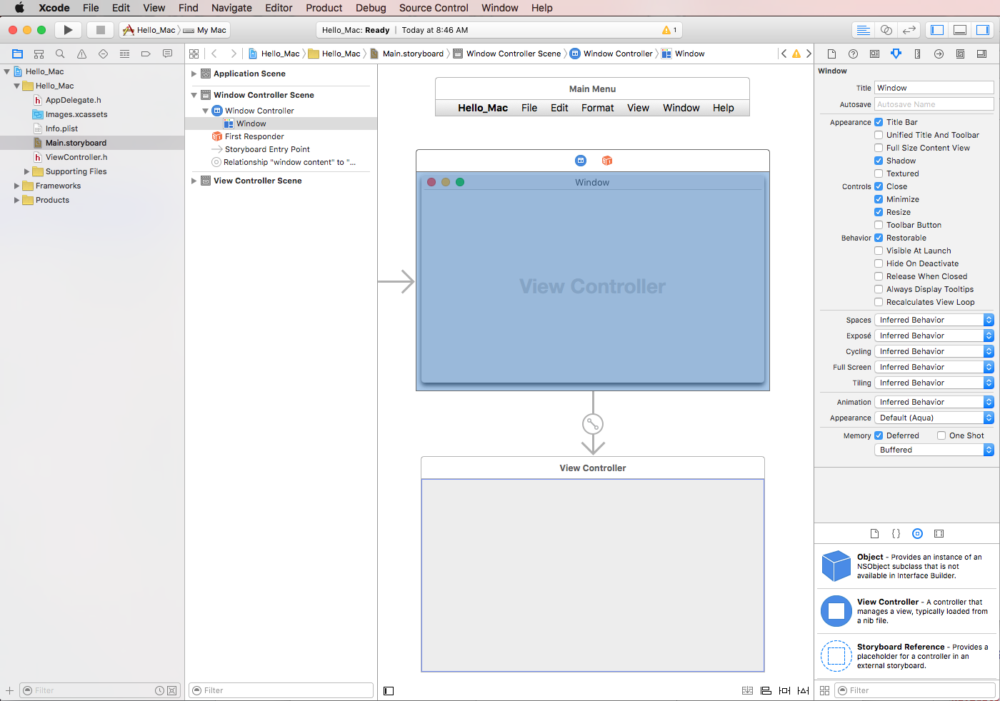](hello-mac-images/xcode02.png#lightbox)

Before starting to design the interface, take a quick overview of Xcode to orient with the main features that will be used.

> [!NOTE]
> The developer doesn't have to use Xcode and Interface Builder to create the user interface for a Xamarin.Mac app, the UI can be created directly from C# code but that is beyond the scope of this article. For the sake of simplicity, it will be using Interface Builder to create the user interface throughout the rest of this tutorial.

### Components of Xcode

When opening a **.storyboard** file in Xcode from Visual Studio for Mac, it opens with a **Project Navigator** on the left, the **Interface Hierarchy** and **Interface Editor** in the middle, and a **Properties & Utilities** section on the right:

[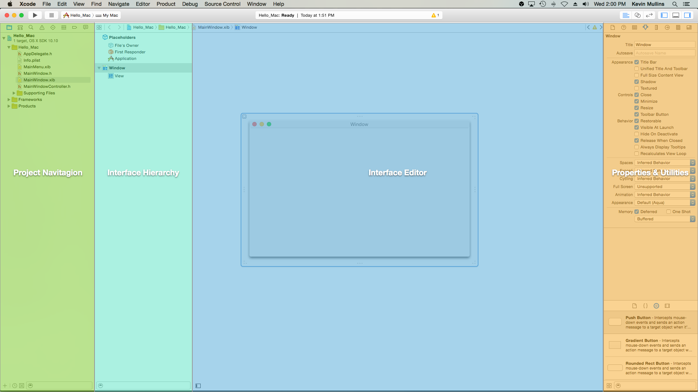](hello-mac-images/xcode03.png#lightbox)

The following sections take a look at what each of these Xcode features do and how to use them to create the interface for a Xamarin.Mac app.

### Project Navigation

When opening a **.storyboard** file for editing in Xcode, Visual Studio for Mac creates a *Xcode Project File* in the background to communicate changes between itself and Xcode. Later, when the developer switches back to Visual Studio for Mac from Xcode, any changes made to this project are synchronized with the Xamarin.Mac project by Visual Studio for Mac.

The **Project Navigation** section allows the developer to navigate between all of the files that make up this _shim_ Xcode project. Typically, they will only be interested in the `.storyboard` files in this list such as `Main.storyboard`.

### Interface Hierarchy

The **Interface Hierarchy** section allows the developer to easily access several key properties of the user interface such as its **Placeholders** and main **Window**. This section can be used to access the individual elements (views) that make up the user interface and to adjust the way they are nested by dragging them around within the hierarchy.

### Interface Editor

The **Interface Editor** section provides the surface on which the user interface is graphically laid out. Drag elements from the **Library** section of the **Properties & Utilities** section to create the design. As user interface elements (views) are added to the design surface, they will be added to the **Interface Hierarchy** section in the order that they appear in the **Interface Editor**.

### Properties & Utilities

The **Properties & Utilities** section is divided into two main sections, **Properties** (also called Inspectors) and the **Library**:

[](hello-mac-images/xcode04.png#lightbox)

Initially this section is almost empty, however if the developer selects an element in the **Interface Editor** or **Interface Hierarchy**, the **Properties** section will be populated with information about the given element and properties that they can adjust.

Within the **Properties** section, there are eight different *Inspector Tabs*, as shown in the following illustration:

[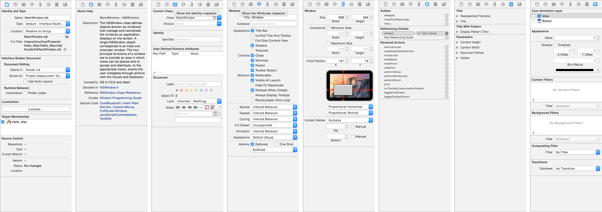](hello-mac-images/xcode05.png#lightbox)

### Properties & Utility Types

From left-to-right, these tabs are:

- **File Inspector** – The File Inspector shows file information, such as the file name and location of the Xib file that is being edited.
- **Quick Help** – The Quick Help tab provides contextual help based on what is selected in Xcode.
- **Identity Inspector** – The Identity Inspector provides information about the selected control/view.
- **Attributes Inspector** – The Attributes Inspector allows the developer to customize various attributes of the selected control/view.
- **Size Inspector** – The Size Inspector allows the developer to control the size and resizing behavior of the selected control/view.
- **Connections Inspector** – The Connections Inspector shows the **Outlet** and **Action** connections of the selected controls. Outlets and Actions will be discussed in detail below.
- **Bindings Inspector** – The Bindings Inspector allows the developer to configure controls so that their values are automatically bound to data models.
- **View Effects Inspector** – The View Effects Inspector allows the developer to specify effects on the controls, such as animations.

Use the **Library** section to find controls and objects to place into the designer to graphically build the user interface:

[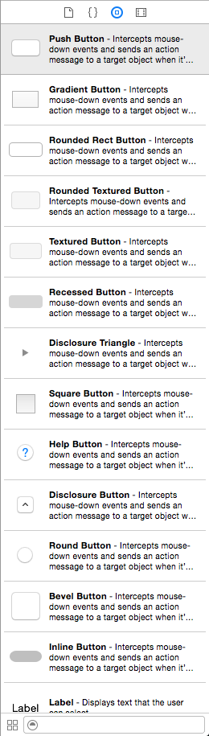](hello-mac-images/xcode06.png#lightbox)

## Creating the Interface

With the basics of the Xcode IDE and Interface Builder covered, the developer can create the user interface for the main view.

Follow these steps to use Interface Builder:

1. In Xcode, drag a **Push Button** from the **Library Section**:

    [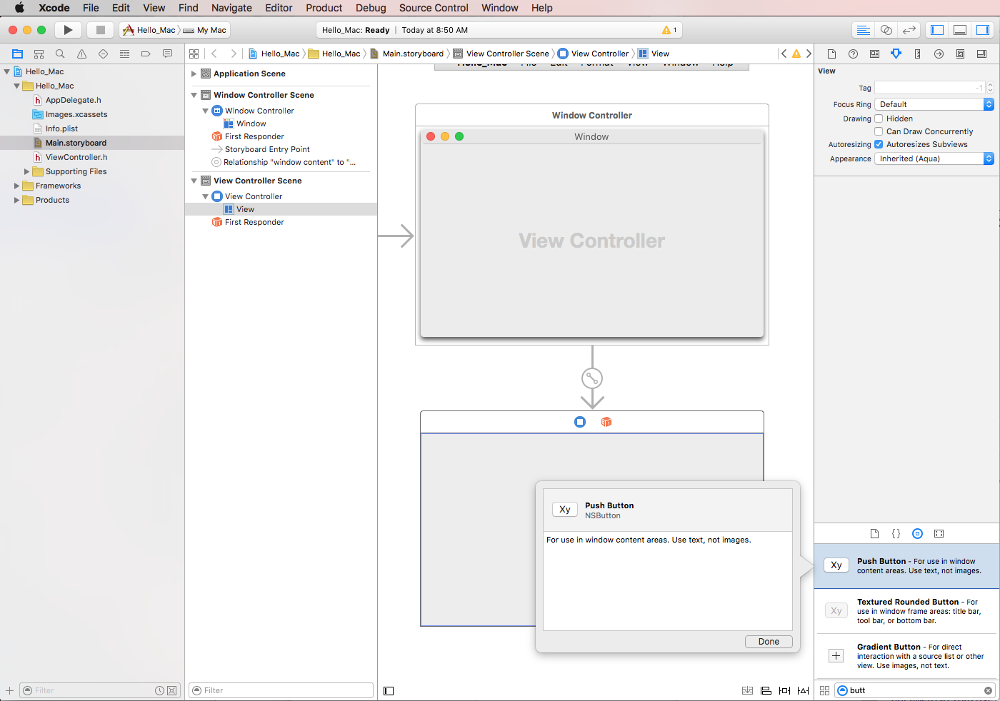](hello-mac-images/xcode07.png#lightbox)

2. Drop the button onto the **View** (under the **Window Controller**) in the **Interface Editor**:

    [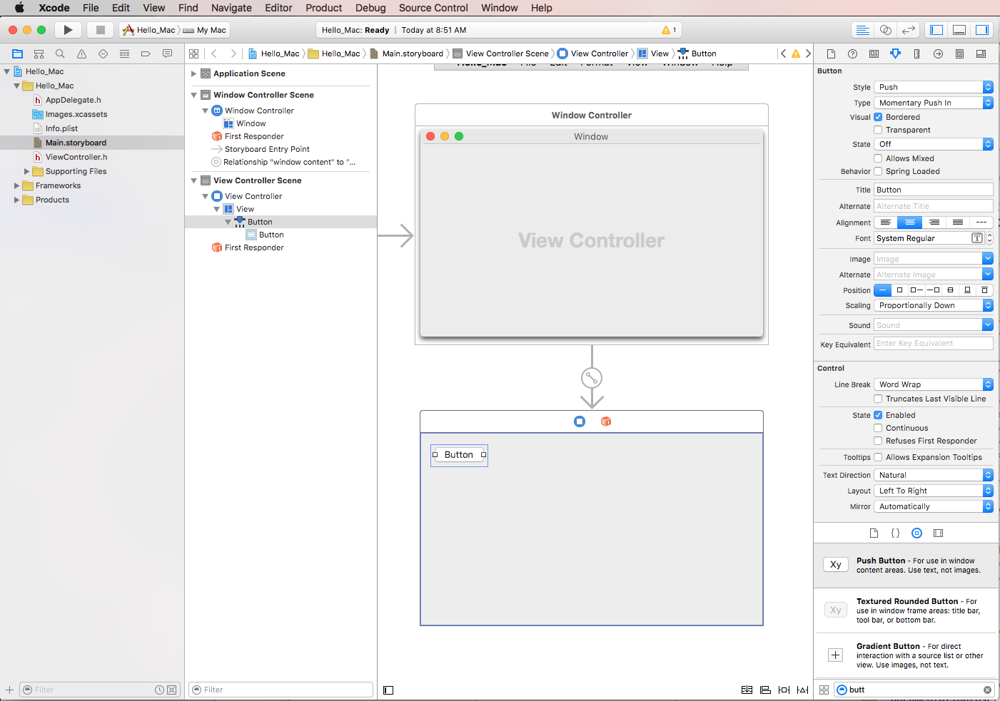](hello-mac-images/xcode08.png#lightbox)

3. Click on the **Title** property in the **Attribute Inspector** and change the button's title to **Click Me**:

    [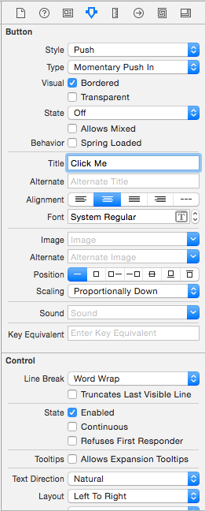](hello-mac-images/xcode09.png#lightbox)

4. Drag a **Label** from the **Library Section**:

    [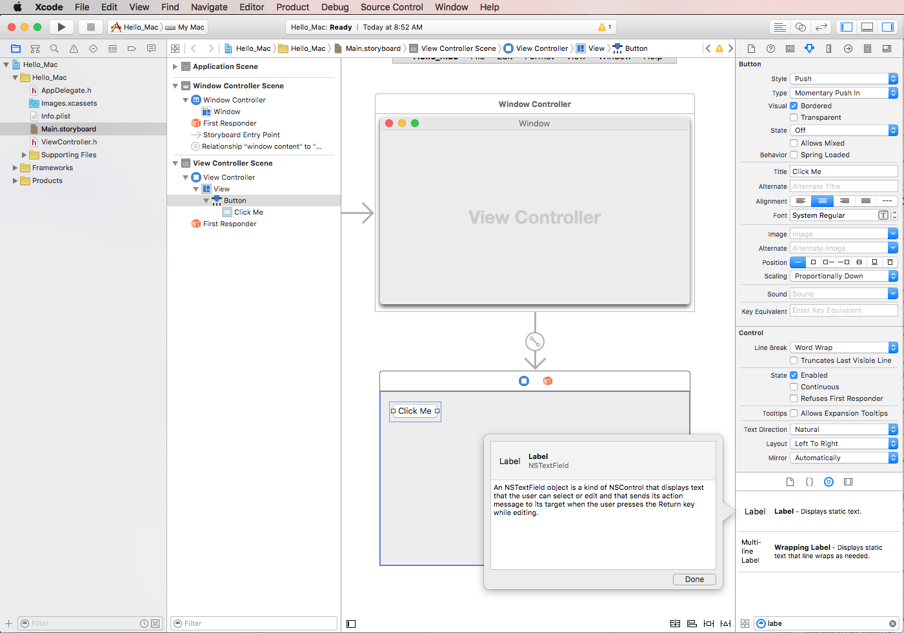](hello-mac-images/xcode10.png#lightbox)

5. Drop the label onto the **Window** beside the button in the **Interface Editor**:

    [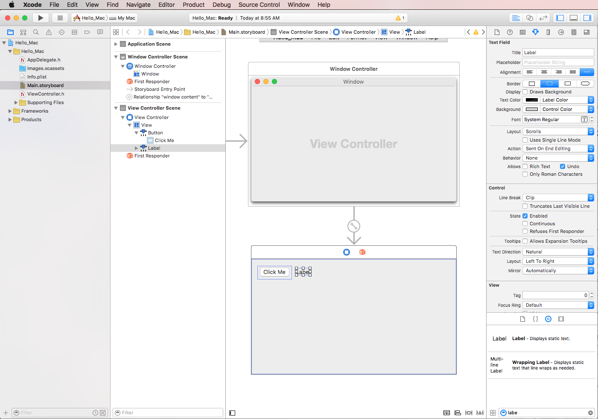](hello-mac-images/xcode11.png#lightbox)

6. Grab the right handle on the label and drag it until it is near the edge of the window:

    [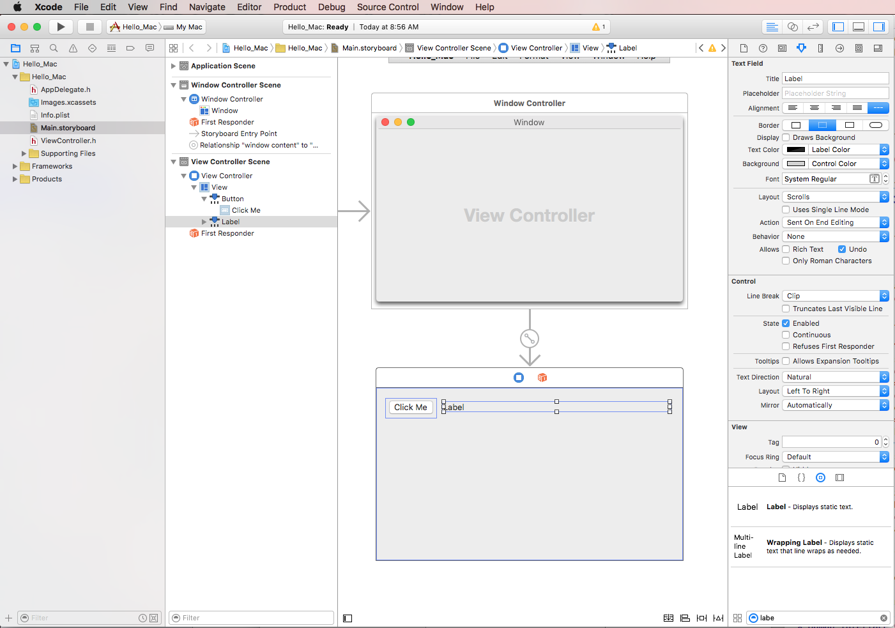](hello-mac-images/xcode12.png#lightbox)

7. Select the Button just added in the **Interface Editor**, and click the **Constraints Editor** icon at the bottom of the window:

    [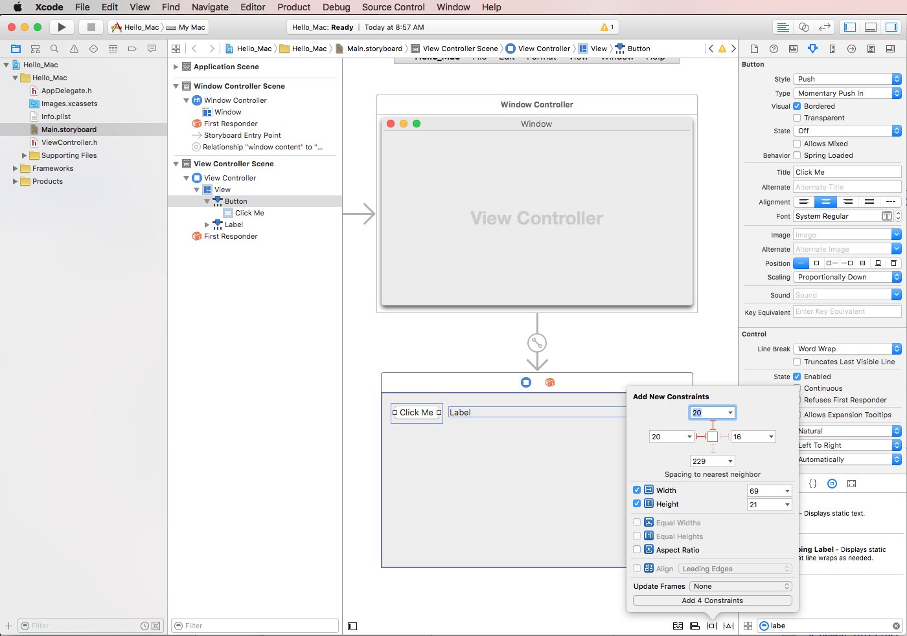](hello-mac-images/xcode13.png#lightbox)

8. At the top of the editor, click the **Red I-Beams** at the top and left. As the window is resized, this will keep the button in the same location at the top left corner of the screen.

9. Next, check the **Height** and **Width** boxes and use the default sizes. This keeps the button at the same size when the window resizes.

10. Click the **Add 4 Constraints** button to add the constraints and close the editor.

11. Select the label and click the **Constraints Editor** icon again:

    [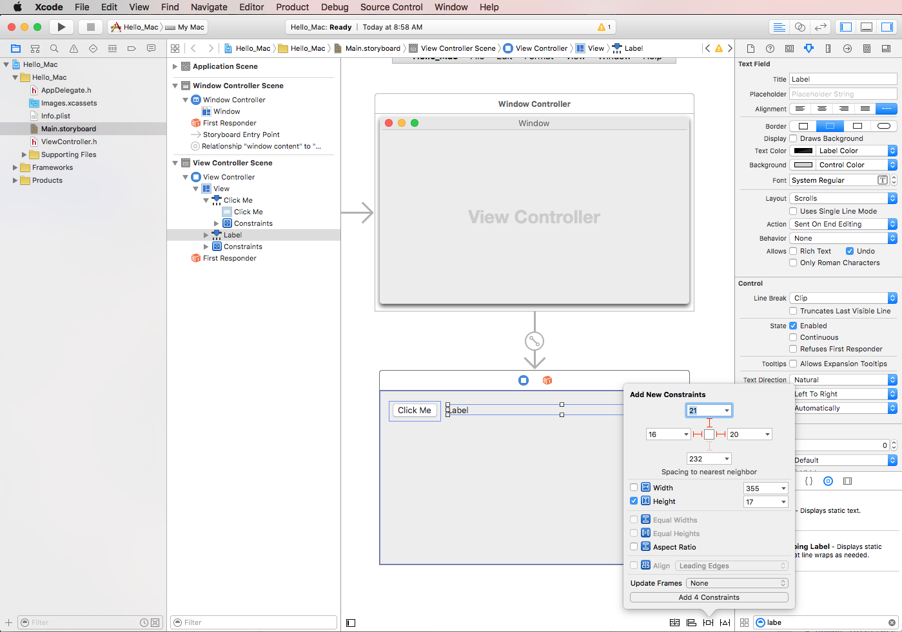](hello-mac-images/xcode14.png#lightbox)

12. By clicking **Red I-Beams** at the top, right and left of the **Constraints Editor**, tells the label to be stuck to its given X and Y locations and to grow and shrink as the window is resized in the running application.

13. Again, check the **Height** box and use the default size, then click the **Add 4 Constraints** button to add the constraints and close the editor.

14. Save the changes to the user interface.

While resizing and moving controls around, notice that Interface Builder gives helpful snap hints that are based on [macOS Human Interface Guidelines](https://developer.apple.com/design/human-interface-guidelines/macos/overview/themes/). These guidelines will help the developer to create high quality apps that will have a familiar look and feel for Mac users.

Look in the **Interface Hierarchy** section to see how the layout and hierarchy of the elements that make up the user interface are shown:

[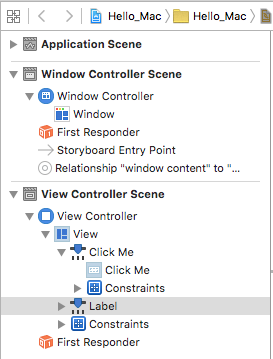](hello-mac-images/xcode15.png#lightbox)

From here the developer can select items to edit or drag to reorder UI elements if needed. For example, if a UI element was being covered by another element, they could drag it to the bottom of the list to make it the top-most item on the window.

With the user interface created, the developer will need to expose the UI items so that Xamarin.Mac can access and interact with them in C# code. The next section, **Outlets and Actions**, shows how to do this.

### Outlets and Actions

So what are **Outlets** and **Actions**? In traditional .NET user interface programming, a control in the user interface is automatically exposed as a property when it’s added. Things work differently in Mac, simply adding a control to a view doesn’t make it accessible to code. The developer must explicitly expose the UI element to code. In order do this, Apple provides two options:

- **Outlets** – Outlets are analogous to properties. If the developer wires up a control to an Outlet, it’s exposed to the code via a property, so they can do things like attach event handlers, call methods on it, etc.
- **Actions** – Actions are analogous to the command pattern in WPF. For example, when an Action is performed on a control, say a button click, the control will automatically call a method in the code. Actions are powerful and convenient because the developer can wire up many controls to the same Action.

In Xcode, **Outlets** and **Actions** are added directly in code via *Control-dragging*. More specifically, this means that to create an **Outlet** or **Action**, the developer will choose a control element to add an **Outlet** or **Action** to, hold down the **Control** key on the keyboard, and drag that control directly into the code.

For Xamarin.Mac developers, this means that the developer will drag into the Objective-C stub files that correspond to the C# file where they want to create the **Outlet** or **Action**. Visual Studio for Mac created a file called `ViewController.h` as part of the shim Xcode Project it generated to use Interface Builder:

[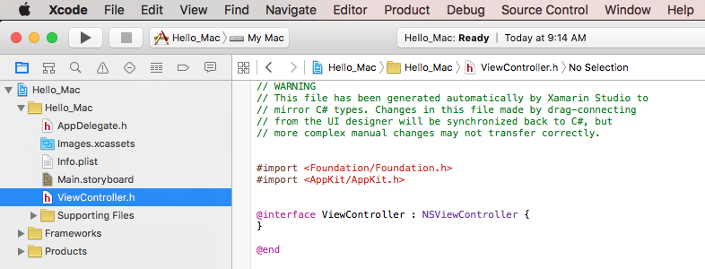](hello-mac-images/xcode16.png#lightbox)

This stub `.h` file mirrors the `ViewController.designer.cs` that is automatically added to a Xamarin.Mac project when a new `NSWindow` is created. This file will be used to synchronize the changes made by Interface Builder and is where the **Outlets** and **Actions** are created so that UI elements are exposed to C# code.

#### Adding an Outlet

With a basic understanding of what **Outlets** and **Actions** are,  create an **Outlet** to expose the Label created to our C# code.

Do the following:

1. In Xcode at the far right top-hand corner of the screen, click the **Double Circle** button to open the **Assistant Editor**:

    [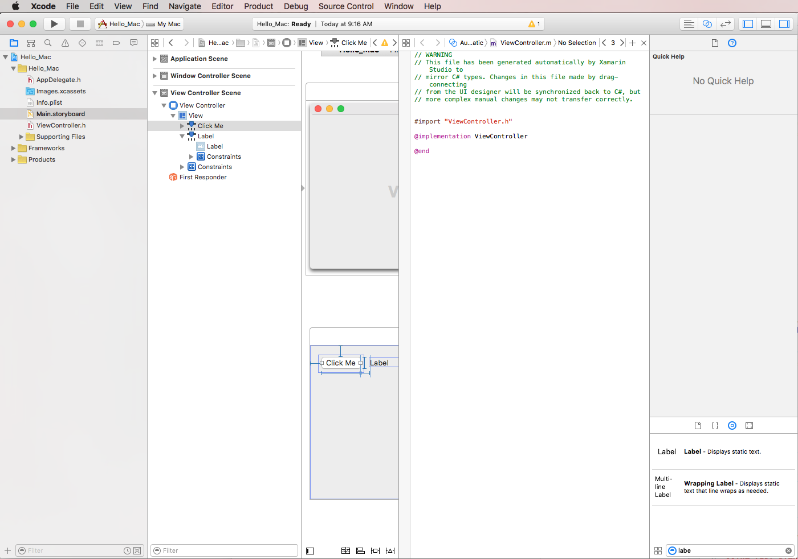](hello-mac-images/outlet01.png#lightbox)

2. The Xcode will switch to a split-view mode with the **Interface Editor** on one side and a **Code Editor** on the other.

3. Notice that Xcode has automatically picked the **ViewController.m** file in the **Code Editor**, which is incorrect. From the discussion on what **Outlets** and **Actions** are above, the developer will need to have the **ViewController.h** selected.

4. At the top of the **Code Editor** click on the **Automatic Link** and select the `ViewController.h` file:

    [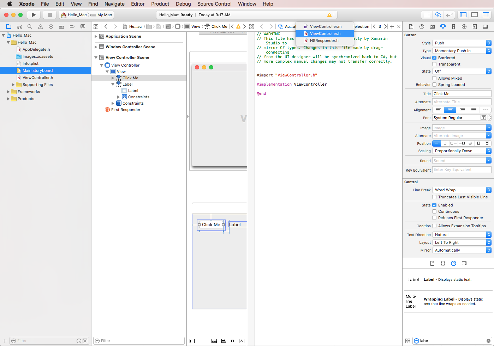](hello-mac-images/outlet02.png#lightbox)

5. Xcode should now have the correct file selected:

    [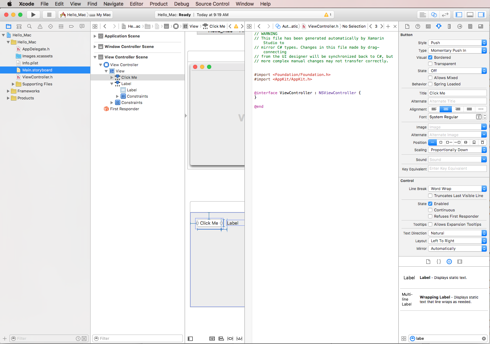](hello-mac-images/outlet03.png#lightbox)

6. **The last step was very important!**: if you didn't have the correct file selected, you won't be able to create **Outlets** and **Actions**, or they will be exposed to the wrong class in C#!

7. In the **Interface Editor**, hold down the **Control** key on the keyboard and click-drag the label created above onto the code editor just below the `@interface ViewController : NSViewController {}` code:

    [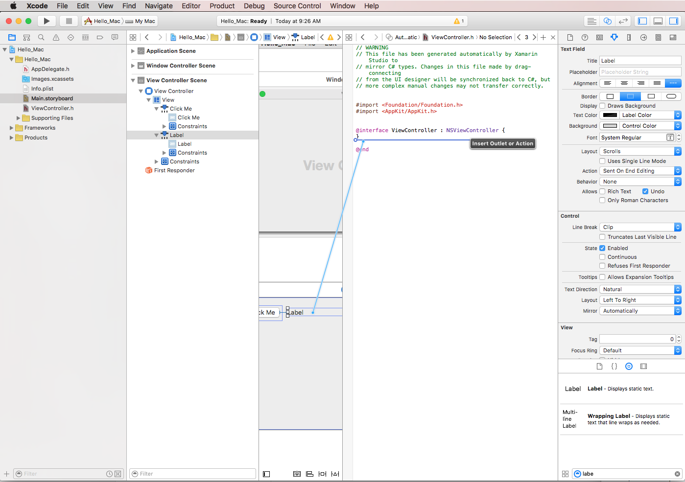](hello-mac-images/outlet04.png#lightbox)

8. A dialog box will be displayed. Leave the **Connection** set to **Outlet** and enter `ClickedLabel` for the **Name**:

    [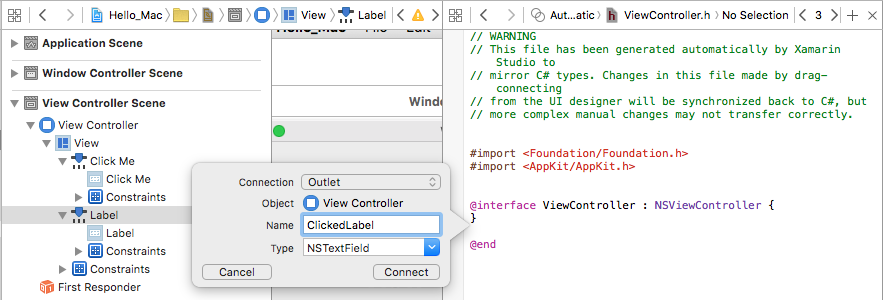](hello-mac-images/outlet05.png#lightbox)

9. Click the **Connect** button to create the **Outlet**:

    [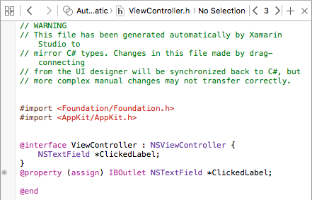](hello-mac-images/outlet06.png#lightbox)

10. Save the changes to the file.

#### Adding an Action

Next, expose the button to C# code. Just like the Label above, the developer could wire the button up to an **Outlet**. Since we only want to respond to the button being clicked, use an **Action** instead.

Do the following:

1. Ensure that Xcode is still in the **Assistant Editor** and the **ViewController.h** file is visible in the **Code Editor**.

2. In the **Interface Editor**, hold down the **Control** key on the keyboard and click-drag the button created above onto the code editor just below the `@property (assign) IBOutlet NSTextField *ClickedLabel;` code:

    [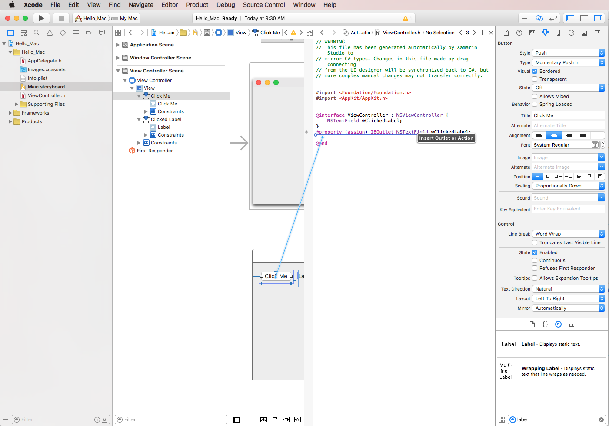](hello-mac-images/action01.png#lightbox)

3. Change the **Connection** type to **Action**:

    [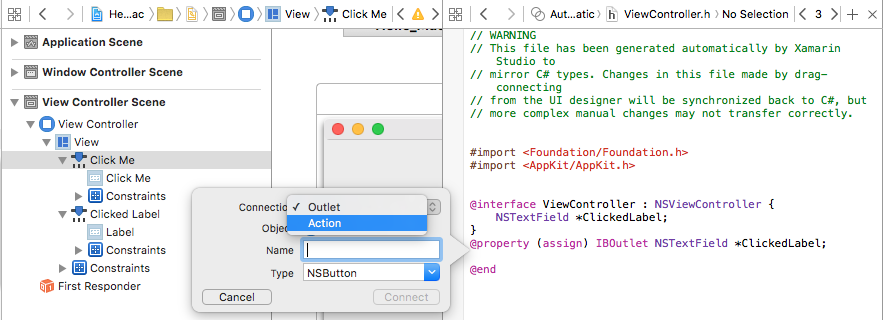](hello-mac-images/action02.png#lightbox)

4. Enter `ClickedButton` as the **Name**:

    [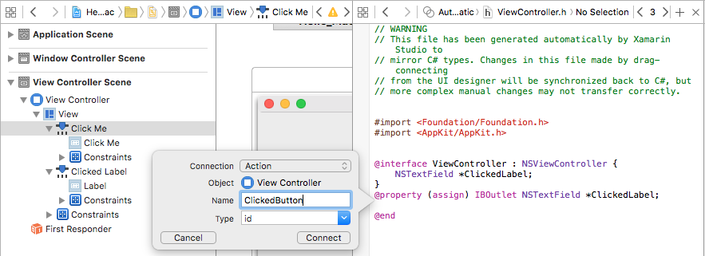](hello-mac-images/action03.png#lightbox)

5. Click the **Connect** button to create **Action**:

    [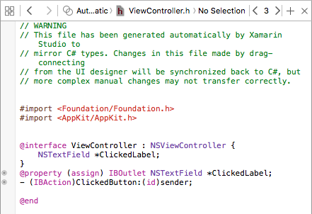](hello-mac-images/action04.png#lightbox)

6. Save the changes to the file.

With the user interface wired-up and exposed to C# code, switch back to Visual Studio for Mac and let it synchronize the changes made in Xcode and Interface Builder.

> [!NOTE]
> It probably took a long time to create the user interface and **Outlets** and **Actions** for this first app, and it may seem like a lot of work, but a lot of new concepts were introduced and a lot of time was spent covering new ground. After practicing for a while and working with Interface Builder, this interface and all its **Outlets** and **Actions** can be created in just a minute or two.

### Synchronizing Changes with Xcode

When the developer switches back to Visual Studio for Mac from Xcode, any changes that they have made in Xcode will automatically be synchronized with the Xamarin.Mac project.

Select the **ViewController.designer.cs** in the **Solution Explorer** to see how the **Outlet** and **Action** have been wired up in the C# code:

[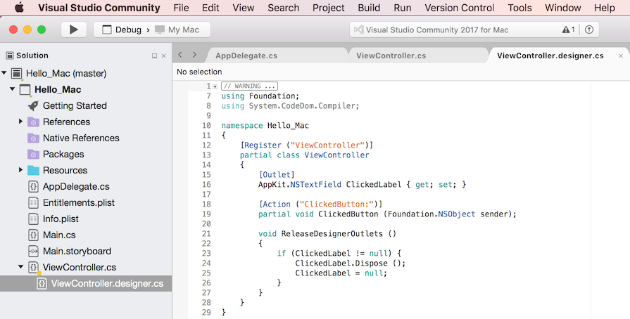](hello-mac-images/sync01.png#lightbox)

Notice how the two definitions in the **ViewController.designer.cs** file:

```csharp
[Outlet]
AppKit.NSTextField ClickedLabel { get; set; }

[Action ("ClickedButton:")]
partial void ClickedButton (Foundation.NSObject sender);
```

Line up with the definitions in the `ViewController.h` file in Xcode:

```objc
@property (assign) IBOutlet NSTextField *ClickedLabel;
- (IBAction)ClickedButton:(id)sender;
```

Visual Studio for Mac listens for changes to the **.h** file, and then automatically synchronizes those changes in the respective **.designer.cs** file to expose them to the app. Notice that **ViewController.designer.cs** is a partial class, so that Visual Studio for Mac doesn't have to modify **ViewController.cs** which would overwrite any changes that the developer has made to the class.

Normally, the developer will never need to open the **ViewController.designer.cs**, it was presented here for educational purposes only.

> [!NOTE]
> In most situations, Visual Studio for Mac will automatically see any changes made in Xcode and sync them to the Xamarin.Mac project. In the off occurrence that synchronization doesn't automatically happen, switch back to Xcode and then back to Visual Studio for Mac again. This will normally kick off a synchronization cycle.

## Writing the Code

With the user interface created and its UI elements exposed to code via **Outlets** and **Actions**, we are finally ready to write the code to bring the program to life.

For this sample app, every time the first button is clicked, the label will be updated to show how many times the button has been clicked. To accomplish this, open the `ViewController.cs` file for editing by double-clicking it in the **Solution Explorer**:

[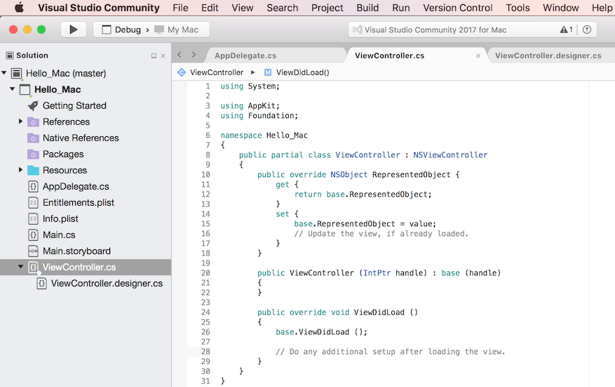](hello-mac-images/code01.png#lightbox)

First, create a class-level variable in the `ViewController` class to track the number of clicks that have happened. Edit the class definition and make it look like the following:

```csharp
namespace Hello_Mac
{
    public partial class ViewController : NSViewController
    {
        private int numberOfTimesClicked = 0;
        ...
```

Next, in the same class (`ViewController`), override the `ViewDidLoad` method and add some code to set the initial message for the label:

```csharp
public override void ViewDidLoad ()
{
    base.ViewDidLoad ();

    // Set the initial value for the label
    ClickedLabel.StringValue = "Button has not been clicked yet.";
}
```

Use `ViewDidLoad`, instead of another method such as `Initialize`, because `ViewDidLoad` is called *after* the OS
has loaded and instantiated the user interface from the **.storyboard** file. If the developer tried to access the label control before the **.storyboard** file has been fully loaded and instantiated, they would get a `NullReferenceException` error because the label control would not exist yet.

Next, add the code to respond to the user clicking the button. Add the following partial method to the `ViewController` class:

```csharp
partial void ClickedButton (Foundation.NSObject sender) {
    // Update counter and label
    ClickedLabel.StringValue = string.Format("The button has been clicked {0} time{1}.",++numberOfTimesClicked, (numberOfTimesClicked < 2) ? "" : "s");
}
```

This code attaches to the **Action** created in Xcode and Interface Builder and will be called any time the user clicks the button.

## Testing the Application

It’s time to build and run the app to make sure it runs as expected. The developer can build and run all in one step, or they can build it without running it.

Whenever an app is built, the developer can choose what kind of build they want:

- **Debug** – A debug build is compiled into an **.app** (application) file with a bunch of extra metadata that allows the developer to debug what’s happening while the app is running.
- **Release** – A release build also creates an **.app** file, but it doesn’t include debug information, so it’s smaller and executes faster.

The developer can select the type of build from the **Configuration Selector** at the upper left-hand corner of the Visual Studio for Mac screen:

[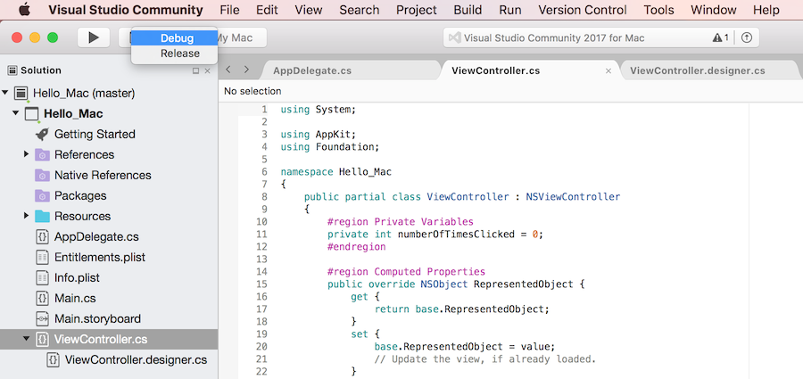](hello-mac-images/run01.png#lightbox)

## Building the Application

In the case of this example, we just want a debug build, so ensure that **Debug** is selected. Build the app first by either pressing **⌘B**, or from the **Build** menu, choose **Build All**.

If there weren't any errors,  a **Build Succeeded** message will be displayed in Visual Studio for Mac's status bar. If there were errors, review the project and make sure that the steps above have been followed correctly. Start by confirming that the code (both in Xcode and in Visual Studio for Mac) matches the code in the tutorial.

## Running the Application

There are three ways to run the app:

- Press **⌘+Enter**.
- From the **Run** menu, choose **Debug**.
- Click the **Play** button in the Visual Studio for Mac toolbar (just above the **Solution Explorer**).

The app will build (if it hasn’t been built already), start in debug mode and display its main interface window:

[](hello-mac-images/run02.png#lightbox)

If the button is clicked a few times, the label should be updated with the count:

[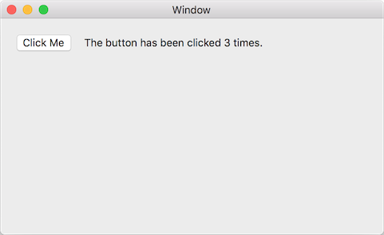](hello-mac-images/run03.png#lightbox)

## Where to Next

With the basics of working with a Xamarin.Mac application down, take a look at the following documents to get a deeper understanding:

- [Introduction to Storyboards](~/mac/platform/storyboards/index.md) - This article provides an introduction to working with Storyboards in a Xamarin.Mac app. It covers creating and maintaining the app's UI using storyboards and Xcode's Interface Builder.
- [Windows](~/mac/user-interface/window.md) - This article covers working with Windows and Panels in a Xamarin.Mac application. It covers creating and maintaining Windows and Panels in Xcode and Interface builder, loading Windows and Panels from .xib files, using Windows and responding to Windows in C# code.
- [Dialogs](~/mac/user-interface/dialog.md) - This article covers working with Dialogs and Modal Windows in a Xamarin.Mac application. It covers creating and maintaining Modal Windows in Xcode and Interface builder, working with standard dialogs, displaying and responding to Windows in C# code.
- [Alerts](~/mac/user-interface/alert.md) - This article covers working with Alerts in a Xamarin.Mac application. It covers creating and displaying Alerts from C# code and responding to Alerts.
- [Menus](~/mac/user-interface/menu.md) - Menus are used in various parts of a Mac application's user interface; from the application's main menu at the top of the screen to pop up and contextual menus that can appear anywhere in a window. Menus are an integral part of a Mac application's user experience. This article covers working with Cocoa Menus in a Xamarin.Mac application.
- [Toolbars](~/mac/user-interface/toolbar.md) - This article covers working with Toolbars in a Xamarin.Mac application. It covers creating and maintaining. Toolbars in Xcode and Interface builder, how to expose the Toolbar Items to code using Outlets and Actions, enabling and disabling Toolbar Items and finally responding to Toolbar Items in C# code.
- [Table Views](~/mac/user-interface/table-view.md) - This article covers working with Table Views in a Xamarin.Mac application. It covers creating and maintaining Table Views in Xcode and Interface builder, how to expose the Table View Items to code using Outlets and Actions, populating Table Items and finally responding to Table View Items in C# code.
- [Outline Views](~/mac/user-interface/outline-view.md) - This article covers working with Outline Views in a Xamarin.Mac application. It covers creating and maintaining Outline Views in Xcode and Interface builder, how to expose the Outline View Items to code using Outlets and Actions, populating Outline Items and finally responding to Outline View Items in C# code.
- [Source Lists](~/mac/user-interface/source-list.md) - This article covers working with Source Lists in a Xamarin.Mac application. It covers creating and maintaining Source Lists in Xcode and Interface builder, how to expose the Source Lists Items to code using Outlets and Actions, populating Source List Items and finally responding to Source List Items in C# code.
- [Collection Views](~/mac/user-interface/collection-view.md) - This article covers working with Collection Views in a Xamarin.Mac application. It covers creating and maintaining Collection Views in Xcode and Interface builder, how to expose the Collection View elements to code using Outlets and Actions, populating Collection Views and finally responding to Collection Views in C# code.
- [Working with Images](~/mac/app-fundamentals/image.md) - This article covers working with Images and Icons in a Xamarin.Mac application. It covers creating and maintaining the images needed to create an app's Icon and using Images in both C# code and Xcode's Interface Builder.

The [Mac Samples Gallery](/samples/browse/?products=xamarin&term=Xamarin.Mac) contains ready-to-use code examples to help learn Xamarin.Mac.

One complete Xamarin.Mac app that includes many of the features a user would expect to find in a typical Mac application is the [SourceWriter Sample App](/samples/xamarin/mac-samples/sourcewriter). SourceWriter is a simple source code editor that provides support for code completion and simple syntax highlighting.

The SourceWriter code has been fully commented and, where available, links have been provided from key technologies or methods to relevant information in the Xamarin.Mac documentation.

## Summary

This article covered the basics of a standard Xamarin.Mac app. It covered creating a new app in Visual Studio for Mac, designing the user interface in Xcode and Interface Builder, exposing UI elements to C# code using **Outlets** and **Actions**, adding code to work with the UI elements and finally, building and testing a Xamarin.Mac app.

## Related Links

- [macOS Human Interface Guidelines](https://developer.apple.com/design/human-interface-guidelines/macos/overview/themes/)
