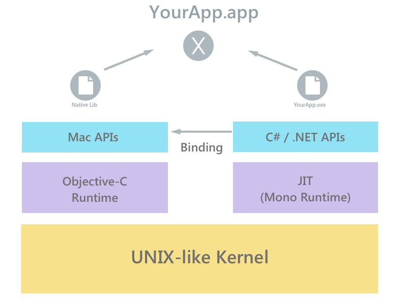

# Xamarin.Mac architecture

_This guide explores Xamarin.Mac and its relationship to Objective-C at a low level. It explains concepts such as compilation, selectors, registrars, app launch, and the generator._

## Overview

Xamarin.Mac applications run within the Mono execution environment,  and use Xamarin’s compiler to compile down to Intermediate Language ( IL), which is then Just-in-Time ( JIT) compiled to native code at run-time. This runs side-by-side with the Objective-C Runtime. Both runtime environments run on top of a UNIX-like kernel, specifically XNU, and expose various APIs to the user code allowing developers to access the underlying native or managed system.

The diagram below shows a basic overview of this architecture:

[](architecture-images/mac-arch-large.png#lightbox)

### Native and managed code

When developing for Xamarin, the terms *native* and *managed* code are often used. Managed code is code that has its execution managed by the .NET Framework Common Language Runtime, or in Xamarin’s case: the Mono Runtime.

Native code is code that will run natively on the specific platform (for example, Objective-C or even AOT compiled code, on an ARM chip). This guide explores how your managed code is compiled to native code, and explains how a Xamarin.Mac application works, making full use of Apple’s Mac APIs through the use of bindings, while also having access to .NET’s BCL and a sophisticated language such as C#.

## Requirements

The following is required to develop a macOS application with Xamarin.Mac:

- A Mac running macOS Sierra (10.12) or greater.
- The latest version of Xcode (installed from the [App Store](https://itunes.apple.com/us/app/xcode/id497799835?mt=12))
- The latest version of Xamarin.Mac and Visual Studio for Mac

Running Mac applications created with Xamarin.Mac have the following system requirements:

- A Mac running Mac OS X 10.7 or greater.

## Compilation

When you compile any Xamarin platform application, the Mono C# (or F#) compiler will run and will compile your C# and F# code into Microsoft Intermediate Language (MSIL or IL). Xamarin.Mac then uses a *Just in Time (JIT)* compiler at runtime to compile native code, allowing execution on the correct architecture as needed.

This is in contrast to Xamarin.iOS which uses AOT compilation. When using the AOT compiler, all assemblies and all methods within them are compiled at build time. With JIT, compilation happens on demand only for the methods that are executed.

With Xamarin.Mac applications, Mono is usually embedded into the app bundle (and referred to as **Embedded Mono**). When using the Classic Xamarin.Mac API,  the application could instead use **System Mono**, however, this is unsupported in the Unified API. System Mono refers to Mono that has been installed in the operating system. On application launch, the Xamarin.Mac app will use this.

## Selectors

With Xamarin, we have two separate ecosystems, .NET and Apple, that we need to bring together to seem as streamlined as possible, to ensure that the end goal is a smooth user experience. We have seen in the section above how the two runtimes communicate, and you may very well have heard of the term ‘bindings’ which allows the native Mac APIs to be used in Xamarin. Bindings are explained in depth in the [Objective-C binding documentation](~/mac/platform/binding.md), so for now, let’s explore how Xamarin.Mac works under the hood.

First, there has to be a way to expose Objective-C to C#, which is done via Selectors. A selector is a message which is sent to an object or class. With Objective-C this is done via the [objc_msgSend](https://developer.apple.com/library/mac/documentation/Cocoa/Reference/ObjCRuntimeRef/index.html) functions. For more information on using Selectors, refer to the iOS [Objective-C Selectors](~/ios/internals/objective-c-selectors.md) guide. There also has to be a way to expose managed code to Objective-C, which is more complicated due to the fact that Objective-C doesn’t know anything about the managed code. To get around this, we use a [registrar](~/mac/internals/registrar.md). This explained in more detail in the next section.

## Registrar

As mentioned above, the registrar is code that exposes managed code to Objective-C. It does this by creating a list of every managed class that derives from NSObject:

- For all classes that are not wrapping an existing Objective-C class, it creates a new Objective-C class with Objective-C members mirroring all the managed members that have an `[Export]` attribute.
- In the implementations for each Objective–C member, code is added automatically to call the mirrored managed member.

The pseudo-code below shows an example of how this is done:

**C# (managed code):**

```csharp
class MyViewController : UIViewController{
    [Export ("myFunc")]
    public void MyFunc ()
    {
    }
 }
 ```

**Objective-C (native code):**

```objc
@interface MyViewController : UIViewController
 - (void)myFunc;
@end 

@implementation MyViewController
- (void)myFunc {
    // Code to call the managed C# MyFunc method in MyViewController
}
@end
```

The managed code can contain the attributes, `[Register]` and `[Export]`, that the registrar uses to know that the object needs to be exposed to Objective-C. The [Register] attribute is used to specify the name of the generated Objective-C class in case the default generated name is not suitable. All classes derived from NSObject are automatically registered with Objective-C. The required [Export] attribute contains a string, which is the selector used in the generated Objective-C class.

There are two types of registrars used in Xamarin.Mac – dynamic and static:

- Dynamic registrars – This is the default registrar for all Xamarin.Mac builds. The dynamic registrar does the registration of all types in your assembly at runtime. It does this by using functions provided by Objective-C’s runtime API. The dynamic registrar therefore has a slower startup, but a faster build time. Native functions (usually in C), called trampolines, are used as method implementations when using the dynamic registrars. They vary between different architectures.
- Static registrars – The static registrar generates Objective-C code during the build, which is then compiled into a static library and linked into the executable. This allows for a quicker startup, but takes longer during build time.

## Application launch

Xamarin.Mac startup logic will differ depending on whether embedded or system Mono is used. To view the code and steps for Xamarin.Mac application launch, refer to the [launch header](https://github.com/xamarin/xamarin-macios/blob/master/runtime/xamarin/launch.h) file in the xamarin-macios public repo.

## Generator

Xamarin.Mac contains definitions for every Mac API. You can browse through any of these on the [MaciOS github repo](https://github.com/xamarin/xamarin-macios/tree/master/src). These definitions contain interfaces with attributes, as well as any necessary methods and properties. For example, the following code is used to define an NSBox in the [AppKit namespace](https://github.com/xamarin/xamarin-macios/blob/master/src/appkit.cs#L1465-L1526). Notice that it is an interface with a number of methods and properties:

```csharp
[BaseType (typeof (NSView))]
public interface NSBox {

		…

		[Export ("borderRect")]
		CGRect BorderRect { get; }

		[Export ("titleRect")]
		CGRect TitleRect { get; }

		[Export ("titleCell")]
		NSObject TitleCell { get; }

		[Export ("sizeToFit")]
		void SizeToFit ();

		[Export ("contentViewMargins")]
		CGSize ContentViewMargins { get; set; }

		[Export ("setFrameFromContentFrame:")]
		void SetFrameFromContentFrame (CGRect contentFrame);

		…

}
```

The Generator, called `bmac` in Xamarin.Mac, takes these definition files and uses .NET tools to compile them into a temporary assembly. However, this temporary assembly is not useable to call Objective-C code. The generator then reads the temporary assembly and generates C# code that can be used at runtime. This is why, for example, if you add a random attribute to your definition .cs file, it won’t show up in the outputted code. The generator doesn’t know about it, and therefore `bmac` doesn't know to look for it in the temporary assembly to output it.

Once the Xamarin.Mac.dll has been created, the packager, `mmp`, will bundle all the components together.

At a high level, it achieves this by executing the following tasks:

- Create an app bundle structure.
- Copy in your managed assemblies.
- If linking is enabled, run the managed linker to optimize your assemblies by removing unused parts.
- Create a launcher application, linking in the launcher code talked about along with the registrar code if in static mode.

This is then run as part of the user build process that compiles user code into an assembly that reference's Xamarin.Mac.dll and runs `mmp` to make it a package

For more detailed information on the linker and how it is used, refer to the iOS [Linker](~/ios/deploy-test/linker.md) guide.

## Summary

This guide looked at compilation of Xamarin.Mac apps, and explored Xamarin.Mac and its relationship to Objective-C.
