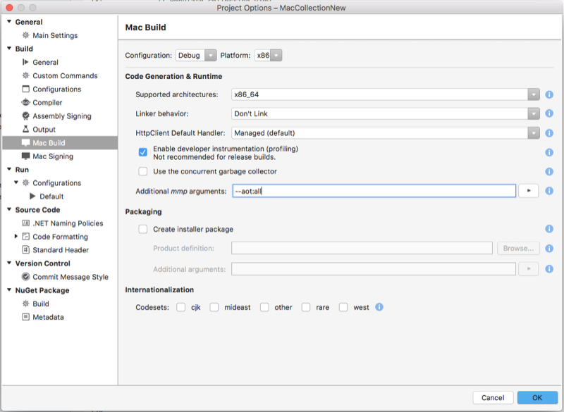
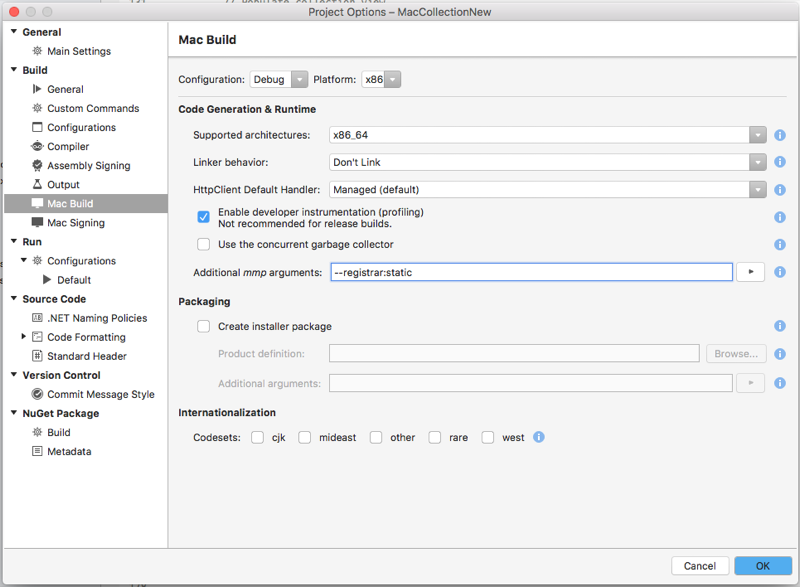

# How Xamarin.Mac works

Most of the time the developer will never have to worry about the internal "magic" of Xamarin.Mac, however, having a rough understanding of how things works under the hood will help in both interpreting existing documentation with a C# lens and debugging issues when they arise.

In Xamarin.Mac, an application bridges two worlds: There is the Objective-C based runtime containing instances of native classes (`NSString`, `NSApplication`, etc) and there is the C# runtime containing instances of managed classes (`System.String`, `HttpClient`, etc). In between these two worlds, Xamarin.Mac creates a two way bridge so an app can call methods (selectors) in Objective-C (such as `NSApplication.Init`) and Objective-C can call the app's C# methods back (like methods on an app delegate). In general, calls into Objective-C are handled transparently via **P/Invokes** and some runtime code Xamarin provides.

<a name="exposing-classes"></a>

## Exposing C# classes / methods to Objective-C

However, for Objective-C to call back into an app's C# objects, they need to be exposed in a way that Objective-C can understand. This is done via the `Register` and `Export` attributes. Take the following example:

```csharp
[Register ("MyClass")]
public class MyClass : NSObject
{
   [Export ("init")]
   public MyClass ()
   {
   }

   [Export ("run")]
   public void Run ()
   {
   }
}
```

In this example, the Objective-C runtime will now know about a class called `MyClass` with selectors called `init` and `run`.

In most cases, this is an implementation detail that the developer can ignore, as most callbacks an app receives will be either via overridden methods on `base` classes (such as `AppDelegate`, `Delegates`, `DataSources`) or on **Actions** passed into APIs. In all of those cases, `Export` attributes are not necessary in the C# code.

## Constructor runthrough

In many cases, the developer will need to expose the app's C# classes construction API to the Objective-C runtime so it can be instantiated from places such as when called in Storyboard or XIB files. Here are the five most common constructors used in Xamarin.Mac apps:

```csharp
// Called when created from unmanaged code
public CustomView (IntPtr handle) : base (handle)
{
   Initialize ();
}

// Called when created directly from a XIB file
[Export ("initWithCoder:")]
public CustomView (NSCoder coder) : base (coder)
{
   Initialize ();
}

// Called from C# to instance NSView with a Frame (initWithFrame)
public CustomView (CGRect frame) : base (frame)
{
}

// Called from C# to instance NSView without setting the frame (init)
public CustomView () : base ()
{
}

// This is a special case constructor that you call on a derived class when the derived called has an [Export] constructor.
// For example, if you call init on NSString then you don’t want to call init on NSObject.
public CustomView () : base (NSObjectFlag.Empty)
{
}
```

In general, the developer should leave the `IntPtr` and `NSCoder` constructors that are generated when creating some types such as custom `NSViews` alone. If Xamarin.Mac needs to call one of these constructors in response to an Objective-C runtime request and you’ve removed it, the app will crash inside native code and it may be difficult to figure out exactly the issue.

## Memory management and cycles

Memory management in Xamarin.Mac is in many ways very similar to Xamarin.iOS. It also is a complex topic, one beyond the scope of this document. Please read the [Memory and Performance Best Practices](~/cross-platform/deploy-test/memory-perf-best-practices.md).

## Ahead of time compilation

Typically, .NET applications do not compile down to machine code when they are built, instead they compile to an intermediate layer called IL code that gets _Just-In-Time_ (JIT) compiled to machine code when the app is launched.

The time that it takes the mono runtime to JIT compile this machine code can slow the launch of a Xamarin.Mac app by up to 20%, as it takes time for the necessary machine code to be generated.

Because of limitations imposed by Apple on iOS, JIT compilation of the IL code is not available to Xamarin.iOS. As a result, all Xamarin.iOS app are full _Ahead-Of-Time_ (AOT) compiled to machine code during the build cycle.

New to Xamarin.Mac is the ability to AOT the IL code during the app build cycle, just like Xamarin.iOS can. Xamarin.Mac uses a _Hybrid_ AOT approach that compiles a majority of the needed machine code, but allows the runtime to compile needed trampolines and the flexibility to continue to support Reflection.Emit (and other use cases that currently work on Xamarin.Mac).

There are two major areas where AOT can help a Xamarin.Mac app:

- **Better "native" crash logs** - If a Xamarin.Mac application crashes in native code, which is common occurrence when making invalid calls into Cocoa APIs (such as sending a `null` into a method that doesn't accept it), native crash logs with JIT frames are difficult to analyze. Since the JIT frames do not have debug information, there will be multiple lines with hex offsets and no clue what was going on. AOT generates "real" named frames and the traces are much easier to read. This also means Xamarin.Mac app will interact better with native tools such as **lldb** and **Instruments**.
- **Better launch time performance** - For large Xamarin.Mac applications, with a multiple second startup time, JIT compiling all of the code can take a significant amount of time. AOT does this work up front.

### Enabling AOT compilation

AOT is enabled in Xamarin.Mac by double-clicking the **Project Name** in the **Solution Explorer**, navigating to **Mac Build** and adding `--aot:[options]` to the **Additional mmp arguments:** field (where `[options]` is one or more options to control the AOT type, see below). For example:



> [!IMPORTANT]
> Enabling AOT compilation dramatically increases build time, sometimes up to several minutes, but it can improve app launch times by an average of 20%. As a result, AOT compilation should only be enabled on **Release** builds of a Xamarin.Mac app.

### Aot compilation options

There are several different options that can be adjusted when enabling AOT compilation on a Xamarin.Mac app:

- `none` - No AOT compilation. This is the default setting.
- `all` - AOT compiles every assembly in the MonoBundle.
- `core` - AOT compiles the `Xamarin.Mac`, `System` and `mscorlib` assemblies.
- `sdk` - AOT compiles the `Xamarin.Mac` and Base Class Libraries (BCL) assemblies.
- `|hybrid` - Adding this to one of the above options enables hybrid AOT which allows for IL stripping, but will result in longer compile times.
- `+` - Includes a single file for AOT compilation.
- `-` - Removes a single file from AOT compilation.

For example, `--aot:all,-MyAssembly.dll` would enable AOT compilation on all of the assemblies in the MonoBundle _except_ `MyAssembly.dll` and `--aot:core|hybrid,+MyOtherAssembly.dll,-mscorlib.dll` would enable hybrid, code AOT include the `MyOtherAssembly.dll` and excluding the `mscorlib.dll`.

## Partial static registrar

When developing a Xamarin.Mac app, minimizing the time between completing a change and testing it can become important to meeting development deadlines. Strategies such as modularization of codebases and unit tests can help to decrease compile times, as they reduce the number of times that an app will require an expensive full rebuild.

Additionally, and new to Xamarin.Mac, _Partial Static Registrar_ (as pioneered by Xamarin.iOS) can dramatically reduce the launch times of a Xamarin.Mac app in the **Debug** configuration. Understanding how using the Partial Static Registrar can squeezed out an almost a 5x improvement in debug launch will take a bit of background on what the registrar is, what the difference is between static and dynamic, and what this “partial static” version does.

### About the registrar

Under the hood of any Xamarin.Mac application lies the Cocoa framework from Apple and the Objective-C runtime. Building a bridge between this "native world” and the "managed world” of C# is the primary responsibility of Xamarin.Mac. Part of this task is handled by the registrar, which is executed inside `NSApplication.Init ()` method. This is one reason that any use of Cocoa APIs in Xamarin.Mac requires `NSApplication.Init` to be called first.

The registrar’s job is to inform the Objective-C runtime of the existence of the app's C# classes that derive from classes such as `NSApplicationDelegate`, `NSView`, `NSWindow`, and `NSObject`. This requires a scan of all types in the app to determine what needs registering and what elements on each type to report.

This scan can be done either **dynamically**, at startup of the application with reflection, or **statically**, as a build time step. When picking a registration type, the developer should be aware of the following:

- Static registration can drastically reduce launch times, but can slow down builds times significantly (typically more than double debug build time). This will be the default for **Release** configuration builds.
- Dynamic registration delays this work until application launch and skips code generation, but this additional work can create a noticeable pause (at least two seconds) in application launch . This is especially noticeable in debug configuration builds, which defaults to dynamic registration and whose reflection is slower.

Partial Static Registration, first introduced in Xamarin.iOS 8.13, gives the developer the best of both options. By pre-computing the registration information of every element in `Xamarin.Mac.dll` and shipping this information with Xamarin.Mac in a static library (that only needs to be linked to at build time), Microsoft has removed most of the reflection time of the dynamic registrar while not impacting build time.

### Enabling the partial static registrar

The Partial Static Registrar is enabled in Xamarin.Mac by double-clicking the **Project Name** in the **Solution Explorer**, navigating to **Mac Build** and adding `--registrar:static` to the **Additional mmp arguments:** field. For example:



## Additional resources

Here are some more detailed explanations of how things work internally:

- [Objective-C Selectors](~/ios/internals/objective-c-selectors.md)
- [Registrar](~/ios/internals/registrar.md)
- [Xamarin Unified API for iOS and OS X](~/cross-platform/macios/unified/index.md)
- [Theading Fundamentals](~/ios/app-fundamentals/threading.md)
- [Delegates, Protocols, and Events](~/ios/app-fundamentals/delegates-protocols-and-events.md)
- [About `newrefcount`](~/ios/internals/newrefcount.md)
