# Building Modern macOS Apps

_This article covers several tips, features and techniques a developer can use to build a modern macOS app in Xamarin.Mac._

<a name="Building-Modern-Looks-with-Modern-Views"></a>

## Building Modern Looks with Modern Views

A modern look will include a modern Window and Toolbar appearance such as the example app shown below:

[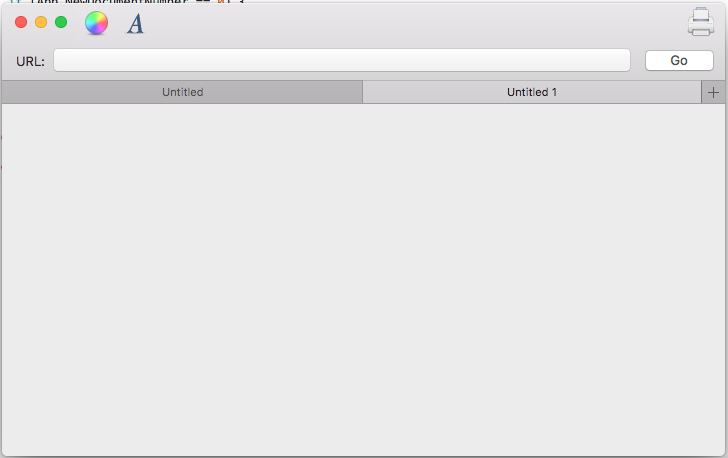](modern-cocoa-apps-images/content08.png#lightbox)

<a name="Enabling-Full-Sized-Content-Views"></a>

### Enabling Full Sized Content Views

To achieve this looks in a Xamarin.Mac app, the developer will want to use a _Full Size Content View_, meaning the content extends under the Tool and Title Bar areas and will be automatically blurred by macOS.

To enable this feature in code, create a custom class for the `NSWindowController` and make it look like the following:

```csharp
using System;
using Foundation;
using AppKit;

namespace MacModern
{
    public partial class MainWindowController : NSWindowController
    {
        #region Constructor
        public MainWindowController (IntPtr handle) : base (handle)
        {
        }
        #endregion

        #region Override Methods
        public override void WindowDidLoad ()
        {
            base.WindowDidLoad ();

            // Set window to use Full Size Content View
            Window.StyleMask = NSWindowStyle.FullSizeContentView;
        }
        #endregion
    }
}
```

This feature can also be enabled in Xcode's Interface Builder by selecting the Window and checking **Full Sized Content View**:

[](modern-cocoa-apps-images/content01.png#lightbox)

When using a Full Size Content View, the developer may need to offset the content beneath the title and tool bar areas so that specific content (such as labels) doesn't slide under them.

To complicate this issue, the Title and Tool Bar areas can have a dynamic height based on the action that the user is currently performing, the version of macOS the user has installed and/or the Mac hardware that the app is running on.

As a result, simply hard coding the offset when laying out the User Interface will not work. The developer will need to take a dynamic approach.

Apple has included the [Key-Value Observable](~/mac/app-fundamentals/databinding.md#Observing_Value_Changes) `ContentLayoutRect` property of the `NSWindow` class to get the current Content Area in code. The developer can use this value to manually position the required elements when the Content Area changes.

The better solution is to use Auto Layout and Size Classes to position the UI elements in either code or Interface Builder.

Code like the following example can be used to position UI elements using AutoLayout and Size Classes in the app's View Controller:

```csharp
using System;
using AppKit;
using Foundation;

namespace MacModern
{
    public partial class ViewController : NSViewController
    {
        #region Computed Properties
        public NSLayoutConstraint topConstraint { get; set; }
        #endregion

        ...

        #region Override Methods
        public override void UpdateViewConstraints ()
        {
            // Has the constraint already been set?
            if (topConstraint == null) {
                // Get the top anchor point
                var contentLayoutGuide = ItemTitle.Window?.ContentLayoutGuide as NSLayoutGuide;
                var topAnchor = contentLayoutGuide.TopAnchor;

                // Found?
                if (topAnchor != null) {
                    // Assemble constraint and activate it
                    topConstraint = topAnchor.ConstraintEqualToAnchor (topAnchor, 20);
                    topConstraint.Active = true;
                }
            }

            base.UpdateViewConstraints ();
        }
        #endregion
    }
}
```

This code creates storage for a top constraint that will be applied to a Label (`ItemTitle`) to ensure that it doesn't slip under the Title and Tool Bar area:

```csharp
public NSLayoutConstraint topConstraint { get; set; }
```

By overriding the View Controller's `UpdateViewConstraints` method, the developer can test to see if the needed constraint has already been built and create it if needed.

If a new constraint needs to be built, the `ContentLayoutGuide` property of the Window the control that needs to be constrained is accessed and cast into a `NSLayoutGuide`:

```csharp
var contentLayoutGuide = ItemTitle.Window?.ContentLayoutGuide as NSLayoutGuide;
```

The TopAnchor property of the `NSLayoutGuide` is accessed and if it is available, it is used to build a new constraint with the desired offset amount and the new constraint is made active to apply it:

```csharp
// Assemble constraint and activate it
topConstraint = topAnchor.ConstraintEqualToAnchor (topAnchor, 20);
topConstraint.Active = true;
```

<a name="Enabling-Streamlined-Toolbars"></a>

### Enabling Streamlined Toolbars

A normal macOS Window includes a standard Title Bar at runs along to top edge of the Window. If the Window also includes a Tool Bar, it will be displayed under this Title Bar area:

[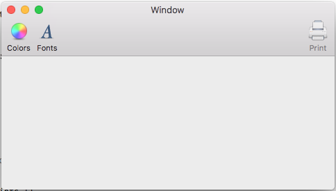](modern-cocoa-apps-images/content02.png#lightbox)

When using a Streamlined Toolbar, the Title Area disappears and the Tool Bar moves up into the Title Bar's position, in-line with the Window Close, Minimize and Maximize buttons:

[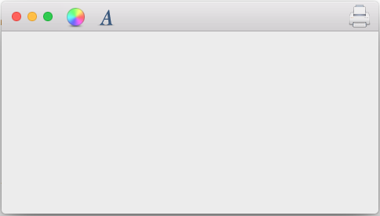](modern-cocoa-apps-images/content03.png#lightbox)

The Streamlined Toolbar is enabled by overriding the `ViewWillAppear` method of the `NSViewController` and making it look like the following:

```csharp
public override void ViewWillAppear ()
{
    base.ViewWillAppear ();

    // Enable streamlined Toolbars
    View.Window.TitleVisibility = NSWindowTitleVisibility.Hidden;
}
```

This effect is typically used for _Shoebox Applications_ (one window apps) like Maps, Calendar, Notes and System Preferences.

<a name="Using-Accessory-View-Controllers"></a>

### Using Accessory View Controllers

Depending on the design of the app, the developer might also want to complement the Title Bar area with an Accessory View Controller that appears right below the Title/Tool Bar area to provide context sensitive controls to the user based on the activity they are currently engaged in:

[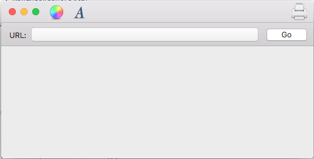](modern-cocoa-apps-images/content04.png#lightbox)

The Accessory View controller will automatically be blurred and resized by the system without developer intervention.

To add an Accessory View Controller, do the following:

1. In the **Solution Explorer**, double-click the `Main.storyboard` file to open it for editing.
2. Drag a **Custom View Controller** into the Window's hierarchy:

    [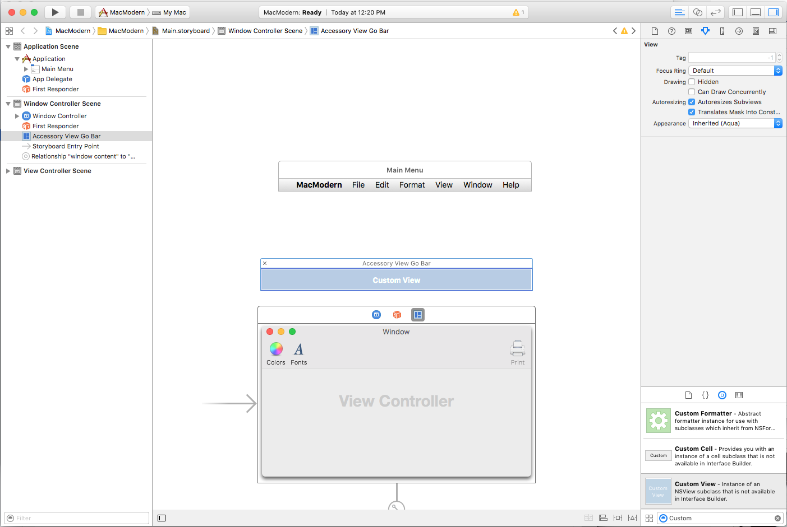](modern-cocoa-apps-images/content05.png#lightbox)
3. Layout the Accessory View's UI:

    [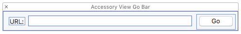](modern-cocoa-apps-images/content06.png#lightbox)
4. Expose the Accessory View as an **Outlet** and any other **Actions** or **Outlets** for its UI:

    [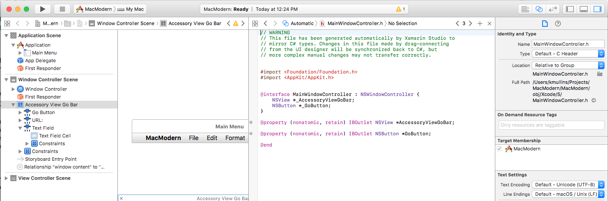](modern-cocoa-apps-images/content07.png#lightbox)
5. Save the changes.
6. Return to Visual Studio for Mac to sync the changes.

Edit the `NSWindowController` and make it look like the following:

```csharp
using System;
using Foundation;
using AppKit;

namespace MacModern
{
    public partial class MainWindowController : NSWindowController
    {
        #region Constructor
        public MainWindowController (IntPtr handle) : base (handle)
        {
        }
        #endregion

        #region Override Methods
        public override void WindowDidLoad ()
        {
            base.WindowDidLoad ();

            // Create a title bar accessory view controller and attach
            // the view created in Interface Builder
            var accessoryView = new NSTitlebarAccessoryViewController ();
            accessoryView.View = AccessoryViewGoBar;

            // Set the location and attach the accessory view to the
            // titlebar to be displayed
            accessoryView.LayoutAttribute = NSLayoutAttribute.Bottom;
            Window.AddTitlebarAccessoryViewController (accessoryView);

        }
        #endregion
    }
}
```

The key points of this code are where the View is set to the custom View that was defined in Interface Builder and exposed as an **Outlet**:

```csharp
accessoryView.View = AccessoryViewGoBar;
```

And the `LayoutAttribute` that defines _where_ the accessory will be displayed:

```csharp
accessoryView.LayoutAttribute = NSLayoutAttribute.Bottom;
```

Because macOS is now fully localized, the `Left` and `Right` `NSLayoutAttribute` properties have been deprecated and should be replaced with `Leading` and `Trailing`.

<a name="Using-Tabbed-Windows"></a>

### Using Tabbed Windows

Additionally, the macOS system might add Accessory View Controllers to the app's Window. For example, to create Tabbed Windows where several of the App's Windows are merged into one virtual Window:

[](modern-cocoa-apps-images/content08.png#lightbox)

Typically, the developer will need to take limited action use Tabbed Windows in their Xamarin.Mac apps, the system will handle them automatically as follows:

- Windows will automatically be Tabbed when the `OrderFront` method is invoked.
- Windows will automatically be Untabbed when the `OrderOut` method is invoked.
- In code all Tabbed windows are still considered "visible", however any non-frontmost Tabs are hidden by the system using CoreGraphics.
- Use the `TabbingIdentifier` property of `NSWindow` to group Windows together into Tabs.
- If it is an `NSDocument` based app, several of these features will be enabled automatically (such as the plus button being added to the Tab Bar) without any developer action.
- Non-`NSDocument` based apps can enable the "plus" button in the Tab Group to add a new document by overriding the `GetNewWindowForTab` method of the `NSWindowsController`.

Bringing all of the pieces together, the `AppDelegate` of an app that wanted to use system based Tabbed Windows could look like the following:

```csharp
using AppKit;
using Foundation;

namespace MacModern
{
    [Register ("AppDelegate")]
    public class AppDelegate : NSApplicationDelegate
    {
        #region Computed Properties
        public int NewDocumentNumber { get; set; } = 0;
        #endregion

        #region Constructors
        public AppDelegate ()
        {
        }
        #endregion

        #region Override Methods
        public override void DidFinishLaunching (NSNotification notification)
        {
            // Insert code here to initialize your application
        }

        public override void WillTerminate (NSNotification notification)
        {
            // Insert code here to tear down your application
        }
        #endregion

        #region Custom Actions
        [Export ("newDocument:")]
        public void NewDocument (NSObject sender)
        {
            // Get new window
            var storyboard = NSStoryboard.FromName ("Main", null);
            var controller = storyboard.InstantiateControllerWithIdentifier ("MainWindow") as NSWindowController;

            // Display
            controller.ShowWindow (this);
        }
        #endregion
    }
}
```

Where the `NewDocumentNumber` property keeps track of the number of new documents created and the `NewDocument` method creates a new document and displays it.

The `NSWindowController` could then look like:

```csharp
using System;
using Foundation;
using AppKit;

namespace MacModern
{
    public partial class MainWindowController : NSWindowController
    {
        #region Application Access
        /// <summary>
        /// A helper shortcut to the app delegate.
        /// </summary>
        /// <value>The app.</value>
        public static AppDelegate App {
            get { return (AppDelegate)NSApplication.SharedApplication.Delegate; }
        }
        #endregion

        #region Constructor
        public MainWindowController (IntPtr handle) : base (handle)
        {
        }
        #endregion

        #region Public Methods
        public void SetDefaultDocumentTitle ()
        {
            // Is this the first document?
            if (App.NewDocumentNumber == 0) {
                // Yes, set title and increment
                Window.Title = "Untitled";
                ++App.NewDocumentNumber;
            } else {
                // No, show title and count
                Window.Title = $"Untitled {App.NewDocumentNumber++}";
            }
        }
        #endregion

        #region Override Methods
        public override void WindowDidLoad ()
        {
            base.WindowDidLoad ();

            // Prefer Tabbed Windows
            Window.TabbingMode = NSWindowTabbingMode.Preferred;
            Window.TabbingIdentifier = "Main";

            // Set default window title
            SetDefaultDocumentTitle ();

            // Set window to use Full Size Content View
            // Window.StyleMask = NSWindowStyle.FullSizeContentView;

            // Create a title bar accessory view controller and attach
            // the view created in Interface Builder
            var accessoryView = new NSTitlebarAccessoryViewController ();
            accessoryView.View = AccessoryViewGoBar;

            // Set the location and attach the accessory view to the
            // titlebar to be displayed
            accessoryView.LayoutAttribute = NSLayoutAttribute.Bottom;
            Window.AddTitlebarAccessoryViewController (accessoryView);

        }

        public override void GetNewWindowForTab (NSObject sender)
        {
            // Ask app to open a new document window
            App.NewDocument (this);
        }
        #endregion
    }
}
```

Where the static `App` property provides a shortcut to get to the `AppDelegate`. The `SetDefaultDocumentTitle` method sets a new documents title based on the number of new documents created.

The following code, tells macOS that the app prefers to use tabs and provides a string that allows the app's Windows to be grouped into Tabs:

```csharp
// Prefer Tabbed Windows
Window.TabbingMode = NSWindowTabbingMode.Preferred;
Window.TabbingIdentifier = "Main";
```

And the following override method adds a plus button to the Tab Bar that will create a new document when clicked by the user:

```csharp
public override void GetNewWindowForTab (NSObject sender)
{
    // Ask app to open a new document window
    App.NewDocument (this);
}
```

<a name="Using-Core-Animation"></a>

### Using Core Animation

Core Animation is a high powered graphics rendering engine that is built into macOS. Core Animation has been optimized to take advantage of the GPU (Graphics Processing Unit) available in modern macOS hardware as opposed to running the graphics operations on the CPU, which can slow down the machine.

The `CALayer`, provided by Core Animation, can be used for tasks such as fast and fluid scrolling and animations. An app's User Interface should be composed of multiple subviews and layers to fully take advantage of Core Animation.

A `CALayer` object provides several properties that allow the developer to control what is presented onscreen to the user such as:

- `Content` - Can be a `NSImage` or `CGImage` that provides the contents of the layer.
- `BackgroundColor` - Sets the background color of the layer as a `CGColor`
- `BorderWidth` - Sets the border width.
- `BorderColor` - Sets the border color.

To utilize Core Graphics in the app's UI, it must be using _Layer Backed_ Views, which Apple suggests that the developer should always enable in the Window's Content View. This way, all child views will automatically inherit Layer Backing as well.

Additionally, Apple suggests using Layer Backed Views as opposed to adding a new `CALayer` as a sublayer because the system will automatically handle several of the required settings (such as those required by a Retina Display).

Layer Backing can be enabled by setting the `WantsLayer` of a `NSView` to `true` or inside of Xcode's Interface Builder under the **View Effects Inspector** by checking **Core Animation Layer**:

[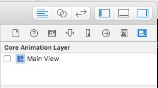](modern-cocoa-apps-images/content09.png#lightbox)

<a name="Redrawing-Views-with-Layers"></a>

#### Redrawing Views with Layers

Another important step when using Layer Backed Views in a Xamarin.Mac app is setting the `LayerContentsRedrawPolicy` of the `NSView` to `OnSetNeedsDisplay` in the `NSViewController`. For example:

```csharp
public override void ViewWillAppear ()
{
    base.ViewWillAppear ();

    // Set the content redraw policy
    View.LayerContentsRedrawPolicy = NSViewLayerContentsRedrawPolicy.OnSetNeedsDisplay;
}
```

If the developer doesn't set this property, the View will be redrawn whenever its frame origin changes, which is not desired for performance reasons. With this property set to `OnSetNeedsDisplay` the developer will manually have to set `NeedsDisplay` to `true` to force the content to redraw, however.

When a View is marked as dirty, the system checks the `WantsUpdateLayer` property of the View. If it returns `true` then the `UpdateLayer` method is called, else the `DrawRect` method of the View is called to update the View's contents.

Apple has the following suggestions for updating a Views contents when required:

- Apple prefers using `UpdateLater` over `DrawRect` whenever possible as it provides a significant performance boost.
- Use the same `layer.Contents` for UI elements that look similar.
- Apple also prefers the developer to compose their UI using standard views such as `NSTextField`, again whenever possible.

To use `UpdateLayer`, create a custom class for the `NSView` and make the code look like the following:

```csharp
using System;
using Foundation;
using AppKit;

namespace MacModern
{
    public partial class MainView : NSView
    {
        #region Computed Properties
        public override bool WantsLayer {
            get { return true; }
        }

        public override bool WantsUpdateLayer {
            get { return true; }
        }
        #endregion

        #region Constructor
        public MainView (IntPtr handle) : base (handle)
        {
        }
        #endregion

        #region Override Methods
        public override void DrawRect (CoreGraphics.CGRect dirtyRect)
        {
            base.DrawRect (dirtyRect);

        }

        public override void UpdateLayer ()
        {
            base.UpdateLayer ();

            // Draw view
            Layer.BackgroundColor = NSColor.Red.CGColor;
        }
        #endregion
    }
}
```

<a name="Using-Modern-Drag-and-Drop"></a>

## Using Modern Drag and Drop

To present a modern Drag and Drop experience for the user, the developer should adopt _Drag Flocking_ in their app's Drag and Drop operations. Drag Flocking is where each individual file or item being dragged initially appears as an individual element that flocks (group together under the cursor with a count of the number of items) as the user continues the drag operation.

If the user terminates the Drag operation, the individual elements will Unflock and return to their original locations.

The following example code enables Drag Flocking on a custom View:

```csharp
using System;
using System.Collections.Generic;
using Foundation;
using AppKit;

namespace MacModern
{
    public partial class MainView : NSView, INSDraggingSource, INSDraggingDestination
    {
        #region Constructor
        public MainView (IntPtr handle) : base (handle)
        {
        }
        #endregion

        #region Override Methods
        public override void MouseDragged (NSEvent theEvent)
        {
            // Create group of string to be dragged
            var string1 = new NSDraggingItem ((NSString)"Item 1");
            var string2 = new NSDraggingItem ((NSString)"Item 2");
            var string3 = new NSDraggingItem ((NSString)"Item 3");

            // Drag a cluster of items
            BeginDraggingSession (new [] { string1, string2, string3 }, theEvent, this);
        }
        #endregion
    }
}
```

The flocking effect was achieved by sending each item being dragged to the `BeginDraggingSession` method of the `NSView` as a separate element in an array.

When working with a `NSTableView` or `NSOutlineView`, use the `PastboardWriterForRow` method of the `NSTableViewDataSource` class to start the Dragging operation:

```csharp
using System;
using System.Collections.Generic;
using Foundation;
using AppKit;

namespace MacModern
{
    public class ContentsTableDataSource: NSTableViewDataSource
    {
        #region Constructors
        public ContentsTableDataSource ()
        {
        }
        #endregion

        #region Override Methods
        public override INSPasteboardWriting GetPasteboardWriterForRow (NSTableView tableView, nint row)
        {
            // Return required pasteboard writer
            ...

            // Pasteboard writer failed
            return null;
        }
        #endregion
    }
}
```

This allows the developer to provide an individual `NSDraggingItem` for every item in the table that is being dragged as opposed to the older method `WriteRowsWith` that write all of the rows as a single group to the pasteboard.

When working with `NSCollectionViews`, again use the `PasteboardWriterForItemAt` method as opposed to the `WriteItemsAt` method when Dragging begins.

The developer should always avoid putting large files on the pasteboard. New to macOS Sierra, _File Promises_ allow the developer to place references to given files on the pasteboard that will later be fulfilled when the user finishes the Drop operation using the new `NSFilePromiseProvider` and `NSFilePromiseReceiver` classes.

<a name="Using-Modern-Event-Tracking"></a>

## Using Modern Event Tracking

For a User Interface element (such as a `NSButton`) that has been added to a Title or Tool Bar area, the user should be able to click the element and have it fire an event as normal (such as displaying a popup window). However, since the item is also in the Title or Tool Bar area, the user should be able to click and drag the element to move the window as well.

To accomplish this in code, create a custom class for the element (such as `NSButton`) and override the `MouseDown` event as follows:

```csharp
public override void MouseDown (NSEvent theEvent)
{
    var shouldCallSuper = false;

    Window.TrackEventsMatching (NSEventMask.LeftMouseUp, 2000, NSRunLoop.NSRunLoopEventTracking, (NSEvent evt, ref bool stop) => {
        // Handle event as normal
        stop = true;
        shouldCallSuper = true;
    });

    Window.TrackEventsMatching(NSEventMask.LeftMouseDragged, 2000, NSRunLoop.NSRunLoopEventTracking, (NSEvent evt, ref bool stop) => {
        // Pass drag event to window
        stop = true;
        Window.PerformWindowDrag (evt);
    });

    // Call super to handle mousedown
    if (shouldCallSuper) {
        base.MouseDown (theEvent);
    }
}
```

This code uses the `TrackEventsMatching` method of the `NSWindow` that the UI element is attached to intercept the `LeftMouseUp` and `LeftMouseDragged` events. For a `LeftMouseUp` event, the UI element responds as normal. For the `LeftMouseDragged` event, the event is passed to the `NSWindow`'s `PerformWindowDrag` method to move the window on screen.

Calling the `PerformWindowDrag` method of the `NSWindow` class provides the following benefits:

- It allows for the Window to move, even if the app is hung (such as when processing a deep loop).
- Space switching will work as expected.
- The Spaces Bar will be displayed as normal.
- Window snapping and alignment work as normal.

<a name="Using-Modern-Container-View-Controls"></a>

## Using Modern Container View Controls

macOS Sierra provides many modern improvements to the existing Container View Controls available in previous version of the OS.

<a name="Table View Enhancements"></a>

## Table View Enhancements

The developer should always use the new `NSView` based version of Container View Controls such as `NSTableView`. For example:

```csharp
using System;
using System.Collections.Generic;
using Foundation;
using AppKit;

namespace MacModern
{
    public class ContentsTableDelegate : NSTableViewDelegate
    {
        #region Constructors
        public ContentsTableDelegate ()
        {
        }
        #endregion

        #region Override Methods
        public override NSView GetViewForItem (NSTableView tableView, NSTableColumn tableColumn, nint row)
        {
            // Build new view
            var view = new NSView ();
            ...

            // Return the view representing the item to display
            return view;
        }
        #endregion
    }
}
```

This allows for custom Table Row Actions to be attached to given rows in the table (such as swiping right to delete the row). To enable this behavior, override the `RowActions` method of the `NSTableViewDelegate`:

```csharp
using System;
using System.Collections.Generic;
using Foundation;
using AppKit;

namespace MacModern
{
    public class ContentsTableDelegate : NSTableViewDelegate
    {
        #region Constructors
        public ContentsTableDelegate ()
        {
        }
        #endregion

        #region Override Methods
        public override NSView GetViewForItem (NSTableView tableView, NSTableColumn tableColumn, nint row)
        {
            // Build new view
            var view = new NSView ();
            ...

            // Return the view representing the item to display
            return view;
        }

        public override NSTableViewRowAction [] RowActions (NSTableView tableView, nint row, NSTableRowActionEdge edge)
        {
            // Take action based on the edge
            if (edge == NSTableRowActionEdge.Trailing) {
                // Create row actions
                var editAction = NSTableViewRowAction.FromStyle (NSTableViewRowActionStyle.Regular, "Edit", (action, rowNum) => {
                    // Handle row being edited
                    ...
                });

                var deleteAction = NSTableViewRowAction.FromStyle (NSTableViewRowActionStyle.Destructive, "Delete", (action, rowNum) => {
                    // Handle row being deleted
                    ...
                });

                // Return actions
                return new [] { editAction, deleteAction };
            } else {
                // No matching actions
                return null;
            }
        }
        #endregion
    }
}
```

The static `NSTableViewRowAction.FromStyle` is used to create a new Table Row Action of the following styles:

- `Regular` - Performs a standard non-destructive action such as edit the row's contents.
- `Destructive` - Performs a destructive action such as delete the row from the table. These actions will be rendered with a red background.

<a name="Scroll-View-Enhancements"></a>

## Scroll View Enhancements

When using a Scroll View (`NSScrollView`) directly, or as part of another control (such as `NSTableView`), the contents of the Scroll View can slide under the Title and Tool Bar areas in a Xamarin.Mac app using a Modern Look and Views.

As a result, the first item in the Scroll View content area can be partially obscured by the Title and Tool Bar area.

To correct this issue, Apple has added two new properties to the `NSScrollView` class:

- `ContentInsets` - Allows the developer to provide a `NSEdgeInsets` object defining the offset that will be applied to the top of the Scroll View.
- `AutomaticallyAdjustsContentInsets` - If `true` the Scroll View will automatically handle the `ContentInsets` for the developer.

By using the `ContentInsets` the developer can adjust the start of the Scroll View to allow for the inclusion of accessories such as:

- A Sort indicator like the one shown in the Mail app.
- A Search Field.
- A Refresh or Update button.

<a name="Auto-Layout-and-Localization-in-Modern-Apps"></a>

## Auto Layout and Localization in Modern Apps

Apple has included several technologies in Xcode that allow the developer to easily create an internationalized macOS app. Xcode now allows the developer to separate user-facing text from the app's User Interface design in its Storyboard files and provides tools to maintain this separation if the UI changes.

For more information, please see Apple's [Internationalization and Localization Guide](https://developer.apple.com/library/content/documentation/MacOSX/Conceptual/BPInternational/InternationalizingYourUserInterface/InternationalizingYourUserInterface.html).

<a name="Implementing-Base-Internationalization"></a>

### Implementing Base Internationalization

By implementing Base Internationalization, the developer can provide a single Storyboard file to represent the app's UI and separate out all of the user-facing strings.

When the developer is creating the initial Storyboard file (or files) that define the app's User Interface, they will be built in the Base Internationalization (the language that the developer speaks).

Next, the developer can export localizations and the Base Internationalization strings (in the Storyboard UI design) that can be translated into multiple languages.

Later, these localizations can be imported and Xcode will generate the language-specific string files for the Storyboard.

<a name="Implementing-Auto-Layout-to-Support-Localization"></a>

### Implementing Auto Layout to Support Localization

Because localized versions of string values can have vastly different sizes and/or reading direction, the developer should use Auto Layout to position and size the app's User Interface in a Storyboard file.

Apple suggest doing the following:

- **Remove Fixed Width Constraints** - All text-based Views should be allowed to resize based on their content. Fixed width View may crop their content in specific languages.
- **Use Intrinsic Content Sizes** - By default text-based Views will auto-size to fit their content. For text-based View that are not sizing correctly, select them in Xcode's Interface Builder then choose **Edit** > **Size To Fit Content**.
- **Apply Leading and Trailing Attributes** - Because the direction of the text can change based on the user's language, use the new `Leading` and `Trailing` constraint attributes as opposed to the existing `Right` and `Left` attributes. `Leading` and `Trailing` will automatically adjust based on the languages direction.
- **Pin Views to Adjacent Views** - This allows the Views to reposition and resize as the Views around them change in response to the language selected.
- **Don't Set a Windows Minimum and/or Maximum Sizes** - Allow Windows to change size as the language selected resizes their content areas.
- **Test Layout Changes Constantly** - During development at app should be tested constantly in different languages. See Apple's [Testing Your Internationalized app](https://developer.apple.com/library/content/documentation/MacOSX/Conceptual/BPInternational/TestingYourInternationalApp/TestingYourInternationalApp.html#//apple_ref/doc/uid/10000171i-CH7-SW1) documentation for more details.
- **Use NSStackViews to Pin Views Together** - `NSStackViews` allows their contents to shift and grow in predictable ways and the content change size based on the language selected.

<a name="Localizing-in-Xcodes-Interface-Builder"></a>

### Localizing in Xcode's Interface Builder

Apple has provided several features in Xcode's Interface Builder that the developer can use when designing or editing an app's UI to support localization. The **Text Direction** section of the **Attribute Inspector** allows the developer to provide hints on how direction should be used and updated on a select Text-Based View (such as `NSTextField`):

[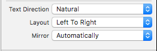](modern-cocoa-apps-images/content10.png#lightbox)

There are three possible values for the **Text Direction**:

- **Natural** - The layout is based on the string assigned to the control.
- **Left to Right** - The layout is always forced to left to right.
- **Right to Left** - The layout is always forced to right to left.

There are two possible values for the **Layout**:

- **Left to Right** - The layout is always left to right.
- **Right to Left** - The layout is always right to left.

Typically these should not be changed unless a specific alignment is required.

The **Mirror** property tells the system to flip specific control properties (such as the Cell Image Position). It has three possible values:

- **Automatically** - The position will automatically change based on the direction of the language selected.
- **In Right To Left Interface** - The position will only be changed in right to left based languages.
- **Never** - The position will never change.

If the developer has specified **Center**, **Justify** or **Full** alignment on the content of a text-based View, these will never be flipped based on language selected.

Prior to macOS Sierra, controls  created in code would not be mirrored automatically. The developer had to use code like the following to handle mirroring:

```csharp
public override void ViewDidLoad ()
{
    base.ViewDidLoad ();

    // Setting a button's mirroring based on the layout direction
    var button = new NSButton ();
    if (button.UserInterfaceLayoutDirection == NSUserInterfaceLayoutDirection.LeftToRight) {
        button.Alignment = NSTextAlignment.Right;
        button.ImagePosition = NSCellImagePosition.ImageLeft;
    } else {
        button.Alignment = NSTextAlignment.Left;
        button.ImagePosition = NSCellImagePosition.ImageRight;
    }
}
```

Where the `Alignment` and `ImagePosition` are being set based on the `UserInterfaceLayoutDirection` of the control.

macOS Sierra adds several new convenience constructors (via the static `CreateButton` method) that take several parameters (such as Title, Image and Action) and will automatically mirror correctly. For example:

```csharp
var button2 = NSButton.CreateButton (myTitle, myImage, () => {
    // Take action when the button is pressed
    ...
});
```

<a name="Using-System-Appearances"></a>

## Using System Appearances

Modern macOS apps can adopt a new Dark Interface Appearance that works well for image creation, editing or presentation apps:

[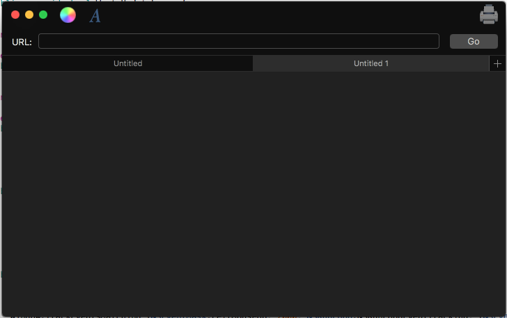](modern-cocoa-apps-images/content11.png#lightbox)

This can be done by adding one line of code before the Window is presented. For example:

```csharp
using System;
using AppKit;
using Foundation;

namespace MacModern
{
    public partial class ViewController : NSViewController
    {
        ...

        #region Override Methods
        public override void ViewWillAppear ()
        {
            base.ViewWillAppear ();

            // Apply the Dark Interface Appearance
            View.Window.Appearance = NSAppearance.GetAppearance (NSAppearance.NameVibrantDark);

            ...
        }
        #endregion
    }
}
```

The static `GetAppearance` method of the `NSAppearance` class is used to get a named appearance from the system (in this case `NSAppearance.NameVibrantDark`).

Apple has the following suggestions for using System Appearances:

- Prefer named colors over hardcoded values (such as `LabelColor` and `SelectedControlColor`).
- Use system standard control style where possible.

A macOS app that uses the System Appearances will automatically work correctly for users that have enabled Accessibility features from the System Preferences app. As a result, Apple suggests that the developer should always use System Appearances in their macOS apps.

<a name="Designing-UIs-with-Storyboards"></a>

## Designing UIs with Storyboards

Storyboards allow the developer to not only design the individual elements that make up an app's User Interface, but to visualize and design the UI flow and the hierarchy of the given elements.

Controllers allow the developer to collect elements into a unit of composition and Segues abstract and remove the typical "glue code" required to move throughout the View Hierarchy:

[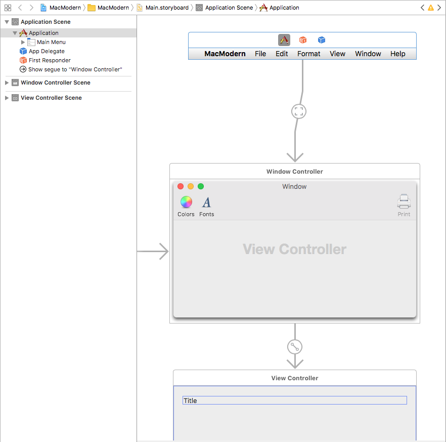](modern-cocoa-apps-images/content12.png#lightbox)

For more information, please see our [Introduction to Storyboards](~/mac/platform/storyboards/index.md) documentation.

There are many instances where a given scene defined in a storyboard will require data from a previous scene in the View Hierarchy. Apple has the following suggestions for passing information between scenes:

- Data dependancies should always cascade downwards through the hierarchy.
- Avoid hardcoding UI structural dependancies, as this limits UI flexibility.
- Use C# Interfaces to provide generic data dependancies.

The View Controller that is acting as the source of the Segue, can override the `PrepareForSegue` method and do any initialization required (such as passing data) before the Segue is executed to display the target View Controller. For example:

```csharp
public override void PrepareForSegue (NSStoryboardSegue segue, NSObject sender)
{
    base.PrepareForSegue (segue, sender);

    // Take action based on Segue ID
    switch (segue.Identifier) {
    case "MyNamedSegue":
        // Prepare for the segue to happen
        ...
        break;
    }
}
```

For more information, please see our [Segues](~/mac/platform/storyboards/indepth.md#Segues) documentation.

<a name="Propagating-Actions"></a>

## Propagating Actions

Based on the design of the macOS app, there might be times when the best handler for an Action on a UI control might be in elsewhere in the UI Hierarchy. This is typically true of Menus and Menu Items that live in their own scene, separate from the rest of the app's UI.

To handle this situation, the developer can create a Custom Action and pass the Action up the responder chain. For more information please see our [Working with Custom Window Actions](~/mac/user-interface/menu.md) documentation.

<a name="Modern-Mac-Features"></a>

## Modern Mac Features

Apple has included several user-facing features in macOS Sierra that allow the developer to make the most of the Mac platform, such as:

- **NSUserActivity** - This allows the app to describe the activity that the user is currently involved in. `NSUserActivity` was initially created to support HandOff, where an activity started on one of the user's devices could be picked up and continued on another device. `NSUserActivity` works the same in macOS as it does in iOS so please see our [Introduction to Handoff](~/ios/platform/handoff.md) iOS documentation for more details.
- **Siri on Mac** - Siri uses the Current Activity (`NSUserActivity`) to provide context to the commands a user can issue.
- **State Restoration** - When the user quits an app on macOS and then later relaunches it, the app will automatically be returned to its previous state. The developer can use the State Restoration API to encode and restore transient UI states before the User Interface is displayed to the user. If the app is `NSDocument` based, State Restoration is handled automatically. To enable State Restoration for non-`NSDocument` based apps, set the `Restorable` of the `NSWindow` class to `true`.
- **Documents in the Cloud** - Prior to macOS Sierra, an app had to explicitly opt-in to working with documents in the user's iCloud Drive. In macOS Sierra the user's **Desktop** and **Documents** folders may be synced with their iCloud Drive automatically by the system. As a result, local copies of documents may be deleted to free up space on the user's machine. `NSDocument` based apps will automatically handle this change. All other app types will need to use a `NSFileCoordinator` to sync reading and writing of documents.

<a name="Summary"></a>

## Summary

This article has covered several tips, features and techniques a developer can use to build a modern macOS app in Xamarin.Mac.

## Related Links

- [macOS Samples](/samples/browse/?products=xamarin&term=Xamarin.Mac)