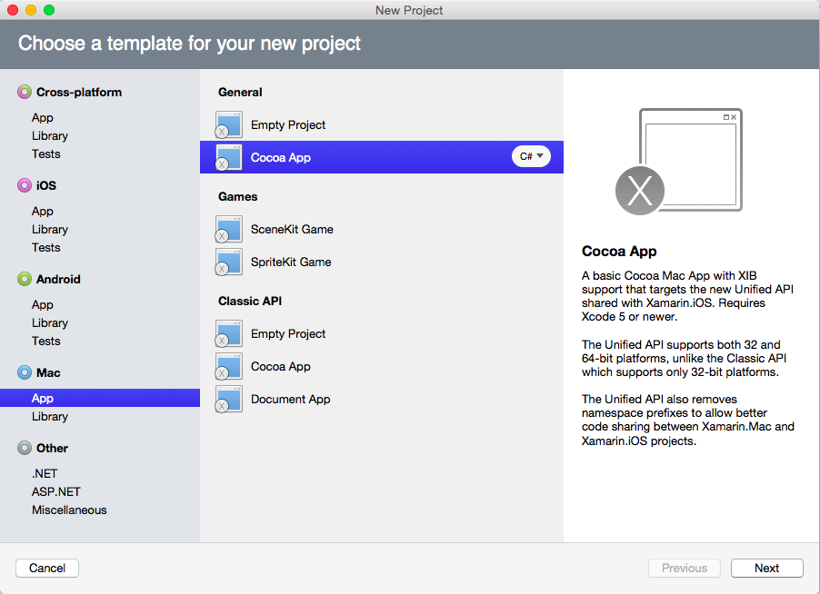
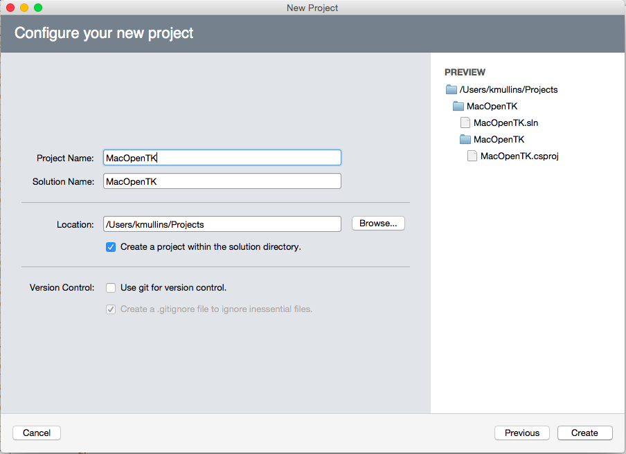

# Introduction to OpenTK in Xamarin.Mac

OpenTK (The Open Toolkit) is an advanced, low-level C# library that makes working with OpenGL, OpenCL and OpenAL easier. OpenTK can be used for games, scientific applications or other projects that require 3D graphics, audio or computational functionality. This article gives a brief introduction to using OpenTK in a Xamarin.Mac app.

[](opentk-images/intro01.png#lightbox)

In this article, we'll cover the basics of OpenTK in a Xamarin.Mac application. It is highly suggested that you work through the [Hello, Mac](~/mac/get-started/hello-mac.md) article first, specifically the [Introduction to Xcode and Interface Builder](~/mac/get-started/hello-mac.md#introduction-to-xcode-and-interface-builder) and [Outlets and Actions](~/mac/get-started/hello-mac.md#outlets-and-actions) sections, as it covers key concepts and techniques that we'll be using in this article.

You may want to take a look at the [Exposing C# classes / methods to Objective-C](~/mac/internals/how-it-works.md) section of the [Xamarin.Mac Internals](~/mac/internals/how-it-works.md) document as well, it explains the `Register` and `Export` commands used to wire-up your C# classes to Objective-C objects and UI Elements.

<a name="About_OpenTK"></a>

## About OpenTK

As stated above, OpenTK (The Open Toolkit) is an advanced, low-level C# library that makes working with OpenGL, OpenCL and OpenAL easier. Using OpenTK in a Xamarin.Mac app provides the following features:

- **Rapid Development** - OpenTK provides strong data types and inline documentation to improve your coding workflow and catch errors easier and sooner.
- **Easy Integration** - OpenTK was designed to easily integrate with .NET applications.
- **Permissive License** - OpenTK is distributed under the MIT/X11 Licenses and is totally free.
- **Rich, Type-Safe Bindings** - OpenTK supports the latest versions of OpenGL, OpenGL|ES, OpenAL and OpenCL with automatic extension loading, error checking and inline documentation.
- **Flexible GUI Options** - OpenTK provides the native, high-performance Game Window designed specifically for games and Xamarin.Mac.
- **Fully Managed, CLS-Compliant Code** - OpenTK supports 32-bit and 64-bit versions of macOS with no unmanaged libraries.
- **3D Math Toolkit** OpenTK supplies `Vector`, `Matrix`, `Quaternion` and `Bezier` structs via its 3D Math Toolkit.

OpenTK can be used for games, scientific applications or other projects that require 3D graphics, audio or computational functionality.

For more information, please see [The Open Toolkit](https://opentk.net) website.

<a name="OpenTK_Quickstart"></a>

## OpenTK Quickstart

As a quick introduction to using OpenTK in a Xamarin.Mac app, we are going to create a simple application that opens a Game View, renders a simple triangle in that view and attachs the Game View to the Mac app's Main Window to display the triangle to the user.

<a name="Starting_a_New_Project"></a>

### Starting a New Project

Start Visual Studio for Mac and create a new Xamarin.Mac solution. Select **Mac** > **App** > **General** > **Cocoa App**:

[](opentk-images/sample01.png#lightbox)

Enter `MacOpenTK` for the **Project Name**:

[](opentk-images/sample02.png#lightbox)

Click the **Create** button to build the new project.

<a name="Including_OpenTK"></a>

### Including OpenTK

Before you can use Open TK in a Xamarin.Mac application, you need to include a reference to the OpenTK assembly. In the **Solution Explorer**, right-click the **References** folder and select **Edit References...**.

Place a check by `OpenTK` and click the **OK** button:

[](opentk-images/sample03.png#lightbox)

<a name="Using_OpenTK"></a>

### Using OpenTK

With the new project created, double-click the `MainWindow.cs` file in the **Solution Explorer** to open it for editing. Make the `MainWindow` class look like the following:

```csharp
using System;
using System.Drawing;
using OpenTK;
using OpenTK.Graphics;
using OpenTK.Graphics.OpenGL;
using OpenTK.Platform.MacOS;
using Foundation;
using AppKit;
using CoreGraphics;

namespace MacOpenTK
{
    public partial class MainWindow : NSWindow
    {
        #region Computed Properties
        public MonoMacGameView Game { get; set; }
        #endregion

        #region Constructors
        public MainWindow (IntPtr handle) : base (handle)
        {
        }

        [Export ("initWithCoder:")]
        public MainWindow (NSCoder coder) : base (coder)
        {
        }
        #endregion

        #region Override Methods
        public override void AwakeFromNib ()
        {
            base.AwakeFromNib ();

            // Create new Game View and replace the window content with it
            Game = new MonoMacGameView(ContentView.Frame);
            ContentView = Game;
            Game.OpenGLContext.View = Game;

            // Wire-up any required Game events
            Game.Load += (sender, e) =>
            {
                // TODO: Initialize settings, load textures and sounds here
            };

            Game.Resize += (sender, e) =>
            {
                // Adjust the GL view to be the same size as the window
                GL.Viewport(0, 0, Game.Size.Width, Game.Size.Height);
            };

            Game.UpdateFrame += (sender, e) =>
            {
                // TODO: Add any game logic or physics
            };

            Game.RenderFrame += (sender, e) =>
            {
                // Setup buffer
                GL.Clear(ClearBufferMask.ColorBufferBit | ClearBufferMask.DepthBufferBit);
                GL.MatrixMode(MatrixMode.Projection);

                // Draw a simple triangle
                GL.LoadIdentity();
                GL.Ortho(-1.0, 1.0, -1.0, 1.0, 0.0, 4.0);
                GL.Begin(BeginMode.Triangles);
                GL.Color3(Color.MidnightBlue);
                GL.Vertex2(-1.0f, 1.0f);
                GL.Color3(Color.SpringGreen);
                GL.Vertex2(0.0f, -1.0f);
                GL.Color3(Color.Ivory);
                GL.Vertex2(1.0f, 1.0f);
                GL.End();

            };

            // Run the game at 60 updates per second
            Game.Run(60.0);
        }
        #endregion
    }
}
```

Let's go over this code in detail below.

<a name="Required_APIs"></a>

### Required APIs

Several references are required to use OpenTK in a Xamarin.Mac class. At the start of the definition we have included the following `using` statements:

```csharp
using System;
using System.Drawing;
using OpenTK;
using OpenTK.Graphics;
using OpenTK.Graphics.OpenGL;
using OpenTK.Platform.MacOS;
using Foundation;
using CoreGraphics;
```

This minimal set will be required for any class using OpenTK.

<a name="Adding_the_Game_View"></a>

### Adding the Game View

Next we need to create a Game View to contain all of our interaction with OpenTK and display the results. We used the following code:

```csharp
public MonoMacGameView Game { get; set; }
...

// Create new Game View and replace the window content with it
Game = new MonoMacGameView(ContentView.Frame);
ContentView = Game;
```

Here we've made the Game View the same size as our Main Mac Window and replaced the Content View of the window with the new `MonoMacGameView`. Because we replaced the existing window content, our Gave View will be automatically resized when the Main Windows is resized.

<a name="Responding_to_Events"></a>

### Responding to Events

There are several default events that each Game View should respond to. In this section will cover the main events required.

<a name="The_Load_Event"></a>

### The Load Event

The `Load` event is the place to load resources from disk such as images, textures or music. For our simple, test app, we are not using the `Load` event, but have included it for reference:

```csharp
Game.Load += (sender, e) =>
{
    // TODO: Initialize settings, load textures and sounds here
};
```

<a name="The_Resize_Event"></a>

### The Resize Event

The `Resize` event should be called every time the Game View is resized. For our sample app, we are making the GL Viewport the same size as our Game View (which is be auto resized by the Mac Main Window) with the following code:

```csharp
Game.Resize += (sender, e) =>
{
    // Adjust the GL view to be the same size as the window
    GL.Viewport(0, 0, Game.Size.Width, Game.Size.Height);
};
```

<a name="The_UpdateFrame_Event"></a>

### The UpdateFrame Event

The `UpdateFrame` event is used to handle user input, update object positions, run physics or AI calculations. For our simple, test app, we are not using the `UpdateFrame` event, but have included it for reference:

```csharp
Game.UpdateFrame += (sender, e) =>
{
    // TODO: Add any game logic or physics
};
```

> [!IMPORTANT]
> The Xamarin.Mac implementation of OpenTK does not include the `Input API`, so you will need to use the Apple provided APIs to add keyboard and Mouse support. Optionally you can create a custom instance of the `MonoMacGameView` and override the `KeyDown` and `KeyUp` methods.

<a name="The_RenderFrame_Event"></a>

### The RenderFrame Event

The `RenderFrame` event contains the code that is used to render (draw) your graphics. For our example app, we are filling the Game View with a simple triangle:

```csharp
Game.RenderFrame += (sender, e) =>
{
    // Setup buffer
    GL.Clear(ClearBufferMask.ColorBufferBit | ClearBufferMask.DepthBufferBit);
    GL.MatrixMode(MatrixMode.Projection);

    // Draw a simple triangle
    GL.LoadIdentity();
    GL.Ortho(-1.0, 1.0, -1.0, 1.0, 0.0, 4.0);
    GL.Begin(BeginMode.Triangles);
    GL.Color3(Color.MidnightBlue);
    GL.Vertex2(-1.0f, 1.0f);
    GL.Color3(Color.SpringGreen);
    GL.Vertex2(0.0f, -1.0f);
    GL.Color3(Color.Ivory);
    GL.Vertex2(1.0f, 1.0f);
    GL.End();

};
```

Typically the render code will being with a call to `GL.Clear` to remove any existing elements before drawn the new elements.

> [!IMPORTANT]
> For the Xamarin.Mac version of OpenTK **do not** call the `SwapBuffers` method of your `MonoMacGameView` instance at the end of your rendering code. Doing so will cause the Game View to strobe rapidly instead of displaying your rendered view.

<a name="Running_the_Game_View"></a>

### Running the Game View

With all of the required events define and the Game View attached to the Main Mac Window of our app, we are read to run the Game View and display our graphics. Use the following code:

```csharp
// Run the game at 60 updates per second
Game.Run(60.0);
```

We pass in the desired frame rate that we want the Game View to update at, for our example we have chosen `60` frames per second (the same refresh rate as normal TV).

Let's run our app and see the output:

[](opentk-images/intro01.png#lightbox)

If we resize our window, the Game View will also be reside and the triangle will be resized and updated real-time as well.

<a name="Where_to_Next"></a>

### Where to Next?

With the basics of working with OpenTk in a Xamarin.mac application done, here are some suggestions of what to try out next:

- Try changing the color of the triangle and the background color of the Game View in the `Load` and `RenderFrame` events.
- Make the triangle change color when the user press a key in the `UpdateFrame` and `RenderFrame` events or make your own custom `MonoMacGameView` class and override the `KeyUp` and `KeyDown` methods.
- Make the triangle move across the screen using the aware keys in the `UpdateFrame` event. Hint: use the `Matrix4.CreateTranslation` method to create a translation matrix and call the `GL.LoadMatrix` method to load it in the `RenderFrame` event.
- Use a `for` loop to render several triangles in the `RenderFrame` event.
- Rotate the camera to give a different view of the triangle in 3D space. Hint: use the `Matrix4.CreateTranslation` method to create a translation matrix and call the `GL.LoadMatrix` method to load it. You can also use the `Vector2`, `Vector3`, `Vector4` and `Matrix4` classes for camera manipulations.

For more examples, please see the [OpenTK Samples GitHub](https://github.com/opentk/opentk/tree/master/Source/Examples) repo. It contains an official list of examples of using OpenTK. You'll have to adapt these examples for using with the Xamarin.Mac version of OpenTK.

For a more complex Xamarin.Mac example of an OpenTK implementation, please see our [MonoMacGameView](/samples/xamarin/mac-samples/monomacgamewindow) sample.

<a name="Summary"></a>

## Summary

This article has taken a quick look at working with OpenTK in a Xamarin.Mac application. We saw how to create a Game Window, how to attach the Game Window to a Mac Window and how to render a simple shape in the Game Window.

## Related Links

- [MacOpenTK (sample)](/samples/xamarin/mac-samples/macopentk)
- [MonoMacGameView (sample)](/samples/xamarin/mac-samples/monomacgamewindow)
- [Hello, Mac](~/mac/get-started/hello-mac.md)
- [Working with Windows](~/mac/user-interface/window.md)
- [The Open Toolkit](https://opentk.net)
- [OS X Human Interface Guidelines](https://developer.apple.com/library/mac/documentation/UserExperience/Conceptual/OSXHIGuidelines/)
- [Introduction to Windows](https://developer.apple.com/library/mac/documentation/Cocoa/Conceptual/WinPanel/Introduction.html#//apple_ref/doc/uid/10000031-SW1)
