# Working with Storyboards in Xamarin.Mac

A storyboard defines all of the UI for a given app broken down into a functional overview of its view controllers. In Xcode's Interface Builder, each of these controllers lives in its own Scene.

[](indepth-images/intro01.png#lightbox)

The storyboard is a resource file (with the extensions of `.storyboard`) that gets included in the Xamarin.Mac app's bundle when it is compiled and shipped. To define the starting Storyboard for your app, edit it's `Info.plist` file and select the **Main Interface** from the dropdown box: 

[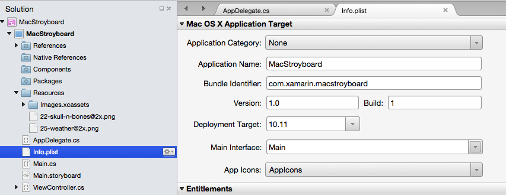](indepth-images/sb01.png#lightbox)

<a name="Loading-from-Code"></a>

## Loading from Code

There might be times when you need to load a specific Storyboard from code and create a View Controller manually. You can use the following code to perform this action:

```csharp
// Get new window
var storyboard = NSStoryboard.FromName ("Main", null);
var controller = storyboard.InstantiateControllerWithIdentifier ("MainWindow") as NSWindowController;

// Display
controller.ShowWindow(this);
```

The `FromName` loads the Storyboard file with the given name that has been included in the app's bundle. The `InstantiateControllerWithIdentifier` creates an instance of the View Controller with the given Identity. You set the Identity in Xcode's Interface Builder when designing the UI:

[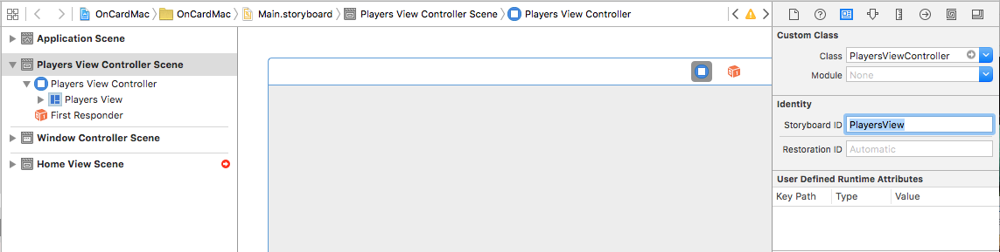](indepth-images/sb02.png#lightbox)

Optionally, you can use the `InstantiateInitialController` method to load the View Controller that has been assigned the Initial Controller in Interface Builder:

[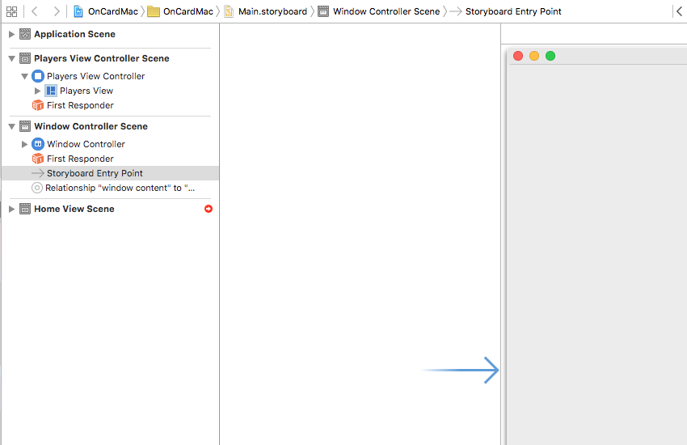](indepth-images/sb03.png#lightbox)

It's marked by the **Storyboard Entry Point** and the open ended arrow above.

<a name="View-Controllers"></a>

## View Controllers

View Controllers define the relationships between a given View of information within a Mac app and the data model that provides that information. Each top level scene in the Storyboard represents one View Controller in the Xamarin.Mac app's code.

<a name="The-View-Controller-Lifecycle"></a>

### The View Controller Lifecycle

Several new methods have been added to the `NSViewController` class to support Storyboards in macOS. Most importantly are the follow methods use to respond to the lifecycle of the View being controlled by the given View Controller:

- `ViewDidLoad` - This method is called when the view is loaded from the Storyboard file.
- `ViewWillAppear` - This method is called just before the view is displayed on screen.
- `ViewDidAppear` - This method is called directly after the view has been displayed on screen.
- `ViewWillDisappear` - This method is called just before the view is removed from the screen.
- `ViewDidDisappear` - This method is called directly after the view has been removed from the screen.
- `UpdateViewConstraints` - This method is called when the constraints that define a view auto layout position and size need to be updated.
- `ViewWillLayout` - This method is called just before the subviews of this view are laid out on screen.
- `ViewDidLayout` - This method is called directly after the subviews of view are laid out on screen.

<a name="The-Responder-Chain"></a>

### The Responder Chain

Additionally, `NSViewControllers` are now part of the Window's _Responder Chain_:

[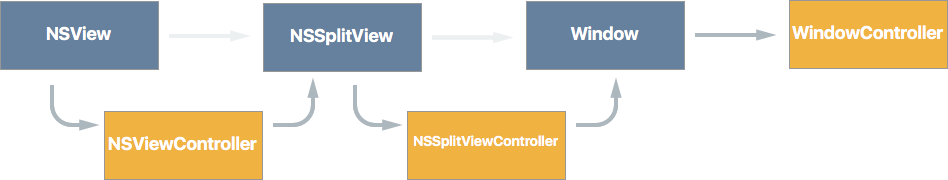](indepth-images/vc01.png#lightbox)

And as such they are wired-up to receive and respond to events such as Cut, Copy and Paste menu item selections. This automatic View Controller wire-up only occurs on apps running on macOS Sierra (10.12) and greater.

<a name="Containment"></a>

### Containment

In Storyboards, View Controllers (such as the Split View Controller and the Tab View Controller) can now implement _Containment_, such that they can "contain" other sub View Controllers:

[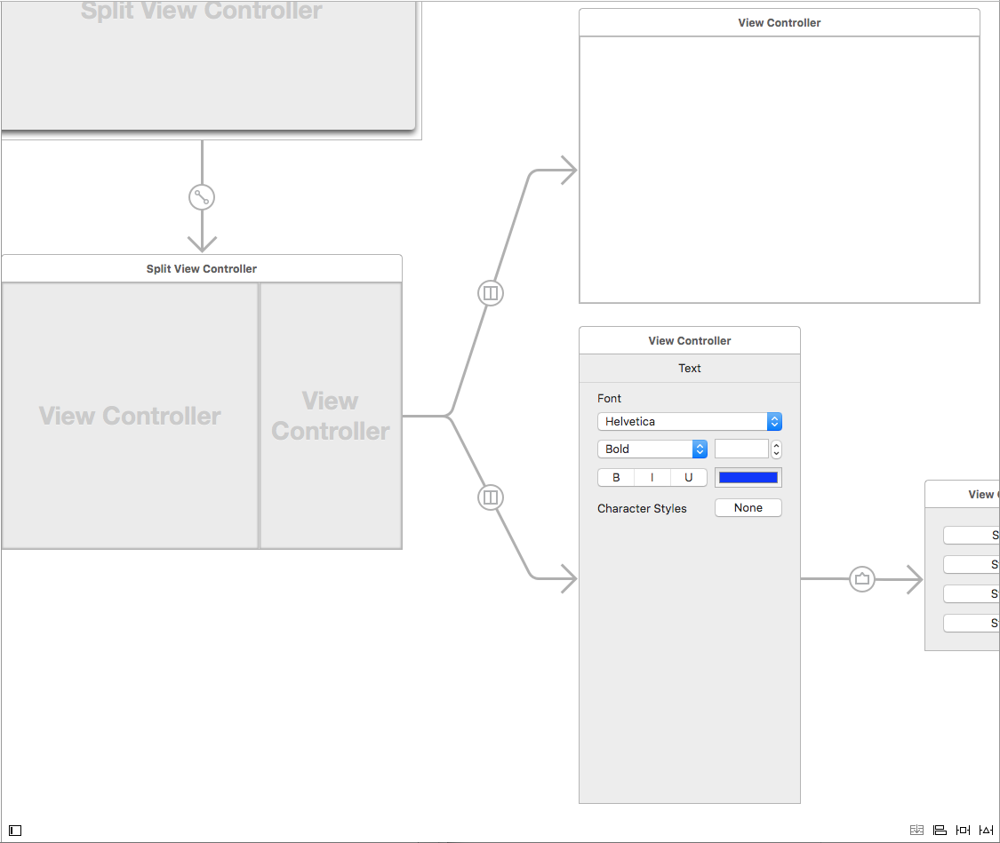](indepth-images/vc02.png#lightbox)

Child View Controllers contain methods and properties to tie them back to their Parent View Controller and to work with displaying and removing Views from the screen.

All Container View Controllers built into macOS have a specific layout which Apple suggest that you follow if creating your own custom Container View Controllers:

[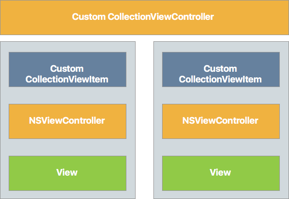](indepth-images/vc03.png#lightbox)

The Collection View Controller contains an array of Collection View Items, each of which contain one or more View Controllers that contain their own Views.

<a name="Segues"></a>

## Segues

Segues provide the relationships between all of the Scenes that define your app's UI. If you are familiar with working in Storyboards in iOS, you know that Segues for iOS usually define transitions between full screen views. This differs from macOS, when Segues usually define "[Containment](#Containment)", where one Scene is the child of a parent Scene.

In macOS, most apps tend to group their views together within the same window using UI elements such as Split Views and Tabs. Unlike iOS, where views need to be transitioned on and off screen, due to limited physical display space.

<a name="Presentation-Segues"></a>

### Presentation Segues

Given macOS's tendencies towards containment, there are situations where _Presentation Segues_ are used, such as Modal Windows, Sheet Views and Popovers. macOS Provides the following built-in segue types:

- **Show** - Displays the target of the Segue as a non-modal window. For example, use this type of Segue to present another instance of a Document Window in your app.
- **Modal** - Presents the target of the Segue as a modal window. For example, use this type of Segue to present the Preferences Window for your app.
- **Sheet** - Presents the target of the Segue as a Sheet attached to the parent window. For example, use this type of segue to present a Find and Replace Sheet.
- **Popover** - Presents the target of the Segue as in a popover window. For Example, use this Segue type to present options when a UI element is clicked by the user.
- **Custom** - Presents the target of the Segue using a custom Segue Type defined by the developer. See the [Creating Custom Segues](#Creating-Custom-Segues) section below for more details.

When using Presentation Segues, you can override the `PrepareForSegue` method of the parent View Controller for presentation to initialize and variables and provide any data to the View Controller being presented.

<a name="Triggered-Segues"></a>

### Triggered Segues

Triggered Segues allow you to specify named Segues (via their **Identifier** property in Interface Builder) and have them triggered by events such as the user clicking a button or by calling the `PerformSegue` method in code:

```csharp
// Display the Scene defined by the given Segue ID
PerformSegue("MyNamedSegue", this);
``` 

The Segue ID is defined inside of Xcode's Interface Builder when you are laying out the app's UI:

[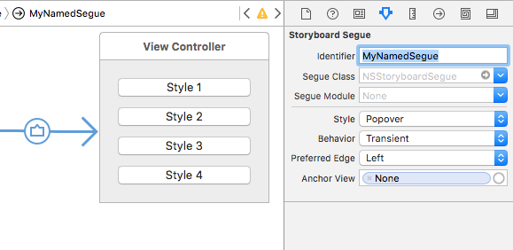](indepth-images/sg02.png#lightbox)

In the View Controller that is acting as the source of the Segue, you should override the `PrepareForSegue` method and do any initialization required before the Segue is executed and the specified View Controller is displayed:

```csharp
public override void PrepareForSegue (NSStoryboardSegue segue, NSObject sender)
{
    base.PrepareForSegue (segue, sender);

    // Take action based on Segue ID
    switch (segue.Identifier) {
    case "MyNamedSegue":
        // Prepare for the segue to happen
        ...
        break;
    }
}
```

Optionally, you can override the `ShouldPerformSegue` method and control whether or not the Segue is actually executed via C# code. For manually presented View Controllers, call their `DismissController` method to remove them from display when they are no longer needed.

<a name="Creating-Custom-Segues"></a>

### Creating Custom Segues

There might be times when your app requires a Segue type not provided by the build-in Segues defined in macOS. If this is the case, you can create a Custom Segue that can be assigned in Xcode's Interface Builder when laying out your app's UI.

For example, to create a new Segue type that replaces the current View Controller inside a Window (instead of opening the target Scene in a new window), we can use the following code:

```csharp
using System;
using AppKit;
using Foundation;

namespace OnCardMac
{
    [Register("ReplaceViewSeque")]
    public class ReplaceViewSeque : NSStoryboardSegue
    {
        #region Constructors
        public ReplaceViewSeque() {

        }

        public ReplaceViewSeque (string identifier, NSObject sourceController, NSObject destinationController) : base(identifier,sourceController,destinationController) {

        }

        public ReplaceViewSeque (IntPtr handle) : base(handle) {
        }

        public ReplaceViewSeque (NSObjectFlag x) : base(x) {
        }
        #endregion

        #region Override Methods
        public override void Perform ()
        {
            // Cast the source and destination controllers
            var source = SourceController as NSViewController;
            var destination = DestinationController as NSViewController;

            // Swap the controllers
            source.View.Window.ContentViewController = destination;

            // Release memory
            source.RemoveFromParentViewController ();
        }
        #endregion

    }
        
}
```

A couple of things to note here:

- We are using the `Register` attribute to expose this class to Objective-C/macOS.
- We are overriding the `Perform` method to actually perform the action of our custom Segue.
- We are replacing the Window's `ContentViewController` controller with the one defined by the target (destination) of the Segue.
- We are removing the original View Controller to free up memory using the `RemoveFromParentViewController` method.

To use this new Segue type in Xcode's Interface Builder, we need to compile the app first, then switch to Xcode and add a new Segue between two scenes. Set the **Style** to **Custom** and the **Segue Class** to `ReplaceViewSegue` (the name of our custom Segue class):

[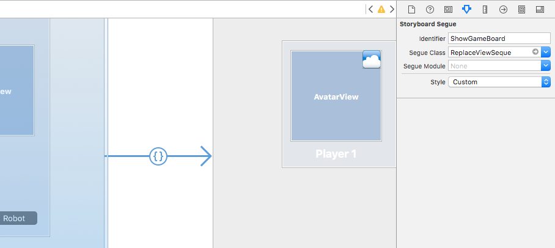](indepth-images/sg01.png#lightbox)

<a name="Triggered-Segues"></a>

## Window Controllers

Window Controllers contain and control the different Window types that your macOS app can create. For Storyboards, they have the following features:

1. They must provide a Content View Controller. This will be the same Content View Controller that the child Window has.
2. The `Storyboard` property will contain the Storyboard that the Window Controller was loaded from, else `null` if not loaded from a Storyboard.
3. You can call the `DismissController` method to close the given Window and remove it from view.

Like View Controllers, Window Controllers implement the `PerformSegue`, `PrepareForSegue` and the `ShouldPerformSegue` methods and can be used as the source of a Segue operation.

Window Controller are responsible for the following features of a macOS app:

- They manage a specific Window.
- They manage the Window's Title Bar and Toolbar (if available).
- They manage the Content View Controller to display the contents of the Window.

<a name="Gesture-Recognizers"></a>

## Gesture Recognizers

Gesture Recognizers for macOS are nearly identical to their counterparts in iOS and allow the developer to easily add gestures (such as clicking a mouse button) to elements in your app's UI.

However, where gestures in iOS are determined by the app's design (such as tapping the screen with two fingers), most gestures in macOS are determined by hardware.

By using Gesture Recognizers, you can greatly reduce the amount of code required to add custom interactions to an item in the UI. As they can automatically determine between double and single clicks, click and drag events, etc.

Instead of overriding the `MouseDown` event in your View Controller, you should be using a Gesture Recognizer to handle the user input event when working with Storyboards.

The following Gesture Recognizers are available in macOS:

- `NSClickGestureRecognizer` - Register mouse down and up events.
- `NSPanGestureRecognizer` - Registers mouse button down, drag and release events.
- `NSPressGestureRecognizer` - Registers holding a mouse button down for a given amount of time event.
- `NSMagnificationGestureRecognizer` - Registers a magnification event from trackpad hardware.
- `NSRotationGestureRecognizer` - Registers a rotation event from trackpad hardware.

<a name="Using-Storyboard-References"></a>

## Using Storyboard References

A Storyboard Reference allows you to take a large, complex Storyboard design and break it into smaller Storyboards that get referenced from the original, thus removing complexity and making the resulting individual Storyboards easier to design and maintain.

Additionally, a Storyboard Reference can provide an _anchor_ to another scene within the same Storyboard or a specific scene on a different one.

<a name="Referencing-an-External-Storyboard"></a>

### Referencing an External Storyboard

To add a reference to an external Storyboard, do the following:

1. In the **Solution Explorer**, right-click on the Project Name and select **Add** > **New File...** > **Mac** > **Storyboard**. Enter a **Name** for the new Storyboard and click the **New** button: 

    [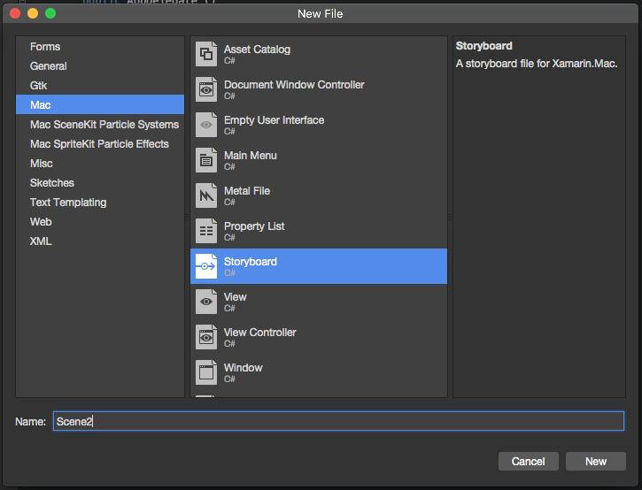](indepth-images/ref01.png#lightbox)
2. In the **Solution Explorer**, double-click the new Storyboard name to open it for editing in Xcode's Interface Builder.
3. Design the layout of the new Storyboard's scenes as you normally would and save your changes: 

    [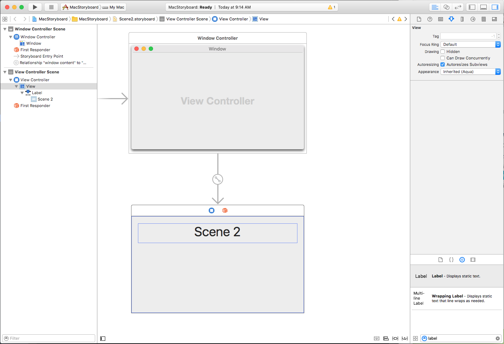](indepth-images/ref02.png#lightbox)
4. Switch to the Storyboard that you are going to be adding the reference to in the Interface Builder.
5. Drag a **Storyboard Reference** from the **Object Library** onto the Design Surface: 

    [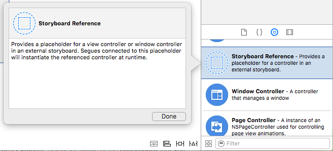](indepth-images/ref03.png#lightbox)
6. In the **Attribute Inspector**, select the name of the **Storyboard** that you created above: 

    [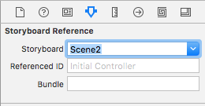](indepth-images/ref04.png#lightbox)
7. Control-click on a UI Widget (like a Button) on an existing Scene and create a new Segue to the **Storyboard Reference** that you just created.  From the popup menu select **Show** to complete the Segue: 

    [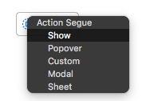](indepth-images/ref06.png#lightbox) 
8. Save your changes to the Storyboard.
9. Return to Visual Studio for Mac to sync your changes.

When the app is run and the user clicks on the UI element that you created the Segue from, the Initial Window Controller from the External Storyboard specified in the Storyboard Reference will be displayed.

<a name="Referencing-a-Specific-Scene-in-an-External-Storyboard"></a>

### Referencing a Specific Scene in an External Storyboard

To add a reference to a specific Scene an external Storyboard (and not the Initial Window Controller), do the following:

1. In the **Solution Explorer**, double-click the external Storyboard to open it for editing in Xcode's Interface Builder.
2. Add a new Scene and design its layout as you normally would: 

    [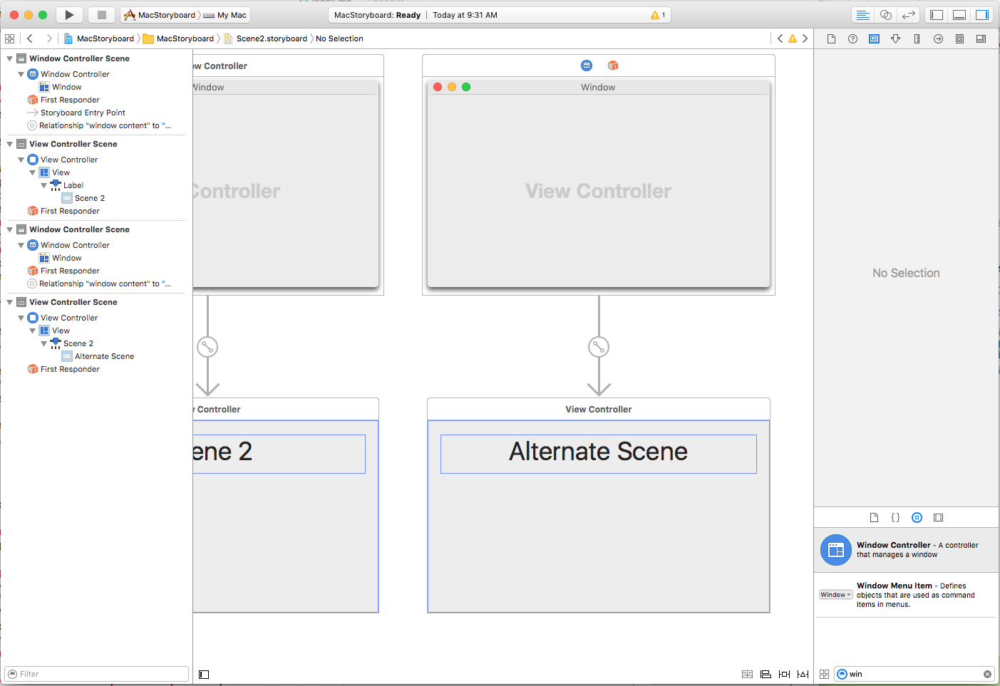](indepth-images/ref07.png#lightbox)
3. In the **Identity Inspector**, enter a **Storyboard ID** for the new Scene's Window Controller: 

    [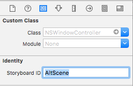](indepth-images/ref08.png#lightbox)
4. Open the Storyboard that you are going to be adding the reference to in Interface Builder.
5. Drag a **Storyboard Reference** from the **Object Library** onto the Design Surface: 

    [](indepth-images/ref03.png#lightbox)
6. In the **Identity Inspector**, select the name of the **Storyboard** and the **Reference ID** (Storyboard ID) of the Scene that you created above: 

    [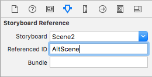](indepth-images/ref09.png#lightbox)
7. Control-click on a UI Widget (like a Button) on an existing Scene and create a new Segue to the **Storyboard Reference** that you just created. From the popup menu select **Show** to complete the Segue: 

    [](indepth-images/ref06.png#lightbox) 
8. Save your changes to the Storyboard.
9. Return to Visual Studio for Mac to sync your changes.

When the app is run and the user clicks on the UI element that you created the Segue from, the Scene with the given **Storyboard ID** from the External Storyboard specified in the Storyboard Reference will be displayed.

<a name="Referencing-a-Specific-Scene-in-the-Same-Storyboard"></a>

### Referencing a Specific Scene in the Same Storyboard

To add a reference to a specific Scene the same Storyboard, do the following:

1. In the **Solution Explorer**, double-click the Storyboard to open it for editing.
2. Add a new Scene and design its layout as you normally would: 

    [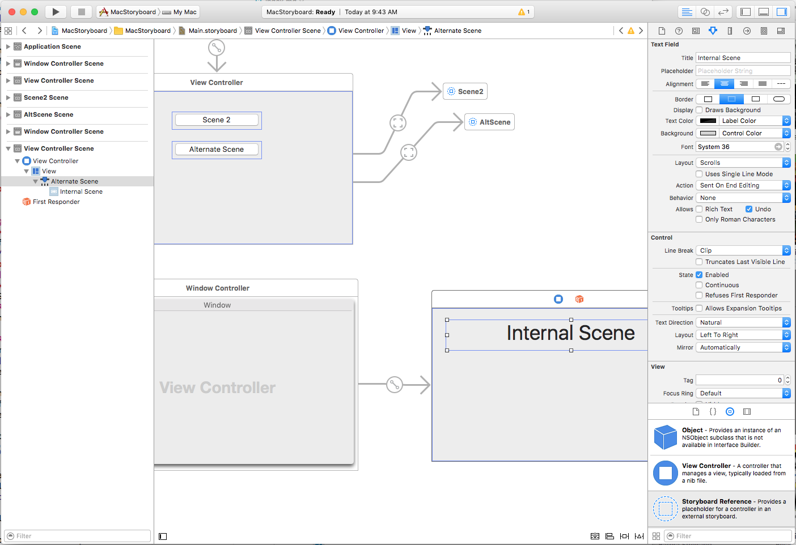](indepth-images/ref11.png#lightbox)
3. In the **Identity Inspector**, enter a **Storyboard ID** for the new Scene's Window Controller: 

    [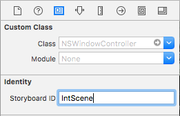](indepth-images/ref12.png#lightbox)
4. Drag a **Storyboard Reference** from the **Toolbox** onto the Design Surface: 

    [](indepth-images/ref03.png#lightbox)
5. In **Attribute Inspector**, select **Reference ID** (Storyboard ID) of the Scene that you created above: 

    [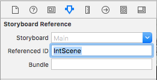](indepth-images/ref13.png#lightbox)
6. Control-click on a UI Widget (like a Button) on an existing Scene and create a new Segue to the **Storyboard Reference** that you just created. From the popup menu select **Show** to complete the Segue: 

    [](indepth-images/ref06.png#lightbox) 
7. Save your changes to the Storyboard.
8. Return to Visual Studio for Mac to sync your changes.

When the app is run and the user clicks on the UI element that you created the Segue from, the Scene with the given **Storyboard ID** in the same Storyboard specified in the Storyboard Reference will be displayed.

<a name="Complex-Storyboard-Example"></a>

## Complex Storyboard Example

For a complex example of working with Storyboards in a Xamarin.Mac app, please see the [SourceWriter Sample App](/samples/xamarin/mac-samples/sourcewriter). SourceWriter is a simple source code editor that provides support for code completion and simple syntax highlighting.

The SourceWriter code has been fully commented and, where available, links have be provided from key technologies or methods to relevant information in the Xamarin.Mac Guides Documentation.

## Related Links

- [Hello, Mac](~/mac/get-started/hello-mac.md)
- [Working with Windows](~/mac/user-interface/window.md)
- [OS X Human Interface Guidelines](https://developer.apple.com/library/mac/documentation/UserExperience/Conceptual/OSXHIGuidelines/)
- [Introduction to Windows](https://developer.apple.com/library/mac/documentation/Cocoa/Conceptual/WinPanel/Introduction.html#//apple_ref/doc/uid/10000031-SW1)