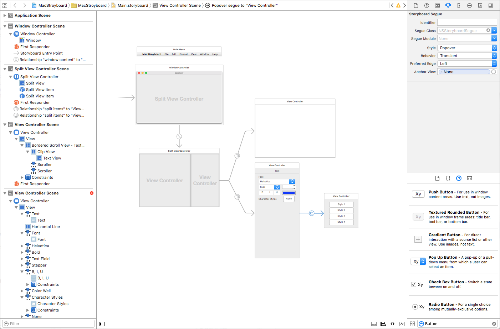
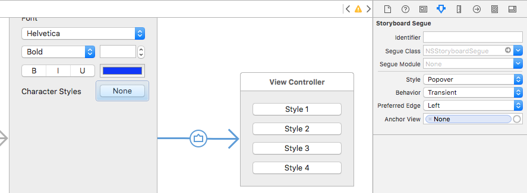
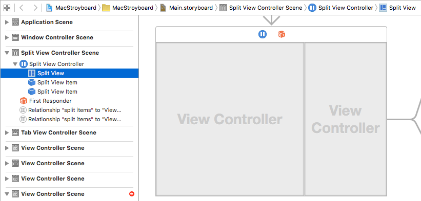

# Introduction to Storyboards in Xamarin.Mac

_This article provides an introduction to working with Storyboards in a Xamarin.Mac app. It covers creating and maintaining the app's UI using storyboards and Xcode's Interface Builder._

Storyboards allow you to develop a User Interface for your Xamarin.Mac app that not only includes the window definitions and controls, but also contains the links between different windows (via segues) and view states.

This article will provide an introduction to using Storyboards to define a Xamarin.Mac app's user Interface.

## What are Storyboards?

By using Storyboards, all of a Xamarin.Mac app's UI can be defined in a single location with all of the navigation between its individual elements and user interfaces. Storyboards for Xamarin.Mac, work in a very similar fashion to Storyboards for Xamarin.iOS. However, they contain a different set of _Segue Types_ because of the different interface idioms.

### Working with Scenes

As stated above, a Storyboard defines all of the UI for a given app broken down into a functional overview of its _View Controllers_. In Xcode's Interface Builder, each of these controllers lives in its own _Scene_.

Each Scene represents a given View and View Controller Pair with a set of lines (called Segues) that connect each Scene in the UI, thus showing their relationships. Some Segues define how one View Controller contains one or more child Views or View Controllers. Other Segues, define transitions between View Controller (such as displaying a popover or dialog box). 

The most important thing to note is that each Segue represents the flow of some form of data between the given element of the app's UI.

### Working with View Controllers

View Controllers define the relationships between a given View of information within a Mac app and the data model that provides that information. Each top level scene in the Storyboard represents one View Controller in the Xamarin.Mac app's code.

In this way, each View Controller is a self-contained, reusable pairing of both the information's visual representation (View) and the logic to present and control that information.

Within a given Scene, you can do all of the things that would normally have been handled by individual `.xib` files: 

- Place subviews and controls (such as buttons and text boxes).
- Define element positions and auto layout constraints.
- Wire-up Actions and Outlets to expose UI elements to code.

### Working with Segues

As stated above, Segues provide the relationships between all of the Scenes that define your app's UI. If you are familiar with working in Storyboards in iOS, you know that Segues for iOS usually define transitions between full screen views. This differs from macOS, when Segues usually define "containment" (where one Scene is the child of a parent Scene).

In macOS, most apps tend to group their views together within the same window using UI elements such as Split Views and Tabs. Unlike iOS, where views need to be transitioned on and off screen, due to limited physical display space.

Given macOS's tendencies towards containment, there are situations where _Presentation Segues_ are used, such as Modal Windows, Sheet Views and Popovers.

When using Presentation Segues, you can override the `PrepareForSegue` method of the parent View Controller for presentation to initialize and variables and provide any data to the View Controller being presented.

### Design and Run Times

At Design time (when layout out the UI in Xcode's Interface Builder), each element of the app's UI is broken down into it's constituent items:

- **Scenes** - Which are composed of:
  - **View Controller** - That define the relationships between Views and the data that support them.
  - **Views and Subviews** - The actual elements that make up the user interface.
  - **Containment Segues** - That define the parent-child relationships between Scenes.
- **Presentation Segues** - That define individual presentation modes. 

By defining each element in this way, it allows for the lazy-loading of each element only as it is needed during runtime. In macOS, the entire process was designed to allow the developer to create complex, flexible User Interfaces that require a bare minimum of backing code to make them work, all while being as efficient with system resources as possible.

## Storyboard Quick Start

In the [Storyboard Quick Start](~/mac/platform/storyboards/quickstart.md) guide, we'll create a simple Xamarin.Mac app that introduces the key concepts of working with storyboards to create a User Interface. The sample app will consist of a Spilt View containing a _Content Area_ and an _Inspector Area_ and it will present a simple Preferences Dialog window. We'll be using Segues to tie all of the User Interface elements together.

## Working with Storyboards

This section covers the in-depth details of [Working with Storyboards](~/mac/platform/storyboards/indepth.md) in a Xamarin.Mac app. We take an in-depth look at Scenes and how they are composed of View Controllers and View. Then, we'll take a look at how Scenes are tied together with Segues. Finally, we'll take a look at working with custom Segue types. 

## Complex Storyboard Example

For an example of a complex example of working with Storyboards in a Xamarin.Mac app, please see the [SourceWriter Sample App](/samples/xamarin/mac-samples/sourcewriter). SourceWriter is a simple source code editor that provides support for code completion and simple syntax highlighting.

The SourceWriter code has been fully commented and, where available, links have be provided from key technologies or methods to relevant information in the Xamarin.Mac Guides Documentation.

## Summary

This article has taken a quick look at working with Storyboards in a Xamarin.Mac app. We saw how to create a new app using storyboards and how to define a user interface. We also saw how to navigate between different windows and view states using segues.

## Related Links

- [Mac samples](/samples/browse/?products=xamarin&term=Xamarin.Forms&terms=mac)
- [Hello Mac](/xamarin/mac/get-started/hello-mac)
- [OS X Human Interface Guidelines](https://developer.apple.com/design/human-interface-guidelines/macos/overview/themes/)
- [Introduction to Windows](https://developer.apple.com/library/mac/documentation/Cocoa/Conceptual/WinPanel/Introduction.html#//apple_ref/doc/uid/10000031-SW1)