# Storyboards in Xamarin.Mac – Quick Start

As a quick introduction to using Storyboards to define a Xamarin.Mac app's User Interface, let's start a new Xamarin.Mac project. Select **Mac** > **App** > **Cocoa App** and click the **Next** button:

[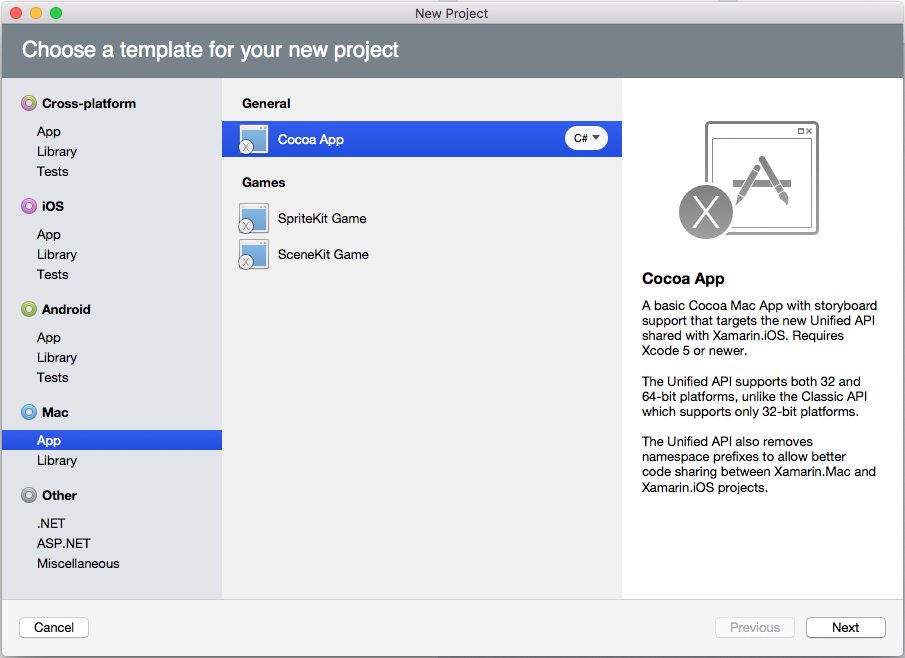](quickstart-images/qs01.png#lightbox)

Use the **App Name** of `MacStoryboard` and click the **Next** button:

[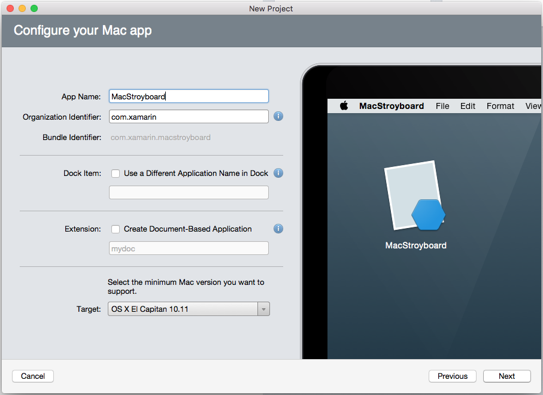](quickstart-images/qs02.png#lightbox)

Use the default **Project Name** and **Solution Name** and click the **Create** button:

[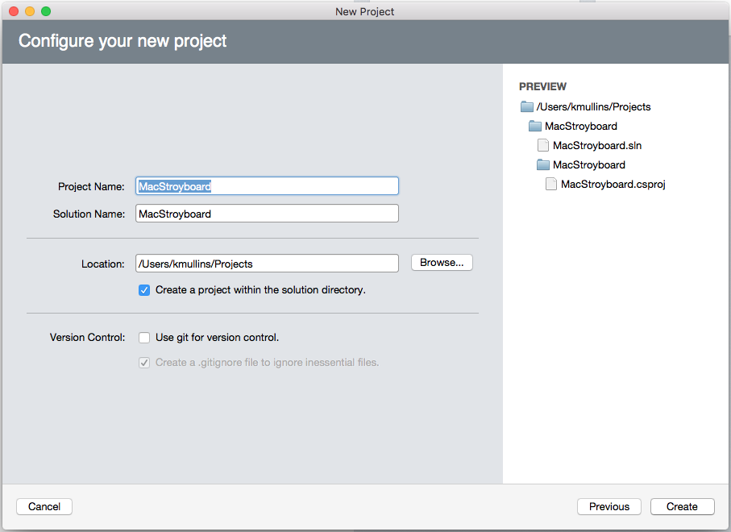](quickstart-images/qs03.png#lightbox)

In the **Solution Explorer**, double-click the `Main.storyboard` file to open it for editing in Xcode's Interface Builder:

[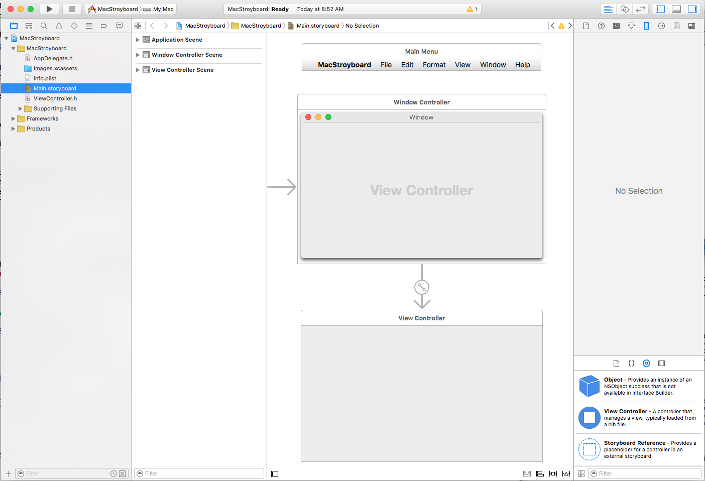](quickstart-images/qs04.png#lightbox)

As you can see above, the default Storyboard defines both the app's Menu Bar and its main Window with it View Controller and View. For our sample app, we are going to be creating a UI that has a main _Content View_ on one side and an _Inspector View_ in the second.

To do this, we will need to first remove the default View Controller and View that comes with the Storyboard by select it in Interface Builder and pressing the **Delete** key:

Next, type `split` into the **Filter** area, select the Vertical Split View Controller and drag it onto the _Design Surface_:

[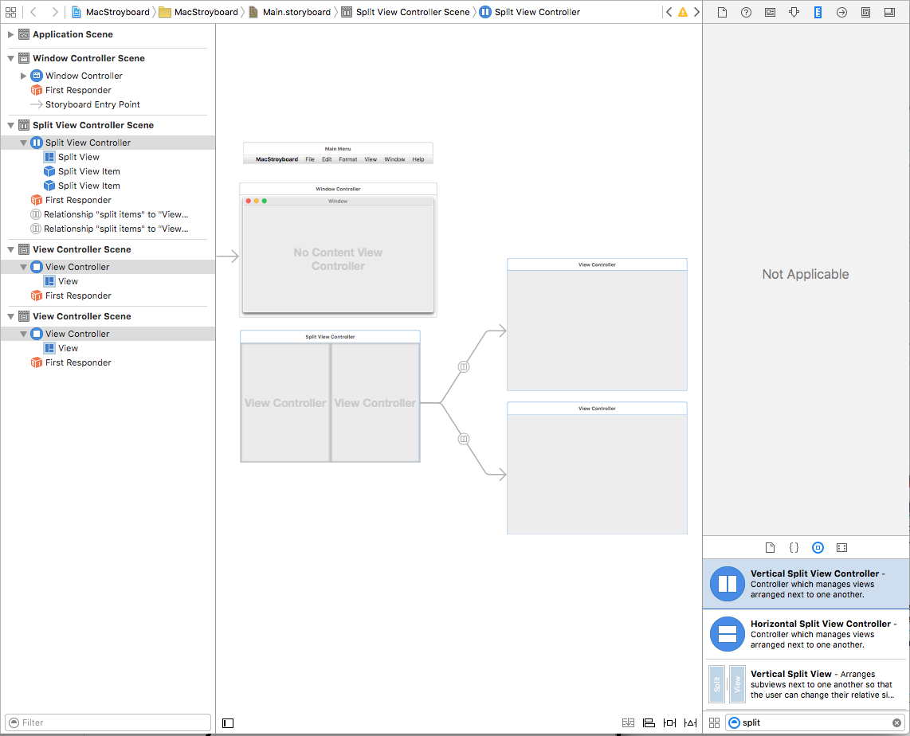](quickstart-images/qs06.png#lightbox)

Notice that the controller automatically included two child View Controllers (and their related views), wired-up to the left and right sides of the split view. To tie the split view to it's parent window, press the **Control** key, click on the Window Controller (the blue circle in the Window Controller's frame) and drag a line to the Split View Controller. Select **window content** from the popup:

This will tie the two interface element together using a Segue:

[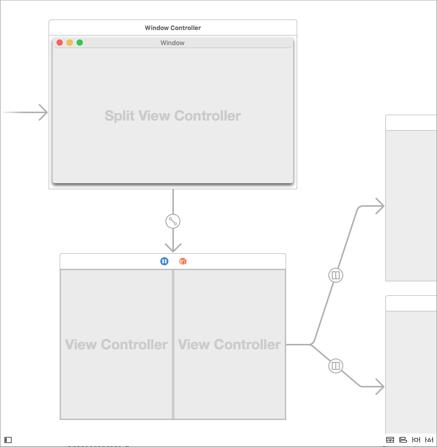](quickstart-images/qs08.png#lightbox)

We want to place a Text View in the left side of the Split View and have it automatically fill the available area when either the Window or the Split View is resized. Drag a Text View onto the top View Controller attached to the Split View and click the **Pin** auto layout constraint (the second icon from the right at the bottom of the Design Surface).

[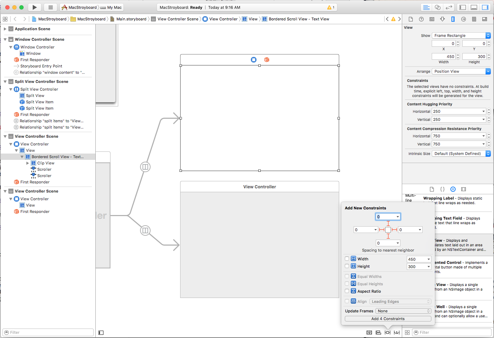](quickstart-images/qs09.png#lightbox)

From here we will click all four of the **I-Beam** icons around the bounding box at the top of the Constraints Popover and click the **Add 4 Constraints** button at the bottom to add the required constraints.

If we return to Visual Studio for Mac and run the project, notice that the Text View automatically resizes to fill the left side of the Split View as the Window or the split are resized:

[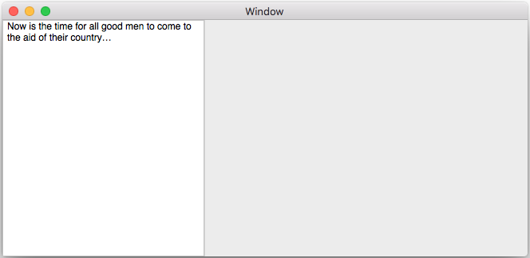](quickstart-images/qs10.png#lightbox)

Since we are going to be using the right hand side of the split view as an Inspector area, we want it to have a smaller size and allow it to be collapsed. Return to Xcode and edit the View for the right side by selecting it in the Design Surface and clicking on the **Size Inspector**. From here enter a **Width** of `250`:

Next select the Split Item that represents the right side, set a higher **Holding Priority** and click the **User Can Collapse** checkbox:

[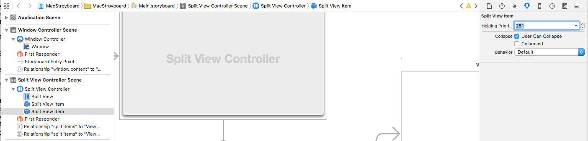](quickstart-images/qs12.png#lightbox)

If we return to Visual Studio for Mac and run the project now, notice that the right side keeps it's smaller size and the window is resized:

[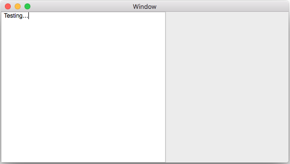](quickstart-images/qs13.png#lightbox)

## Defining a Presentation Segue

We are going to layout the right hand side of the Split View to act as an Inspector for the selected text's properties. We'll drag some controls onto the bottom view to layout the UI of the inspector. For the last control, we want to display a popover that allows the user to select from four preset character styles.

We'll add a Button to the Inspector and a View Controller to the Design Surface. We'll resize the View Controller to be the size that we want our Popover to be and add four Buttons to it. Next we'll **Control** key-click on the button in the Inspector View and drag to the View Controller that will represent our popover:

[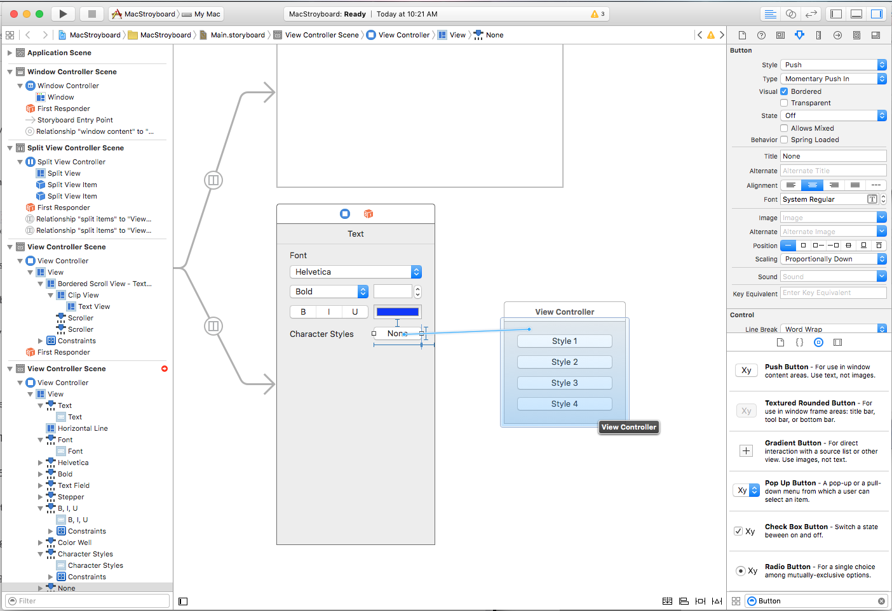](quickstart-images/qs14.png#lightbox)

From the popup menu, we'll select **Popover**: 

[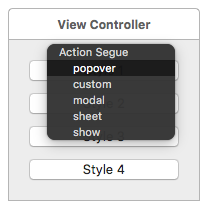](quickstart-images/qs15.png#lightbox)

Finally, we'll select the Segue in the Design Surface and set the **Preferred Edge** to **Left**. Then, we'll drag a line from the **Anchor View** to the Button that we want the popover to be attached to:

[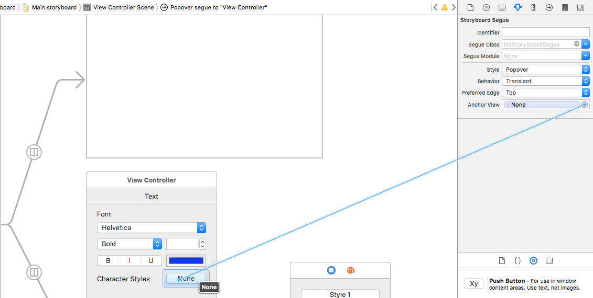](quickstart-images/qs16.png#lightbox)

If we return to Visual Studio for Mac, run the app and click on the **None** button in the Inspector, the popover will be displayed:

[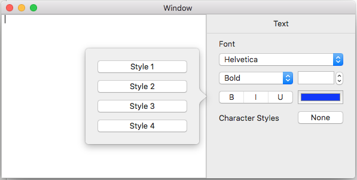](quickstart-images/qs17.png#lightbox)

## Creating App Preferences

Most standard macOS apps provide a _Preference Dialog_ that allows the user to define several options that control various aspects of the app, such as appearance or user accounts.

To define a standard Preference Dialog Window, first drag a Tab View Controller onto the Design Surface:

Again, this will automatically come with two child View Controllers attached. For example sake, we'll add a label to each view that will center inside of it:

[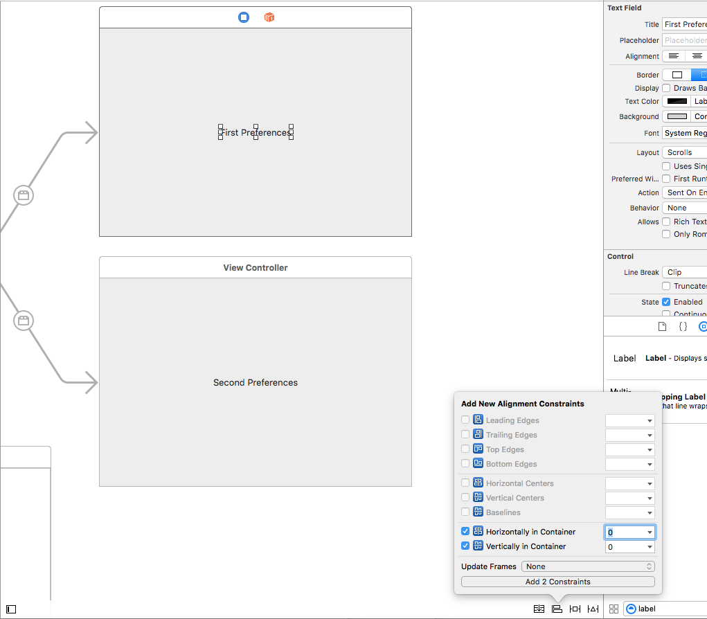](quickstart-images/qs19.png#lightbox)

Next, we want to display the Preferences window when the user selects the **Preferences...** menu item. From the Menu Bar, select the preferences menu item, **Control** key-click and drag a line to our Tab View Controller:

[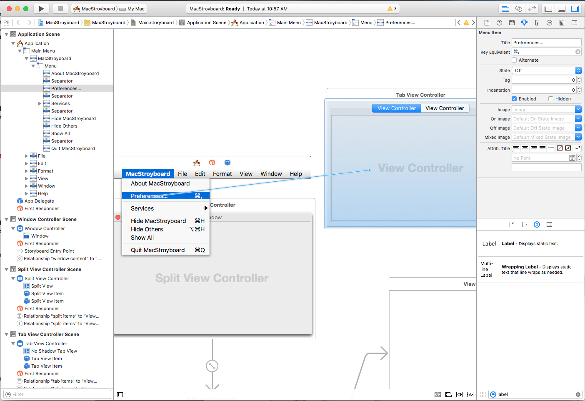](quickstart-images/qs20.png#lightbox)

From the popup, we'll select **Modal** to show this window as a Modal Dialog:

[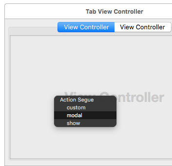](quickstart-images/qs21.png#lightbox)

If we save our changes, return to Visual Studio for Mac, run the app and select the **Preferences...** menu item, our new Preferences dialog will be displayed:

[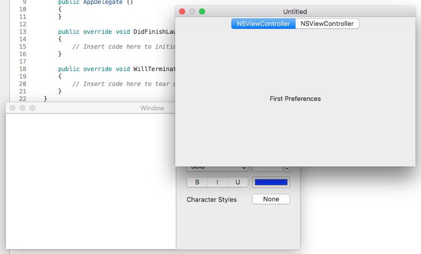](quickstart-images/qs22.png#lightbox)

You might notice that this doesn't look like a standard macOS app Preference Dialog Window. To fix this, include two image files in the Xamarin.Mac app's `Resources` folder in the **Solution Explorer** and return to Xcode's Interface Builder.

Select the Tab View Controller and switch its **Style** to **Toolbar**: 

[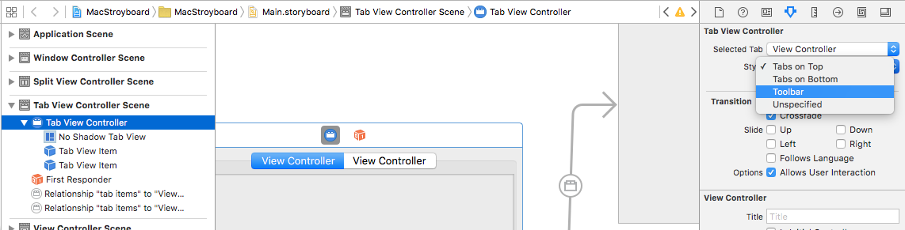](quickstart-images/qs23.png#lightbox)

Select each Tab and give it a **Label** and select one of the images to represent it:

[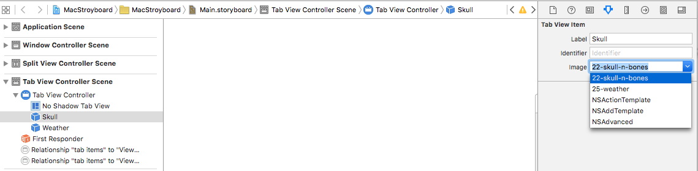](quickstart-images/qs24.png#lightbox)

If we save our changes, return to Visual Studio for Mac, run the app and select the **Preferences...** menu item, the dialog will now be displayed like a standard macOS app:

[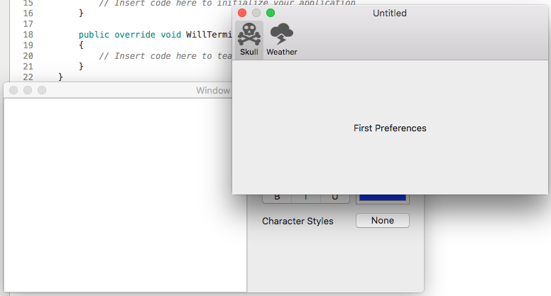](quickstart-images/qs25.png#lightbox)

For more information, please see our [Working with Images](~/mac/app-fundamentals/image.md), [Menus](~/mac/user-interface/menu.md), [Windows](~/mac/user-interface/window.md) and [Dialogs](~/mac/user-interface/dialog.md) documentation.

## Related Links

- [Hello, Mac](~/mac/get-started/hello-mac.md)
- [Working with Windows](~/mac/user-interface/window.md)
- [macOS Human Interface Guidelines](https://developer.apple.com/design/human-interface-guidelines/macos/overview/themes/)
- [Introduction to Windows](https://developer.apple.com/library/mac/documentation/Cocoa/Conceptual/WinPanel/Introduction.html#//apple_ref/doc/uid/10000031-SW1)
