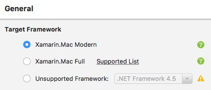
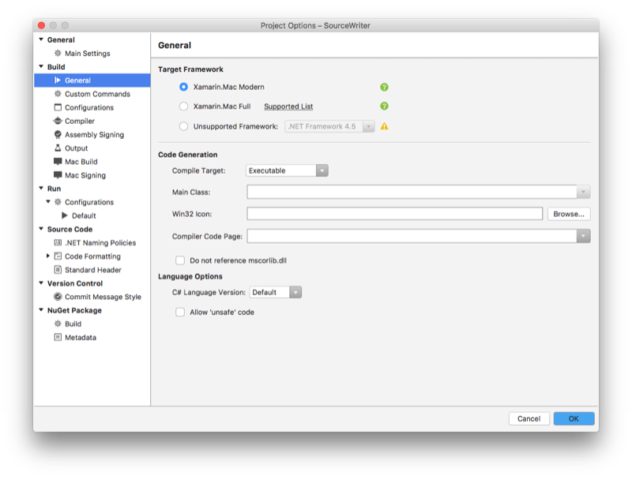

# Target Framework for Xamarin.Mac

_This article covers the target frameworks (Base Class Libraries) available for Xamarin.Mac, and the implications of using them in your Xamarin.Mac project._

## Background

Every .NET program or library depends on functionality provided by the Base Class Library (BCL). This BCL includes assemblies such as mscorlib, System, System.Net.Http, and System.Xml that provide the common functionality built into all .NET languages.

Over the years, there have developed multiple different versions of this BCL, optimized for different use cases. The “desktop” BCL includes a richer set of libraries which might be too heavyweight for other use cases, while mobile focuses on ensuring APIs are safe for linking, which removes unused code to reduce application footprint.

One of the more important repercussions of these different Target Frameworks, is that all of the assemblies in a given program *must* target compatible BCL assemblies. If this was not the case, you could have two assemblies linked against different versions of the **System.dll** disagreeing about the signature of a given type. A shared library can either target [.NET Standard 2](https://blog.xamarin.com/share-code-net-standard-2-0/), which is the common subset of the Target Frameworks, or a specific target framework.

There are three Target Framework options available for Xamarin.Mac, each with different advantages and tradeoffs:

- **Modern** (called Mobile in older documentation) – A very similar subset to what powers Xamarin.iOS, highly tuned for performance and size. This Target Framework is linker safe, so these projects can have their final footprint drastically reduced by removing unused code.

- **Full** (called XM 4.5 in older documentation) – A very similar subset to the “desktop” BCL, with a few small removals. As the Target Framework is almost identical to net45 (and later), it can easily consume many nugets that do not provide either netstandard2 or specific Xamarin.Mac builds. However, due to System.Configuration usage it is incompatible with linking.

- **Unsupported** (called System in older documentation) – Instead of linking to a BCL provided by Xamarin.Mac, use the current system installed mono. This provides the fullest set of assemblies, including some known to be problematic (System.Drawing for example). This option exists only has a “last resort” and it is strongly suggested to exhaust other options before using it. As the name implies, usage is unsupported by official support channels.

## Setting the target framework

To change to the Target Framework type for a Xamarin.Mac project, do the following:

1. Open the Xamarin.Mac project in Visual Studio for Mac.
2. In the **Solution Explorer**, double-click the project file to open the **Project Options** dialog box.
3. From the **General** tab, select the type of **Target Framework** that suits your application's needs:

  

4. Click the **OK** button to save your changes.

You should **Clean** and then **Rebuild** your Xamarin.Mac project after switching the Target Framework type.

## Summary

This article has briefly covered the different types of Target Frameworks (Base Class Libraries) available to a Xamarin.Mac application and when each type of framework should be used.

## Related Links

- [iOS and Mac code sharing](~/cross-platform/macios/index.md)
- [Unified API](~/cross-platform/macios/unified/index.md)
- [Portable Class Libraries](~/cross-platform/app-fundamentals/pcl.md)
- [Assemblies](~/cross-platform/internals/available-assemblies.md)
- [Updating existing Mac apps](~/cross-platform/macios/unified/updating-mac-apps.md)
