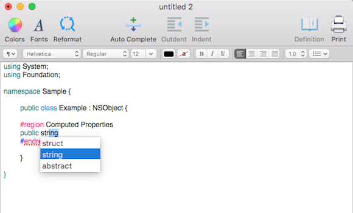

# Xamarin.Mac samples

Xamarin.Mac sample apps and code demos to help you get started building mobile apps with C# and Xamarin.

[All Xamarin.Mac samples](https://docs.microsoft.com/samples/browse/?products=xamarin&term=Xamarin.Mac)

:::row:::
    :::column:::

### [Hello, Mac](https://docs.microsoft.com/samples/xamarin/mac-samples/hello-mac/)

Hello World app to get started with Mac development.
    :::column-end:::
    :::column:::

### [MacControls](https://docs.microsoft.com/samples/xamarin/mac-samples/maccontrols/)

UI control examples for Mac apps.
    :::column-end:::
    :::column:::

### [MacImages](https://docs.microsoft.com/samples/xamarin/mac-samples/macimages/)

UI control examples for Mac apps.
    :::column-end:::
:::row-end:::

:::row:::
    :::column:::

### [SourceWriter](https://docs.microsoft.com/samples/xamarin/mac-samples/sourcewriter/)

Simple editor that provides support for code completion and syntax highlighting.
    :::column-end:::
    :::column:::
    :::column-end:::
    :::column:::
    :::column-end:::
:::row-end:::

## All samples

For the complete set of Xamarin.Mac sample apps and code demos, see [All Xamarin.Mac samples](https://docs.microsoft.com/samples/browse/?products=xamarin&term=Xamarin.Mac).
