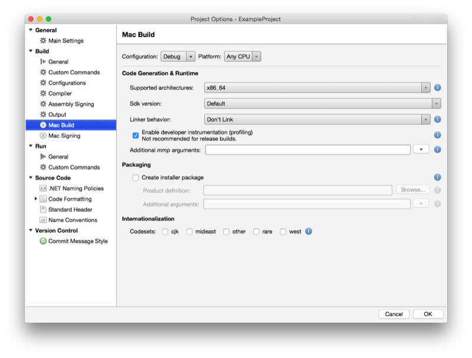
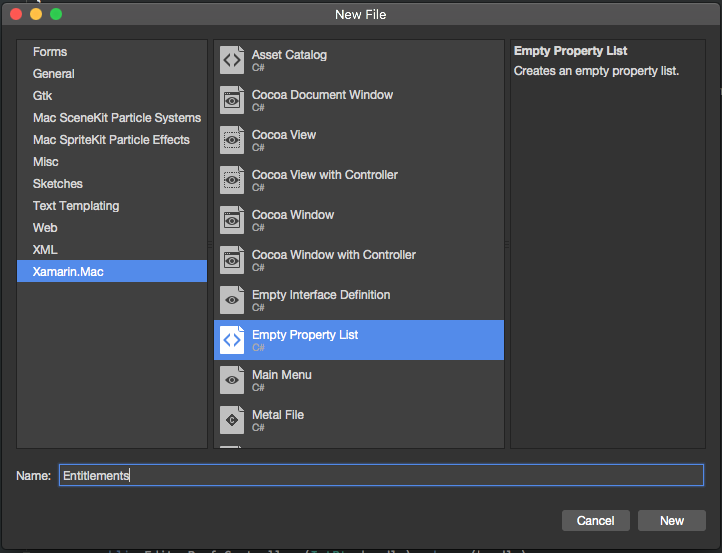

# Xamarin.Mac troubleshooting tips

## Overview

Sometimes we all get stuck while working on a project, either on the inability to get an API to work the way we want or in trying to work around a bug. Our goal at Xamarin is for you to be successful in writing your mobile and desktop applications, and we’ve provided some resources to help.

With any of these resources, there are some steps of preparation you can take to help them solve your issue quickly:

- Determine the root cause of the issue as best as possible to report crashes:

  - "My application crashes" is difficult to diagnose. "My application crashes when I return an empty array to this call" is much easier to work on fixing.

  - "I can’t get NSTable to work" is less helpful than "None of the methods on my NSTableDelegate seem to be called in this case."

- If possible provide a small example program showing the issue. Digging through pages of source code looking for the issue takes orders of magnitude more time and effort.

- Knowing what changes you’ve made to your application to cause an issue to appear can quickly narrow down the source of the problem. Noting if you’ve recently upgraded versions of Xamarin.Mac, trimming out sections of your application to find the part causing the issue, or testing previous builds to find what change introduced the issue can be very helpful.

### What to do when your app crashes with no output

In most cases, the debugger in Visual Studio for Mac will catch exceptions and crashes in your application and help you track down the root cause. However there are some cases where your application will bounce on the dock and then exit with little or no output. These can include:

- Code signing issues.
- Certain mono runtime crashes.
- Some Objective-c exceptions and crashes.
- Some crashes very early the process lifetime.
- Some stack overflows.
- The macOS version listed in your **Info.plist** is newer than your currently installed macOS version or it is invalid.

Debugging these programs can be frustrating, as finding the information necessary can be difficult. Here are a few approaches that may help:

- Ensure that the macOS version listed in the **Info.plist** is the same one as the version of macOS currently installed on the computer.
- Check the Visual Studio for Mac Application Output (**View** -> **Pads** -> **Application Output**) for stack traces or output in red from Cocoa that may describe the output.
- Run your application from the command line and look at the output (in the **Terminal** app) by using:

  `MyApp.app/Contents/MacOS/MyApp` (where `MyApp` is the name of your application)
- You can increase the output by adding "MONO_LOG_LEVEL" to your command on the command line, for example:

  `MONO_LOG_LEVEL=debug MyApp.app/Contents/MacOS/MyApp`
- You could attach a native debugger (`lldb`) to your process to see if that provides any more information (this requires a paid license). For example, do the following:

  1. Enter `lldb MyApp.app/Contents/MacOS/MyApp` in the Terminal.
  2. Enter `run` in the Terminal.
  3. Enter `c` in the Terminal.
  4. Exit when finished debugging.
- As a last resort, before calling `NSApplication.Init` in your `Main` method (or in other places as required), you could write text to a file in a known location to track down at what step of launch you are running into trouble.

## Known issues

The following sections cover known issues and their solutions.

### Unable to connect to the debugger in sandboxed apps

The debugger connects to Xamarin.Mac apps through TCP, which means that by default when you enable sandboxing, it is unable to connect to the app, so if you try to run the app without the proper permissions enabled, you get an error *“Unable to connect to the debugger”*.

The **Allow Outgoing Network Connections (Client)** permission is the one required for the debugger, enabling this one will allow debugging normally. Since you can’t debug without it, we have updated the `CompileEntitlements` target for `msbuild` to automatically add that permission to the entitlements for any app that is sandboxed for debug builds only. Release builds should use the entitlements specified in the entitlements file, unmodified.

### System.NotSupportedException: no data is available for encoding 437

When including 3rd party libraries in your Xamarin.Mac app, you might get an error in the form "System.NotSupportedException: No data is available for encoding 437" when trying to compile and run the app. For example, libraries, such as `Ionic.Zip.ZipFile`, may throw this exception during operation.

This can be solved by opening the options for the Xamarin.Mac project, going to **Mac Build** > **Internationalization** and checking the **West** internationalization:

### Failed to compile (mm5103)

This error is usually caused when a new version of Xcode is release and you have installed the new version but no yet run it. Before trying to compile with a new version of Xcode, you need to first run that version at least once.

The first time you run a new version of Xcode, it installs several command line tools that are required by Xamarin.Mac. Additionally, you should do a clean build after updating Xcode or your Xamarin.Mac version.

If you cannot resolve this issue, please [file a bug](#filing-a-bug).

### Missing entitlements.plist

The latest version of Visual Studio for Mac has removed the Entitlements section from the **Info.plist** editor and placed it in separate **Entitlements.plist** editor (for better cross-platform support with Xamarin.iOS).

With the new Visual Studio for Mac installed, when you create a new Xamarin.Mac app project, an **Entitlements.plist** file will automatically be added to the project tree:

If you double-click the **Entitlements.plist** file, the Entitlements Editor will be displayed:

For existing Xamarin.Mac projects, you will need to manually create the **Entitlements.plist** file by right-clicking on the project in the **Solution Pad** and selecting **Add** > **New File...**. Next, select **Xamarin.Mac** > **Empty Property List**:

Enter `Entitlements` for the name and click the **New** button. If your project previously included an Entitlements file, you will be prompted to add it to the project instead of creating a new file:

## Community support on the forums

The community of developers using Xamarin products is amazing and many visit our [Xamarin.Mac forums](https://forums.xamarin.com/categories/xamarin-mac) to share experiences and their expertise. In addition, Xamarin engineers periodically visit the forum to help.

## Filing a bug

Your feedback is important to us. If you find any problems with Xamarin.Mac:

- Search the [issue repository](https://github.com/xamarin/xamarin-macios/issues)
- Before switching to GitHub issues, Xamarin issues were tracked on [Bugzilla](https://bugzilla.xamarin.com/describecomponents.cgi). Please search there for matching issues.
- If you cannot find a matching issue, please file a new issue in the [GitHub issue repository](https://github.com/xamarin/xamarin-macios/issues/new).

GitHub issues are all public. It’s not possible to hide comments or attachments.

Please include as much of the following as possible:

- A simple example reproducing the issue. This is **invaluable** where possible.
- The full stack trace of the crash.
- The C# code surrounding the crash.
