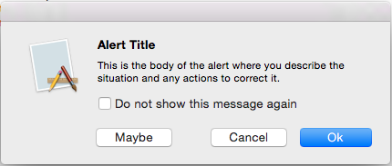
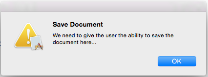
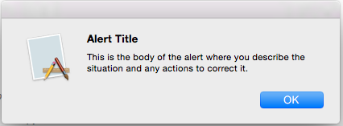
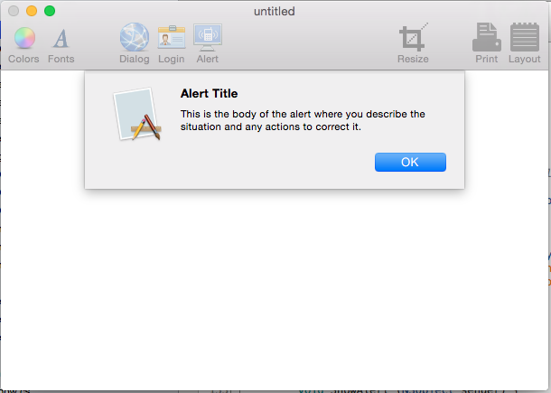
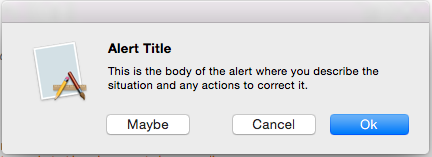
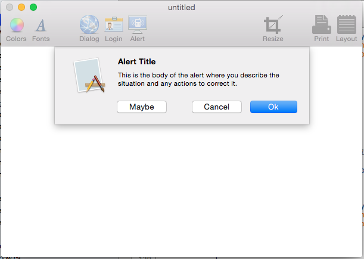
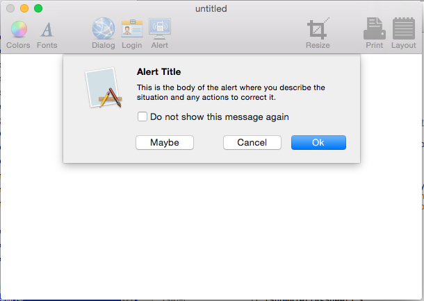
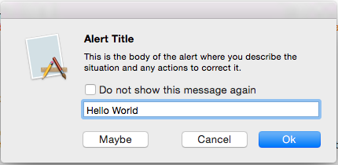
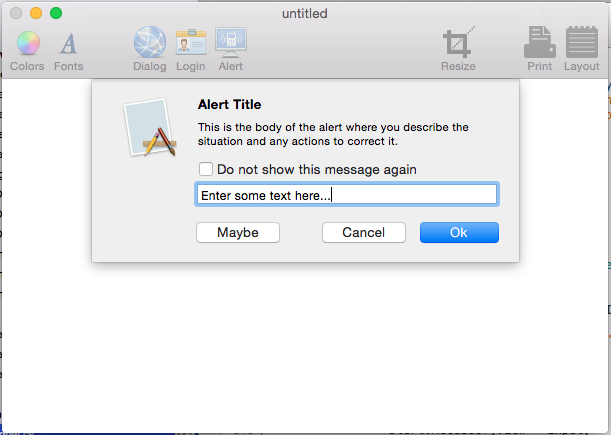

# Alerts in Xamarin.Mac

_This article covers working with alerts in a Xamarin.Mac application. It describes creating and displaying alerts from C# code and responding to user interactions._

When working with C# and .NET in a Xamarin.Mac application, you have access to the same Alerts that a developer working in *Objective-C* and *Xcode* does. 

An alert is a special type of dialog that appears when a serious problem occurs (such as an error) or as a warning (such as preparing to delete a file). Because an alert is a dialog, it also requires a user response before it can be closed.

[](alert-images/alert06.png#lightbox)

In this article, we'll cover the basics of working with Alerts in a Xamarin.Mac application. 

<a name="Introduction_to_Alerts"></a>

## Introduction to Alerts

An alert is a special type of dialog that appears when a serious problem occurs (such as an error) or as a warning (such as preparing to delete a file). Because Alerts disrupt the user since they must be dismissed before the user can continue on with their task, avoid displaying an alert unless it’s absolutely necessary.

Apple suggest the following guidelines:

- Don't use an alert merely to give users information.
- Do not display an alert for common, undoable actions. Even if that situation might cause data loss.
- If a situation is worthy of an alert, avoid using any other UI element or method to display it.
- The Caution icon should be used sparingly.
- Describe the alert situation clearly and succinctly in the alert message.
- The Default Button name should correspond to the action you describe in your alert message.

For more information, see the [Alerts](https://developer.apple.com/library/mac/documentation/UserExperience/Conceptual/OSXHIGuidelines/WindowAlerts.html#//apple_ref/doc/uid/20000957-CH44-SW1) section of Apple's [OS X Human Interface Guidelines](https://developer.apple.com/library/mac/documentation/UserExperience/Conceptual/OSXHIGuidelines/)

<a name="Anatomy_of_an_Alert"></a>

## Anatomy of an Alert

As stated above, alerts should be shown to your application's user when a serious problem occurs or as a warning to potential data loss (such as closing an unsaved file). In Xamarin.Mac, an alert is created in C# code, for example:

```csharp
var alert = new NSAlert () {
  AlertStyle = NSAlertStyle.Critical,
  InformativeText = "We need to save the document here...",
  MessageText = "Save Document",
};
alert.RunModal ();
```

The code above displays an alert with the applications icon superimposed on the warning icon, a title, a warning message and a single **OK** button:

[](alert-images/alert01.png#lightbox)

Apple provides several properties that can be used to customize an alert:

- **AlertStyle** defines the type of an alert as one of the following:
  - **Warning** - Used to warn the user a current or impending event that is not critical. This is the default style.
  - **Informational** - Used to warn the user about a current or impending event. Currently, there is no visible difference between a **Warning** and a **Informational**
  - **Critical** - Used to warn the user about severe consequences of an impending event (such as deleting a file). This type of alert should be used sparingly.
- **MessageText** - This is the main message or title of the alert and should quickly define the situation to the user.
- **InformativeText** - This is the body of the alert where you should define the situation clearly and present workable options to the user.
- **Icon** - Allows a custom icon to be displayed to the user.
- **HelpAnchor** & **ShowsHelp** - Allows the alert to be tied into the application HelpBook and display help for the alert.
- **Buttons** - By default, an alert only has the **OK** button but the **Buttons** collection allows you to add more choices as needed.
- **ShowsSuppressionButton** - If `true` displays a checkbox that the user can use to suppress the alert for subsequent occurrences of the event that triggered it.
- **AccessoryView** - Allows you to attach another subview to the alert to provide extra information, such as adding a **Text Field** for data entry. If you set a new **AccessoryView** or modify an existing one, you need to call the `Layout()` method to adjust the visible layout of the alert.

<a name="Displaying_an_Alert"></a>

## Displaying an Alert

There are two different ways that an alert can be displayed, Free-Floating or as a Sheet. The following code displays an alert as free-floating:

```csharp
var alert = new NSAlert () {
  AlertStyle = NSAlertStyle.Informational,
  InformativeText = "This is the body of the alert where you describe the situation and any actions to correct it.",
  MessageText = "Alert Title",
};
alert.RunModal ();
```

If this code is run, the following is displayed:

[](alert-images/alert02.png#lightbox)

The following code displays the same alert as a Sheet:

```csharp
var alert = new NSAlert () {
  AlertStyle = NSAlertStyle.Informational,
  InformativeText = "This is the body of the alert where you describe the situation and any actions to correct it.",
  MessageText = "Alert Title",
};
alert.BeginSheet (this);
```

If this code is run, the following will be displayed:

[](alert-images/alert03.png#lightbox)

<a name="Working_with_Alert_Buttons"></a>

## Working with Alert Buttons

By default, an Alert displays only the **OK** button. However, you are not limited to that, you can create extra buttons by appending them to the **Buttons** collection. The following code creates a free-floating alert with a **OK**, **Cancel** and **Maybe** button:

```csharp
var alert = new NSAlert () {
  AlertStyle = NSAlertStyle.Informational,
  InformativeText = "This is the body of the alert where you describe the situation and any actions to correct it.",
  MessageText = "Alert Title",
};
alert.AddButton ("Ok");
alert.AddButton ("Cancel");
alert.AddButton ("Maybe");
var result = alert.RunModal ();
```

The very first button added will be the _Default Button_ that will be activated if the user presses the Enter key. The returned value will be an integer representing which button the user pressed. In our case the following values will be returned:

- **OK** - 1000.
- **Cancel** - 1001.
- **Maybe** - 1002.

If we run the code , the following will be displayed:

[](alert-images/alert04.png#lightbox)

Here is the code for the same alert as a Sheet:

```csharp
var alert = new NSAlert () {
  AlertStyle = NSAlertStyle.Informational,
  InformativeText = "This is the body of the alert where you describe the situation and any actions to correct it.",
  MessageText = "Alert Title",
};
alert.AddButton ("Ok");
alert.AddButton ("Cancel");
alert.AddButton ("Maybe");
alert.BeginSheetForResponse (this, (result) => {
  Console.WriteLine ("Alert Result: {0}", result);
});
```

If this code is run, the following will be displayed:

[](alert-images/alert05.png#lightbox)

> [!IMPORTANT]
> You should never add more than three buttons to an alert.

<a name="Showing_the_Suppress_Button"></a>

## Showing the Suppress Button

If the Alert's `ShowSuppressButton` property is `true`, the alert displays a checkbox that the user can use to suppress the alert for subsequent occurrences of the event that triggered it. The following code displays a free-floating alert with a suppress button:

```csharp
var alert = new NSAlert () {
  AlertStyle = NSAlertStyle.Informational,
  InformativeText = "This is the body of the alert where you describe the situation and any actions to correct it.",
  MessageText = "Alert Title",
};
alert.AddButton ("Ok");
alert.AddButton ("Cancel");
alert.AddButton ("Maybe");
alert.ShowsSuppressionButton = true;
var result = alert.RunModal ();
Console.WriteLine ("Alert Result: {0}, Suppress: {1}", result, alert.SuppressionButton.State == NSCellStateValue.On);
```

If the value of the `alert.SuppressionButton.State` is `NSCellStateValue.On`, the user has checked the Suppress checkbox, else they have not.

If the code is run, the following will be displayed:

[](alert-images/alert06.png#lightbox)

Here is the code for the same alert as a Sheet:

```csharp
var alert = new NSAlert () {
  AlertStyle = NSAlertStyle.Informational,
  InformativeText = "This is the body of the alert where you describe the situation and any actions to correct it.",
  MessageText = "Alert Title",
};
alert.AddButton ("Ok");
alert.AddButton ("Cancel");
alert.AddButton ("Maybe");
alert.ShowsSuppressionButton = true;
alert.BeginSheetForResponse (this, (result) => {
  Console.WriteLine ("Alert Result: {0}, Suppress: {1}", result, alert.SuppressionButton.State == NSCellStateValue.On);
});
```

If this code is run, the following will be displayed:

[](alert-images/alert07.png#lightbox)

<a name="Adding_a_Custom_SubView"></a>

## Adding a Custom SubView

Alerts have an `AccessoryView` property that can be used to customize the alert further and add things like a **Text Field** for user input. The following code creates a free-floating alert with an added text input field:

```csharp
var input = new NSTextField (new CGRect (0, 0, 300, 20));

var alert = new NSAlert () {
AlertStyle = NSAlertStyle.Informational,
InformativeText = "This is the body of the alert where you describe the situation and any actions to correct it.",
  MessageText = "Alert Title",
};
alert.AddButton ("Ok");
alert.AddButton ("Cancel");
alert.AddButton ("Maybe");
alert.ShowsSuppressionButton = true;
alert.AccessoryView = input;
alert.Layout ();
var result = alert.RunModal ();
Console.WriteLine ("Alert Result: {0}, Suppress: {1}", result, alert.SuppressionButton.State == NSCellStateValue.On);
```

The key lines here are `var input = new NSTextField (new CGRect (0, 0, 300, 20));` which creates a new **Text Field** that we will be adding the alert. `alert.AccessoryView = input;` which attaches the **Text Field** to the alert and the call to the `Layout()` method, which is required to resize the alert to fit in the new subview.

If we run the code, the following will be displayed:

[](alert-images/alert08.png#lightbox)

Here is the same alert as a sheet:

```csharp
var input = new NSTextField (new CGRect (0, 0, 300, 20));

var alert = new NSAlert () {
  AlertStyle = NSAlertStyle.Informational,
  InformativeText = "This is the body of the alert where you describe the situation and any actions to correct it.",
  MessageText = "Alert Title",
};
alert.AddButton ("Ok");
alert.AddButton ("Cancel");
alert.AddButton ("Maybe");
alert.ShowsSuppressionButton = true;
alert.AccessoryView = input;
alert.Layout ();
alert.BeginSheetForResponse (this, (result) => {
  Console.WriteLine ("Alert Result: {0}, Suppress: {1}", result, alert.SuppressionButton.State == NSCellStateValue.On);
});
```

If we run this code, the following will be displayed:

[](alert-images/alert09.png#lightbox)

<a name="Summary"></a>

## Summary

This article has taken a detailed look at working with Alerts in a Xamarin.Mac application. We saw the different types and uses of Alerts, how to create and customize Alerts and how to work with Alerts in C# code.

## Related Links

- [MacWindows (sample)](/samples/xamarin/mac-samples/macwindows)
- [Hello, Mac](~/mac/get-started/hello-mac.md)
- [Working with Windows](~/mac/user-interface/window.md)
- [OS X Human Interface Guidelines](https://developer.apple.com/library/mac/documentation/UserExperience/Conceptual/OSXHIGuidelines/)
- [Introduction to Windows](https://developer.apple.com/library/mac/documentation/Cocoa/Conceptual/WinPanel/Introduction.html#//apple_ref/doc/uid/10000031-SW1)
- [NSAlert](https://developer.apple.com/library/mac/documentation/Cocoa/Reference/ApplicationKit/Classes/NSAlert_Class/index.html#//apple_ref/doc/uid/TP40004001)