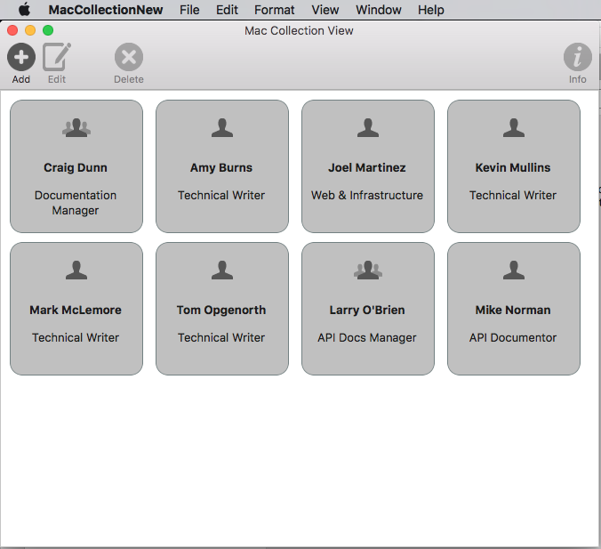
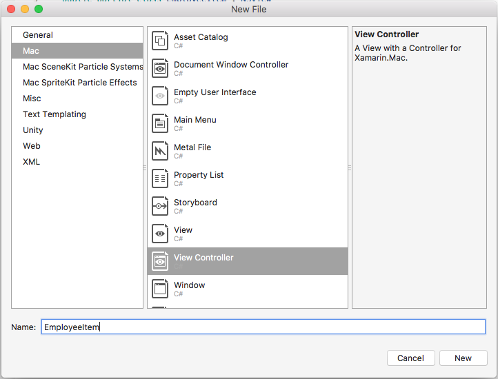
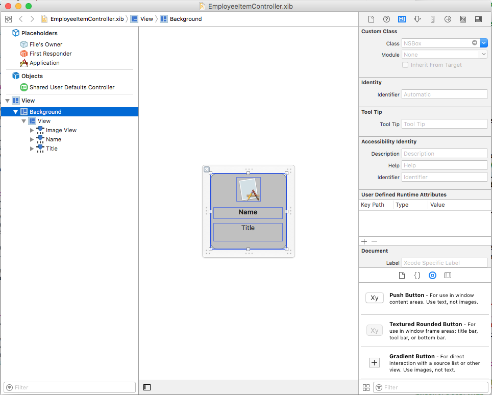
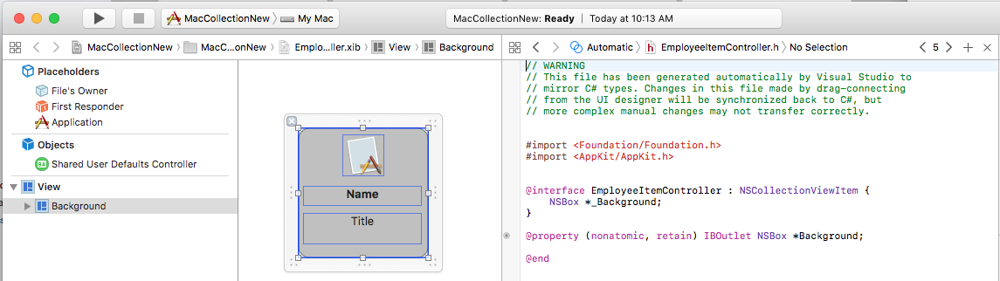
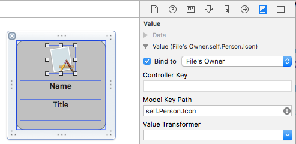
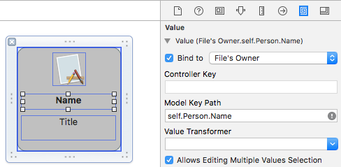
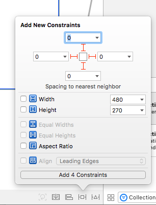
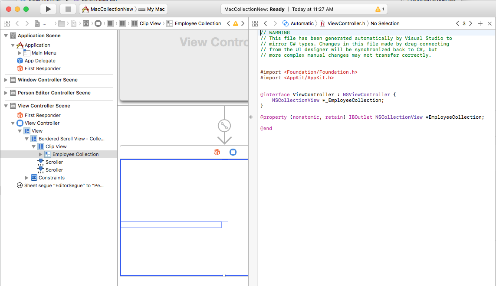

# Collection Views in Xamarin.Mac

_This article describes working with collection views in a Xamarin.Mac app. It covers creating and maintaining collection views in Xcode and Interface Builder and working with them programmatically._

When working with C# and .NET in a Xamarin.Mac app, the developer has access to the same AppKit Collection View controls that a developer working in *Objective-C* and *Xcode* does. Because Xamarin.Mac integrates directly with Xcode, the developer uses Xcode's _Interface Builder_ to create and maintain Collection Views.

A `NSCollectionView` displays a grid of subviews organized using a `NSCollectionViewLayout`. Each subview in the grid is represented by a `NSCollectionViewItem` which manages the loading of the view’s content from a `.xib` file.

[](collection-view-images/intro01.png#lightbox)

This article covers the basics of working with Collection Views in a Xamarin.Mac app. It is highly suggested that you work through the [Hello, Mac](~/mac/get-started/hello-mac.md) article first, specifically the [Introduction to Xcode and Interface Builder](~/mac/get-started/hello-mac.md#introduction-to-xcode-and-interface-builder) and [Outlets and Actions](~/mac/get-started/hello-mac.md#outlets-and-actions) sections, as it covers key concepts and techniques that are used throughout this article.

You may want to take a look at the [Exposing C# classes / methods to Objective-C](~/mac/internals/how-it-works.md) section of the [Xamarin.Mac Internals](~/mac/internals/how-it-works.md) document as well, it explains the `Register` and `Export` commands used to wire-up your C# classes to Objective-C objects and UI Elements.

<a name="About_Collection_Views"></a>

## About Collection Views

The main goal of a Collection View (`NSCollectionView`) is to visually arrange a group of objects in an organized fashion using a Collection View Layout (`NSCollectionViewLayout`), with each individual object (`NSCollectionViewItem`) getting its own View in the larger collection. Collection Views work via Data Binding and Key-Value Coding techniques and as such, you should read the [Data Binding and Key-Value Coding](~/mac/app-fundamentals/databinding.md) documentation before continuing with this article.

The Collection View has no standard, built-in Collection View Item (like an Outline or Table View does), so the developer is responsible for designing and implementing a _Prototype View_ using other AppKit controls such as Image Fields, Text Fields, Labels, etc. This Prototype View will be used to display and work with each item being managed by the Collection View and is stored in a `.xib` file.

Because the developer is responsible for the look and feel of a Collection View Item, the Collection View has no built-in support for highlighting a selected item in the grid. Implementing this feature will be covered in this article.

<a name="Defining_your_Data_Model"></a>

## Defining the Data Model

Before Data Binding a Collection View in Interface Builder, a Key-Value Coding (KVC)/Key-Value Observing (KVO) compliant class must be defined in the Xamarin.Mac app to act as the _Data Model_ for the binding. The Data Model provides all of the data that will be displayed in the collection and receives any modifications to the data that the user makes in the UI while running the application.

Take the example of an app that manages a group of employees,  the following class could be used to define the Data Model:

```csharp
using System;
using Foundation;
using AppKit;

namespace MacDatabinding
{
    [Register("PersonModel")]
    public class PersonModel : NSObject
    {
        #region Private Variables
        private string _name = "";
        private string _occupation = "";
        private bool _isManager = false;
        private NSMutableArray _people = new NSMutableArray();
        #endregion

        #region Computed Properties
        [Export("Name")]
        public string Name {
            get { return _name; }
            set {
                WillChangeValue ("Name");
                _name = value;
                DidChangeValue ("Name");
            }
        }

        [Export("Occupation")]
        public string Occupation {
            get { return _occupation; }
            set {
                WillChangeValue ("Occupation");
                _occupation = value;
                DidChangeValue ("Occupation");
            }
        }

        [Export("isManager")]
        public bool isManager {
            get { return _isManager; }
            set {
                WillChangeValue ("isManager");
                WillChangeValue ("Icon");
                _isManager = value;
                DidChangeValue ("isManager");
                DidChangeValue ("Icon");
            }
        }

        [Export("isEmployee")]
        public bool isEmployee {
            get { return (NumberOfEmployees == 0); }
        }

        [Export("Icon")]
        public NSImage Icon
        {
            get
            {
                if (isManager)
                {
                    return NSImage.ImageNamed("IconGroup");
                }
                else
                {
                    return NSImage.ImageNamed("IconUser");
                }
            }
        }

        [Export("personModelArray")]
        public NSArray People {
            get { return _people; }
        }

        [Export("NumberOfEmployees")]
        public nint NumberOfEmployees {
            get { return (nint)_people.Count; }
        }
        #endregion

        #region Constructors
        public PersonModel ()
        {
        }

        public PersonModel (string name, string occupation)
        {
            // Initialize
            this.Name = name;
            this.Occupation = occupation;
        }

        public PersonModel (string name, string occupation, bool manager)
        {
            // Initialize
            this.Name = name;
            this.Occupation = occupation;
            this.isManager = manager;
        }
        #endregion

        #region Array Controller Methods
        [Export("addObject:")]
        public void AddPerson(PersonModel person) {
            WillChangeValue ("personModelArray");
            isManager = true;
            _people.Add (person);
            DidChangeValue ("personModelArray");
        }

        [Export("insertObject:inPersonModelArrayAtIndex:")]
        public void InsertPerson(PersonModel person, nint index) {
            WillChangeValue ("personModelArray");
            _people.Insert (person, index);
            DidChangeValue ("personModelArray");
        }

        [Export("removeObjectFromPersonModelArrayAtIndex:")]
        public void RemovePerson(nint index) {
            WillChangeValue ("personModelArray");
            _people.RemoveObject (index);
            DidChangeValue ("personModelArray");
        }

        [Export("setPersonModelArray:")]
        public void SetPeople(NSMutableArray array) {
            WillChangeValue ("personModelArray");
            _people = array;
            DidChangeValue ("personModelArray");
        }
        #endregion
    }
}
```

The `PersonModel` Data Model will be used throughout the rest of this article.

<a name="Working_with_a_Collection_View"></a>

## Working with a Collection View

Data Binding with a Collection View is very much like binding with a Table View, as `NSCollectionViewDataSource` is used to provide data for the collection. Since the collection view doesn't have a preset display format, more work is required to provide user interaction feedback and to track user selection.

<a name="Creating-the-Cell-Prototype"></a>

### Creating the Cell Prototype

Since the Collection View does not include a default cell prototype, the developer will need to add one or more `.xib` files to the Xamarin.Mac app to define the layout and content of the individual cells.

Do the following:

1. In the **Solution Explorer**, right-click on the project name and select **Add** > **New File...**
2. Select **Mac** > **View Controller**, give it a name (such as `EmployeeItem` in this example) and click the **New** button to create: 

    

    This will add an `EmployeeItem.cs`, `EmployeeItemController.cs` and `EmployeeItemController.xib` file to the project's solution.
3. Double-click the `EmployeeItemController.xib` file to open it for editing in Xcode's Interface Builder.
4. Add an `NSBox`, `NSImageView` and two `NSLabel` controls to the View and lay them out as follows:

    
5. Open the **Assistant Editor** and create an **Outlet** for the `NSBox` so that it can be used to indicate the selection state of a cell:

    
6. Return to the **Standard Editor** and select the Image View.
7. In the **Binding Inspector**, select **Bind To** > **File's Owner** and enter a **Model Key Path** of `self.Person.Icon`:

    
8. Select the first Label and in the **Binding Inspector**, select **Bind To** > **File's Owner** and enter a **Model Key Path** of `self.Person.Name`:

    
9. Select the second Label and in the **Binding Inspector**, select **Bind To** > **File's Owner** and enter a **Model Key Path** of `self.Person.Occupation`:

    
10. Save the changes to the `.xib` file and return to Visual Studio to sync the changes.

Edit the `EmployeeItemController.cs` file and make it look like the following:

```csharp
using System;
using System.Collections.Generic;
using System.Linq;
using Foundation;
using AppKit;

namespace MacCollectionNew
{
    /// <summary>
    /// The Employee item controller handles the display of the individual items that will
    /// be displayed in the collection view as defined in the associated .XIB file.
    /// </summary>
    public partial class EmployeeItemController : NSCollectionViewItem
    {
        #region Private Variables
        /// <summary>
        /// The person that will be displayed.
        /// </summary>
        private PersonModel _person;
        #endregion

        #region Computed Properties
        // strongly typed view accessor
        public new EmployeeItem View
        {
            get
            {
                return (EmployeeItem)base.View;
            }
        }

        /// <summary>
        /// Gets or sets the person.
        /// </summary>
        /// <value>The person that this item belongs to.</value>
        [Export("Person")]
        public PersonModel Person
        {
            get { return _person; }
            set
            {
                WillChangeValue("Person");
                _person = value;
                DidChangeValue("Person");
            }
        }

        /// <summary>
        /// Gets or sets the color of the background for the item.
        /// </summary>
        /// <value>The color of the background.</value>
        public NSColor BackgroundColor {
            get { return Background.FillColor; }
            set { Background.FillColor = value; }
        }

        /// <summary>
        /// Gets or sets a value indicating whether this <see cref="T:MacCollectionNew.EmployeeItemController"/> is selected.
        /// </summary>
        /// <value><c>true</c> if selected; otherwise, <c>false</c>.</value>
        /// <remarks>This also changes the background color based on the selected state
        /// of the item.</remarks>
        public override bool Selected
        {
            get
            {
                return base.Selected;
            }
            set
            {
                base.Selected = value;

                // Set background color based on the selection state
                if (value) {
                    BackgroundColor = NSColor.DarkGray;
                } else {
                    BackgroundColor = NSColor.LightGray;
                }
            }
        }
        #endregion

        #region Constructors
        // Called when created from unmanaged code
        public EmployeeItemController(IntPtr handle) : base(handle)
        {
            Initialize();
        }

        // Called when created directly from a XIB file
        [Export("initWithCoder:")]
        public EmployeeItemController(NSCoder coder) : base(coder)
        {
            Initialize();
        }

        // Call to load from the XIB/NIB file
        public EmployeeItemController() : base("EmployeeItem", NSBundle.MainBundle)
        {
            Initialize();
        }

        // Added to support loading from XIB/NIB
        public EmployeeItemController(string nibName, NSBundle nibBundle) : base(nibName, nibBundle) {

            Initialize();
        }

        // Shared initialization code
        void Initialize()
        {
        }
        #endregion
    }
}
```

Looking at this code in detail, the class inherits from `NSCollectionViewItem` so it can act as a prototype for a Collection View cell. The `Person` property exposes the class that was used to data bind to the Image View and Labels in Xcode. This is an instance of the `PersonModel` created above.

The `BackgroundColor` property is a shortcut to the `NSBox` control's `FillColor` that will be used to show the selection status of a cell. By overriding the `Selected` property of the `NSCollectionViewItem`, the following code sets or clears this selection state:

```csharp
public override bool Selected
{
    get
    {
        return base.Selected;
    }
    set
    {
        base.Selected = value;

        // Set background color based on the selection state
        if (value) {
            BackgroundColor = NSColor.DarkGray;
        } else {
            BackgroundColor = NSColor.LightGray;
        }
    }
}
```

<a name="Creating-the-Collection-View-Data-Source"></a>

### Creating the Collection View Data Source

A Collection View Data Source (`NSCollectionViewDataSource`) provides all of the data for a Collection View and creates and populates a Collection View Cell (using the `.xib` prototype) as required for each item in the collection.

Add a new class the project, call it `CollectionViewDataSource` and make it look like the following:

```csharp
using System;
using System.Collections.Generic;
using AppKit;
using Foundation;

namespace MacCollectionNew
{
    /// <summary>
    /// Collection view data source provides the data for the collection view.
    /// </summary>
    public class CollectionViewDataSource : NSCollectionViewDataSource
    {
        #region Computed Properties
        /// <summary>
        /// Gets or sets the parent collection view.
        /// </summary>
        /// <value>The parent collection view.</value>
        public NSCollectionView ParentCollectionView { get; set; }

        /// <summary>
        /// Gets or sets the data that will be displayed in the collection.
        /// </summary>
        /// <value>A collection of PersonModel objects.</value>
        public List<PersonModel> Data { get; set; } = new List<PersonModel>();
        #endregion

        #region Constructors
        /// <summary>
        /// Initializes a new instance of the <see cref="T:MacCollectionNew.CollectionViewDataSource"/> class.
        /// </summary>
        /// <param name="parent">The parent collection that this datasource will provide data for.</param>
        public CollectionViewDataSource(NSCollectionView parent)
        {
            // Initialize
            ParentCollectionView = parent;

            // Attach to collection view
            parent.DataSource = this;

        }
        #endregion

        #region Override Methods
        /// <summary>
        /// Gets the number of sections.
        /// </summary>
        /// <returns>The number of sections.</returns>
        /// <param name="collectionView">The parent Collection view.</param>
        public override nint GetNumberOfSections(NSCollectionView collectionView)
        {
            // There is only one section in this view
            return 1;
        }

        /// <summary>
        /// Gets the number of items in the given section.
        /// </summary>
        /// <returns>The number of items.</returns>
        /// <param name="collectionView">The parent Collection view.</param>
        /// <param name="section">The Section number to count items for.</param>
        public override nint GetNumberofItems(NSCollectionView collectionView, nint section)
        {
            // Return the number of items
            return Data.Count;
        }

        /// <summary>
        /// Gets the item for the give section and item index.
        /// </summary>
        /// <returns>The item.</returns>
        /// <param name="collectionView">The parent Collection view.</param>
        /// <param name="indexPath">Index path specifying the section and index.</param>
        public override NSCollectionViewItem GetItem(NSCollectionView collectionView, NSIndexPath indexPath)
        {
            var item = collectionView.MakeItem("EmployeeCell", indexPath) as EmployeeItemController;
            item.Person = Data[(int)indexPath.Item];

            return item;
        }
        #endregion
    }
}
```

Looking at this code in detail, the class inherits from `NSCollectionViewDataSource` and exposes a List of `PersonModel` instances through its `Data` property.

Since this collection only has one section, the code overrides the `GetNumberOfSections` method and always returns `1`. Additionally, the `GetNumberofItems` method is overridden at it returns the number of items in the `Data` property list.

The `GetItem` method is called whenever a new cell is required and looks like the following:

```csharp
public override NSCollectionViewItem GetItem(NSCollectionView collectionView, NSIndexPath indexPath)
{
    var item = collectionView.MakeItem("EmployeeCell", indexPath) as EmployeeItemController;
    item.Person = Data[(int)indexPath.Item];

    return item;
}
```

The `MakeItem` method of the Collection View is called to create or return a reusable instance of the `EmployeeItemController` and its `Person` property is set to item being displayed in the requested cell. 

The `EmployeeItemController` must be registered with the Collection View Controller beforehand using the following code:

```csharp
EmployeeCollection.RegisterClassForItem(typeof(EmployeeItemController), "EmployeeCell");
``` 

The **Identifier** (`EmployeeCell`) used in the `MakeItem` call _must_ match the name of the View Controller that was registered with the Collection View. This step will be covered in detail below.

<a name="Handling-Item-Selection"></a>

### Handling Item Selection

To handle the selection and deselection of items in the collection, a `NSCollectionViewDelegate` will be required. Since this example will be using the built in `NSCollectionViewFlowLayout` layout type, a `NSCollectionViewDelegateFlowLayout` specific version of this delegate will be required.

Add a new class to the project, call it `CollectionViewDelegate` and make it look like the following:

```csharp
using System;
using Foundation;
using AppKit;

namespace MacCollectionNew
{
    /// <summary>
    /// Collection view delegate handles user interaction with the elements of the 
    /// collection view for the Flow-Based layout type.
    /// </summary>
    public class CollectionViewDelegate : NSCollectionViewDelegateFlowLayout
    {
        #region Computed Properties
        /// <summary>
        /// Gets or sets the parent view controller.
        /// </summary>
        /// <value>The parent view controller.</value>
        public ViewController ParentViewController { get; set; }
        #endregion

        #region Constructors
        /// <summary>
        /// Initializes a new instance of the <see cref="T:MacCollectionNew.CollectionViewDelegate"/> class.
        /// </summary>
        /// <param name="parentViewController">Parent view controller.</param>
        public CollectionViewDelegate(ViewController parentViewController)
        {
            // Initialize
            ParentViewController = parentViewController;
        }
        #endregion

        #region Override Methods
        /// <summary>
        /// Handles one or more items being selected.
        /// </summary>
        /// <param name="collectionView">The parent Collection view.</param>
        /// <param name="indexPaths">The Index paths of the items being selected.</param>
        public override void ItemsSelected(NSCollectionView collectionView, NSSet indexPaths)
        {
            // Dereference path
            var paths = indexPaths.ToArray<NSIndexPath>();
            var index = (int)paths[0].Item;

            // Save the selected item
            ParentViewController.PersonSelected = ParentViewController.Datasource.Data[index];

        }

        /// <summary>
        /// Handles one or more items being deselected.
        /// </summary>
        /// <param name="collectionView">The parent Collection view.</param>
        /// <param name="indexPaths">The Index paths of the items being deselected.</param>
        public override void ItemsDeselected(NSCollectionView collectionView, NSSet indexPaths)
        {
            // Dereference path
            var paths = indexPaths.ToArray<NSIndexPath>();
            var index = paths[0].Item;

            // Clear selection
            ParentViewController.PersonSelected = null;
        }
        #endregion
    }
}
``` 

The `ItemsSelected` and `ItemsDeselected` methods are overridden and used to set or clear the `PersonSelected` property of the View Controller that is handling the Collection View when the user selects or deselects an item. This will be shown in detail below.

<a name="Creating-the-Collection-View-in-Interface-Builder"></a>

### Creating the Collection View in Interface Builder

With all of the required supporting pieces in place, the main storyboard can be edited and a Collection View added to it.

Do the following:

1. Double-click the `Main.Storyboard` file in the **Solution Explorer** to open it for editing in Xcode's Interface Builder.
2. Drag a Collection View into the Main View and resize it to fill the View:

    
3. With the Collection View selected, use the Constraint Editor to pin it to the View when it is resized:

    
4. Ensure that the Collection View is selected in the **Design Surface** (and not the **Bordered Scroll View** or **Clip View** that contains it), switch to the **Assistant Editor** and create an **Outlet** for the collection view:

    
5. Save the changes and return to Visual Studio to sync.

<a name="Bringing-it-all-Together"></a>

## Bringing it all Together

All of the supporting pieces have now been put into place with a class to act as the data model (`PersonModel`), a `NSCollectionViewDataSource` has been added to supply data, a `NSCollectionViewDelegateFlowLayout` was created to handle item selection and a `NSCollectionView` was added to the Main Storyboard and exposed as an Outlet (`EmployeeCollection`).

The final step is to edit the View Controller that contains the Collection View and bring all of the pieces together to populate the collection and handle item selection.

Edit the `ViewController.cs` file and make it look like the following:

```csharp
using System;
using AppKit;
using Foundation;
using CoreGraphics;

namespace MacCollectionNew
{
    /// <summary>
    /// The View controller controls the main view that houses the Collection View.
    /// </summary>
    public partial class ViewController : NSViewController
    {
        #region Private Variables
        private PersonModel _personSelected;
        private bool shouldEdit = true;
        #endregion

        #region Computed Properties
        /// <summary>
        /// Gets or sets the datasource that provides the data to display in the 
        /// Collection View.
        /// </summary>
        /// <value>The datasource.</value>
        public CollectionViewDataSource Datasource { get; set; }

        /// <summary>
        /// Gets or sets the person currently selected in the collection view.
        /// </summary>
        /// <value>The person selected or <c>null</c> if no person is selected.</value>
        [Export("PersonSelected")]
        public PersonModel PersonSelected
        {
            get { return _personSelected; }
            set
            {
                WillChangeValue("PersonSelected");
                _personSelected = value;
                DidChangeValue("PersonSelected");
                RaiseSelectionChanged();
            }
        }
        #endregion

        #region Constructors
        /// <summary>
        /// Initializes a new instance of the <see cref="T:MacCollectionNew.ViewController"/> class.
        /// </summary>
        /// <param name="handle">Handle.</param>
        public ViewController(IntPtr handle) : base(handle)
        {
        }
        #endregion

        #region Override Methods
        /// <summary>
        /// Called after the view has finished loading from the Storyboard to allow it to
        /// be configured before displaying to the user.
        /// </summary>
        public override void ViewDidLoad()
        {
            base.ViewDidLoad();

            // Initialize Collection View
            ConfigureCollectionView();
            PopulateWithData();
        }
        #endregion

        #region Private Methods
        /// <summary>
        /// Configures the collection view.
        /// </summary>
        private void ConfigureCollectionView()
        {
            EmployeeCollection.RegisterClassForItem(typeof(EmployeeItemController), "EmployeeCell");

            // Create a flow layout
            var flowLayout = new NSCollectionViewFlowLayout()
            {
                ItemSize = new CGSize(150, 150),
                SectionInset = new NSEdgeInsets(10, 10, 10, 20),
                MinimumInteritemSpacing = 10,
                MinimumLineSpacing = 10
            };
            EmployeeCollection.WantsLayer = true;

            // Setup collection view
            EmployeeCollection.CollectionViewLayout = flowLayout;
            EmployeeCollection.Delegate = new CollectionViewDelegate(this);

        }

        /// <summary>
        /// Populates the Datasource with data and attaches it to the collection view.
        /// </summary>
        private void PopulateWithData()
        {
            // Make datasource
            Datasource = new CollectionViewDataSource(EmployeeCollection);

            // Build list of employees
            Datasource.Data.Add(new PersonModel("Craig Dunn", "Documentation Manager", true));
            Datasource.Data.Add(new PersonModel("Amy Burns", "Technical Writer"));
            Datasource.Data.Add(new PersonModel("Joel Martinez", "Web & Infrastructure"));
            Datasource.Data.Add(new PersonModel("Kevin Mullins", "Technical Writer"));
            Datasource.Data.Add(new PersonModel("Mark McLemore", "Technical Writer"));
            Datasource.Data.Add(new PersonModel("Tom Opgenorth", "Technical Writer"));
            Datasource.Data.Add(new PersonModel("Larry O'Brien", "API Docs Manager", true));
            Datasource.Data.Add(new PersonModel("Mike Norman", "API Documentor"));

            // Populate collection view
            EmployeeCollection.ReloadData();
        }
        #endregion

        #region Events
        /// <summary>
        /// Selection changed delegate.
        /// </summary>
        public delegate void SelectionChangedDelegate();

        /// <summary>
        /// Occurs when selection changed.
        /// </summary>
        public event SelectionChangedDelegate SelectionChanged;

        /// <summary>
        /// Raises the selection changed event.
        /// </summary>
        internal void RaiseSelectionChanged() {
            // Inform caller
            if (this.SelectionChanged != null) SelectionChanged();
        }
        #endregion
    }
}
```

Taking a look at this code in detail, a `Datasource` property is defined to hold an instance of the `CollectionViewDataSource` that will provide the data for the Collection View. A `PersonSelected` property is defined to hold the `PersonModel` representing the currently selected item in the Collection View. This property also raises the `SelectionChanged` event when the selection changes.

The `ConfigureCollectionView` class is used to register the View Controller that acts as the cell prototype with the Collection View using the following line:

```csharp
EmployeeCollection.RegisterClassForItem(typeof(EmployeeItemController), "EmployeeCell");
```

Notice that the **Identifier** (`EmployeeCell`) used to register the prototype matches the one called in the `GetItem` method of the `CollectionViewDataSource` defined above:

```csharp
var item = collectionView.MakeItem("EmployeeCell", indexPath) as EmployeeItemController;
...
```

Additionally, the type of the View Controller **must** match the name of the `.xib` file that defines the prototype **exactly**. In the case of this example, `EmployeeItemController` and `EmployeeItemController.xib`.

The actual layout of the items in the Collection View is controlled by a Collection View Layout class and can be changed dynamically at runtime by assigning a new instance to the `CollectionViewLayout` property. Changing this property updates the Collection View appearance without animating the change.

Apple ships two built-in layout types with the Collection View that will handle most typical uses: `NSCollectionViewFlowLayout` and `NSCollectionViewGridLayout`. If the developer required a custom format, such as laying the items out in a circle, they can create a custom instance of `NSCollectionViewLayout` and override the required methods to achieve the desired effect.

This example uses the default flow layout so it creates an instance of the `NSCollectionViewFlowLayout` class and configures it as follows:

```csharp
var flowLayout = new NSCollectionViewFlowLayout()
{
    ItemSize = new CGSize(150, 150),
    SectionInset = new NSEdgeInsets(10, 10, 10, 20),
    MinimumInteritemSpacing = 10,
    MinimumLineSpacing = 10
};
```

The `ItemSize` property defines the size of each individual cell in the collection. The `SectionInset` property defines the insets from the edge of the collection that cells will be laid out in. `MinimumInteritemSpacing` defines the minimum spacing between items and `MinimumLineSpacing` defines the minimum spacing between lines in the collection.

The layout is assigned to the Collection View and an instance of the `CollectionViewDelegate` is attached to handle item selection:

```csharp
// Setup collection view
EmployeeCollection.CollectionViewLayout = flowLayout;
EmployeeCollection.Delegate = new CollectionViewDelegate(this);
```

The `PopulateWithData` method creates a new instance of the `CollectionViewDataSource`, populates it with data, attaches it to the Collection View and calls the `ReloadData` method to display the items:

```csharp
private void PopulateWithData()
{
    // Make datasource
    Datasource = new CollectionViewDataSource(EmployeeCollection);

    // Build list of employees
    Datasource.Data.Add(new PersonModel("Craig Dunn", "Documentation Manager", true));
    ...

    // Populate collection view
    EmployeeCollection.ReloadData();
}
```

The `ViewDidLoad` method is overridden and calls the `ConfigureCollectionView` and `PopulateWithData` methods to display the final Collection View to the user:

```csharp
public override void ViewDidLoad()
{
    base.ViewDidLoad();

    // Initialize Collection View
    ConfigureCollectionView();
    PopulateWithData();
}
```

<a name="Summary"></a>

## Summary

This article has taken a detailed look at working with Collection Views in a Xamarin.Mac application. First, it looked at exposing a C# class to Objective-C by using Key-Value Coding (KVC) and Key-Value Observing (KVO). Next, it showed how to use a KVO compliant class and Data Bind it to Collection Views in Xcode's Interface Builder. Finally, it showed how to interact with Collection Views in C# code.

## Related Links

- [MacCollectionNew (sample)](/samples/xamarin/mac-samples/maccollectionnew)
- [Hello, Mac](~/mac/get-started/hello-mac.md)
- [Data Binding and Key-Value Coding](~/mac/app-fundamentals/databinding.md)
- [NSCollectionView](https://developer.apple.com/reference/appkit/nscollectionview)
- [OS X Human Interface Guidelines](https://developer.apple.com/library/mac/documentation/UserExperience/Conceptual/OSXHIGuidelines/)