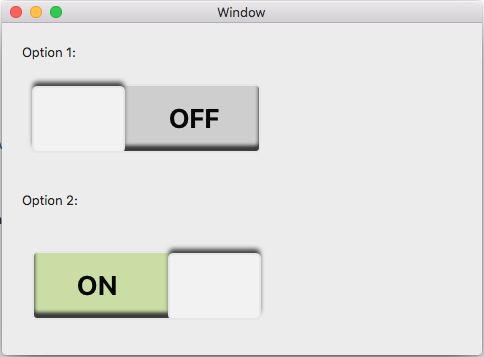
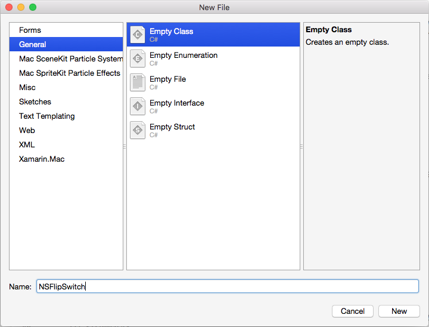
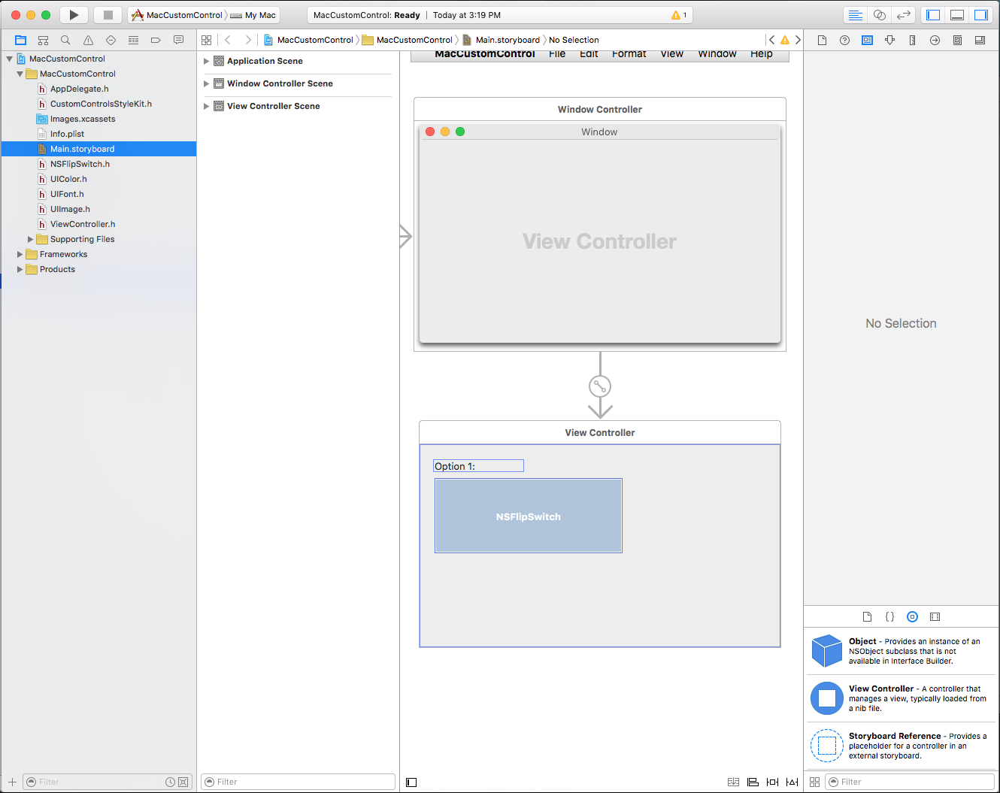
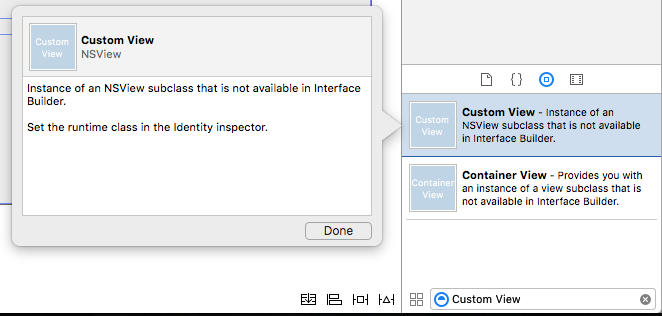
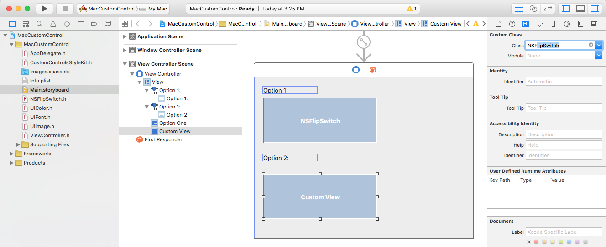
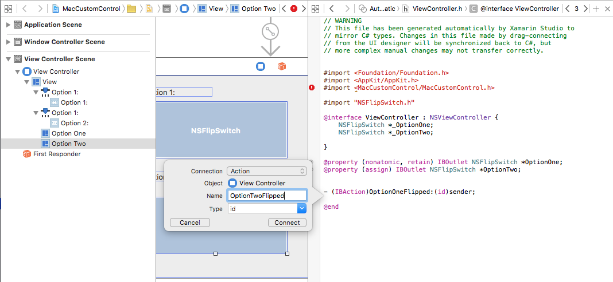

# Creating Custom Controls in Xamarin.Mac

When working with C# and .NET in a Xamarin.Mac application, you have access to the same User Controls that a developer working in *Objective-C*, *Swift* and *Xcode* does. Because Xamarin.Mac integrates directly with Xcode, you can use Xcode's _Interface Builder_ to create and maintain your User Controls (or optionally create them directly in C# code).

While macOS provides a wealth of built-in User Controls, there might be times that you need to create a custom control to provide functionality not provided out-of-the-box or to match a custom UI theme (such as a game interface).

[](custom-controls-images/intro01.png#lightbox)

In this article, we'll cover the basics of creating a reusable Custom User Interface Control in a Xamarin.Mac application. It is highly suggested that you work through the [Hello, Mac](~/mac/get-started/hello-mac.md) article first, specifically the [Introduction to Xcode and Interface Builder](~/mac/get-started/hello-mac.md#introduction-to-xcode-and-interface-builder) and [Outlets and Actions](~/mac/get-started/hello-mac.md#outlets-and-actions) sections, as it covers key concepts and techniques that we'll be using in this article.

You may want to take a look at the [Exposing C# classes / methods to Objective-C](~/mac/internals/how-it-works.md) section of the [Xamarin.Mac Internals](~/mac/internals/how-it-works.md) document as well, it explains the `Register` and `Export` commands used to wire-up your C# classes to Objective-C objects and UI Elements.

<a name="Introduction-to-Outline-Views"></a>

## Introduction to Custom Controls

As stated above, there might be times when you need to create a reusable, Custom User Interface Control to provide unique functionality for your Xamarin.Mac app's UI or to create a custom UI theme (such as a game interface).

In these situations, you can easily inherit from `NSControl` and create a custom tool that can either be added to your app's UI via C# code or through Xcode's Interface Builder. By inheriting from `NSControl` your custom control will automatically have all of the standard features that a built-in User Interface Control has (such as `NSButton`).

If your custom User Interface control just displays information (like a custom charting and graphic tool), you might want to inherit from `NSView` instead of `NSControl`.

No matter which base class is used, the basic steps for creating a custom control is the same.

In this article will, create a custom Flip Switch component that provides a unique User Interface Theme and an example of building a fully functional Custom User Interface Control.

<a name="Building-the-Custom-Control"></a>

## Building the Custom Control

Since the custom control we are creating will be responding to user input (left mouse button clicks), we are going to inherit from `NSControl`. In this way, our custom control will automatically have all of the standard features that a built-in User Interface Control has and respond like a standard macOS control.

In Visual Studio for Mac, open the Xamarin.Mac project that you want to create a Custom User Interface Control for (or create a new one). Add a new class and call it `NSFlipSwitch`:

[](custom-controls-images/custom01.png#lightbox)

Next, edit the `NSFlipSwitch.cs` class and make it look like the following:

```csharp
using Foundation;
using System;
using System.CodeDom.Compiler;
using AppKit;
using CoreGraphics;

namespace MacCustomControl
{
    [Register("NSFlipSwitch")]
    public class NSFlipSwitch : NSControl
    {
        #region Private Variables
        private bool _value = false;
        #endregion

        #region Computed Properties
        public bool Value {
            get { return _value; }
            set {
                // Save value and force a redraw
                _value = value;
                NeedsDisplay = true;
            }
        }
        #endregion

        #region Constructors
        public NSFlipSwitch ()
        {
            // Init
            Initialize();
        }

        public NSFlipSwitch (IntPtr handle) : base (handle)
        {
            // Init
            Initialize();
        }

        [Export ("initWithFrame:")]
        public NSFlipSwitch (CGRect frameRect) : base(frameRect) {
            // Init
            Initialize();
        }

        private void Initialize() {
            this.WantsLayer = true;
            this.LayerContentsRedrawPolicy = NSViewLayerContentsRedrawPolicy.OnSetNeedsDisplay;
        }
        #endregion

        #region Draw Methods
        public override void DrawRect (CGRect dirtyRect)
        {
            base.DrawRect (dirtyRect);

            // Use Core Graphic routines to draw our UI
            ...

        }
        #endregion

        #region Private Methods
        private void FlipSwitchState() {
            // Update state
            Value = !Value;
        }
        #endregion

    }
}
```

The first thing to notice about our custom class in that we are inheriting from `NSControl` and using the **Register** command to expose this class to Objective-C and Xcode's Interface Builder:

```csharp
[Register("NSFlipSwitch")]
public class NSFlipSwitch : NSControl
```

In the following sections, we'll take a look at the rest of the above code in detail.

<a name="Tracking-the-Controls-State"></a>

### Tracking the Control's State

Since our Custom Control is a switch, we need a way to track the On/Off state of the switch. We handle that with the following code in `NSFlipSwitch`:

```csharp
private bool _value = false;
...

public bool Value {
    get { return _value; }
    set {
        // Save value and force a redraw
        _value = value;
        NeedsDisplay = true;
    }
}
```

When the state of the switch changes, we need a way to updated the UI. We do that by forcing the control to redraw its UI with `NeedsDisplay = true`.

If our control required more that a single On/Off state (for example a multi-state switch with 3 positions), we could have used an **Enum** to track the state. For our example, a simple **bool** will do.

We also added a helper method to swap the state of the switch between On and Off:

```csharp
private void FlipSwitchState() {
    // Update state
    Value = !Value;
}
```

Later, we'll expand this helper class to inform the caller when the switches state has changed.

<a name="Drawing-the-Controls-Interface"></a>

### Drawing the Control's Interface

We are going to use Core Graphic drawing routines to draw our custom control's User Interface at runtime. Before we can do this, we need to turn on layers for our control. We do this with the following private method:

```csharp
private void Initialize() {
    this.WantsLayer = true;
    this.LayerContentsRedrawPolicy = NSViewLayerContentsRedrawPolicy.OnSetNeedsDisplay;
}
```

This method gets called from each of the control's constructors to ensure that the control is properly configured. For example:

```csharp
public NSFlipSwitch (IntPtr handle) : base (handle)
{
    // Init
    Initialize();
}
```

Next, we need to override the `DrawRect` method and add the Core Graphic routines to draw the control:

```csharp
public override void DrawRect (CGRect dirtyRect)
{
    base.DrawRect (dirtyRect);

    // Use Core Graphic routines to draw our UI
    ...

}
```

We'll be adjusting the visual representation for the control when its state changes (such as going from **On** to **Off**). Any time the state changes, we can use the `NeedsDisplay = true` command to force the control to redraw for the new state.

<a name="Responding-to-User-Input"></a>

### Responding to User Input

There are two basic way that we can add user input to our custom control: **Override Mouse Handling Routines** or **Gesture Recognizers**. Which method we use, will be based on the functionality required by our control.

> [!IMPORTANT]
> For any custom control you create, you should use either **Override Methods** _or_ **Gesture Recognizers**, but not both at the same time as they can conflict with each other.

<a name="Summary"></a>

#### Handling User Input with Override Methods

Objects that inherit from `NSControl` (or `NSView`) have several override methods for handling mouse or keyboard input. For our example control, we want to flip the state of the switch between **On** and **Off** when the user clicks on the control with the left mouse button. We can add the following override methods to the `NSFlipSwitch` class to handle this:

```csharp
#region Mouse Handling Methods
// --------------------------------------------------------------------------------
// Handle mouse with Override Methods.
// NOTE: Use either this method or Gesture Recognizers, NOT both!
// --------------------------------------------------------------------------------
public override void MouseDown (NSEvent theEvent)
{
    base.MouseDown (theEvent);

    FlipSwitchState ();
}

public override void MouseDragged (NSEvent theEvent)
{
    base.MouseDragged (theEvent);
}

public override void MouseUp (NSEvent theEvent)
{
    base.MouseUp (theEvent);
}

public override void MouseMoved (NSEvent theEvent)
{
    base.MouseMoved (theEvent);
}
## endregion
```

In the above code, we call the `FlipSwitchState` method (defined above) to flip the On/Off state of the switch in the `MouseDown` method. This will also force the control to be redrawn to reflect the current state.

<a name="Handling-User-Input-with-Gesture-Recognizers"></a>

#### Handling User Input with Gesture Recognizers

Optionally, you can use Gesture Recognizers to handle the user interacting with the control. Remove the overrides added above, edit the `Initialize` method and make it look like the following:

```csharp
private void Initialize() {
    this.WantsLayer = true;
    this.LayerContentsRedrawPolicy = NSViewLayerContentsRedrawPolicy.OnSetNeedsDisplay;

    // --------------------------------------------------------------------------------
    // Handle mouse with Gesture Recognizers.
    // NOTE: Use either this method or the Override Methods, NOT both!
    // --------------------------------------------------------------------------------
    var click = new NSClickGestureRecognizer (() => {
        FlipSwitchState();
    });
    AddGestureRecognizer (click);
}
```

Here, we are creating a new `NSClickGestureRecognizer` and calling our `FlipSwitchState` method to change the switch's state when the user clicks on it with the left mouse button. The `AddGestureRecognizer (click)` method adds the Gesture Recognizer to the control.

Again, which method we use depends on what we are trying to accomplish with our custom control. If we need low level access the to user interaction, use the Override Methods. If we need predefined functionality, such as mouse clicks, use Gesture Recognizers.

<a name="Responding-to-State-Change-Events"></a>

### Responding to State Change Events

When the user changes the state of our custom control, we need a way to respond to the state change in code (such as doing something when clicks on a custom button).

To provide this functionality, edit the `NSFlipSwitch` class and add the following code:

```csharp
#region Events
public event EventHandler ValueChanged;

internal void RaiseValueChanged() {
    if (this.ValueChanged != null)
        this.ValueChanged (this, EventArgs.Empty);

    // Perform any action bound to the control from Interface Builder
    // via an Action.
    if (this.Action !=null)
        NSApplication.SharedApplication.SendAction (this.Action, this.Target, this);
}
## endregion
```

Next, edit the `FlipSwitchState` method and make it look like the following:

```csharp
private void FlipSwitchState() {
    // Update state
    Value = !Value;
    RaiseValueChanged ();
}
```

First, we provide a `ValueChanged` event that we can add a handler to in C# code so that we can perform an action when the user changes the state of the switch.

Second, because our custom control inherits from `NSControl`, it automatically has an **Action** that can be assigned in Xcode's Interface Builder. To call this **Action** when the state changes, we use the following code:

```csharp
if (this.Action !=null)
    NSApplication.SharedApplication.SendAction (this.Action, this.Target, this);
```

First, we check to see if an **Action** has been assigned to the control. Next, we call the **Action** if it has been defined.

<a name="Using-the-Custom-Control"></a>

## Using the Custom Control

With our custom control fully defined, we can either add it to our Xamarin.Mac app's UI using C# code or in Xcode's Interface Builder.

To add the control using Interface Builder, first do a clean build of the Xamarin.Mac project, then double-click the `Main.storyboard` file to open it in Interface Builder for edit:

[](custom-controls-images/custom02.png#lightbox)

Next, drag a `Custom View` into the User Interface design:

[](custom-controls-images/custom03.png#lightbox)

With the Custom View still selected, switch to the **Identity Inspector** and change the view's **Class** to `NSFlipSwitch`:

[](custom-controls-images/custom04.png#lightbox)

Switch to the **Assistant Editor** and create an **Outlet** for the custom control (making sure to bind it in the `ViewController.h` file and not the `.m` file):

[](custom-controls-images/custom05.png#lightbox)

Save your changes, return to Visual Studio for Mac and allow the changes to sync. Edit the `ViewController.cs` file and make the `ViewDidLoad` method look like the following:

```csharp
public override void ViewDidLoad ()
{
    base.ViewDidLoad ();

    // Do any additional setup after loading the view.
    OptionTwo.ValueChanged += (sender, e) => {
        // Display the state of the option switch
        Console.WriteLine("Option Two: {0}", OptionTwo.Value);
    };
}
```

Here, we respond to the `ValueChanged` event we defined above on the `NSFlipSwitch` class and write out the current **Value** when the user clicks on the control.

Optionally, we could return to Interface Builder and define an **Action** on the control:

[](custom-controls-images/custom06.png#lightbox)

Again, edit the `ViewController.cs` file and add the following method:

```csharp
partial void OptionTwoFlipped (Foundation.NSObject sender) {
    // Display the state of the option switch
    Console.WriteLine("Option Two: {0}", OptionTwo.Value);
}
```

> [!IMPORTANT]
> You should use either the **Event** or define an **Action** in Interface Builder, but you should not use both methods at the same time or they can conflict with each other.

<a name="Summary"></a>

## Summary

This article has taken a detailed look at creating a reusable Custom User Interface Control in a Xamarin.Mac application. We saw how to draw the custom controls UI, the two main ways to respond to mouse and user input and how to expose the new control to Actions in Xcode's Interface Builder.

## Related Links

- [MacCustomControl (sample)](/samples/xamarin/mac-samples/maccustomcontrol)
- [Hello, Mac](~/mac/get-started/hello-mac.md)
- [Data Binding and Key-Value Coding](~/mac/app-fundamentals/databinding.md)
- [OS X Human Interface Guidelines](https://developer.apple.com/library/mac/documentation/UserExperience/Conceptual/OSXHIGuidelines/)
- [Handling Mouse Events](https://developer.apple.com/library/mac/documentation/Cocoa/Conceptual/EventOverview/HandlingMouseEvents/HandlingMouseEvents.html)