# Dialogs in Xamarin.Mac

When working with C# and .NET in a Xamarin.Mac application, you have access to the same Dialogs and Modal Windows that a developer working in *Objective-C* and *Xcode* does. Because Xamarin.Mac integrates directly with Xcode, you can use Xcode's _Interface Builder_ to create and maintain your Modal Windows (or optionally create them directly in C# code).

A dialog appears in response to a user action and typically provides ways users can complete the action. A dialog requires a response from the user before it can be closed.

Windows can be used in a Modeless state (such as a text editor that can have multiple documents open at once) or Modal (such as an Export dialog that must be dismissed before the application can continue).

[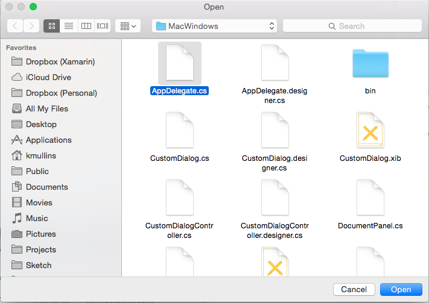](dialog-images/dialog03.png#lightbox)

In this article, we'll cover the basics of working with Dialogs and Modal Windows in a Xamarin.Mac application. It is highly suggested that you work through the [Hello, Mac](~/mac/get-started/hello-mac.md) article first, specifically the [Introduction to Xcode and Interface Builder](~/mac/get-started/hello-mac.md#introduction-to-xcode-and-interface-builder) and [Outlets and Actions](~/mac/get-started/hello-mac.md#outlets-and-actions) sections, as it covers key concepts and techniques that we'll be using in this article.

You may want to take a look at the [Exposing C# classes / methods to Objective-C](~/mac/internals/how-it-works.md) section of the [Xamarin.Mac Internals](~/mac/internals/how-it-works.md) document as well, it explains the `Register` and `Export` commands used to wire-up your C# classes to Objective-C objects and UI Elements.

<a name="Introduction_to_Dialogs"></a>

## Introduction to Dialogs

A dialog appears in response to a user action (such as saving a file) and provides a way for users to complete that action. A dialog requires a response from the user before it can be closed.

According to Apple, there are three ways to present a Dialog:

- **Document Modal** -  A Document Modal dialog prevents the user from doing anything else within a given document until it is dismissed.
- **App Modal** - An App Modal dialog prevents the user from interacting with the application until it is dismissed.
- **Modeless** A Modeless Dialog enables users to change settings in the dialog while still interacting with the document window.

### Modal Window

Any standard `NSWindow` can be used as a customized dialog by displaying it modally:

[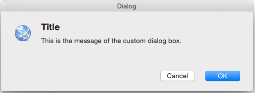](dialog-images/modal01.png#lightbox)

### Document Modal Dialog Sheets

A _Sheet_ is a modal dialog that is attached to a given document window, preventing users from interacting with the window until they dismiss the dialog. A Sheet is attached to the window from which it emerges and only one sheet can be open for a window at any one time.

[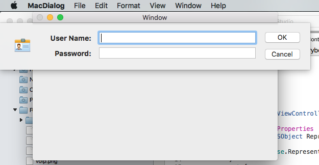](dialog-images/sheet08.png#lightbox)

### Preferences Windows

A Preferences Window is a modeless dialog that contains the application's settings that the user changes infrequently. Preferences Windows often include a Toolbar that allows the user to switch between different groups of settings:

[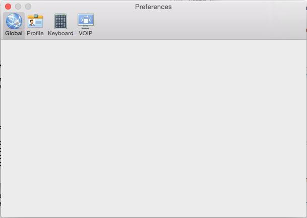](dialog-images/dialog02.png#lightbox)

### Open Dialog

The Open Dialog gives users a consistent way to find and open an item in an application:

[](dialog-images/dialog03.png#lightbox)

### Print and Page Setup Dialogs

macOS provides standard Print and Page Setup Dialogs that your application can display so that users can have a consistent printing experience in every application they use.

The Print Dialog can be displayed as both a free floating dialog box:

[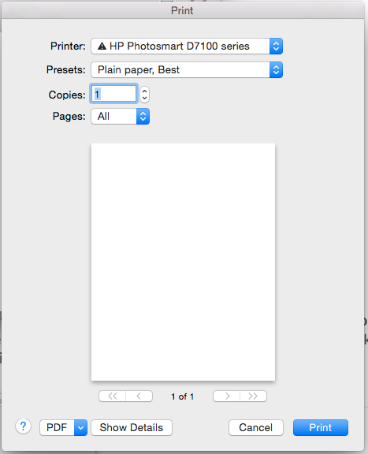](dialog-images/print01.png#lightbox)

Or it can be displayed as a Sheet:

[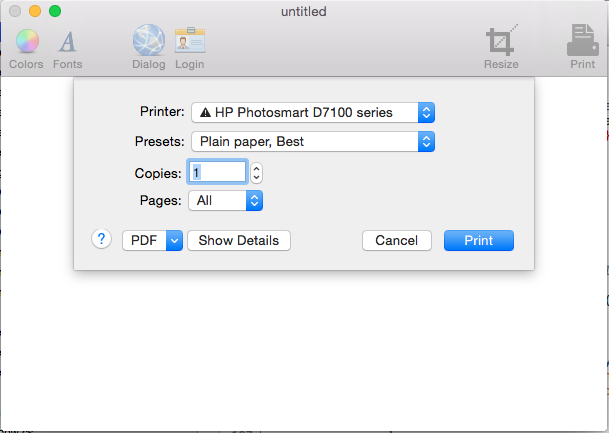](dialog-images/print02.png#lightbox)

The Page Setup Dialog can be displayed as both a free floating dialog box:

[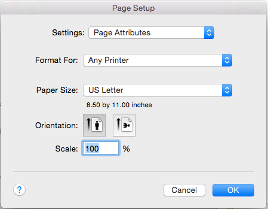](dialog-images/print03.png#lightbox)

Or it can be displayed as a Sheet:

[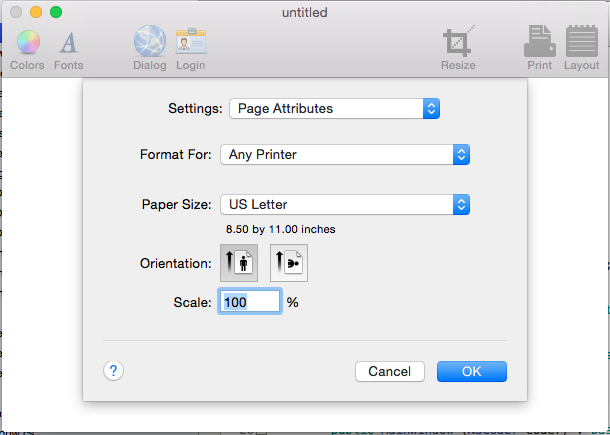](dialog-images/print04.png#lightbox)

### Save Dialogs

The Save Dialog gives users a consistent way to save an item in an application. The Save Dialog has two states: **Minimal** (also known as Collapsed):

[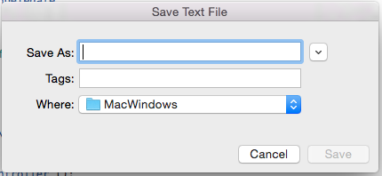](dialog-images/save01.png#lightbox)

And the **Expanded** state:

[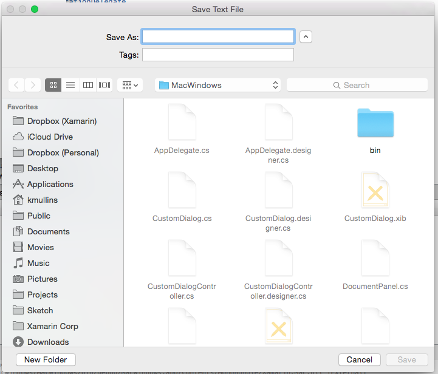](dialog-images/save02.png#lightbox)

The **Minimal** Save Dialog can also be displayed as a Sheet:

[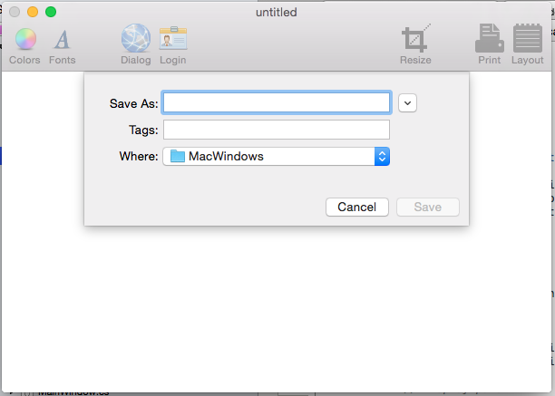](dialog-images/save03.png#lightbox)

As can the **Expanded** Save Dialog:

[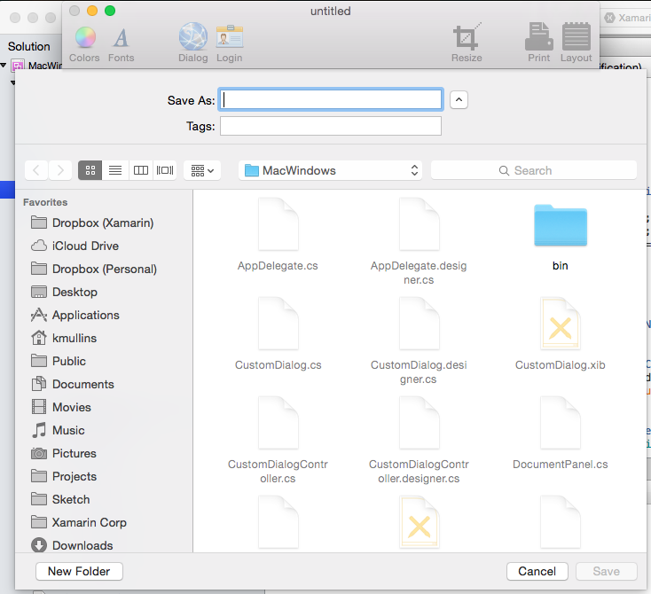](dialog-images/save04.png#lightbox)

For more information, see the [Dialogs](https://developer.apple.com/library/mac/documentation/UserExperience/Conceptual/OSXHIGuidelines/WindowDialogs.html#//apple_ref/doc/uid/20000957-CH43-SW1) section of Apple's [OS X Human Interface Guidelines](https://developer.apple.com/library/mac/documentation/UserExperience/Conceptual/OSXHIGuidelines/)

<a name="Adding_a_Modal_Window_to_a_Project"></a>

## Adding a Modal Window to a Project

Aside from the main document window, a Xamarin.Mac application might need to display other types of windows to the user, such as Preferences or Inspector Panels.

To add a new window, do the following:

1. In the **Solution Explorer**, open the `Main.storyboard` file for editing in Xcode's Interface Builder.
2. Drag a new **View Controller** into the Design Surface:

    [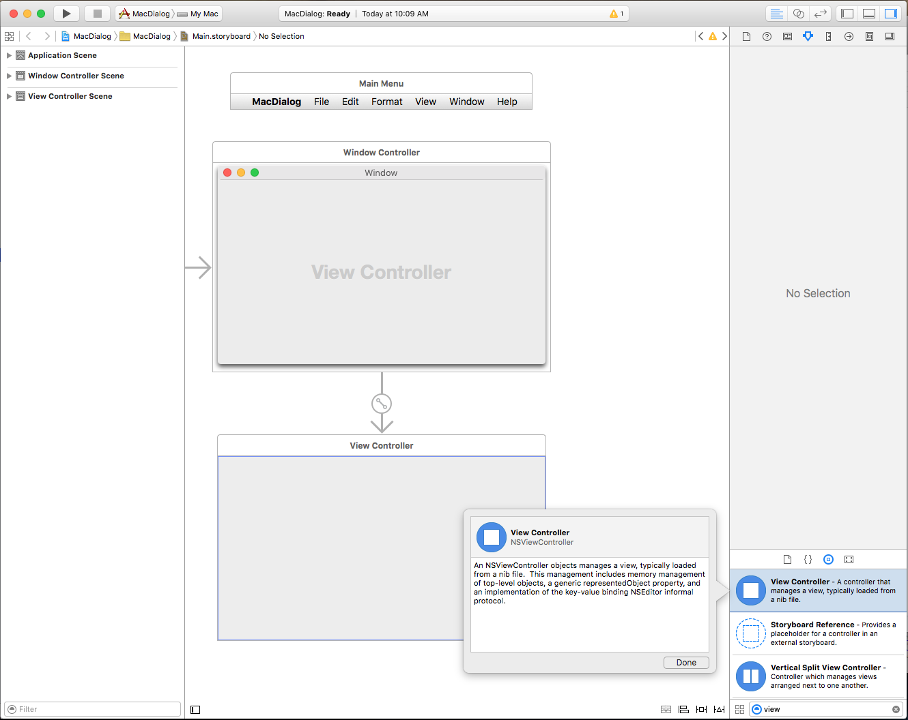](dialog-images/new01.png#lightbox)
3. In the **Identity Inspector**, enter `CustomDialogController` for the **Class Name**: 

    [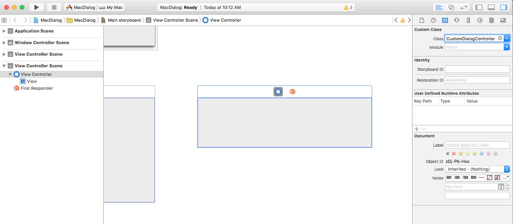](dialog-images/new02.png#lightbox)
4. Switch back to Visual Studio for Mac, allow it to sync with Xcode and create the `CustomDialogController.h` file.
5. Return to Xcode and design your interface: 

    [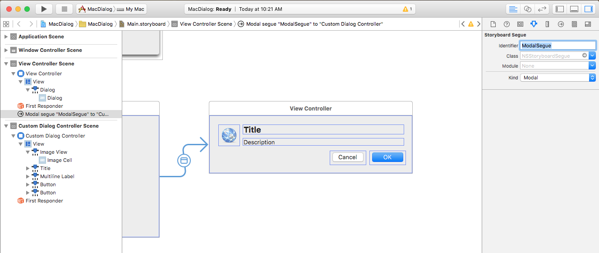](dialog-images/new03.png#lightbox)
6. Create a **Modal Segue** from the Main Window of your app to the new View Controller by control-dragging from the UI element that will open the dialog to the dialog's window. Assign the **Identifier** `ModalSegue`: 

    [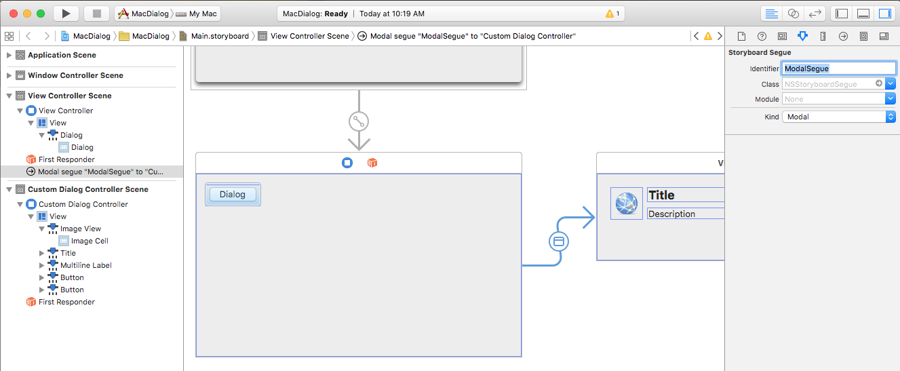](dialog-images/new06.png#lightbox)
7. Wire-up any **Actions** and **Outlets**: 

    [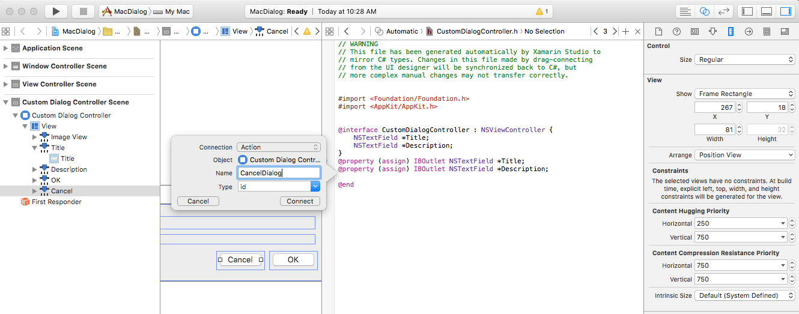](dialog-images/new04.png#lightbox)
8. Save your changes and return to Visual Studio for Mac to sync with Xcode.

Make the `CustomDialogController.cs` file look like the following:

```csharp
using System;
using Foundation;
using AppKit;

namespace MacDialog
{
    public partial class CustomDialogController : NSViewController
    {
        #region Private Variables
        private string _dialogTitle = "Title";
        private string _dialogDescription = "Description";
        private NSViewController _presentor;
        #endregion

        #region Computed Properties
        public string DialogTitle {
            get { return _dialogTitle; }
            set { _dialogTitle = value; }
        }

        public string DialogDescription {
            get { return _dialogDescription; }
            set { _dialogDescription = value; }
        }

        public NSViewController Presentor {
            get { return _presentor; }
            set { _presentor = value; }
        }
        #endregion

        #region Constructors
        public CustomDialogController (IntPtr handle) : base (handle)
        {
        }
        #endregion

        #region Override Methods
        public override void ViewWillAppear ()
        {
            base.ViewWillAppear ();

            // Set initial title and description
            Title.StringValue = DialogTitle;
            Description.StringValue = DialogDescription;
        }
        #endregion

        #region Private Methods
        private void CloseDialog() {
            Presentor.DismissViewController (this);
        }
        #endregion

        #region Custom Actions
        partial void AcceptDialog (Foundation.NSObject sender) {
            RaiseDialogAccepted();
            CloseDialog();
        }

        partial void CancelDialog (Foundation.NSObject sender) {
            RaiseDialogCanceled();
            CloseDialog();
        }
        #endregion

        #region Events
        public EventHandler DialogAccepted;

        internal void RaiseDialogAccepted() {
            if (this.DialogAccepted != null)
                this.DialogAccepted (this, EventArgs.Empty);
        }

        public EventHandler DialogCanceled;

        internal void RaiseDialogCanceled() {
            if (this.DialogCanceled != null)
                this.DialogCanceled (this, EventArgs.Empty);
        }
        #endregion
    }
}
```

This code exposes a few properties to set the title and the description of the dialog and a few events to react to the dialog being canceled or accepted.

Next, edit the `ViewController.cs` file, override the `PrepareForSegue` method and make it look like the following:

```csharp
public override void PrepareForSegue (NSStoryboardSegue segue, NSObject sender)
{
    base.PrepareForSegue (segue, sender);

    // Take action based on the segue name
    switch (segue.Identifier) {
    case "ModalSegue":
        var dialog = segue.DestinationController as CustomDialogController;
        dialog.DialogTitle = "MacDialog";
        dialog.DialogDescription = "This is a sample dialog.";
        dialog.DialogAccepted += (s, e) => {
            Console.WriteLine ("Dialog accepted");
            DismissViewController (dialog);
        };
        dialog.Presentor = this;
        break;
    }
}
```

This code initializes the segue that we defined in Xcode's Interface Builder to our dialog and sets up the title and description. It also handles the choice the user makes in the dialog box.

We can run our application and display the custom dialog:

[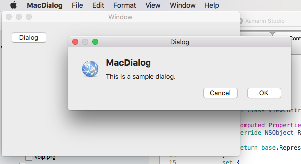](dialog-images/new05.png#lightbox)

For more information about using windows in a Xamarin.Mac application, please see our [Working with Windows](~/mac/user-interface/window.md) documentation.

<a name="Creating_a_Custom_Sheet"></a>

## Creating a Custom Sheet

A _Sheet_ is a modal dialog that is attached to a given document window, preventing users from interacting with the window until they dismiss the dialog. A Sheet is attached to the window from which it emerges and only one sheet can be open for a window at any one time. 

To create a Custom Sheet in Xamarin.Mac, let's do the following:

1. In the **Solution Explorer**, open the `Main.storyboard` file for editing in Xcode's Interface Builder.
2. Drag a new **View Controller** into the Design Surface:

    [](dialog-images/new01.png#lightbox)
3. Design your user interface:

    [](dialog-images/sheet01.png#lightbox)
4. Create a **Sheet Segue** from your Main Window to the new View Controller: 

    [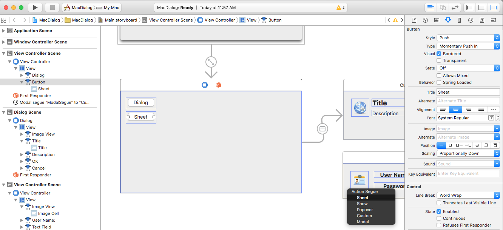](dialog-images/sheet02.png#lightbox)
5. In the **Identity Inspector**, name the View Controller's **Class** `SheetViewController`: 

    [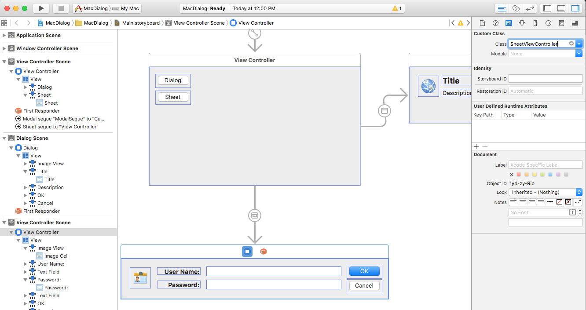](dialog-images/sheet03.png#lightbox)
6. Define any needed **Outlets** and **Actions**: 

    [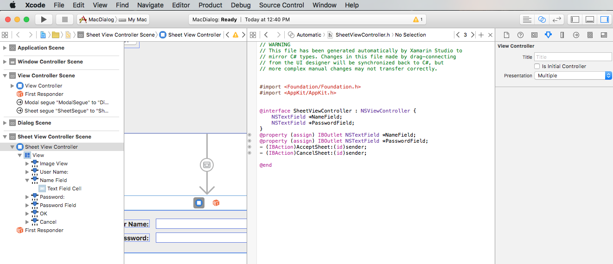](dialog-images/sheet04.png#lightbox)
7. Save your changes and return to Visual Studio for Mac to sync.

Next, edit the `SheetViewController.cs` file and make it look like the following:

```csharp
using System;
using Foundation;
using AppKit;

namespace MacDialog
{
    public partial class SheetViewController : NSViewController
    {
        #region Private Variables
        private string _userName = "";
        private string _password = "";
        private NSViewController _presentor;
        #endregion

        #region Computed Properties
        public string UserName {
            get { return _userName; }
            set { _userName = value; }
        }

        public string Password {
            get { return _password;}
            set { _password = value;}
        }

        public NSViewController Presentor {
            get { return _presentor; }
            set { _presentor = value; }
        }
        #endregion

        #region Constructors
        public SheetViewController (IntPtr handle) : base (handle)
        {
        }
        #endregion

        #region Override Methods
        public override void ViewWillAppear ()
        {
            base.ViewWillAppear ();

            // Set initial values
            NameField.StringValue = UserName;
            PasswordField.StringValue = Password;

            // Wireup events
            NameField.Changed += (sender, e) => {
                UserName = NameField.StringValue;
            };
            PasswordField.Changed += (sender, e) => {
                Password = PasswordField.StringValue;
            };
        }
        #endregion

        #region Private Methods
        private void CloseSheet() {
            Presentor.DismissViewController (this);
        }
        #endregion

        #region Custom Actions
        partial void AcceptSheet (Foundation.NSObject sender) {
            RaiseSheetAccepted();
            CloseSheet();
        }

        partial void CancelSheet (Foundation.NSObject sender) {
            RaiseSheetCanceled();
            CloseSheet();
        }
        #endregion

        #region Events
        public EventHandler SheetAccepted;

        internal void RaiseSheetAccepted() {
            if (this.SheetAccepted != null)
                this.SheetAccepted (this, EventArgs.Empty);
        }

        public EventHandler SheetCanceled;

        internal void RaiseSheetCanceled() {
            if (this.SheetCanceled != null)
                this.SheetCanceled (this, EventArgs.Empty);
        }
        #endregion
    }
}
```

Next, edit the `ViewController.cs` file, edit the `PrepareForSegue` method and make it look like the following:

```csharp
public override void PrepareForSegue (NSStoryboardSegue segue, NSObject sender)
{
    base.PrepareForSegue (segue, sender);

    // Take action based on the segue name
    switch (segue.Identifier) {
    case "ModalSegue":
        var dialog = segue.DestinationController as CustomDialogController;
        dialog.DialogTitle = "MacDialog";
        dialog.DialogDescription = "This is a sample dialog.";
        dialog.DialogAccepted += (s, e) => {
            Console.WriteLine ("Dialog accepted");
            DismissViewController (dialog);
        };
        dialog.Presentor = this;
        break;
    case "SheetSegue":
        var sheet = segue.DestinationController as SheetViewController;
        sheet.SheetAccepted += (s, e) => {
            Console.WriteLine ("User Name: {0} Password: {1}", sheet.UserName, sheet.Password);
        };
        sheet.Presentor = this;
        break;
    }
}
```

If we run our application and open the Sheet, it will be attached to the window:

[](dialog-images/sheet08.png#lightbox)

<a name="Creating_a_Preferences_Dialog"></a>

## Creating a Preferences Dialog

Before we lay out the Preference View in Interface Builder, we'll need to add a custom segue type to handle switching out the preferences. Add a new class to your project and call it `ReplaceViewSeque`. Edit the class and make it look like the following:

```csharp
using System;
using AppKit;
using Foundation;

namespace MacWindows
{
    [Register("ReplaceViewSeque")]
    public class ReplaceViewSeque : NSStoryboardSegue
    {
        #region Constructors
        public ReplaceViewSeque() {

        }

        public ReplaceViewSeque (string identifier, NSObject sourceController, NSObject destinationController) : base(identifier,sourceController,destinationController) {

        }

        public ReplaceViewSeque (IntPtr handle) : base(handle) {
        }

        public ReplaceViewSeque (NSObjectFlag x) : base(x) {
        }
        #endregion

        #region Override Methods
        public override void Perform ()
        {
            // Cast the source and destination controllers
            var source = SourceController as NSViewController;
            var destination = DestinationController as NSViewController;

            // Is there a source?
            if (source == null) {
                // No, get the current key window
                var window = NSApplication.SharedApplication.KeyWindow;

                // Swap the controllers
                window.ContentViewController = destination;

                // Release memory
                window.ContentViewController?.RemoveFromParentViewController ();
            } else {
                // Swap the controllers
                source.View.Window.ContentViewController = destination;

                // Release memory
                source.RemoveFromParentViewController ();
            }
        
        }
        #endregion

    }

}
```

With the custom segue created, we can add a new window in Xcode's Interface Builder to handle our preferences.

To add a new window, do the following:

1. In the **Solution Explorer**, open the `Main.storyboard` file for editing in Xcode's Interface Builder.
2. Drag a new **Window Controller** into the Design Surface:

    [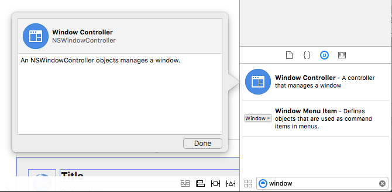](dialog-images/pref01.png#lightbox)
3. Arrange the Window near the **Menu Bar** designer:

    [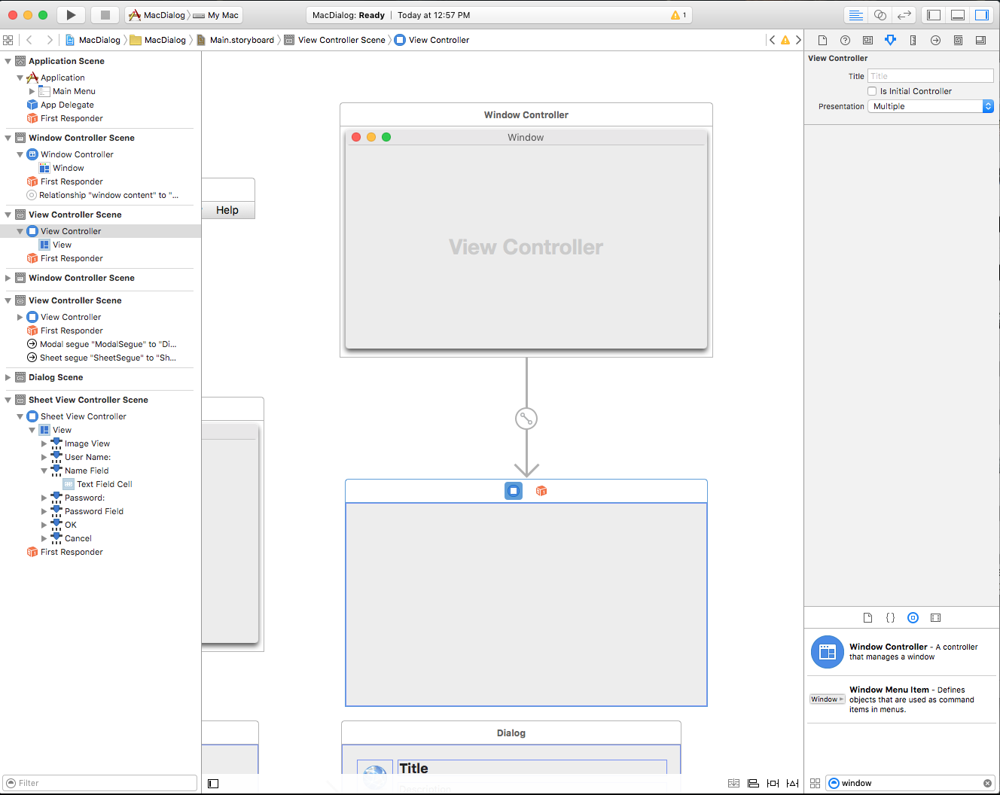](dialog-images/pref02.png#lightbox)
4. Create copies of the attached View Controller as there will be tabs in your preference view:

    [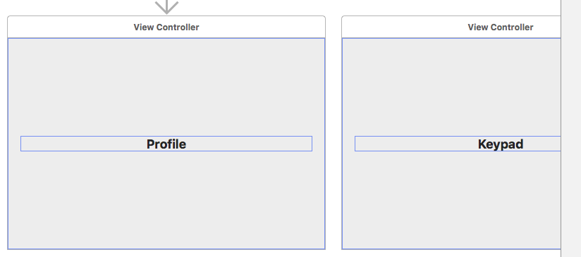](dialog-images/pref03.png#lightbox)
5. Drag a new **Toolbar Controller** from the **Library**:

    [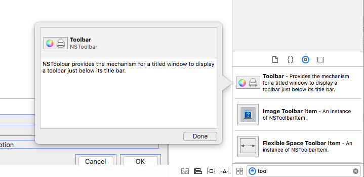](dialog-images/pref04.png#lightbox)
6. And drop it on the Window in the Design Surface:

    [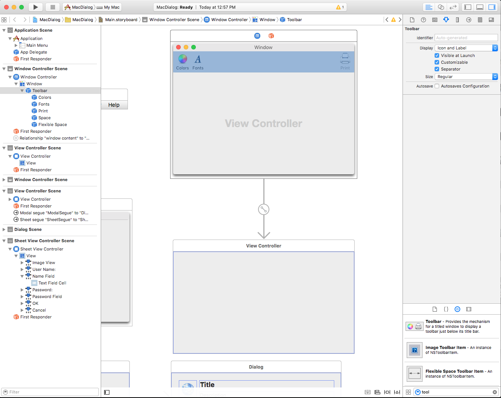](dialog-images/pref05.png#lightbox)
7. Layout the design of your toolbar:

    [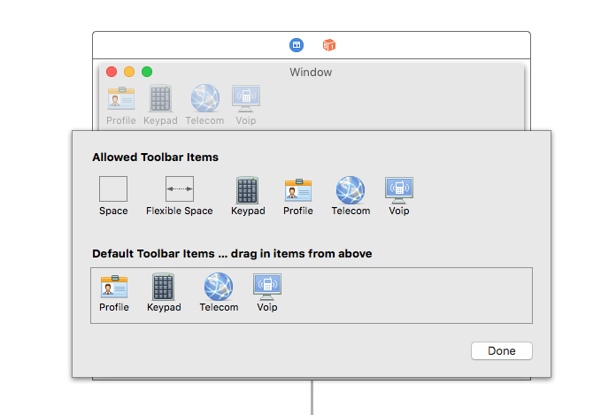](dialog-images/pref06.png#lightbox)
8. Control-Click and drag from each **Toolbar Button** to the Views you created above. Select a **Custom** segue type:

    [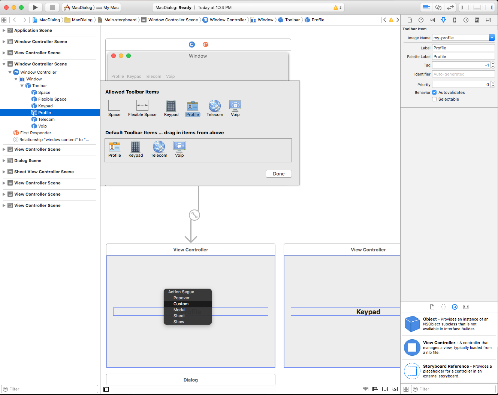](dialog-images/pref07.png#lightbox)
9. Select the new Segue and set the **Class** to `ReplaceViewSegue`:

    [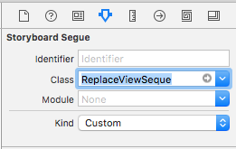](dialog-images/pref08.png#lightbox)
10. In the **Menubar Designer** on the Design Surface, from the Application Menu select **Preferences...**, control-click and drag to the Preferences Window to create a **Show** segue:

    [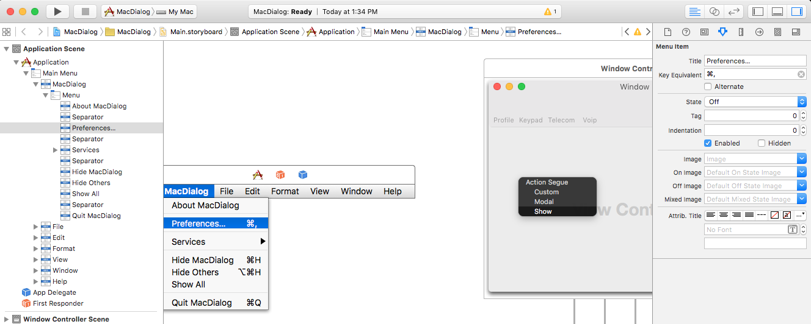](dialog-images/pref09.png#lightbox)
11. Save your changes and return to Visual Studio for Mac to sync.

If we run the code and select the **Preferences...** from the **Application Menu**, the window will be displayed:

[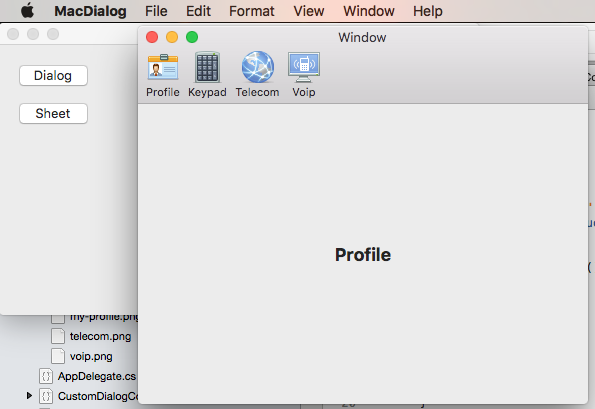](dialog-images/pref10.png#lightbox)

For more information on working with Windows and Toolbars, please see our [Windows](~/mac/user-interface/window.md) and [Toolbars](~/mac/user-interface/toolbar.md) documentation.

<a name="Saving-and-Loading-Preferences"></a>

### Saving and Loading Preferences

In a typical macOS App, when the user makes changes to any of the App's User Preferences, those changes are saved automatically. The easiest way to handle this in a Xamarin.Mac app, is to create a single class to manage all of the user's preferences and share it system-wide.

First, add a new `AppPreferences` class to the project and inherit from `NSObject`. The preferences will be designed to use [Data Binding and Key-Value Coding](~/mac/app-fundamentals/databinding.md) which will make the process of creating and maintaining the preference forms much simpler. Since the Preferences will consist of a small amount of simple datatypes, use the built in `NSUserDefaults` to store and retrieve values.

Edit the `AppPreferences.cs` file and make it look like the following:

```csharp
using System;
using Foundation;
using AppKit;

namespace SourceWriter
{
    [Register("AppPreferences")]
    public class AppPreferences : NSObject
    {
        #region Computed Properties
        [Export("DefaultLanguage")]
        public int DefaultLanguage {
            get { 
                var value = LoadInt ("DefaultLanguage", 0);
                return value; 
            }
            set {
                WillChangeValue ("DefaultLanguage");
                SaveInt ("DefaultLanguage", value, true);
                DidChangeValue ("DefaultLanguage");
            }
        }

        [Export("SmartLinks")]
        public bool SmartLinks {
            get { return LoadBool ("SmartLinks", true); }
            set {
                WillChangeValue ("SmartLinks");
                SaveBool ("SmartLinks", value, true);
                DidChangeValue ("SmartLinks");
            }
        }

        // Define any other required user preferences in the same fashion
        ...

        [Export("EditorBackgroundColor")]
        public NSColor EditorBackgroundColor {
            get { return LoadColor("EditorBackgroundColor", NSColor.White); }
            set {
                WillChangeValue ("EditorBackgroundColor");
                SaveColor ("EditorBackgroundColor", value, true);
                DidChangeValue ("EditorBackgroundColor");
            }
        }
        #endregion

        #region Constructors
        public AppPreferences ()
        {
        }
        #endregion

        #region Public Methods
        public int LoadInt(string key, int defaultValue) {
            // Attempt to read int
            var number = NSUserDefaults.StandardUserDefaults.IntForKey(key);

            // Take action based on value
            if (number == null) {
                return defaultValue;
            } else {
                return (int)number;
            }
        }
            
        public void SaveInt(string key, int value, bool sync) {
            NSUserDefaults.StandardUserDefaults.SetInt(value, key);
            if (sync) NSUserDefaults.StandardUserDefaults.Synchronize ();
        }

        public bool LoadBool(string key, bool defaultValue) {
            // Attempt to read int
            var value = NSUserDefaults.StandardUserDefaults.BoolForKey(key);

            // Take action based on value
            if (value == null) {
                return defaultValue;
            } else {
                return value;
            }
        }

        public void SaveBool(string key, bool value, bool sync) {
            NSUserDefaults.StandardUserDefaults.SetBool(value, key);
            if (sync) NSUserDefaults.StandardUserDefaults.Synchronize ();
        }

        public string NSColorToHexString(NSColor color, bool withAlpha) {
            //Break color into pieces
            nfloat red=0, green=0, blue=0, alpha=0;
            color.GetRgba (out red, out green, out blue, out alpha);

            // Adjust to byte
            alpha *= 255;
            red *= 255;
            green *= 255;
            blue *= 255;

            //With the alpha value?
            if (withAlpha) {
                return String.Format ("#{0:X2}{1:X2}{2:X2}{3:X2}", (int)alpha, (int)red, (int)green, (int)blue);
            } else {
                return String.Format ("#{0:X2}{1:X2}{2:X2}", (int)red, (int)green, (int)blue);
            }
        }

        public NSColor NSColorFromHexString (string hexValue)
        {
            var colorString = hexValue.Replace ("#", "");
            float red, green, blue, alpha;

            // Convert color based on length
            switch (colorString.Length) {
            case 3 : // #RGB
                red = Convert.ToInt32(string.Format("{0}{0}", colorString.Substring(0, 1)), 16) / 255f;
                green = Convert.ToInt32(string.Format("{0}{0}", colorString.Substring(1, 1)), 16) / 255f;
                blue = Convert.ToInt32(string.Format("{0}{0}", colorString.Substring(2, 1)), 16) / 255f;
                return NSColor.FromRgba(red, green, blue, 1.0f);
            case 6 : // #RRGGBB
                red = Convert.ToInt32(colorString.Substring(0, 2), 16) / 255f;
                green = Convert.ToInt32(colorString.Substring(2, 2), 16) / 255f;
                blue = Convert.ToInt32(colorString.Substring(4, 2), 16) / 255f;
                return NSColor.FromRgba(red, green, blue, 1.0f);
            case 8 : // #AARRGGBB
                alpha = Convert.ToInt32(colorString.Substring(0, 2), 16) / 255f;
                red = Convert.ToInt32(colorString.Substring(2, 2), 16) / 255f;
                green = Convert.ToInt32(colorString.Substring(4, 2), 16) / 255f;
                blue = Convert.ToInt32(colorString.Substring(6, 2), 16) / 255f;
                return NSColor.FromRgba(red, green, blue, alpha);
            default :
                throw new ArgumentOutOfRangeException(string.Format("Invalid color value '{0}'. It should be a hex value of the form #RBG, #RRGGBB or #AARRGGBB", hexValue));
            }
        }

        public NSColor LoadColor(string key, NSColor defaultValue) {

            // Attempt to read color
            var hex = NSUserDefaults.StandardUserDefaults.StringForKey(key);

            // Take action based on value
            if (hex == null) {
                return defaultValue;
            } else {
                return NSColorFromHexString (hex);
            }
        }

        public void SaveColor(string key, NSColor color, bool sync) {
            // Save to default
            NSUserDefaults.StandardUserDefaults.SetString(NSColorToHexString(color,true), key);
            if (sync) NSUserDefaults.StandardUserDefaults.Synchronize ();
        }
        #endregion
    }
}
```

This class contains a few helper routines such as `SaveInt`, `LoadInt`, `SaveColor`, `LoadColor`, etc. to make working with `NSUserDefaults` easier. Also, since `NSUserDefaults` does not have a built-in way to handle `NSColors`, the `NSColorToHexString` and `NSColorFromHexString` methods are used to convert colors to web-based hex strings (`#RRGGBBAA` where `AA` is the alpha transparency) that can be easily stored and retrieved.

In the `AppDelegate.cs` file, create an instance of the **AppPreferences** object that will be used app-wide:

```csharp
using AppKit;
using Foundation;
using System.IO;
using System;

namespace SourceWriter
{
    [Register ("AppDelegate")]
    public class AppDelegate : NSApplicationDelegate
    {
        #region Computed Properties
        public int NewWindowNumber { get; set;} = -1;

        public AppPreferences Preferences { get; set; } = new AppPreferences();
        #endregion

        #region Constructors
        public AppDelegate ()
        {
        }
        #endregion
        
        ...
```

<a name="Wiring-Preferences-to-Preference-Views"></a>

### Wiring Preferences to Preference Views

Next, connect Preference class to UI elements on the Preference Window and Views created above. In Interface Builder, select a Preference View Controller and switch to the **Identity Inspector**, create a custom class for the controller: 

[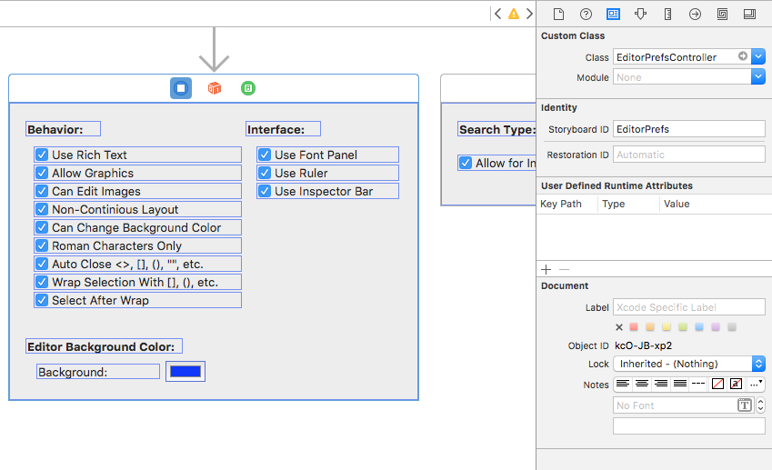](dialog-images/prefs12.png#lightbox)

Switch back to Visual Studio for Mac to sync your changes and open the newly created class for editing. Make the class look like the following:

```csharp
using System;
using Foundation;
using AppKit;

namespace SourceWriter
{
    public partial class EditorPrefsController : NSViewController
    {
        #region Application Access
        public static AppDelegate App {
            get { return (AppDelegate)NSApplication.SharedApplication.Delegate; }
        }
        #endregion

        #region Computed Properties
        [Export("Preferences")]
        public AppPreferences Preferences {
            get { return App.Preferences; }
        }
        #endregion

        #region Constructors
        public EditorPrefsController (IntPtr handle) : base (handle)
        {
        }
        #endregion
    }
}
```

Notice that this class has done two things here: First, there is a helper `App` property to make accessing the **AppDelegate** easier. Second, the `Preferences` property exposes the global **AppPreferences** class for data binding with any UI controls placed on this View.

Next, double click the Storyboard file to re-open it in Interface Builder (and see the changes just made above). Drag any UI controls required to build the preferences interface into the View. For each control, switch to the **Binding Inspector** and bind to the individual properties of the **AppPreference** class:

[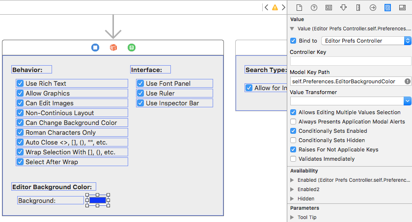](dialog-images/prefs13.png#lightbox)

Repeat the above steps for all of the panels (View Controllers) and Preference Properties required.

<a name="Applying-Preference-Changes-to-All-Open-Windows"></a>

### Applying Preference Changes to All Open Windows

As stated above, in a typical macOS App, when the user makes changes to any of the App's User Preferences, those changes are saved automatically and applied to any windows the user might have open in the application.

Careful planning and design of your app's preferences and windows will allow this process to happen smoothly and transparently to the end user, with a minimal amount of coding work.

For any Window that will be consuming App Preferences, add the following helper property to its Content View Controller to make accessing our **AppDelegate** easier:

```csharp
#region Application Access
public static AppDelegate App {
    get { return (AppDelegate)NSApplication.SharedApplication.Delegate; }
}
#endregion
```

Next, add a class to configure the contents or behavior based on the user's preferences:

```csharp
public void ConfigureEditor() {

    // General Preferences
    TextEditor.AutomaticLinkDetectionEnabled = App.Preferences.SmartLinks;
    TextEditor.AutomaticQuoteSubstitutionEnabled = App.Preferences.SmartQuotes;
    ...

}
``` 

You need to call the configuration method when the Window is first opened to make sure it conforms to the user's preferences:

```csharp
public override void ViewDidLoad ()
{
    base.ViewDidLoad ();

    // Configure editor from user preferences
    ConfigureEditor ();
    ...
}
```

Next, edit the `AppDelegate.cs` file and add the following method to apply any preference changes to all open windows:

```csharp
public void UpdateWindowPreferences() {

    // Process all open windows
    for(int n=0; n<NSApplication.SharedApplication.Windows.Length; ++n) {
        var content = NSApplication.SharedApplication.Windows[n].ContentViewController as ViewController;
        if (content != null ) {
            // Reformat all text
            content.ConfigureEditor ();
        }
    }

}
```

Next, add a `PreferenceWindowDelegate` class to the project and make it look like the following:

```csharp
using System;
using AppKit;
using System.IO;
using Foundation;

namespace SourceWriter
{
    public class PreferenceWindowDelegate : NSWindowDelegate
    {
        #region Application Access
        public static AppDelegate App {
            get { return (AppDelegate)NSApplication.SharedApplication.Delegate; }
        }
        #endregion

        #region Computed Properties
        public NSWindow Window { get; set;}
        #endregion

        #region constructors
        public PreferenceWindowDelegate (NSWindow window)
        {
            // Initialize
            this.Window = window;

        }
        #endregion

        #region Override Methods
        public override bool WindowShouldClose (Foundation.NSObject sender)
        {
            
            // Apply any changes to open windows
            App.UpdateWindowPreferences();

            return true;
        }
        #endregion
    }
}
```

This will cause any preference changes to be sent to all open Windows when the preference Window closes.

Finally, edit the Preference Window Controller and add the delegate created above:

```csharp
using System;
using Foundation;
using AppKit;

namespace SourceWriter
{
    public partial class PreferenceWindowController : NSWindowController
    {
        #region Constructors
        public PreferenceWindowController (IntPtr handle) : base (handle)
        {
        }
        #endregion

        #region Override Methods
        public override void WindowDidLoad ()
        {
            base.WindowDidLoad ();

            // Initialize
            Window.Delegate = new PreferenceWindowDelegate(Window);
            Toolbar.SelectedItemIdentifier = "General";
        }
        #endregion
    }
}
```

With all these changes in place, if the user edits the App's Preferences and closes the Preference Window, the changes will be applied to all open Windows:

[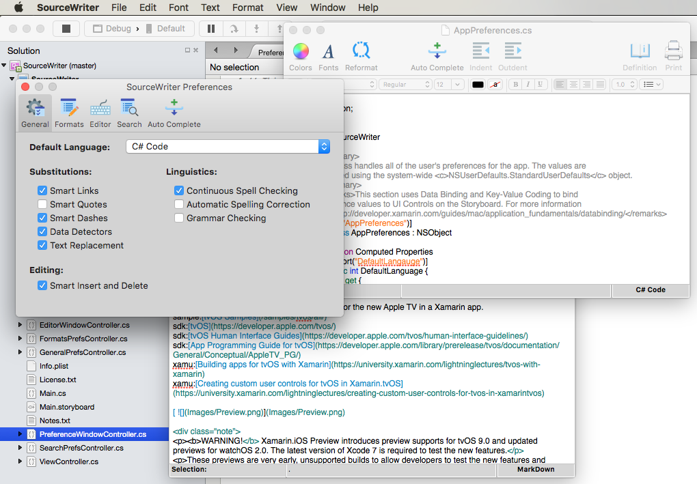](dialog-images/prefs14.png#lightbox)

<a name="The_Open_Dialog"></a>

## The Open Dialog

The Open Dialog gives users a consistent way to find and open an item in an application. To display an Open Dialog in a Xamarin.Mac application, use the following code:

```csharp
var dlg = NSOpenPanel.OpenPanel;
dlg.CanChooseFiles = true;
dlg.CanChooseDirectories = false;
dlg.AllowedFileTypes = new string[] { "txt", "html", "md", "css" };

if (dlg.RunModal () == 1) {
    // Nab the first file
    var url = dlg.Urls [0];

    if (url != null) {
        var path = url.Path;

        // Create a new window to hold the text
        var newWindowController = new MainWindowController ();
        newWindowController.Window.MakeKeyAndOrderFront (this);

        // Load the text into the window
        var window = newWindowController.Window as MainWindow;
        window.Text = File.ReadAllText(path);
        window.SetTitleWithRepresentedFilename (Path.GetFileName(path));
        window.RepresentedUrl = url;

    }
}
```

In the above code, we are opening a new document window to display the contents of the file. You'll need to replace this code with functionality is required by your application.

The following properties are available when working with a `NSOpenPanel`:

- **CanChooseFiles** - If `true` the user can select files.
- **CanChooseDirectories** - If `true` the user can select directories.
- **AllowsMultipleSelection** - If `true` the user can select more than one file at a time.
- **ResolveAliases** - If `true` selecting and alias, resolves it to the original file's path.
- **AllowedFileTypes** - Is a string array of file types that the user can select as either an extension or _UTI_. The default value is `null`, which allows any file to be opened.

The `RunModal ()` method displays the Open Dialog and allow the user to select files or directories (as specified by the properties) and returns `1` if the user clicks the **Open** button.

The Open Dialog returns the user's selected files or directories as an array of URLs in the `URL` property.

If we run the program and select the **Open...** item from the **File** menu, the following is displayed: 

[](dialog-images/dialog03.png#lightbox)

<a name="The_Print_and_Page_Setup_Dialogs"></a>

## The Print and Page Setup Dialogs

macOS provides standard Print and Page Setup Dialogs that your application can display so that users can have a consistent printing experience in every application they use.

The following code will show the standard Print Dialog:

```csharp
public bool ShowPrintAsSheet { get; set;} = true;
...

[Export ("showPrinter:")]
void ShowDocument (NSObject sender) {
    var dlg = new NSPrintPanel();

    // Display the print dialog as dialog box
    if (ShowPrintAsSheet) {
        dlg.BeginSheet(new NSPrintInfo(),this,this,null,new IntPtr());
    } else {
        if (dlg.RunModalWithPrintInfo(new NSPrintInfo()) == 1) {
            var alert = new NSAlert () {
                AlertStyle = NSAlertStyle.Critical,
                InformativeText = "We need to print the document here...",
                MessageText = "Print Document",
            };
            alert.RunModal ();
        }
    }
}

```

If we set the `ShowPrintAsSheet` property to `false`, run the application and display the print dialog, the following will be displayed:

[](dialog-images/print01.png#lightbox)

If set the `ShowPrintAsSheet` property to `true`, run the application and display the print dialog, the following will be displayed:

[](dialog-images/print02.png#lightbox)

The following code will display the Page Layout Dialog:

```csharp
[Export ("showLayout:")]
void ShowLayout (NSObject sender) {
    var dlg = new NSPageLayout();

    // Display the print dialog as dialog box
    if (ShowPrintAsSheet) {
        dlg.BeginSheet (new NSPrintInfo (), this);
    } else {
        if (dlg.RunModal () == 1) {
            var alert = new NSAlert () {
                AlertStyle = NSAlertStyle.Critical,
                InformativeText = "We need to print the document here...",
                MessageText = "Print Document",
            };
            alert.RunModal ();
        }
    }
}
```

If we set the `ShowPrintAsSheet` property to `false`, run the application and display the print layout dialog, the following will be displayed:

[](dialog-images/print03.png#lightbox)

If set the `ShowPrintAsSheet` property to `true`, run the application and display the print layout dialog, the following will be displayed:

[](dialog-images/print04.png#lightbox)

For more information about working with the Print and Page Setup Dialogs, please see Apple's [NSPrintPanel](https://developer.apple.com/library/mac/documentation/Cocoa/Reference/ApplicationKit/Classes/NSPrintPanel_Class/index.html#//apple_ref/doc/uid/TP40004092) and [NSPageLayout](https://developer.apple.com/library/mac/documentation/Cocoa/Reference/ApplicationKit/Classes/NSPageLayout_Class/index.html#//apple_ref/doc/uid/TP40004080) documentation.

<a name="The_Save_Dialog"></a>

## The Save Dialog

The Save Dialog gives users a consistent way to save an item in an application.

The following code will show the standard Save Dialog:

```csharp
public bool ShowSaveAsSheet { get; set;} = true;
...

[Export("saveDocumentAs:")]
void ShowSaveAs (NSObject sender)
{
    var dlg = new NSSavePanel ();
    dlg.Title = "Save Text File";
    dlg.AllowedFileTypes = new string[] { "txt", "html", "md", "css" };

    if (ShowSaveAsSheet) {
        dlg.BeginSheet(mainWindowController.Window,(result) => {
            var alert = new NSAlert () {
                AlertStyle = NSAlertStyle.Critical,
                InformativeText = "We need to save the document here...",
                MessageText = "Save Document",
            };
            alert.RunModal ();
        });
    } else {
        if (dlg.RunModal () == 1) {
            var alert = new NSAlert () {
                AlertStyle = NSAlertStyle.Critical,
                InformativeText = "We need to save the document here...",
                MessageText = "Save Document",
            };
            alert.RunModal ();
        }
    }

}
```

The `AllowedFileTypes` property is a string array of file types that the user can select to save the file as. The file type can be either specified as an extension or _UTI_. The default value is `null`, which allows any file type to be used.

If we set the `ShowSaveAsSheet` property to `false`, run the application and select **Save As...** from the **File** menu, the following will be displayed:

[](dialog-images/save01.png#lightbox)

The user can expand the dialog:

[](dialog-images/save02.png#lightbox)

If we set the `ShowSaveAsSheet` property to `true`, run the application and select **Save As...** from the **File** menu, the following will be displayed:

[](dialog-images/save03.png#lightbox)

The user can expand the dialog:

[](dialog-images/save04.png#lightbox)

For more information on working with the Save Dialog, please see Apple's [NSSavePanel](https://developer.apple.com/library/mac/documentation/Cocoa/Reference/ApplicationKit/Classes/NSSavePanel_Class/index.html#//apple_ref/doc/uid/TP40004098) documentation.

<a name="Summary"></a>

## Summary

This article has taken a detailed look at working with Modal Windows, Sheets and the standard system Dialog Boxes in a Xamarin.Mac application. We saw the different types and uses of Modal Windows, Sheets and Dialogs, how to create and maintain Modal Windows and Sheets in Xcode's Interface Builder and how to work with Modal Windows, Sheets and Dialogs in C# code.

## Related Links

- [MacWindows (sample)](/samples/xamarin/mac-samples/macwindows)
- [Hello, Mac](~/mac/get-started/hello-mac.md)
- [Menus](~/mac/user-interface/menu.md)
- [Windows](~/mac/user-interface/window.md)
- [Toolbars](~/mac/user-interface/toolbar.md)
- [OS X Human Interface Guidelines](https://developer.apple.com/library/mac/documentation/UserExperience/Conceptual/OSXHIGuidelines/)
- [Introduction to Windows](https://developer.apple.com/library/mac/documentation/Cocoa/Conceptual/WinPanel/Introduction.html#//apple_ref/doc/uid/10000031-SW1)
- [Introduction to Sheets](https://developer.apple.com/library/mac/documentation/Cocoa/Conceptual/Sheets/Sheets.html#//apple_ref/doc/uid/10000002i)
- [Introduction to Printing](https://developer.apple.com/library/mac/documentation/Cocoa/Conceptual/Printing/osxp_aboutprinting/osxp_aboutprt.html)