# Menus in Xamarin.Mac

_This article covers working with menus in a Xamarin.Mac application. It describes creating and maintaining menus and menu items in Xcode and Interface Builder and working with them programmatically._

When working with C# and .NET in a Xamarin.Mac application, you have access to the same Cocoa menus that a developer working in Objective-C and Xcode does. Because Xamarin.Mac integrates directly with Xcode, you can use Xcode's Interface Builder to create and maintain your menu bars, menus, and menu items (or optionally create them directly in C# code).

Menus are an integral part of a Mac application's user experience and commonly appear in various parts of the user interface:

- **The application's menu bar** - This is the main menu that appears at the top of the screen for every Mac application.
- **Contextual menus** - These appear when the user right-clicks or control-clicks an item in a window.
- **The status bar** - This is the area at the far right side of the application menu bar that appears at the top of the screen (to the left of the menu bar clock) and grows to the left as items are added to it.
- **Dock menu** - The menu for each application in the dock that appears when the user right-clicks or control-clicks the application's icon, or when the user left-clicks the icon and holds the mouse button down.
- **Pop-up button and pull-down lists** - A pop-up button displays a selected item and presents a list of options to select from when clicked by the user. A pull-down list is a type of pop-up button usually used for selecting commands specific to the context of the current task. Both can appear anywhere in a window.

[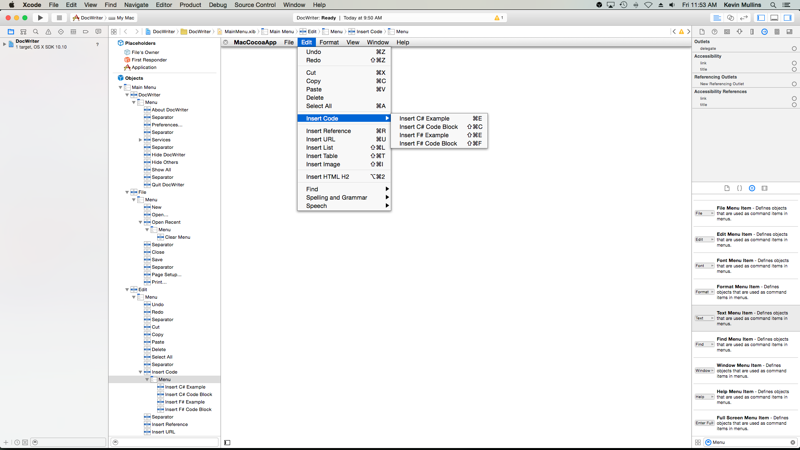](menu-images/intro01-large.png#lightbox)

In this article, we'll cover the basics of working with Cocoa menu bars, menus, and menu items in a Xamarin.Mac application. It is highly suggested that you work through the [Hello, Mac](~/mac/get-started/hello-mac.md) article first, specifically the [Introduction to Xcode and Interface Builder](~/mac/get-started/hello-mac.md#introduction-to-xcode-and-interface-builder) and [Outlets and Actions](~/mac/get-started/hello-mac.md#outlets-and-actions) sections, as it covers key concepts and techniques that we'll be using in this article.

You may want to take a look at the [Exposing C# classes / methods to Objective-C](~/mac/internals/how-it-works.md) section of the [Xamarin.Mac Internals](~/mac/internals/how-it-works.md) document as well, it explains the `Register` and `Export` attributes used to wire-up your C# classes to Objective-C objects and UI elements.

## The application's menu bar 

Unlike applications running on the Windows OS where every window can have its own menu bar attached to it, every application running on macOS has a single menu bar that runs along the top of the screen that's used for every window in that application:

[](menu-images/appmenu01-large.png#lightbox)

Items on this menu bar are activated or deactivated based on the current context or state of the application and its user interface at any given moment. For example: if the user selects a text field, items on the **Edit** menu will be come enabled such as **Copy** and **Cut**.

According to Apple and by default, all macOS applications have a standard set of menus and menu items that appear in the application's menu bar:

- **Apple menu** - This menu provides access to system wide items that are available to the user at all times, regardless of what application is running. These items cannot be modified by the developer.
- **App menu** - This menu displays the application's name in bold and helps the user identify what application is currently running. It contains items that apply to the application as a whole and not a given document or process such as quitting the application.
- **File menu** - Items used to create, open, or save documents that your application works with. If your application is not document-based, this menu can be renamed or removed.
- **Edit menu** - Holds commands such as **Cut**, **Copy**, and **Paste** which are used to edit or modify elements in the application's user interface.
- **Format menu** - If the application works with text, this menu holds commands to adjust the formatting of that text.
- **View menu** - Holds commands that affect how content is displayed (viewed) in the application's user interface.
- **Application-specific menus** - These are any menus that are specific to your application (such as a bookmarks menu for a web browser). They should appear between the **View** and **Window** menus on the bar.
- **Window menu** - Contains commands for working with windows in your application, as well as a list of current open windows.
- **Help menu** - If your application provides onscreen help, the Help menu should be the right-most menu on the bar. 

For more information about the application menu bar and standard menus and menu items, please see Apple's [Human Interface Guidelines](https://developer.apple.com/design/human-interface-guidelines/menus).

### The default application menu bar

Whenever you create a new Xamarin.Mac project, you automatically get a standard, default application menu bar that has the typical items that a macOS application would normally have (as discussed in the section above). Your application's default menu bar is defined in the **Main.storyboard** file (along with the rest of your app's UI) under the project in the **Solution Pad**:  

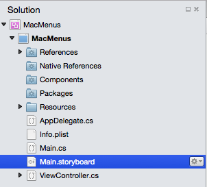

Double-click the **Main.storyboard** file to open it for editing in Xcode's Interface Builder and you'll be presented with the menu editor interface:

[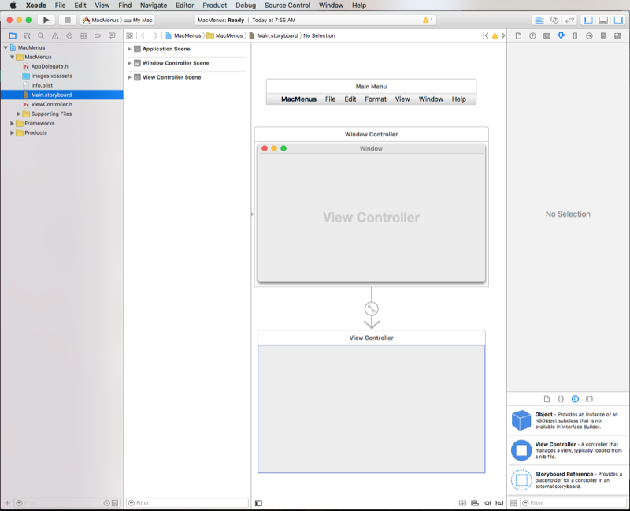](menu-images/defaultbar01-large.png#lightbox)

From here we can click on items such as the **Open** menu item in the **File** menu and edit or adjust its properties in the **Attributes Inspector**:

[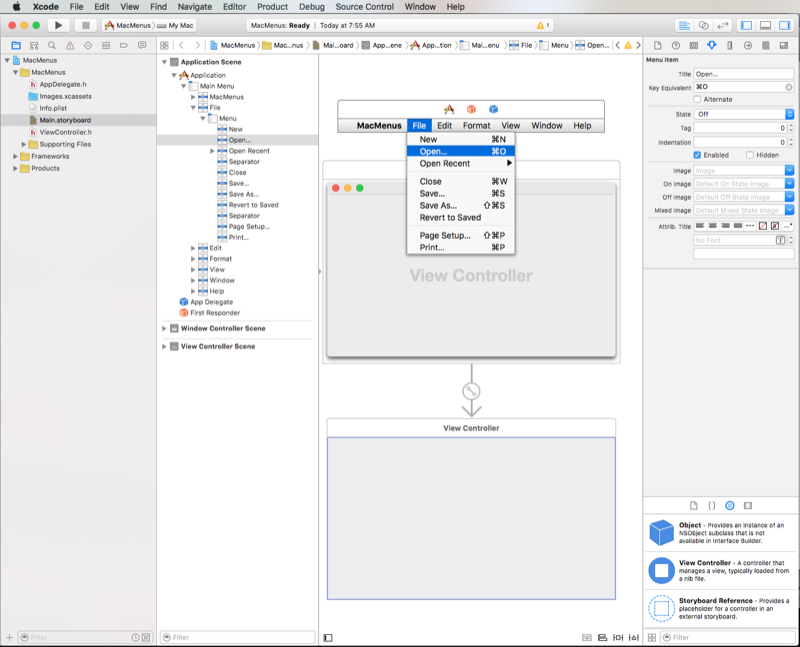](menu-images/defaultbar02-large.png#lightbox)

We'll get into adding, editing, and deleting menus and items later in this article. For now we just want to see what menus and menu items are available by default and how they have been automatically exposed to code via a set of predefined outlets and actions (for more information see our [Outlets and Actions](~/mac/get-started/hello-mac.md#outlets-and-actions) documentation).

For example, if we click on the **Connection Inspector** for the **Open** menu item we can see it is automatically wired up to the `openDocument:` action: 

[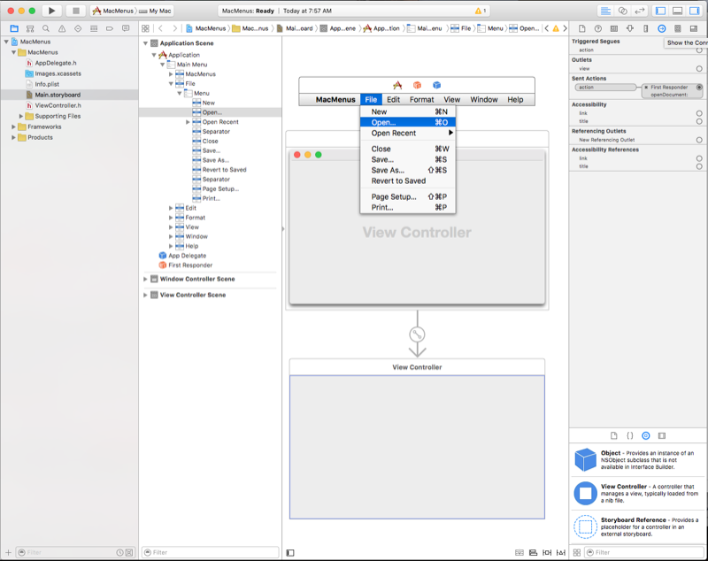](menu-images/defaultbar03-large.png#lightbox)

If you select the **First Responder** in the **Interface Hierarchy** and scroll down in the **Connection Inspector**, and you will see the definition of the `openDocument:` action that the **Open** menu item is attached to (along with several other default actions for the application that are and are not automatically wired up to controls):

[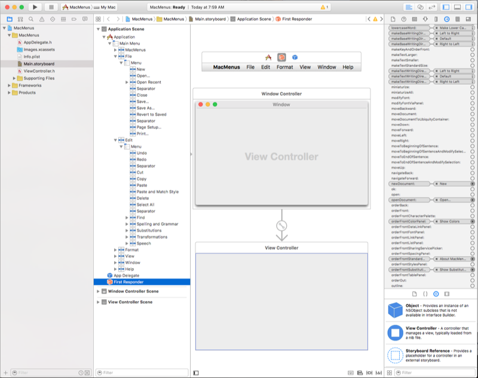](menu-images/defaultbar04-large.png#lightbox) 

Why is this important? In the next section will see how these automatically-defined actions work with other Cocoa user interface elements to automatically enable and disable menu items, as well as, provide built-in functionality for the items.

Later we'll be using these built-in actions to enable and disable items from code and provide our own functionality when they are selected.

<a name="Built-In_Menu_Functionality"></a>

### Built-in menu functionality

If you were the run a newly created Xamarin.Mac application before adding any UI items or code, you'll notice that some items are automatically wired-up and enabled for you (with fully functionality automatically built-in), such as the **Quit** item in the **App** menu:

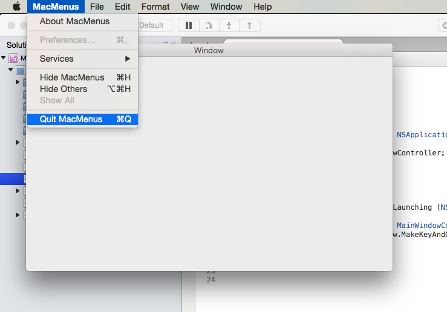

While other menu items, such as **Cut**, **Copy**, and **Paste** are not:

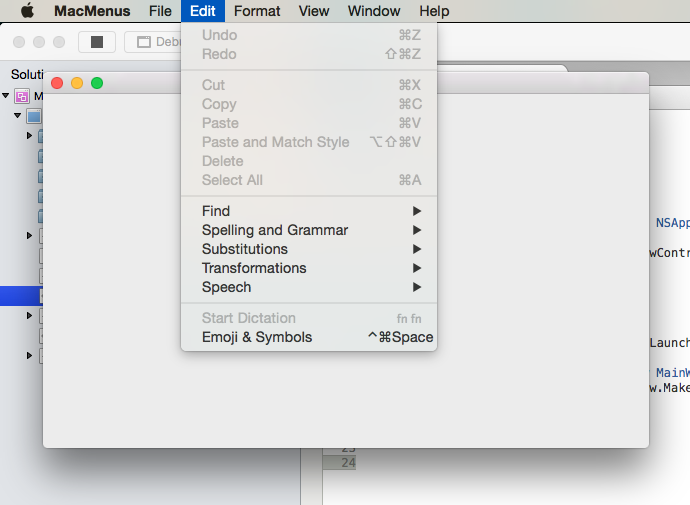

Let's stop the application and double-click the **Main.storyboard** file in the **Solution Pad** to open it for editing in Xcode's Interface Builder. Next, drag a **Text View** from the **Library** onto the window's view controller in the **Interface Editor**:

[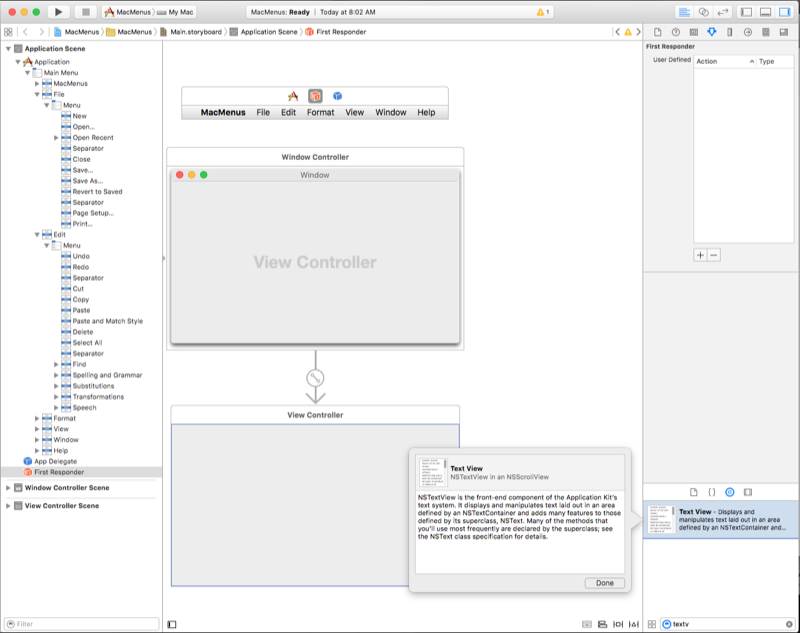](menu-images/appmenu05-large.png#lightbox)

In the **Constraint Editor** let's pin the text view to the window's edges and set it where it grows and shrinks with the window by clicking all four red I-beams at the top of the editor and clicking the **Add 4 Constraints** button:

[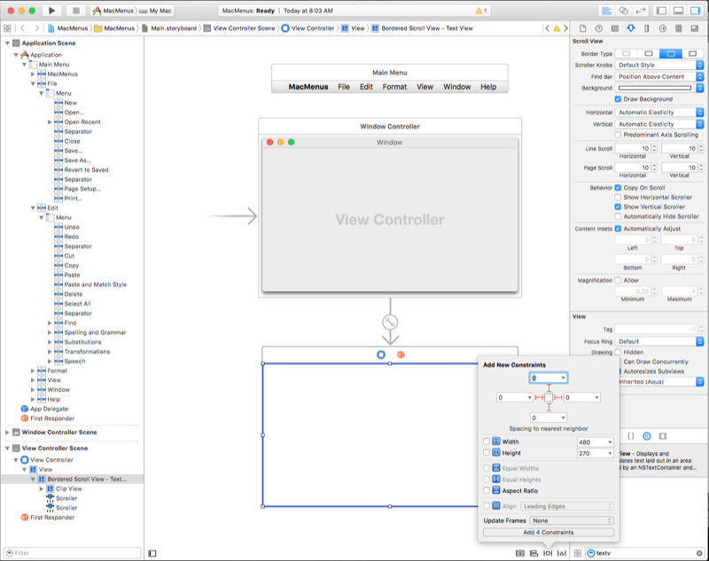](menu-images/appmenu06-large.png#lightbox)

Save your changes to the user interface design and switch back the Visual Studio for Mac to synchronize the changes with your Xamarin.Mac project. Now start the application, type some text into the text view, select it, and open the **Edit** menu:

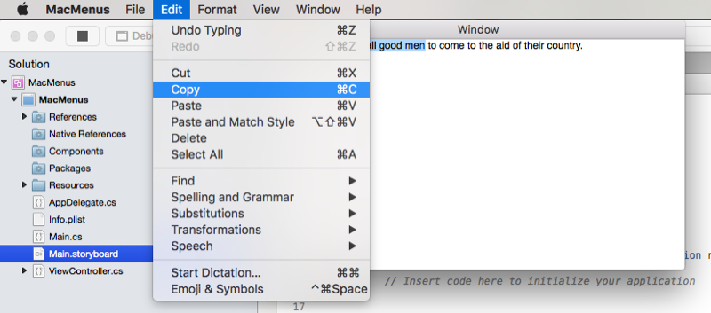

Notice how the **Cut**, **Copy**, and **Paste** items are automatically enabled and fully functional, all without writing a single line of code. 

What's going on here? Remember the built-in predefine actions that come wired up to the default menu items (as presented above), most of the Cocoa user interface elements that are part of macOS have built in hooks to specific actions (such as `copy:`). So when they are added to a window, active, and selected, the corresponding menu item or items attached to that action are automatically enabled. If the user selects that menu item, the functionality built into the UI element is called and executed, all without developer intervention.

### Enabling and disabling menus and items

By default, every time a user event occurs, `NSMenu` automatically enables and disables each visible menu and menu item based on the context of the application. There are three ways to enable/disable an item:

- **Automatic menu enabling** - A menu item is enabled if `NSMenu` can find an appropriate object that responds to the action that the item is wired-up to. For example, the text view above that had a built-in hook to the `copy:` action.
- **Custom actions and validateMenuItem:** - For any menu item that is bound to a [window or view controller custom action](#Working-with-Custom-Window-Actions), you can add the `validateMenuItem:` action and manually enable or disable menu items.
- **Manual menu enabling** - You manually set the `Enabled` property of each `NSMenuItem` to enable or disable each item in a menu individually.

To choose a system, set the `AutoEnablesItems` property of a `NSMenu`. `true` is automatic (the default behavior) and `false` is manual. 

> [!IMPORTANT]
> If you choose to use manual menu enabling, none of the menu items, even those controlled by AppKit classes like `NSTextView`, are updated automatically. You will be responsible for enabling and disabling all items by hand in code.

#### Using validateMenuItem

As stated above, for any menu item that is bound to a [Window or View Controller Custom Action](#Working-with-Custom-Window-Actions), you can add the `validateMenuItem:` action and manually enable or disable menu items.

In the following example, the `Tag` property will be used to decide the type of menu item that will be enabled/disabled by the `validateMenuItem:` action based on the state of selected text in a `NSTextView`. The `Tag` property has been set in Interface Builder for each menu item:

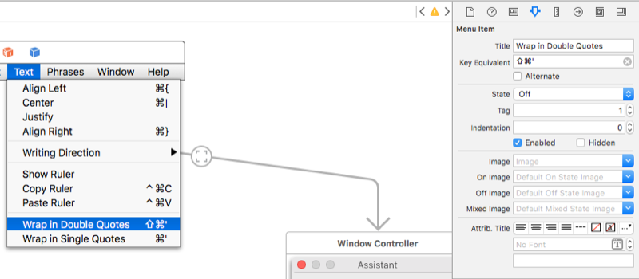

And the following code added to the View Controller:

```csharp
[Action("validateMenuItem:")]
public bool ValidateMenuItem (NSMenuItem item) {

    // Take action based on the menu item type
    // (As specified in its Tag)
    switch (item.Tag) {
    case 1:
        // Wrap menu items should only be available if
        // a range of text is selected
        return (TextEditor.SelectedRange.Length > 0);
    case 2:
        // Quote menu items should only be available if
        // a range is NOT selected.
        return (TextEditor.SelectedRange.Length == 0);
    }

    return true;
}
```

When this code is run, and no text is selected in the `NSTextView`, the two wrap menu items are disabled (even though they are wired to actions on the view controller):

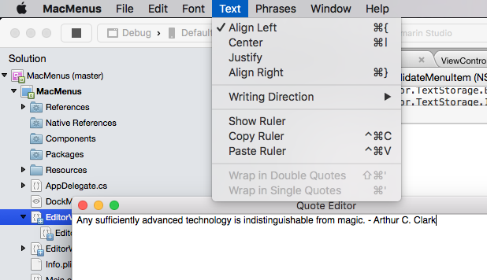

If a section of text is selected and the menu reopened, the two wrap menu items will be available:

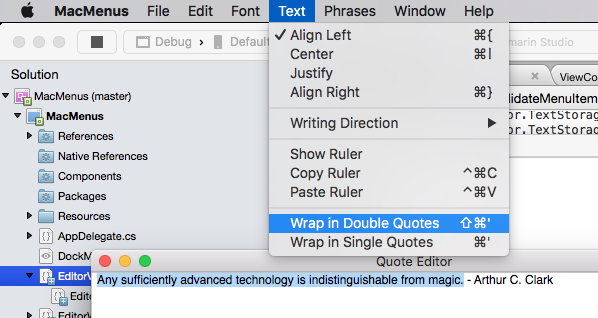

## Enabling and responding to menu items in code

As we have seen above, just by adding specific Cocoa user interface elements to our UI design (such as a text field), several of the default menu items will be enabled and function automatically, without having to write any code. Next let's look at adding our own C# code to our Xamarin.Mac project to enable a menu item and provide functionality when the user selects it.

For example, let say we want the user to be able to use the **Open** item in the **File** menu to select a folder. Since we want this to be an application-wide function and not limited to a give window or UI element, we're going to add the code to handle this to our application delegate.

In the **Solution Pad**, double-click the `AppDelegate.CS` file to open it for editing:

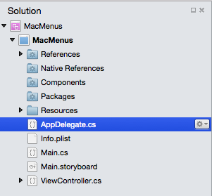

Add the following code below the `DidFinishLaunching` method:

```csharp
[Export ("openDocument:")]
void OpenDialog (NSObject sender)
{
    var dlg = NSOpenPanel.OpenPanel;
    dlg.CanChooseFiles = false;
    dlg.CanChooseDirectories = true;

    if (dlg.RunModal () == 1) {
        var alert = new NSAlert () {
            AlertStyle = NSAlertStyle.Informational,
            InformativeText = "At this point we should do something with the folder that the user just selected in the Open File Dialog box...",
            MessageText = "Folder Selected"
        };
        alert.RunModal ();
    }
}
```

Let's run the application now and open the **File** menu: 

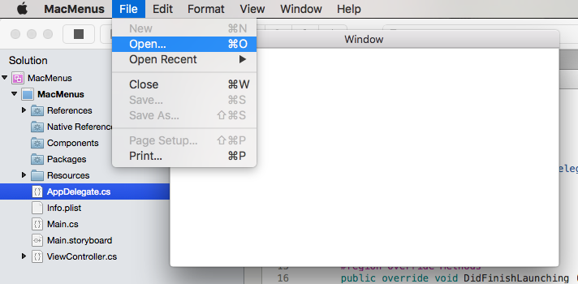

Notice that the **Open** menu item is now enabled. If we select it, the open dialog will be displayed:

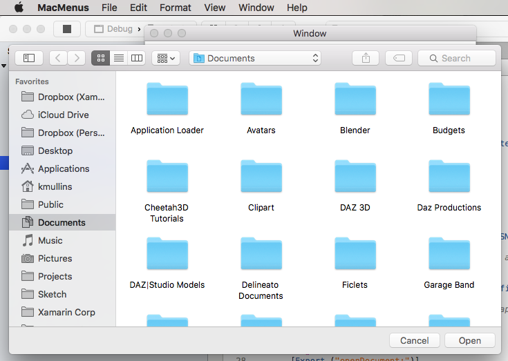

If we click the **Open** button, our alert message will be displayed:

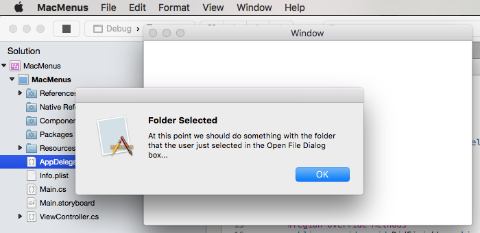

The key line here was `[Export ("openDocument:")]`, it tells `NSMenu` that our **AppDelegate** has a method `void OpenDialog (NSObject sender)` that responds to the `openDocument:` action. If you'll remember from above, the **Open** menu item is automatically wired-up to this action by default in Interface Builder:

[](menu-images/defaultbar03-large.png#lightbox)

Next let's look at creating our own menu, menu items, and actions and responding to them in code.

### Working with the open recent menu

By default, the **File** menu contains an **Open Recent** item that keeps track of the last several files that the user has opened with your app. If you are creating a `NSDocument` based Xamarin.Mac app, this menu will be handled for you automatically. For any other type of Xamarin.Mac app, you will be responsible for managing and responding to this menu item manually.

To manually handle the **Open Recent** menu, you will first need to inform it that a new file has been opened or saved using the following:

```csharp
// Add document to the Open Recent menu
NSDocumentController.SharedDocumentController.NoteNewRecentDocumentURL(url);
```

Even though your app is not using `NSDocuments`, you still use the `NSDocumentController` to maintain the **Open Recent** menu by sending a `NSUrl` with the location of the file to the `NoteNewRecentDocumentURL` method of the `SharedDocumentController`.

Next, you need to override the `OpenFile` method of the app delegate to open any file that the user selects from the **Open Recent** menu. For example:

```csharp
public override bool OpenFile (NSApplication sender, string filename)
{
    // Trap all errors
    try {
        filename = filename.Replace (" ", "%20");
        var url = new NSUrl ("file://"+filename);
        return OpenFile(url);
    } catch {
        return false;
    }
}
```

Return `true` if the file can be opened, else return `false` and a built-in warning will be displayed to the user that the file could not be opened.

Because the filename and path returned from the **Open Recent** menu, might include a space, we need to properly escape this character before creating a `NSUrl` or we will get an error. We do that with the following code:

```csharp
filename = filename.Replace (" ", "%20");
```

Finally, we create a `NSUrl` that points to the file and use a helper method in the app delegate to open a new window and load the file into it:

```csharp
var url = new NSUrl ("file://"+filename);
return OpenFile(url);
```

To pull everything together, let's take a look at an example implementation in an **AppDelegate.cs** file:

```csharp
using AppKit;
using Foundation;
using System.IO;
using System;

namespace MacHyperlink
{
    [Register ("AppDelegate")]
    public class AppDelegate : NSApplicationDelegate
    {
        #region Computed Properties
        public int NewWindowNumber { get; set;} = -1;
        #endregion

        #region Constructors
        public AppDelegate ()
        {
        }
        #endregion

        #region Override Methods
        public override void DidFinishLaunching (NSNotification notification)
        {
            // Insert code here to initialize your application
        }

        public override void WillTerminate (NSNotification notification)
        {
            // Insert code here to tear down your application
        }

        public override bool OpenFile (NSApplication sender, string filename)
        {
            // Trap all errors
            try {
                filename = filename.Replace (" ", "%20");
                var url = new NSUrl ("file://"+filename);
                return OpenFile(url);
            } catch {
                return false;
            }
        }
        #endregion

        #region Private Methods
        private bool OpenFile(NSUrl url) {
            var good = false;

            // Trap all errors
            try {
                var path = url.Path;

                // Is the file already open?
                for(int n=0; n<NSApplication.SharedApplication.Windows.Length; ++n) {
                    var content = NSApplication.SharedApplication.Windows[n].ContentViewController as ViewController;
                    if (content != null && path == content.FilePath) {
                        // Bring window to front
                        NSApplication.SharedApplication.Windows[n].MakeKeyAndOrderFront(this);
                        return true;
                    }
                }

                // Get new window
                var storyboard = NSStoryboard.FromName ("Main", null);
                var controller = storyboard.InstantiateControllerWithIdentifier ("MainWindow") as NSWindowController;

                // Display
                controller.ShowWindow(this);

                // Load the text into the window
                var viewController = controller.Window.ContentViewController as ViewController;
                viewController.Text = File.ReadAllText(path);
                viewController.SetLanguageFromPath(path);
                viewController.View.Window.SetTitleWithRepresentedFilename (Path.GetFileName(path));
                viewController.View.Window.RepresentedUrl = url;

                // Add document to the Open Recent menu
                NSDocumentController.SharedDocumentController.NoteNewRecentDocumentURL(url);

                // Make as successful
                good = true;
            } catch {
                // Mark as bad file on error
                good = false;
            }

            // Return results
            return good;
        }
        #endregion

        #region actions
        [Export ("openDocument:")]
        void OpenDialog (NSObject sender)
        {
            var dlg = NSOpenPanel.OpenPanel;
            dlg.CanChooseFiles = true;
            dlg.CanChooseDirectories = false;

            if (dlg.RunModal () == 1) {
                // Nab the first file
                var url = dlg.Urls [0];

                if (url != null) {
                    // Open the document in a new window
                    OpenFile (url);
                }
            }
        }
        #endregion
    }
}
```

Based on the requirements of your app, you might not want the user to open the same file in more than one window at the same time. In our example app, if the user chooses a file that is already open (either from the **Open Recent** or **Open..** menu items), the window that contains the file is brought to the front.

To accomplish this, we used the following code in our helper method:

```csharp
var path = url.Path;

// Is the file already open?
for(int n=0; n<NSApplication.SharedApplication.Windows.Length; ++n) {
    var content = NSApplication.SharedApplication.Windows[n].ContentViewController as ViewController;
    if (content != null && path == content.FilePath) {
        // Bring window to front
        NSApplication.SharedApplication.Windows[n].MakeKeyAndOrderFront(this);
        return true;
    }
}
```

We designed our `ViewController` class to hold the path to the file in its `Path` property. Next, we loop through all currently open windows in the app. If the file is already open in one of the windows, it is brought to the front of all other windows using:

```csharp
NSApplication.SharedApplication.Windows[n].MakeKeyAndOrderFront(this);
```

If no match is found, a new window is opened with the file loaded and the file is noted in the **Open Recent** menu:

```csharp
// Get new window
var storyboard = NSStoryboard.FromName ("Main", null);
var controller = storyboard.InstantiateControllerWithIdentifier ("MainWindow") as NSWindowController;

// Display
controller.ShowWindow(this);

// Load the text into the window
var viewController = controller.Window.ContentViewController as ViewController;
viewController.Text = File.ReadAllText(path);
viewController.SetLanguageFromPath(path);
viewController.View.Window.SetTitleWithRepresentedFilename (Path.GetFileName(path));
viewController.View.Window.RepresentedUrl = url;

// Add document to the Open Recent menu
NSDocumentController.SharedDocumentController.NoteNewRecentDocumentURL(url);
```

<a name="Working-with-Custom-Window-Actions"></a>

### Working with custom window actions

Just like the built-in **First Responder** actions that come pre-wired to standard menu items, you can create new, custom actions and wire them to menu items in Interface Builder.

First, define a custom action on one of your app's window controllers. For example:

```csharp
[Action("defineKeyword:")]
public void defineKeyword (NSObject sender) {
    // Preform some action when the menu is selected
    Console.WriteLine ("Request to define keyword");
}
```

Next, double-click the app's storyboard file in the **Solution Pad** to open it for editing in Xcode's Interface Builder. Select the **First Responder** under the **Application Scene**, then switch to the **Attributes Inspector**:

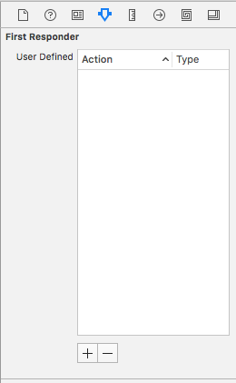

Click the **+** button at the bottom of the **Attributes Inspector** to add a new custom action:

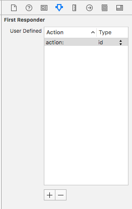

Give it the same name as the custom action that you created on your window controller:

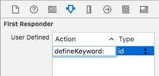

Control-click and drag from a menu item to the **First Responder** under the **Application Scene**. From the popup list, select the new action you just created (`defineKeyword:` in this example):

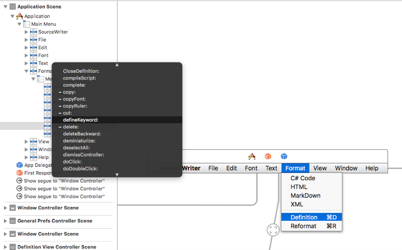

Save the changes to the storyboard and return to Visual Studio for Mac to sync the changes. If you run the app, the menu item that you connected the custom action to will automatically be enabled/disabled (based on the window with the action being open) and selecting the menu item will fire off the action:

[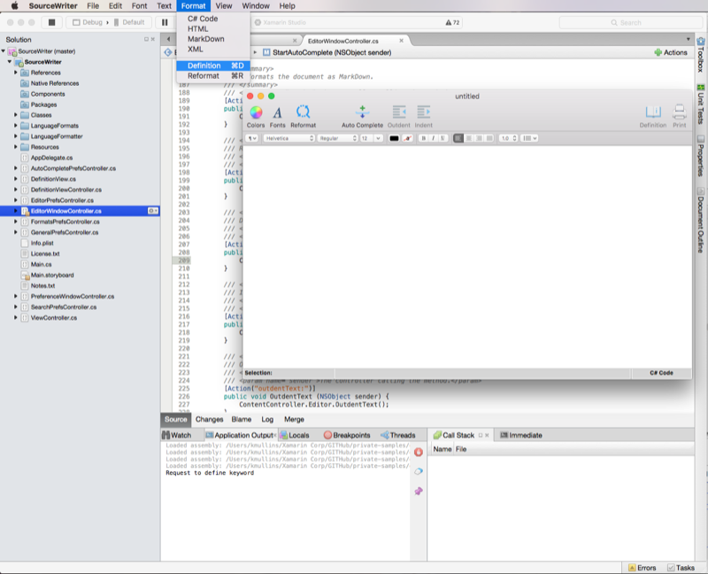](menu-images/action05-large.png#lightbox)

<a name="Adding,_Editing_and_Deleting_Menus"></a>

### Adding, editing, and deleting menus

As we have seen in the previous sections, a Xamarin.Mac application comes with a preset number of default menus and menu items that specific UI controls will automatically activate and respond to. We have also seen how to add code to our application that will also enable and respond to these default items.

In this section we will look at removing menu items that we don't need, reorganizing menus and adding new menus, menu items and actions.

Double-click the **Main.storyboard** file in the **Solution Pad** to open it for editing:

[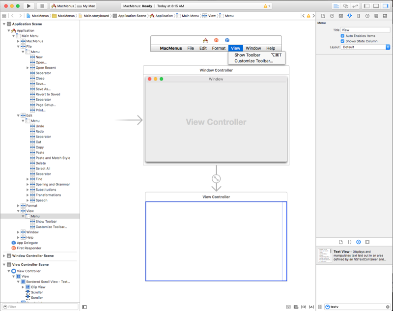](menu-images/maint01-large.png#lightbox)

For our specific Xamarin.Mac application we are not going to be using the default **View** menu so we are going to remove it. In the **Interface Hierarchy** select the **View** menu item that is a part of the main menu bar:

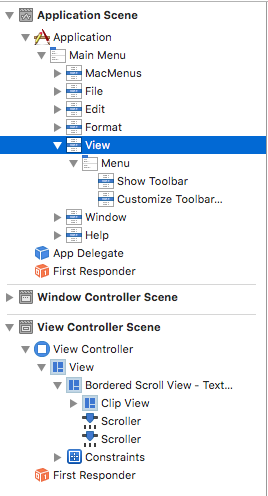

Press delete or backspace to delete the menu. Next, we aren't going to be using all of the items in the **Format** menu and we want to move the items we are going to use out from under the sub menus. In the **Interface Hierarchy** select the following menu items:

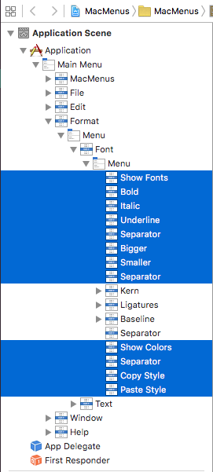

Drag the items under the parent **Menu** from the sub-menu where they currently are:

[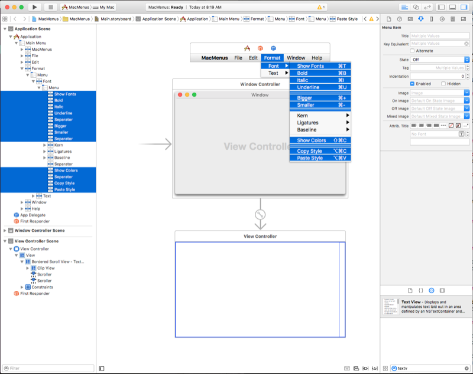](menu-images/maint04-large.png#lightbox)

Your menu should now look like:

[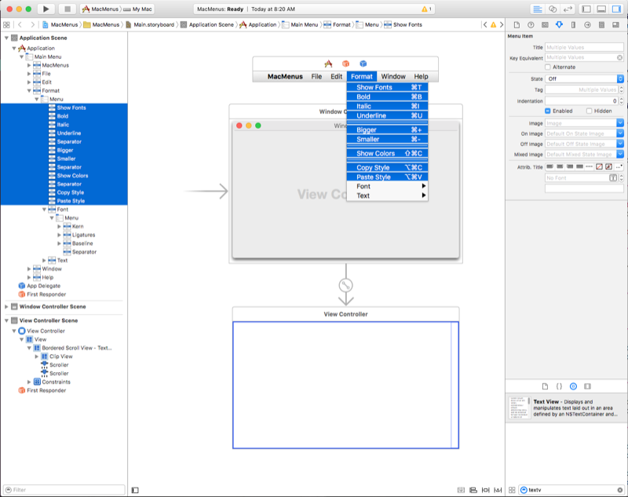](menu-images/maint05-large.png#lightbox)

Next let's drag the **Text** sub-menu out from under the **Format** menu and place it on the main menu bar between the **Format** and **Window** menus:

[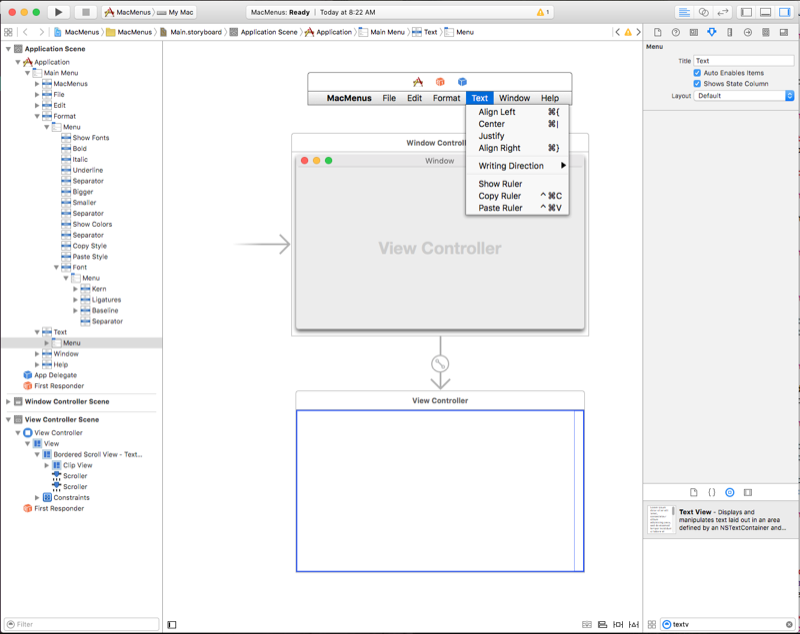](menu-images/maint06-large.png#lightbox)

Let's go back under the **Format** menu and delete the **Font** sub-menu item. Next, select the **Format** menu and rename it "Font":

[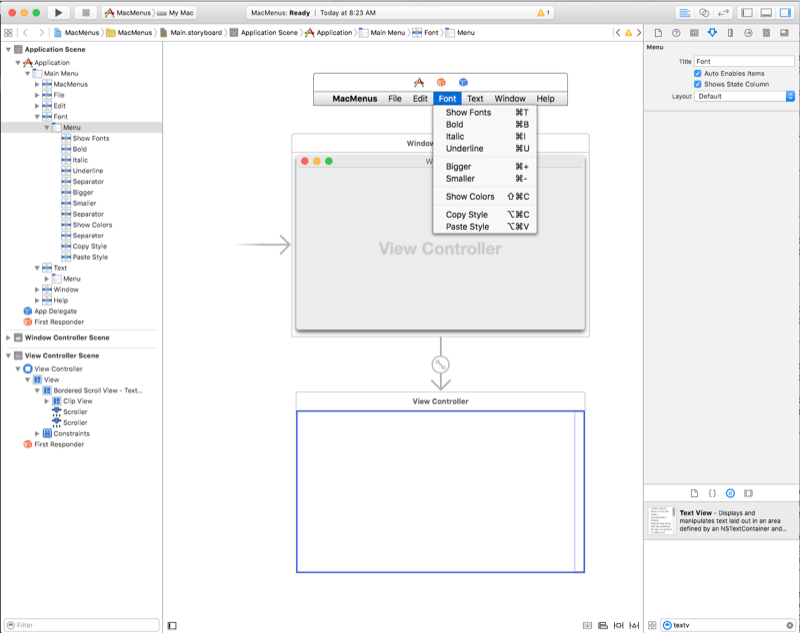](menu-images/maint07-large.png#lightbox)

Next, let's create a custom menu of predefine phrases that will automatically get appended to the text in the text view when they are selected. In the search box at the bottom on the **Library Inspector** type in "menu." This will make it easier to find and work with all of the menu UI elements:

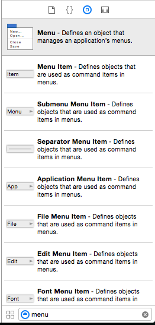

Now let's do the following to create our menu:

1. Drag a **Menu Item** from the **Library Inspector** onto the menu bar between the **Text** and **Window** menus: 

    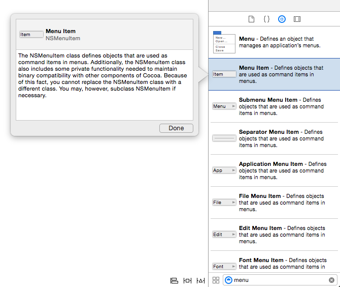
2. Rename the item "Phrases": 

    [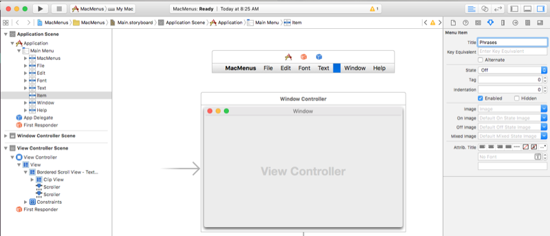](menu-images/maint09-large.png#lightbox)
3. Next drag a **Menu** from the **Library Inspector**: 

    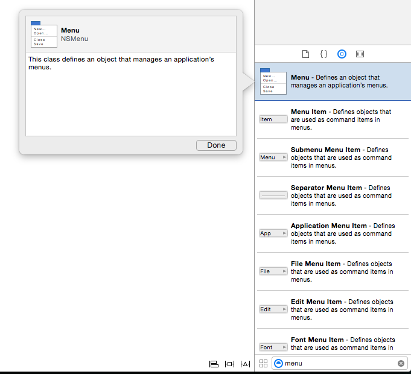
4. Drop then **Menu** on the new **Menu Item** we just created and change its name to "Phrases": 

    [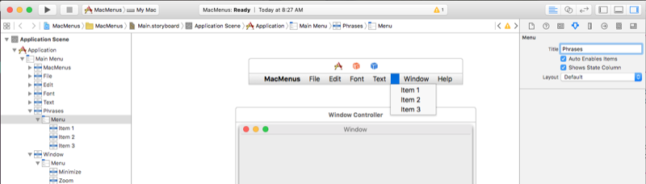](menu-images/maint12-large.png#lightbox)
5. Now let's rename the three default **Menu Items** "Address", "Date," and "Greeting": 

    [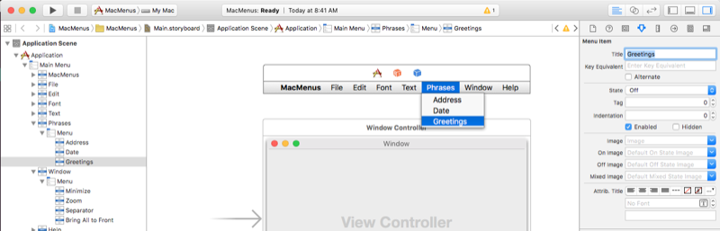](menu-images/maint13-large.png#lightbox)
6. Let's add a fourth **Menu Item** by dragging a **Menu Item** from the **Library Inspector** and calling it "Signature": 

    [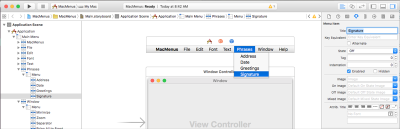](menu-images/maint14-large.png#lightbox)
7. Save the changes to the menu bar.

Now let's create a set of custom actions so that our new menu items are exposed to C# code. In Xcode let's switch to the **Assistant** view:

[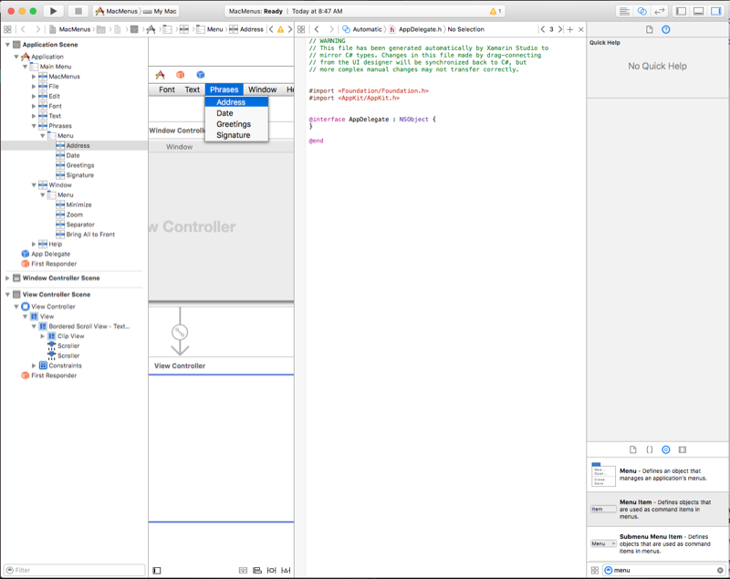](menu-images/maint15-large.png#lightbox)

Let's do the following:

1. Control-drag from the **Address** menu item to the **AppDelegate.h** file.
2. Switch the **Connection** type to **Action**: 

    [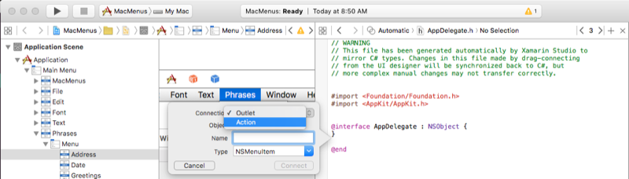](menu-images/maint17-large.png#lightbox)
3. Enter a **Name** of "phraseAddress" and press the **Connect** button to create the new action: 

    [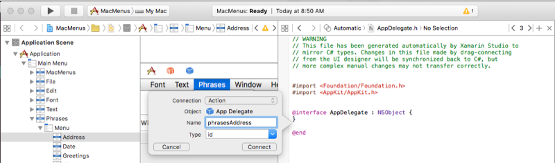](menu-images/maint18-large.png#lightbox)
4. Repeat the above steps for the **Date**, **Greeting**, and **Signature** menu items: 

    [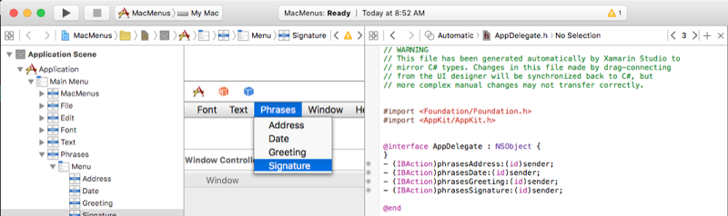](menu-images/maint19-large.png#lightbox)
5. Save the changes to the menu bar.

Next we need to create an outlet for our text view so that we can adjust its content from code. Select the **ViewController.h** file in the **Assistant Editor** and create a new outlet called `documentText`:

[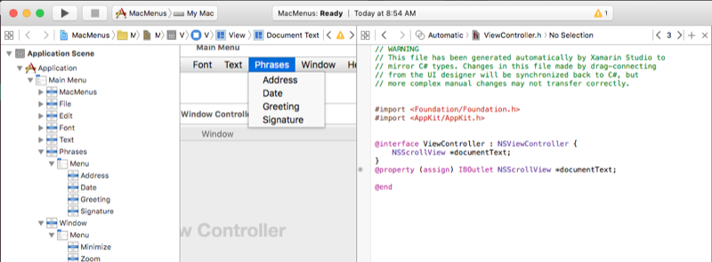](menu-images/maint20-large.png#lightbox)

Return to Visual Studio for Mac to sync the changes from Xcode. Next edit the **ViewController.cs** file and make it look like the following:

```csharp
using System;

using AppKit;
using Foundation;

namespace MacMenus
{
    public partial class ViewController : NSViewController
    {
        #region Application Access
        public static AppDelegate App {
            get { return (AppDelegate)NSApplication.SharedApplication.Delegate; }
        }
        #endregion

        #region Computed Properties
        public override NSObject RepresentedObject {
            get {
                return base.RepresentedObject;
            }
            set {
                base.RepresentedObject = value;
                // Update the view, if already loaded.
            }
        }

        public string Text {
            get { return documentText.Value; }
            set { documentText.Value = value; }
        } 
        #endregion

        #region Constructors
        public ViewController (IntPtr handle) : base (handle)
        {
        }
        #endregion

        #region Override Methods
        public override void ViewDidLoad ()
        {
            base.ViewDidLoad ();

            // Do any additional setup after loading the view.
        }

        public override void ViewWillAppear ()
        {
            base.ViewWillAppear ();

            App.textEditor = this;
        }

        public override void ViewWillDisappear ()
        {
            base.ViewDidDisappear ();

            App.textEditor = null;
        }
        #endregion
    }
}
```

This exposes the text of our text view outside of the `ViewController` class and informs the app delegate when the window gains or loses focus. Now edit the **AppDelegate.cs** file and make it look like the following:

```csharp
using AppKit;
using Foundation;
using System;

namespace MacMenus
{
    [Register ("AppDelegate")]
    public partial class AppDelegate : NSApplicationDelegate
    {
        #region Computed Properties
        public ViewController textEditor { get; set;} = null;
        #endregion

        #region Constructors
        public AppDelegate ()
        {
        }
        #endregion

        #region Override Methods
        public override void DidFinishLaunching (NSNotification notification)
        {
            // Insert code here to initialize your application
        }

        public override void WillTerminate (NSNotification notification)
        {
            // Insert code here to tear down your application
        }
        #endregion

        #region Custom actions
        [Export ("openDocument:")]
        void OpenDialog (NSObject sender)
        {
            var dlg = NSOpenPanel.OpenPanel;
            dlg.CanChooseFiles = false;
            dlg.CanChooseDirectories = true;

            if (dlg.RunModal () == 1) {
                var alert = new NSAlert () {
                    AlertStyle = NSAlertStyle.Informational,
                    InformativeText = "At this point we should do something with the folder that the user just selected in the Open File Dialog box...",
                    MessageText = "Folder Selected"
                };
                alert.RunModal ();
            }
        }

        partial void phrasesAddress (Foundation.NSObject sender) {

            textEditor.Text += "Xamarin HQ\n394 Pacific Ave, 4th Floor\nSan Francisco CA 94111\n\n";
        }

        partial void phrasesDate (Foundation.NSObject sender) {

            textEditor.Text += DateTime.Now.ToString("D");
        }

        partial void phrasesGreeting (Foundation.NSObject sender) {

            textEditor.Text += "Dear Sirs,\n\n";
        }

        partial void phrasesSignature (Foundation.NSObject sender) {

            textEditor.Text += "Sincerely,\n\nKevin Mullins\nXamarin,Inc.\n";
        }
        #endregion
    }
}
```

Here we've made the `AppDelegate` a partial class so that we can use the actions and outlets that we defined in Interface Builder. We also expose a `textEditor` to track which window is currently in focus.

The following methods are used to handle our custom menu and menu items:

```csharp
partial void phrasesAddress (Foundation.NSObject sender) {

    if (textEditor == null) return;
    textEditor.Text += "Xamarin HQ\n394 Pacific Ave, 4th Floor\nSan Francisco CA 94111\n\n";
}

partial void phrasesDate (Foundation.NSObject sender) {

    if (textEditor == null) return;
    textEditor.Text += DateTime.Now.ToString("D");
}

partial void phrasesGreeting (Foundation.NSObject sender) {

    if (textEditor == null) return;
    textEditor.Text += "Dear Sirs,\n\n";
}

partial void phrasesSignature (Foundation.NSObject sender) {

    if (textEditor == null) return;
    textEditor.Text += "Sincerely,\n\nKevin Mullins\nXamarin,Inc.\n";
}
```

Now if we run our application, all of the items in the **Phrase** menu will be active and will add the give phrase to the text view when selected:

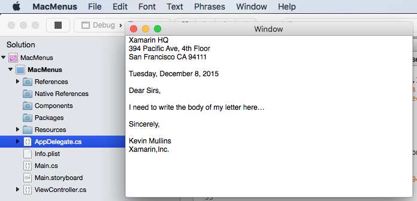

Now that we have the basics of working with the application menu bar down, let's look at creating a custom contextual menu.

### Creating menus from code

In addition to creating menus and menu items with Xcode's Interface Builder, there might be times when a Xamarin.Mac app needs to create, modify, or remove a menu, sub-menu, or menu item from code.

In the following example, a class is created to hold the information about the menu items and sub-menus that will be dynamically created on-the-fly:

```csharp
using System;
using System.Collections.Generic;
using Foundation;
using AppKit;

namespace AppKit.TextKit.Formatter
{
    public class LanguageFormatCommand : NSObject
    {
        #region Computed Properties
        public string Title { get; set; } = "";
        public string Prefix { get; set; } = "";
        public string Postfix { get; set; } = "";
        public List<LanguageFormatCommand> SubCommands { get; set; } = new List<LanguageFormatCommand>();
        #endregion

        #region Constructors
        public LanguageFormatCommand () {

        }

        public LanguageFormatCommand (string title)
        {
            // Initialize
            this.Title = title;
        }

        public LanguageFormatCommand (string title, string prefix)
        {
            // Initialize
            this.Title = title;
            this.Prefix = prefix;
        }

        public LanguageFormatCommand (string title, string prefix, string postfix)
        {
            // Initialize
            this.Title = title;
            this.Prefix = prefix;
            this.Postfix = postfix;
        }
        #endregion
    }
}
```

#### Adding menus and items

With this class defined, the following routine will parse a collection of `LanguageFormatCommand`objects and recursively build new menus and menu items by appending them to the bottom of the existing menu (created in Interface Builder) that has been passed in:

```csharp
private void AssembleMenu(NSMenu menu, List<LanguageFormatCommand> commands) {
    NSMenuItem menuItem;

    // Add any formatting commands to the Formatting menu
    foreach (LanguageFormatCommand command in commands) {
        // Add separator or item?
        if (command.Title == "") {
            menuItem = NSMenuItem.SeparatorItem;
        } else {
            menuItem = new NSMenuItem (command.Title);

            // Submenu?
            if (command.SubCommands.Count > 0) {
                // Yes, populate submenu
                menuItem.Submenu = new NSMenu (command.Title);
                AssembleMenu (menuItem.Submenu, command.SubCommands);
            } else {
                // No, add normal menu item
                menuItem.Activated += (sender, e) => {
                    // Apply the command on the selected text
                    TextEditor.PerformFormattingCommand (command);
                };
            }
        }
        menu.AddItem (menuItem);
    }
}
``` 

For any `LanguageFormatCommand` object that has a blank `Title` property, this routine creates a **Separator menu item** (a thin gray line) between menu sections:

```csharp
menuItem = NSMenuItem.SeparatorItem;
```

If a title is provided, a new menu item with that title is created:

```csharp
menuItem = new NSMenuItem (command.Title);
``` 

If the `LanguageFormatCommand` object contains child `LanguageFormatCommand` objects, a sub-menu is created and the `AssembleMenu` method is recursively called to build out that menu:

```csharp
menuItem.Submenu = new NSMenu (command.Title);
AssembleMenu (menuItem.Submenu, command.SubCommands);
```

For any new menu item that does not have sub-menus, code is added to handle the menu item being selected by the user:

```csharp
menuItem.Activated += (sender, e) => {
    // Do something when the menu item is selected
    ...
};
```

#### Testing the menu creation

With all of the above code in place, if the following collection of `LanguageFormatCommand` objects were created:

```csharp
// Define formatting commands
FormattingCommands.Add(new LanguageFormatCommand("Strong","**","**"));
FormattingCommands.Add(new LanguageFormatCommand("Emphasize","_","_"));
FormattingCommands.Add(new LanguageFormatCommand("Inline Code","`","`"));
FormattingCommands.Add(new LanguageFormatCommand("Code Block","```\n","\n```"));
FormattingCommands.Add(new LanguageFormatCommand("Comment","<!--","-->"));
FormattingCommands.Add (new LanguageFormatCommand ());
FormattingCommands.Add(new LanguageFormatCommand("Unordered List","* "));
FormattingCommands.Add(new LanguageFormatCommand("Ordered List","1. "));
FormattingCommands.Add(new LanguageFormatCommand("Block Quote","> "));
FormattingCommands.Add (new LanguageFormatCommand ());

var Headings = new LanguageFormatCommand ("Headings");
Headings.SubCommands.Add(new LanguageFormatCommand("Heading 1","# "));
Headings.SubCommands.Add(new LanguageFormatCommand("Heading 2","## "));
Headings.SubCommands.Add(new LanguageFormatCommand("Heading 3","### "));
Headings.SubCommands.Add(new LanguageFormatCommand("Heading 4","#### "));
Headings.SubCommands.Add(new LanguageFormatCommand("Heading 5","##### "));
Headings.SubCommands.Add(new LanguageFormatCommand("Heading 6","###### "));
FormattingCommands.Add (Headings);

FormattingCommands.Add(new LanguageFormatCommand ());
FormattingCommands.Add(new LanguageFormatCommand("Link","[","]()"));
FormattingCommands.Add(new LanguageFormatCommand("Image",""));
FormattingCommands.Add(new LanguageFormatCommand("Image Link","[](LinkImageHere)"));
```

And that collection passed to the `AssembleMenu` function (with the **Format** Menu set as the base), the following dynamic menus and menu items would be created:

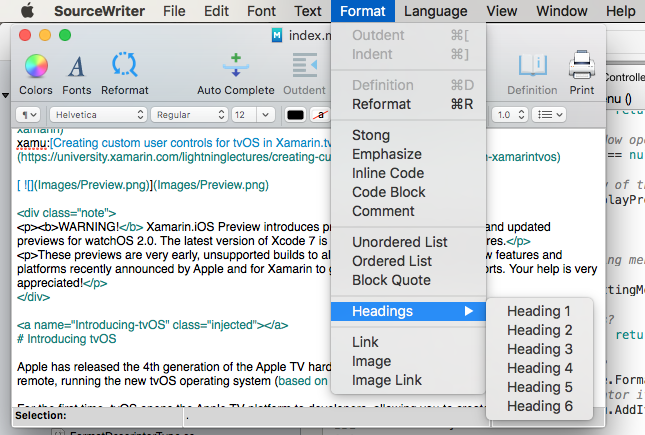

#### Removing menus and items

If you need to remove any menu or menu item from the app's user interface, you can use the `RemoveItemAt` method of the `NSMenu` class simply by giving it the zero based index of the item to remove.

For example, to remove the menus and menu items created by the routine above, you could use the following code:

```csharp
public void UnpopulateFormattingMenu(NSMenu menu) {

    // Remove any additional items
    for (int n = (int)menu.Count - 1; n > 4; --n) {
        menu.RemoveItemAt (n);
    }
}
```

In the case of the code above, the first four menu items are created in Xcode's Interface Builder and aways available in the app, so they are not removed dynamically.

<a name="Contextual_Menus"></a>

## Contextual menus

Contextual menus appear when the user right-clicks or control-clicks an item in a window. By default, several of the UI elements built into macOS already have contextual menus attached to them (such as the text view). However, there might be times when we want to create our own custom contextual menus for a UI element that we have added to a window.

Let's edit our **Main.storyboard** file in Xcode and add a **Window** window to our design, set its **Class** to "NSPanel" in the **Identity Inspector**, add a new **Assistant** item to the **Window** menu, and attach it to the new window using a **Show Segue**:

[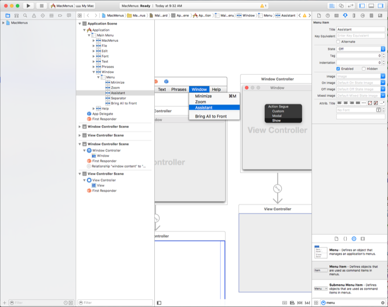](menu-images/context01-large.png#lightbox)

Let's do the following:

1. Drag a **Label** from the **Library Inspector** onto the **Panel** window and set its text to "Property": 

    [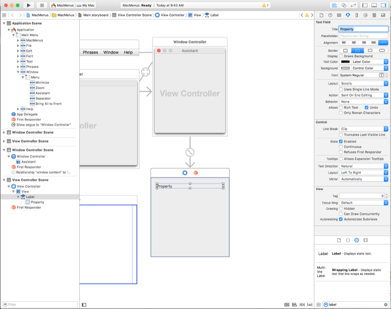](menu-images/context03-large.png#lightbox)
2. Next drag a **Menu** from the **Library Inspector** onto the View Controller in the View Hierarchy and rename the three default menu items **Document**, **Text** and **Font**:

    [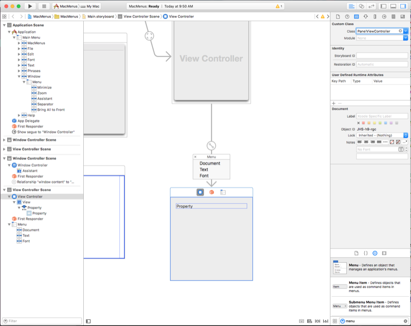](menu-images/context02-large.png#lightbox)
3. Now control-drag from the **Property Label** onto the **Menu**:

    [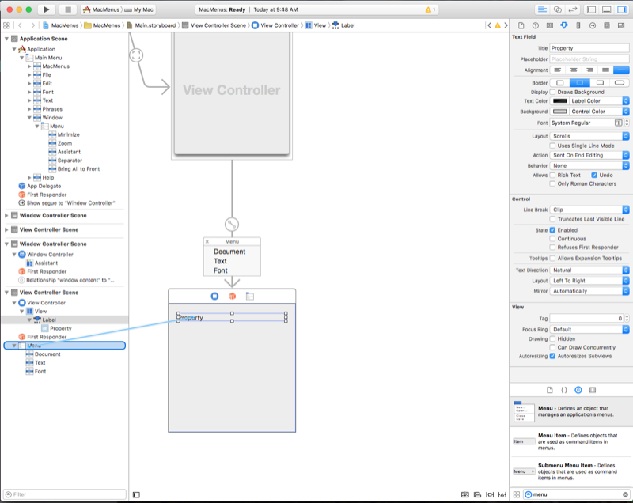](menu-images/context04-large.png#lightbox)
4. From the popup dialog, select **Menu**: 

    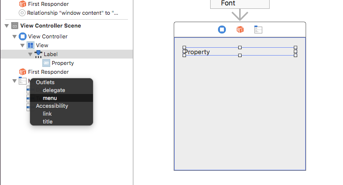
5. From the **Identity Inspector**, set the View Controller's class to "PanelViewController": 

    [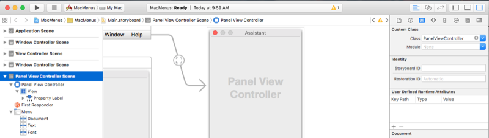](menu-images/context10-large.png#lightbox)
6. Switch back to Visual Studio for Mac to sync, then return to Interface Builder.
7. Switch to the **Assistant Editor** and select the **PanelViewController.h** file.
8. Create an action for the **Document** menu item called `propertyDocument`: 

    [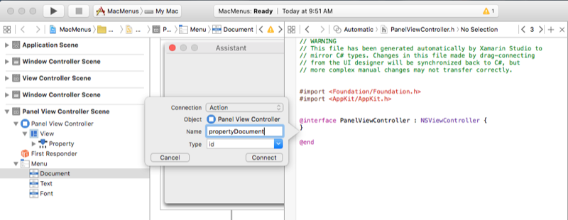](menu-images/context06-large.png#lightbox)
9. Repeat creating actions for the remaining menu items: 

    [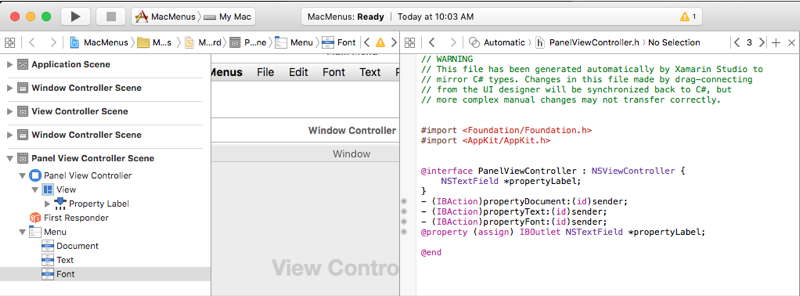](menu-images/context07-large.png#lightbox)
10. Finally create an outlet for the **Property Label** called `propertyLabel`: 

    [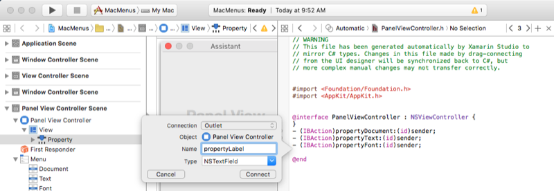](menu-images/context08-large.png#lightbox)
11. Save your changes and return to Visual Studio for Mac to sync with Xcode.

Edit the **PanelViewController.cs** file and add the following code:

```csharp
partial void propertyDocument (Foundation.NSObject sender) {
    propertyLabel.StringValue = "Document";
}

partial void propertyFont (Foundation.NSObject sender) {
    propertyLabel.StringValue = "Font";
}

partial void propertyText (Foundation.NSObject sender) {
    propertyLabel.StringValue = "Text";
}
```

Now if we run the application and right-click on the property label in the panel, we'll see our custom contextual menu. If we select and item from the menu, the label's value will change:

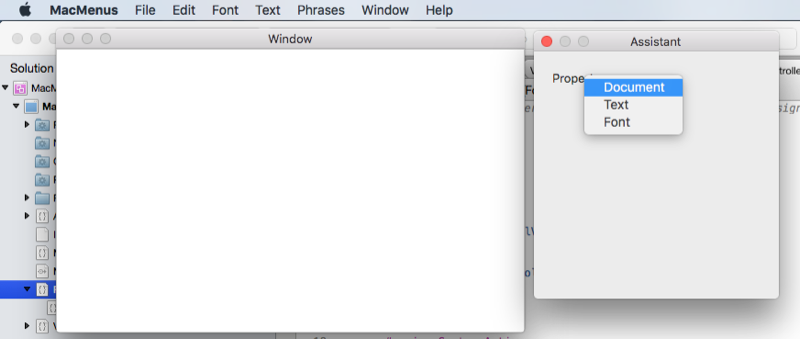

Next let's look at creating status bar menus.

## Status bar menus

Status bar menus display a collection of status menu items that provide interaction with or feedback to the user, such as a menu or an image reflecting an application’s state. An application's status bar menu is enabled and active even if the application is running in the background. The system-wide status bar resides at the right side of the application menu bar and is the only Status Bar currently available in macOS.

Let's edit our **AppDelegate.cs** file and make the `DidFinishLaunching` method look like the following:

```csharp
public override void DidFinishLaunching (NSNotification notification)
{
    // Create a status bar menu
    NSStatusBar statusBar = NSStatusBar.SystemStatusBar;

    var item = statusBar.CreateStatusItem (NSStatusItemLength.Variable);
    item.Title = "Text";
    item.HighlightMode = true;
    item.Menu = new NSMenu ("Text");

    var address = new NSMenuItem ("Address");
    address.Activated += (sender, e) => {
        PhraseAddress(address);
    };
    item.Menu.AddItem (address);

    var date = new NSMenuItem ("Date");
    date.Activated += (sender, e) => {
        PhraseDate(date);
    };
    item.Menu.AddItem (date);

    var greeting = new NSMenuItem ("Greeting");
    greeting.Activated += (sender, e) => {
        PhraseGreeting(greeting);
    };
    item.Menu.AddItem (greeting);

    var signature = new NSMenuItem ("Signature");
    signature.Activated += (sender, e) => {
        PhraseSignature(signature);
    };
    item.Menu.AddItem (signature);
}
```

`NSStatusBar statusBar = NSStatusBar.SystemStatusBar;` gives us access to the system-wide status bar. `var item = statusBar.CreateStatusItem (NSStatusItemLength.Variable);` creates a new status bar item. From there we create a menu and a number of menu items and attach the menu to the status bar item we just created. 

If we run the application, the new status bar item will be displayed. Selecting an item from the menu will change the text in the text view: 

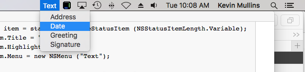

Next, let's look at creating custom dock menu items.

## Custom dock menus

The dock menu appears for you Mac application when the user right-clicks or control-clicks the application's icon in the dock:

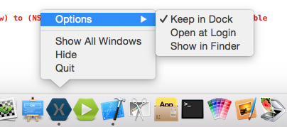

Let's create a custom dock menu for our application by doing the following:

1. In Visual Studio for Mac, right-click on the application's project and select **Add** > **New File...** From the new file dialog, select **Xamarin.Mac** > **Empty Interface Definition**, use "DockMenu" for the **Name** and click the **New** button to create the new **DockMenu.xib** file:

    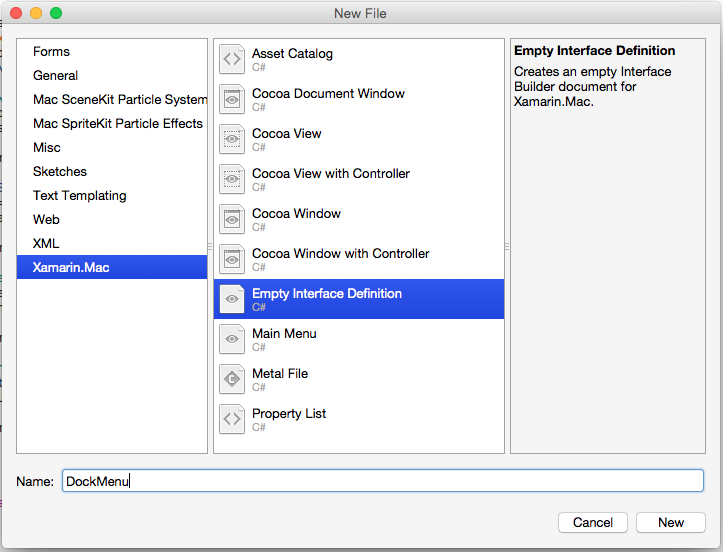
2. In the **Solution Pad**, double-click the **DockMenu.xib** file to open it for editing in Xcode. Create a new **Menu** with the following items: **Address**, **Date**, **Greeting**, and **Signature** 

    [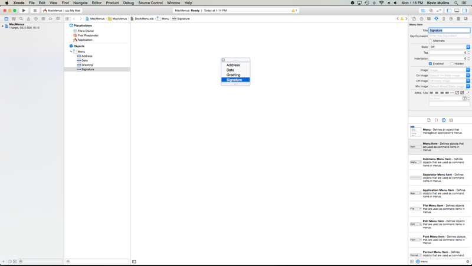](menu-images/dock03-large.png#lightbox)
3. Next, let's connect our new menu items to our existing actions that we created for our custom menu in the [Adding, Editing and Deleting Menus](#Adding,_Editing_and_Deleting_Menus) section above. Switch to the **Connection Inspector** and select the **First Responder** in the **Interface Hierarchy**. Scroll down and find the `phraseAddress:` action. Drag a line from the circle on that action to the **Address** menu item:

    [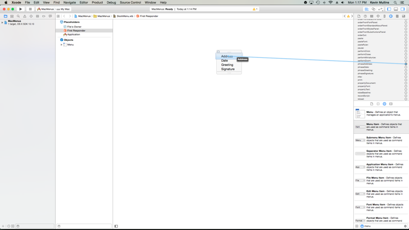](menu-images/dock04-large.png#lightbox)
4. Repeat for all of the other menu items attaching them to their corresponding actions: 

    [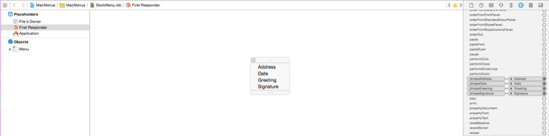](menu-images/dock05-large.png#lightbox)
5. Next, select the **Application** in the **Interface Hierarchy**. In the **Connection Inspector**, drag a line from the circle on the `dockMenu` outlet to the menu we just created:

    [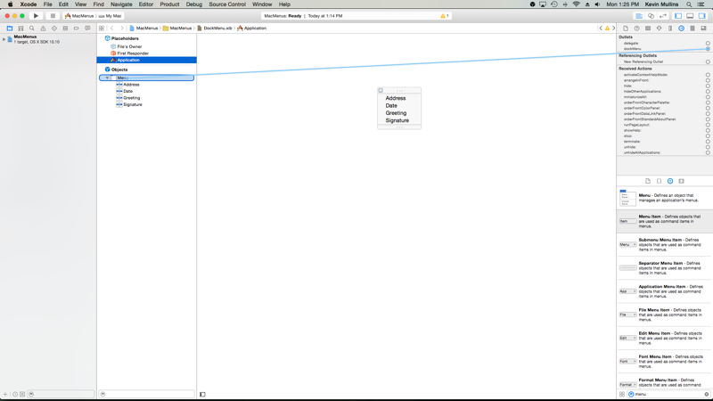](menu-images/dock06-large.png#lightbox)
6. Save your changes and switch back to Visual Studio for Mac to sync with Xcode.
7. Double-click the **Info.plist** file to open it for editing: 

    [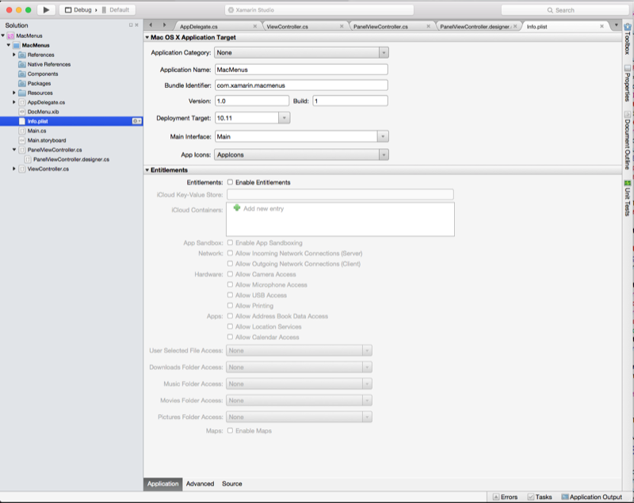](menu-images/dock07-large.png#lightbox)
8. Click the **Source** tab at the bottom of the screen: 

    [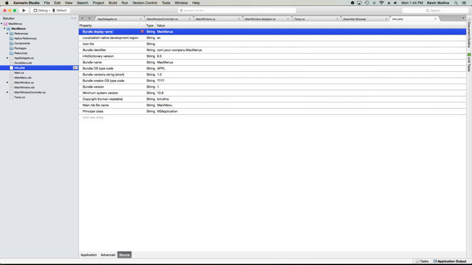](menu-images/dock08-large.png#lightbox)
9. Click **Add new entry**, click the green plus button, set the property name to "AppleDockMenu" and the value to "DockMenu" (the name of our new .xib file without the extension): 

    [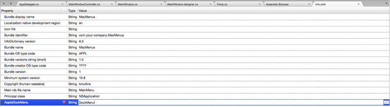](menu-images/dock09-large.png#lightbox)

Now if we run our application and right-click on its icon in the Dock, our new menu items will be displayed:

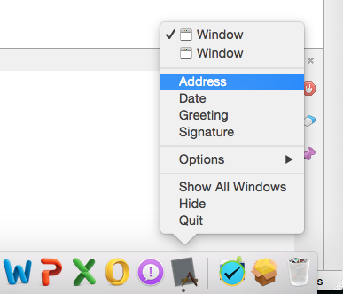

If we select one of the custom items from the menu, the text in our text view will be modified.

<a name="Pop-up_Menus_and_Pull-Down_Lists"></a>

## Pop-up button and pull-down lists

A pop-up button displays a selected item and presents a list of options to select from when clicked by the user. A pull-down list is a type of pop-up button usually used for selecting commands specific to the context of the current task. Both can appear anywhere in a window.

Let's create a custom pop-up button for our application by doing the following:

1. Edit the **Main.storyboard** file in Xcode and drag a **Popup Button** from the **Library Inspector** onto the **Panel** window we created in the [Contextual Menus](#Contextual_Menus) section: 

    [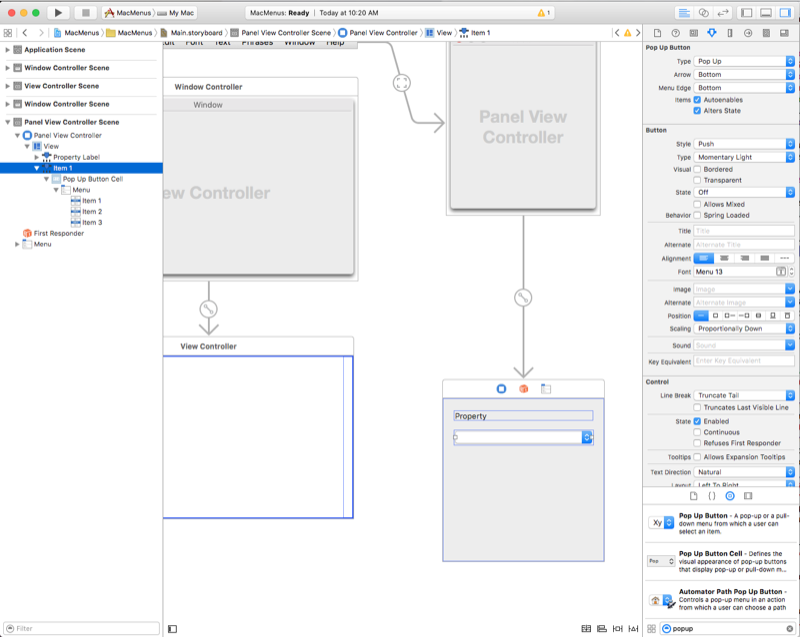](menu-images/popup01-large.png#lightbox)
2. Add a new menu item and set the titles of the Items in the Popup to: **Address**, **Date**, **Greeting**, and **Signature** 

    [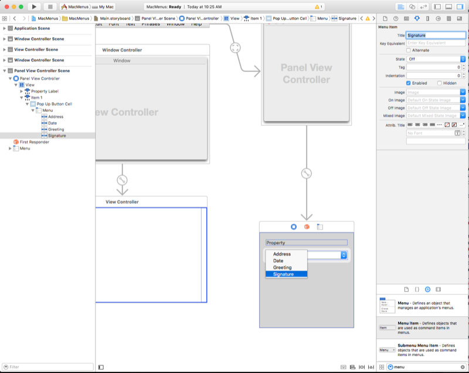](menu-images/popup02-large.png#lightbox)
3. Next, let's connect our new menu items to the existing actions that we created for our custom menu in the [Adding, Editing and Deleting Menus](#Adding,_Editing_and_Deleting_Menus) section above. Switch to the **Connection Inspector** and select the **First Responder** in the **Interface Hierarchy**. Scroll down and find the `phraseAddress:` action. Drag a line from the circle on that action to the **Address** menu item: 

    [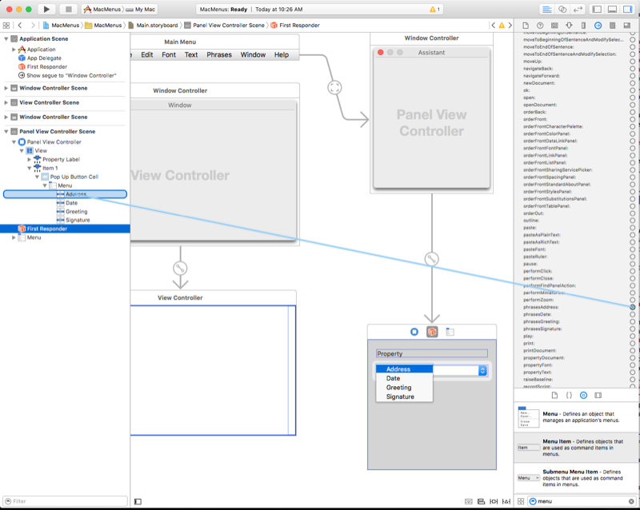](menu-images/popup03-large.png#lightbox)
4. Repeat for all of the other menu items attaching them to their corresponding actions: 

    [](menu-images/popup04-large.png#lightbox)
5. Save your changes and switch back to Visual Studio for Mac to sync with Xcode.

Now if we run our application and select an item from the popup, the text in our text view will change:

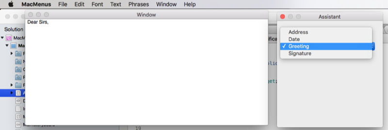

You can create and work with pull-down lists in the exact same way as pop-up buttons. Instead of attaching to existing action, you could create your own custom actions just like we did for our contextual menu in the [Contextual Menus](#Contextual_Menus) section.

## Summary

This article has taken a detailed look at working with menus and menu items in a Xamarin.Mac application. First we examined the application's menu bar, then we looked at creating contextual menus, next we examined status bar menus and custom dock menus. Finally, we covered pop-up menus and pull-down Lists.

## Related Links

- [MacMenus (sample)](/samples/xamarin/mac-samples/macmenus)
- [Hello, Mac](~/mac/get-started/hello-mac.md)
- [Human Interface Guidelines - Menus](https://developer.apple.com/design/human-interface-guidelines/menus)
- [Introduction to Application Menus and Pop-up Lists](https://developer.apple.com/library/content/documentation/Cocoa/Conceptual/MenuList/MenuList.html)