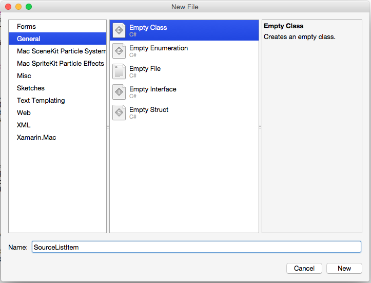
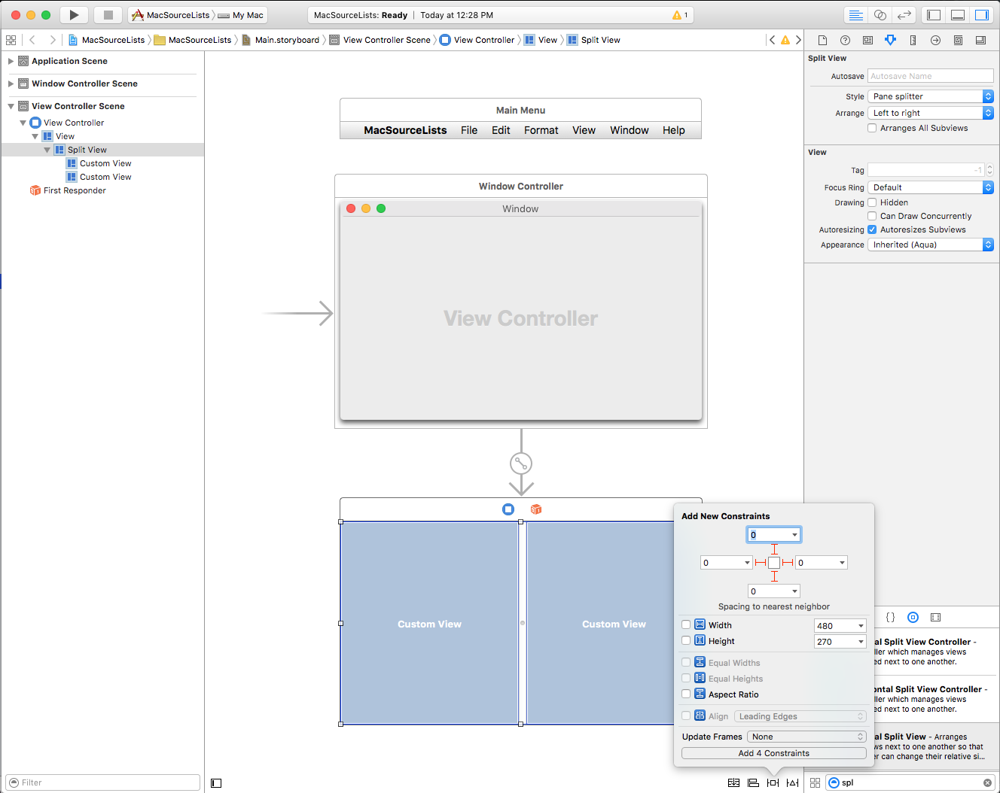
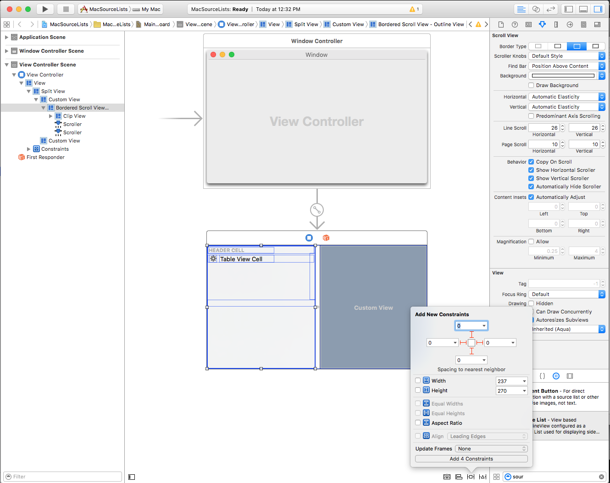
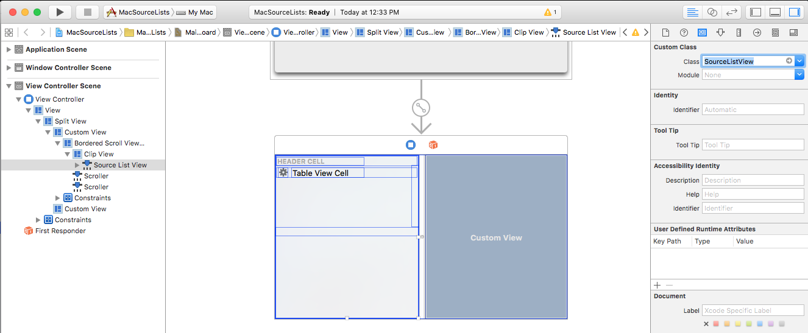
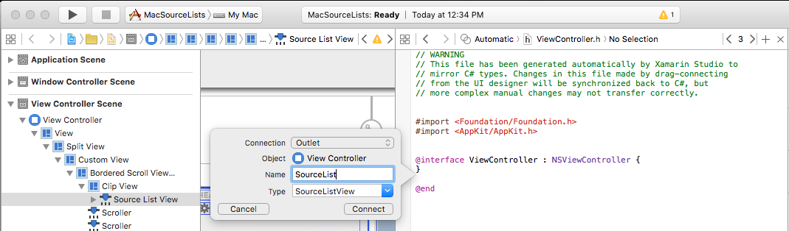

# Source lists in Xamarin.Mac

_This article covers working with source lists in a Xamarin.Mac application. It describes creating and maintaining source lists in Xcode and Interface Builder and interacting with them in C# code._

When working with C# and .NET in a Xamarin.Mac application, you have access to the same Source Lists that a developer working in *Objective-C* and *Xcode* does. Because Xamarin.Mac integrates directly with Xcode, you can use Xcode's _Interface Builder_ to create and maintain your Source Lists (or optionally create them directly in C# code).

A Source List is a special type of Outline View used to show the source of an action, like the side bar in Finder or iTunes.

[](source-list-images/source05.png#lightbox)

In this article, we'll cover the basics of working with Source Lists in a Xamarin.Mac application. It is highly suggested that you work through the [Hello, Mac](~/mac/get-started/hello-mac.md) article first, specifically the [Introduction to Xcode and Interface Builder](~/mac/get-started/hello-mac.md#introduction-to-xcode-and-interface-builder) and [Outlets and Actions](~/mac/get-started/hello-mac.md#outlets-and-actions) sections, as it covers key concepts and techniques that we'll be using in this article.

You may want to take a look at the [Exposing C# classes / methods to Objective-C](~/mac/internals/how-it-works.md) section of the [Xamarin.Mac Internals](~/mac/internals/how-it-works.md) document as well, it explains the `Register` and `Export` commands used to wire-up your C# classes to Objective-C objects and UI Elements.

<a name="Introduction_to_Outline_Views"></a>

## Introduction to Source Lists

As stated above, a Source List is a special type of Outline View used to show the source of an action, like the side bar in Finder or iTunes. A Source List is a type of Table that allows the user expand or collapse rows of hierarchical data. Unlike a Table View, items in an Source List are not in a flat list, they are organized in a hierarchy, like files and folders on a hard drive. If an item in an Source List contains other items, it can be expanded or collapsed by the user.

The Source List is a specially styled Outline View (`NSOutlineView`), which itself is a subclass of the Table View (`NSTableView`) and as such, inherits much of its behavior from its parent class. As a result, many operations supported by a Outline View, are also supported by an Source List. A Xamarin.Mac application has control of these features, and can configure the Source List's parameters (either in code or Interface Builder) to allow or disallow certain operations.

A Source List does not store it's own data, instead it relies on a Data Source (`NSOutlineViewDataSource`) to provide both the rows and columns required, on a as-needed basis.

A Source List's behavior can be customized by providing a subclass of the Outline View Delegate (`NSOutlineViewDelegate`) to support Outline type to select functionality, item selection and editing, custom tracking, and custom views for individual items.

Since a Source List shares much of it's behavior and functionality with a Table View and an Outline View, you might want to go through our [Table Views](~/mac/user-interface/table-view.md) and [Outline Views](~/mac/user-interface/outline-view.md) documentation before continuing with this article.

<a name="Working_with_Source_Lists"></a>

## Working with Source Lists

A Source List is a special type of Outline View used to show the source of an action, like the side bar in Finder or iTunes. Unlike Outline Views, before we define our Source List in Interface Builder, let's create the backing classes in Xamarin.Mac.

First, let's create a new `SourceListItem` class to hold the data for our Source List. In the **Solution Explorer**, right-click the Project and select **Add** > **New File...** Select **General** > **Empty Class**, enter `SourceListItem` for the **Name** and click the **New** button:

[](source-list-images/source01.png#lightbox)

Make the `SourceListItem.cs` file look like the following: 

```csharp
using System;
using System.Collections;
using System.Collections.Generic;
using AppKit;
using Foundation;

namespace MacOutlines
{
    public class SourceListItem: NSObject, IEnumerator, IEnumerable
    {
        #region Private Properties
        private string _title;
        private NSImage _icon;
        private string _tag;
        private List<SourceListItem> _items = new List<SourceListItem> ();
        #endregion

        #region Computed Properties
        public string Title {
            get { return _title; }
            set { _title = value; }
        }

        public NSImage Icon {
            get { return _icon; }
            set { _icon = value; }
        }

        public string Tag {
            get { return _tag; }
            set { _tag=value; }
        }
        #endregion

        #region Indexer
        public SourceListItem this[int index]
        {
            get
            {
                return _items[index];
            }

            set
            {
                _items[index] = value;
            }
        }

        public int Count {
            get { return _items.Count; }
        }

        public bool HasChildren {
            get { return (Count > 0); }
        }
        #endregion

        #region Enumerable Routines
        private int _position = -1;

        public IEnumerator GetEnumerator()
        {
            _position = -1;
            return (IEnumerator)this;
        }

        public bool MoveNext()
        {
            _position++;
            return (_position < _items.Count);
        }

        public void Reset()
        {_position = -1;}

        public object Current
        {
            get 
            { 
                try 
                {
                    return _items[_position];
                }

                catch (IndexOutOfRangeException)
                {
                    throw new InvalidOperationException();
                }
            }
        }
        #endregion

        #region Constructors
        public SourceListItem ()
        {
        }

        public SourceListItem (string title)
        {
            // Initialize
            this._title = title;
        }

        public SourceListItem (string title, string icon)
        {
            // Initialize
            this._title = title;
            this._icon = NSImage.ImageNamed (icon);
        }

        public SourceListItem (string title, string icon, ClickedDelegate clicked)
        {
            // Initialize
            this._title = title;
            this._icon = NSImage.ImageNamed (icon);
            this.Clicked = clicked;
        }

        public SourceListItem (string title, NSImage icon)
        {
            // Initialize
            this._title = title;
            this._icon = icon;
        }

        public SourceListItem (string title, NSImage icon, ClickedDelegate clicked)
        {
            // Initialize
            this._title = title;
            this._icon = icon;
            this.Clicked = clicked;
        }

        public SourceListItem (string title, NSImage icon, string tag)
        {
            // Initialize
            this._title = title;
            this._icon = icon;
            this._tag = tag;
        }

        public SourceListItem (string title, NSImage icon, string tag, ClickedDelegate clicked)
        {
            // Initialize
            this._title = title;
            this._icon = icon;
            this._tag = tag;
            this.Clicked = clicked;
        }
        #endregion

        #region Public Methods
        public void AddItem(SourceListItem item) {
            _items.Add (item);
        }

        public void AddItem(string title) {
            _items.Add (new SourceListItem (title));
        }

        public void AddItem(string title, string icon) {
            _items.Add (new SourceListItem (title, icon));
        }

        public void AddItem(string title, string icon, ClickedDelegate clicked) {
            _items.Add (new SourceListItem (title, icon, clicked));
        }

        public void AddItem(string title, NSImage icon) {
            _items.Add (new SourceListItem (title, icon));
        }

        public void AddItem(string title, NSImage icon, ClickedDelegate clicked) {
            _items.Add (new SourceListItem (title, icon, clicked));
        }

        public void AddItem(string title, NSImage icon, string tag) {
            _items.Add (new SourceListItem (title, icon, tag));
        }

        public void AddItem(string title, NSImage icon, string tag, ClickedDelegate clicked) {
            _items.Add (new SourceListItem (title, icon, tag, clicked));
        }

        public void Insert(int n, SourceListItem item) {
            _items.Insert (n, item);
        }

        public void RemoveItem(SourceListItem item) {
            _items.Remove (item);
        }

        public void RemoveItem(int n) {
            _items.RemoveAt (n);
        }

        public void Clear() {
            _items.Clear ();
        }
        #endregion

        #region Events
        public delegate void ClickedDelegate();
        public event ClickedDelegate Clicked;

        internal void RaiseClickedEvent() {
            // Inform caller
            if (this.Clicked != null)
                this.Clicked ();
        }
        #endregion
    }
}
```

In the **Solution Explorer**, right-click the Project and select **Add** > **New File...** Select **General** > **Empty Class**, enter `SourceListDataSource` for the **Name** and click the **New** button. Make the `SourceListDataSource.cs` file look like the following:

```csharp
using System;
using System.Collections;
using System.Collections.Generic;
using AppKit;
using Foundation;

namespace MacOutlines
{
    public class SourceListDataSource : NSOutlineViewDataSource
    {
        #region Private Variables
        private SourceListView _controller;
        #endregion

        #region Public Variables
        public List<SourceListItem> Items = new List<SourceListItem>();
        #endregion

        #region Constructors
        public SourceListDataSource (SourceListView controller)
        {
            // Initialize
            this._controller = controller;
        }
        #endregion

        #region Override Properties
        public override nint GetChildrenCount (NSOutlineView outlineView, Foundation.NSObject item)
        {
            if (item == null) {
                return Items.Count;
            } else {
                return ((SourceListItem)item).Count;
            }
        }

        public override bool ItemExpandable (NSOutlineView outlineView, Foundation.NSObject item)
        {
            return ((SourceListItem)item).HasChildren;
        }

        public override NSObject GetChild (NSOutlineView outlineView, nint childIndex, Foundation.NSObject item)
        {
            if (item == null) {
                return Items [(int)childIndex];
            } else {
                return ((SourceListItem)item) [(int)childIndex]; 
            }
        }

        public override NSObject GetObjectValue (NSOutlineView outlineView, NSTableColumn tableColumn, NSObject item)
        {
            return new NSString (((SourceListItem)item).Title);
        }
        #endregion

        #region Internal Methods
        internal SourceListItem ItemForRow(int row) {
            int index = 0;

            // Look at each group
            foreach (SourceListItem item in Items) {
                // Is the row inside this group?
                if (row >= index && row <= (index + item.Count)) {
                    return item [row - index - 1];
                }

                // Move index
                index += item.Count + 1;
            }

            // Not found 
            return null;
        }
        #endregion
    }
}
```

This will provide the data for our Source List.

In the **Solution Explorer**, right-click the Project and select **Add** > **New File...** Select **General** > **Empty Class**, enter `SourceListDelegate` for the **Name** and click the **New** button. Make the `SourceListDelegate.cs` file look like the following:

```csharp
using System;
using AppKit;
using Foundation;

namespace MacOutlines
{
    public class SourceListDelegate : NSOutlineViewDelegate
    {
        #region Private variables
        private SourceListView _controller;
        #endregion

        #region Constructors
        public SourceListDelegate (SourceListView controller)
        {
            // Initialize
            this._controller = controller;
        }
        #endregion

        #region Override Methods
        public override bool ShouldEditTableColumn (NSOutlineView outlineView, NSTableColumn tableColumn, Foundation.NSObject item)
        {
            return false;
        }

        public override NSCell GetCell (NSOutlineView outlineView, NSTableColumn tableColumn, Foundation.NSObject item)
        {
            nint row = outlineView.RowForItem (item);
            return tableColumn.DataCellForRow (row);
        }

        public override bool IsGroupItem (NSOutlineView outlineView, Foundation.NSObject item)
        {
            return ((SourceListItem)item).HasChildren;
        }

        public override NSView GetView (NSOutlineView outlineView, NSTableColumn tableColumn, NSObject item)
        {
            NSTableCellView view = null;

            // Is this a group item?
            if (((SourceListItem)item).HasChildren) {
                view = (NSTableCellView)outlineView.MakeView ("HeaderCell", this);
            } else {
                view = (NSTableCellView)outlineView.MakeView ("DataCell", this);
                view.ImageView.Image = ((SourceListItem)item).Icon;
            }

            // Initialize view
            view.TextField.StringValue = ((SourceListItem)item).Title;

            // Return new view
            return view;
        }

        public override bool ShouldSelectItem (NSOutlineView outlineView, Foundation.NSObject item)
        {
            return (outlineView.GetParent (item) != null);
        }

        public override void SelectionDidChange (NSNotification notification)
        {
            NSIndexSet selectedIndexes = _controller.SelectedRows;

            // More than one item selected?
            if (selectedIndexes.Count > 1) {
                // Not handling this case
            } else {
                // Grab the item
                var item = _controller.Data.ItemForRow ((int)selectedIndexes.FirstIndex);

                // Was an item found?
                if (item != null) {
                    // Fire the clicked event for the item
                    item.RaiseClickedEvent ();

                    // Inform caller of selection
                    _controller.RaiseItemSelected (item);
                }
            }
        }
        #endregion
    }
}
```

This will provide the behavior of our Source List.

Finally, in the **Solution Explorer**, right-click the Project and select **Add** > **New File...** Select **General** > **Empty Class**, enter `SourceListView` for the **Name** and click the **New** button. Make the `SourceListView.cs` file look like the following:

```csharp
using System;
using AppKit;
using Foundation;

namespace MacOutlines
{
    [Register("SourceListView")]
    public class SourceListView : NSOutlineView
    {
        #region Computed Properties
        public SourceListDataSource Data {
            get {return (SourceListDataSource)this.DataSource; }
        }
        #endregion

        #region Constructors
        public SourceListView ()
        {

        }

        public SourceListView (IntPtr handle) : base(handle)
        {

        }

        public SourceListView (NSCoder coder) : base(coder)
        {

        }

        public SourceListView (NSObjectFlag t) : base(t)
        {

        }
        #endregion

        #region Override Methods
        public override void AwakeFromNib ()
        {
            base.AwakeFromNib ();
        }
        #endregion

        #region Public Methods
        public void Initialize() {

            // Initialize this instance
            this.DataSource = new SourceListDataSource (this);
            this.Delegate = new SourceListDelegate (this);

        }
        
        public void AddItem(SourceListItem item) {
            if (Data != null) {
                Data.Items.Add (item);
            }
        }
        #endregion

        #region Events
        public delegate void ItemSelectedDelegate(SourceListItem item);
        public event ItemSelectedDelegate ItemSelected;

        internal void RaiseItemSelected(SourceListItem item) {
            // Inform caller
            if (this.ItemSelected != null) {
                this.ItemSelected (item);
            }
        }
        #endregion
    }
}
```

This creates a custom, reusable subclass of `NSOutlineView` (`SourceListView`) that we can use to drive the Source List in any Xamarin.Mac application that we make.

<a name="Creating_and_Maintaining_Source_Lists_in_Xcode"></a>

## Creating and Maintaining Source Lists in Xcode

Now, let's design our Source List in Interface Builder. Double-click the `Main.storyboard` file to open it for editing in Interface Builder and drag a Split View from the **Library Inspector**, add it to the View Controller and set it to resize with the View in the **Constraints Editor**:

[](source-list-images/source00.png#lightbox)

Next, drag a Source List from the **Library Inspector**, add it to the left side of the Split View and set it to resize with the View in the **Constraints Editor**:

[](source-list-images/source02.png#lightbox)

Next, switch to the **Identity View**, select the Source List, and change it's **Class** to `SourceListView`:

[](source-list-images/source03.png#lightbox)

Finally, create an **Outlet** for our Source List called `SourceList` in the `ViewController.h` file:

[](source-list-images/source04.png#lightbox)

Save your changes and return to Visual Studio for Mac to sync with Xcode.

<a name="Populating the Source List"></a>

## Populating the Source List

Let's edit the `RotationWindow.cs` file in Visual Studio for Mac and make it's `AwakeFromNib` method look like the following:

```csharp
public override void AwakeFromNib ()
{
    base.AwakeFromNib ();

    // Populate source list
    SourceList.Initialize ();

    var library = new SourceListItem ("Library");
    library.AddItem ("Venues", "house.png", () => {
        Console.WriteLine("Venue Selected");
    });
    library.AddItem ("Singers", "group.png");
    library.AddItem ("Genre", "cards.png");
    library.AddItem ("Publishers", "box.png");
    library.AddItem ("Artist", "person.png");
    library.AddItem ("Music", "album.png");
    SourceList.AddItem (library);

    // Add Rotation 
    var rotation = new SourceListItem ("Rotation"); 
    rotation.AddItem ("View Rotation", "redo.png");
    SourceList.AddItem (rotation);

    // Add Kiosks
    var kiosks = new SourceListItem ("Kiosks");
    kiosks.AddItem ("Sign-in Station 1", "imac");
    kiosks.AddItem ("Sign-in Station 2", "ipad");
    SourceList.AddItem (kiosks);

    // Display side list
    SourceList.ReloadData ();
    SourceList.ExpandItem (null, true);

}
```

The `Initialize ()` method need to be called against our Source List's **Outlet** _before_ any items are added to it. For each group of items, we create a parent item and then add the sub items to that group item. Each group is then added to the Source List's collection `SourceList.AddItem (...)`. The last two lines load the data for the Source List and expands all groups:

```csharp
// Display side list
SourceList.ReloadData ();
SourceList.ExpandItem (null, true);
```

Finally, edit the `AppDelegate.cs` file and make the `DidFinishLaunching` method look like the following:

```csharp
public override void DidFinishLaunching (NSNotification notification)
{
    mainWindowController = new MainWindowController ();
    mainWindowController.Window.MakeKeyAndOrderFront (this);

    var rotation = new RotationWindowController ();
    rotation.Window.MakeKeyAndOrderFront (this);
}
```

If we run our application, the following will be displayed:

[](source-list-images/source05.png#lightbox)

<a name="Summary"></a>

## Summary

This article has taken a detailed look at working with Source Lists in a Xamarin.Mac application. We saw how to create and maintain Source Lists in Xcode's Interface Builder and how to work with Source Lists in C# code.

## Related Links

- [MacOutlines (sample)](/samples/xamarin/mac-samples/macoutlines)
- [Hello, Mac](~/mac/get-started/hello-mac.md)
- [Table Views](~/mac/user-interface/table-view.md)
- [Outline Views](~/mac/user-interface/outline-view.md)
- [OS X Human Interface Guidelines](https://developer.apple.com/library/mac/documentation/UserExperience/Conceptual/OSXHIGuidelines/)
- [Introduction to Outline Views](https://developer.apple.com/library/mac/documentation/Cocoa/Conceptual/OutlineView/OutlineView.html#//apple_ref/doc/uid/10000023i)
- [NSOutlineView](https://developer.apple.com/library/mac/documentation/Cocoa/Reference/ApplicationKit/Classes/NSOutlineView_Class/index.html#//apple_ref/doc/uid/TP40004079)
- [NSOutlineViewDataSource](https://developer.apple.com/library/mac/documentation/Cocoa/Reference/ApplicationKit/Protocols/NSOutlineViewDataSource_Protocol/index.html#//apple_ref/doc/uid/TP40004175)
- [NSOutlineViewDelegate](https://developer.apple.com/library/mac/documentation/Cocoa/Reference/NSOutlineViewDelegate_Protocol/index.html#//apple_ref/doc/uid/TP40008609)