# Standard controls in Xamarin.Mac

_This article covers working with the standard AppKit controls such as buttons, labels, text fields, check boxes, and segmented controls in a Xamarin.Mac application. It describes adding them to an interface with Interface Builder and interacting with them in code._

When working with C# and .NET in a Xamarin.Mac application, you have access to the same AppKit Controls that a developer working in *Objective-C* and *Xcode* does. Because Xamarin.Mac integrates directly with Xcode, you can use Xcode's _Interface Builder_ to create and maintain your Appkit Controls (or optionally create them directly in C# code).

AppKit Controls are the UI Elements that are used to create the User Interface of your Xamarin.Mac application. They consist of elements such as Buttons, Labels, Text Fields, Check Boxes and Segmented Controls and cause instant actions or visible results when a user manipulates them.

[](standard-controls-images/intro01.png#lightbox)

In this article, we'll cover the basics of working with AppKit Controls in a Xamarin.Mac application. It is highly suggested that you work through the [Hello, Mac](~/mac/get-started/hello-mac.md) article first, specifically the [Introduction to Xcode and Interface Builder](~/mac/get-started/hello-mac.md#introduction-to-xcode-and-interface-builder) and [Outlets and Actions](~/mac/get-started/hello-mac.md#outlets-and-actions) sections, as it covers key concepts and techniques that we'll be using in this article.

You may want to take a look at the [Exposing C# classes / methods to Objective-C](~/mac/internals/how-it-works.md) section of the [Xamarin.Mac Internals](~/mac/internals/how-it-works.md) document as well, it explains the `Register` and `Export` commands used to wire-up your C# classes to Objective-C objects and UI Elements.

<a name="Introduction_to_Controls_and_Views"></a>

## Introduction to Controls and Views

macOS (formerly known as Mac OS X) provides a standard set of User Interface controls via the AppKit Framework. They consist of elements such as Buttons, Labels, Text Fields, Check Boxes and Segmented Controls and cause instant actions or visible results when a user manipulates them.

All of the AppKit Controls have a standard, built-in appearance that will be appropriate for most uses, some specify an alternate appearance for use in a window frame area or in a _Vibrance Effect_ context, such as in a Sidebar area or in a Notification Center widget.

Apple suggest the following guidelines when working with AppKit Controls:

- Avoid mixing control sizes in the same view.
- In general, avoid resizing controls vertically.
- Use the system font and the proper text size within a control.
- Use the proper spacing between controls.

For more information, pleas see the [About Controls and Views](https://developer.apple.com/library/mac/documentation/UserExperience/Conceptual/OSXHIGuidelines/ControlsAll.html#//apple_ref/doc/uid/20000957-CH46-SW1) section of Apple's [OS X Human Interface Guidelines](https://developer.apple.com/library/mac/documentation/UserExperience/Conceptual/OSXHIGuidelines/).

<a name="Using_Controls_in_a_Window_Frame"></a>

### Using Controls in a Window Frame

There are a subset of AppKit Controls that include a display style that allows them to be include in a Window's Frame area. For an example, see the Mail app's toolbar:

[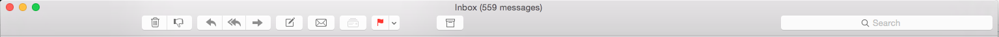](standard-controls-images/mailapp.png#lightbox)

- **Round Textured Button** - A `NSButton` with a style of `NSTexturedRoundedBezelStyle`.
- **Textured Rounded Segmented Control** - A `NSSegmentedControl` with a style of `NSSegmentStyleTexturedRounded`.
- **Textured Rounded Segmented Control** - A `NSSegmentedControl` with a style of `NSSegmentStyleSeparated`.
- **Round Textured Pop-Up Menu** - A `NSPopUpButton` with a style of `NSTexturedRoundedBezelStyle`.
- **Round Textured Drop-Down Menu** - A `NSPopUpButton` with a style of `NSTexturedRoundedBezelStyle`.
- **Search Bar** - A `NSSearchField`.

Apple suggest the following guidelines when working with AppKit Controls in a Window Frame:

- Don’t use Window Frame specific control styles in the Window Body.
- Don’t use Window Body controls or styles in the Window Frame.

For more information, pleas see the [About Controls and Views](https://developer.apple.com/library/mac/documentation/UserExperience/Conceptual/OSXHIGuidelines/ControlsAll.html#//apple_ref/doc/uid/20000957-CH46-SW1) section of Apple's [OS X Human Interface Guidelines](https://developer.apple.com/library/mac/documentation/UserExperience/Conceptual/OSXHIGuidelines/).

<a name="Creating_a_User_Interface_in_Interface_Builder"></a>

## Creating a User Interface in Interface Builder

When you create a new Xamarin.Mac Cocoa application, you get a standard blank, window by default. This windows is defined in a `.storyboard` file automatically included in the project. To edit your windows design, in the **Solution Explorer**, double click the `Main.storyboard` file:

[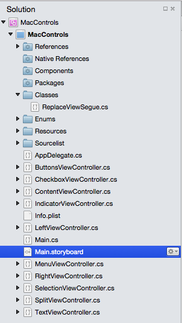](standard-controls-images/edit01.png#lightbox)

This will open the window design in Xcode's Interface Builder:

[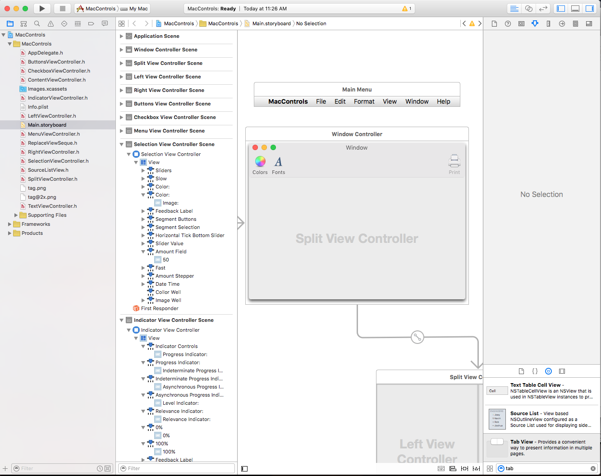](standard-controls-images/edit02.png#lightbox)

To create your User Interface, you'll drag UI Elements (AppKit Controls) from the **Library Inspector** to the **Interface Editor** in Interface Builder. In the example below, a **Vertical Split View** control has been drug from the **Library Inspector** and placed on the Window in the **Interface Editor**:

[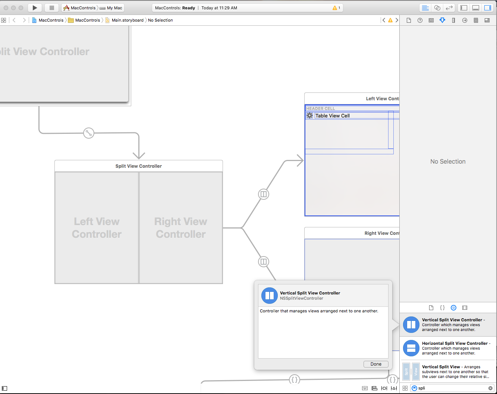](standard-controls-images/edit03.png#lightbox)

For more information on creating a User Interface in Interface Builder, please see our [Introduction to Xcode and Interface Builder](~/mac/get-started/hello-mac.md#introduction-to-xcode-and-interface-builder) documentation.

<a name="Sizing_and_Positioning"></a>

### Sizing and Positioning

Once a control has been included in the User Interface, use the **Constraint editor** to set its location and size by entering values manually and control how the control is automatically positioned and sized when the parent Window or View is resized:

[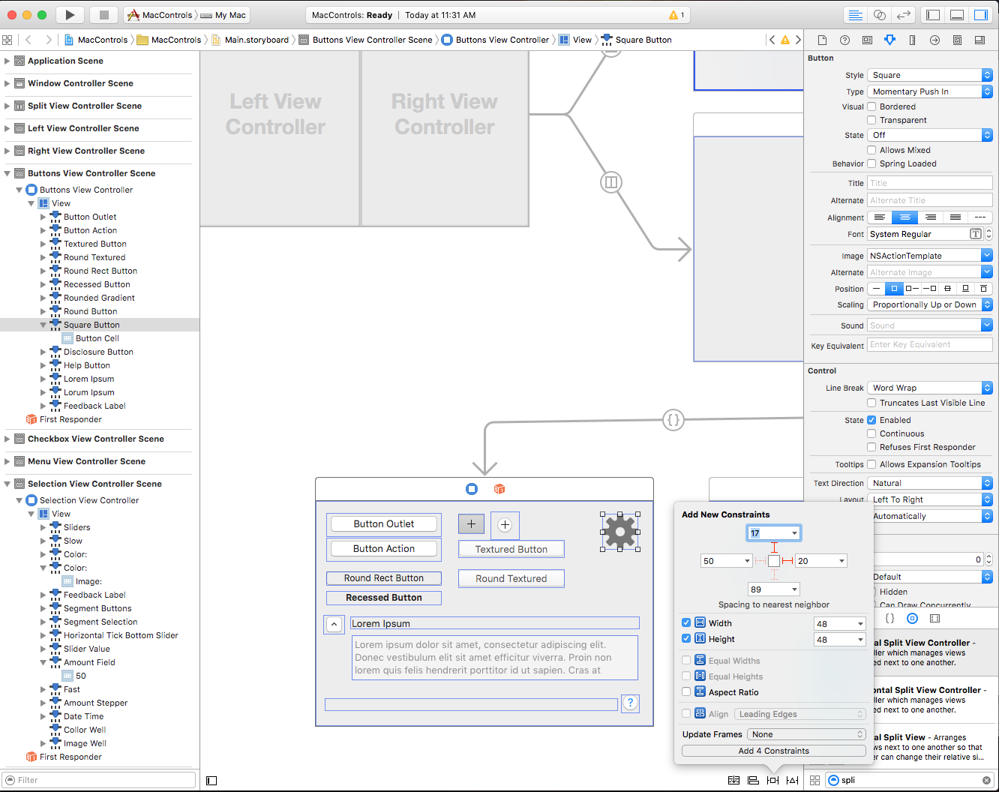](standard-controls-images/edit04.png#lightbox)

Use the **Red I-Beams** around the outside of the **Autoresizing** box to _stick_ a control to a given (x,y) location. For example: 

[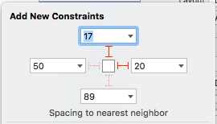](standard-controls-images/edit05.png#lightbox)

Specifies that the selected control (in the **Hierarchy View** & **Interface Editor**) will be stuck to the top and right location of the Window or View as it is resized or moved. 

Other elements of the editor control properties such as Height and Width:

[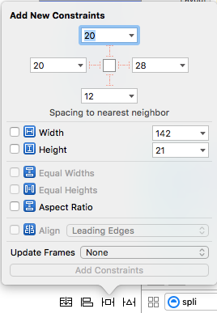](standard-controls-images/edit06.png#lightbox)

You can also control the alignment of elements with constraints using the **Alignment Editor**:

[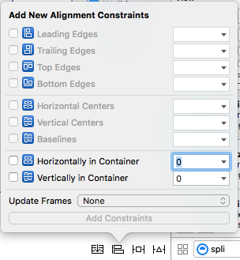](standard-controls-images/edit07.png#lightbox)

> [!IMPORTANT]
> Unlike iOS where (0,0) is the upper left hand corner of the screen, in macOS (0,0) is the lower left hand corner. This is because macOS uses a mathematical coordinate system with the number values increasing in value upward and to the right. You need to take this into consideration when placing AppKit controls on a User Interface.

<a name="Setting_a_Custom_Class"></a>

### Setting a Custom Class

There are times when working with AppKit Controls that you will need to subclass and existing control and create you own custom version of that class. For example, defining a custom version of the Source List:

```csharp
using System;
using AppKit;
using Foundation;

namespace AppKit
{
    [Register("SourceListView")]
    public class SourceListView : NSOutlineView
    {
        #region Computed Properties
        public SourceListDataSource Data {
            get {return (SourceListDataSource)this.DataSource; }
        }
        #endregion

        #region Constructors
        public SourceListView ()
        {

        }

        public SourceListView (IntPtr handle) : base(handle)
        {

        }

        public SourceListView (NSCoder coder) : base(coder)
        {

        }

        public SourceListView (NSObjectFlag t) : base(t)
        {

        }
        #endregion

        #region Override Methods
        public override void AwakeFromNib ()
        {
            base.AwakeFromNib ();

        }
        #endregion

        #region Public Methods
        public void Initialize() {

            // Initialize this instance
            this.DataSource = new SourceListDataSource (this);
            this.Delegate = new SourceListDelegate (this);

        }

        public void AddItem(SourceListItem item) {
            if (Data != null) {
                Data.Items.Add (item);
            }
        }
        #endregion

        #region Events
        public delegate void ItemSelectedDelegate(SourceListItem item);
        public event ItemSelectedDelegate ItemSelected;

        internal void RaiseItemSelected(SourceListItem item) {
            // Inform caller
            if (this.ItemSelected != null) {
                this.ItemSelected (item);
            }
        }
        #endregion
    }
}
```

Where the `[Register("SourceListView")]` instruction exposes the `SourceListView` class to Objective-C so that is can be used in Interface Builder. For more information, please see the [Exposing C# classes / methods to Objective-C](~/mac/internals/how-it-works.md) section of the [Xamarin.Mac Internals](~/mac/internals/how-it-works.md) document, it explains the `Register` and `Export` commands used to wire-up your C# classes to Objective-C objects and UI Elements.

With the above code in place, you can drag an AppKit Control, of the base type that you are extending, onto the design surface (in the example below, a **Source List**), switch to the **Identity Inspector** and set the **Custom Class** to the name that you exposed to Objective-C (example `SourceListView`):

[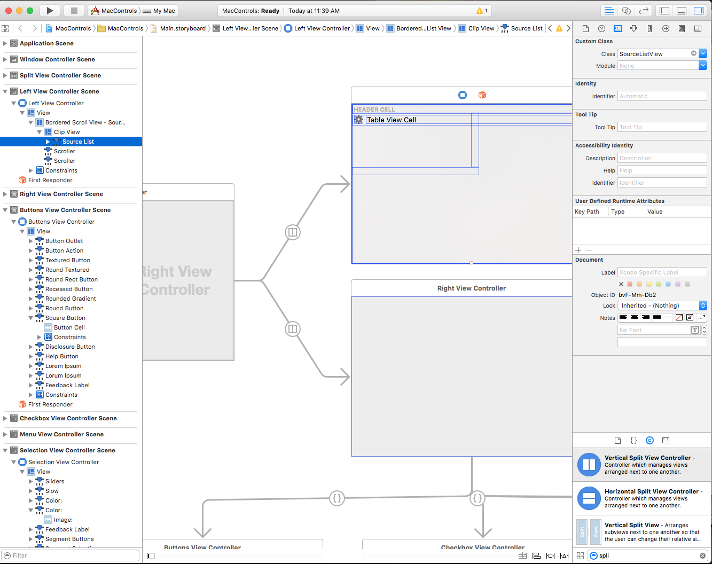](standard-controls-images/edit10.png#lightbox)

<a name="Exposing_Outlets_and_Actions"></a>

### Exposing Outlets and Actions

Before an AppKit Control can be accessed in C# code, it needs to be exposed as either an **Outlet** or and **Action**. To do this select the given control in either the **Interface Hierarchy** or the **Interface Editor** and switch to the **Assistant View** (ensure that you have the `.h` of your Window selected for editing):

[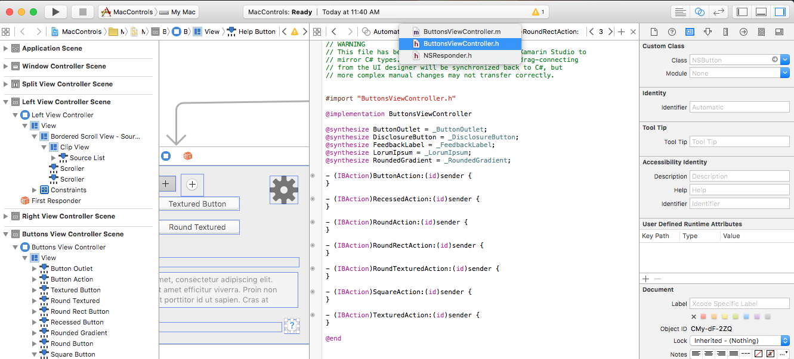](standard-controls-images/edit11.png#lightbox)

Control-drag from the AppKit control onto the give `.h` file to start creating an **Outlet** or **Action**:

[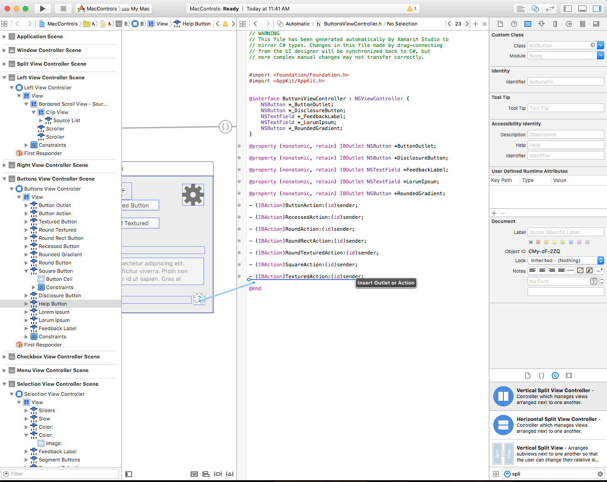](standard-controls-images/edit12.png#lightbox)

Select the type of exposure to create and give the **Outlet** or **Action** a **Name**: 

[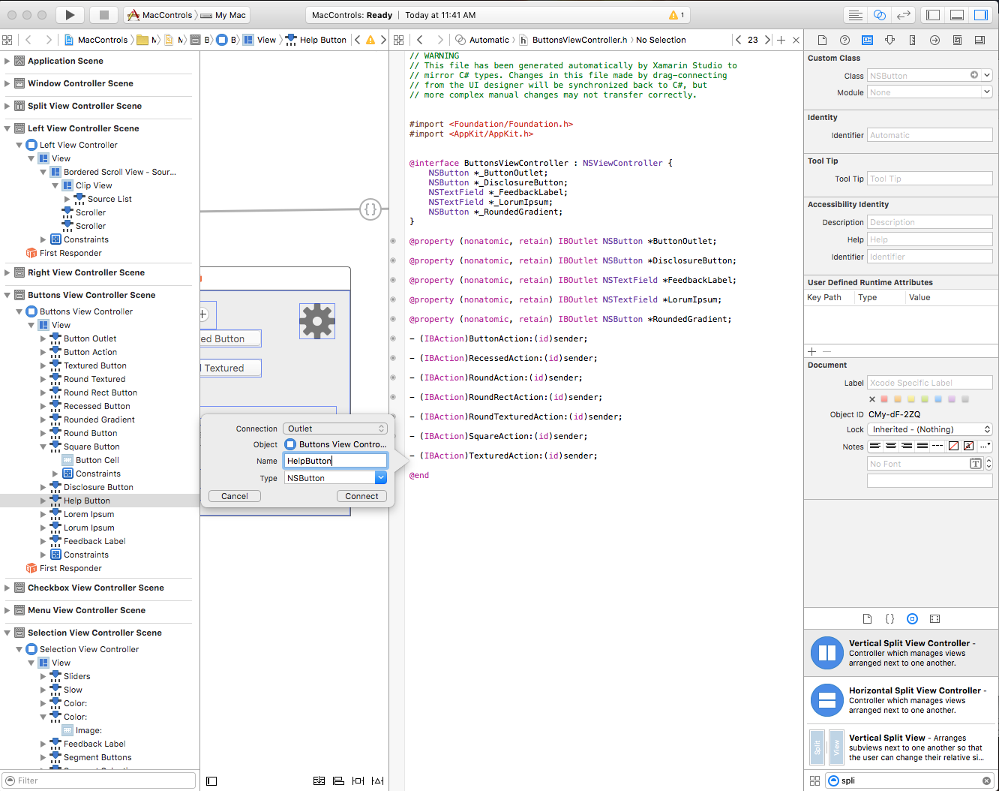](standard-controls-images/edit13.png#lightbox)

For more information on working with **Outlets** and **Actions**, please see the [Outlets and Actions](~/mac/get-started/hello-mac.md#outlets-and-actions) section of our [Introduction to Xcode and Interface Builder](~/mac/get-started/hello-mac.md#introduction-to-xcode-and-interface-builder) documentation.

<a name="Synchronizing_Changes_with_Xcode"></a>

### Synchronizing Changes with Xcode

When you switch back to Visual Studio for Mac from Xcode, any changes that you have made in Xcode will automatically be synchronized with your Xamarin.Mac project.

If you select the `SplitViewController.designer.cs` in the **Solution Explorer** you'll be able to see how your **Outlet** and **Action** have been wired up in our C# code:

[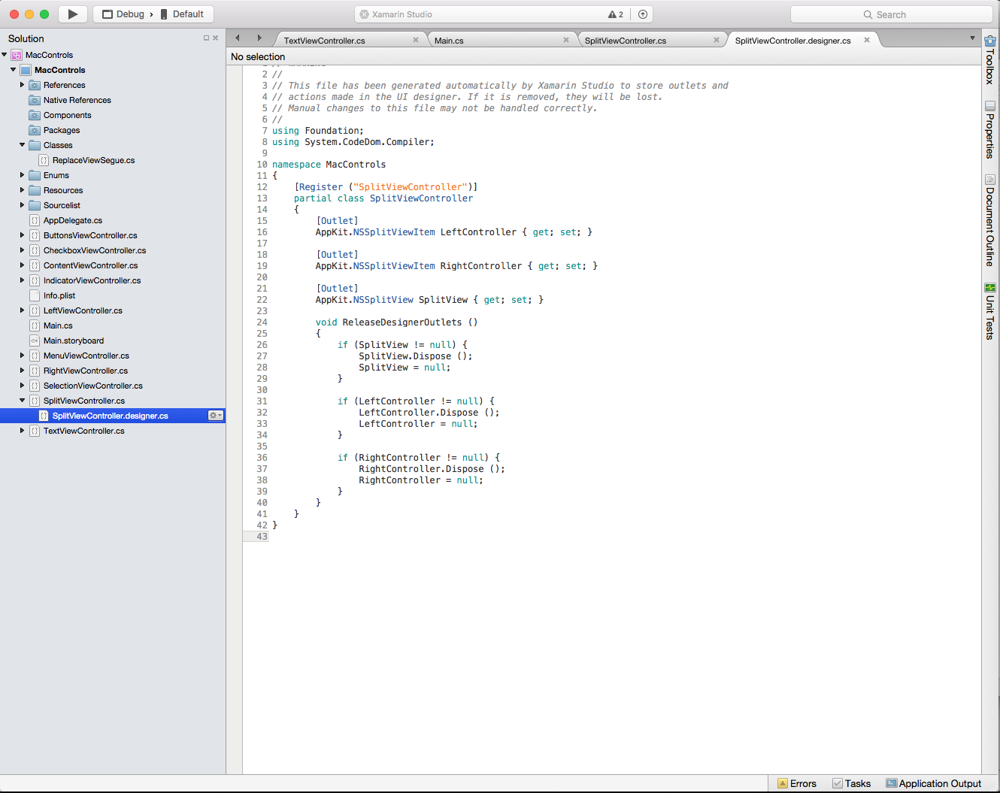](standard-controls-images/sync01.png#lightbox)

Notice how the definition in the `SplitViewController.designer.cs` file:

```csharp
[Outlet]
AppKit.NSSplitViewItem LeftController { get; set; }

[Outlet]
AppKit.NSSplitViewItem RightController { get; set; }

[Outlet]
AppKit.NSSplitView SplitView { get; set; }
```

Line up with the definition in the `MainWindow.h` file in Xcode:

```csharp
@interface SplitViewController : NSSplitViewController {
    NSSplitViewItem *_LeftController;
    NSSplitViewItem *_RightController;
    NSSplitView *_SplitView;
}

@property (nonatomic, retain) IBOutlet NSSplitViewItem *LeftController;

@property (nonatomic, retain) IBOutlet NSSplitViewItem *RightController;

@property (nonatomic, retain) IBOutlet NSSplitView *SplitView;
```

As you can see, Visual Studio for Mac listens for changes to the `.h` file, and then automatically synchronizes those changes in the respective `.designer.cs` file to expose them to your application. You may also notice that `SplitViewController.designer.cs` is a partial class, so that Visual Studio for Mac doesn't have to modify `SplitViewController.cs` which would overwrite any changes that we have made to the class.

You normally will never need to open the `SplitViewController.designer.cs` yourself, it was presented here for educational purposes only.

> [!IMPORTANT]
> In most situations, Visual Studio for Mac will automatically see any changes made in Xcode and sync them to your Xamarin.Mac project. In the off occurrence that synchronization doesn't automatically happen, switch back to Xcode and them back to Visual Studio for Mac again. This will normally kick off a synchronization cycle.

<a name="Working_with_Buttons"></a>

## Working with Buttons

AppKit provides several types of button that can be used in your User Interface Design. For more information, please see the [Buttons](https://developer.apple.com/library/mac/documentation/UserExperience/Conceptual/OSXHIGuidelines/ControlsButtons.html#//apple_ref/doc/uid/20000957-CH48-SW1) section of Apple's [OS X Human Interface Guidelines](https://developer.apple.com/library/mac/documentation/UserExperience/Conceptual/OSXHIGuidelines/). 

[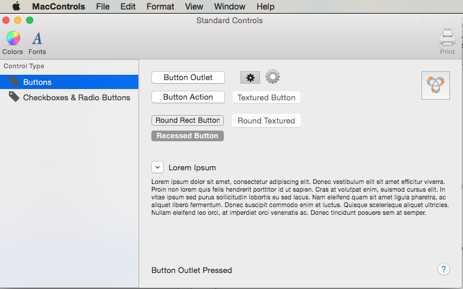](standard-controls-images/buttons01.png#lightbox)

If a button has been exposed via an **Outlet**, the following code will respond to it being pressed:

```csharp
ButtonOutlet.Activated += (sender, e) => {
        FeedbackLabel.StringValue = "Button Outlet Pressed";
};
```

For buttons that have been exposed via **Actions**, a `public partial` method will automatically be created for you with the name that you chose in Xcode. To respond to the **Action**, complete the partial method in the class that the **Action** was defined on. For example:

```csharp
partial void ButtonAction (Foundation.NSObject sender) {
    // Do something in response to the Action
    FeedbackLabel.StringValue = "Button Action Pressed";
}
```

For buttons that have a state (like **On** and **Off**), the state can be checked or set with the `State` property against the `NSCellStateValue` enum. For example:

```csharp
DisclosureButton.Activated += (sender, e) => {
    LorumIpsum.Hidden = (DisclosureButton.State == NSCellStateValue.On);
};
```

Where `NSCellStateValue` can be:

- **On** - The button is pushed or the control is selected (such as a check in a Check Box).
- **Off** - The button is not pushed or the control is not selected.
- **Mixed** - A mixture of **On** and **Off** states.

<a name="Mark-a-Button-as-Default-and-Set-Key-Equivalent"></a>

### Mark a Button as Default and Set Key Equivalent

For any button that you have added to a user interface design, you can mark that button as the _Default_ button that will be activated when the user presses the **Return/Enter** key on the keyboard. In macOS, this button will receive a blue background color by default.

To set a button as default, select it in Xcode's Interface Builder. Next, in the **Attribute Inspector**, select the **Key Equivalent** field and press the **Return/Enter** key:

[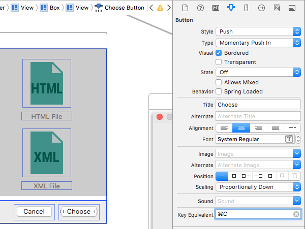](standard-controls-images/buttons03.png#lightbox)

Equally, you can assign any key sequence that can be used to activate the button using the keyboard instead of the mouse. For example, by pressing the Command-C keys in the image above.

When the app is run and the Window with the Button is Key and Focused, if the user presses Command-C, the Action for the button will be activated (as-if the user had clicked on the button).

<a name="Working_with_Checkboxes_and_Radio_Buttons"></a>

## Working with Checkboxes and Radio Buttons

AppKit provides several types of Checkboxes and Radio Button Groups that can be used in your User Interface Design. For more information, please see the [Buttons](https://developer.apple.com/library/mac/documentation/UserExperience/Conceptual/OSXHIGuidelines/ControlsButtons.html#//apple_ref/doc/uid/20000957-CH48-SW1) section of Apple's [OS X Human Interface Guidelines](https://developer.apple.com/library/mac/documentation/UserExperience/Conceptual/OSXHIGuidelines/). 

[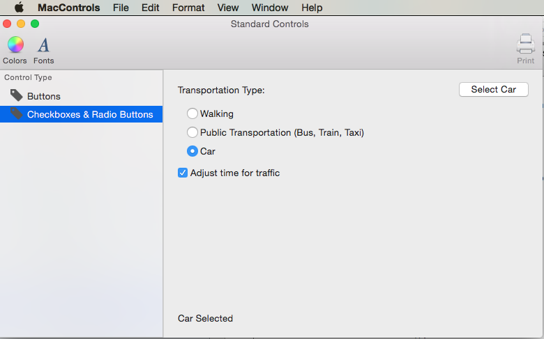](standard-controls-images/buttons02.png#lightbox)

Checkboxes and Radio Buttons (exposed via **Outlets**) have a state (like **On** and **Off**), the state can be checked or set with the `State` property against the `NSCellStateValue` enum. For example:

```csharp
AdjustTime.Activated += (sender, e) => {
    FeedbackLabel.StringValue = string.Format("Adjust Time: {0}",AdjustTime.State == NSCellStateValue.On);
};
```

Where `NSCellStateValue` can be:

- **On** - The button is pushed or the control is selected (such as a check in a Check Box).
- **Off** - The button is not pushed or the control is not selected.
- **Mixed** - A mixture of **On** and **Off** states.

To select a button in a Radio Button Group, expose the Radio Button to select as an **Outlet** and set its `State` property. For Example:

```csharp
partial void SelectCar (Foundation.NSObject sender) {
    TransportationCar.State = NSCellStateValue.On;
    FeedbackLabel.StringValue = "Car Selected";
}
```

To get a collection of radio buttons to act as a group and automatically handle the selected state, create a new **Action** and attach every button in the group to it:

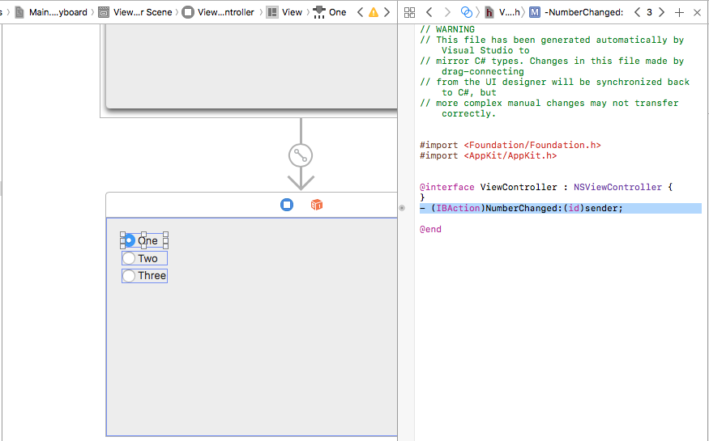

Next, assign a unique `Tag` to each radio button in the **Attribute Inspector**:


Save your changes and return to Visual Studio for Mac, add the code to handle the **Action** that all of the radio buttons are attached to:

```csharp
partial void NumberChanged(Foundation.NSObject sender)
{
    var check = sender as NSButton;
    Console.WriteLine("Changed to {0}", check.Tag);
}
```

You can use the `Tag` property to see which radio button was selected.

<a name="Working_with_Menu_Controls"></a>

## Working with Menu Controls

AppKit provides several types of Menu Controls that can be used in your User Interface Design. For more information, please see the [Menu Controls](https://developer.apple.com/library/mac/documentation/UserExperience/Conceptual/OSXHIGuidelines/ControlswithMenus.html#//apple_ref/doc/uid/20000957-CH100-SW1) section of Apple's [OS X Human Interface Guidelines](https://developer.apple.com/library/mac/documentation/UserExperience/Conceptual/OSXHIGuidelines/). 

[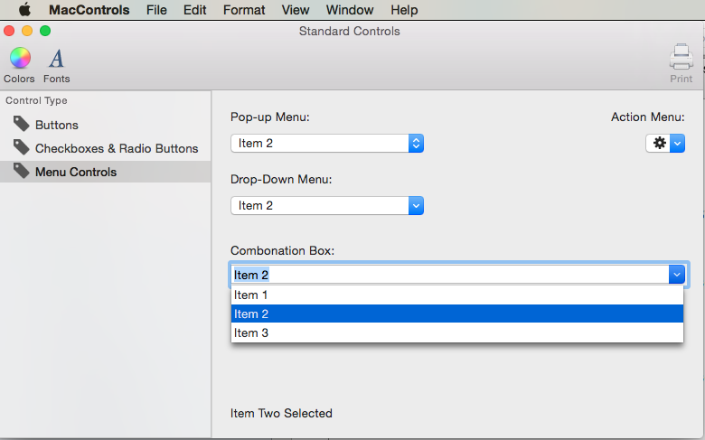](standard-controls-images/menu01.png#lightbox)

<a name="Providing-Menu-Control-Data"></a>

### Providing Menu Control Data

The Menu Controls available to macOS can be set to populate the dropdown list either from an internal list (that can be pre-defined in Interface Builder or populated via code) or by providing your own custom, external data source.

<a name="Working-with-Internal-Data"></a>

#### Working with Internal Data

In addition to defining items in Interface Builder, Menu Controls (such as `NSComboBox`), provide a complete set of methods that allow you to Add, Edit or Delete the items from the internal list that they maintain:

- `Add` - Adds a new item to the end of the list.
- `GetItem` - Returns the item at the given index.
- `Insert` - Inserts a new item in the list at the given location.
- `IndexOf` - Returns the index of the given item.
- `Remove` - Removes the given item from the list.
- `RemoveAll` - Removes all items from the list.
- `RemoveAt` - Removes the item at the given index.
- `Count` - Returns the number of items in the list.

> [!IMPORTANT]
> If you are using an Extern Data Source (`UsesDataSource = true`), calling any of the above methods will throw an exception.

<a name="Working-with-an-External-Data-Source"></a>

#### Working with an External Data Source

Instead of using the built-in Internal Data to provide the rows for your Menu Control, you can optionally use an External Data Source and provide your own backing store for the items (such as a SQLite database).

To work with an External Data Source, you'll create an instance of the Menu Control's Data Source (`NSComboBoxDataSource` for example) and override several methods to provide the necessary data:

- `ItemCount` - Returns the number of items in the list.
- `ObjectValueForItem` - Returns the value of the item for a given index.
- `IndexOfItem` - Returns the index for the give item value.
- `CompletedString` - Returns the first matching item value for the partially typed item value. This method is only called if Autocomplete has been enabled (`Completes = true`).

Please see the [Databases and ComboBoxes](~/mac/app-fundamentals/databases.md#Databases-and-ComboBoxes) section of the [Working with Databases](~/mac/app-fundamentals/databases.md) document for more details.

<a name="Adjusting-the-Lists-Appearance"></a>

### Adjusting the List's Appearance

The following methods are available to adjust the Menu Control's appearance:

- `HasVerticalScroller` - If `true`, the control will display a vertical scrollbar. 
- `VisibleItems` - Adjust the number of items displayed when the control is opened. The default value is five (5).
- `IntercellSpacing` - Adjust the amount of space around a given item by providing a `NSSize` where the `Width` specifies the left and right margins and the `Height` specifies the space before and after an item.
- `ItemHeight` - Specifies the height of each item in the list.

For Drop-Down types of `NSPopupButtons`, the first Menu Item provides the title for the control. For Example: 

[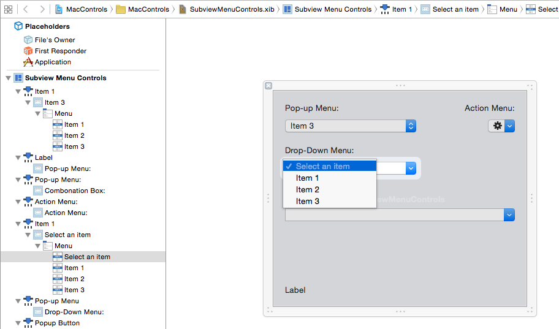](standard-controls-images/menu02.png#lightbox)

To change the title, expose this item as an **Outlet** and use code like the following:

```csharp
DropDownSelected.Title = "Item 1";
```

<a name="Manipulating-the-Selected-Items"></a>

### Manipulating the Selected Items

The following methods and properties allow you to manipulate the selected items in the Menu Control's list:

- `SelectItem` - Selects the item at the given index.
- `Select` - Select the given item value.
- `DeselectItem` - Deselects the item at the given index.
- `SelectedIndex` - Returns the index of the currently selected item.
- `SelectedValue` - Returns the value of the currently selected item.

Use the `ScrollItemAtIndexToTop` to present the item at the given index at the top of the list and the `ScrollItemAtIndexToVisible` to scroll to list until the item at the given index is visible.

<a name="Responding to Events"></a>

### Responding to Events

Menu Controls provide the following events to respond to user interaction:

- `SelectionChanged` - Is called when the user has selected a value from the list.
- `SelectionIsChanging` - Is called before the new user selected item becomes the active selection.
- `WillPopup` - Is called before the dropdown list of items is displayed.
- `WillDismiss` - Is called before the dropdown list of items is closed.

For `NSComboBox` controls, they include all of the same events as the `NSTextField`, such as the `Changed` event that is called whenever the user edits the value of the text in the Combo Box.

Optionally, you can respond the a Internal Data Menu Items defined in Interface Builder being selected by attaching the item to an **Action** and use code like the following to respond to **Action** being triggered by the user:

```csharp
partial void ItemOne (Foundation.NSObject sender) {
    DropDownSelected.Title = "Item 1";
    FeedbackLabel.StringValue = "Item One Selected";
}
```

For more information on working with Menus and Menu Controls, please see our [Menus](~/mac/user-interface/menu.md) and [Pop-up Button and Pull-Down Lists](~/mac/user-interface/menu.md) documentation.

<a name="Working_with_Selection_Controls"></a>

## Working with Selection Controls

AppKit provides several types of Selection Controls that can be used in your User Interface Design. For more information, please see the [Selection Controls](https://developer.apple.com/library/mac/documentation/UserExperience/Conceptual/OSXHIGuidelines/ControlsSelection.html#//apple_ref/doc/uid/20000957-CH49-SW1) section of Apple's [OS X Human Interface Guidelines](https://developer.apple.com/library/mac/documentation/UserExperience/Conceptual/OSXHIGuidelines/). 

[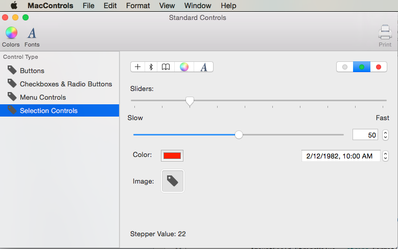](standard-controls-images/select01.png#lightbox)

There are two ways to track when a Selection Control has user interaction, by exposing it as an **Action**. For example:

```csharp
partial void SegmentButtonPressed (Foundation.NSObject sender) {
    FeedbackLabel.StringValue = string.Format("Button {0} Pressed",SegmentButtons.SelectedSegment);
}
```

Or by attaching a **Delegate** to the `Activated` event. For example:

```csharp
TickedSlider.Activated += (sender, e) => {
    FeedbackLabel.StringValue = string.Format("Stepper Value: {0:###}",TickedSlider.IntValue);
};
```

To set or read the value of a Selection Control, use the `IntValue` property. For example:

```csharp
FeedbackLabel.StringValue = string.Format("Stepper Value: {0:###}",TickedSlider.IntValue);
```

The specialty controls (such as Color Well and Image Well) have specific properties for their value types. For Example:

```csharp
ColorWell.Color = NSColor.Red;
ImageWell.Image = NSImage.ImageNamed ("tag.png");

```

The `NSDatePicker` has the following properties for working directly with Date and Time:

- **DateValue** - The current date and time value as a `NSDate`.
- **Local** - The user's location as a `NSLocal`.
- **TimeInterval** - The time value as a `Double`.
- **TimeZone** - The user's time zone as a `NSTimeZone`.

<a name="Working_with_Indicator_Controls"></a>

## Working with Indicator Controls

AppKit provides several types of Indicator Controls that can be used in your User Interface Design. For more information, please see the [Indicator Controls](https://developer.apple.com/library/mac/documentation/UserExperience/Conceptual/OSXHIGuidelines/ControlsIndicators.html#//apple_ref/doc/uid/20000957-CH50-SW1) section of Apple's [OS X Human Interface Guidelines](https://developer.apple.com/library/mac/documentation/UserExperience/Conceptual/OSXHIGuidelines/). 

[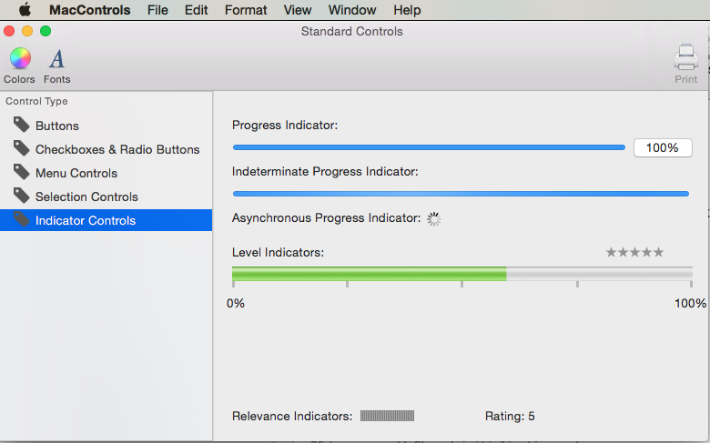](standard-controls-images/level01.png#lightbox)

There are two ways to track when a Indicator Control has user interaction, either by exposing it as an **Action** or an **Outlet** and attaching a **Delegate** to the `Activated` event. For example:

```csharp
LevelIndicator.Activated += (sender, e) => {
    FeedbackLabel.StringValue = string.Format("Level: {0:###}",LevelIndicator.DoubleValue);
};
```

To read or set the value of the Indicator Control, use the `DoubleValue` property. For example:

```csharp
FeedbackLabel.StringValue = string.Format("Rating: {0:###}",Rating.DoubleValue);
```

The Indeterminate and Asynchronous Progress Indicators should be animated when displayed. Use the `StartAnimation` method to start the animation when they are displayed. For example:

```csharp
Indeterminate.StartAnimation (this);
AsyncProgress.StartAnimation (this);
```

Calling the `StopAnimation` method will stop the animation.

<a name="Working_with_Text_Controls"></a>

## Working with Text Controls

AppKit provides several types of Text Controls that can be used in your User Interface Design. For more information, please see the [Text Controls](https://developer.apple.com/library/mac/documentation/UserExperience/Conceptual/OSXHIGuidelines/ControlsText.html#//apple_ref/doc/uid/20000957-CH51-SW1) section of Apple's [OS X Human Interface Guidelines](https://developer.apple.com/library/mac/documentation/UserExperience/Conceptual/OSXHIGuidelines/). 

[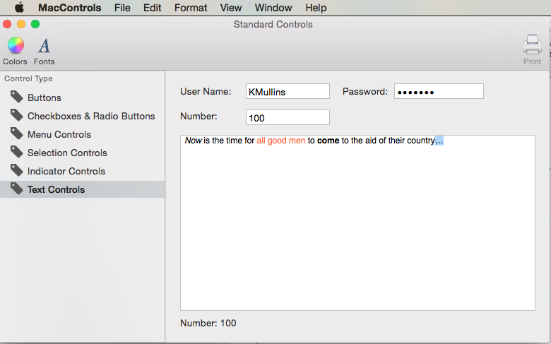](standard-controls-images/text01.png#lightbox)

For Text Fields (`NSTextField`), the following events can be used to track user interaction:

- **Changed** - Is fired any time the user changes the value of the field. For example, on every character typed.
- **EditingBegan** - Is fired when the user selects the field for editing.
- **EditingEnded** - When the user presses the Enter key in the field or leaves the field.

Use the `StringValue` property to read or set the field's value. For example:

```csharp
FeedbackLabel.StringValue = string.Format("User ID: {0}",UserField.StringValue);
```

For fields that display or edit numerical values, you can use the `IntValue` property. For example:

```csharp
FeedbackLabel.StringValue = string.Format("Number: {0}",NumberField.IntValue);
```

An `NSTextView` provides a full featured text edit and display area with built-in formatting. Like a `NSTextField`, use the `StringValue` property to read or set the area's value.

For an example of a complex example of working with Text Views in a Xamarin.Mac app, please see the [SourceWriter Sample App](/samples/xamarin/mac-samples/sourcewriter). SourceWriter is a simple source code editor that provides support for code completion and simple syntax highlighting.

The SourceWriter code has been fully commented and, where available, links have be provided from key technologies or methods to relevant information in the Xamarin.Mac Guides Documentation.

<a name="Working_with_Content_Views"></a>

## Working with Content Views

AppKit provides several types of Content Views that can be used in your User Interface Design. For more information, please see the [Content Views](https://developer.apple.com/library/mac/documentation/UserExperience/Conceptual/OSXHIGuidelines/ControlsView.html#//apple_ref/doc/uid/20000957-CH52-SW1) section of Apple's [OS X Human Interface Guidelines](https://developer.apple.com/library/mac/documentation/UserExperience/Conceptual/OSXHIGuidelines/).

[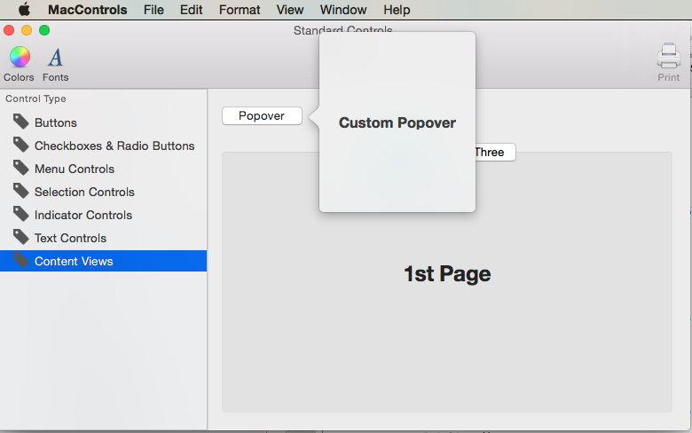](standard-controls-images/content01.png#lightbox)

<a name="Popovers"></a>

### Popovers

A popover is a transient UI element that provides functionality that is directly related to a specific a control or an onscreen area. A popover floats above the window that contains the control or area that it’s related to, and its border includes an arrow to indicate the point from which it emerged.

To create a popover, do the following:

1. Open the `.storyboard` file of the window that you want to add a popover to by double-clicking it in the **Solution Explorer**
2. Drag a **View Controller** from the **Library Inspector** onto the **Interface Editor**: 

    [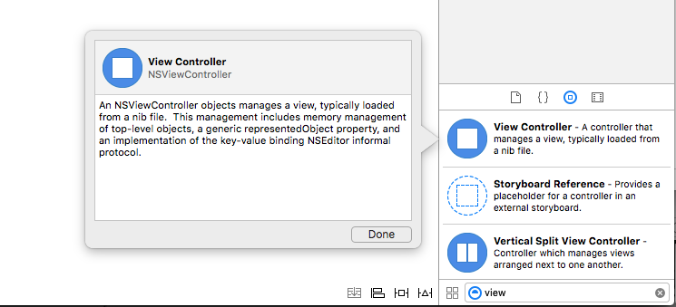](standard-controls-images/content02.png#lightbox)
3. Define the size and the layout of the **Custom View**: 

    [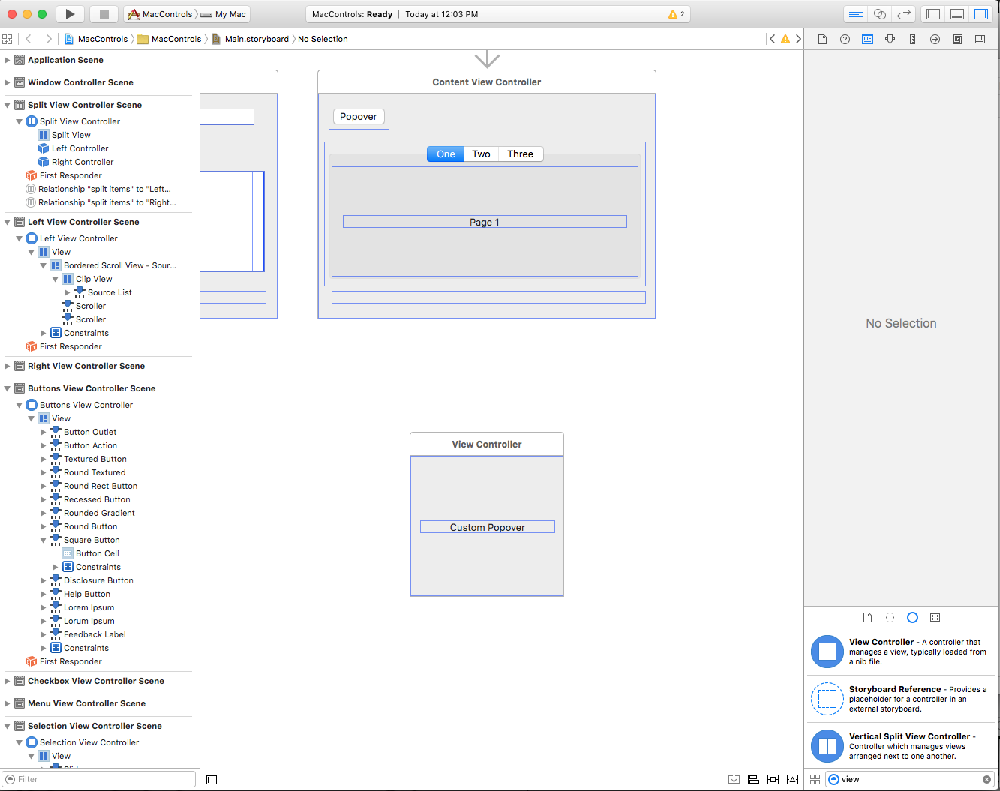](standard-controls-images/content04.png#lightbox)
4. Control-click and drag from the source of the popup onto the **View Controller**: 

    [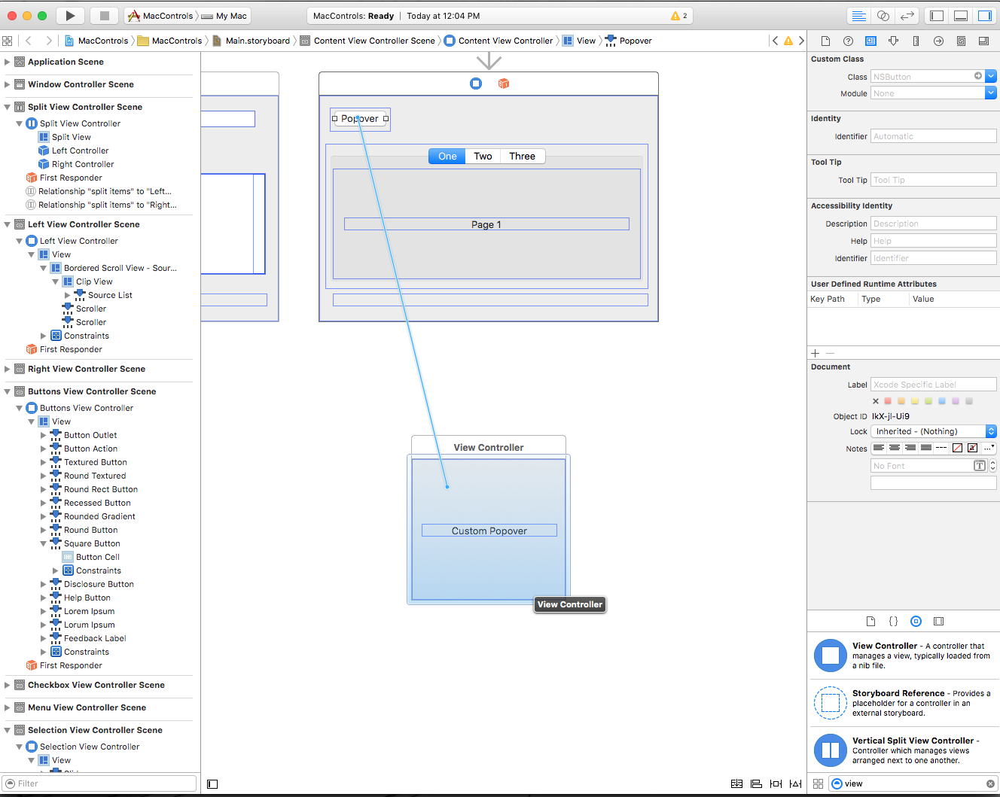](standard-controls-images/content05.png#lightbox)
5. Select **Popover** from the popup menu: 

    [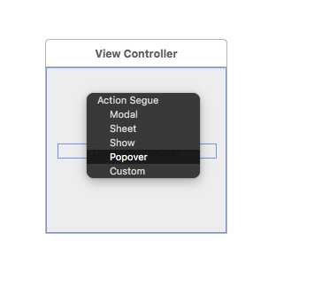](standard-controls-images/content06.png#lightbox)
6. Save your changes and return to Visual Studio for Mac to sync with Xcode.

<a name="Tab_Views"></a>

### Tab Views

Tab Views consists of a Tab List (which looks similar to a Segmented Control) combined with a set of views that are called _Panes_. When the user selects a new Tab, the Pane that is attached to it will be displayed. Each Pane contains its own set of controls.

When working with a Tab View in Xcode's Interface Builder, use the **Attribute Inspector** to set the number of Tabs:

[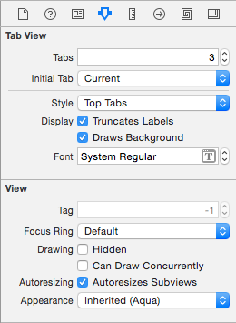](standard-controls-images/content08.png#lightbox)

Select each Tab in the **Interface Hierarchy** to set its **Title** and add UI Elements to its **Pane**:

[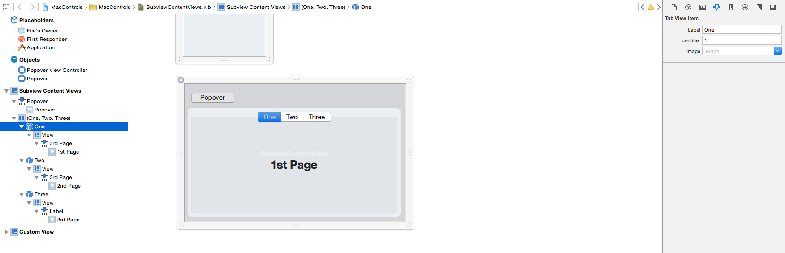](standard-controls-images/content09.png#lightbox)

<a name="Data_Binding_AppKit_Controls"></a>

## Data Binding AppKit Controls

By using Key-Value Coding and Data Binding techniques in your Xamarin.Mac application, you can greatly decrease the amount of code that you have to write and maintain to populate and work with UI elements. You also have the benefit of further decoupling your backing data (_Data Model_) from your front end User Interface (_Model-View-Controller_), leading to easier to maintain, more flexible application design.

Key-Value Coding (KVC) is a mechanism for accessing an object’s properties indirectly, using keys (specially formatted strings) to identify properties instead of accessing them through instance variables or accessor methods (`get/set`). By implementing Key-Value Coding compliant accessors in your Xamarin.Mac application, you gain access to other macOS features such as Key-Value Observing (KVO), Data Binding, Core Data, Cocoa bindings, and scriptability.

For more information, please see the [Simple Data Binding](~/mac/app-fundamentals/databinding.md#Simple_Data_Binding) section of our [Data Binding and Key-Value Coding](~/mac/app-fundamentals/databinding.md) documentation.

<a name="Summary"></a>

## Summary

This article has taken a detailed look at working with the standard AppKit controls such as Buttons, Labels, Text Fields, Check Boxes and Segmented Controls in a Xamarin.Mac application. It covered adding them to a User Interface Design in Xcode's Interface Builder, exposing them to code through Outlets and Actions and working with AppKit Controls in C# Code.

## Related Links

- [MacControls (sample)](/samples/xamarin/mac-samples/maccontrols)
- [Hello, Mac](~/mac/get-started/hello-mac.md)
- [Windows](~/mac/user-interface/window.md)
- [Data Binding and Key-Value Coding](~/mac/app-fundamentals/databinding.md)
- [OS X Human Interface Guidelines](https://developer.apple.com/library/mac/documentation/UserExperience/Conceptual/OSXHIGuidelines/)
- [About Controls and Views](https://developer.apple.com/library/mac/documentation/UserExperience/Conceptual/OSXHIGuidelines/ControlsAll.html#//apple_ref/doc/uid/20000957-CH46-SW1)