# Table Views in Xamarin.Mac

_This article covers working with table views in a Xamarin.Mac application. It describes creating table views in Xcode and Interface Builder and interacting with them in code._

When working with C# and .NET in a Xamarin.Mac application, you have access to the same Table Views that a developer working in *Objective-C* and *Xcode* does. Because Xamarin.Mac integrates directly with Xcode, you can use Xcode's _Interface Builder_ to create and maintain your Table Views (or optionally create them directly in C# code).

A Table View displays data in a tabular format containing one or more columns of information in multiple rows. Based on the type of Table View being created, the user can sort by column, reorganize columns, add columns, remove columns or edit the data contained within the table.

[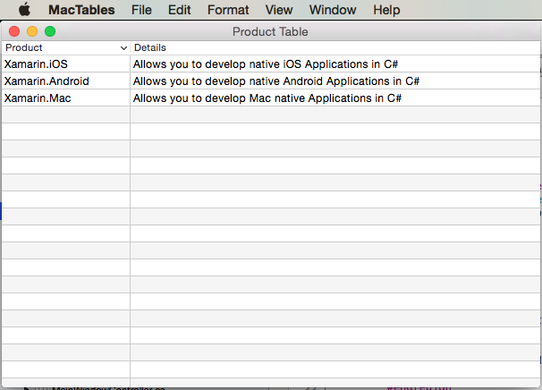](table-view-images/intro01.png#lightbox)

In this article, we'll cover the basics of working with Table Views in a Xamarin.Mac application. It is highly suggested that you work through the [Hello, Mac](~/mac/get-started/hello-mac.md) article first, specifically the [Introduction to Xcode and Interface Builder](~/mac/get-started/hello-mac.md#introduction-to-xcode-and-interface-builder) and [Outlets and Actions](~/mac/get-started/hello-mac.md#outlets-and-actions) sections, as it covers key concepts and techniques that we'll be using in this article.

You may want to take a look at the [Exposing C# classes / methods to Objective-C](~/mac/internals/how-it-works.md) section of the [Xamarin.Mac Internals](~/mac/internals/how-it-works.md) document as well, it explains the `Register` and `Export` commands used to wire-up your C# classes to Objective-C objects and UI Elements.

<a name="Introduction_to_Table_Views"></a>

## Introduction to Table Views

A Table View displays data in a tabular format containing one or more columns of information in multiple rows. Table Views are displayed inside of Scroll Views (`NSScrollView`) and starting with macOS 10.7, you can use any `NSView` instead of Cells (`NSCell`) to display both rows and columns. That said, you can still use `NSCell` however, you'll typically subclass `NSTableCellView` and create your custom rows and columns.

A Table View does not store it's own data, instead it relies on a Data Source (`NSTableViewDataSource`) to provide both the rows and columns required, on a as-needed basis.

A Table View's behavior can be customized by providing a subclass of the Table View Delegate (`NSTableViewDelegate`) to support table column management, type to select functionality, row selection and editing, custom tracking, and custom views for individual columns and rows.

When creating Table Views, Apple suggests the following:

- Allow the user to sort the table by clicking on a Column Headers.
- Create Column Headers that are nouns or short noun phrases that describe the data being shown in that column.

For more information, please see the [Content Views](https://developer.apple.com/library/mac/documentation/UserExperience/Conceptual/OSXHIGuidelines/ControlsView.html#//apple_ref/doc/uid/20000957-CH52-SW1) section of Apple's [OS X Human Interface Guidelines](https://developer.apple.com/library/mac/documentation/UserExperience/Conceptual/OSXHIGuidelines/).

<a name="Creating-and-Maintaining-Table-Views-in-Xcode"></a>

## Creating and Maintaining Table Views in Xcode

When you create a new Xamarin.Mac Cocoa application, you get a standard blank, window by default. This windows is defined in a `.storyboard` file automatically included in the project. To edit your windows design, in the **Solution Explorer**, double click the `Main.storyboard` file:

[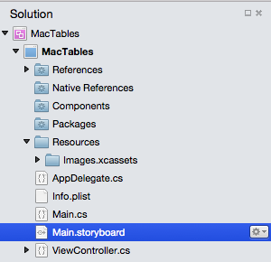](table-view-images/edit01.png#lightbox)

This will open the window design in Xcode's Interface Builder:

[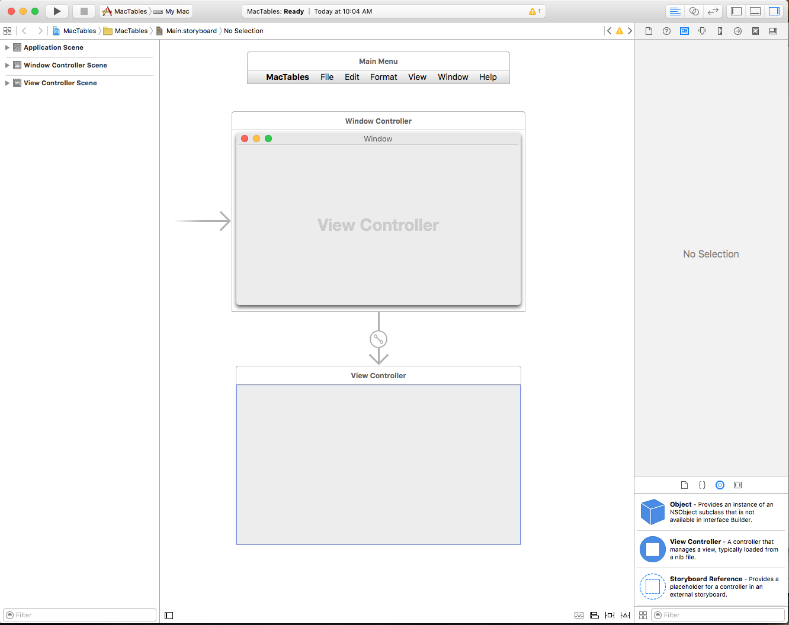](table-view-images/edit02.png#lightbox)

Type `table` into the **Library Inspector's** Search Box to make it easier to find the Table View controls:

[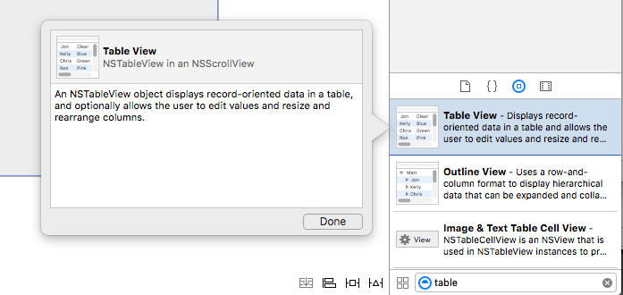](table-view-images/edit03.png#lightbox)

Drag a Table View onto the View Controller in the **Interface Editor**, make it fill the content area of the View Controller and set it to where it shrinks and grows with the window in the **Constraint Editor**:

[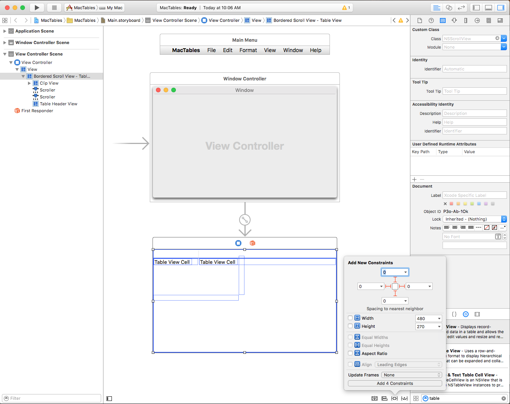](table-view-images/edit04.png#lightbox)

Select the Table View in the **Interface Hierarchy** and the following properties are available in the **Attribute Inspector**:

[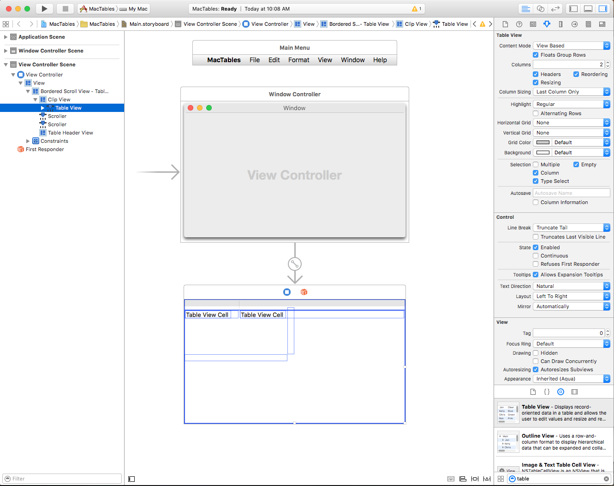](table-view-images/edit05.png#lightbox)

- **Content Mode** - Allows you to use either Views (`NSView`) or Cells (`NSCell`) to display the data in the rows and columns. Starting with macOS 10.7, you should use Views.
- **Floats Group Rows** - If `true`, the Table View will draw grouped cells as if they are floating.
- **Columns** - Defines the number of columns displayed.
- **Headers** - If `true`, the columns will have Headers.
- **Reordering** - If `true`, the user will be able to drag reorder the columns in the table.
- **Resizing** - If `true`, the user will be able to drag column Headers to resize columns.
- **Column Sizing** - Controls how the table will auto size columns.
- **Highlight** - Controls the type of highlighting the table uses when a cell is selected.
- **Alternate Rows** - If `true`, ever other row will have a different background color.
- **Horizontal Grid** - Selects the type of border drawn between cells horizontally.
- **Vertical Grid** - Selects the type of border drawn between cells vertically.
- **Grid Color** - Sets the cell border color.
- **Background** - Sets the cell background color.
- **Selection** - Allow you to control how the user can select cells in the table as:
  - **Multiple** - If `true`, the user can select multiple rows and columns.
  - **Column** - If `true`,the user can select columns.
  - **Type Select** - If `true`, the user can type a character to select a row.
  - **Empty** - If `true`, the user is not required to select a row or column, the table allows for no selection at all.
- **Autosave** - The name that the tables format is automatically save under.
- **Column Information** - If `true`, the order and width of the columns will be automatically saved.
- **Line Breaks** - Select how the cell handles line breaks.
- **Truncates Last Visible Line** - If `true`, the cell will be truncated in the data can not fit inside it's bounds.

> [!IMPORTANT]
> Unless you are maintaining a legacy Xamarin.Mac application, `NSView` based Table Views should be used over `NSCell` based Table Views. `NSCell` is considered legacy and may not be supported going forward.

Select a Table Column in the **Interface Hierarchy** and the following properties are available in the **Attribute Inspector**:

[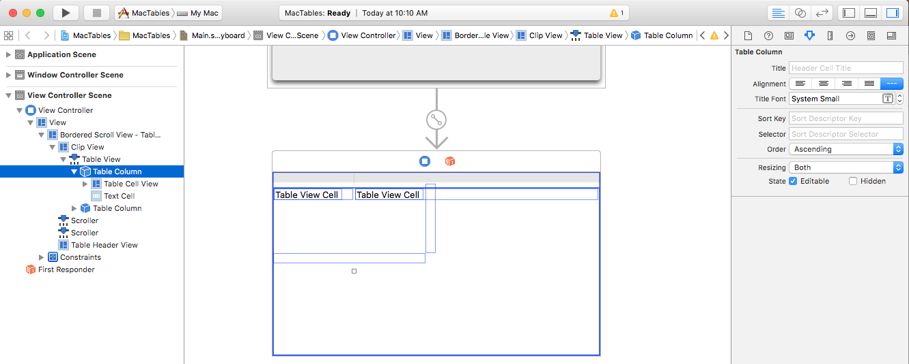](table-view-images/edit06.png#lightbox)

- **Title** - Sets the title of the column.
- **Alignment** - Set the alignment of the text within the cells.
- **Title Font** - Selects the font for the cell's Header text.
- **Sort Key** - Is the key used to sort data in the column. Leave blank if the user cannot sort this column.
- **Selector** - Is the **Action** used to perform the sort. Leave blank if the user cannot sort this column.
- **Order** - Is the sort order for the columns data.
- **Resizing** - Selects the type of resizing for the column.
- **Editable** - If `true`, the user can edit cells in a cell based table.
- **Hidden** - If `true`, the column is hidden.

You can also resize the column by dragging it's handle (vertically centered on the column's right side) left or right.

Let's select the each Column in our Table View and give the first column a **Title** of `Product` and the second one `Details`.

Select a Table Cell View (`NSTableViewCell`) in the **Interface Hierarchy** and the following properties are available in the **Attribute Inspector**:

[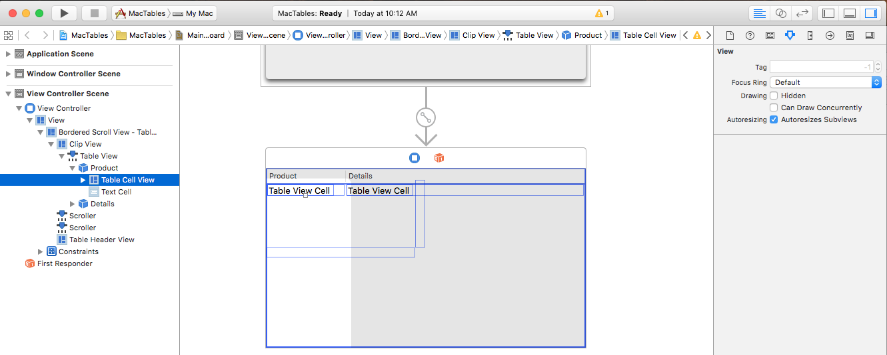](table-view-images/edit07.png#lightbox)

These are all of the properties of a standard View. You also have the option of resizing the rows for this column here.

Select a Table View Cell (by default, this is a `NSTextField`) in the **Interface Hierarchy** and the following properties are available in the **Attribute Inspector**:

[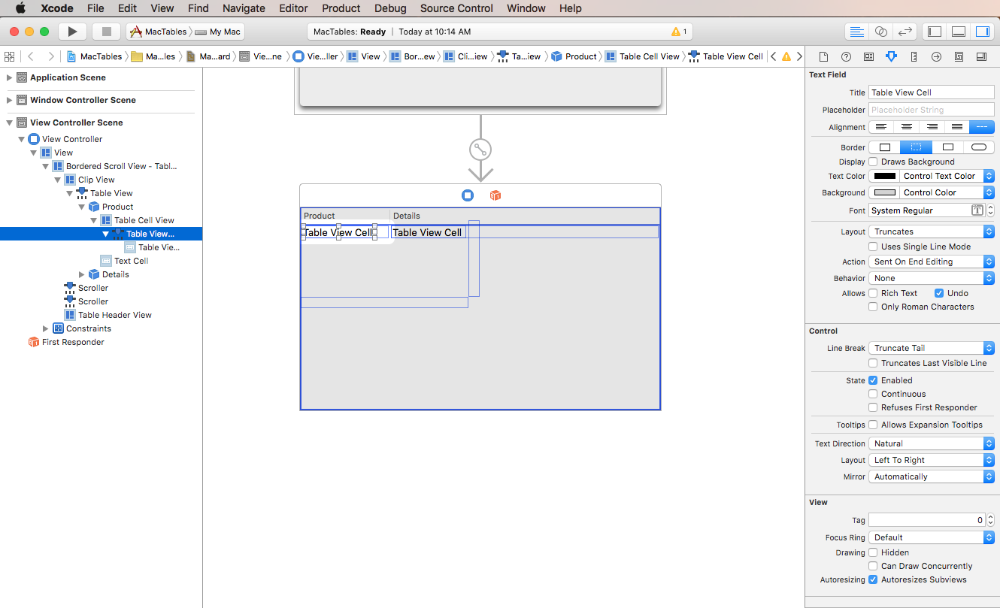](table-view-images/edit08.png#lightbox)

You'll have all the properties of a standard text field to set here. By default, a standard Text Field is used to display data for a cell in a column.

Select a Table Cell View (`NSTableFieldCell`) in the **Interface Hierarchy** and the following properties are available in the **Attribute Inspector**:

[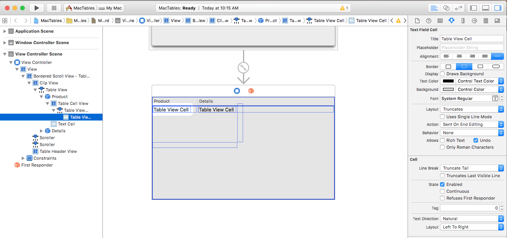](table-view-images/edit09.png#lightbox)

The most important settings here are:

- **Layout** - Select how cells in this column are laid out.
- **Uses Single Line Mode** - If `true`, the cell is limited to a single line.
- **First Runtime Layout Width** - If `true`, the cell will prefer the width set for it (either manually or automatically) when it is displayed the first time the application is run.
- **Action** - Controls when the Edit **Action** is sent for the cell.
- **Behavior** - Defines if a cell is selectable or editable.
- **Rich Text** - If `true`, the cell can display formatted and styled text.
- **Undo** - If `true`, the cell assumes responsibility for it's undo behavior.

Select the Table Cell View (`NSTableFieldCell`) at the bottom of a Table Column in the **Interface Hierarchy**:

[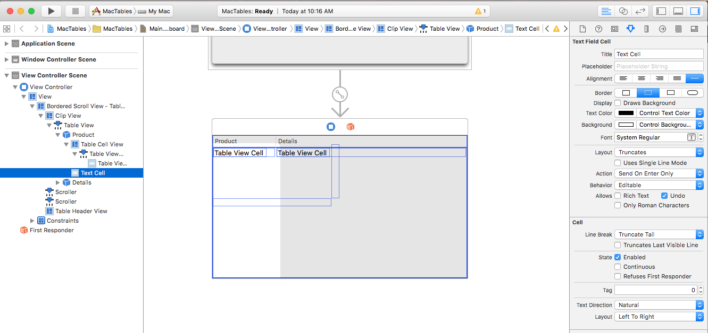](table-view-images/edit10.png#lightbox)

This allows you to edit the Table Cell View used as the base _Pattern_ for all cells created for the given column.

<a name="Adding_Actions_and_Outlets"></a>

### Adding Actions and Outlets

Just like any other Cocoa UI control, we need to expose our Table View and it's columns and cells to C# code using **Actions** and **Outlets** (based on the functionality required).

The process is the same for any Table View element that we want to expose:

1. Switch to the **Assistant Editor** and ensure that the `ViewController.h` file is selected: 

    [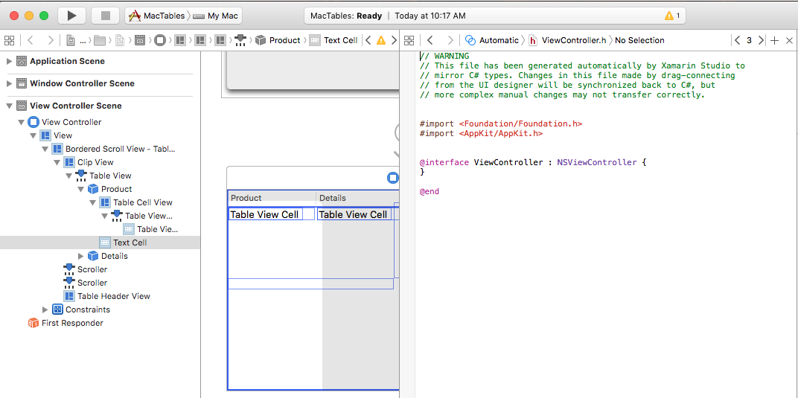](table-view-images/edit11.png#lightbox)
2. Select the Table View from the **Interface Hierarchy**, control-click and drag to the `ViewController.h` file.
3. Create an **Outlet** for the Table View called `ProductTable`: 

    [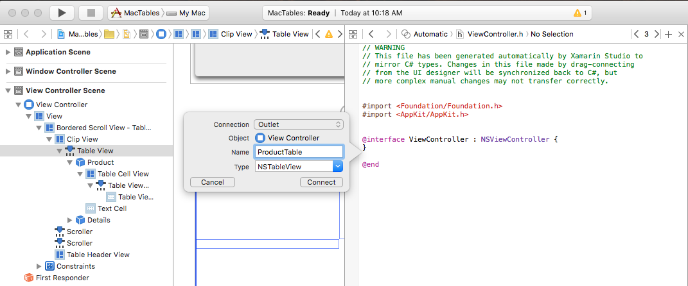](table-view-images/edit13.png#lightbox)
4. Create **Outlets** for the tables columns as well called `ProductColumn` and `DetailsColumn`: 

    [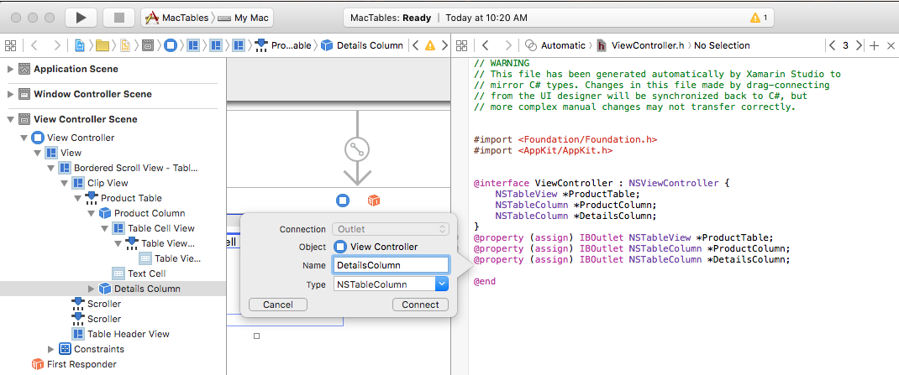](table-view-images/edit14.png#lightbox)
5. Save you changes and return to Visual Studio for Mac to sync with Xcode.

Next, we'll write the code display some data for the table when the application is run.

<a name="Populating_the_Table_View"></a>

## Populating the Table View

With our Table View designed in Interface Builder and exposed via an **Outlet**, next we need to create the C# code to populate it.

First, let's create a new `Product` class to hold the information for the individual rows. In the **Solution Explorer**, right-click the Project and select **Add** > **New File...** Select **General** > **Empty Class**, enter `Product` for the **Name** and click the **New** button:

[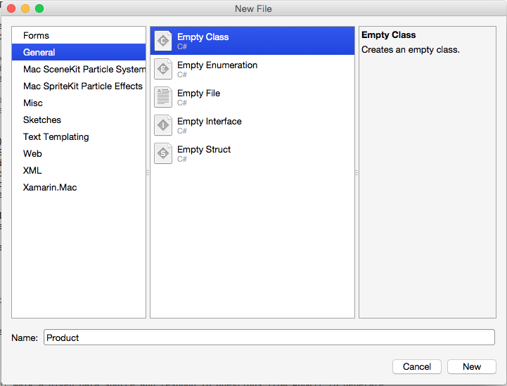](table-view-images/populate01.png#lightbox)

Make the `Product.cs` file look like the following:

```csharp
using System;

namespace MacTables
{
  public class Product
  {
    #region Computed Properties
    public string Title { get; set;} = "";
    public string Description { get; set;} = "";
    #endregion

    #region Constructors
    public Product ()
    {
    }

    public Product (string title, string description)
    {
      this.Title = title;
      this.Description = description;
    }
    #endregion
  }
}

```

Next, we need to create a subclass of `NSTableDataSource` to provide the data for our table as it is requested. In the **Solution Explorer**, right-click the Project and select **Add** > **New File...** Select **General** > **Empty Class**, enter `ProductTableDataSource` for the **Name** and click the **New** button.

Edit the `ProductTableDataSource.cs` file and make it look like the following:

```csharp
using System;
using AppKit;
using CoreGraphics;
using Foundation;
using System.Collections;
using System.Collections.Generic;

namespace MacTables
{
  public class ProductTableDataSource : NSTableViewDataSource
  {
    #region Public Variables
    public List<Product> Products = new List<Product>();
    #endregion

    #region Constructors
    public ProductTableDataSource ()
    {
    }
    #endregion

    #region Override Methods
    public override nint GetRowCount (NSTableView tableView)
    {
      return Products.Count;
    }
    #endregion
  }
}

```

This class has storage for our Table View's items and overrides the `GetRowCount` to return the number of rows in the table.

Finally, we need to create a subclass of `NSTableDelegate` to provide the behavior for our table. In the **Solution Explorer**, right-click the Project and select **Add** > **New File...** Select **General** > **Empty Class**, enter `ProductTableDelegate` for the **Name** and click the **New** button.

Edit the `ProductTableDelegate.cs` file and make it look like the following:

```csharp
using System;
using AppKit;
using CoreGraphics;
using Foundation;
using System.Collections;
using System.Collections.Generic;

namespace MacTables
{
  public class ProductTableDelegate: NSTableViewDelegate
  {
    #region Constants 
    private const string CellIdentifier = "ProdCell";
    #endregion

    #region Private Variables
    private ProductTableDataSource DataSource;
    #endregion

    #region Constructors
    public ProductTableDelegate (ProductTableDataSource datasource)
    {
      this.DataSource = datasource;
    }
    #endregion

    #region Override Methods
    public override NSView GetViewForItem (NSTableView tableView, NSTableColumn tableColumn, nint row)
    {
      // This pattern allows you reuse existing views when they are no-longer in use.
      // If the returned view is null, you instance up a new view
      // If a non-null view is returned, you modify it enough to reflect the new data
      NSTextField view = (NSTextField)tableView.MakeView (CellIdentifier, this);
      if (view == null) {
        view = new NSTextField ();
        view.Identifier = CellIdentifier;
        view.BackgroundColor = NSColor.Clear;
        view.Bordered = false;
        view.Selectable = false;
        view.Editable = false;
      }

      // Setup view based on the column selected
      switch (tableColumn.Title) {
      case "Product":
        view.StringValue = DataSource.Products [(int)row].Title;
        break;
      case "Details":
        view.StringValue = DataSource.Products [(int)row].Description;
        break;
      }

      return view;
    }
    #endregion
  }
}
```

When we create an instance of the `ProductTableDelegate`, we also pass in an instance of the `ProductTableDataSource` that provides the data for the table. The `GetViewForItem` method is responsible for returning a view (data) to display the cell for a give column and row. If possible, an existing view will be reused to display the cell, if not a new view must be created.

To populate the table, let's edit the `ViewController.cs` file and make the `AwakeFromNib` method look like the following:

```csharp
public override void AwakeFromNib ()
{
  base.AwakeFromNib ();

  // Create the Product Table Data Source and populate it
  var DataSource = new ProductTableDataSource ();
  DataSource.Products.Add (new Product ("Xamarin.iOS", "Allows you to develop native iOS Applications in C#"));
  DataSource.Products.Add (new Product ("Xamarin.Android", "Allows you to develop native Android Applications in C#"));
  DataSource.Products.Add (new Product ("Xamarin.Mac", "Allows you to develop Mac native Applications in C#"));

  // Populate the Product Table
  ProductTable.DataSource = DataSource;
  ProductTable.Delegate = new ProductTableDelegate (DataSource);
}
```

If we run the application, the following is displayed:

[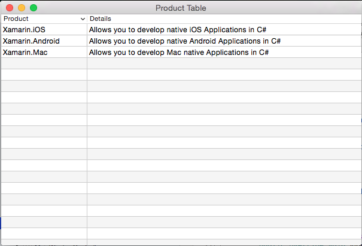](table-view-images/populate02.png#lightbox)

<a name="Sorting_by_Column"></a>

## Sorting by Column

Let's allow the user to sort the data in the table by clicking on a Column Header. First, double-click the `Main.storyboard` file to open it for editing in Interface Builder. Select the `Product` column, enter `Title` for the **Sort Key**, `compare:` for the **Selector** and select `Ascending` for the **Order**:

[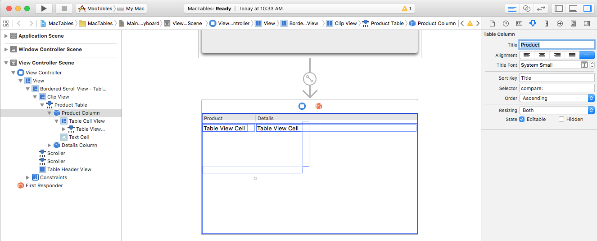](table-view-images/sort01.png#lightbox)

Select the `Details` column, enter `Description` for the **Sort Key**, `compare:` for the **Selector** and select `Ascending` for the **Order**:

[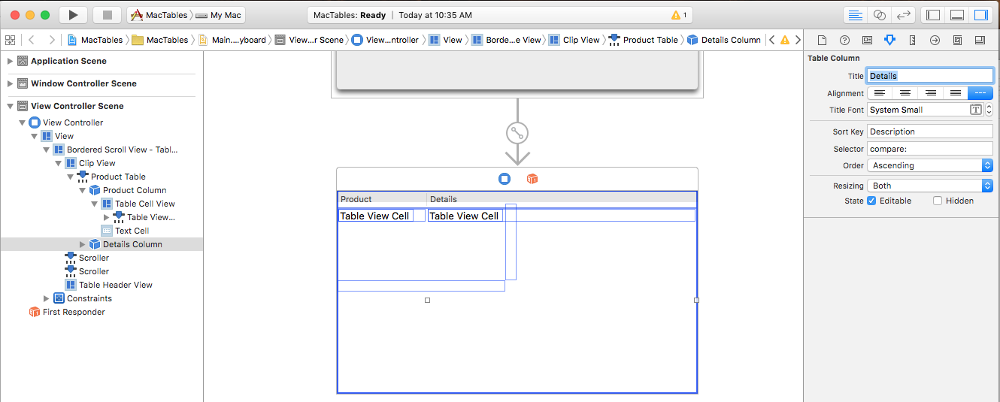](table-view-images/sort02.png#lightbox)

Save your changes and return to Visual Studio for Mac to sync with Xcode.

Now let's edit the `ProductTableDataSource.cs` file and add the following methods:

```csharp
public void Sort(string key, bool ascending) {

  // Take action based on key
  switch (key) {
  case "Title":
    if (ascending) {
      Products.Sort ((x, y) => x.Title.CompareTo (y.Title));
    } else {
      Products.Sort ((x, y) => -1 * x.Title.CompareTo (y.Title));
    }
    break;
  case "Description":
    if (ascending) {
      Products.Sort ((x, y) => x.Description.CompareTo (y.Description));
    } else {
      Products.Sort ((x, y) => -1 * x.Description.CompareTo (y.Description));
    }
    break;
  }

}

public override void SortDescriptorsChanged (NSTableView tableView, NSSortDescriptor[] oldDescriptors)
{
  // Sort the data
  if (oldDescriptors.Length > 0) {
    // Update sort
    Sort (oldDescriptors [0].Key, oldDescriptors [0].Ascending);
  } else {
    // Grab current descriptors and update sort
    NSSortDescriptor[] tbSort = tableView.SortDescriptors; 
    Sort (tbSort[0].Key, tbSort[0].Ascending); 
  }
      
  // Refresh table
  tableView.ReloadData ();
}
```

The `Sort` method allow us to sort the data in the Data Source based on a given `Product` class field in either ascending or descending order. The overridden `SortDescriptorsChanged` method will be called every time the use clicks on a Column Heading. It will be passed the **Key** value that we set in Interface Builder and the sort order for that column.

If we run the application and click in the Column Headers, the rows will be sorted by that column:

[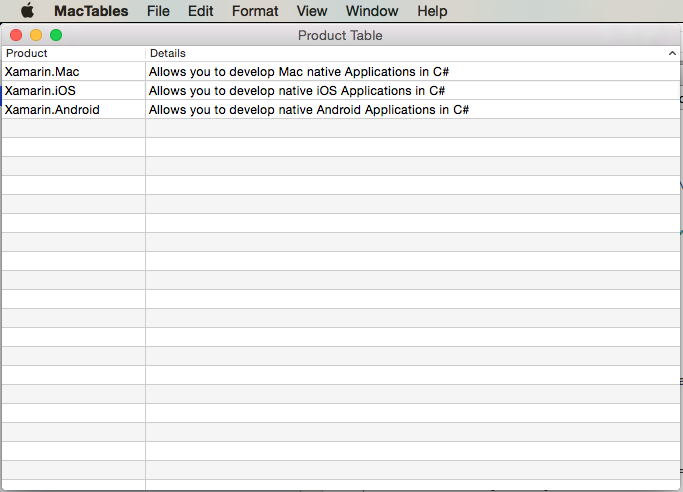](table-view-images/sort03.png#lightbox)

<a name="Row_Selection"></a>

## Row Selection

If you want to allow the user to select a single row, double-click the `Main.storyboard` file to open it for editing in Interface Builder. Select the Table View in the **Interface Hierarchy** and uncheck the **Multiple** checkbox in the **Attribute Inspector**:

[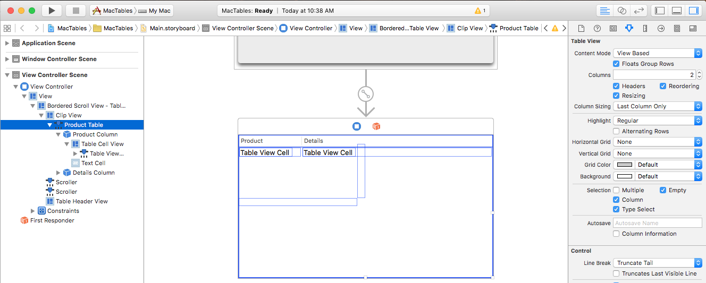](table-view-images/select01.png#lightbox)

Save your changes and return to Visual Studio for Mac to sync with Xcode.

Next, edit the `ProductTableDelegate.cs` file and add the following method:

```csharp
public override bool ShouldSelectRow (NSTableView tableView, nint row)
{
  return true;
}
```

This will allow the user to select any single row in the Table View. Return `false` for the `ShouldSelectRow` for any row that you don't want the user to be able to select or `false` for every row if you don't want the user to be able to select any rows.

The Table View (`NSTableView`) contains the following methods for working with row selection:

- `DeselectRow(nint)` - Deselects the given row in the table.
- `SelectRow(nint,bool)` - Selects the given row. Pass `false` for the second parameter to select only one row at a time.
- `SelectedRow` - Returns the current row selected in the table.
- `IsRowSelected(nint)` - Returns `true` if the given row is selected.

<a name="Multiple_Row_Selection"></a>

## Multiple Row Selection

If you want to allow the user to select a multiple rows, double-click the `Main.storyboard` file to open it for editing in Interface Builder. Select the Table View in the **Interface Hierarchy** and check the **Multiple** checkbox in the **Attribute Inspector**:

[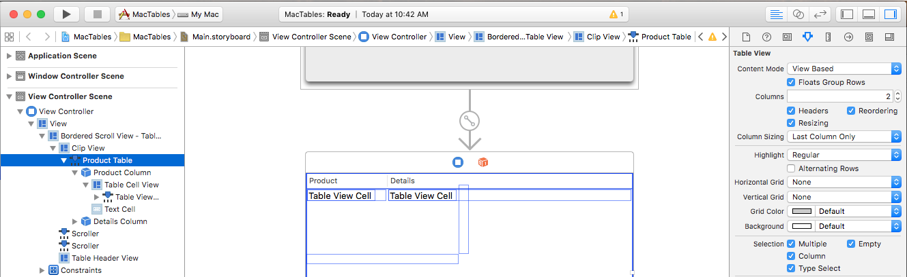](table-view-images/select02.png#lightbox)

Save your changes and return to Visual Studio for Mac to sync with Xcode.

Next, edit the `ProductTableDelegate.cs` file and add the following method:

```csharp
public override bool ShouldSelectRow (NSTableView tableView, nint row)
{
  return true;
}
```

This will allow the user to select any single row in the Table View. Return `false` for the `ShouldSelectRow` for any row that you don't want the user to be able to select or `false` for every row if you don't want the user to be able to select any rows.

The Table View (`NSTableView`) contains the following methods for working with row selection:

- `DeselectAll(NSObject)` - Deselects all rows in the table. Use `this` for the first parameter to send in the object doing the selecting. 
- `DeselectRow(nint)` - Deselects the given row in the table.
- `SelectAll(NSobject)` - Selects all rows in the table. Use `this` for the first parameter to send in the object doing the selecting.
- `SelectRow(nint,bool)` - Selects the given row. Pass `false` for the second parameter clear the selection and select only a single row, pass `true` to extend the selection and include this row.
- `SelectRows(NSIndexSet,bool)` - Selects the given set of rows. Pass `false` for the second parameter clear the selection and select only a these rows, pass `true` to extend the selection and include these rows.
- `SelectedRow` - Returns the current row selected in the table.
- `SelectedRows` - Returns a `NSIndexSet` containing the indexes of the selected rows.
- `SelectedRowCount` - Returns the number of selected rows.
- `IsRowSelected(nint)` - Returns `true` if the given row is selected.

<a name="Type_to_Select_Row"></a>

## Type to Select Row

If you want to allow the user to type a character with the Table View selected and select the first row that has that character, double-click the `Main.storyboard` file to open it for editing in Interface Builder. Select the Table View in the **Interface Hierarchy** and check the **Type Select** checkbox in the **Attribute Inspector**:

[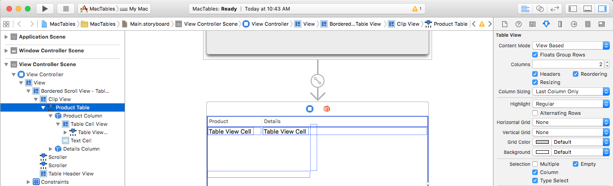](table-view-images/type01.png#lightbox)

Save your changes and return to Visual Studio for Mac to sync with Xcode.

Now let's edit the `ProductTableDelegate.cs` file and add the following method:

```csharp
public override nint GetNextTypeSelectMatch (NSTableView tableView, nint startRow, nint endRow, string searchString)
{
  nint row = 0;
  foreach(Product product in DataSource.Products) {
    if (product.Title.Contains(searchString)) return row;

    // Increment row counter
    ++row;
  }

  // If not found select the first row
  return 0;
}
```

The `GetNextTypeSelectMatch` method takes the given `searchString` and returns the row of the first `Product` that has that string in it's `Title`.

If we run the application and type a character, a row is selected:

[](table-view-images/type02.png#lightbox)

<a name="Reordering_Columns"></a>

## Reordering Columns

If you want to allow the user to drag reorder columns in the Table View, double-click the `Main.storyboard` file to open it for editing in Interface Builder. Select the Table View in the **Interface Hierarchy** and check the **Reordering** checkbox in the **Attribute Inspector**:

[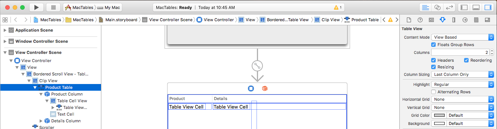](table-view-images/reorder01.png#lightbox)

If we give a value for the **Autosave** property and check the **Column Information** field, any changes we make to the table's layout will automatically be saved for us and restored the next time the application is run.

Save your changes and return to Visual Studio for Mac to sync with Xcode.

Now let's edit the `ProductTableDelegate.cs` file and add the following method:

```csharp
public override bool ShouldReorder (NSTableView tableView, nint columnIndex, nint newColumnIndex)
{
  return true;
}
```

The `ShouldReorder` method should return `true` for any column that it want to allow to be drag reordered into the `newColumnIndex`, else return `false`;

If we run the application, we can drag Column Headers around to reorder our columns:

[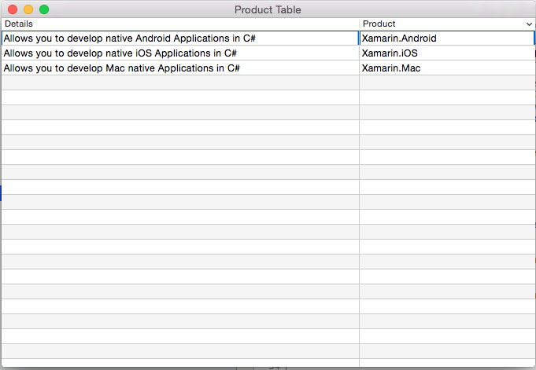](table-view-images/reorder02.png#lightbox)

<a name="Editing_Cells"></a>

## Editing Cells

If you want to allow the user to edit the values for a given cell, edit the `ProductTableDelegate.cs` file and change the `GetViewForItem` method as follows:

```csharp
public override NSView GetViewForItem (NSTableView tableView, NSTableColumn tableColumn, nint row)
{
  // This pattern allows you reuse existing views when they are no-longer in use.
  // If the returned view is null, you instance up a new view
  // If a non-null view is returned, you modify it enough to reflect the new data
  NSTextField view = (NSTextField)tableView.MakeView (tableColumn.Title, this);
  if (view == null) {
    view = new NSTextField ();
    view.Identifier = tableColumn.Title;
    view.BackgroundColor = NSColor.Clear;
    view.Bordered = false;
    view.Selectable = false;
    view.Editable = true;

    view.EditingEnded += (sender, e) => {
          
      // Take action based on type
      switch(view.Identifier) {
      case "Product":
        DataSource.Products [(int)view.Tag].Title = view.StringValue;
        break;
      case "Details":
        DataSource.Products [(int)view.Tag].Description = view.StringValue;
        break; 
      }
    };
  }

  // Tag view
  view.Tag = row;

  // Setup view based on the column selected
  switch (tableColumn.Title) {
  case "Product":
    view.StringValue = DataSource.Products [(int)row].Title;
    break;
  case "Details":
    view.StringValue = DataSource.Products [(int)row].Description;
    break;
  }

  return view;
}
```

Now if we run the application, the user can edit the cells in the Table View:

[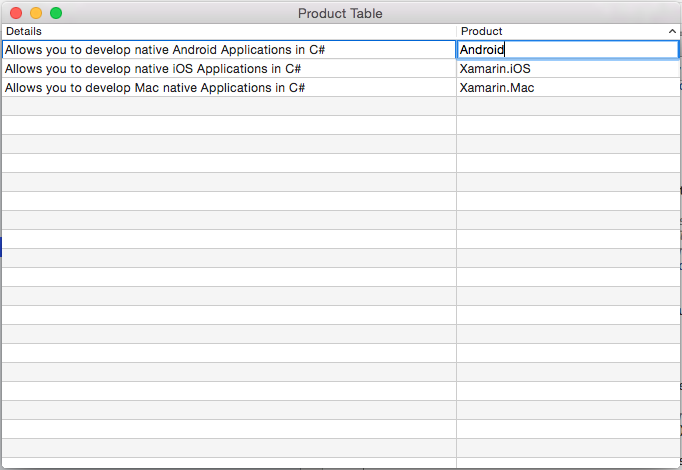](table-view-images/editing01.png#lightbox)

<a name="Using_Images_in_Table_Views"></a>

## Using Images in Table Views

To include an image as part of the cell in a `NSTableView`, you'll need to change how the data is returned by the Table View's `NSTableViewDelegate's` `GetViewForItem` method to use a `NSTableCellView` instead of the typical `NSTextField`. For example:

```csharp
public override NSView GetViewForItem (NSTableView tableView, NSTableColumn tableColumn, nint row)
{

  // This pattern allows you reuse existing views when they are no-longer in use.
  // If the returned view is null, you instance up a new view
  // If a non-null view is returned, you modify it enough to reflect the new data
  NSTableCellView view = (NSTableCellView)tableView.MakeView (tableColumn.Title, this);
  if (view == null) {
    view = new NSTableCellView ();
    if (tableColumn.Title == "Product") {
      view.ImageView = new NSImageView (new CGRect (0, 0, 16, 16));
      view.AddSubview (view.ImageView);
      view.TextField = new NSTextField (new CGRect (20, 0, 400, 16));
    } else {
      view.TextField = new NSTextField (new CGRect (0, 0, 400, 16));
    }
    view.TextField.AutoresizingMask = NSViewResizingMask.WidthSizable;
    view.AddSubview (view.TextField);
    view.Identifier = tableColumn.Title;
    view.TextField.BackgroundColor = NSColor.Clear;
    view.TextField.Bordered = false;
    view.TextField.Selectable = false;
    view.TextField.Editable = true;

    view.TextField.EditingEnded += (sender, e) => {

      // Take action based on type
      switch(view.Identifier) {
      case "Product":
        DataSource.Products [(int)view.TextField.Tag].Title = view.TextField.StringValue;
        break;
      case "Details":
        DataSource.Products [(int)view.TextField.Tag].Description = view.TextField.StringValue;
        break; 
      }
    };
  }

  // Tag view
  view.TextField.Tag = row;

  // Setup view based on the column selected
  switch (tableColumn.Title) {
  case "Product":
    view.ImageView.Image = NSImage.ImageNamed ("tags.png");
    view.TextField.StringValue = DataSource.Products [(int)row].Title;
    break;
  case "Details":
    view.TextField.StringValue = DataSource.Products [(int)row].Description;
    break;
  }

  return view;
}
```

For more information, please see the [Using Images with Table Views](~/mac/app-fundamentals/image.md) section of our [Working with Image](~/mac/app-fundamentals/image.md) documentation.

<a name="Adding-a-Delete-Button-to-a-Row"></a>

## Adding a Delete Button to a Row

Based on the requirements of your app, there might be occasions where you need to supply an action button for each row in the table. As an example of this, let's expand the Table View example created above to include a **Delete** button on each row.

First, edit the `Main.storyboard` in Xcode's Interface Builder, select the Table View and increase the number of columns to three (3). Next, change the **Title** of the new column to `Action`:

[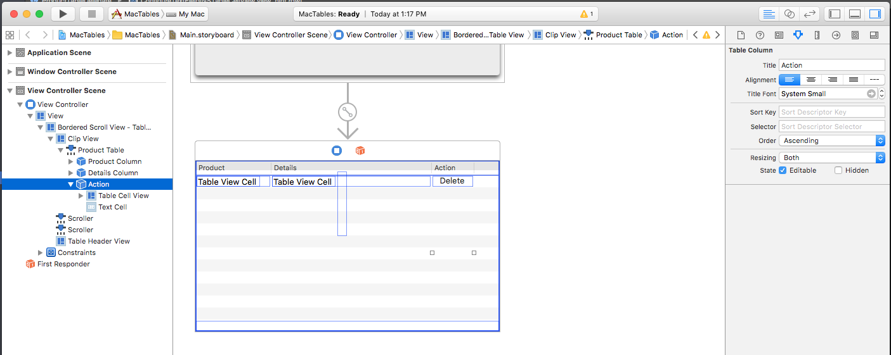](table-view-images/delete01.png#lightbox)

Save the changes to the Storyboard and return to Visual Studio for Mac to sync the changes.

Next, edit the `ViewController.cs` file and add the following public method:

```csharp
public void ReloadTable ()
{
  ProductTable.ReloadData ();
}
```

In the same file, modify the creation of the new Table View Delegate inside of `ViewDidLoad` method as follows:

```csharp
// Populate the Product Table
ProductTable.DataSource = DataSource;
ProductTable.Delegate = new ProductTableDelegate (this, DataSource);
```

Now, edit the `ProductTableDelegate.cs` file to include a private connection to the View Controller and to take the controller as a parameter when creating a new instance of the delegate:

```csharp
#region Private Variables
private ProductTableDataSource DataSource;
private ViewController Controller;
#endregion

#region Constructors
public ProductTableDelegate (ViewController controller, ProductTableDataSource datasource)
{
  this.Controller = controller;
  this.DataSource = datasource;
}
#endregion
```

Next, add the following new private method to the class:

```csharp
private void ConfigureTextField (NSTableCellView view, nint row)
{
  // Add to view
  view.TextField.AutoresizingMask = NSViewResizingMask.WidthSizable;
  view.AddSubview (view.TextField);

  // Configure
  view.TextField.BackgroundColor = NSColor.Clear;
  view.TextField.Bordered = false;
  view.TextField.Selectable = false;
  view.TextField.Editable = true;

  // Wireup events
  view.TextField.EditingEnded += (sender, e) => {

    // Take action based on type
    switch (view.Identifier) {
    case "Product":
      DataSource.Products [(int)view.TextField.Tag].Title = view.TextField.StringValue;
      break;
    case "Details":
      DataSource.Products [(int)view.TextField.Tag].Description = view.TextField.StringValue;
      break;
    }
  };

  // Tag view
  view.TextField.Tag = row;
}
```

This takes all of the Text View configurations that were previously being done in the `GetViewForItem` method and places them in a single, callable location (since the last column of the table does not include a Text View but a Button).

Finally, edit the `GetViewForItem` method and make it look like the following:

```csharp
public override NSView GetViewForItem (NSTableView tableView, NSTableColumn tableColumn, nint row)
{

  // This pattern allows you reuse existing views when they are no-longer in use.
  // If the returned view is null, you instance up a new view
  // If a non-null view is returned, you modify it enough to reflect the new data
  NSTableCellView view = (NSTableCellView)tableView.MakeView (tableColumn.Title, this);
  if (view == null) {
    view = new NSTableCellView ();

    // Configure the view
    view.Identifier = tableColumn.Title;

    // Take action based on title
    switch (tableColumn.Title) {
    case "Product":
      view.ImageView = new NSImageView (new CGRect (0, 0, 16, 16));
      view.AddSubview (view.ImageView);
      view.TextField = new NSTextField (new CGRect (20, 0, 400, 16));
      ConfigureTextField (view, row);
      break;
    case "Details":
      view.TextField = new NSTextField (new CGRect (0, 0, 400, 16));
      ConfigureTextField (view, row);
      break;
    case "Action":
      // Create new button
      var button = new NSButton (new CGRect (0, 0, 81, 16));
      button.SetButtonType (NSButtonType.MomentaryPushIn);
      button.Title = "Delete";
      button.Tag = row;

      // Wireup events
      button.Activated += (sender, e) => {
        // Get button and product
        var btn = sender as NSButton;
        var product = DataSource.Products [(int)btn.Tag];

        // Configure alert
        var alert = new NSAlert () {
          AlertStyle = NSAlertStyle.Informational,
          InformativeText = $"Are you sure you want to delete {product.Title}? This operation cannot be undone.",
          MessageText = $"Delete {product.Title}?",
        };
        alert.AddButton ("Cancel");
        alert.AddButton ("Delete");
        alert.BeginSheetForResponse (Controller.View.Window, (result) => {
          // Should we delete the requested row?
          if (result == 1001) {
            // Remove the given row from the dataset
            DataSource.Products.RemoveAt((int)btn.Tag);
            Controller.ReloadTable ();
          }
        });
      };

      // Add to view
      view.AddSubview (button);
      break;
    }

  }

  // Setup view based on the column selected
  switch (tableColumn.Title) {
  case "Product":
    view.ImageView.Image = NSImage.ImageNamed ("tag.png");
    view.TextField.StringValue = DataSource.Products [(int)row].Title;
    view.TextField.Tag = row;
    break;
  case "Details":
    view.TextField.StringValue = DataSource.Products [(int)row].Description;
    view.TextField.Tag = row;
    break;
  case "Action":
    foreach (NSView subview in view.Subviews) {
      var btn = subview as NSButton;
      if (btn != null) {
        btn.Tag = row;
      }
    }
    break;
  }

  return view;
}
```

Let's look at several sections of this code in more detail. First, if a new `NSTableViewCell` is being created action is taken based on the name of the Column. For the first two columns (**Product** and **Details**), the new `ConfigureTextField` method is called.

For the **Action** column, a new `NSButton` is created and added to the Cell as a Sub View:

```csharp
// Create new button
var button = new NSButton (new CGRect (0, 0, 81, 16));
button.SetButtonType (NSButtonType.MomentaryPushIn);
button.Title = "Delete";
button.Tag = row;
...

// Add to view
view.AddSubview (button);
```

The Button's `Tag` property is used to hold the number of the Row that is currently being processed. This number will be used later when the user requests a row to be deleted in the Button's `Activated` event:

```csharp
// Wireup events
button.Activated += (sender, e) => {
  // Get button and product
  var btn = sender as NSButton;
  var product = DataSource.Products [(int)btn.Tag];

  // Configure alert
  var alert = new NSAlert () {
    AlertStyle = NSAlertStyle.Informational,
    InformativeText = $"Are you sure you want to delete {product.Title}? This operation cannot be undone.",
    MessageText = $"Delete {product.Title}?",
  };
  alert.AddButton ("Cancel");
  alert.AddButton ("Delete");
  alert.BeginSheetForResponse (Controller.View.Window, (result) => {
    // Should we delete the requested row?
    if (result == 1001) {
      // Remove the given row from the dataset
      DataSource.Products.RemoveAt((int)btn.Tag);
      Controller.ReloadTable ();
    }
  });
};
```

At the start of the event handler, we get the button and the product that is on the given table row. Then an Alert is presented to the user confirming the row deletion. If the user chooses to delete the row, the given row is removed from the Data Source and the table is reloaded:

```csharp
// Remove the given row from the dataset
DataSource.Products.RemoveAt((int)btn.Tag);
Controller.ReloadTable ();
```

Finally, if the Table View Cell is being reused instead of being created new, the following code configures it based on the Column being processed:

```csharp
// Setup view based on the column selected
switch (tableColumn.Title) {
case "Product":
  view.ImageView.Image = NSImage.ImageNamed ("tag.png");
  view.TextField.StringValue = DataSource.Products [(int)row].Title;
  view.TextField.Tag = row;
  break;
case "Details":
  view.TextField.StringValue = DataSource.Products [(int)row].Description;
  view.TextField.Tag = row;
  break;
case "Action":
  foreach (NSView subview in view.Subviews) {
    var btn = subview as NSButton;
    if (btn != null) {
      btn.Tag = row;
    }
  }
  break;
}

```

For the **Action** column, all Sub Views are scanned until the `NSButton` is found, then it's `Tag` property is updated to point at the current Row.

With these changes in place, when the app is run each row will have a **Delete** button:

[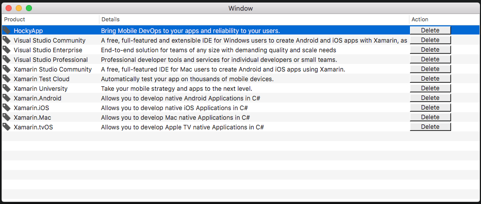](table-view-images/delete02.png#lightbox)

When the user clicks a **Delete** button, an alert will be displayed asking them to delete the given Row:

[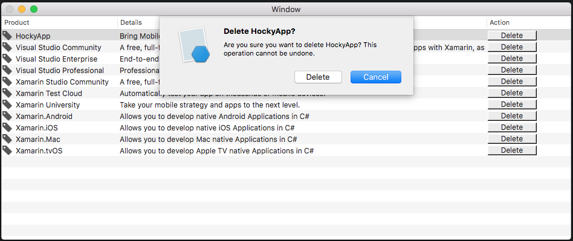](table-view-images/delete03.png#lightbox)

If the user chooses delete, the row will be removed and the table will be redrawn:

[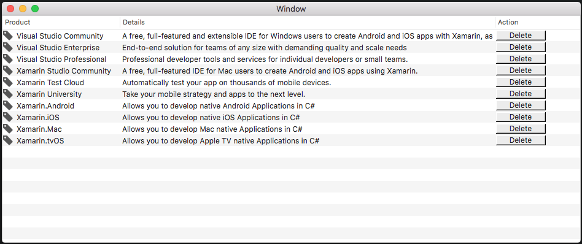](table-view-images/delete04.png#lightbox)

<a name="Data_Binding_Table_Views"></a>

## Data Binding Table Views

By using Key-Value Coding and Data Binding techniques in your Xamarin.Mac application, you can greatly decrease the amount of code that you have to write and maintain to populate and work with UI elements. You also have the benefit of further decoupling your backing data (_Data Model_) from your front end User Interface (_Model-View-Controller_), leading to easier to maintain, more flexible application design.

Key-Value Coding (KVC) is a mechanism for accessing an object’s properties indirectly, using keys (specially formatted strings) to identify properties instead of accessing them through instance variables or accessor methods (`get/set`). By implementing Key-Value Coding compliant accessors in your Xamarin.Mac application, you gain access to other macOS features such as Key-Value Observing (KVO), Data Binding, Core Data, Cocoa bindings, and scriptability.

For more information, please see the [Table View Data Binding](~/mac/app-fundamentals/databinding.md#Table_View_Data_Binding) section of our [Data Binding and Key-Value Coding](~/mac/app-fundamentals/databinding.md) documentation.

<a name="Summary"></a>

## Summary

This article has taken a detailed look at working with Table Views in a Xamarin.Mac application. We saw the different types and uses of Table Views, how to create and maintain Table Views in Xcode's Interface Builder and how to work with Table Views in C# code.

## Related Links

- [MacTables (sample)](/samples/xamarin/mac-samples/mactables)
- [MacImages (sample)](/samples/xamarin/mac-samples/macimages)
- [Hello, Mac](~/mac/get-started/hello-mac.md)
- [Outline Views](~/mac/user-interface/outline-view.md)
- [Source Lists](~/mac/user-interface/source-list.md)
- [Data Binding and Key-Value Coding](~/mac/app-fundamentals/databinding.md)
- [OS X Human Interface Guidelines](https://developer.apple.com/library/mac/documentation/UserExperience/Conceptual/OSXHIGuidelines/)
- [NSTableView](https://developer.apple.com/library/mac/documentation/Cocoa/Reference/ApplicationKit/Classes/NSTableView_Class/index.html#//apple_ref/doc/uid/TP40004125)
- [NSTableViewDelegate](https://developer.apple.com/library/mac/documentation/Cocoa/Reference/NSTableViewDelegate_Protocol/index.html#//apple_ref/doc/uid/TP40008622)
- [NSTableViewDataSource](https://developer.apple.com/library/mac/documentation/Cocoa/Reference/ApplicationKit/Protocols/NSTableDataSource_Protocol/index.html#//apple_ref/doc/uid/TP40004178)