# Toolbars in Xamarin.Mac

_This article describes working with toolbars in a Xamarin.Mac application. It covers creating and maintaining toolbars in Xcode and Interface Builder, exposing them to code, and working with them programmatically._

Xamarin.Mac developers working with Visual Studio for Mac have access to the same UI controls available to macOS developers working with Xcode, including the toolbar control. Because Xamarin.Mac integrates directly with Xcode, it's possible to use Xcode's Interface Builder to create and maintain toolbar items. These toolbar items can also be created in C#.

Toolbars in macOS are added to the top section of a window and provide easy access to commands related to its functionality. Toolbars can be hidden, shown, or customized by an application's users, and they can present toolbar items in various ways.

This article covers the basics of working with toolbars and toolbar items in a Xamarin.Mac application. 

Before continuing, read through the [Hello, Mac](~/mac/get-started/hello-mac.md) article — specifically the [Introduction to Xcode and Interface Builder](~/mac/get-started/hello-mac.md#introduction-to-xcode-and-interface-builder) and [Outlets and Actions](~/mac/get-started/hello-mac.md#outlets-and-actions) sections — as it covers key concepts and techniques that will be used throughout this guide.

Also take a look at the [Exposing C# classes / methods to Objective-C](~/mac/internals/how-it-works.md) section of the [Xamarin.Mac Internals](~/mac/internals/how-it-works.md) document. It explains the `Register` and `Export` attributes used to connect C# classes to Objective-C classes.

## Introduction to toolbars

Any window in a macOS application can include a toolbar:

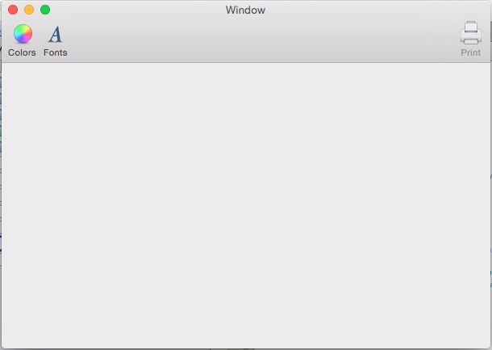

Toolbars provide an easy way for your application's users to quickly access important or commonly-used features. For example, a document-editing application might provide toolbar items for setting the text color, changing the font, or printing the current document.

Toolbars can display items in three ways:

1. **Icon and Text** 

     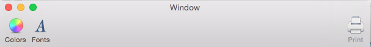

2. **Icon Only** 

     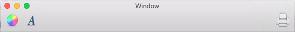

3. **Text Only** 

     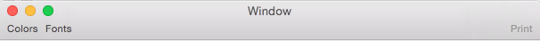

Switch between these modes by right-clicking the toolbar and selecting a display mode from the contextual menu:

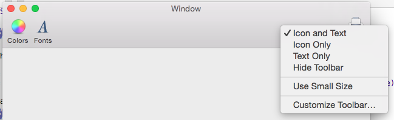

Use the same menu to display the toolbar at a smaller size:

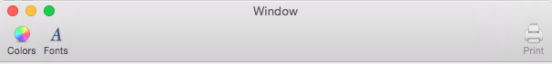

The menu also allows for customizing the toolbar:


When setting up a toolbar in Xcode's Interface Builder, a developer can provide extra toolbar items that are not part of its default configuration. Users of the application can then customize the toolbar, adding and removing these pre-defined items as necessary. Of course, the toolbar can be reset to its default configuration.

The toolbar automatically connects to the **View** menu, which allows users to hide it, show it, and customize it:

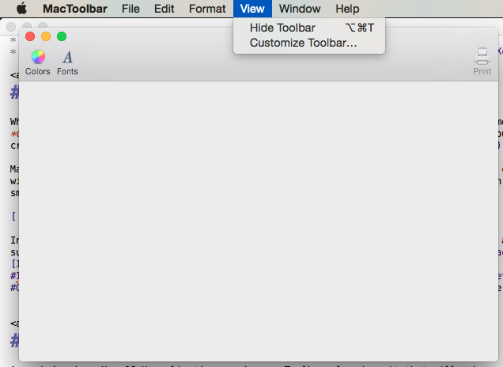

See the [Built-In Menu Functionality](~/mac/user-interface/menu.md) documentation for more details.

Additionally, if the toolbar is properly configured in Interface Builder, the application will automatically persist toolbar customizations across multiple launches of the application.

The next sections of this guide describe how to create and maintain toolbars with Xcode's Interface Builder and how to work with them in code.

## Setting a custom main window controller

To expose UI elements to C# code through outlets and actions, the Xamarin.Mac app must use a custom window controller:

1. Open the app's storyboard in Xcode's Interface Builder.
2. Select the window controller on the design surface.
3. Switch to the **Identity Inspector** and enter "WindowController" as the **Class Name**: 

    [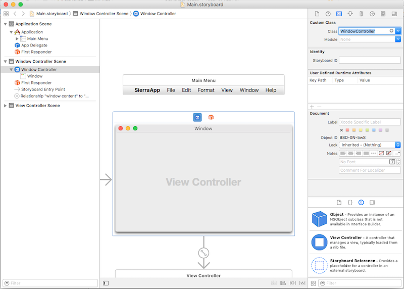](toolbar-images/windowcontroller01-large.png#lightbox) 

4. Save your changes and return to Visual Studio for Mac to sync.
5. A **WindowController.cs** file will be added to your project in the **Solution Pad** in Visual Studio for Mac: 

    

6. Reopen the storyboard in Xcode's Interface Builder.
7. The **WindowController.h** file will be available for use: 

    [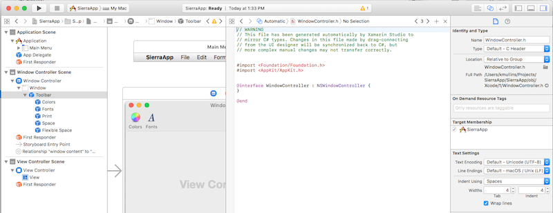](toolbar-images/windowcontroller03-large.png#lightbox)

## Creating and maintaining toolbars in Xcode

Toolbars are created and maintained with Xcode's Interface Builder. To add a toolbar to an application, edit the app's primary storyboard (in this case **Main.storyboard**) by double-clicking it in the **Solution Pad**:

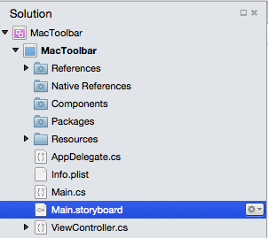

In the **Library Inspector**, enter "tool" in the **Search Box** to make it easier to see all of the available toolbar items:


Drag a toolbar onto the window in the **Interface Editor**. With the toolbar selected, configure its behavior by setting properties in the **Attributes Inspector**:

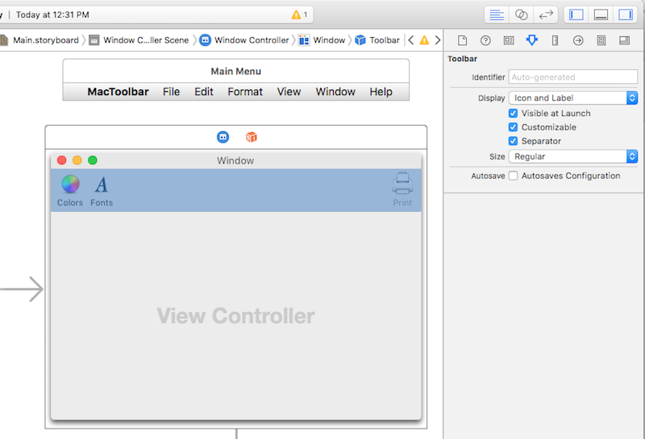

The following properties are available:

1. **Display** - Controls whether the toolbar displays icons, text, or both
2. **Visible at Launch** - If selected, the toolbar is visible by default.
3. **Customizable** - If selected, users can edit and customize the toolbar.
4. **Separator** - If selected, a thin horizontal line separates the toolbar from the window's contents.
5. **Size** - Sets the size of the toolbar
6. **Autosave** - If selected, the application will persist a user's toolbar configuration changes across application launches.

Select the **Autosave** option and leave all the other properties at their default settings. 

After opening the toolbar in the **Interface Hierarchy**, bring up the customization dialog by selecting a toolbar item:

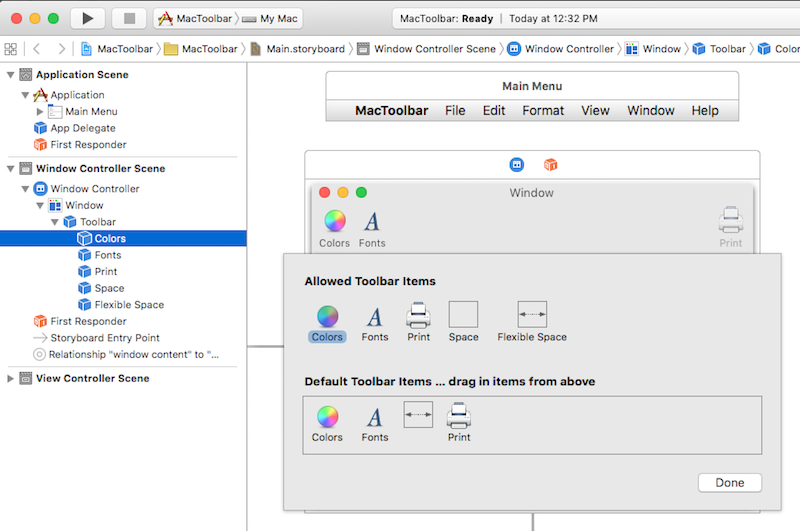

Use this dialog to set properties for items that are already part of the toolbar, to design the default toolbar for the application, and to provide extra toolbar items for a user to select when customizing the toolbar. To add items to the toolbar, drag them from the **Library Inspector**:

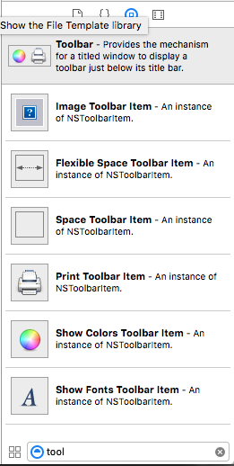

The following toolbar items can be added:

- **Image Toolbar Item** - A toolbar item with a custom image as an icon.
- **Flexible Space Toolbar Item** - Flexible space used to justify subsequent toolbar items. For example, one or more toolbar items followed by a flexible space toolbar item and another toolbar item would pin the last item to the right side of the toolbar.
- **Space Toolbar Item** - Fixed space between items on the toolbar
- **Separator Toolbar Item** - A visible separator between two or more toolbar items, for grouping
- **Customize Toolbar Item** - Allows users to customize the toolbar
- **Print Toolbar Item** - Allows users to print the open document
- **Show Colors Toolbar Item** - Displays the standard system color picker: 

     

- **Show Font Toolbar Item** - Displays the standard system font dialog: 

     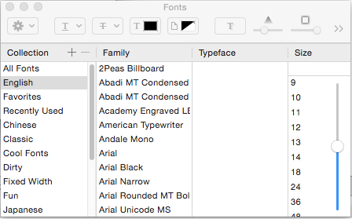

> [!IMPORTANT]
> As will be seen later, many standard Cocoa UI controls such as search fields, segmented controls, and horizontal sliders can also be added to a toolbar.

### Adding an item to a toolbar

To add an item to a toolbar, select the toolbar in the **Interface Hierarchy** and click one of its items, causing the customization dialog to appear. Next, drag a new item from the **Library Inspector** to the **Allowed Toolbar Items** area:

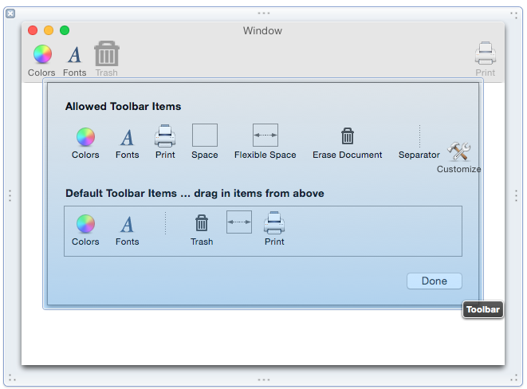

To make sure that a new item is part of the default toolbar, drag it to the **Default Toolbar Items** area: 

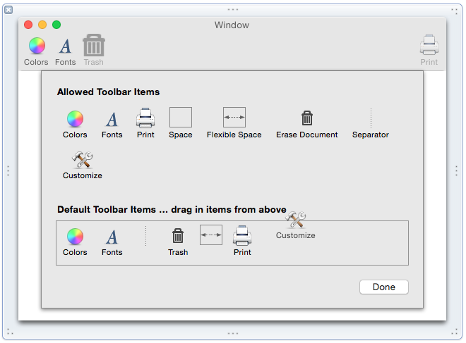

To reorder default toolbar items, drag them left or right.

Next, use the **Attributes Inspector** to set default properties for the item:

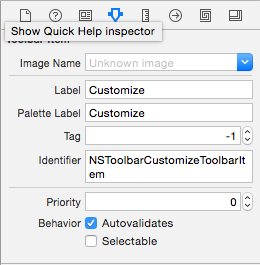

The following properties are available:

- **Image Name** - Image to use as an icon for the item
- **Label** - Text to display for the item in the toolbar
- **Palette Label** - Text to display for the item in the **Allowed Toolbar Items** area
- **Tag** - An optional, unique identifier that helps identify the item in code.
- **Identifier** - Defines the toolbar item type. A custom value can be used to select a toolbar item in code.
- **Selectable** - If checked, the item will act like an on/off button.

> [!IMPORTANT]
> Add an item to the **Allowed Toolbar Items** area but not the default toolbar to provide customization options for users. 

### Adding other UI controls to a toolbar

Several Cocoa UI elements such as search fields and segmented controls can also be added to a toolbar.

To try this, open the toolbar in the **Interface Hierarchy** and select a toolbar item to open the customization dialog. Drag a **Search Field** from the **Library Inspector** to the **Allowed Toolbar Items** area:

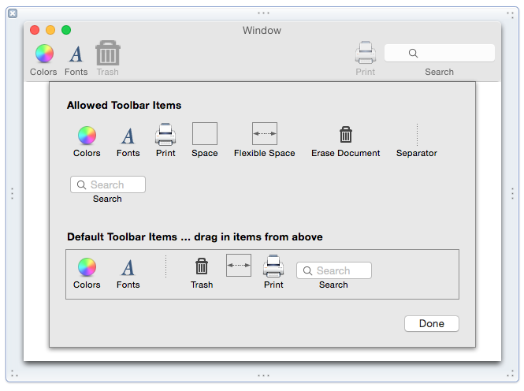

From here, use Interface Builder to configure the search field and expose it to code through an action or outlet.

## Built-in toolbar item support

Several Cocoa UI elements interact with standard toolbar items by default. For example, drag a **Text View** onto the application's window and position it to fill the content area:

[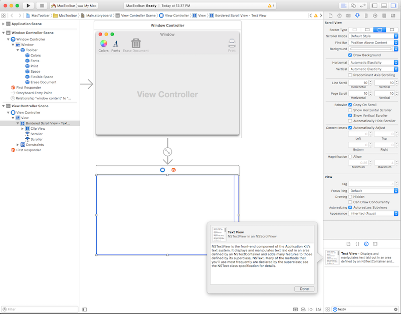](toolbar-images/edit09-large.png#lightbox)

Save the document, return to Visual Studio for Mac to sync with Xcode, run the application, enter some text, select it, and click the **Colors** toolbar item. Notice that the text view automatically works with the color picker:

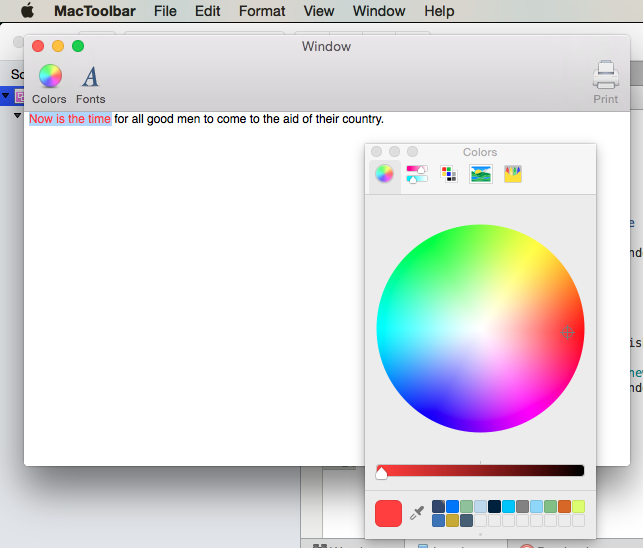

## Using images with toolbar items

Using an **Image Toolbar Item**, any bitmap image added to the **Resources** folder (and given a build action of **Bundle Resource**) can be displayed on the toolbar as an icon:

1. In Visual Studio for Mac, in the **Solution Pad**, right-click the **Resources** folder and select **Add** > **Add Files**.
2. From the **Add Files** dialog box, navigate to the desired images, select them and click the **Open** button: 

    [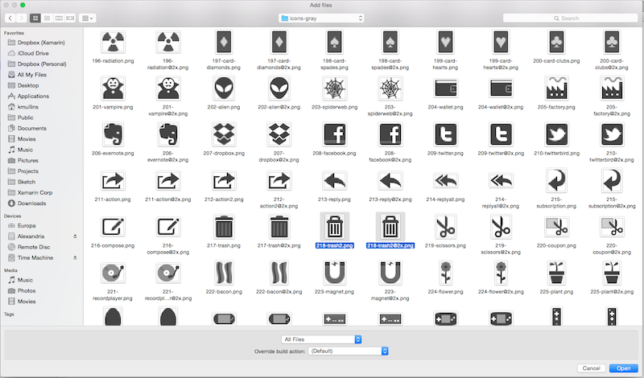](toolbar-images/edit11-large.png#lightbox)

3. Select **Copy**, check **Use the same action for all selected files**, and click **OK**:

    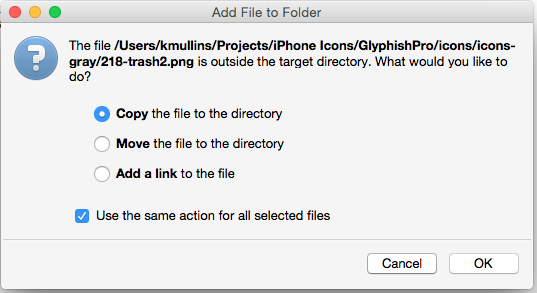

4. In the **Solution Pad**, double-click **MainWindow.xib** to open it in Xcode.

5. Select the toolbar in the **Interface Hierarchy** and click one of its items to open the customization dialog.

6. Drag an **Image Toolbar Item** from the **Library Inspector** to the toolbar's **Allowed Toolbar Items** area: 

    

7. In the **Attributes Inspector**, select the image that was just added in Visual Studio for Mac: 

    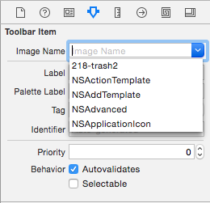

8. Set the **Label** to "Trash" and the **Palette Label** to "Erase Document": 

    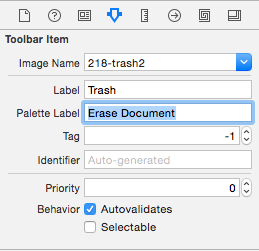

9. Drag a **Separator Toolbar Item** from the **Library Inspector** to the toolbar's **Allowed Toolbar Items** area: 

    [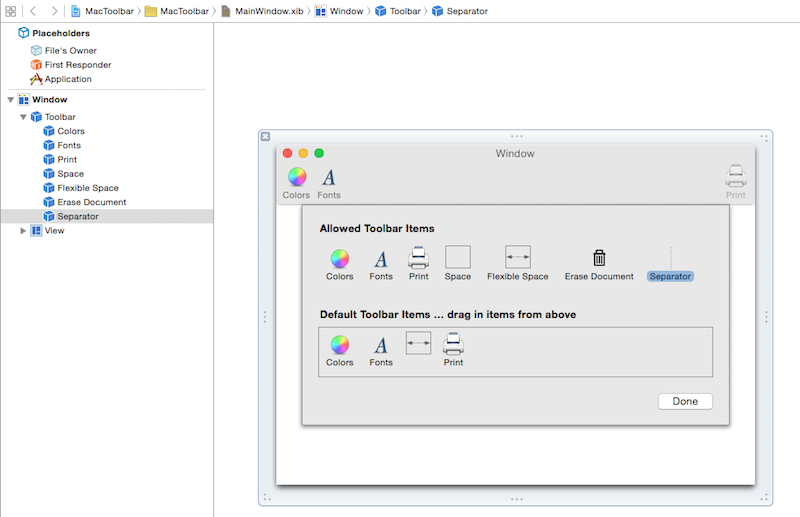](toolbar-images/edit17-large.png#lightbox)

10. Drag the separator item and the "Trash" item to the **Default Toolbar Items** area and set the order of the toolbar items from left to right as follows (Colors, Fonts, Separator, Trash, Flexible Space, Print): 

    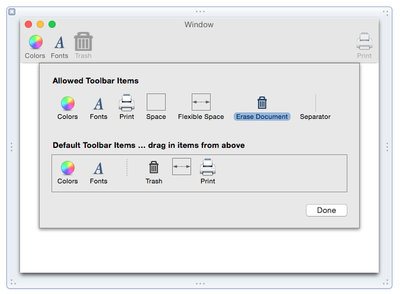

11. Save changes and return to Visual Studio for Mac to sync with Xcode.

Run the application to verify that the new toolbar is displayed by default:

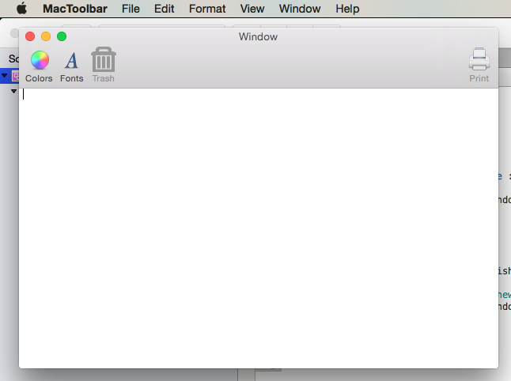

## Exposing toolbar items with outlets and actions

To access a toolbar or toolbar item in code, it must be attached to an outlet or an action:

1. In the **Solution Pad**, double-click **Main.storyboard** to open it in Xcode.
2. Ensure that the custom class "WindowController" has been assigned to the main window controller in the **Identity Inspector**:

    [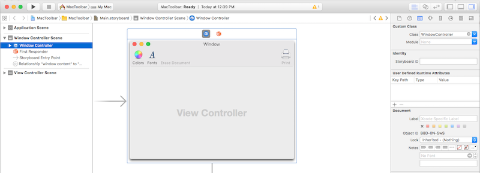](toolbar-images/edit20a-large.png#lightbox)

3. Next, select the toolbar item in the **Interface Hierarchy**: 

    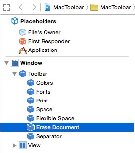  

4. Open the **Assistant View**, select the **WindowController.h** file, and control-drag from the toolbar item to the **WindowController.h** file.
5. Set the **Connection** type to **Action**, enter "trashDocument" for the **Name**, and click the **Connect** button: 

    [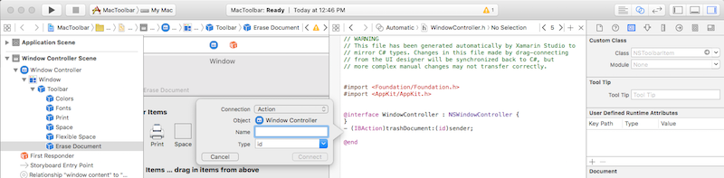](toolbar-images/edit23-large.png#lightbox)

6. Expose the **Text View** as an outlet called "documentEditor" in the **ViewController.h** file: 

    [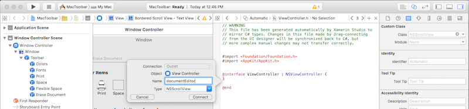](toolbar-images/edit24-large.png#lightbox)

7. Save your changes and return to Visual Studio for Mac to sync with Xcode.

In Visual Studio for Mac, edit the **ViewController.cs** file and add the following code:

```csharp
public void EraseDocument() {
    documentEditor.Value = "";
}
```

Next, edit the **WindowController.cs** file and add the following code to the bottom of the `WindowController` class:

```csharp
[Export ("trashDocument:")]
void TrashDocument (NSObject sender) {

    var controller = ContentViewController as ViewController;
    controller.EraseDocument ();
}
```

When running the application, the **Trash** toolbar item will be active:

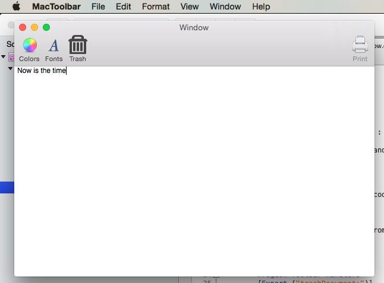

Notice that the **Trash** toolbar item can now be used to delete text.

## Disabling toolbar items

To disable an item on a toolbar, create a custom `NSToolbarItem` class and override the `Validate` method. Then, in Interface Builder, assign the custom type to the item that you want to enable/disable.

To create a custom `NSToolbarItem` class, right-click on the project and select **Add** > **New File...**. Select **General** > **Empty Class**, enter "ActivatableItem" for the **Name**, and click the **New** button: 

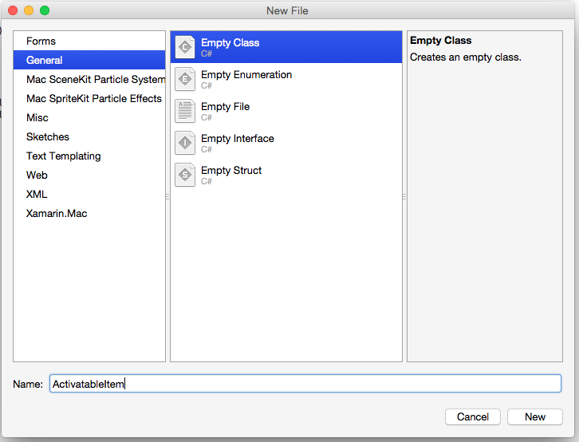

Next, edit the **ActivatableItem.cs** file to read as follows:

```csharp
using System;

using Foundation;
using AppKit;

namespace MacToolbar
{
    [Register("ActivatableItem")]
    public class ActivatableItem : NSToolbarItem
    {
        public bool Active { get; set;} = true;

        public ActivatableItem ()
        {
        }

        public ActivatableItem (IntPtr handle) : base (handle)
        {
        }

        public ActivatableItem (NSObjectFlag  t) : base (t)
        {
        }

        public ActivatableItem (string title) : base (title)
        {
        }

        public override void Validate ()
        {
            base.Validate ();
            Enabled = Active;
        }
    }
}
```

Double-click **Main.storyboard** to open it in Xcode. Select the **Trash** toolbar item created above and change its class to "ActivatableItem" in the **Identity Inspector**:

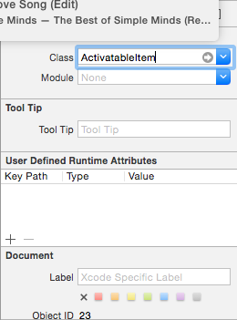

Create an outlet called `trashItem` for the **Trash** toolbar item. Save changes and return to Visual Studio for Mac to sync with Xcode. Finally, open **MainWindow.cs** and update the `AwakeFromNib` method to read as follows:

```csharp
public override void AwakeFromNib ()
{
    base.AwakeFromNib ();

    // Disable trash
    trashItem.Active = false;
}
```

Run the application and note that the **Trash** item is now disabled in the toolbar:

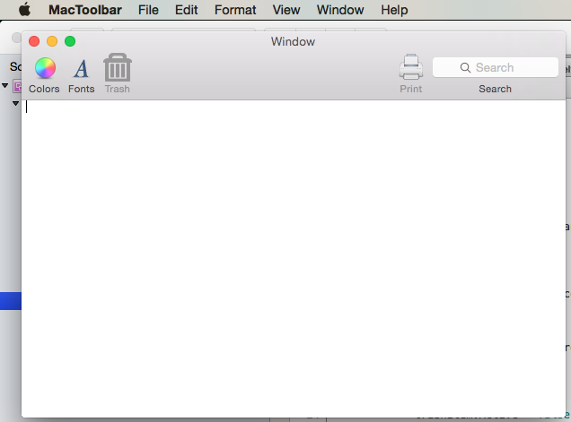

## Summary

This article has taken a detailed look at working with toolbars and toolbar items in a Xamarin.Mac application. It described how to create and maintain toolbars in Xcode's Interface Builder, how some UI controls automatically work with toolbar items, how to work with toolbars in C# code, and how to enable and disable toolbar items.

## Related Links

- [MacToolbar (sample)](/samples/xamarin/mac-samples/mactoolbar)
- [Hello, Mac](~/mac/get-started/hello-mac.md)
- [Human Interface Guidelines for Toolbars](https://developer.apple.com/design/human-interface-guidelines/toolbars)
- [Introduction to Toolbars](https://developer.apple.com/library/content/documentation/Cocoa/Conceptual/Toolbars/Toolbars.html)