# Windows in Xamarin.Mac

_This article covers working with windows and panels in a Xamarin.Mac application. It describes creating windows and panels in Xcode and Interface Builder, loading them from storyboards and .xib files, and working with them programmatically._

When working with C# and .NET in a Xamarin.Mac application, you have access to the same Windows and Panels that a developer working in *Objective-C* and *Xcode* does. Because Xamarin.Mac integrates directly with Xcode, you can use Xcode's _Interface Builder_ to create and maintain your Windows and Panels (or optionally create them directly in C# code).

Based on its purpose, a Xamarin.Mac application can present one or more Windows on screen to manage and coordinate the information it displays and works with. The principal functions of a window are:

1. To provide an area in which Views and Controls can be placed and managed.
2. To accept and respond to events in response to user interaction with both the keyboard and mouse.

Windows can be used in a Modeless state (such as a text editor that can have multiple documents open at once) or Modal (such as an Export dialog that must be dismissed before the application can continue).

Panels are a special kind of Window (a subclass of the base `NSWindow` class), that typically serve an auxiliary function in an application, such as utility windows like Text format inspectors and system Color Picker.

[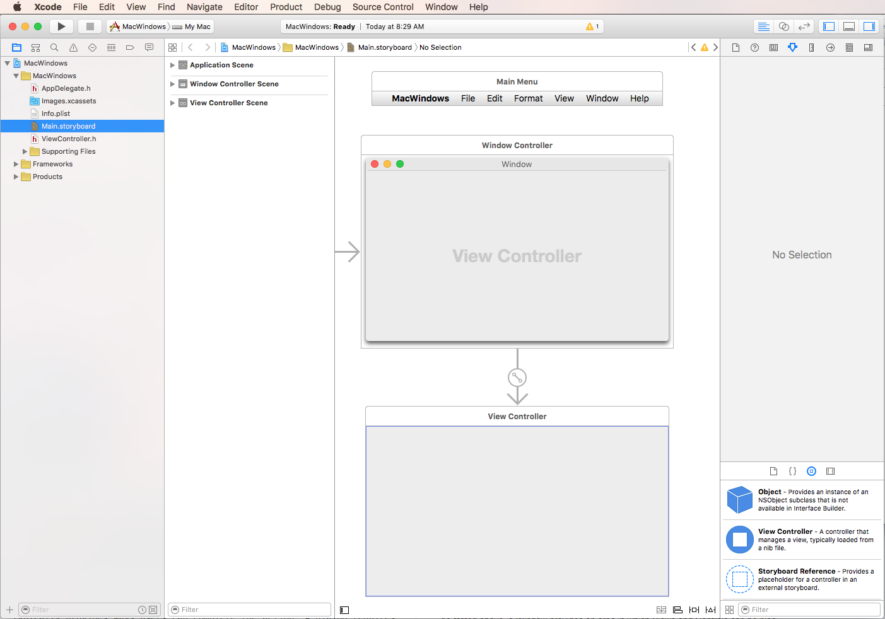](window-images/intro01.png#lightbox)

In this article, we'll cover the basics of working with Windows and Panels in a Xamarin.Mac application. It is highly suggested that you work through the [Hello, Mac](~/mac/get-started/hello-mac.md) article first, specifically the [Introduction to Xcode and Interface Builder](~/mac/get-started/hello-mac.md#introduction-to-xcode-and-interface-builder) and [Outlets and Actions](~/mac/get-started/hello-mac.md#outlets-and-actions) sections, as it covers key concepts and techniques that we'll be using in this article.

You may want to take a look at the [Exposing C# classes / methods to Objective-C](~/mac/internals/how-it-works.md) section of the [Xamarin.Mac Internals](~/mac/internals/how-it-works.md) document as well, it explains the `Register` and `Export` commands used to wire-up your C# classes to Objective-C objects and UI Elements.

## Introduction to windows

As stated above, a Window provides an area in which Views and Controls can be placed and managed and responds to events based on user interaction (either via keyboard or mouse).

According to Apple, there are five main types of Windows in a macOS App:

- **Document Window** - A document window contains file-based user data such as a spreadsheet or a text document.
- **App Window** - An app window is the main window of an application that is not document-based (like the Calendar app on a Mac).
- **Panel** - A panel floats above other windows and provides tools or controls that users can work with while documents are open. In some cases, a panel can be translucent (such as when working with large graphics).
- **Dialog** - A dialog appears in response to a user action and typically provides ways users can complete the action. A dialog requires a response from the user before it can be closed. (See [Working with Dialogs](~/mac/user-interface/dialog.md))
- **Alerts** - An alert is a special type of dialog that appears when a serious problem occurs (such as an error) or as a warning (such as preparing to delete a file). Because an alert is a dialog, it also requires a user response before it can be closed. (See [Working with Alerts](~/mac/user-interface/alert.md))

For more information, see the [About Windows](https://developer.apple.com/library/mac/documentation/UserExperience/Conceptual/OSXHIGuidelines/WindowAppearanceBehavior.html#//apple_ref/doc/uid/20000957-CH33-SW1) section of Apple's [macOS design themes](https://developer.apple.com/design/human-interface-guidelines/macos/overview/themes/).

### Main, key, and inactive windows

Windows in a Xamarin.Mac application can look and behave differently based on how the user is currently interacting with them. The foremost Document or App Window that is currently focus of the user’s attention is called the _Main Window_. In most instances this Window will also be the _Key Window_ (the window that is currently accepting user input). But this isn't always the case, for example, a Color Picker could be open and be the Key window that the user is interacting with to change the state of an item in the Document Window (which would still be the Main Window).

The Main and Key Windows (if they are separate) are always active, _Inactive Windows_ are open windows that are not in the foreground. For example, a text editor application could have more than one document open at a time, only the Main Window would be active, all others would be inactive. 

For more information, see the [About Windows](https://developer.apple.com/library/mac/documentation/UserExperience/Conceptual/OSXHIGuidelines/WindowAppearanceBehavior.html#//apple_ref/doc/uid/20000957-CH33-SW1) section of Apple's [macOS design themes](https://developer.apple.com/design/human-interface-guidelines/macos/overview/themes/).

### Naming windows

A Window can display a Title Bar and when the Title is displayed, it's usually the name of the application, the name of the document being worked on or the function of the window (such as Inspector). Some applications don't display a Title Bar because they are recognizable by sight and don't work with documents.

Apple suggest the following guidelines:

- Use your application name for the title of a main, non-document window. 
- Name a new document window `untitled`. For the first new document, don't append a number to the Title (such as `untitled 1`). If the user creates another new document before saving and titling the first, call that window `untitled 2`, `untitled 3`, etc.

For more information, see the [Naming Windows](https://developer.apple.com/library/mac/documentation/UserExperience/Conceptual/OSXHIGuidelines/WindowNaming.html#//apple_ref/doc/uid/20000957-CH35-SW1) section of Apple's [macOS design themes](https://developer.apple.com/design/human-interface-guidelines/macos/overview/themes/).

### Full-screen windows

In macOS, an application's window can go full screen hiding everything including the Application Menu Bar (which can be revealed by moving the cursor to the top of the screen) to provide distraction free interaction with it's content.

Apple suggests the following guidelines:

- Determine whether it makes sense for a window to go full screen. Applications that provide brief interactions (such as a Calculator) shouldn't provide a full screen mode.
- Show the toolbar if the full-screen task requires it. Typically the toolbar is hidden while in full screen mode.
- The full-screen window should have all the features users need to complete the task.
- If possible, avoid Finder interaction while the user is in a full-screen window.
- Take advantage of the increased screen space without shifting the focus away from the main task.

For more information, see the [Full-Screen Windows](https://developer.apple.com/library/mac/documentation/UserExperience/Conceptual/OSXHIGuidelines/FullScreen.html#//apple_ref/doc/uid/20000957-CH61-SW1) section of Apple's [macOS design themes](https://developer.apple.com/design/human-interface-guidelines/macos/overview/themes/).

### Panels

A Panel is an auxiliary window that contains controls and options that affect the active document or selection (such as the system Color Picker):

[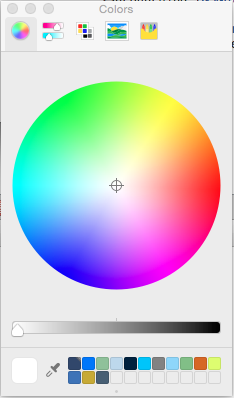](window-images/panel01.png#lightbox)

Panels can be either _App-Specific_ or _Systemwide_. App-Specific Panels float over the top of the application's document windows and disappear when the application is in the background. Systemwide Panels (such as the **Fonts** panel), float on top of all open windows no matter the application. 

Apple suggests the following guidelines:

- In general, use a standard panel, transparent panels should only be used sparingly and for graphically intensive tasks.
- Consider using a panel to give users easy access to important controls or information that directly affects their task.
- Hide and show panels as required.
- Panels should always include title bar.
- Panels should not include an active minimize button.

#### Inspectors

Most modern macOS applications present auxiliary controls and options that affect the active document or selection as _Inspectors_ that are part of the Main Window (like the **Pages** app shown below), instead of using Panel Windows:

[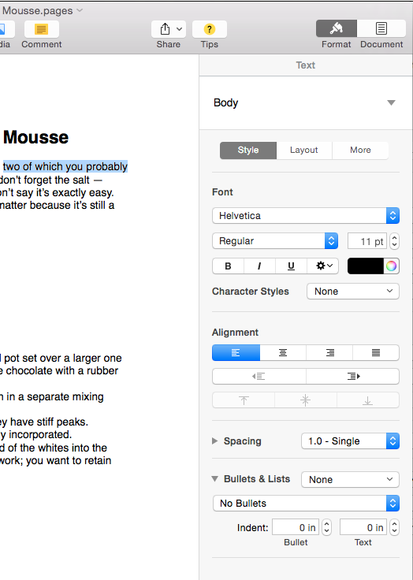](window-images/panel02.png#lightbox)

For more information, see the [Panels](https://developer.apple.com/library/mac/documentation/UserExperience/Conceptual/OSXHIGuidelines/WindowPanels.html#//apple_ref/doc/uid/20000957-CH42-SW1) section of Apple's [macOS design themes](https://developer.apple.com/design/human-interface-guidelines/macos/overview/themes/) and our [MacInspector](/samples/xamarin/mac-samples/macinspector) sample app for a full implementation of an **Inspector Interface** in a Xamarin.Mac app.

## Creating and maintaining windows in Xcode

When you create a new Xamarin.Mac Cocoa application, you get a standard blank, window by default. This windows is defined in a `.storyboard` file automatically included in the project. To edit your windows design, in the **Solution Explorer**, double click the `Main.storyboard` file:

[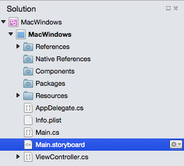](window-images/edit01.png#lightbox)

This will open the window design in Xcode's Interface Builder:

[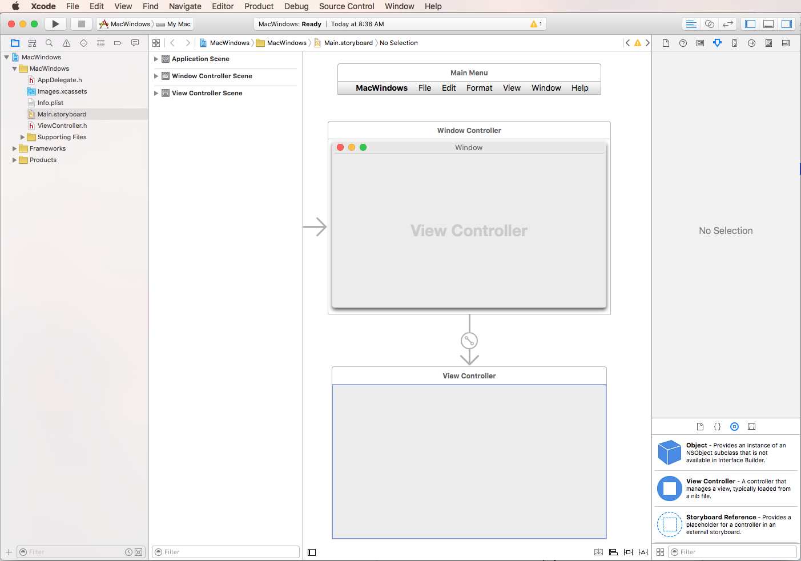](window-images/edit02.png#lightbox)

In the **Attribute Inspector**, there are several properties that you can use to define and control your window:

- **Title** - This is the text that will be displayed in the window's titlebar.
- **Autosave** - This is the _key_ that will be used to ID the window when it's position and settings are automatically saved.
- **Title Bar** - Does the window display a title bar.
- **Unified Title and Toolbar** - If the window includes a Toolbar, should it be part of the title bar.
- **Full Sized Content View** - Allows the content area of the window to be under the Title bar.
- **Shadow** - Does the window have a shadow.
- **Textured** - Textured windows can use effects (like vibrancy) and can be moved around by dragging anywhere on their body.
- **Close** - Does the window have a close button.
- **Minimize** - Does the window have a minimize button.
- **Resize** - Does the window have a resize control.
- **Toolbar Button** - Does the window have a hide/show toolbar button.
- **Restorable** - Is the window's position and settings automatically saved and restored.
- **Visible At Launch** - Is the window automatically shown when the `.xib` file is loaded.
- **Hide On Deactivate** - Is the window hidden when the application enters the background.
- **Release When Closed** - Is the window purged from memory when it is closed.
- **Always Display Tooltips** - Are the tooltips constantly displayed.
- **Recalculates View Loop** - Is the view order recalculated before the window is drawn.
- **Spaces**, **Exposé** and **Cycling** - All define how the window behaves in those macOS environments. 
- **Full Screen** - Determines if this window can enter the full screen mode. 
- **Animation** - Controls the type of animation available for the window.
- **Appearance** - Controls the appearance of the window. For now there is only one appearance, Aqua.

See Apple's [Introduction to Windows](https://developer.apple.com/library/mac/documentation/Cocoa/Conceptual/WinPanel/Introduction.html#//apple_ref/doc/uid/10000031-SW1) and [NSWindow](https://developer.apple.com/library/mac/documentation/Cocoa/Reference/ApplicationKit/Classes/NSWindow_Class/index.html#//apple_ref/occ/cl/NSWindow) documentation for more details.

### Setting the default size and location

To set the initial position of your window and to control it's size, switch to the **Size Inspector**:

[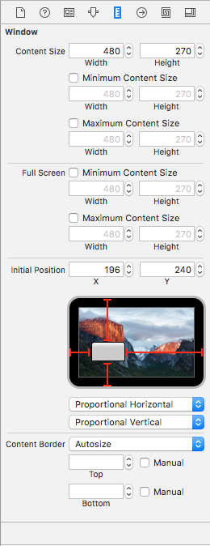](window-images/edit07.png#lightbox)

From here you can set the initial size of the window, give it a minimum and maximum size, set the initial location on the screen and control the borders around the window.

### Setting a custom main window controller

To be able to create Outlets and Actions to expose UI elements to C# code, the Xamarin.Mac app will need to be using a Custom Window Controller.

Do the following:

1. Open the app's Storyboard in Xcode's Interface Builder.
2. Select the `NSWindowController` in the  Design Surface.
3. Switch to the **Identity Inspector** view and enter `WindowController` as the **Class Name**: 

    [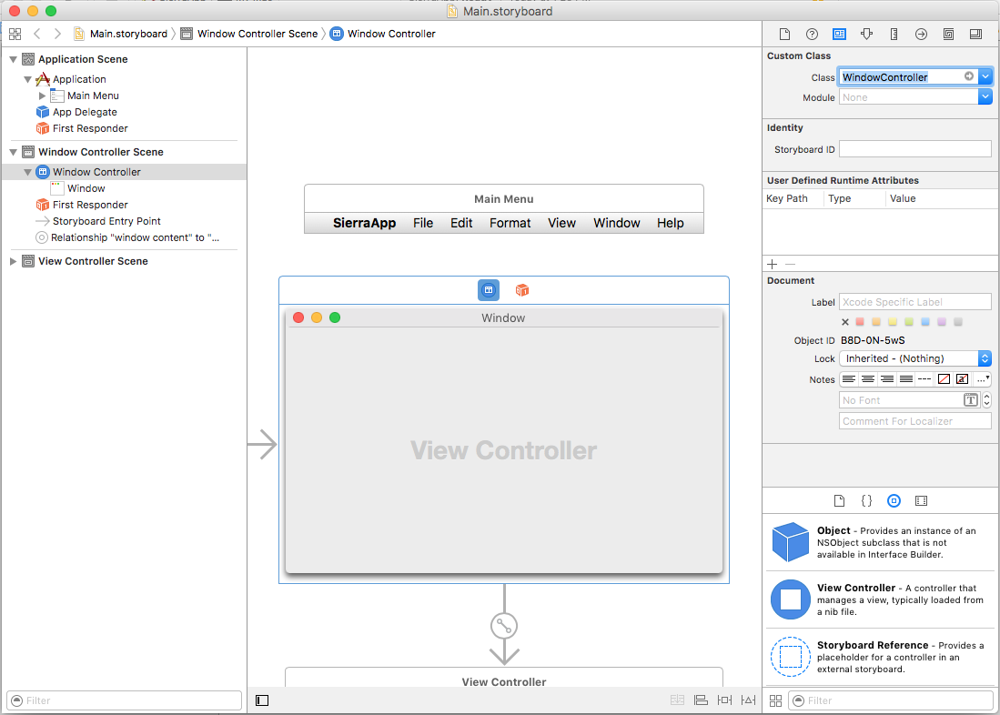](window-images/windowcontroller01.png#lightbox)
4. Save your changes and return to Visual Studio for Mac to sync.
5. A `WindowController.cs` file will be added to your Project in the **Solution Explorer** in Visual Studio for Mac: 

    [](window-images/windowcontroller02.png#lightbox)
6. Reopen the Storyboard in Xcode's Interface Builder.
7. The `WindowController.h` file will be available for use: 

    [](window-images/windowcontroller03.png#lightbox)

### Adding UI elements

To define the content of a window, drag controls from the **Library Inspector** onto the **Interface Editor**. Please see our [Introduction to Xcode and Interface Builder](~/mac/get-started/hello-mac.md#introduction-to-xcode-and-interface-builder) documentation for more information about using Interface Builder to create and enable controls.

As an example, let's drag a Toolbar from the **Library Inspector** onto the window in the **Interface Editor**:

[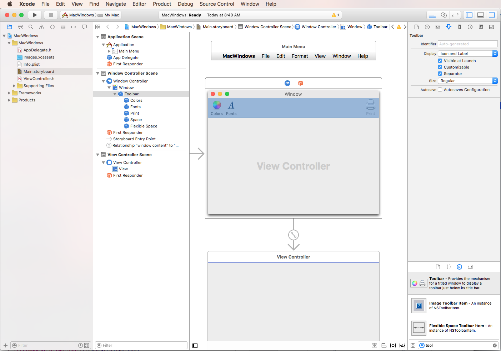](window-images/edit03.png#lightbox)

Next, drag in a **Text View** and size it to fill the area under the toolbar:

[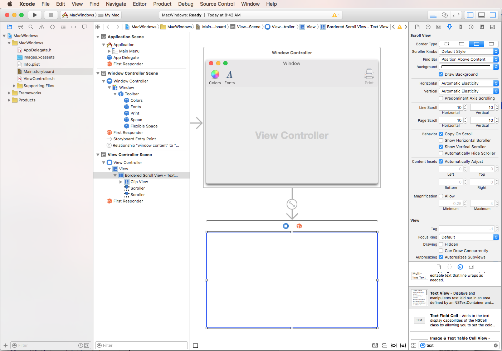](window-images/edit04.png#lightbox)

Since we want the **Text View** to shrink and grow as the window's size changes, let's switch to the **Constraint Editor** and add the following constraints:

[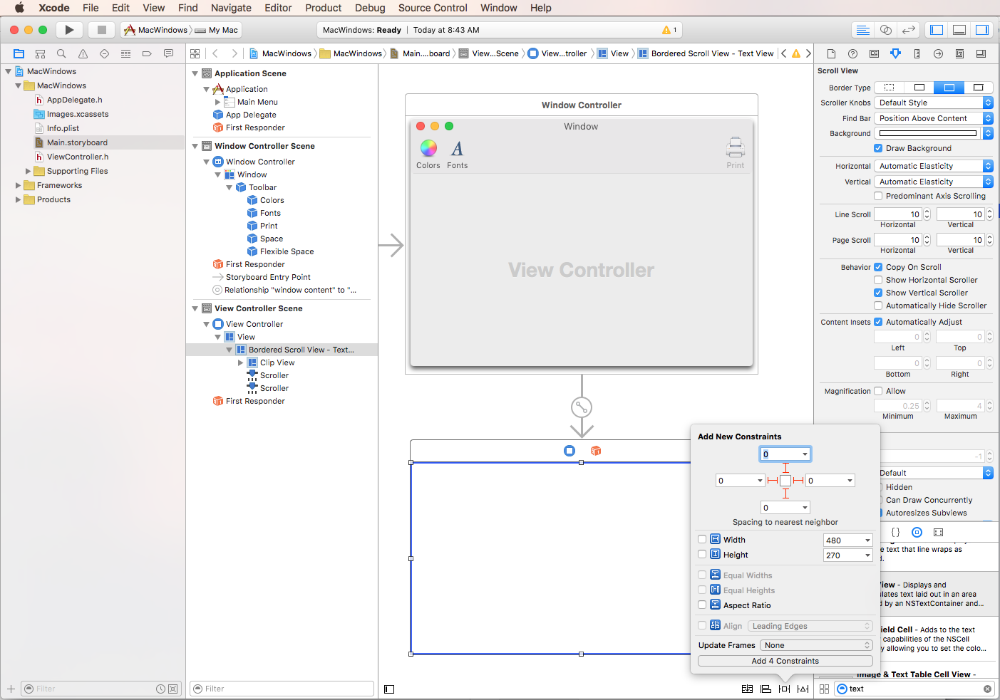](window-images/edit05.png#lightbox)

By clicking the four **Red I-Beams** at the top of the editor and clicking **Add 4 Constraints**, we are telling the text view to stick to the given X,Y coordinates and grow or shrink horizontally and vertically as the window is resized.

Finally, expose the **Text View** to code using an **Outlet** (making sure to select the `ViewController.h` file):

[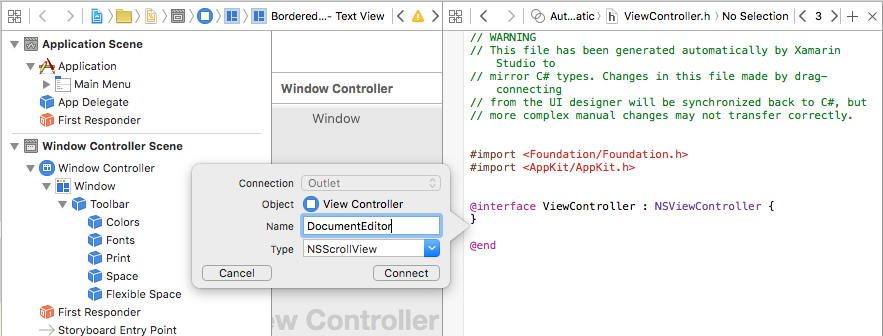](window-images/edit06.png#lightbox)

Save your changes and switch back to Visual Studio for Mac to sync with Xcode.

For more information about working with **Outlets** and **Actions**, please see our [Outlet and Action](~/mac/get-started/hello-mac.md#outlets-and-actions) documentation.

### Standard window workflow

For any window that you create and work with in your Xamarin.Mac application, the process is basically the same as what we have just done above:

1. For new windows that are not the default added automatically to your project, add a new window definition to the project. This will be discussed in detail below.
1. Double-click the `Main.storyboard` file to open the window design for editing in Xcode's Interface Builder.
1. Drag a new Window into the User Interface's design and hook the window into Main Window using _Segues_ (for more information see the [Segues](~/mac/platform/storyboards/indepth.md#Segues) section of our [Working with Storyboards](~/mac/platform/storyboards/indepth.md) documentation).
1. Set any required window properties in the **Attribute Inspector** and the **Size Inspector**.
1. Drag in the controls required to build your interface and configure them in the **Attribute Inspector**.
1. Use the **Size Inspector** to handle the resizing for your UI Elements.
1. Expose the window's UI elements to C# code via **Outlets** and **Actions**.
1. Save your changes and switch back to Visual Studio for Mac to sync with Xcode.

Now that we have a basic window created, we'll look at the typical processes a Xamarin.Mac application does when working with windows. 

## Displaying the default window

By default, a new Xamarin.Mac application will automatically display the window defined in the `MainWindow.xib` file when it is started:

[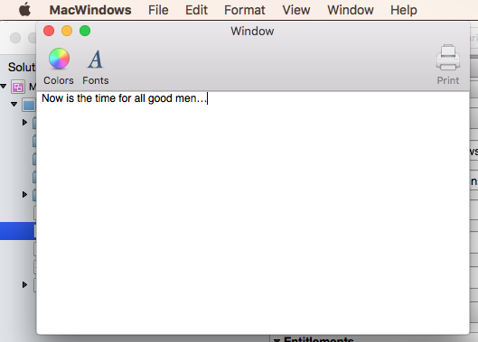](window-images/display01.png#lightbox)

Since we modified the design of that window above, it now includes a default Toolbar and **Text View** control. The following section in the `Info.plist` file is responsible for displaying this window:

[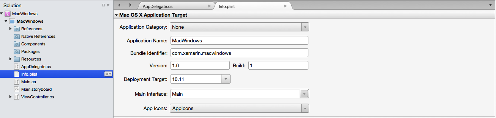](window-images/display00.png#lightbox)

The **Main Interface** dropdown is used to select the Storyboard that will be used as the main app UI (in this case `Main.storyboard`).

A View Controller is automatically added to the project to control that Main Windows that is displayed (along with its primary View). It is defined in the `ViewController.cs` file and attached to the **File's Owner** in Interface Builder under the **Identity Inspector**:

[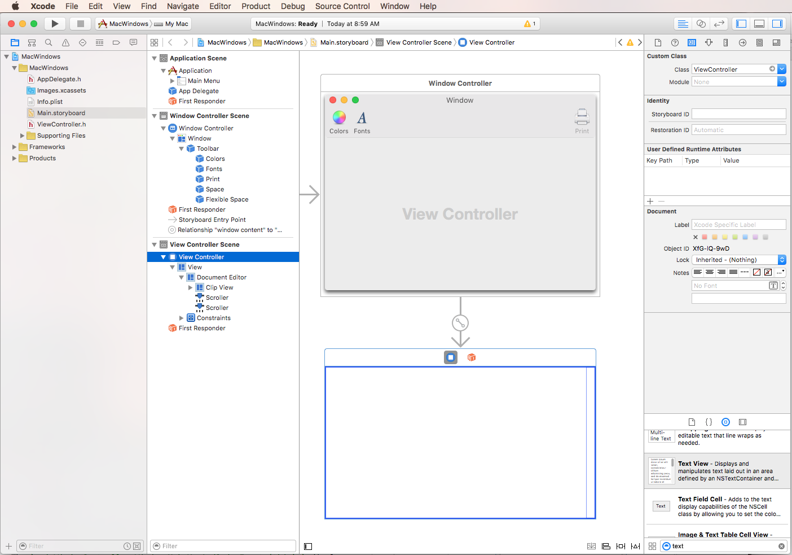](window-images/display02.png#lightbox)

For our window, we'd like it to have a title of `untitled` when it first opens so let's override the `ViewWillAppear` method in the `ViewController.cs` to look like the following:

```csharp
public override void ViewWillAppear ()
{
    base.ViewWillAppear ();

    // Set Window Title
    this.View.Window.Title = "untitled";
}
```    

> [!NOTE]
> The window's `Title` property is set in the `ViewWillAppear` method instead of the `ViewDidLoad` method because, while the view might be loaded into memory, it is not yet fully instantiated. Accessing the `Title` property in the `ViewDidLoad` method we will get a `null` exception since the window hasn't been constructed and wired-up to the property yet.

## Programmatically closing a window

There might be times that you wish to programmatically close a window in a Xamarin.Mac application, other than having the user click the window's **Close** button or using a menu item. macOS provides two different ways to close an `NSWindow` programmatically: `PerformClose` and `Close`.

### PerformClose

Calling the `PerformClose` method of an `NSWindow` simulates the user clicking the window's **Close** button by momentarily highlighting the button and then closing the window.

If the application implements the `NSWindow`'s `WillClose` event, it will be raised before the window is closed. If the event returns `false`, then the window will not be closed. If the window does not have a **Close** button or cannot be closed for any reason, the OS will emit the alert sound.

For example:

```csharp
MyWindow.PerformClose(this);
```

Would attempt to close the `MyWindow` `NSWindow` instance. If it was successful, the window will be closed, else the alert sound will be emitted and the will stay open.

### Close

Calling the `Close` method of an `NSWindow` does not simulates the user clicking the window's **Close** button by momentarily highlighting the button, it simply closes the window.

A window does not have to be visible to be closed and an `NSWindowWillCloseNotification` notification will be posted to the default Notification Center for the window being closed.

The `Close` method differs in two important ways from the `PerformClose` method:

1. It does not attempt to raise the `WillClose` event.
2. It does not simulate the user clicking the **Close** button by momentarily highlighting the button.

For example:

```csharp
MyWindow.Close();
```

Would to close the `MyWindow` `NSWindow` instance.

## Modified windows content

In macOS, Apple has provided a way to inform the user that the contents of a Window (`NSWindow`) has been modified by the user and needs to be saved. If the Window contains modified content, a small black dot will be displayed in it's **Close** widget:

[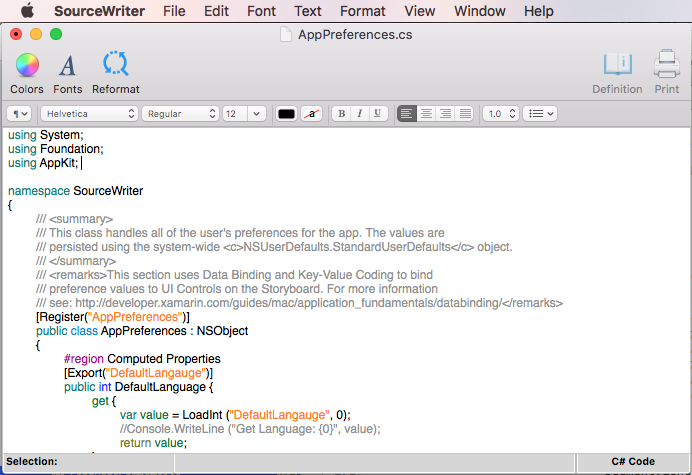](window-images/close01.png#lightbox)

If the user attempts to close the Window or quit the Mac App while there are unsaved changes to the Window's content, you should present a [Dialog Box](~/mac/user-interface/dialog.md) or [Modal Sheet](~/mac/user-interface/dialog.md) and allow the user to save their changes first:

[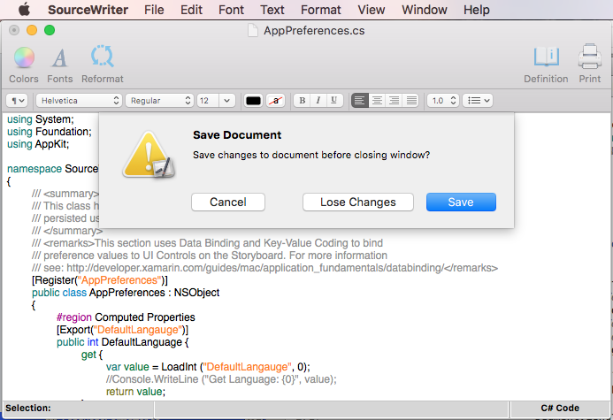](window-images/close02.png#lightbox)

### Marking a window as modified

To mark a Window as having modified content, use the following code:

```csharp
// Mark Window content as modified
Window.DocumentEdited = true;
```

And once the change has been saved, clear the modified flag using:

```csharp
// Mark Window content as not modified
Window.DocumentEdited = false;
```

### Saving changes before closing a window

To watch for the user closing a Window and allowing them to save modified content beforehand, you will need to create a subclass of `NSWindowDelegate` and override its `WindowShouldClose` method. For example:

```csharp
using System;
using AppKit;
using System.IO;
using Foundation;

namespace SourceWriter
{
    public class EditorWindowDelegate : NSWindowDelegate
    {
        #region Computed Properties
        public NSWindow Window { get; set;}
        #endregion

        #region constructors
        public EditorWindowDelegate (NSWindow window)
        {
            // Initialize
            this.Window = window;

        }
        #endregion

        #region Override Methods
        public override bool WindowShouldClose (Foundation.NSObject sender)
        {
            // is the window dirty?
            if (Window.DocumentEdited) {
                var alert = new NSAlert () {
                    AlertStyle = NSAlertStyle.Critical,
                    InformativeText = "Save changes to document before closing window?",
                    MessageText = "Save Document",
                };
                alert.AddButton ("Save");
                alert.AddButton ("Lose Changes");
                alert.AddButton ("Cancel");
                var result = alert.RunSheetModal (Window);

                // Take action based on result
                switch (result) {
                case 1000:
                    // Grab controller
                    var viewController = Window.ContentViewController as ViewController;

                    // Already saved?
                    if (Window.RepresentedUrl != null) {
                        var path = Window.RepresentedUrl.Path;

                        // Save changes to file
                        File.WriteAllText (path, viewController.Text);
                        return true;
                    } else {
                        var dlg = new NSSavePanel ();
                        dlg.Title = "Save Document";
                        dlg.BeginSheet (Window, (rslt) => {
                            // File selected?
                            if (rslt == 1) {
                                var path = dlg.Url.Path;
                                File.WriteAllText (path, viewController.Text);
                                Window.DocumentEdited = false;
                                viewController.View.Window.SetTitleWithRepresentedFilename (Path.GetFileName(path));
                                viewController.View.Window.RepresentedUrl = dlg.Url;
                                Window.Close();
                            }
                        });
                        return true;
                    }
                    return false;
                case 1001:
                    // Lose Changes
                    return true;
                case 1002:
                    // Cancel
                    return false;
                }
            }

            return true;
        }
        #endregion
    }
}
```

Use the following code to attach an instance of this delegate to the window:

```csharp
// Set delegate
Window.Delegate = new EditorWindowDelegate(Window);
```

### Saving changes before closing the app

Finally, your Xamarin.Mac App should check to see if any of its Windows contain modified content and allow the user to save the changes before quitting. To do this, edit your `AppDelegate.cs` file, override the `ApplicationShouldTerminate` method and make it look like the following:

```csharp
public override NSApplicationTerminateReply ApplicationShouldTerminate (NSApplication sender)
{
    // See if any window needs to be saved first
    foreach (NSWindow window in NSApplication.SharedApplication.Windows) {
        if (window.Delegate != null && !window.Delegate.WindowShouldClose (this)) {
            // Did the window terminate the close?
            return NSApplicationTerminateReply.Cancel;
        }
    }

    // Allow normal termination
    return NSApplicationTerminateReply.Now;
}
```

## Working with multiple windows

Most document based Mac applications can edit multiple documents at the same time. For example, a text editor can have multiple text files open for edit at the same time. By default, a new Xamarin.Mac application has a **File** menu with a **New** item automatically wired-up to the `newDocument:` **Action**.

The code below will activate this new item and allow the user to open multiple copies of the Main Window to edit multiple documents at once.

Edit the `AppDelegate.cs` file and add the following computed property:

```csharp
public int UntitledWindowCount { get; set;} =1;
```

Use this to track the number of unsaved files so we can give feedback to the user (per Apple's guidelines as discussed above).

Next, add the following method:

```csharp
[Export ("newDocument:")]
void NewDocument (NSObject sender) {
    // Get new window
    var storyboard = NSStoryboard.FromName ("Main", null);
    var controller = storyboard.InstantiateControllerWithIdentifier ("MainWindow") as NSWindowController;

    // Display
    controller.ShowWindow(this);

    // Set the title
    controller.Window.Title = (++UntitledWindowCount == 1) ? "untitled" : string.Format ("untitled {0}", UntitledWindowCount);
}
```

This code creates a new version of our Window Controller, loads the new Window, makes it the Main and Key Window, and sets it title. Now if we run our application, and select **New** from the **File** menu a new editor window will be opened and displayed:

[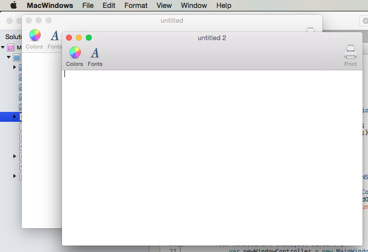](window-images/display04.png#lightbox)

If we open the **Windows** menu, you can see the application is automatically tracking and handling our open windows:

[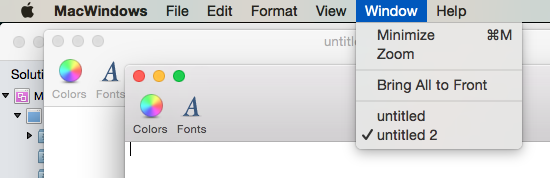](window-images/display05.png#lightbox)

For more information on working with Menus in a Xamarin.Mac application, please see our [Working with Menus](~/mac/user-interface/menu.md) documentation.

### Getting the currently active window

In a Xamarin.Mac application that can open multiple windows (documents), there are times when you will need to get the current, topmost window (the key window). The following code will return the key window:

```csharp
var window = NSApplication.SharedApplication.KeyWindow;
```

It can be called in any class or method that needs to access the current, key window. If no window is currently open, it will return `null`.

### Accessing all app windows

There might be times where you need to access all of the windows that your Xamarin.Mac app currently has open. For example, to see if a file that the user wants to open is already open in an exiting window.

The `NSApplication.SharedApplication` maintains a `Windows` property that contains an array of all open windows in your app. You can iterate over this array to access all of the app's current windows. For example:

```csharp
// Is the file already open?
for(int n=0; n<NSApplication.SharedApplication.Windows.Length; ++n) {
    var content = NSApplication.SharedApplication.Windows[n].ContentViewController as ViewController;
    if (content != null && path == content.FilePath) {
        // Bring window to front
        NSApplication.SharedApplication.Windows[n].MakeKeyAndOrderFront(this);
        return true;
    }
}
```

In the example code we are casting each returned window to the custom `ViewController` class in our app and the testing the value of a custom `Path` property against the path of a file the user wants to open. If the file is already open, we are bringing that window to the front.

## Adjusting the window size in code

There are times when the application needs to resize a window in code. To resize and reposition a window, you adjust it's `Frame` property. When adjusting a window's size, you usually need to also adjust it's origin, to keep the window in the same location because of macOS's coordinate system.

Unlike iOS where the upper left hand corner represents (0,0), macOS uses a mathematic coordinate system where the lower left hand corner of the screen represents (0,0). In iOS the coordinates increase as you move downward towards the right. In macOS, the coordinates increase in value upwards to the right. 

The following example code resizes a window:

```csharp
nfloat y = 0;

// Calculate new origin
y = Frame.Y - (768 - Frame.Height);

// Resize and position window
CGRect frame = new CGRect (Frame.X, y, 1024, 768);
SetFrame (frame, true);
```

> [!IMPORTANT]
> When you adjust a windows size and location in code, you need to make sure you respect the minimum and maximum sizes that you have set in Interface Builder. This will not be automatically honored and you will be able to make the window bigger or smaller than these limits.

## Monitoring window size changes

There might be times where you need to monitor changes in a Window's size inside of your Xamarin.Mac app. For example, to redraw content to fit the new size.

To monitor size changes, first ensure that you have assigned a custom class for the Window Controller in Xcode's Interface Builder. For example, `MasterWindowController` in the following:

[](window-images/resize01.png#lightbox)

Next, edit the custom Window Controller class and monitor the `DidResize` event on the Controller's Window to be notified of live size changes. For example:

```csharp
public override void WindowDidLoad ()
{
    base.WindowDidLoad ();

    Window.DidResize += (sender, e) => {
        // Do something as the window is being live resized
    };
}
```

Optionally, you can use the `DidEndLiveResize` event to only be notified after the user has finished changing the Window's size. For Example:

```csharp
public override void WindowDidLoad ()
{
    base.WindowDidLoad ();

        Window.DidEndLiveResize += (sender, e) => {
        // Do something after the user's finished resizing
        // the window
    };
}
```

## Setting a window’s title and represented file

When working with windows that represent documents, `NSWindow` has a `DocumentEdited` property that if set to `true` displays a small dot in the Close Button to give the user an indication that the file has been modified and should be saved before closing.

Let's edit our `ViewController.cs` file and make the following changes:

```csharp
public bool DocumentEdited {
    get { return View.Window.DocumentEdited; }
    set { View.Window.DocumentEdited = value; }
}
...

public override void ViewWillAppear ()
{
    base.ViewWillAppear ();

    // Set Window Title
    this.View.Window.Title = "untitled";

    View.Window.WillClose += (sender, e) => {
        // is the window dirty?
        if (DocumentEdited) {
            var alert = new NSAlert () {
                AlertStyle = NSAlertStyle.Critical,
                InformativeText = "We need to give the user the ability to save the document here...",
                MessageText = "Save Document",
            };
            alert.RunModal ();
        }
    };
}

public override void AwakeFromNib ()
{
    base.AwakeFromNib ();

    // Show when the document is edited
    DocumentEditor.TextDidChange += (sender, e) => {
        // Mark the document as dirty
        DocumentEdited = true;
    };

    // Overriding this delegate is required to monitor the TextDidChange event
    DocumentEditor.ShouldChangeTextInRanges += (NSTextView view, NSValue[] values, string[] replacements) => {
        return true;
    };

}
```

We are also monitoring the `WillClose` event on the window and checking the state of the `DocumentEdited` property. If it is `true` we need to give the user the ability to save the changes to the file. If we run our app and enter some text, the dot will be displayed:

[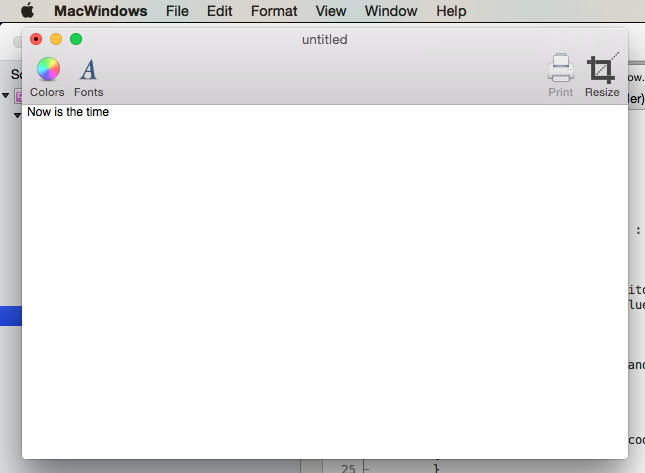](window-images/file01.png#lightbox)

If you try to close the window, you get an alert:

[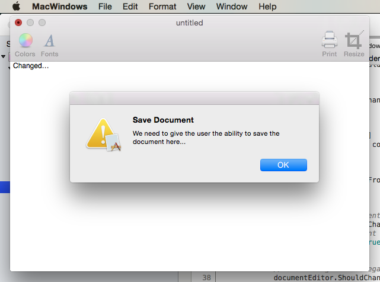](window-images/file02.png#lightbox)

If you are loading a document from a file, set the title of the window to the file's name using the `window.SetTitleWithRepresentedFilename (Path.GetFileName(path));` method (given that `path` is a string representing the file being opened). Additionally, you can set the URL of the file using the `window.RepresentedUrl = url;` method.

If the URL is pointing to a file type known by the OS, its icon will be displayed in the title bar. If the user right clicks on the icon, the path to the file will be shown.

Edit the `AppDelegate.cs` file and add the following method:

```csharp
[Export ("openDocument:")]
void OpenDialog (NSObject sender)
{
    var dlg = NSOpenPanel.OpenPanel;
    dlg.CanChooseFiles = true;
    dlg.CanChooseDirectories = false;

    if (dlg.RunModal () == 1) {
        // Nab the first file
        var url = dlg.Urls [0];

        if (url != null) {
            var path = url.Path;

            // Get new window
            var storyboard = NSStoryboard.FromName ("Main", null);
            var controller = storyboard.InstantiateControllerWithIdentifier ("MainWindow") as NSWindowController;

            // Display
            controller.ShowWindow(this);

            // Load the text into the window
            var viewController = controller.Window.ContentViewController as ViewController;
            viewController.Text = File.ReadAllText(path);
                    viewController.View.Window.SetTitleWithRepresentedFilename (Path.GetFileName(path));
            viewController.View.Window.RepresentedUrl = url;

        }
    }
}
```

Now if we run our app, select **Open...** from the **File** menu, select a text file from the **Open** Dialog box and open it:

[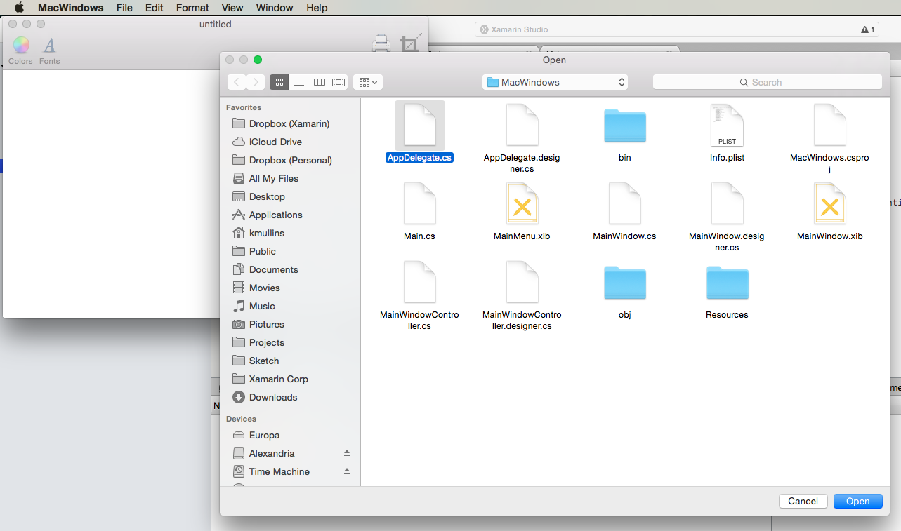](window-images/file03.png#lightbox)

The file will be displayed and the title will be set with the icon of the file:

[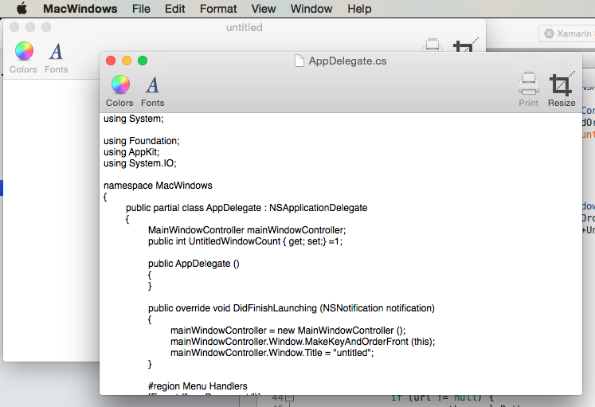](window-images/file04.png#lightbox)

## Adding a new window to a project

Aside from the main document window, a Xamarin.Mac application might need to display other types of windows to the user, such as Preferences or Inspector Panels.

To add a new window, do the following:

1. In the **Solution Explorer**, double-click the `Main.storyboard` file to open it for editing in Xcode's Interface Builder.
2. Drag a new **Window Controller** from the **Library** and drop it on the **Design Surface**:

    [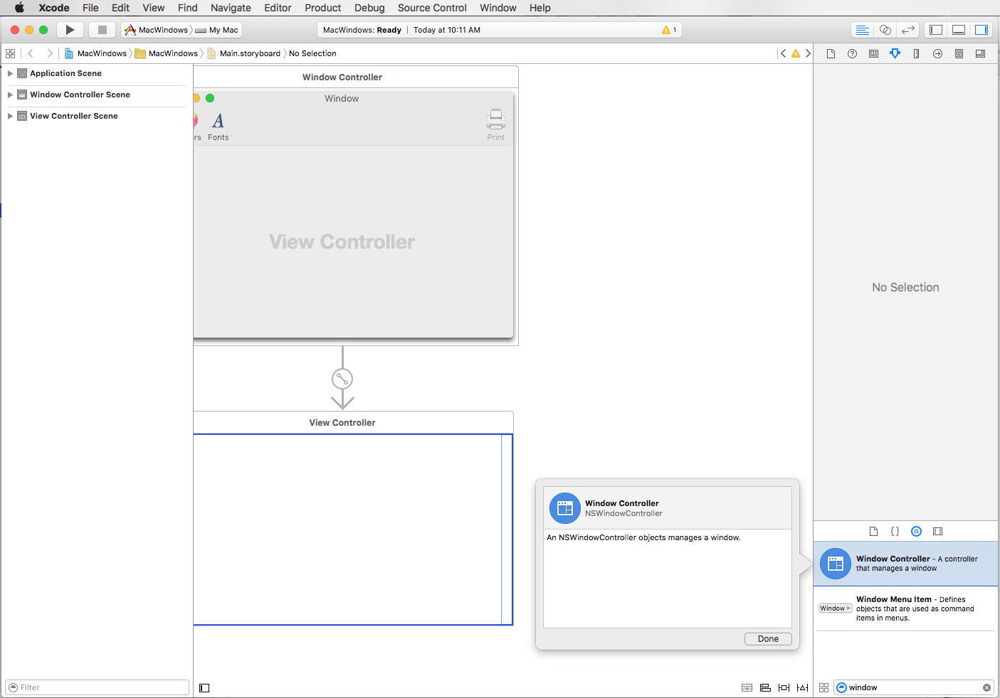](window-images/new01.png#lightbox)
3. In the **Identity Inspector**, enter `PreferencesWindow` for the **Storyboard ID**: 

    [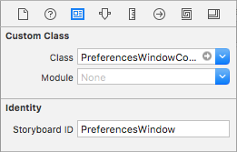](window-images/new02.png#lightbox)
4. Design your interface: 

    [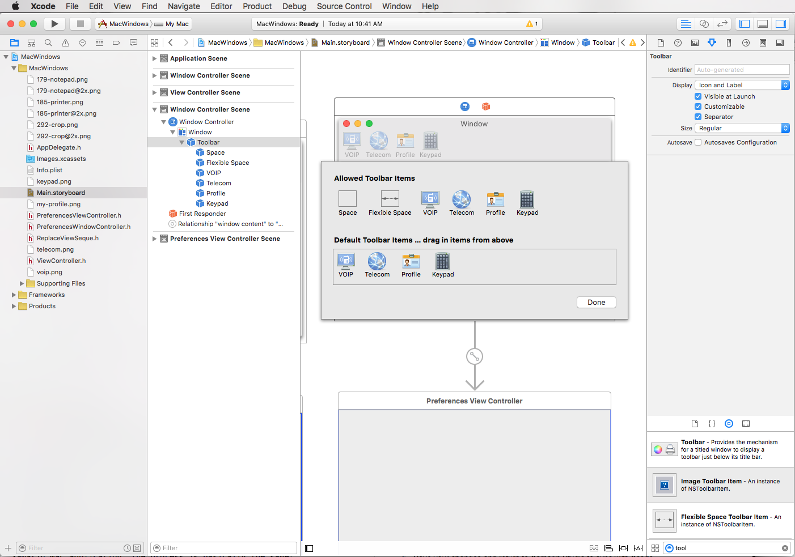](window-images/new03.png#lightbox)
5. Open the App Menu (`MacWindows`), select **Preferences...**, Control-Click and drag to the new window: 

    [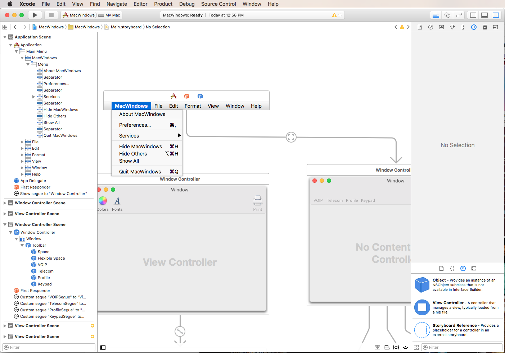](window-images/new05.png#lightbox)
6. Select **Show** from the popup menu.
7. Save your changes and return to Visual Studio for Mac to sync with Xcode.

If we run the code and select the **Preferences...** from the **Application Menu**, the window will be displayed:

[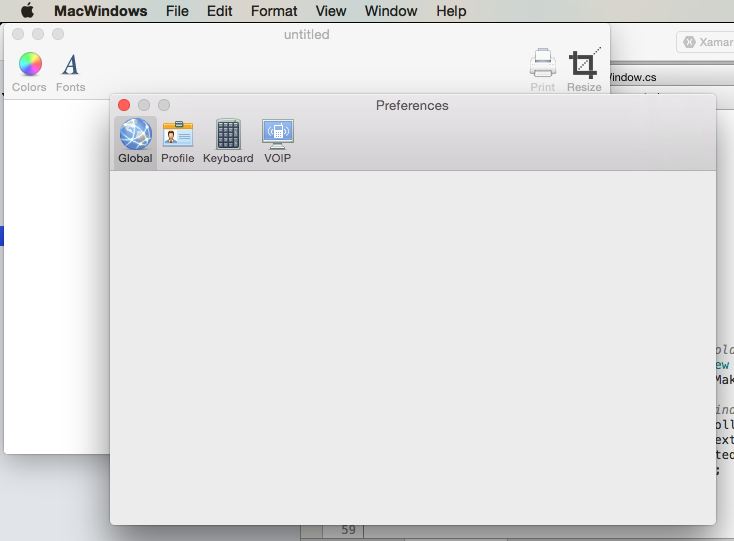](window-images/new04.png#lightbox)

## Working with panels

As stated at the start of this article, a panel floats above other windows and provides tools or controls that users can work with while documents are open. 

Just like any other type of window that you create and work with in your Xamarin.Mac application, the process is basically the same:

1. Add a new window definition to the project.
2. Double-click the `.xib` file to open the window design for editing in Xcode's Interface Builder.
3. Set any required window properties in the **Attribute Inspector** and the **Size Inspector**.
4. Drag in the controls required to build your interface and configure them in the **Attribute Inspector**.
5. Use the **Size Inspector** to handle the resizing for your UI Elements.
6. Expose the window's UI elements to C# code via **Outlets** and **Actions**.
7. Save your changes and switch back to Visual Studio for Mac to sync with Xcode.

In the **Attribute Inspector**, you have the following options specific to Panels:

[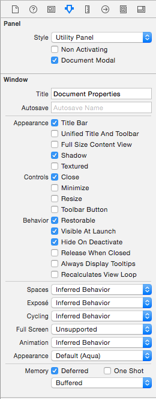](window-images/panel03.png#lightbox)

- **Style** - Allow you to adjust the style of the panel from: Regular Panel (looks like a standard window), Utility Panel (has a smaller Title bar), HUD Panel (is translucent and the title bar is part of the background).
- **Non Activating** - Determines in the panel becomes the key window.
- **Document Modal** - If Document Modal, the panel will only float above the application's windows, else it floats above all.

To add a new Panel, do the following:

1. In the **Solution Explorer**, right-click on the Project and select **Add** > **New File...**.
2. In the New File dialog box, select **Xamarin.Mac** > **Cocoa Window with Controller**:

    [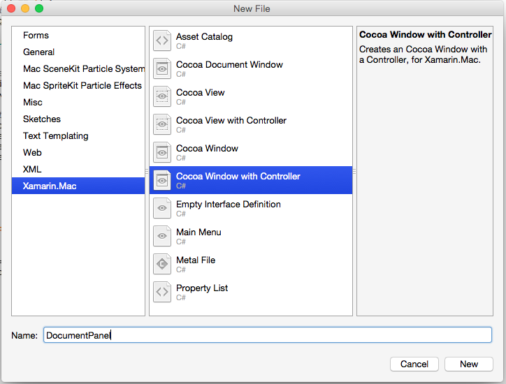](window-images/panels00.png#lightbox)

3. Enter `DocumentPanel` for the **Name** and click the **New** button.
4. Double-click the `DocumentPanel.xib` file to open it for editing in Interface Builder: 

    [](window-images/new02.png#lightbox)

5. Delete the existing Window and drag a Panel from the **Library Inspector** in the **Interface Editor**: 

    [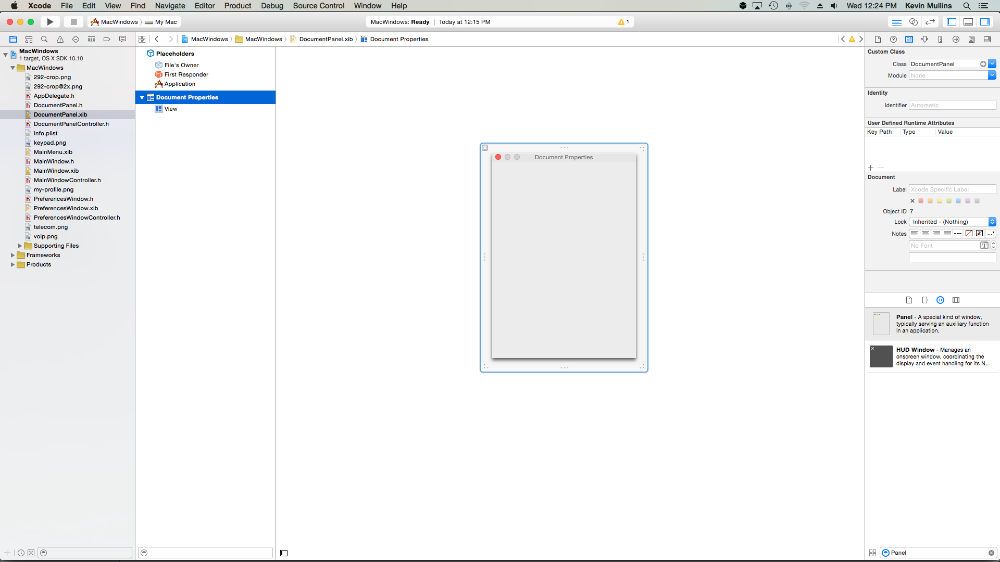](window-images/panels01.png#lightbox)

6. Hook the panel up to the **File's Owner** - **window** - **Outlet**: 

    [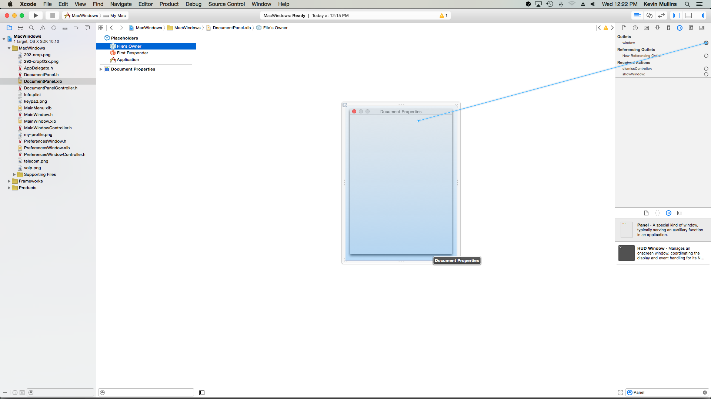](window-images/panels02.png#lightbox)

7. Switch to the **Identity Inspector** and set the Panel's class to `DocumentPanel`: 

    [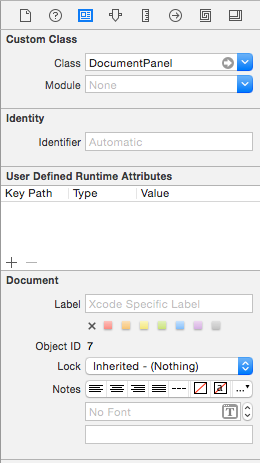](window-images/panels03.png#lightbox)

8. Save your changes and return to Visual Studio for Mac to sync with Xcode.
9. Edit the `DocumentPanel.cs` file and change the class definition to the following: 

    `public partial class DocumentPanel : NSPanel`

10. Save the changes to the file.

Edit the `AppDelegate.cs` file and make the `DidFinishLaunching` method look like the following:

```csharp
public override void DidFinishLaunching (NSNotification notification)
{
        // Display panel
    var panel = new DocumentPanelController ();
    panel.Window.MakeKeyAndOrderFront (this);
}

```

If we run our application, the panel will be displayed:

[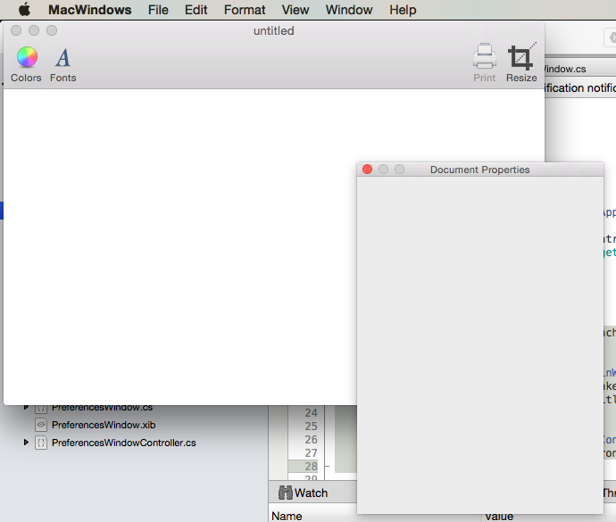](window-images/panels04.png#lightbox)

> [!IMPORTANT]
> Panel Windows have been deprecated by Apple and should be replaced with **Inspector Interfaces**. For a full example of creating an **Inspector** in a Xamarin.Mac app, please see our [MacInspector](/samples/xamarin/mac-samples/macinspector) sample app.

## Summary

This article has taken a detailed look at working with Windows and Panels in a Xamarin.Mac application. We saw the different types and uses of Windows and Panels, how to create and maintain Windows and Panels in Xcode's Interface Builder and how to work with Windows and Panels in C# code.

## Related links

- [MacWindows (sample)](/samples/xamarin/mac-samples/macwindows)
- [MacInspector (sample)](/samples/xamarin/mac-samples/macinspector)
- [Hello, Mac](~/mac/get-started/hello-mac.md)
- [Working with Menus](~/mac/user-interface/menu.md)
- [macOS design themes (Apple)](https://developer.apple.com/design/human-interface-guidelines/macos/overview/themes/)
- [Windows, Panels, and Screens (Apple)](https://developer.apple.com/documentation/appkit/windows_panels_and_screens)