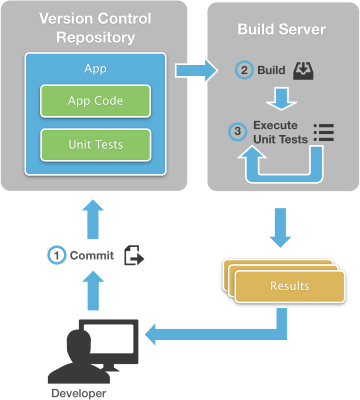
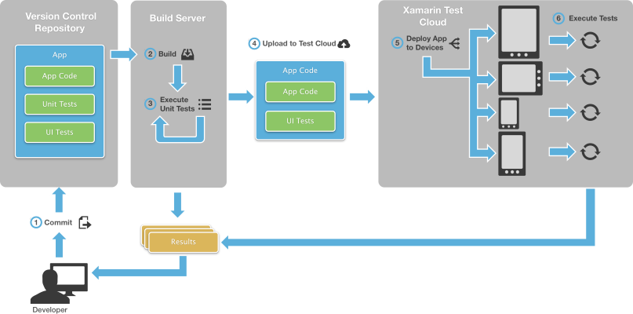
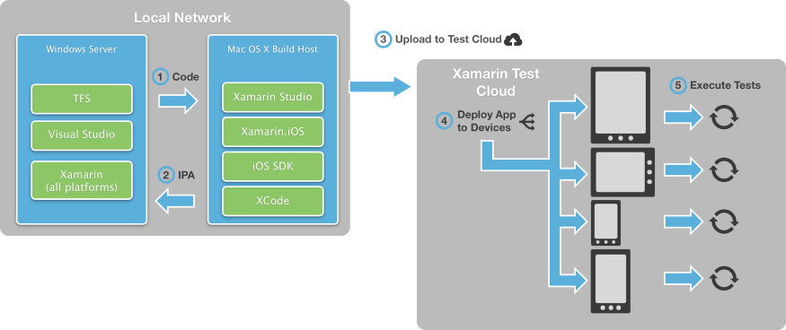
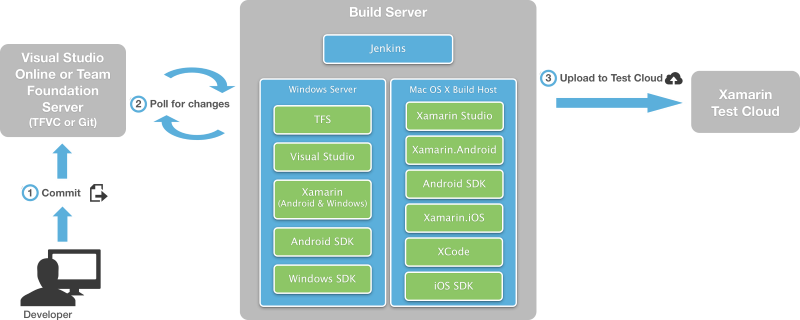
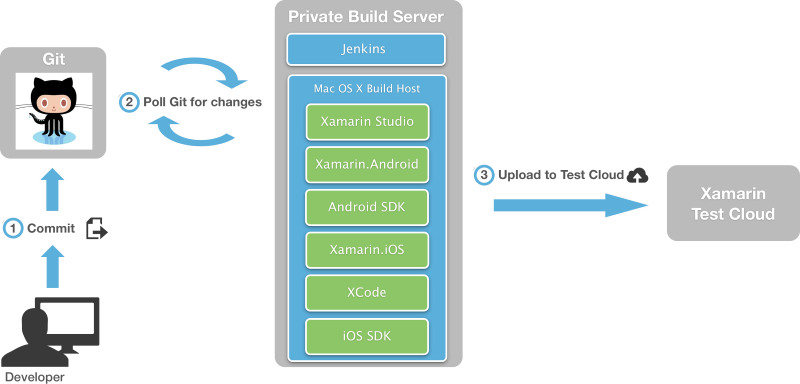

# Introduction to Continuous Integration with Xamarin

_Continuous Integration is a software engineering practice in which an automated build compiles and optionally tests an app when code is added or changed by developers in the project's version control repository. This article will discuss the general concepts of Continuous Integration and some of the options available for Continuous Integration with Xamarin projects._

It is common on software projects for developers to work in parallel. At some point, it is necessary to integrate all of these parallel streams of work into one codebase that makes up the final product. In the early days of software development, this integration was performed at the end of a project, which was a difficult and risky process.

Continuous Integration (CI) avoid such complexities by merging every developer's changes into the common code base on a continual basis, usually whenever any developers checks in changes to the project's shared code repository. Each check-in triggers an automated build and runs automated tests to verify that the newly introduced code didn’t break any existing code.  In this way, CI surfaces errors and problems immediately and ensures that all team members stay up to date with each other's work. This results in a cohesive and stable codebase.

Continuous integration systems have two main parts:

- **Version Control** – Version Control (VC), also called source control or source code management, consolidates all of a project's code into a single shared repository and keeps a full history of every change to every file. This repository, often referred to as the *mainline* or *master* branch, contains the source code that will ultimately be used to build the production or release version of the app. There are many open source and commercial products for this task, which typically allow teams or individuals to fork a copy of the code into secondary branches where they can make extensive changes or conduct experiments without risk to the master branch. Once changes in a secondary branch are validated, they can then be all together merged back into the master branch.
- **Continuous Integration Server** – The Continuous Integration Server is responsible for collecting all of a project's artifacts (source code, images, videos, databases, automated tests, etc.), compiling the app, and running the automated tests. Again, there are many open source and commercial CI server tools.

Developers typically have a working copy of one or more branches on their workstations, where work is initially done. Once an appropriate set of work is complete, the changes are "checked into" or "committed" to the appropriate branch, which propagates them to the working copies of other developers. This is how a team ensures that they're all working on the same code.

Again, with continuous integration, the act of committing changes causes the CI server to build the project and run automated tests to verify the correctness of the source code. If there are build errors or test failures, a CI server notifies the responsible developer (via email, IM, Twitter, Growl, etc.) so he or she can correct the problem. (CI servers can even refuse the commit if there are failures, which is called a "gated check-in".)

The following diagram illustrates this process:

Mobile apps introduce unique challenges for continuous integration. Apps may require sensors such as the GPS or camera that are only available on physical devices. In addition, simulators or emulators are only an approximation of hardware and may conceal or obscure problems. In the end, it's necessary to test a mobile app on real hardware to be confident that it's truly customer-ready.

The [App Center Test](/appcenter/test-cloud) addresses this particular problem by testing apps directly on hundreds of physical devices. Developers write automated acceptance tests, which allow for powerful UI testing. Once these tests are uploaded to App Center, the CI server can run them automatically as part of a CI process as shown in the following diagram:

## Components of Continuous Integration

There is an extensive ecosystem of commercial and open-source tools designed to support CI. This section explains a few of the most common ones.

### Version Control

#### Azure DevOps and Team Foundation Server

[Azure DevOps](https://azure.microsoft.com/services/devops/) and [Team Foundation Server](https://visualstudio.microsoft.com/tfs/) (TFS) are Microsoft's collaborative tools for continuous integration build services, task tracking, agile planning and reporting tools, and version control. With version control, Azure DevOps and TFS can work with its own system (Team Foundation Version Control or TFVC) or with projects hosted on GitHub.

- Azure DevOps provides services via the cloud. Its primary advantage is that it requires no dedicated hardware or infrastructure and can be accessed from anywhere through web browsers and through popular development tools such as Visual Studio, making it appealing for teams that are geographically distributed. It is free for teams of five developers or less, after which additional licenses can be purchased to accommodate a growing team.
- TFS is designed for on-premises Windows servers and accessed through a local network or a VPN connection to that network. Its primary advantage is that you fully control the configuration of the build servers and can install whatever additional software or services are needed. TFS has a free entry-level Express edition for small teams.

Both TFS and Azure DevOps are tightly integrated with Visual Studio and allow developers to perform many version control and CI tasks from within the comfort of a single IDE. The Team Explorer Everywhere plugin for Eclipse (see below) is also available. Visual Studio for Mac has [a preview of TFVC available](/visualstudio/mac/tf-version-control/).

[Azure DevOps Pipelines](/azure/devops/pipelines/languages/xamarin/) has direct support for Xamarin projects, within which you create a build definition for each platform you wish to target (Android, iOS, and Windows). The appropriate Xamarin license is needed for each build definition. It's also possible to connect a local, Xamarin-capable TFS build server to Azure DevOps for this purpose. With this setup, builds that are queued to Azure DevOps will be delegated to the local server. For details, refer to [Build and release agents](/azure/devops/pipelines/agents/agents). Alternately, you can use another build tool such as Jenkins or Team City.

A complete summary of all Application Lifecycle Management (ALM) features of Visual Studio, Azure DevOps, and Team Foundation Server, see [DevOps with Xamarin Apps](/visualstudio/cross-platform/application-lifecycle-management-alm-with-xamarin-apps).

#### Team Explorer Everywhere

[Team Explorer Everywhere](/azure/devops/java/download-eclipse-plug-in/) brings the power of Team Foundation Server and Azure DevOps to teams developing outside of Visual Studio. It allows developers to connect to team projects on premises or in the cloud from Eclipse or the cross-platform command line client for OS X and Linux. Team Explorer Everywhere provides full access to version control (including Git), work items, and build capabilities for non-Windows platforms.

#### Git

[Git](https://git-scm.com) is a popular open source version control solution that was originally developed to manage the source code for the Linux kernel. It is a very fast, flexible system that is popular with software projects of all sizes. It easily scales from single developers with poor Internet access to large teams that span the globe. Git also makes branching very easy, which in turn can encourage parallel streams of development with minimal risk.

Git can operate entirely through web browsers, or [GUI clients](https://git-scm.com/downloads/guis) that run on Linux, Mac OSX, and Windows. It is free for public repositories; private repositories require a [paid plan](https://github.com/pricing).

Current versions of Visual Studio for Windows and Mac provide native support for Git. Microsoft provides a [downloadable extension for Git](https://visualstudiogallery.msdn.microsoft.com/abafc7d6-dcaa-40f4-8a5e-d6724bdb980c) for older versions of Visual Studio. As noted above, Azure DevOps and TFS can use Git for version control instead of TFVC.

#### Subversion

[Subversion](https://subversion.apache.org) (SVN) is a popular, open source version control system that has been in use since 2000. SVN runs on all modern versions of OS X, Windows, FreeBSD, Linux, and Unix. Visual Studio for Mac has native support for SVN. There are third party extensions that bring SVN support to Visual Studio.

### Continuous Integration Environments

Setting up a continuous integration environment means combining a version control system with a build service.  For the latter, the two most common ones are:

- [Azure Pipelines](/azure/devops/pipelines/) is the build system of Azure DevOps and TFS. It is tightly integrated with Visual Studio, which makes it convenient for developers to trigger builds, automatically run tests, and see the results.
- Jenkins is an open-source CI server with a rich ecosystem of plugins to support all kinds of software development. It runs on Windows and Mac OS X. Jenkins is not integrated with any specific IDE. Instead, it is configured and managed via a web interface. Jenkins CI is also easy to install and configure which makes it appealing to small teams.

You can use TFS/Azure DevOps by itself, or you can use Jenkins in combination with TFS/Azure DevOps or Git as described in the following sections.

#### Azure DevOps and Team Foundation Server

As discussed, Azure DevOps and Team Foundation Server provides both version control and build services. Build services always require a Xamarin Business or Enterprise license for each target platform.

With Azure DevOps, you create a separate build definition for each target platform and enter the appropriate license there. Once configured, Azure DevOps will run builds and tests in the cloud. See [Azure Pipelines](/azure/devops/pipelines/) for more details.

With Team Foundation Server, you configure a build machine as follows for specific target platforms:

- **Android and Windows:** Install Visual Studio and the Xamarin tools (for Android and Windows both) and configure with your Xamarin licenses. It is also necessary to move the Android SDK to a shared location on the server where the TFS build agent can find it. For details, see [Configuring TFVC](/azure/devops/repos/tfvc/overview).
- **iOS and Xamarin:** Install Visual Studio and the Xamarin tools on the Windows server with the appropriate license. Then install Visual Studio for Mac on a network-accessible Mac OS X machine, which will serve as a build host and create the final app package (IPA for iOS, APP for OS X).

The following diagram illustrates this topography:

It is also possible to link a local TFS server to an Azure DevOps project so that Azure DevOps builds are delegated to the local server. For details, see [Build and release agents](/azure/devops/pipelines/agents/agents/).

#### Azure DevOps and Jenkins

If you use Jenkins to build your apps, you can store your code in Azure DevOps or Team Foundation Server and continue to use Jenkins for your CI builds. You can trigger a Jenkins build when you push code to your team project's Git repository or when you check code in to TFVC. For details, see [Jenkins with Azure DevOps](/azure/devops/service-hooks/services/jenkins).

#### Git And Jenkins

Another common CI environment can be entirely OS X based. This scenario involves using Git for source code control and Jenkins for the build server. Both of these are running on a single Mac OS X computer with Visual Studio for Mac installed. This is very similar to the Azure DevOps + Jenkins environment discussed in the previous section:

> [!IMPORTANT]
> **Jenkins is [not supported by Microsoft](~/cross-platform/troubleshooting/questions/xamarin-jenkins.md).**