# Using Jenkins with Xamarin

_This guide illustrates how to set up Jenkins as a continuous integration server and automate compiling mobile applications created with Xamarin. It describes how to install Jenkins on OS X, configure it, and set up jobs to compile Xamarin.iOS and Xamarin.Android applications when changes are committed to the source code management system._

[Introduction to Continuous Integration with Xamarin](~/tools/ci/intro-to-ci.md) introduces continuous integration as a useful software development practice that provides early warning of broken or incompatible code. CI allows developers to address issues and problems as they arise, and keeps the software in a suitable state for deployment. This walkthrough covers how to use the content from both documents together.

This guide shows how to install Jenkins on a dedicated computer running OS X, and configure it to run automatically when the computer starts up. Once Jenkins is installed, we will install additional plugins to support MS Build. Jenkins supports Git out of the box. If TFS is being used for source code control, an additional plugin and command line utilities must also be installed.

Once Jenkins is configured and any necessary plugins have been installed, we will create one or more jobs to compile the Xamarin.Android and Xamarin.iOS projects. A job is a collection of steps and metadata required to perform some work. A job typically consists of the following:

- **Source Code Management (SCM)** – This is a meta-data entry in the Jenkins configuration files that contains information on how to connect to source code control and what files to retrieve.
- **Triggers** – Triggers are used to start a job based on certain actions, such as when a developer commits changes to the source code repository.
- **Build Instructions** – This is a plugin or a script that will compile the source code and produce a binary that can be installed on mobile devices.
- **Optional Build Actions** – This could include running unit tests, performing static analysis on the code, signing code, or starting another job to perform other build related work.
- **Notifications** – A job may send out some kind of notification about the status of a build.
- **Security** – Although optional, it is strongly recommended that the Jenkins security features also be enabled.

This guide will walk through how to setup a Jenkins server covering each of these points. By the end of it, we should have a good understanding of how to setup and configure Jenkins to create IPA and APK’s for our Xamarin mobile projects.

## Requirements

The ideal build server is a stand-alone computer dedicated to the sole purpose of building and possibly testing the application. A dedicated computer ensures that artifacts that might be required for other roles (such as that of a web server) do not contaminate the build. For example, if the build server is also acting as a web server, the web server may require a conflicting version of some common library. Because of this conflict the web server may not function properly or Jenkins may create builds that do not work when deployed to users.

The build server for Xamarin mobile apps is set up very much like a developer’s workstation. It has a user account in which Jenkins, Visual Studio for Mac, and Xamarin.iOS and Xamarin.Android will be installed. All of the code signing certificates, provisioning profiles, and key stores must be installed as well. *Typically the build server's user account is separate from your developer accounts - be sure to install and configure all the software, keys, and certificates while logged in with the build server user account.*

The following diagram illustrates all of these elements on a typical Jenkins build server:

[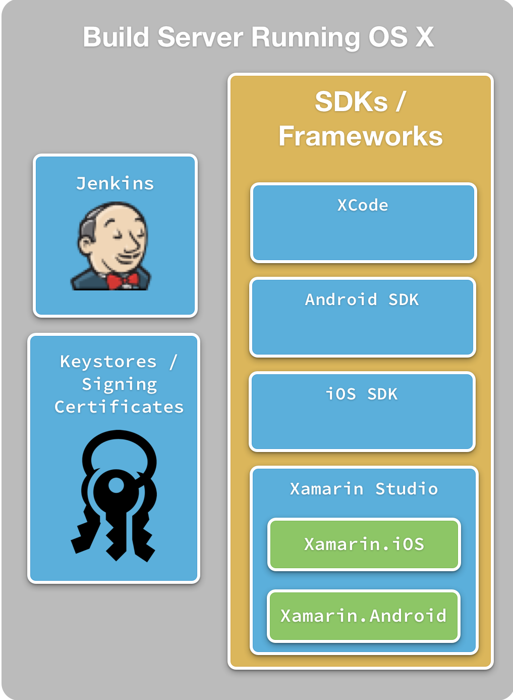](jenkins-walkthrough-images/image1.png#lightbox)

iOS applications can only be built and signed on a computer running macOS. A Mac Mini is a reasonable lower-cost option, but any computer capable of running OS X 10.10 (Yosemite) or higher is sufficient.

If TFS is being used for source code control, you will want to install [Team Explorer Everywhere](/azure/devops/java/download-eclipse-plug-in/). Team Explorer Everywhere provides cross-platform access to TFS at the Terminal in macOS.

[!include[](~/tools/ci/includes/firewall-information.md)]

## Installing Jenkins

The first task to using Jenkins is to install it. There are three ways to run Jenkins on OS X:

- As a daemon, running in the background.
- Inside a servlet container such as Tomcat, Jetty, or JBoss.
- As a normal process running under a user account.

Most traditional continuous integration applications run in the background, either as a daemon (on OS X or \*nix) or as a service (on Windows). This is suitable for scenarios where there is no GUI interaction required, and where the setup of the build environment can be easily performed. Mobile apps also require keystores and signing certificates that might be problematic to access when Jenkins is running as a daemon. Because of these concerns, this document focuses on the third scenario – running Jenkins under a user account on the build server.

Jenkins.App is a handy way to install Jenkins. This is an AppleScript wrapper that simplifies the starting and stopping of a Jenkins server. Instead of running in a bash shell, Jenkins runs as an app with icon in the Dock, as shown in the following screenshot:

[](jenkins-walkthrough-images/image2.png#lightbox)

Starting or stopping Jenkins is as simple as starting or stopping Jenkins.App.

To install Jenkins.App, download the latest version from the project’s download page, pictured in the screenshot below:

[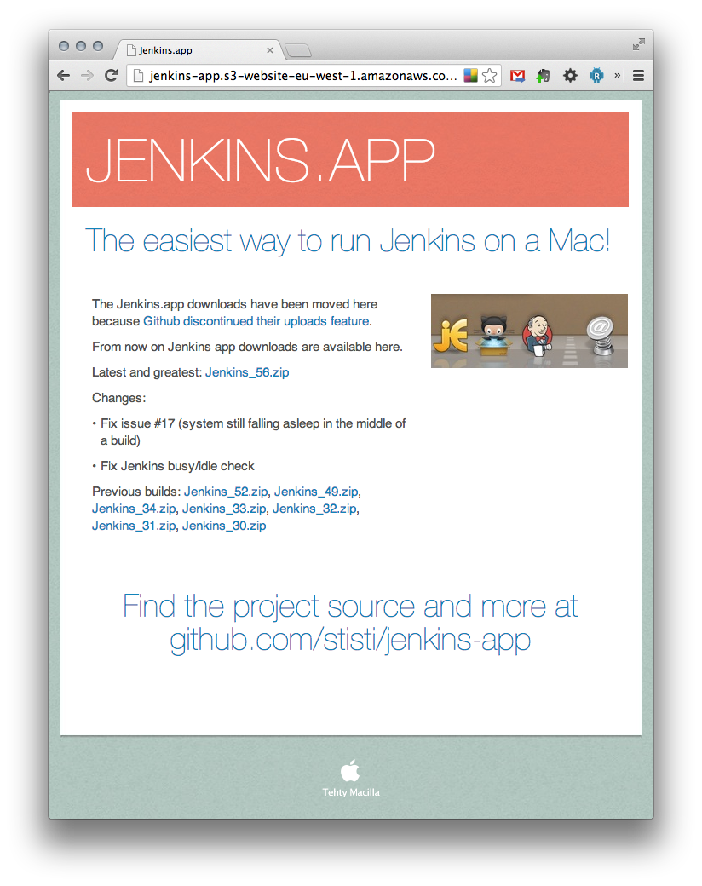](jenkins-walkthrough-images/image3.png#lightbox)

Extract the zip file to the `/Applications` folder on your build server, and start it just like any other OS X application.
The first time you start up Jenkins.App, it will present a dialog informing you that it will download Jenkins:

[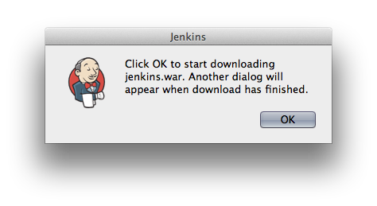](jenkins-walkthrough-images/image4.png#lightbox)

Once Jenkins.App has finished its download, it will display another dialog asking you if you would like to customize the Jenkins startup, as seen in the following screenshot:

[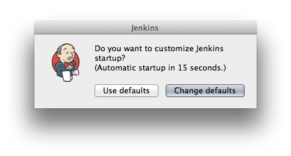](jenkins-walkthrough-images/image5.png#lightbox)

Customizing Jenkins is optional and does not have to be performed each time the app is started – the default settings for Jenkins will work for most situations.

If it is necessary to customize Jenkins, click on the **Change defaults** button. This will present you with two consecutive dialogs: one that asks for Java command line parameters, and another that asks for Jenkins command line parameters. The following two screenshots show these two dialogs:

[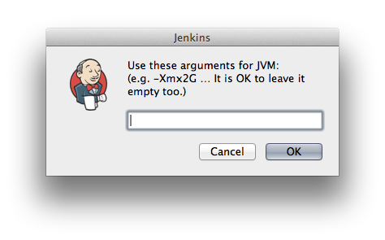](jenkins-walkthrough-images/image6.png#lightbox)

[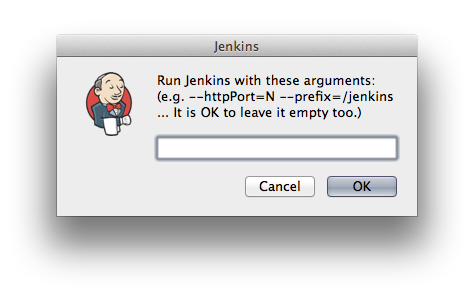](jenkins-walkthrough-images/image7.png#lightbox)

Once Jenkins is running, you may want to set it as a login item so that it will start up each time the user logins in to the computer. You can do this by right-clicking on the Jenkins icon in the Dock and choosing **Options... > Open at Login**, as shown in the following screenshot:

[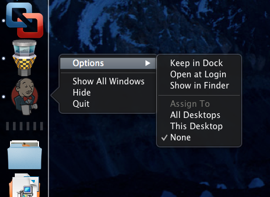](jenkins-walkthrough-images/image8.png#lightbox)

This will cause Jenkins.App to automatically launch each time the user logs in, but not when the computer boots up. It is possible to specify a user account that OS X will use to automatically login with at boot time. Open the **System Preferences**, and select the **Users & Groups** icon as shown in this screenshot:

[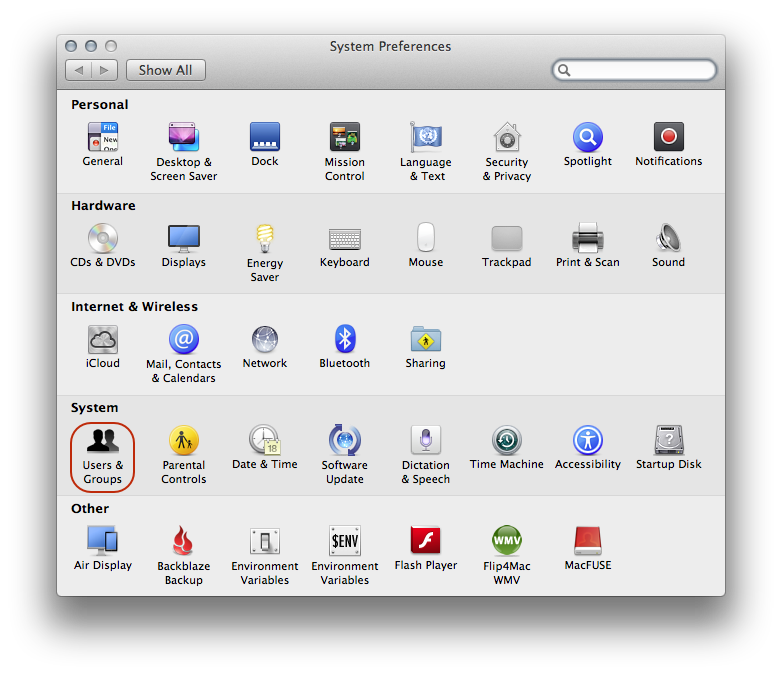](jenkins-walkthrough-images/image9.png#lightbox)

Click on the **Login Options** button, and then choose the account that OS X will use for login at boot time.

At this point Jenkins has been installed. However, if we want to build Xamarin mobile applications, we will need to install some plugins.

### Installing Plugins

When the Jenkins.App installer has completed, it will start Jenkins and launch the web browser with the URL http://localhost:8080, as shown in the screenshot below:

[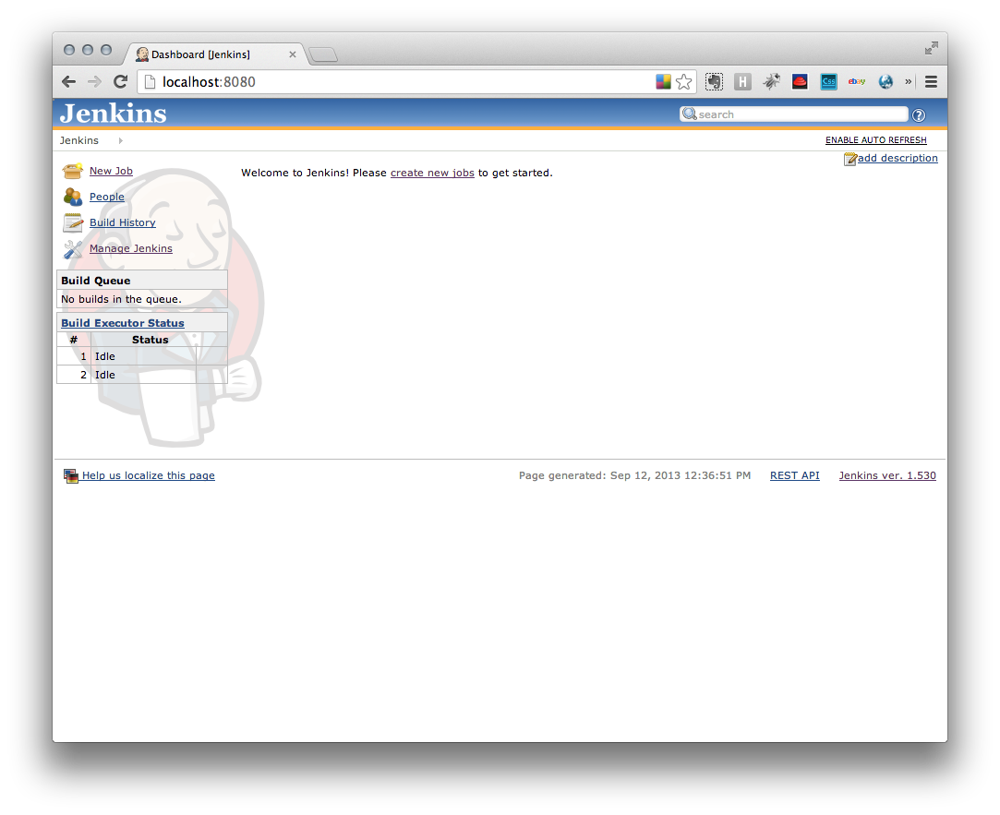](jenkins-walkthrough-images/image10.png#lightbox)

From this page, select **Jenkins > Manage Jenkins > Manage Plugins** from the menu in the upper left hand corner, as shown in the screenshot below:

[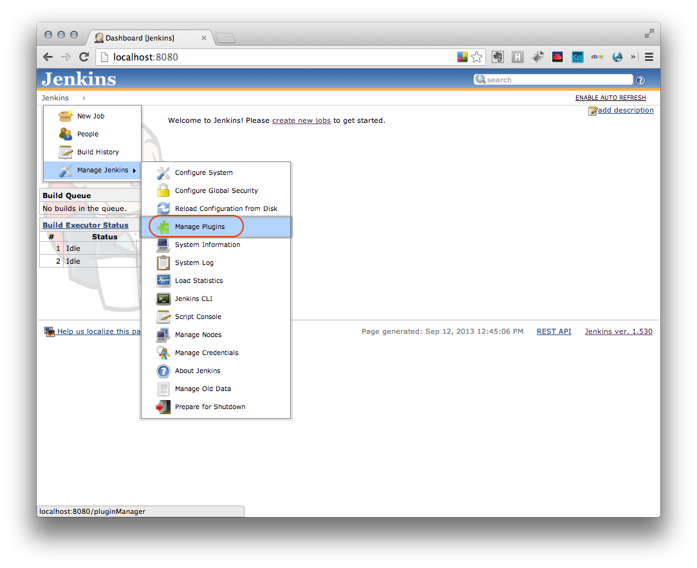](jenkins-walkthrough-images/image11.png#lightbox)

This will display the **Jenkins Plugin Manager** page. If you click on the Available tab, you will see a list of over 600 plugins that can be downloaded and installed. This is pictured in the screenshot below:

[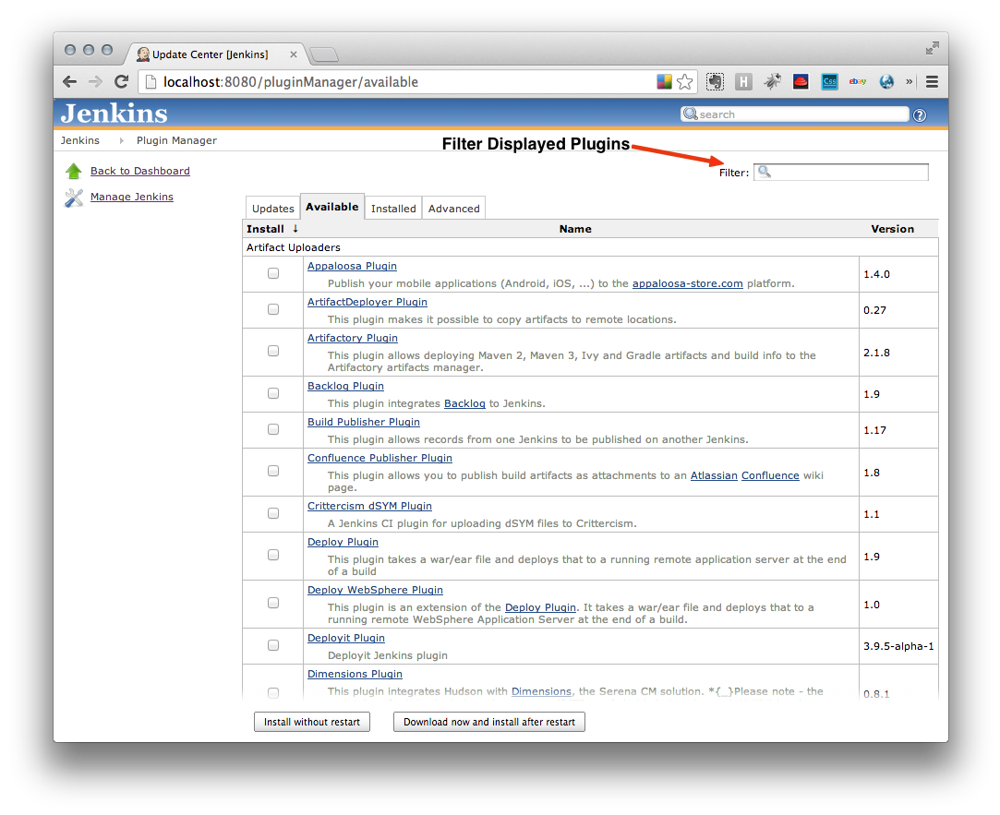](jenkins-walkthrough-images/image12.png#lightbox)

Scrolling through all 600 plugins to find a few can be tedious and error prone. Jenkins provides a Filter search field in the upper right-hand corner of the interface. Using this Filter field to search will simplify locating and installed one or all of the following plugins:

- **Jenkins MSBuild Plugin** – This plugin makes it possible to build Visual Studio and Visual Studio for Mac solutions (.sln) and projects (.csproj).
- **Environment Injector Plugin** – This is an optional but useful plugin that makes it possible to set environment variables at the job and build level. It also offers extra protection for variables such as the passwords used to code sign the application. It is sometimes abbreviated as the  *EnvInject Plugin* .
- **Team Foundation Server Plugin** – This is an optional plugin that is only required if you are using Team Foundation Server or Team Foundation Services for source code control.

Jenkins supports Git without any extra plugins.

After installing all of the plugins, you’ll want to restart Jenkins and configure the global settings for each plugin. The global settings for a plugin can be found by selecting **Jenkins > Manage Jenkins > Configure System** from the upper left hand corner, as shown in the screenshot below:

[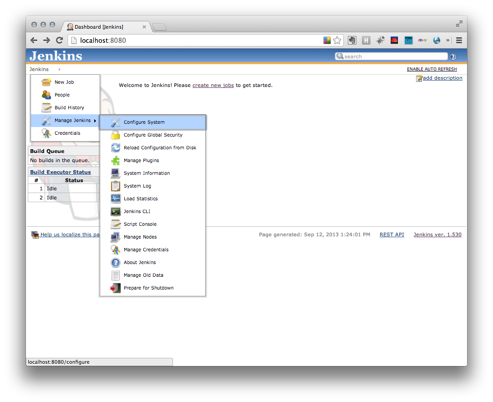](jenkins-walkthrough-images/image13.png#lightbox)

When you select this menu option, you will be taken to the **Configure System [Jenkins]** page. This page contains sections to configure Jenkins itself and to set some of the global plugin values.  The screenshot below illustrates an example of this page:

[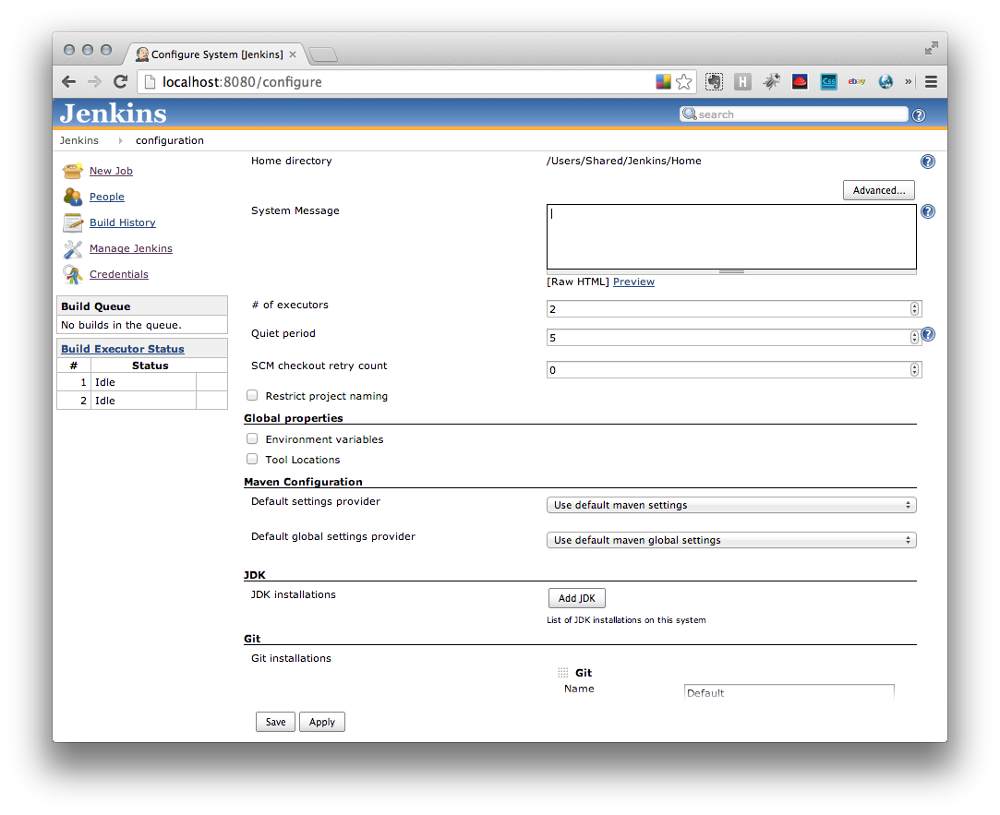](jenkins-walkthrough-images/image14.png#lightbox)

#### Configuring the MSBuild Plugin

The MSBuild plugin must be configured to use **/Library/Frameworks/Mono.framework/Commands/xbuild** to compile Visual Studio for Mac solution and project files. Scroll down the **Configure System [Jenkins]** page until the **Add MSBuild** button appears, as shown in the screenshot below:

 [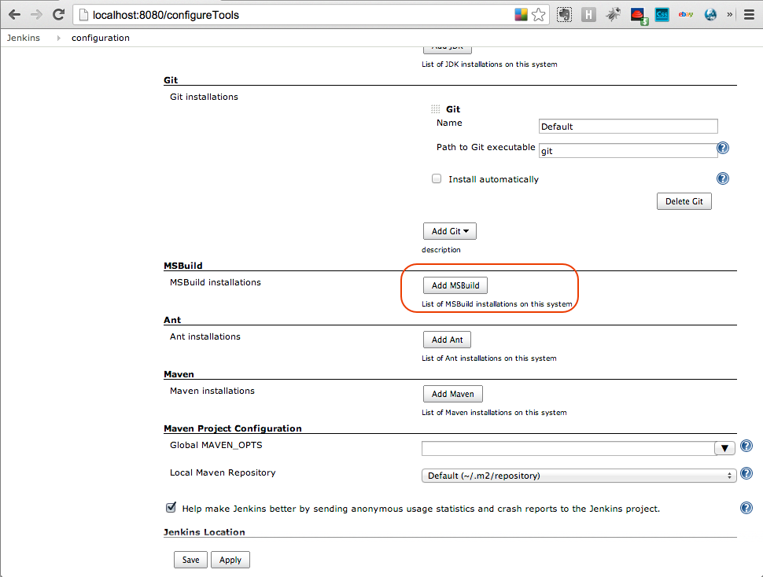](jenkins-walkthrough-images/image15.png#lightbox)

Click on this button, and fill out the **Name** and **Path** to **MSBuild** fields on the form that appears. The name of your **MSBuild** installation should be something meaningful, while the **Path to MSBuild** should be the path to `xbuild`, which is typically **/Library/Frameworks/Mono.framework/Commands/xbuild**. After we save the changes by clicking the Save or the Apply button at the bottom of the page, Jenkins will be able to use `xbuild` to compile your solutions.

#### Configuring the TFS Plugin

This section is mandatory if you intend to use TFS for your source code control.

In order for an macOS workstation to interact with a TFS server, [Team Explorer Everywhere](/azure/devops/java/download-eclipse-plug-in/) must be installed on the workstation. Team Explorer Everywhere is a set of tools from Microsoft that includes a cross-platform command line client for accessing TFS. Team Explorer Everywhere can be downloaded from Microsoft and installed in three steps:

1. Unzip the archive file to a directory that is accessible to the user account. For example, you might unzip the file to **~/tee**.
2. Configure the shell or system path to include the folder that holds the files that were unzipped in step one above. For example,

    ```
    echo export PATH~/tee/:$PATH' >> ~/.bash_profile
    ```

3. To confirm that Team Explorer Everywhere is installed, open a terminal session, and execute the `tf` command. If tf is properly configured, you will see the following output in your terminal session:

    ```
    $ tf
    Team Explorer Everywhere Command Line Client (version 11.0.0.201306181526)

    Available commands and their options:
    ```

Once the command line client for TFS is installed, Jenkins must be configured with the full path to the `tf` command line client. Scroll down the **Configure System [Jenkins]** page until you find the Team Foundation Server section, as shown in the following screenshot:

[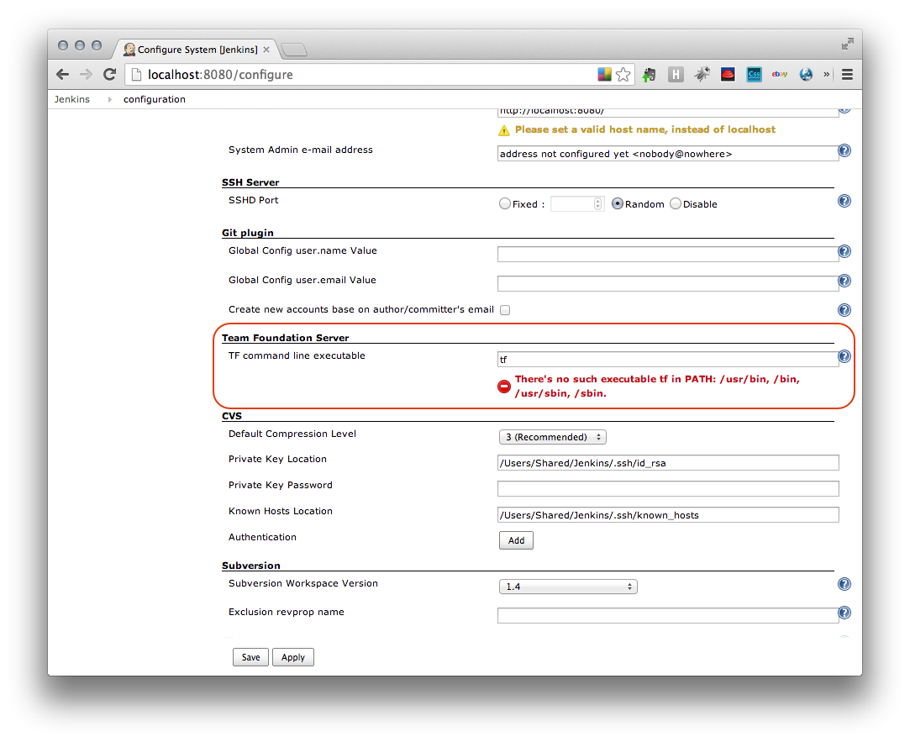](jenkins-walkthrough-images/image17.png#lightbox)

Enter the full path to the `tf` command, and click the **Save** button.

### Configure Jenkins Security

When first installed, Jenkins has security disabled, so it is possible for any user to set up and run any kind of job anonymously. This section covers how to configure security using the Jenkins user database to configure authentication and authorization.

Security settings can be found by selecting **Jenkins > Manage Jenkins > Configure Global Security**, as shown in this screenshot:

[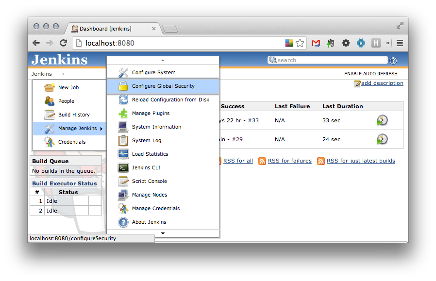](jenkins-walkthrough-images/image18.png#lightbox)

On the **Configure Global Security** page, check the **Enable Security** checkbox and the **Access Control** form should appear, similar to the next screenshot:

[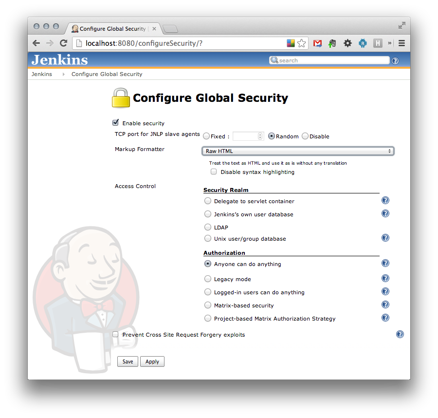](jenkins-walkthrough-images/image19.png#lightbox)

Toggle the radio button for **Jenkins’ own user database** in the **Security Realm Section**, and ensure that **Allow users to sign up** is also checked, as illustrated in the following screenshot:

[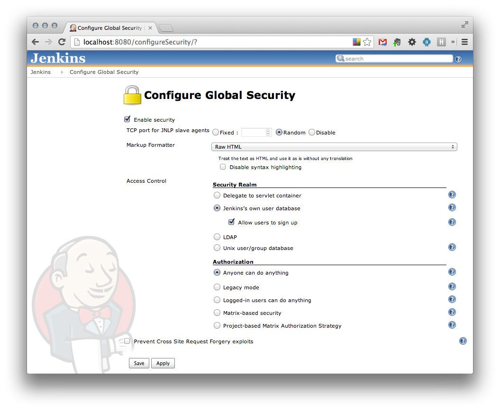](jenkins-walkthrough-images/image20.png#lightbox)

Finally, restart Jenkins and create a new account. The first account that is created is the root account, and this account will be automatically promoted to an administrator. Navigate back to the **Configure Global Security** page, and check off the **Matrix-based security** radio button. The root account should be granted full access, and the anonymous account should be given read-only access, as shown in the following screenshot:

[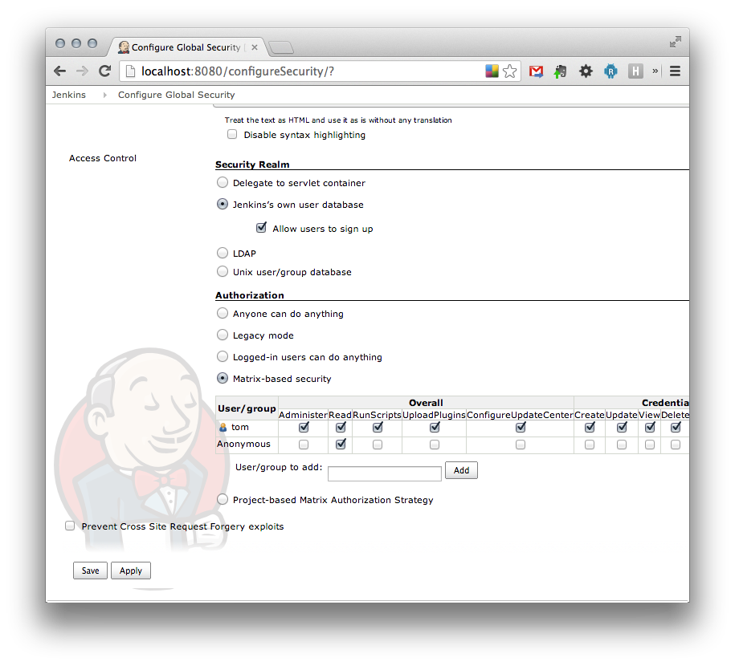](jenkins-walkthrough-images/image21.png#lightbox)

Once these settings are saved and Jenkins is restarted, security will be turned on.

#### Disabling Security

In the event of a forgotten password or Jenkins-wide lockout, it is possible to disable security by following these steps:

1. Stop Jenkins. If you are using Jenkins.app, you can do this by right-clicking on the Jenkins.App icon in the Dock, and selecting Quit from the menu that pops up:

    

2. Open the file **~/.jenkins/config.xml** in a text editor.
3. Change the value of the `<usesecurity></usesecurity>` element from `true` to `false`.
4. Delete the `<authorizationstrategy></authorizationstrategy>` and the `<securityrealm></securityrealm>` elements from the file.
5. Restart Jenkins.

## Setting up a Job

At the top level, Jenkins organizes all of the various tasks required to build software into a *job*. A job also has metadata associated with it, providing information about the build such as how to get the source code, how often the build should run, any special variables that are necessary for building, and how to notify developers if the build fails.

Jobs are created by selecting **Jenkins > New Job** from the menu in the upper right hand corner, as shown in the following screenshot:

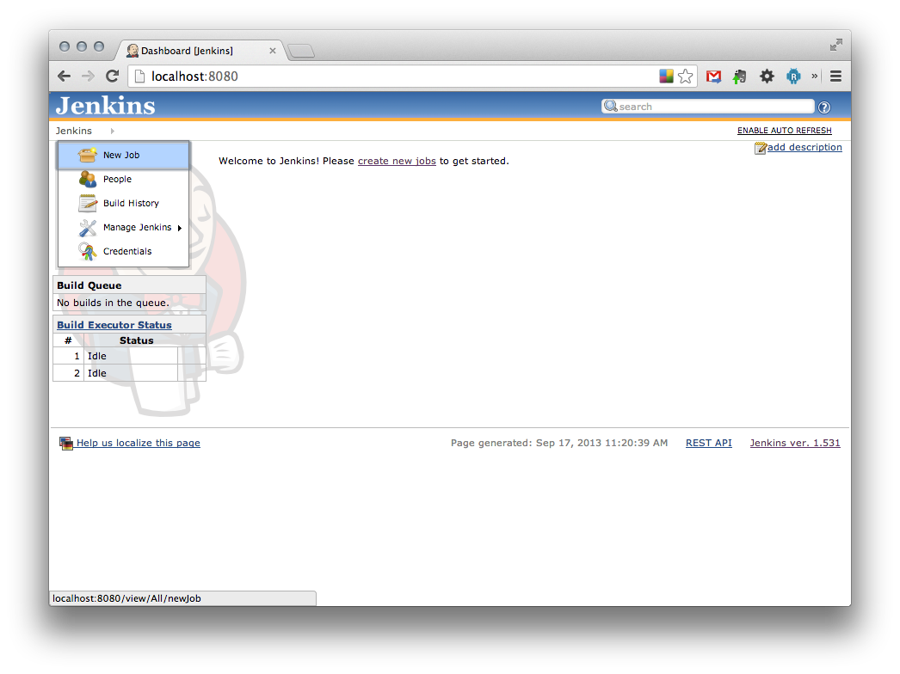

This will display the **New Job [Jenkins]** page. Enter a name for the job, and select the **Build a free-style software project** radio button. The following screenshot shows an example of this:

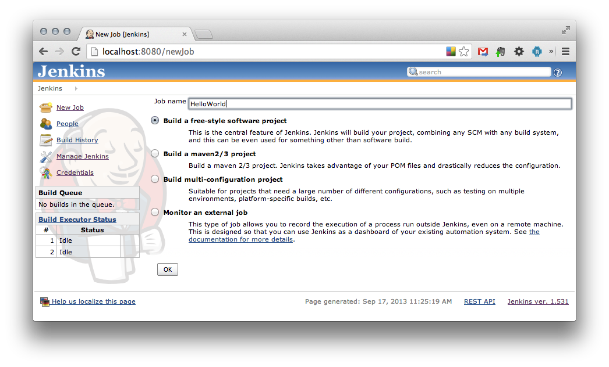

Clicking the **OK** button presents the configuration page for the job. This should resemble the following screenshot:

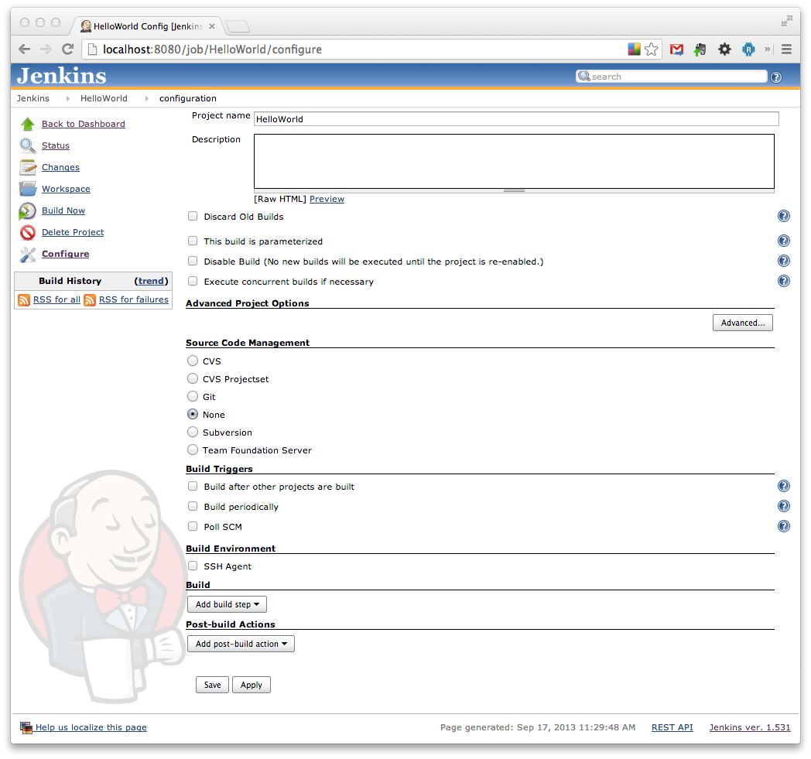

Jenkins organizes jobs in a directory on the hard disk located at the following path:
**~/.jenkins/jobs/[JOB NAME]**

This folder contains all the files and artifacts specific to the job such as logs, configuration files, and the source code that needs to be compiled.

Once the initial job has been created, it must be configured with one or more of the following:

- The source code management system must be specified.
- One or more *build actions* must be added to the project. These are the steps or tasks required to build the application.
- The job must be assigned one *build trigger* – a set of instructions informing Jenkins how often to retrieve the code and build the final project.

### Configuring Source Code Control

The first task Jenkins does is retrieve the source code from the source code management system. Jenkins supports many of the popular source code management systems available today. This section covers two popular systems, Git and Team Foundation Server. Each of these source code management systems is discussed in more detail in the sections below.

#### Using Git for Source Code Control

If you are using TFS for source code control, [skip](#using-tfs-for-source-code-management) this section and proceed to the next section using TFS.

Jenkins supports Git out of the box – no extra plugins are necessary. To use Git, click on the **Git** radio button and enter the URL for the Git repository, as shown in the following screenshot:

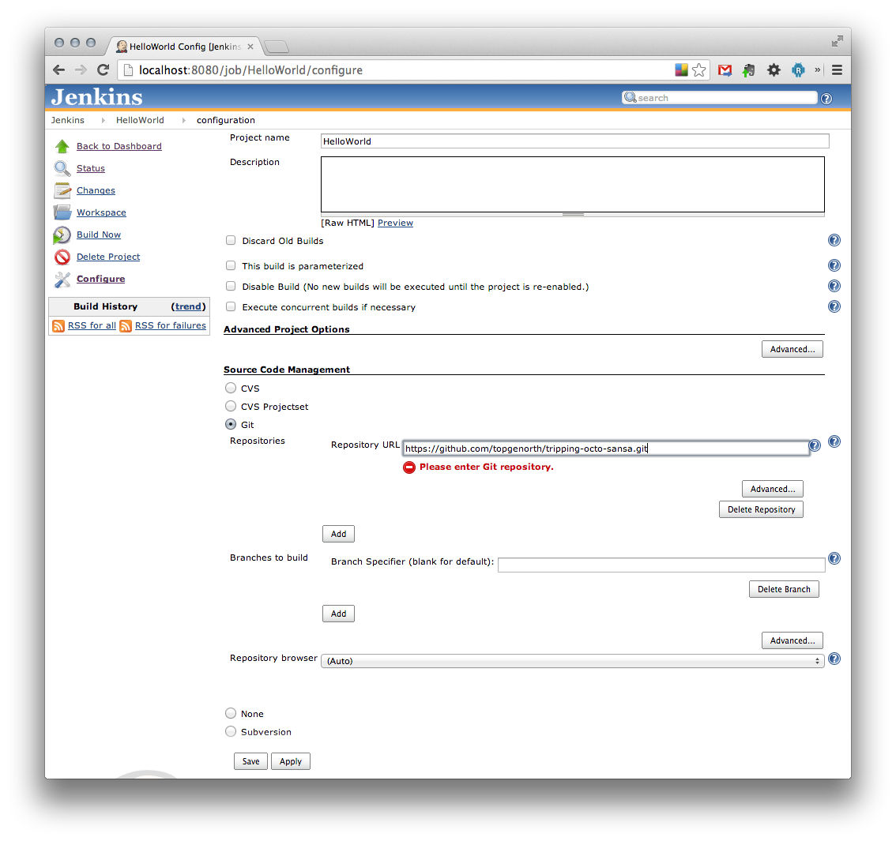

Once the changes are saved, Git configuration is complete.

#### Using TFS for Source Code Management

This section only applies to TFS users.

Click on the **Team Foundation Server** radio button and the TFS configuration section should appear, similar to what is in the following screenshot:

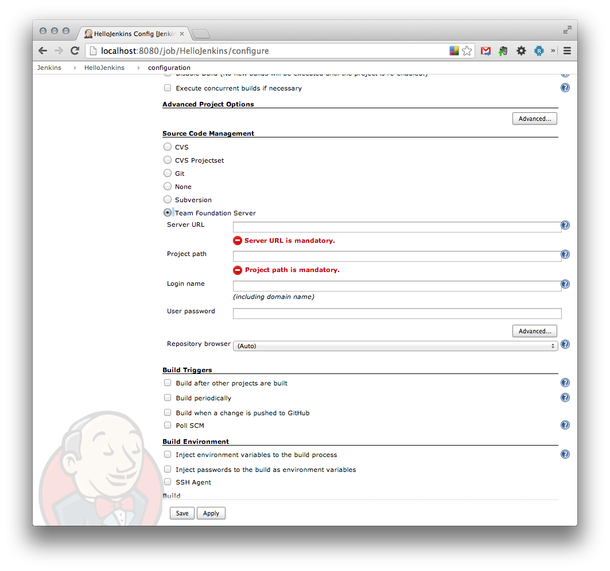

Provide the necessary information for TFS. The following screenshot shows an example of the completed form:

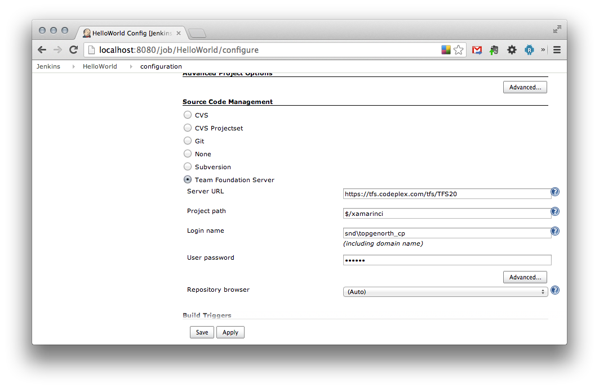

#### Testing The Source Code Control Configuration

Once the appropriate source code control has been configured, click **Save** to save the changes. This will return you to the home page for the job, which will resemble the following screenshot:

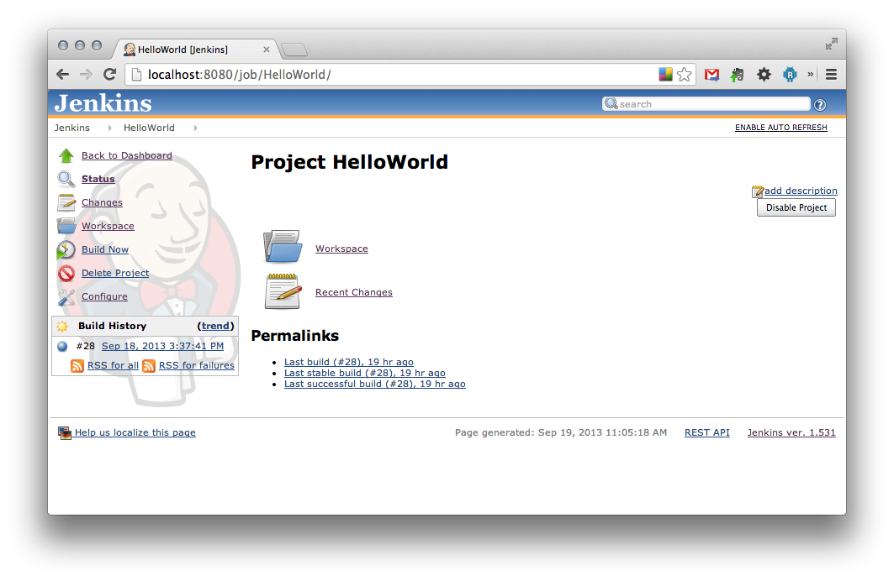

The simplest way to validate that the source code control is properly configured is to trigger a build manually, even though there are no build actions specified. To start a build manually, the home page of the job has a **Build Now** link in the menu on the left hand side, as shown in the screenshot below:

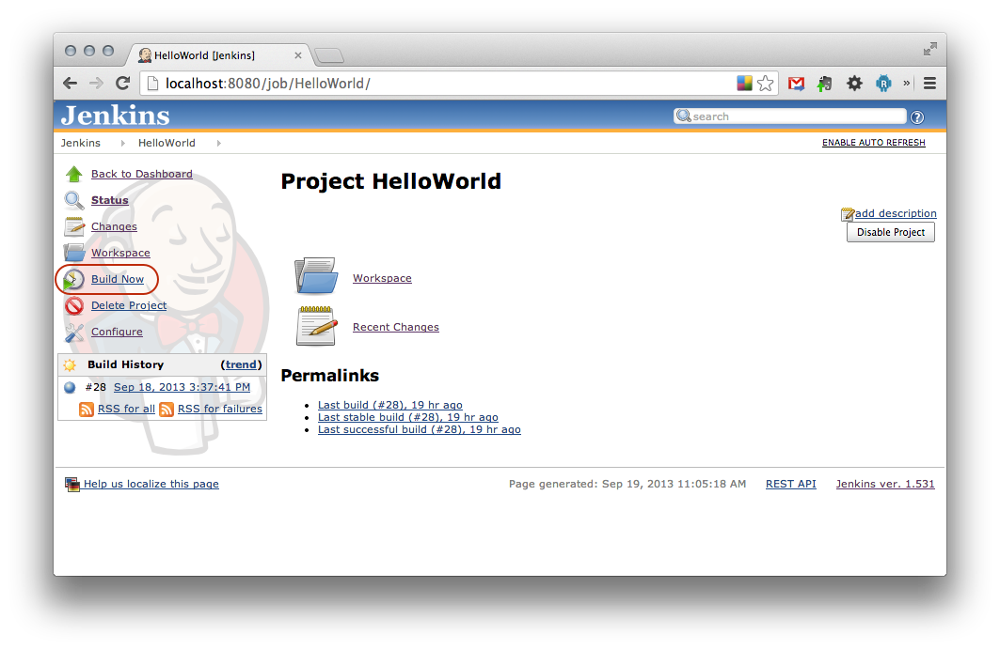

When a build has been started, the Build History dialog displays a flashing blue circle, a progress bar, the build number and the time that the build started, similar to the following screenshot:

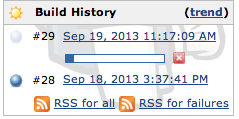

If the job succeeds, a blue circle will be displayed. If the job fails, a red circle will be displayed.

To help with troubleshooting problems that might arise as part of the build, Jenkins will capture all of the console output for the job. To see the console output, click on the job in **Build History**, and then on the **Console Output** link in the left hand menu. The following screenshot shows the **Console Output** link, as well as some of the output from a successful job:

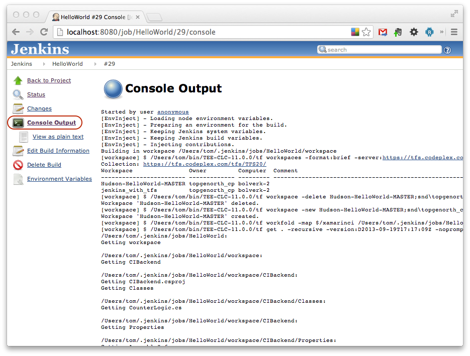

#### Location of Build Artifacts

Jenkins will retrieve the entire source code into a special folder called a *workspace*. This directory can be found inside the folder at the following location:

```
~/.jenkins/jobs/[JOB NAME]/workspace
```

The path to the workspace will be stored in an environment variable named `$WORKSPACE`.

It is possible to browse the workspace folder in Jenkins by navigating to the landing page for a job, and then clicking on the **Workspace** link in the left hand menu. The following screenshot shows an example of the workspace for a job named **HelloWorld**:


### Build Triggers

There are several different strategies for initiating builds in Jenkins – these are known as *build triggers*. A build trigger helps Jenkins decide when to start a job and build the project. Two of the more common build triggers are:

- **Build periodically** – This trigger causes Jenkins to start a job at specified intervals, such as every two hours or at midnight on weekdays. The build will start regardless of whether there have been any changes in the source code repository.
- **Poll SCM** – This trigger will poll source code control on a regular basis. If any changes have been committed to the source code repository, Jenkins will start a new build.

Polling SCM is a popular trigger because it provides quick feedback when a developer commits changes that cause the build to break. This is useful for alerting teams that some recently committed code is causing problems, and lets the developers address the problem while the changes are still fresh in mind.

Periodic builds are often used to create a version of the application that can be distributed to testers. For example, a periodic build might be scheduled for Friday evening so that members of the QA team can test the work of the previous week.

### Compiling a Xamarin.iOS Applications
Xamarin.iOS projects can be compiled at the command line using `xbuild` or `msbuild`. The shell command will execute in the context of the user account that is running Jenkins. It is important that the user account has access to the provisioning profile so that the application can be properly packaged for distribution. It is possible to add this shell command to the job configuration page.

Scroll down to the **Build** section. Click the **Add build step** button and select **Execute shell**, as illustrated by the following screenshot:

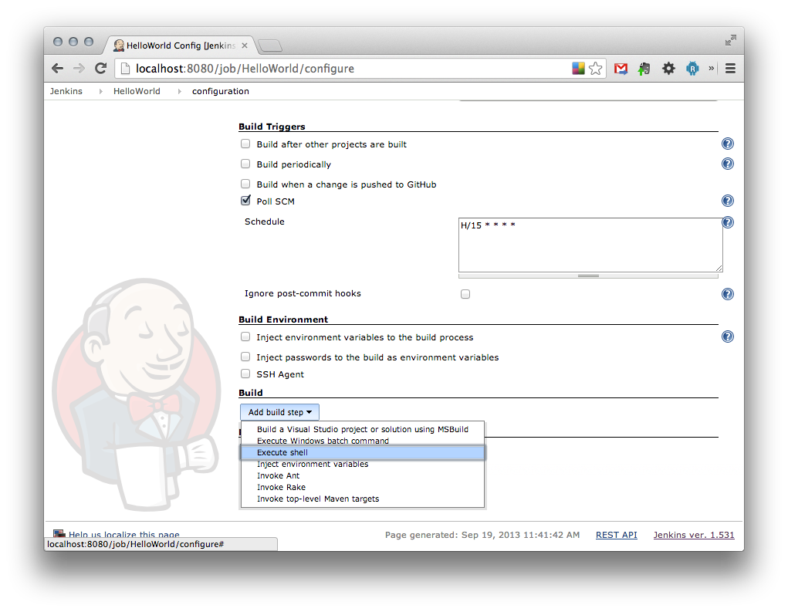

[!include[](~/tools/ci/includes/commandline-compile-of-xamarin-ios-ipa.md)]

### Building a Xamarin.Android Project

Building a Xamarin.Android project is very similar in concept to building a Xamarin.iOS project. To create an APK from a Xamarin.Android project, Jenkins must be configured to perform the following two steps:

- Compile the project using the MSBuild plugin
- Sign and zip align the APK with a valid release keystore.

These two steps will be covered in more detail in the next two sections.

### Creating the APK

Click on the **Add build step** button, and select **Build a Visual Studio project or solution using MSBuild**, as shown in the screenshot below:

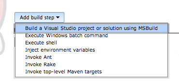

Once the build step is added to the project, fill in the form fields that appear. The following screenshot is one example of the completed form:

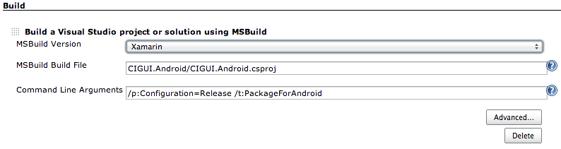

This build step will execute `xbuild` in the **$WORKSPACE** folder. The MSBuild Build File is set to the **Xamarin.Android.csproj** file. The **Command Line Arguments** specify a release build of the target **PackageForAndroid**. The product of this step will be an APK that at the following location:

```
$WORKSPACE/[PROJECT NAME]/bin/Release
```

The following screenshot shows an example of this APK:

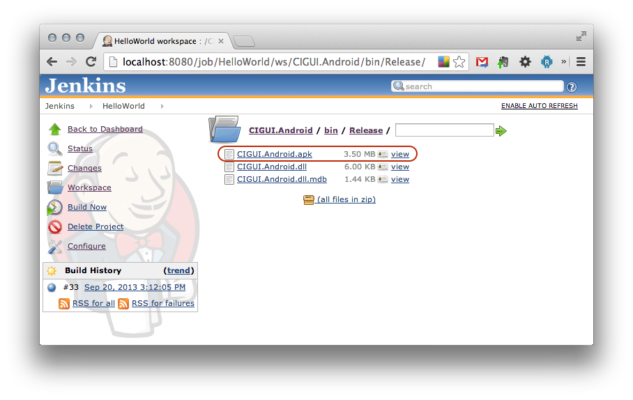

This APK is not ready for deployment, as it has not been signed with a private keystore and must be zip aligned.

#### Signing and Zipaligning the APK for Release

Signing and zipaligning the APK are technically two separate tasks that are performed by two separate command line tools from the Android SDK. However, it is convenient to perform them in one build action. For more information about signing and zipaligning an APK, see Xamarin’s documentation on preparing an Android application for release.

Both of these commands require command line parameters that may vary from project to project. In addition, some of these command line parameters are passwords that should not appear in the console output when the build is running. We’ll store some of these command line parameters in environment variables. The environment variables required for signing and/or zip aligning are described in the table below:

|Environment Variable|Description|
|--- |--- |
|KEYSTORE_FILE|This is the path to the keystore for signing the APK|
|KEYSTORE_ALIAS|The key in the keystore that will be used to sign the APK.|
|INPUT_APK|The APK that is created by `xbuild`.|
|SIGNED_APK|The signed APK produced by `jarsigner`.|
|FINAL_APK|This is the zip aligned APK that is produced by `zipalign`.|
|STORE_PASS|This is the password that is used to access the contents of the keystore for singing the file.|

As described in the Requirements section, these environment variables can be set during the build using the EnvInject plugin. The job should have a new build step added based on the Inject environment variables, as shown in the next screenshot:

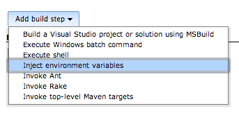

In the **Properties Content** form field that will appear, environment variables are added, one per line, in the following format:

```
ENVIRONMENT_VARIABLE_NAME = value
```

The following screenshot shows the environment variables that are required for signing the APK:

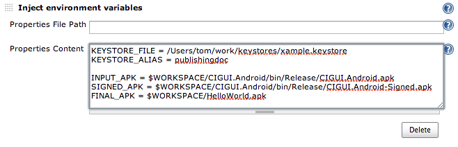

Notice that some of the environment variables for the APK files are built on the `WORKSPACE` environment variable.

The final environment variable is the password to access the contents of the keystore: `STORE_PASS`. Passwords are sensitive values that should be obscured or omitted in log files. The EnvInject plugin can be configured to protect these values so that they do not show in logs.

Immediately before the **Build** section of the job configuration is a **Build Environment** section. When the **Inject passwords** checkbox is toggled, some form fields to appear. These form fields are used to capture the name and value of the environment variable. The following screenshot is an example of adding the `STORE_PASS` environment variable:

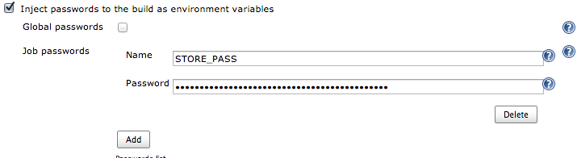

Once the environment variables have been initialized, the next step is to add a build step for signing and zip aligning the APK. Immediately after the build step to insert the environment variables will be another **Execute shell** command build that will execute `jarsigner` and `zipalign`. Each command will take up one line, as shown in the following snippet:

```
jarsigner -verbose -sigalg MD5withRSA -digestalg SHA1 -keystore $KEYSTORE_FILE -storepass $STORE_PASS -signedjar $SIGNED_APK $INPUT_APK $KEYSTORE_ALIAS
zipalign -f -v 4 $SIGNED_APK $FINAL_APK
```

The following screenshot shows an example of how to enter the `jarsigner` and `zipalign` commands into the step:

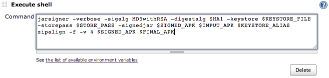

Once all the build actions are in place, it is good practice to trigger a manual build to verify everything is working. If the build fails, the **Console Output** should be reviewed for information on what caused the build to fail.

### Submitting Tests to Test Cloud

Automated tests can be submitted to Test Cloud using shell commands. For more information about setting up a Test Run in Xamarin Test Cloud, see [Preparing Xamarin.Android Apps](/appcenter/test-cloud/preparing-for-upload/xamarin-android-uitest) and [Preparing Xamarin.iOS Apps](/appcenter/test-cloud/preparing-for-upload/xamarin-ios-uitest).

## Summary

In this guide we introduced Jenkins as a build server on macOS, and configured it to compile and prepare Xamarin mobile applications for release. We installed Jenkins on a macOS computer along with several plugins to support the build process. We created and configured a job that will pull code from either TFS or Git, and then compile that code into a release ready application. We also explored two different ways to schedule when jobs should be run.

## Related Links

- [Continuous Integration](~/tools/ci/index.md)
- [App Center Test](/appcenter/test-cloud/)