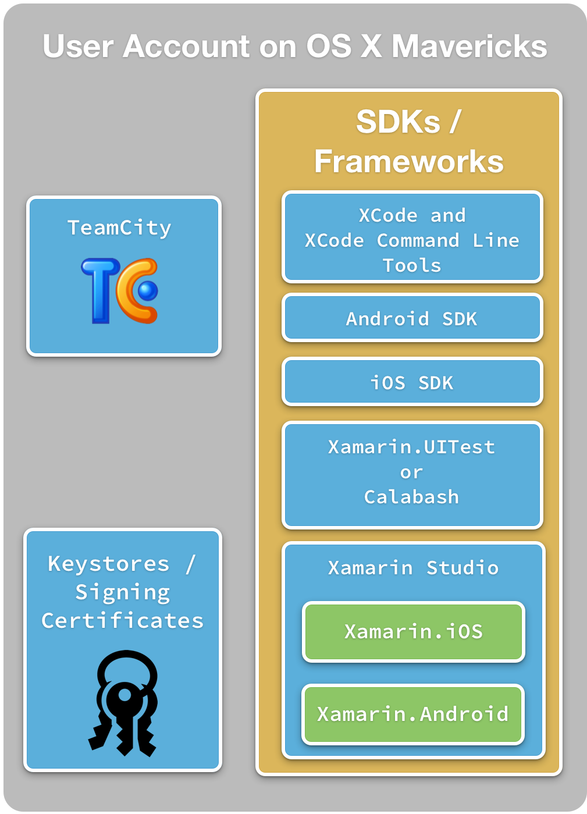
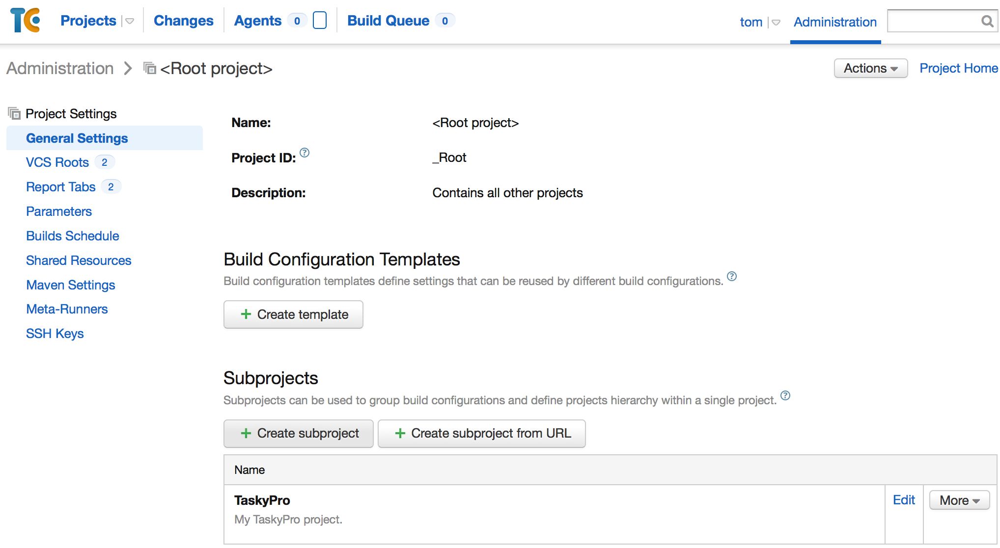
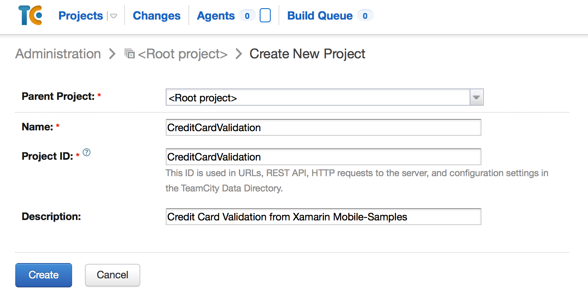
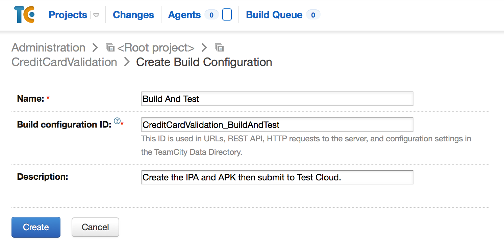
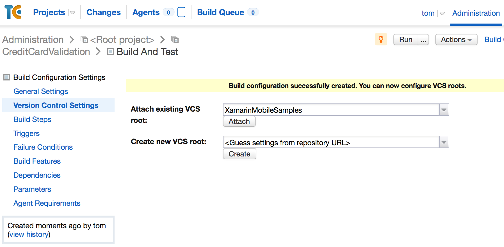
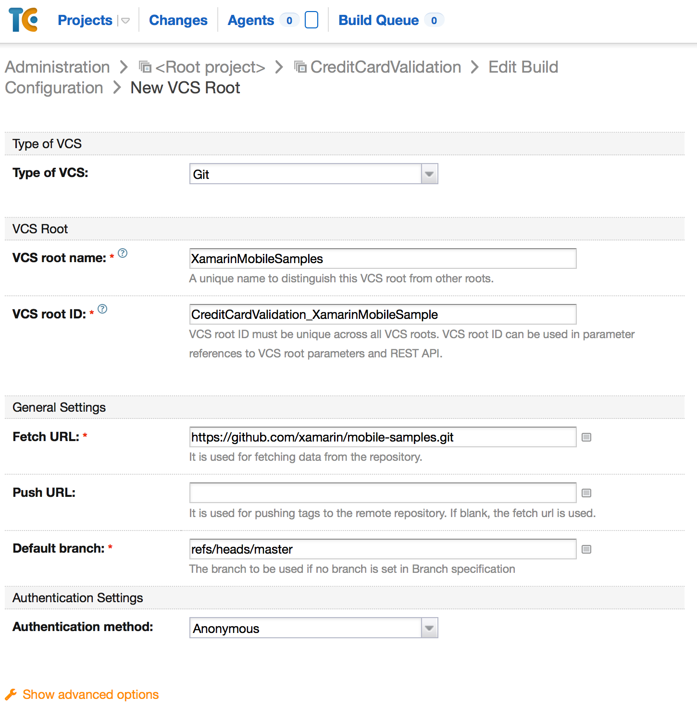
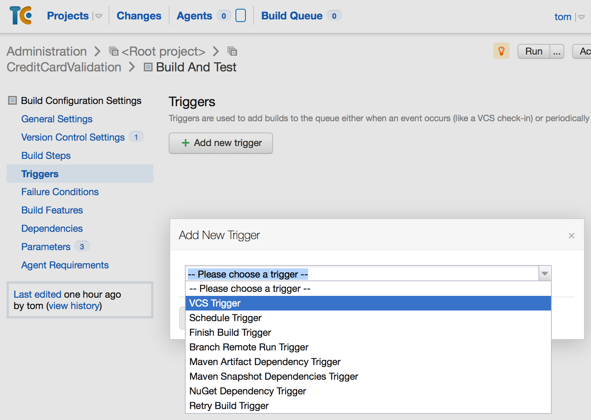
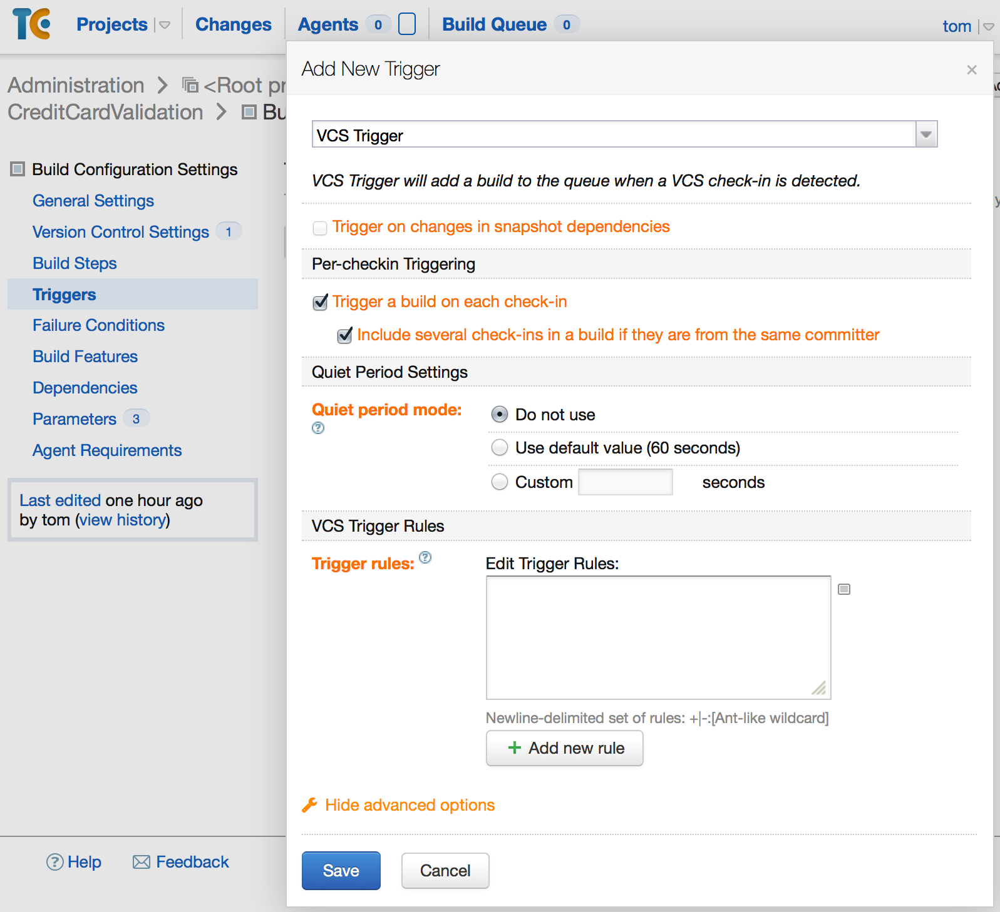
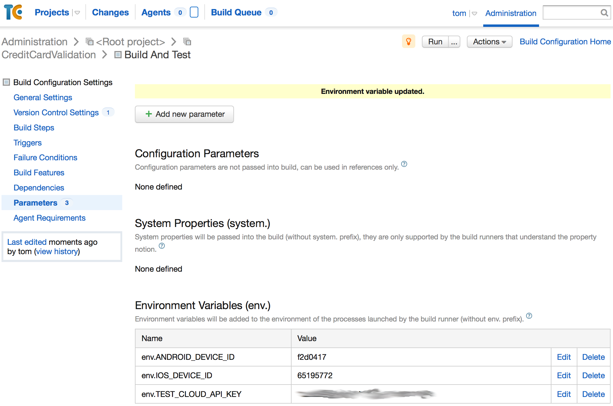
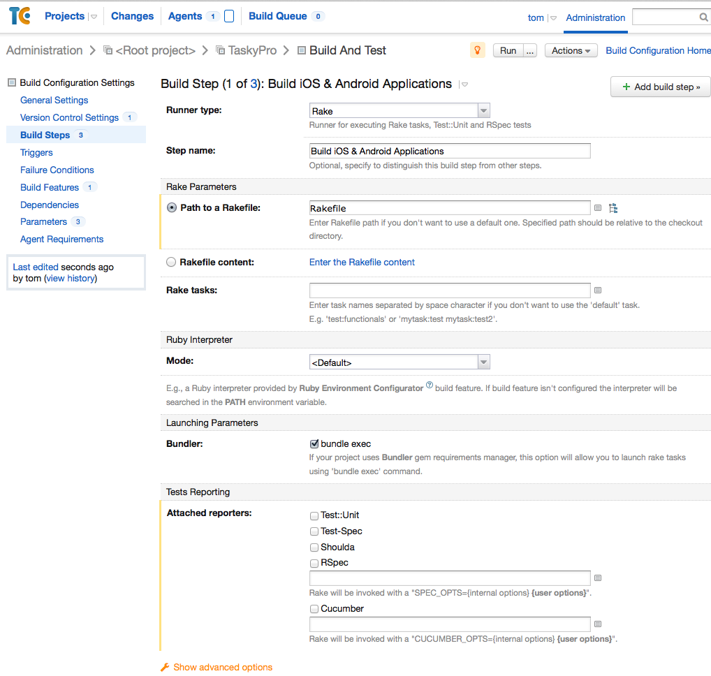

# Using TeamCity with Xamarin

_This guide will discuss the steps involved with using TeamCity to compile mobile applications and then submit them to App Center Test._

As discussed in the [Introduction to Continuous Integration](~/tools/ci/intro-to-ci.md) guide, continuous integration (CI) is a useful practice when developing quality mobile applications. There are many viable options for continuous integration server software; this guide will focus on [TeamCity](https://www.jetbrains.com/teamcity/) from JetBrains.

There are several different permutations of a TeamCity installation. The following list describes some of these permutations:

- **Windows Service** – In this scenario, TeamCity starts up when Windows boots as a Windows Service. It must be paired with a Mac Build Host to compile any iOS applications.

- **Launch Daemon on OS X** – Conceptually, this is similar to running as a Windows Service described in the previous step. By default the builds will be run under the root account.

- **User Account on OS X** – It's possible to run TeamCity under a user account that starts up each time the user logs in.

Of the previous scenarios, running TeamCity under a user account on OS X is the simplest and easiest to set up.

There are several steps involved with setting up TeamCity:

- **Installing TeamCity** – The installation of TeamCity isn't covered in this guide. This guide assumes that TeamCity is installed and running under a user account. Instructions on [installing TeamCity](https://confluence.jetbrains.com/display/TCD8/Installation) can be found in the [TeamCity 8 documentation](https://confluence.jetbrains.com/display/TCD8/TeamCity+Documentation) by JetBrains.

- **Preparing the Build Server** – This step involves installing the necessary software, tools, and certificates required to build mobile applications and prepare them for distribution.

- **Creating A Build Script** – This step isn't strictly necessary, but a build script is a useful aid to building applications unattended. Using a build script will help with troubleshooting build issues that may arise and provides a consistent, repeatable way to create the binaries for distribution, even if continuous integration isn't practiced.

- **Creating A TeamCity Project** – Once the previous three steps are completed, we must create a TeamCity project that will contain all of the meta-data necessary to retrieve the source code, compile the projects, and submit the tests to App Center Test.

## Requirements

Experience with [App Center Test](/appcenter/test-cloud/) is required.

Familiarity with TeamCity 8.1 is required. The installation of TeamCity is beyond the scope of this document. It's assumed that TeamCity is installed on OS X Mavericks and is running under a regular user account and not the root account.

The build server should be a stand-alone computer, running OS X, that is dedicated to continuous integration. Ideally, the build server won't be responsible for any other roles, such as a database server, web server, or developer workstation.

> [!IMPORTANT]
> This guide does not cover a "headless" installation of Xamarin.

[!include[](~/tools/ci/includes/firewall-information.md)]

## Preparing the Build Server

A crucial step in configuring a build server is to install all of the necessary tools, software, and certificates to build the mobile applications. It's important that the build server can compile the mobile solution and run any tests. To minimize configuration issues, the software and tools should be installed in the same user account that is hosting TeamCity. The following list details what's required:

1. **Visual Studio for Mac** – This includes Xamarin.iOS and Xamarin.Android.
2. **Log in to the Xamarin Component Store** – This step is optional and only required if your application uses Components from the Xamarin Component store. Proactively logging into the Component store at this point will prevent any issues when a TeamCity build tries to compile the application.
3. **Xcode** – Xcode is required to compile and sign iOS applications.
4. **Xcode Command-Line Tools** – This is described in step 1 of the Installation section of the [Updating Ruby with rbenv](https://github.com/calabash/calabash-ios/wiki) guide.
5. **Signing Identity & Provisioning Profiles** – Import the certificates and provisioning profile via XCode. See Apple’s guide on [Exporting Signing Identities and Provisioning Profiles](https://developer.apple.com/library/ios/recipes/xcode_help-accounts_preferences/articles/export_signing_assets.html) for more details.
6. **Android Keystores** – Copy the required Android keystores to a directory the TeamCity user has access to, i.e. `~/Documents/keystores/MyAndroidApp1`.
7. **Calabash** – This is an optional step if your application has tests written using Calabash. See the [Installing Calabash on OS X Mavericks](https://github.com/calabash/calabash-ios/wiki) guide and the [Updating Ruby with rbenv](https://github.com/calabash/calabash-ios/wiki) guide for more information.

The following diagram illustrates all of these components:



Once all of the software is installed, log in to the user account and confirm that all of the software is properly installed and working. This should involve compiling the solution and submitting the application to App Center Test. This can be simplified by running the build script, as described in the next section.

## Create a Build Script

Although it's possible for TeamCity to handle all aspects of compiling and submitting mobile applications to App Center Test by itself; it's recommended to create a build script. A build script provides the following advantages:

1. **Documentation** – A build script serves as a form of documentation on how the software is built. This removes some of the “magic” that is associated with deploying the application and allows developers to concentrate on functionality.
1. **Repeatability** – A build script ensures that each time the application is compiled and deployed, it happens in the same way, regardless of who or what does the work. This repeatable consistency removes any issues or errors that might appear because of an incorrectly executed build or human error.
1. **Versioning** – A build script can be included in the source control system. This means that changes to the build script can be tracked, monitored, and corrected if errors or inaccuracies are found.
1. **Prepare the Environment** – A build script can include logic to install any required 3rd party dependencies. This will ensure that the applications are built with the proper components.

The build script can be as simple as a PowerShell file (on Windows) or a bash script (on OS X). When creating the build script, there are several choices for scripting languages:

- [**Rake**](https://github.com/jimweirich/rake) – this is a Domain-Specific Language (DSL) for building projects, based on Ruby. Rake has the advantage of popularity and a rich ecosystem of libraries.

- [**psake**](https://github.com/psake/psake) – this is a Windows PowerShell library for building software

- [**FAKE**](https://fsharp.github.io/FAKE/) – this is a DSL based in F# which makes it possible to use existing .NET libraries if necessary.

Which scripting language is used depends on your preferences and requirements.

> [!NOTE]
> It's possible to use an XML based build system such as MSBuild or NAnt, but these lack the expressiveness and maintainability of a DSL that is dedicated to building software.

### Parameterizing The Build Script

The process of building and testing software requires information that should be kept secret. Creating an APK may require a password for the keystore and/or the key alias in the keystore. Likewise, App Center Test requires an [API key](/appcenter/api-docs/) that is unique to a developer. These types of values shouldn't be hard-coded in the build script. Instead they should be passed as variables to the build script.

Less sensitive are values such as the iOS device ID or the Android device ID that identify what devices App Center should use for test runs. These aren't values that need to be protected, but they may change from build to build.

Storing these types of variables outside of the build script also makes it easier to share the build script within an organization, with developers for example. Developers may use the exact same script as the build server, but can use their own keystores and [API keys](/appcenter/api-docs/).

There are two possible options for storing these sensitive values:

- **A configuration file** – To protect the [API key](/appcenter/api-docs/) this value shouldn't be checked into version control. The file can be created for each machine. How values are read from this file depends on the scripting language used.

- **Environment variables** – these can be easily set on a per-machine basis and are independent of the underlying scripting language.

There are advantages and disadvantages to each of these choices. TeamCity works nicely with environment variables, so this guide will recommend this technique when creating build scripts.

### Build Steps

The build script must do the following steps:

- **Compile the Application** – This includes signing the application with the correct provisioning profile.

- **Submit the Application to Xamarin Test Cloud** – This includes signing and zip aligning the APK with the appropriate keystore.

These two steps will be explained in more detail below.

#### Compiling a Xamarin.iOS Application

[!include[](~/tools/ci/includes/commandline-compile-of-xamarin-ios-ipa.md)]

#### Compiling a Xamarin.Android Application

To compile an Android application, use **xbuild** (or **msbuild** on Windows):

```bash
/Library/Frameworks/Mono.framework/Commands/xbuild /t:SignAndroidPackage /p:Configuration=Release /path/to/android.csproj
```
Compiling the Android application **xbuild** uses the project, while the iOS application **xbuild** uses the solution.

#### Submitting Xamarin.UITests to App Center

UITests are submitted using the [App Center CLI](https://github.com/microsoft/appcenter-cli), as shown in the following snippet:

```bash
appcenter test run uitest --app <TEAM-NAME/APP-NAME> --devices <DEVICE_SET> --token <API_KEY> --app-path <appname.APK-or-appname.IPA> --merge-nunit-xml report.xml --build-dir pathToUITestBuildDir
```

When the test is run, the test results will be returned in the form of an NUnit style XML file called **report.xml**. TeamCity will display the information in the Build Log.

For more information about how to submit UITests to App Center, see [Preparing Xamarin.Android Apps](/appcenter/test-cloud/uitest/preparing-for-upload-android) or [Preparing Xamarin.iOS Apps](/appcenter/test-cloud/uitest/preparing-for-upload-ios).

#### Submitting Calabash Tests to App Center

Calabash tests are submitted using the [App Center CLI](https://github.com/microsoft/appcenter-cli), as shown in the following snippet:

```bash
appcenter test run calabash --app <TEAM-NAME/APP-NAME> --devices <DEVICE_SET> --token <API_KEY> --app-path <appname.APK-or-appname.IPA> --project-dir pathToProjectDir
```

To submit an Android application to App Center Test, it's necessary to first rebuild the APK test server using calabash-android:

```bash
$ calabash-android build </path/to/signed/APK>
$ appcenter test run calabash --app <TEAM-NAME/APP-NAME> --devices <DEVICE_SET> --token <API_KEY> --app-path <appname.APK> --project-dir pathToProjectDir
```

For more information on submitting Calabash tests, consult Xamarin’s guide on [Submitting Calabash Tests to Test Cloud](https://github.com/calabash/calabash-ios/wiki).

## Creating a TeamCity Project

Once TeamCity is installed and Visual Studio for Mac can build your project, it's time to create a project in TeamCity to build the project and submit it to App Center.

1. Started by logging into TeamCity via the web browser. Navigate to the Root Project:

    
Underneath the Root Project, create a new subproject:

    
2. Once the subproject is created, add a new Build Configuration:

    
3. Attach a VCS project to the Build Configuration. This is done via the Version Control Setting screen:

    

    If there's no VCS project created, you can create one from the New VCS Root page shown below:

    

    Once the VCS root has been attached,  TeamCity will check out the project and try to auto detect build steps. If you're familiar with TeamCity, then you can select one of the detected build steps. It's safe to ignore the detected build steps for now.

4. Next, configure a Build Trigger. This will queue up a build when certain conditions are met, such as when a user commits code to the repository. The following screenshot shows how to add a build trigger:

    
    An example of configuring a build trigger can be seen in the following screenshot:

    

5. The previous section, Parameterizing the Build Script, suggested storing some values as environment variables. These variables can be added to the build configuration via the Parameters screen. Add the variables for the App Center [API Key](/appcenter/api-docs/), the iOS device ID, and the Android Device ID as shown in the screenshot below:

    

6. The final step is to add a build step that will invoke the build script to compile the application and enqueue the application to App Center Test. The following screenshot is an example of a build step that uses a Rakefile to build an application:

    

7. At this point, the build configuration is complete. It's a good idea to trigger a build to confirm that the project is properly configured. A good way to do this is to commit a small, insignificant change to the repository. TeamCity should detect the commit and start a build.

8. Once the build has completed, inspect the build log and see if there are any problems or warnings with the build that require attention.

## Summary

This guide covered how to use TeamCity to build Xamarin Mobile applications and then submit them to App Center Test. We discussed creating a build script to automate the build process. The build script takes care of compiling the application, submitting to App Center Test, and waiting for the results.

Then we covered how to create a project in TeamCity that will queue a build each time a developer commits code and will call the build script.

## Related Links

- [Preparing Xamarin.Android Apps](/appcenter/test-cloud/uitest/preparing-for-upload-android)
- [Preparing Xamarin.iOS Apps](/appcenter/test-cloud/uitest/preparing-for-upload-ios)
- [Installing and Configuring TeamCity](https://confluence.jetbrains.com/display/TCD8/Installing+and+Configuring+the+TeamCity+Server)
