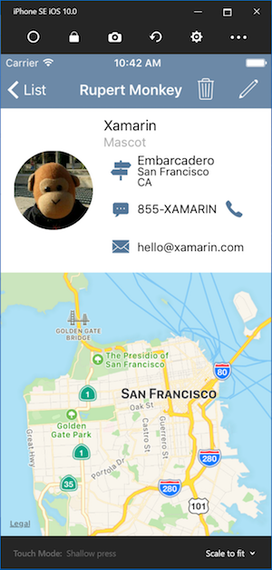
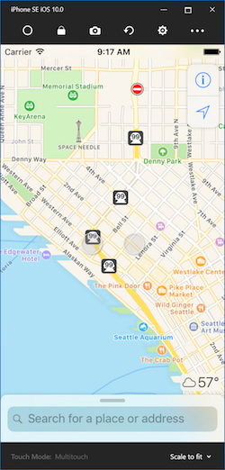
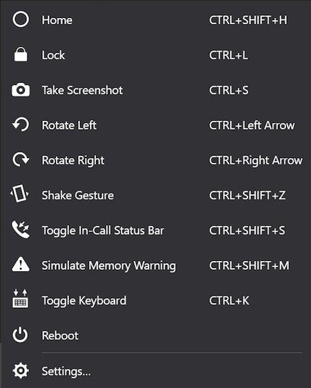

# Remoted iOS Simulator for Windows

The Remoted iOS Simulator for Windows allows you to test your apps on an
iOS simulator displayed in Windows alongside Visual Studio 2017.

## Getting started

The Remoted iOS Simulator for Windows is installed automatically as part
of Xamarin in Visual Studio 2017. To use it, follow these steps:

1. [Pair Visual 2017 to a Mac Build host](~/ios/get-started/installation/windows/connecting-to-mac/index.md).
2. In Visual Studio 2017, start debugging an iOS or tvOS project. The 
Remoted iOS Simulator for Windows will appear on your Windows machine.

## Simulator window

The toolbar at the top of the simulator's window contains a number of 
useful buttons:

- **Home** – Simulates the home button on an iOS device
- **Lock** – Locks the simulator (swipe to unlock)
- **Screenshot** – Saves a screenshot of the simulator
- [**Settings**](#settings) – Displays keyboard, location, and other 
  settings
- [**Other options**](#other-options) – Brings up various simulator options 
  such as rotation and shake gestures

    

## Settings

Clicking the toolbar's gear icon opens the **Settings** window:

These settings allow you to enable the hardware keyboard, choose a
location that the device should report (static and moving locations are
both supported), enable Touch ID, and reset the content and settings for
the simulator.

## Other options

The toolbar's ellipsis button reveals other options such as rotation,
shake gestures, and rebooting. These same options can be viewed as a list
by right-clicking anywhere in the simulator's window:

## Touchscreen support

Most modern Windows computers have touch screens. Since the Remoted iOS
Simulator for Windows supports touch interactions, you can test your app
with the same pinch, swipe, and multi-finger touch gestures that you use
with physical iOS devices.

Similarly, the Remoted iOS Simulator for Windows treats Windows Stylus
input as Apple Pencil input.

## Disabling the Remoted iOS Simulator for Windows

To disable the Remoted iOS Simulator for Windows, navigate to 
**Tools > Options > Xamarin > iOS Settings** and uncheck 
**Remote Simulator to Windows**.

With this option disabled, debugging opens the iOS Simulator on 
the connected Mac build host.
