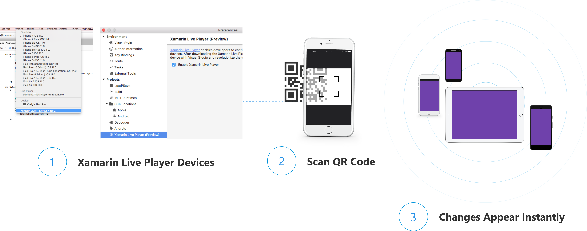

# Xamarin Live Player for Xamarin.Forms

Since the source code is interpreted you may reach the [limitations](./troubleshooting.md) after some time and need to fully compile your app for device or emulator.

> [!WARNING]
> The Xamarin Live Player Preview has ended. The app is no longer available. The instructions below are provided for customers continuing to use the preview with Visual Studio 2017.

> [!TIP]
> You can use the [XAML Previewer](~/xamarin-forms/xaml/xaml-previewer/index.md) in Visual Studio 2019 or 
> Visual Studio for Mac to view your screen designs as you edit them.

## How Xamarin Live Player worked

1. Enable the *Xamarin Live Player* in **Preferences**, then select your device from the **Devices** list.
2. Manage Live Player devices to scan a QR code to pair your device to Visual Studio.
3. The app runs on your phone or tablet.

## [Xamarin Live Player App](player.md)

Using the Xamarin Live Player app.

## [Troubleshooting](troubleshooting.md)

Find help if things go wrong.