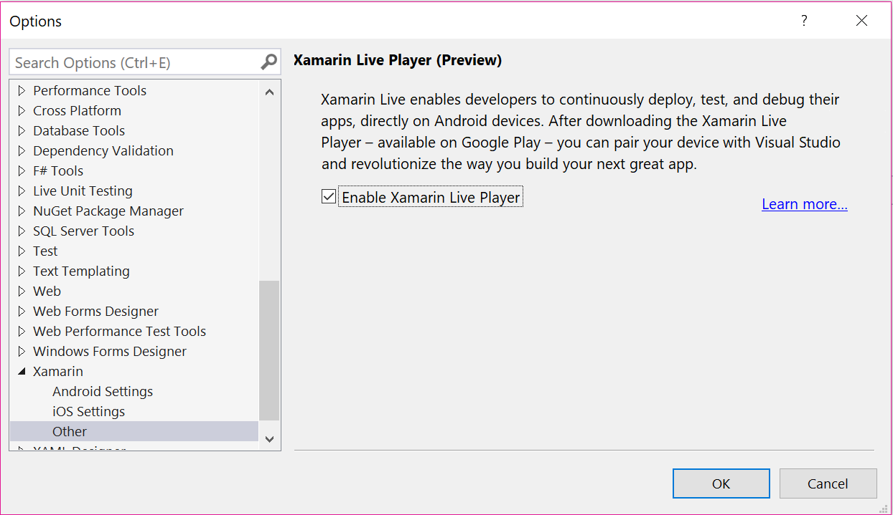
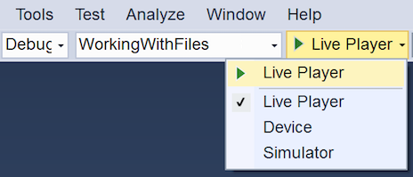
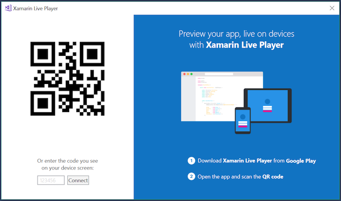
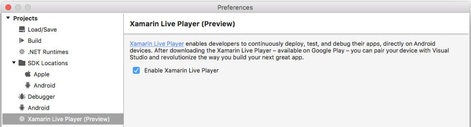
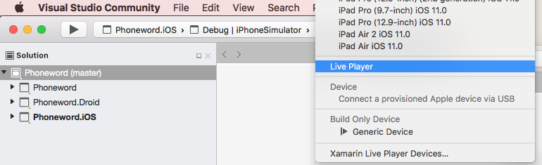
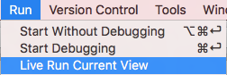
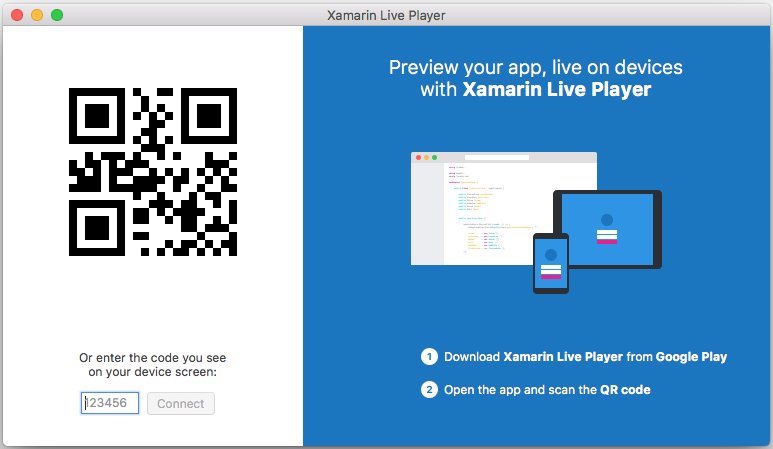
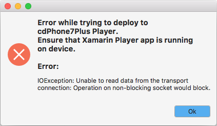

# Xamarin Live Player Visual Studio configuration

> [!WARNING]
> The Xamarin Live Player Preview has ended. The app is no longer available. The instructions below are provided for customers continuing to use the preview with Visual Studio 2017.

> [!TIP]
> You can use the [XAML Previewer](~/xamarin-forms/xaml/xaml-previewer/index.md) in Visual Studio 2019 or 
> Visual Studio for Mac to view your screen designs as you edit them.

# [Visual Studio 2017](#tab/windows)

## Using Xamarin Live Player

You must already have the Xamarin Live Player app on your device. It is no longer available to download.

1. Open **Visual Studio 2017**.
2. Go to **Tools > Options...** and select the **Xamarin > Other** tab.
3. Tick **Enable Xamarin Live Player**:

    

4. Create or open a Xamarin project (or a [sample](~/tools/live-player/samples.md)).
5. Choose **Live Player** in the device list:

    

    - If you have already paired a device, it will be available as an option.
    - Otherwise you'll be prompted to pair a device when required.

6. Press the **Run** button, or select one of the following options from the **Run** or right-click menu:

    - **Start Without Debugging** – you can edit the app and see the changes occur on the device (app is restarted as changes are made and the file saved).
    - **Start Debugging** – you can set breakpoints and inspect variables, but code cannot be edited.

    Alternatively, select **Tools > Xamarin Live Player > Live Run Current View**, which lets you edit the app and see the changes occur on the device. The current view is shown (instead of the application's main screen).

7. If a device is already paired and the Xamarin Live Player app is running on the device,
    the code will execute straight away!

    If no device is paired, a QR code will appear with instructions on how to pair a device:

    

    If the device cannot be contacted for pairing, an error may appear.

# [Visual Studio for Mac](#tab/macos)

## Using Xamarin Live Player

You must already have the Xamarin Live Player app on your device. It is no longer available to download.

1. Open **Visual Studio for Mac**.
2. Go to **Visual Studio > Preferences...** and select the **Projects > Xamarin Live Player (Preview)** tab.
3. Tick **Enable Xamarin Live Player**:

    

4. Create or open a Xamarin project (or a [sample](~/tools/live-player/samples.md)).
5. Choose **Live Player** in the device list.

    

    - If you have already paired a device, it will be available as an option.
    - Otherwise you'll be prompted to pair a device when required.
    - Choose **Xamarin Live Player Devices...** to manage the devices you wish to use with Xamarin Live Player.

6. Press the **Run** button, or select one of the following options from the **Run** or right-click menu:

    

    - **Start Without Debugging** – You can edit the app and see the changes occur on the device (app is restarted as changes are made and the file saved).
    - **Start Debugging** – You can set breakpoints and inspect variables, but code cannot be edited.
    - **Live Run Current View** – You can edit the app and see the changes occur on the device. The current view is shown (instead of the application's main screen).

7. If a device is already paired and the Xamarin Live Player app is running on the device, the code will execute straight away!

    If no device is paired, a QR code will appear with instructions on how to pair a device:

    

    If the device cannot be contacted for pairing, an error will appear:

    

-----

If you experience any issues or can not connect, see [limitations and troubleshooting](~/tools/live-player/troubleshooting.md).

## Related Links

- [Troubleshooting](~/tools/live-player/troubleshooting.md)
