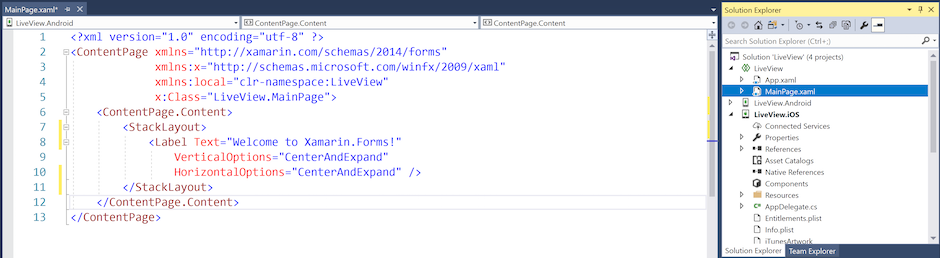
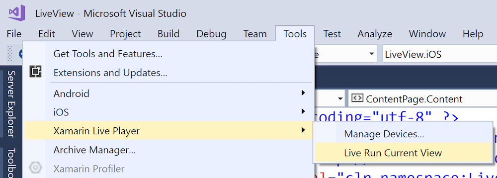
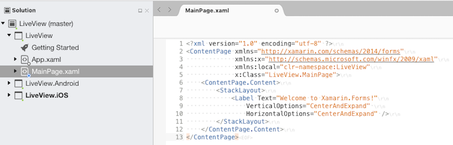
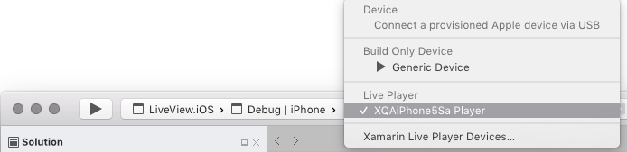
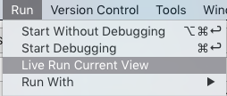
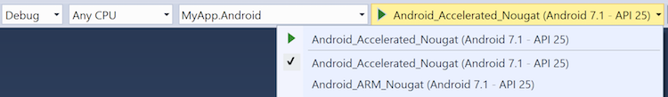
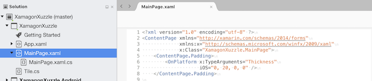
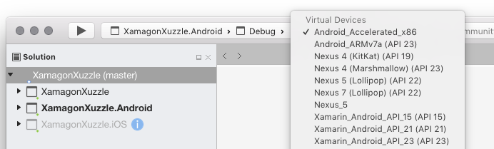
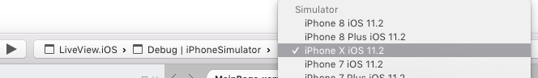
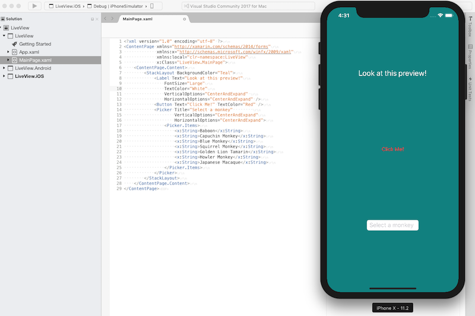

# XAML Live Previewing

One of the benefits of the Xamarin Live Player is the ability to live preview XAML pages, make changes to the code in Visual Studio, and see the changes appear instantly on your device. The live preview can be made either on your iOS or Android device, or on a simulator or emulator. This guide demonstrates how to use the live preview feature to view individual XAML screens.

## Requirements

# [Visual Studio](#tab/vswin)

1. A machine running Windows 7 or higher.
2. Visual Studio 2017 version 15.4 or higher with the **Mobile development with .NET** workload installed.

# [Visual Studio for Mac](#tab/vsmac)

1. A Mac with OS X 10.11, macOS 10.12, or greater.
2. Visual Studio for Mac 7.2 or later. We recommend the latest version.

-----

<a name="deploydevice" />

## Deploying to Device

Before you can use the Xamarin Live Player with your iOS or Android device, you'll need to download the Xamarin Live Player app and pair it to Visual Studio as described in the [Install](~/tools/live-player/install.md) guide. Once you have successfully paired your device to Visual Studio, you can begin the live preview of your XAML page. 

# [Visual Studio](#tab/vswin)

1. Open the XAML page that you want to live preview in the Visual Studio 2017 editor:

    

2. Set the device configuration to **Debug | iPhone** for iOS or **Debug** for Android, and select the Live Player device from the list:

    

3. To run this XAML page as a live view on your device, select **Tools > Xamarin Live Player > Live Run Current View** from the menu bar:

    

# [Visual Studio for Mac](#tab/vsmac)

1. Open the XAML page that you want to live preview in the Visual Studio for Mac editor:

    

2. Set the device configuration to **Debug | iPhone** for iOS or **Debug** for Android, and select the Live Player device from the list:

    

3. To run this XAML page as a live view on your device, select **Run > Live Run Current View** from the menu bar:

    

-----

## Deploying to Android Emulator

# [Visual Studio](#tab/vswin)

1. Open the XAML page that you want to live preview in the Visual Studio 2017 editor:

    

2. Set the device configuration to **Debug** for Android and select the Live Player device from the list:

    

3. To run this XAML page as a live view on the Android emulator, select **Tools > Xamarin Live Player > Live Run Current View** from the menu bar:

    

# [Visual Studio for Mac](#tab/vsmac)

1. Open the XAML page that you want to live preview in the Visual Studio for Mac editor:

    

2. Set the device configuration to **Debug** for Android and select the Live Player device from the list:

    

3. To run this XAML page as a live view on your device, select Run > Live Run Current View from the menu bar:

    

-----

## Deploying to iOS Simulator

# [Visual Studio](#tab/vswin)

There is currently no support for using live XAML previewing on the remoted iOS simulator on Windows. You should instead [deploy to a device](#deploydevice).

# [Visual Studio for Mac](#tab/vsmac)

1. Open the XAML page that you want to live preview in the Visual Studio for Mac editor:

    

2. Set the device configuration to **Debug | iPhoneSimulator** for iOS and select an iOS simulator from the list:

    

3. Select **Run > Live Run Current View** from the menu bar to launch the simulator and display your XAML page:

    

4. Once the simulator has launched, you can start editing the XAML and see a preview appear live:

      

-----

## Related Links

- [Xamarin Live Player Overview](https://xamarin.com/live)
- [Blog post](https://blog.xamarin.com/live-player/)
- [Xamarin Live Player Samples](~/tools/livehttps://developer.xamarin.com/samples.md)
