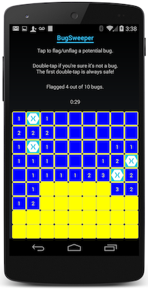

# Xamarin Live Player Samples

## Get Started with Xamarin.Forms

Visit the [Sample Gallery](https://developer.xamarin.com/samples/xamarin-live-player/all/) for
Xamarin.Forms samples that work with Xamarin Live Player.

## Featured Samples

### [Basic Calculator](https://developer.xamarin.com/samples/mobile/LivePlayer/BasicCalculator/)

This Xamarin.Forms app provides a simple calculator you can use on your Android device.

### [BugSweeper](https://developer.xamarin.com/samples/mobile/LivePlayer/BugSweeperLP/)

This is a familiar game with a new twist. Ten bugs are hidden in a 9-by-9 grid of tiles. To win, you must find and flag all ten bugs.

## Related Links

- [Xamarin.Forms Live Player Samples](https://developer.xamarin.com/samples/xamarin-live-player/all/)
