# Xamarin Profiler

_This guide explores the key features of the Xamarin Profiler. It look at profilers, profiling and when they should be used, and at a standard workflow for profiling Xamarin applications._

An application’s success depends on the end user experience. As a developer you might have implemented some really awesome features in your app, but if the app is sluggish or full of crashes, the user will likely get rid of it.

Historically, Mono has featured a powerful command-line profiler for gathering information about programs running in the Mono runtime called the [Mono log profiler](https://www.mono-project.com/docs/debug+profile/profile/profiler/). The Xamarin Profiler a graphical interface for the Mono log profiler, and supports profiling Android, iOS, tvOS, and Mac applications on Mac, and Android, iOS, and tvOS applications on Windows.

The Xamarin Profiler has a number of instruments available for profiling — Allocations, Cycles, and Time Profiler. This guide explores what these instruments measure and how they analyze your application, and clarifies the meaning of the data presented on each screen.

This guide examines common profiling scenarios and introduces the profiler as a tool to help analyze and optimize iOS and Android applications.

## Download and Install

> [!NOTE]
> You will need to be a [Visual Studio Enterprise](https://visualstudio.microsoft.com/vs/compare/) subscriber to unlock this feature in either Visual Studio Enterprise on Windows or Visual Studio for Mac on a Mac.

The Xamarin Profiler is a standalone application, and is integrated with
Visual Studio for Mac and Visual Studio to enable profiling from within the IDE.

Download the install package for your platform:

- [**macOS**](https://dl.xamarin.com/profiler/profiler-mac-1.6.13-11.pkg)
- [**Windows**](https://dl.xamarin.com/profiler/XamarinProfiler.Windows.Installer.1.6.10-15.msi)

Once downloaded, launch the installer to add the Xamarin Profiler to your system.

## Profilers and Profiling

Profiling is an important and often overlooked step in application development. Profiling is a form of **dynamic program analysis** - it analyzes the program while it is running and in use. A profiler is a data mining tool that collects information about time complexity, the usage of particular methods, and the memory being allocated. A profiler enables you to drill deep and analyze these metrics to pinpoint problem areas in code.

When designing and developing an application, it is important to not optimize prematurely; that is, spending time developing your code in areas that will rarely be accessed. This is the power of profiling. A profiler provides insight into the most commonly used parts of your code base , and helps locate areas where you should spend time making improvements. Developers should take care to understand where most of the time is spent in your application, and how memory is used by your application.

Profiling is helpful in all types of development, but it is especially crucial in mobile development. Unoptimized code is much more noticeable on mobile platforms than on desktop computers, and the success of your app depends on beautiful and optimized code that runs efficiently.

## Xamarin Profiler

The Xamarin Profiler provides developers with a way to profile applications from inside Visual Studio for Mac or Visual Studio. The profiler collects and displays information about the app, which can then be used by the developer to analyze an application’s behavior. There are a number of different ways to profile an application with the Xamarin Profiler, namely memory profiling and statistical sampling. These are carried out through the Allocations and Time Profiler instruments respectively.

<!-- markdownlint-disable MD001 -->

# [Visual Studio for Mac](#tab/macos)

Currently, the Xamarin Profiler can be used to test Xamarin.iOS, Xamarin.Android, and Xamarin.Mac applications on Mac (Via Visual Studio for Mac). The profiler is a separate process from the IDE, and so, in addition to launching from Visual Studio for Mac, it can be used as a standalone application to examine .exe and `.mlpd` files which have been produced from the [mono log profiler](https://www.mono-project.com/docs/debug+profile/profile/profiler/).

# [Visual Studio](#tab/windows)

Currently, the Xamarin Profiler can be used to test Xamarin.Android apps on Windows (via Visual Studio and Visual Studio for Mac). The profiler is a separate process from the IDE, and so, in addition to launching from Visual Studio, it can be used as a standalone application to examine .exe and `.mlpd` files which have been produced from the [mono log profiler](https://www.mono-project.com/docs/debug+profile/profile/profiler/).

-----

## Profiler Support

Support for the Xamarin Profiler is available on the following platforms:

- Visual Studio for Mac (macOS, with Enterprise License)
  - Android
    - Device and Emulator
  - iOS
    - Device and Simulator
  - tvOS (Time Instrument is not supported)
    - Device and Simulator
  - Mac

- Visual Studio (Only **Enterprise** Version)
  - Android
    - Device and Emulator
  - iOS [Experimental]
    - Device and Simulator
  - tvOS
    - Device and Simulator

Note that you can **only** profile **Debug** configurations.

## Profiler Basics

This section introduces the parts of the Xamarin Profiler and tours its features.

### Allow Profiling in your App

Before you can successfully Profile your app, you will need to allow Profiling in the app's Project Options.

- iOS:

# [Visual Studio for Mac](#tab/macos)

  **Build > iOS Debug > Enable Profiling**

  

# [Visual Studio](#tab/windows)

  **Properties > iOS Build > Enable Profiling**

  

-----

- Android:

# [Visual Studio for Mac](#tab/macos)

  **Build > Android Debug > Enable Developer Instrumentation**

  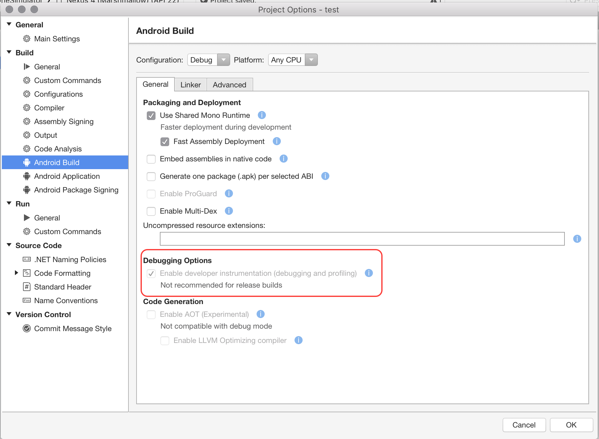

# [Visual Studio](#tab/windows)

  **Build > Android Debug > Enable Developer Instrumentation**

  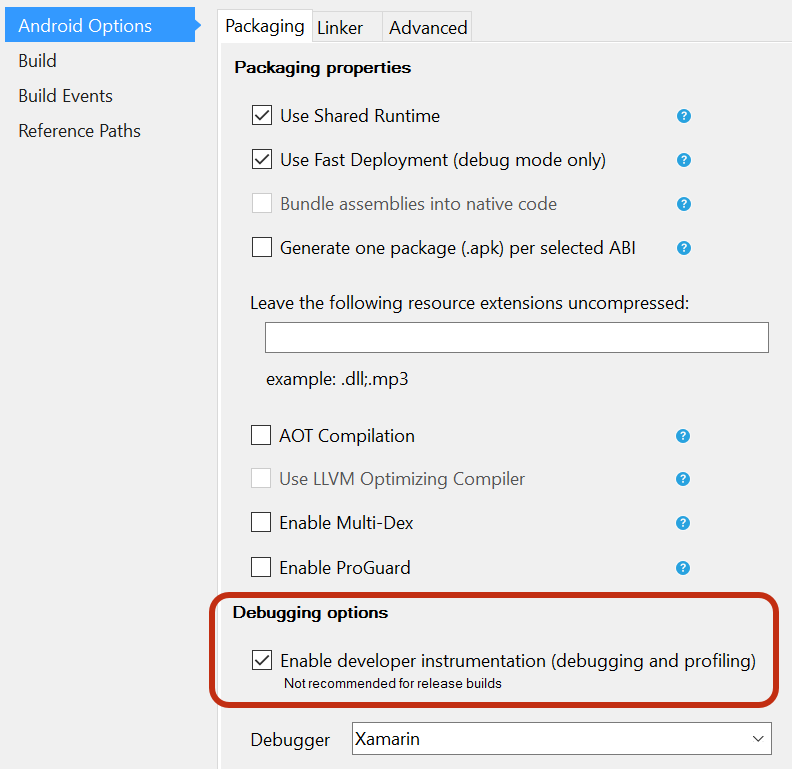

-----

### Launching the Profiler

The Xamarin Profiler can be launched from your IDE when you are profiling your iOS or Android application, or as a standalone application.

# [Visual Studio for Mac](#tab/macos)

#### Launching from Visual Studio for Mac

1. First, make sure you have your application loaded in Visual Studio for Mac, and select the (default) Debug configuration.
2. Browse to **Run > Start Profiling**in Visual Studio for Mac, or **Analyze > Xamarin Profiler** in Visual Studio, to open the Profiler, as demonstrated in the diagram below:

  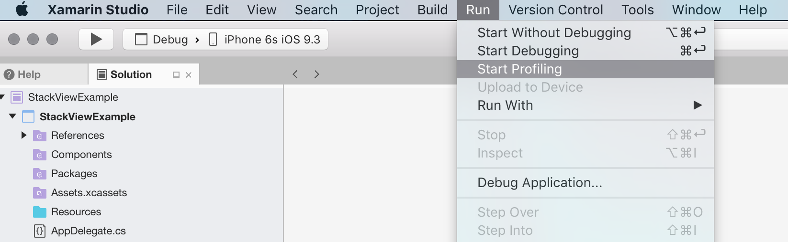

# [Visual Studio](#tab/windows)

#### Launching from Visual Studio

1. First, make sure you have your application loaded in Visual Studio, and select the (default) Debug configuration, as specified above.
2. Browse to **Analyze > Xamarin Profiler** in Visual Studio, to open the Profiler, as demonstrated in the diagram below:

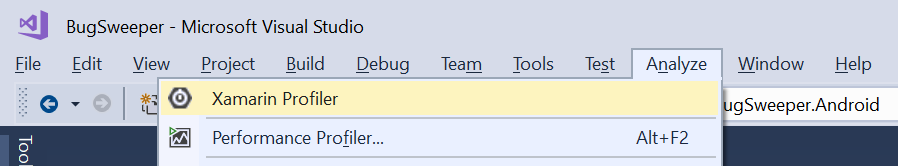

-----

If the menu items do not appear, refer to the [troubleshooting guide](~/tools/profiler/troubleshooting.md).

This launches the Profiler and automatically starts profiling the application.

The Profiler can be used to measure memory and performance. It achieves this through the Allocations and Time Profiler instruments, which we will explore in detail in the next section.

#### Saving and Loading Profiler Sessions

To save a profiling session at any time, choose **File > Save As...** from the Profiler Menu bar. This saves the file in _mlpd_ format, a special, highly compressed format for profiling data.

# [Visual Studio for Mac](#tab/macos)

After it has been installed the Xamarin Profiler can be found in your Applications folder as illustrated in the screenshot below:

# [Visual Studio](#tab/windows)

After it has been installed the Xamarin Profiler application can be found in your Application directory:

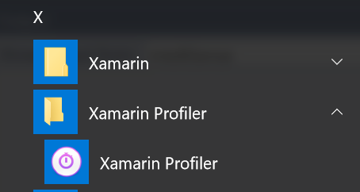

-----

You can load *.mlpd* files into the Profiler by opening the standalone application, selecting **Choose Target** and loading the file.

For more information, see [Generating .mlpd Files](~/tools/profiler/troubleshooting.md#gen_mlpd).

## Profiler Features

The Xamarin Profiler is composed of five sections as illustrated below:

# [Visual Studio for Mac](#tab/macos)

[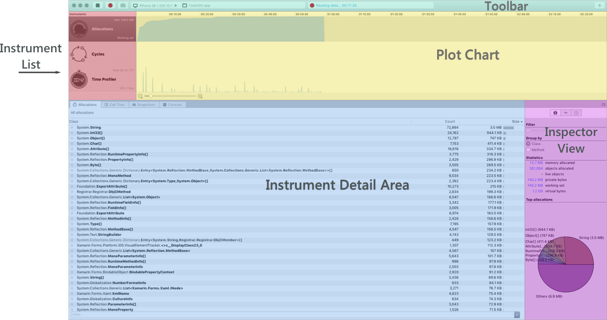](images/profiler-mac.png#lightbox) 

# [Visual Studio](#tab/windows)

-----

- **Toolbar** – Located at the top of the profiler, this offers options to start/stop profiling, select a target process, view the running time of the app, and select the split views that compose the profiler application.
- **Instrument List** – This lists all instruments loaded for the profiling session.
- **Plot Chart** – These charts relate horizontally to the relevant instruments in the instrument list. A slider (shown beneath Time Profiler) can be used to change the scale.
- **Instrument Detail area** - Contains data being displayed by the selected view of the current Instrument. We will look at these views in more detail in the section below.
- **Inspector View** – This contains sections that can be selected by the segmented control. The sections are dependent on the instrument selected, and  includes: Configuration Settings, Statistics, Stack Trace information, and Path to roots.

### Allocations

The allocations instrument provides detailed information about objects in the application as they are being created and garbage collected.

At the top of the profiler is the allocations chart, which displays the amount of memory allocated at regular intervals during the profiling. Currently the allocations graph is the total number of allocations and NOT the size of the heap at that point in time. In a sense, it will never go down, it will only ever increase. This includes objects allocated on the stack. Depending on the runtime version used, the chart can look different – even for the same app.

# [Visual Studio for Mac](#tab/macos)

[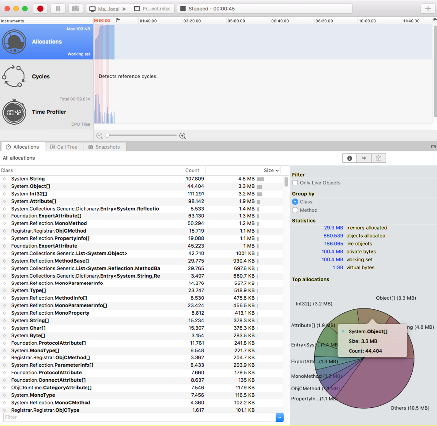](images/allocations1.png#lightbox) 

# [Visual Studio](#tab/windows)

-----

There are different data views in the Allocations instrument, which allow developers to analyze how their application is using and freeing memory. These views are described below:

- **Allocations** – This displays a list of all allocations and groups them by class name. This provides a great overview of classes and methods being used, how often they are used, and the collective size of the classes used. Double clicking on a class will show the memory allocated : 

# [Visual Studio for Mac](#tab/macos)

   

# [Visual Studio](#tab/windows)

  

-----

The Inspector view for Allocations provides options for filtering and grouping objects, providing statistics on memory allocated, and the top allocations, as well as views for Stack Trace and Path to Root.

- **Call Tree** – This displays the entire call tree of all threads in the application and includes information about the memory allocated on each node. When an element is selected in the list, all sibling nodes will appear grey. You can expand the tree or double-click the element to drill down into it.When displaying this data view, the display settings inspector view can be used to change the way it is presented. There are currently two options:
    1. **Inverted Call Tree** – This considers the stack trace from top to bottom. This is a convenient view option as it indicates the deepest methods where the CPU has been spending its time.
    2. **Separate by thread** – This option organizes the call tree by thread.

# [Visual Studio for Mac](#tab/macos)

  [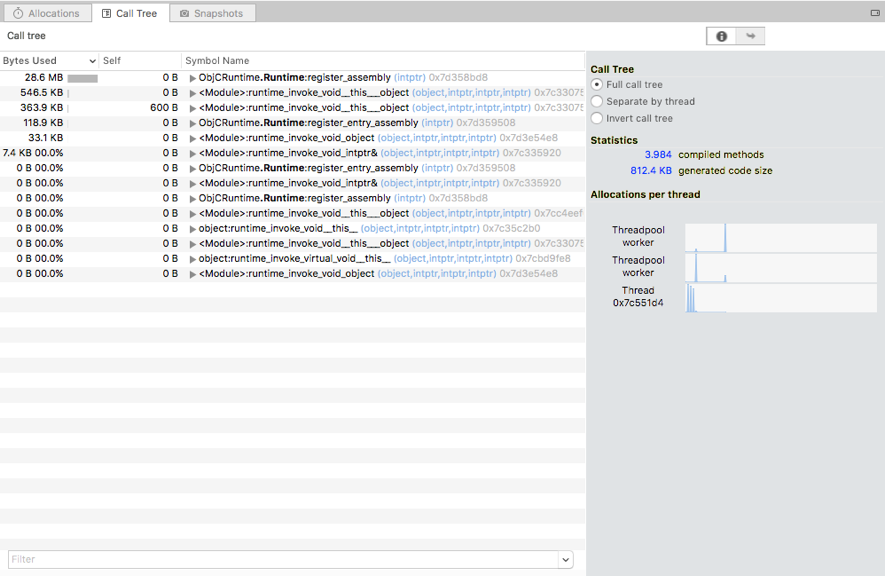](images/allocations2.png#lightbox) 

# [Visual Studio](#tab/windows)

  

-----

- **Snapshots** – This pane displays information about memory snapshots. To generate these while profiling a live application, click the _Camera_ button in the toolbar at each point that you'd like to see what memory is retained and released. You can then click each snapshot to explore what is happening under the hood. Note that snapshots can only be taken when live profiling an app. 

# [Visual Studio for Mac](#tab/macos)

   

# [Visual Studio](#tab/windows)

  [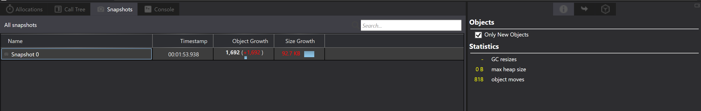](images/allocations4-vs.png#lightbox)

-----

### Time Profiler

The Time Profiler instrument measures exactly how much time is spent in each method of an application. The application is paused at regular intervals and a stack trace is run on each active thread. Each row in the Instrument Detail area shows the execution path that has been followed.

The plot chart, as shown in the screenshot below, displays the number of samples received by the app as it runs:

# [Visual Studio for Mac](#tab/macos)

 

 

# [Visual Studio](#tab/windows)

[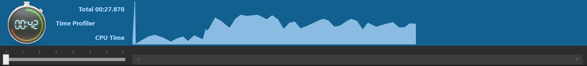](images/time1-vs.png#lightbox) 

[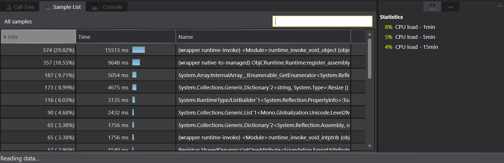](images/time3-vs.png#lightbox) 

-----

- **Call Tree** – Shows amount of time spent in each method:

# [Visual Studio for Mac](#tab/macos)

  [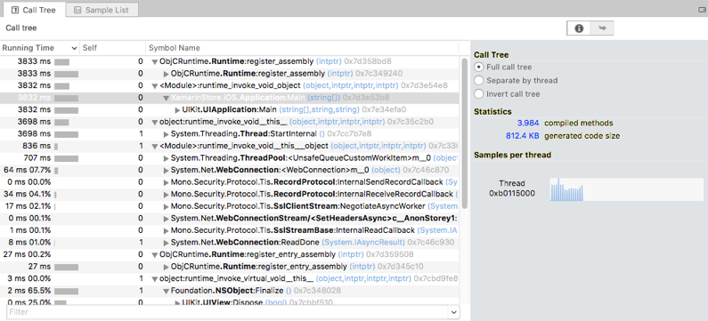](images/time2.png#lightbox) 

# [Visual Studio](#tab/windows)

   

-----

### Cycles

Through the use of C# and F# managed code, it can be quite common, and unfortunately quite easy to create references to objects which will never be disposed. This instrument allows you to pinpoint those objects, and display the cycles referenced in your application.

# [Visual Studio for Mac](#tab/macos)

 

# [Visual Studio](#tab/windows)

[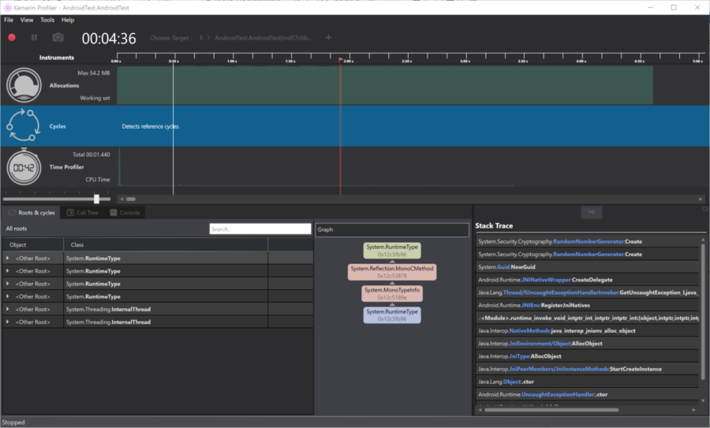](images/cycles-vs.png#lightbox) 

-----

## Profiling Applications

Currently, only the default Debug configurations can be profiled.

If you profile an app with any other configuration, you will be presented with the following message dialog:

# [Visual Studio for Mac](#tab/macos)

[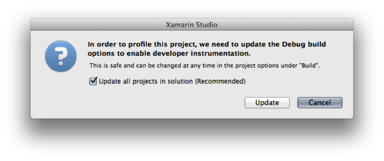](images/image001.png#lightbox) 

# [Visual Studio](#tab/windows)

 

-----

Select **Update** to continue.

### SGen Garbage Collector and Profiling

The [SGen](https://www.mono-project.com/docs/advanced/garbage-collector/sgen/) garbage collector is used for all Xamarin platforms.

SGen is a generational GC, which allocates objects of an application into three heaps — Nursery, Major Heap and the Large Object Space. This allows for speedier execution of garbage collection. SGen is currently the default GC for Xamarin.Android, and Xamarin.iOS Unified applications.

Xamarin.iOS application using the Classic API used the Boehm GC – a conservative, non-generational garbage collector. As it is conservative, it is less likely to free up available memory, which can lead to inaccurate results when using the profiler. For this reason, the Allocations instrument cannot be used with the Boehm garbage collector.

While you will be prompted with a message dialog if your app uses the Boehm GC, Xamarin does not recommend switching existing iOS application that use Boehm to SGen without careful research and thorough testing. Xamarin also does not recommend switching to SGen for profiling and then switching back, as these results will not provide accurate benchmarks of memory usage.

For more information on memory management, refer to the [Memory and Performance Best Practices](~/cross-platform/deploy-test/memory-perf-best-practices.md) guide.

## Summary

In this guide we looked at what profiling is and how it is advantageous to the developer. We then introduced the Xamarin Profiler, providing some history and information into how it works. Finally we toured the features of the Xamarin Profiler, and explored the Allocations and Time Profiler Instruments.

## Related Links

- [Memory and performance best practices](~/cross-platform/deploy-test/memory-perf-best-practices.md)
- [Release notes](/xamarin/tools/profiler/release-notes/)
