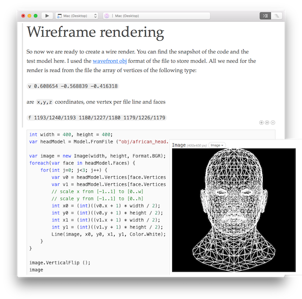

# TinyRenderer Workbooks

A series of workbooks that explain how OpenGL works, which runs on both
Windows and Mac. Read, run, and experiment with each workbook in the series
to better understand how software rendering works.

> [!NOTE]
> These workbooks are a port of an [excellent C++ series](https://github.com/ssloy/tinyrenderer/wiki) written by Dmitry Sokolov.

-    [Lesson 1: Line Drawing Algorithm](https://developer.xamarin.com/workbooks/graphics/tiny-renderer/lesson1.workbook)
-    [Lesson 2: Triangle rasterization](https://developer.xamarin.com/workbooks/graphics/tiny-renderer/lesson2.workbook)
-    [Lesson 3: Hidden faces removal](https://developer.xamarin.com/workbooks/graphics/tiny-renderer/lesson3.workbook)
-    [Lesson 4: Perspective projection](https://developer.xamarin.com/workbooks/graphics/tiny-renderer/lesson4.workbook)
-    [Lesson 5: Moving the camera](https://developer.xamarin.com/workbooks/graphics/tiny-renderer/lesson5.workbook)
-    [Lesson 6: Shaders for the software renderer](https://developer.xamarin.com/workbooks/graphics/tiny-renderer/lesson6.workbook)
-    [Lesson 6bis: tangent space normal mapping](https://developer.xamarin.com/workbooks/graphics/tiny-renderer/lesson6bis.workbook)
-    [Lesson 7: Shadow mapping](https://developer.xamarin.com/workbooks/graphics/tiny-renderer/lesson7.workbook)
-    [Lesson 8: Ambient occlusion](https://developer.xamarin.com/workbooks/graphics/tiny-renderer/lesson8.workbook)

The C# code in these workbooks is based on this
open source [C++ code](https://github.com/ssloy/tinyrenderer) and the text is
from this [wiki](https://github.com/ssloy/tinyrenderer/wiki/). We appreciate that the original work is available under a license that allowed us to turn it into a set of workbooks.

## Related Links

- [Original Source](https://github.com/ssloy/tinyrenderer/blob/master/README.md)
- [C# Workbooks](https://github.com/xamarin/Workbooks/tree/master/graphics/tiny-renderer)
