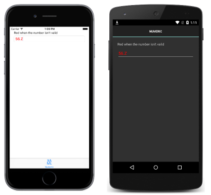

# Attached Behaviors

[ Download the sample](/samples/xamarin/xamarin-forms-samples/behaviors-attachednumericvalidationbehavior)

_Attached behaviors are static classes with one or more attached properties. This article demonstrates how to create and consume attached behaviors._

## Overview

An attached property is a special type of bindable property. They are defined in one class but attached to other objects, and they are recognizable in XAML as attributes that contain a class and a property name separated by a period.

An attached property can define a `propertyChanged` delegate that will be executed when the value of the property changes, such as when the property is set on a control. When the `propertyChanged` delegate executes, it's passed a reference to the control on which it is being attached, and parameters that contain the old and new values for the property. This delegate can be used to add new functionality to the control that the property is attached to by manipulating the reference that is passed in, as follows:

1. The `propertyChanged` delegate casts the control reference, which is received as a [`BindableObject`](xref:Xamarin.Forms.BindableObject), to the control type that the behavior is designed to enhance.
1. The `propertyChanged` delegate modifies properties of the control, calls methods of the control, or registers event handlers for events exposed by the control, to implement the core behavior functionality.

An issue with attached behaviors is that they are defined in a `static` class, with `static` properties and methods. This makes it difficult to create attached behaviors that have state. In addition, Xamarin.Forms behaviors have replaced attached behaviors as the preferred approach to behavior construction. For more information about Xamarin.Forms behaviors, see [Xamarin.Forms Behaviors](~/xamarin-forms/app-fundamentals/behaviors/creating.md).

## Creating an Attached Behavior

The sample application demonstrates a `NumericValidationBehavior`, which highlights the value entered by the user into an [`Entry`](xref:Xamarin.Forms.Entry) control in red, if it's not a `double`. The behavior is shown in the following code example:

```csharp
public static class NumericValidationBehavior
{
    public static readonly BindableProperty AttachBehaviorProperty =
        BindableProperty.CreateAttached (
            "AttachBehavior",
            typeof(bool),
            typeof(NumericValidationBehavior),
            false,
            propertyChanged:OnAttachBehaviorChanged);

    public static bool GetAttachBehavior (BindableObject view)
    {
        return (bool)view.GetValue (AttachBehaviorProperty);
    }

    public static void SetAttachBehavior (BindableObject view, bool value)
    {
        view.SetValue (AttachBehaviorProperty, value);
    }

    static void OnAttachBehaviorChanged (BindableObject view, object oldValue, object newValue)
    {
        var entry = view as Entry;
        if (entry == null) {
            return;
        }

        bool attachBehavior = (bool)newValue;
        if (attachBehavior) {
            entry.TextChanged += OnEntryTextChanged;
        } else {
            entry.TextChanged -= OnEntryTextChanged;
        }
    }

    static void OnEntryTextChanged (object sender, TextChangedEventArgs args)
    {
        double result;
        bool isValid = double.TryParse (args.NewTextValue, out result);
        ((Entry)sender).TextColor = isValid ? Color.Default : Color.Red;
    }
}
```

The `NumericValidationBehavior` class contains an attached property named `AttachBehavior` with a `static` getter and setter, which controls the addition or removal of the behavior to the control to which it will be attached. This attached property registers the `OnAttachBehaviorChanged` method that will be executed when the value of the property changes. This method registers or de-registers an event handler for the [`TextChanged`](xref:Xamarin.Forms.InputView.TextChanged) event, based on the value of the `AttachBehavior` attached property. The core functionality of the behavior is provided by the `OnEntryTextChanged` method, which parses the value entered into the [`Entry`](xref:Xamarin.Forms.Entry) by the user, and sets the `TextColor` property to red if the value isn't a `double`.

## Consuming an Attached Behavior

The `NumericValidationBehavior` class can be consumed by adding the `AttachBehavior` attached property to an [`Entry`](xref:Xamarin.Forms.Entry) control, as demonstrated in the following XAML code example:

```xaml
<ContentPage ... xmlns:local="clr-namespace:WorkingWithBehaviors;assembly=WorkingWithBehaviors" ...>
    ...
    <Entry Placeholder="Enter a System.Double" local:NumericValidationBehavior.AttachBehavior="true" />
    ...
</ContentPage>
```

The equivalent [`Entry`](xref:Xamarin.Forms.Entry) in C# is shown in the following code example:

```csharp
var entry = new Entry { Placeholder = "Enter a System.Double" };
NumericValidationBehavior.SetAttachBehavior (entry, true);
```

At runtime, the behavior will respond to interaction with the control, according to the behavior implementation. The following screenshots demonstrate the attached behavior responding to invalid input:

[](attached-images/screenshots.png#lightbox "Sample Application with Attached Behavior")

> [!NOTE]
> Attached behaviors are written for a specific control type (or a superclass that can apply to many controls), and they should only be added to a compatible control. Attempting to attach a behavior to an incompatible control will result in unknown behavior, and depends on the behavior implementation.

### Removing an Attached Behavior from a Control

The `NumericValidationBehavior` class can be removed from a control by setting the `AttachBehavior` attached property to `false`, as demonstrated in the following XAML code example:

```xaml
<Entry Placeholder="Enter a System.Double" local:NumericValidationBehavior.AttachBehavior="false" />
```

The equivalent [`Entry`](xref:Xamarin.Forms.Entry) in C# is shown in the following code example:

```csharp
var entry = new Entry { Placeholder = "Enter a System.Double" };
NumericValidationBehavior.SetAttachBehavior (entry, false);
```

At runtime, the `OnAttachBehaviorChanged` method will be executed when the value of the `AttachBehavior` attached property is set to `false`. The `OnAttachBehaviorChanged` method will then de-register the event handler for the [`TextChanged`](xref:Xamarin.Forms.InputView.TextChanged) event, ensuring that the behavior isn't executed as the user interacts with the control.

## Summary

This article demonstrated how to create and consume attached behaviors. Attached behaviors are `static` classes with one or more attached properties.

## Related Links

- [Attached Behaviors (sample)](/samples/xamarin/xamarin-forms-samples/behaviors-attachednumericvalidationbehavior)