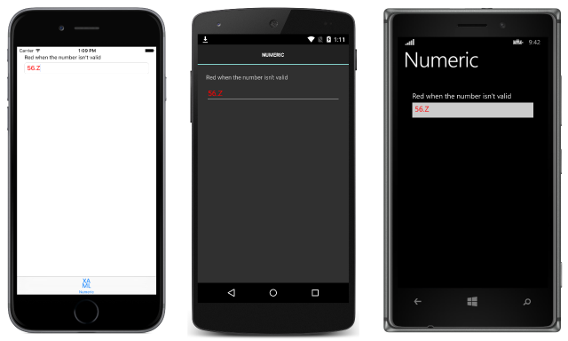

# Create Xamarin.Forms behaviors

[ Download the sample](/samples/xamarin/xamarin-forms-samples/behaviors-numericvalidationbehavior)

_Xamarin.Forms behaviors are created by deriving from the Behavior or Behavior&lt;T&gt; class. This article demonstrates how to create and consume Xamarin.Forms behaviors._

## Overview

The process for creating a Xamarin.Forms behavior is as follows:

1. Create a class that inherits from the [`Behavior`](xref:Xamarin.Forms.Behavior) or [`Behavior<T>`](xref:Xamarin.Forms.Behavior`1) class, where `T` is the type of the control to which the behavior should apply.
1. Override the [`OnAttachedTo`](xref:Xamarin.Forms.Behavior`1.OnAttachedTo(Xamarin.Forms.BindableObject)) method to perform any required setup.
1. Override the [`OnDetachingFrom`](xref:Xamarin.Forms.Behavior`1.OnDetachingFrom(Xamarin.Forms.BindableObject)) method to perform any required cleanup.
1. Implement the core functionality of the behavior.

This results in the structure shown in the following code example:

```csharp
public class CustomBehavior : Behavior<View>
{
    protected override void OnAttachedTo (View bindable)
    {
        base.OnAttachedTo (bindable);
        // Perform setup
    }

    protected override void OnDetachingFrom (View bindable)
    {
        base.OnDetachingFrom (bindable);
        // Perform clean up
    }

    // Behavior implementation
}
```

The [`OnAttachedTo`](xref:Xamarin.Forms.Behavior`1.OnAttachedTo(Xamarin.Forms.BindableObject)) method is fired immediately after the behavior is attached to a control. This method receives a reference to the control to which it is attached, and can be used to register event handlers or perform other setup that's required to support the behavior functionality. For example, you could subscribe to an event on a control. The behavior functionality would then be implemented in the event handler for the event.

The [`OnDetachingFrom`](xref:Xamarin.Forms.Behavior`1.OnDetachingFrom(Xamarin.Forms.BindableObject)) method is fired when the behavior is removed from the control. This method receives a reference to the control to which it is attached, and is used to perform any required cleanup. For example, you could unsubscribe from an event on a control to prevent memory leaks.

The behavior can then be consumed by attaching it to the [`Behaviors`](xref:Xamarin.Forms.VisualElement.Behaviors) collection of the appropriate control.

## Creating a Xamarin.Forms Behavior

The sample application demonstrates a `NumericValidationBehavior`, which highlights the value entered by the user into an [`Entry`](xref:Xamarin.Forms.Entry) control in red, if it's not a `double`. The behavior is shown in the following code example:

```csharp
public class NumericValidationBehavior : Behavior<Entry>
{
    protected override void OnAttachedTo(Entry entry)
    {
        entry.TextChanged += OnEntryTextChanged;
        base.OnAttachedTo(entry);
    }

    protected override void OnDetachingFrom(Entry entry)
    {
        entry.TextChanged -= OnEntryTextChanged;
        base.OnDetachingFrom(entry);
    }

    void OnEntryTextChanged(object sender, TextChangedEventArgs args)
    {
        double result;
        bool isValid = double.TryParse (args.NewTextValue, out result);
        ((Entry)sender).TextColor = isValid ? Color.Default : Color.Red;
    }
}
```

The `NumericValidationBehavior` derives from the [`Behavior<T>`](xref:Xamarin.Forms.Behavior`1) class, where `T` is an [`Entry`](xref:Xamarin.Forms.Entry). The [`OnAttachedTo`](xref:Xamarin.Forms.Behavior`1.OnAttachedTo(Xamarin.Forms.BindableObject)) method registers an event handler for the [`TextChanged`](xref:Xamarin.Forms.InputView.TextChanged) event, with the [`OnDetachingFrom`](xref:Xamarin.Forms.Behavior`1.OnDetachingFrom(Xamarin.Forms.BindableObject)) method de-registering the `TextChanged` event to prevent memory leaks. The core functionality of the behavior is provided by the `OnEntryTextChanged` method, which parses the value entered by the user into the `Entry`, and sets the [`TextColor`](xref:Xamarin.Forms.InputView.TextColor) property to red if the value isn't a `double`.

> [!NOTE]
> Xamarin.Forms does not set the `BindingContext` of a behavior, because behaviors can be shared and applied to multiple controls through styles.

## Consuming a Xamarin.Forms Behavior

Every Xamarin.Forms control has a [`Behaviors`](xref:Xamarin.Forms.VisualElement.Behaviors) collection, to which one or more behaviors can be added, as demonstrated in the following XAML code example:

```xaml
<Entry Placeholder="Enter a System.Double">
    <Entry.Behaviors>
        <local:NumericValidationBehavior />
    </Entry.Behaviors>
</Entry>
```

The equivalent [`Entry`](xref:Xamarin.Forms.Entry) in C# is shown in the following code example:

```csharp
var entry = new Entry { Placeholder = "Enter a System.Double" };
entry.Behaviors.Add (new NumericValidationBehavior ());
```

At runtime the behavior will respond to interaction with the control, according to the behavior implementation. The following screenshots demonstrate the behavior responding to invalid input:

[](creating-images/screenshots.png#lightbox "Sample Application with Xamarin.Forms Behavior")

> [!NOTE]
> Behaviors are written for a specific control type (or a superclass that can apply to many controls), and they should only be added to a compatible control. Attempting to attach a behavior to an incompatible control will result in an exception being thrown.

### Consuming a Xamarin.Forms Behavior with a Style

Behaviors can also be consumed by an explicit or implicit style. However, creating a style that sets the [`Behaviors`](xref:Xamarin.Forms.VisualElement.Behaviors) property of a control is not possible because the property is read-only. The solution is to add an attached property to the behavior class that controls adding and removing the behavior. The process is as follows:

1. Add an attached property to the behavior class that will be used to control the addition or removal of the behavior to the control to which the behavior will attached. Ensure that the attached property registers a `propertyChanged` delegate that will be executed when the value of the property changes.
1. Create a `static` getter and setter for the attached property.
1. Implement logic in the `propertyChanged` delegate to add and remove the behavior.

The following code example shows an attached property that controls adding and removing the `NumericValidationBehavior`:

```csharp
public class NumericValidationBehavior : Behavior<Entry>
{
    public static readonly BindableProperty AttachBehaviorProperty =
        BindableProperty.CreateAttached ("AttachBehavior", typeof(bool), typeof(NumericValidationBehavior), false, propertyChanged: OnAttachBehaviorChanged);

    public static bool GetAttachBehavior (BindableObject view)
    {
        return (bool)view.GetValue (AttachBehaviorProperty);
    }

    public static void SetAttachBehavior (BindableObject view, bool value)
    {
        view.SetValue (AttachBehaviorProperty, value);
    }

    static void OnAttachBehaviorChanged (BindableObject view, object oldValue, object newValue)
    {
        var entry = view as Entry;
        if (entry == null) {
            return;
        }

        bool attachBehavior = (bool)newValue;
        if (attachBehavior) {
            entry.Behaviors.Add (new NumericValidationBehavior ());
        } else {
            var toRemove = entry.Behaviors.FirstOrDefault (b => b is NumericValidationBehavior);
            if (toRemove != null) {
                entry.Behaviors.Remove (toRemove);
            }
        }
    }
    ...
}
```

The `NumericValidationBehavior` class contains an attached property named `AttachBehavior` with a `static` getter and setter, which controls the addition or removal of the behavior to the control to which it will be attached. This attached property registers the `OnAttachBehaviorChanged` method that will be executed when the value of the property changes. This method adds or removes the behavior to the control, based on the value of the `AttachBehavior` attached property.

The following code example shows an *explicit* style for the `NumericValidationBehavior` that uses the `AttachBehavior` attached property, and which can be applied to [`Entry`](xref:Xamarin.Forms.Entry) controls:

```xaml
<Style x:Key="NumericValidationStyle" TargetType="Entry">
    <Style.Setters>
        <Setter Property="local:NumericValidationBehavior.AttachBehavior" Value="true" />
    </Style.Setters>
</Style>
```

The [`Style`](xref:Xamarin.Forms.Style) can be applied to an [`Entry`](xref:Xamarin.Forms.Entry) control by setting its [`Style`](xref:Xamarin.Forms.NavigableElement.Style) property to the `Style` instance using the `StaticResource` markup extension, as demonstrated in the following code example:

```xaml
<Entry Placeholder="Enter a System.Double" Style="{StaticResource NumericValidationStyle}">
```

For more information about styles, see [Styles](~/xamarin-forms/user-interface/styles/index.md).

> [!NOTE]
> While you can add bindable properties to a behavior that is set or queried in XAML, if you do create behaviors that have state they should not be shared between controls in a `Style` in a `ResourceDictionary`.

### Removing a Behavior from a Control

The [`OnDetachingFrom`](xref:Xamarin.Forms.Behavior`1.OnDetachingFrom(Xamarin.Forms.BindableObject)) method is fired when a behavior is removed from a control, and is used to perform any required cleanup such as unsubscribing from an event to prevent a memory leak. However, behaviors are not implicitly removed from controls unless the control's [`Behaviors`](xref:Xamarin.Forms.VisualElement.Behaviors) collection is modified by a `Remove` or `Clear` method. The following code example demonstrates removing a specific behavior from a control's `Behaviors` collection:

```csharp
var toRemove = entry.Behaviors.FirstOrDefault (b => b is NumericValidationBehavior);
if (toRemove != null) {
    entry.Behaviors.Remove (toRemove);
}
```

Alternatively, the control's [`Behaviors`](xref:Xamarin.Forms.VisualElement.Behaviors) collection can be cleared, as demonstrated in the following code example:

```csharp
entry.Behaviors.Clear();
```

In addition, note that behaviors are not implicitly removed from controls when pages are popped from the navigation stack. Instead, they must be explicitly removed prior to pages going out of scope.

## Summary

This article demonstrated how to create and consume Xamarin.Forms behaviors. Xamarin.Forms behaviors are created by deriving from the [`Behavior`](xref:Xamarin.Forms.Behavior) or [`Behavior<T>`](xref:Xamarin.Forms.Behavior`1) class.

## Related Links

- [Xamarin.Forms Behavior (sample)](/samples/xamarin/xamarin-forms-samples/behaviors-numericvalidationbehavior)
- [Xamarin.Forms Behavior applied with a Style (sample)](/samples/xamarin/xamarin-forms-samples/behaviors-numericvalidationbehaviorstyle)
- [Behavior](xref:Xamarin.Forms.Behavior)
- [Behavior\<T>](xref:Xamarin.Forms.Behavior`1)