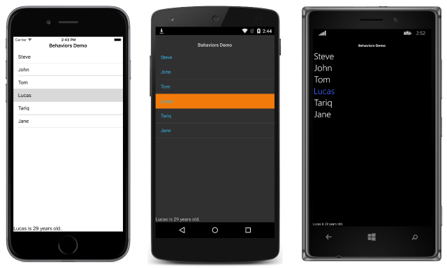

# Reusable EventToCommandBehavior

[ Download the sample](https://developer.xamarin.com/samples/xamarin-forms/behaviors/eventtocommandbehavior/)

_Behaviors can be used to associate commands with controls that were not designed to interact with commands. This article demonstrates creating and consuming a Xamarin.Forms behavior to invoke a command when an event fires._

## Overview

The `EventToCommandBehavior` class is a reusable Xamarin.Forms custom behavior that executes a command in response to *any* event firing. By default, the event arguments for the event will be passed to the command, and can be optionally converted by an [`IValueConverter`](xref:Xamarin.Forms.IValueConverter) implementation.

The following behavior properties must be set to use the behavior:

- **EventName** – the name of the event the behavior listens to.
- **Command** – the `ICommand` to be executed. The behavior expects to find the `ICommand` instance on the [`BindingContext`](xref:Xamarin.Forms.BindableObject.BindingContext) of the attached control, which may be inherited from a parent element.

The following optional behavior properties can also be set:

- **CommandParameter** – an `object` that will be passed to the command.
- **Converter** – an [`IValueConverter`](xref:Xamarin.Forms.IValueConverter) implementation that will change the format of the event argument data as it's passed between *source* and *target* by the binding engine.

> [!NOTE]
> The `EventToCommandBehavior` is a custom class that can be located in the [EventToCommand Behavior sample](https://developer.xamarin.com/samples/xamarin-forms/behaviors/eventtocommandbehavior/), and is not part of Xamarin.Forms.

## Creating the Behavior

The `EventToCommandBehavior` class derives from the `BehaviorBase<T>` class, which in turn derives from the [`Behavior<T>`](xref:Xamarin.Forms.Behavior`1) class. The purpose of the `BehaviorBase<T>` class is to provide a base class for any Xamarin.Forms behaviors that require the [`BindingContext`](xref:Xamarin.Forms.BindableObject.BindingContext) of the behavior to be set to the attached control. This ensures that the behavior can bind to and execute the `ICommand` specified by the `Command` property when the behavior is consumed.

The `BehaviorBase<T>` class provides an overridable [`OnAttachedTo`](xref:Xamarin.Forms.Behavior`1.OnAttachedTo(Xamarin.Forms.BindableObject)) method that sets the [`BindingContext`](xref:Xamarin.Forms.BindableObject.BindingContext) of the behavior and an overridable [`OnDetachingFrom`](xref:Xamarin.Forms.Behavior`1.OnDetachingFrom(Xamarin.Forms.BindableObject)) method that cleans up the `BindingContext`. In addition, the class stores a reference to the attached control in the `AssociatedObject` property.

### Implementing Bindable Properties

The `EventToCommandBehavior` class defines four [`BindableProperty`](xref:Xamarin.Forms.BindableProperty) instances, that execute a user defined command when an event fires. These properties are shown in the following code example:

```csharp
public class EventToCommandBehavior : BehaviorBase<View>
{
  public static readonly BindableProperty EventNameProperty =
    BindableProperty.Create ("EventName", typeof(string), typeof(EventToCommandBehavior), null, propertyChanged: OnEventNameChanged);
  public static readonly BindableProperty CommandProperty =
    BindableProperty.Create ("Command", typeof(ICommand), typeof(EventToCommandBehavior), null);
  public static readonly BindableProperty CommandParameterProperty =
    BindableProperty.Create ("CommandParameter", typeof(object), typeof(EventToCommandBehavior), null);
  public static readonly BindableProperty InputConverterProperty =
    BindableProperty.Create ("Converter", typeof(IValueConverter), typeof(EventToCommandBehavior), null);

  public string EventName { ... }
  public ICommand Command { ... }
  public object CommandParameter { ... }
  public IValueConverter Converter { ...  }
  ...
}
```

When the `EventToCommandBehavior` class is consumed, the `Command` property should be data bound to an `ICommand` to be executed in response to the event firing that's defined in the `EventName` property. The behavior will expect to find the `ICommand` on the [`BindingContext`](xref:Xamarin.Forms.BindableObject.BindingContext) of the attached control.

By default, the event arguments for the event will be passed to the command. This data can be optionally converted as it's passed between *source* and *target* by the binding engine, by specifying an [`IValueConverter`](xref:Xamarin.Forms.IValueConverter) implementation as the `Converter` property value. Alternatively, a parameter can be passed to the command by specifying the `CommandParameter` property value.

### Implementing the Overrides

The `EventToCommandBehavior` class overrides the [`OnAttachedTo`](xref:Xamarin.Forms.Behavior`1.OnAttachedTo(Xamarin.Forms.BindableObject)) and [`OnDetachingFrom`](xref:Xamarin.Forms.Behavior`1.OnDetachingFrom(Xamarin.Forms.BindableObject)) methods of the `BehaviorBase<T>` class, as shown in the following code example:

```csharp
public class EventToCommandBehavior : BehaviorBase<View>
{
  ...
  protected override void OnAttachedTo (View bindable)
  {
    base.OnAttachedTo (bindable);
    RegisterEvent (EventName);
  }

  protected override void OnDetachingFrom (View bindable)
  {
    DeregisterEvent (EventName);
    base.OnDetachingFrom (bindable);
  }
  ...
}
```

The [`OnAttachedTo`](xref:Xamarin.Forms.Behavior`1.OnAttachedTo(Xamarin.Forms.BindableObject)) method performs setup by calling the `RegisterEvent` method, passing in the value of the `EventName` property as a parameter. The [`OnDetachingFrom`](xref:Xamarin.Forms.Behavior`1.OnDetachingFrom(Xamarin.Forms.BindableObject)) method performs cleanup by calling the `DeregisterEvent` method, passing in the value of the `EventName` property as a parameter.

### Implementing the Behavior Functionality

The purpose of the behavior is to execute the command defined by the `Command` property in response to the event firing that's defined by the `EventName` property. The core behavior functionality is shown in the following code example:

```csharp
public class EventToCommandBehavior : BehaviorBase<View>
{
  ...
  void RegisterEvent (string name)
  {
    if (string.IsNullOrWhiteSpace (name)) {
      return;
    }

    EventInfo eventInfo = AssociatedObject.GetType ().GetRuntimeEvent (name);
    if (eventInfo == null) {
      throw new ArgumentException (string.Format ("EventToCommandBehavior: Can't register the '{0}' event.", EventName));
    }
    MethodInfo methodInfo = typeof(EventToCommandBehavior).GetTypeInfo ().GetDeclaredMethod ("OnEvent");
    eventHandler = methodInfo.CreateDelegate (eventInfo.EventHandlerType, this);
    eventInfo.AddEventHandler (AssociatedObject, eventHandler);
  }

  void OnEvent (object sender, object eventArgs)
  {
    if (Command == null) {
      return;
    }

    object resolvedParameter;
    if (CommandParameter != null) {
      resolvedParameter = CommandParameter;
    } else if (Converter != null) {
      resolvedParameter = Converter.Convert (eventArgs, typeof(object), null, null);
    } else {
      resolvedParameter = eventArgs;
    }        

    if (Command.CanExecute (resolvedParameter)) {
      Command.Execute (resolvedParameter);
    }
  }
  ...
}
```

The `RegisterEvent` method is executed in response to the `EventToCommandBehavior` being attached to a control, and it receives the value of the `EventName` property as a parameter. The method then attempts to locate the event defined in the `EventName` property, on the attached control. Provided that the event can be located, the `OnEvent` method is registered to be the handler method for the event.

The `OnEvent` method is executed in response to the event firing that's defined in the `EventName` property. Provided that the `Command` property references a valid `ICommand`, the method attempts to retrieve a parameter to pass to the `ICommand` as follows:

- If the `CommandParameter` property defines a parameter, it is retrieved.
- Otherwise, if the `Converter` property defines an [`IValueConverter`](xref:Xamarin.Forms.IValueConverter) implementation, the converter is executed and converts the event argument data as it's passed between *source* and *target* by the binding engine.
- Otherwise, the event arguments are assumed to be the parameter.

The data bound `ICommand` is then executed, passing in the parameter to the command, provided that the [`CanExecute`](xref:Xamarin.Forms.Command.CanExecute(System.Object)) method returns `true`.

Although not shown here, the `EventToCommandBehavior` also includes a `DeregisterEvent` method that's executed by the [`OnDetachingFrom`](xref:Xamarin.Forms.Behavior`1.OnDetachingFrom(Xamarin.Forms.BindableObject)) method. The `DeregisterEvent` method is used to locate and deregister the event defined in the `EventName` property, to cleanup any potential memory leaks.

## Consuming the Behavior

The `EventToCommandBehavior` class can be attached to the [`Behaviors`](xref:Xamarin.Forms.VisualElement.Behaviors) collection of a control, as demonstrated in the following XAML code example:

```xaml
<ListView ItemsSource="{Binding People}">
    <ListView.ItemTemplate>
        <DataTemplate>
            <TextCell Text="{Binding Name}" />
        </DataTemplate>
    </ListView.ItemTemplate>
    <ListView.Behaviors>
        <local:EventToCommandBehavior EventName="ItemSelected" Command="{Binding OutputAgeCommand}" Converter="{StaticResource SelectedItemConverter}" />
    </ListView.Behaviors>
</ListView>
<Label Text="{Binding SelectedItemText}" />
```

The equivalent C# code is shown in the following code example:

```csharp
var listView = new ListView();
listView.SetBinding(ItemsView<Cell>.ItemsSourceProperty, "People");
listView.ItemTemplate = new DataTemplate(() =>
{
    var textCell = new TextCell();
    textCell.SetBinding(TextCell.TextProperty, "Name");
    return textCell;
});
listView.Behaviors.Add(new EventToCommandBehavior
{
    EventName = "ItemSelected",
    Command = ((HomePageViewModel)BindingContext).OutputAgeCommand,
    Converter = new SelectedItemEventArgsToSelectedItemConverter()
});

var selectedItemLabel = new Label();
selectedItemLabel.SetBinding(Label.TextProperty, "SelectedItemText");
```

The `Command` property of the behavior is data bound to the `OutputAgeCommand` property of the associated ViewModel, while the `Converter` property is set to the `SelectedItemConverter` instance, which returns the [`SelectedItem`](xref:Xamarin.Forms.ListView.SelectedItem) of the [`ListView`](xref:Xamarin.Forms.ListView) from the [`SelectedItemChangedEventArgs`](xref:Xamarin.Forms.SelectedItemChangedEventArgs).

At runtime, the behavior will respond to interaction with the control. When an item is selected in the [`ListView`](xref:Xamarin.Forms.ListView), the [`ItemSelected`](xref:Xamarin.Forms.ListView.ItemSelected) event will fire, which will execute the `OutputAgeCommand` in the ViewModel. In turn this updates the ViewModel `SelectedItemText` property that the [`Label`](xref:Xamarin.Forms.Label) binds to, as shown in the following screenshots:

[](event-to-command-behavior-images/screenshots.png#lightbox "Sample Application with EventToCommandBehavior")

The advantage of using this behavior to execute a command when an event fires, is that commands can be associated with controls that weren't designed to interact with commands. In addition, this removes boiler-plate event handling code from code-behind files.

## Summary

This article demonstrated using a Xamarin.Forms behavior to invoke a command when an event fires. Behaviors can be used to associate commands with controls that were not designed to interact with commands.

## Related Links

- [EventToCommand Behavior (sample)](https://developer.xamarin.com/samples/xamarin-forms/behaviors/eventtocommandbehavior/)
- [Behavior](xref:Xamarin.Forms.Behavior)
- [Behavior&lt;T&gt;](xref:Xamarin.Forms.Behavior`1)
