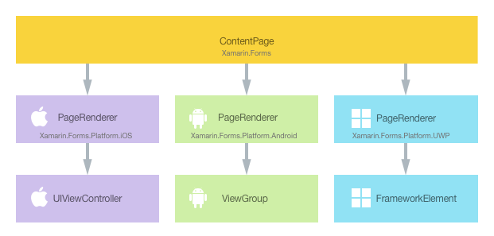
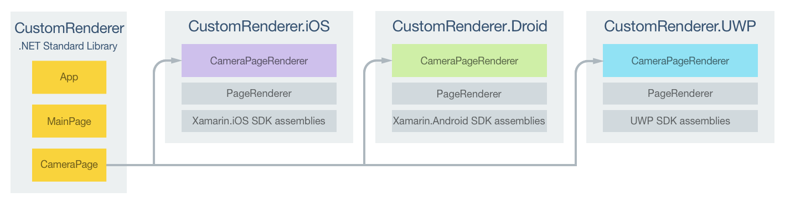
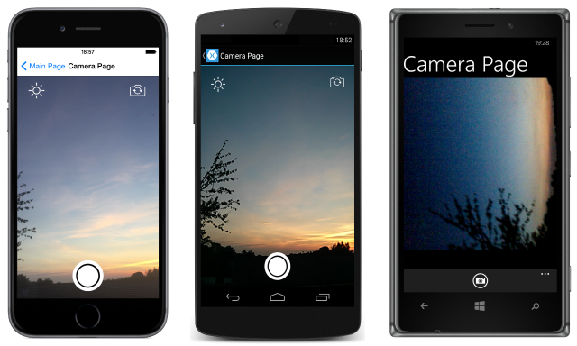

# Customizing a ContentPage

[ Download the sample](/samples/xamarin/xamarin-forms-samples/customrenderers-contentpage)

_A ContentPage is a visual element that displays a single view and occupies most of the screen. This article demonstrates how to create a custom renderer for the ContentPage page, enabling developers to override the default native rendering with their own platform-specific customization._

Every Xamarin.Forms control has an accompanying renderer for each platform that creates an instance of a native control. When a [`ContentPage`](xref:Xamarin.Forms.ContentPage) is rendered by a Xamarin.Forms application, in iOS the `PageRenderer` class is instantiated, which in turn instantiates a native `UIViewController` control. On the Android platform, the `PageRenderer` class instantiates a `ViewGroup` control. On the Universal Windows Platform (UWP), the `PageRenderer` class instantiates a `FrameworkElement` control. For more information about the renderer and native control classes that Xamarin.Forms controls map to, see [Renderer Base Classes and Native Controls](~/xamarin-forms/app-fundamentals/custom-renderer/renderers.md).

The following diagram illustrates the relationship between the [`ContentPage`](xref:Xamarin.Forms.ContentPage) and the corresponding native controls that implement it:



The rendering process can be taken advantage of to implement platform-specific customizations by creating a custom renderer for a [`ContentPage`](xref:Xamarin.Forms.ContentPage) on each platform. The process for doing this is as follows:

1. [Create](#creating-the-xamarinforms-page) a Xamarin.Forms page.
1. [Consume](#consuming-the-xamarinforms-page) the page from Xamarin.Forms.
1. [Create](#creating-the-page-renderer-on-each-platform) the custom renderer for the page on each platform.

Each item will now be discussed in turn, to implement a `CameraPage` that provides a live camera feed and the ability to capture a photo.

## Creating the Xamarin.Forms Page

An unaltered [`ContentPage`](xref:Xamarin.Forms.ContentPage) can be added to the shared Xamarin.Forms project, as shown in the following XAML code example:

```xaml
<ContentPage xmlns="http://xamarin.com/schemas/2014/forms"
             xmlns:x="http://schemas.microsoft.com/winfx/2009/xaml"
             x:Class="CustomRenderer.CameraPage">
    <ContentPage.Content>
    </ContentPage.Content>
</ContentPage>
```

Similarly, the code-behind file for the [`ContentPage`](xref:Xamarin.Forms.ContentPage) should also remain unaltered, as shown in the following code example:

```csharp
public partial class CameraPage : ContentPage
{
    public CameraPage ()
    {
        // A custom renderer is used to display the camera UI
        InitializeComponent ();
    }
}
```

The following code example shows how the page can be created in C#:

```csharp
public class CameraPageCS : ContentPage
{
    public CameraPageCS ()
    {
    }
}
```

An instance of the `CameraPage` will be used to display the live camera feed on each platform. Customization of the control will be carried out in the custom renderer, so no additional implementation is required in the `CameraPage` class.

## Consuming the Xamarin.Forms Page

The empty `CameraPage` must be displayed by the Xamarin.Forms application. This occurs when a button on the `MainPage` instance is tapped, which in turn executes the `OnTakePhotoButtonClicked` method, as shown in the following code example:

```csharp
async void OnTakePhotoButtonClicked (object sender, EventArgs e)
{
    await Navigation.PushAsync (new CameraPage ());
}
```

This code simply navigates to the `CameraPage`, on which custom renderers will customize the page's appearance on each platform.

## Creating the Page Renderer on each Platform

The process for creating the custom renderer class is as follows:

1. Create a subclass of the `PageRenderer` class.
1. Override the `OnElementChanged` method that renders the native page and write logic to customize the page. The `OnElementChanged` method is called when the corresponding Xamarin.Forms control is created.
1. Add an `ExportRenderer` attribute to the page renderer class to specify that it will be used to render the Xamarin.Forms page. This attribute is used to register the custom renderer with Xamarin.Forms.

> [!NOTE]
> It is optional to provide a page renderer in each platform project. If a page renderer isn't registered, then the default renderer for the page will be used.

The following diagram illustrates the responsibilities of each project in the sample application, along with the relationship between them:



The `CameraPage` instance is rendered by platform-specific `CameraPageRenderer` classes, which all derive from the `PageRenderer` class for that platform. This results in each `CameraPage` instance being rendered with a live camera feed, as shown in the following screenshots:



The `PageRenderer` class exposes the `OnElementChanged` method, which is called when the Xamarin.Forms page is created to render the corresponding native control. This method takes an `ElementChangedEventArgs` parameter that contains `OldElement` and `NewElement` properties. These properties represent the Xamarin.Forms element that the renderer *was* attached to, and the Xamarin.Forms element that the renderer *is* attached to, respectively. In the sample application the `OldElement` property will be `null` and the `NewElement` property will contain a reference to the `CameraPage` instance.

An overridden version of the `OnElementChanged` method in the `CameraPageRenderer` class is the place to perform the native page customization. A reference to the Xamarin.Forms page instance that's being rendered can be obtained through the `Element` property.

Each custom renderer class is decorated with an `ExportRenderer` attribute that registers the renderer with Xamarin.Forms. The attribute takes two parameters – the type name of the Xamarin.Forms page being rendered, and the type name of the custom renderer. The `assembly` prefix to the attribute specifies that the attribute applies to the entire assembly.

The following sections discuss the implementation of the `CameraPageRenderer` custom renderer for each platform.

### Creating the Page Renderer on iOS

The following code example shows the page renderer for the iOS platform:

```csharp
[assembly:ExportRenderer (typeof(CameraPage), typeof(CameraPageRenderer))]
namespace CustomRenderer.iOS
{
    public class CameraPageRenderer : PageRenderer
    {
        ...

        protected override void OnElementChanged (VisualElementChangedEventArgs e)
        {
            base.OnElementChanged (e);

            if (e.OldElement != null || Element == null) {
                return;
            }

            try {
                SetupUserInterface ();
                SetupEventHandlers ();
                SetupLiveCameraStream ();
                AuthorizeCameraUse ();
            } catch (Exception ex) {
                System.Diagnostics.Debug.WriteLine (@"            ERROR: ", ex.Message);
            }
        }
        ...
    }
}
```

The call to the base class's `OnElementChanged` method instantiates an iOS `UIViewController` control. The live camera stream is only rendered provided that the renderer isn't already attached to an existing Xamarin.Forms element, and provided that a page instance exists that is being rendered by the custom renderer.

The page is then customized by a series of methods that use the `AVCapture` APIs to provide the live stream from the camera and the ability to capture a photo.

### Creating the Page Renderer on Android

The following code example shows the page renderer for the Android platform:

```csharp
[assembly: ExportRenderer(typeof(CameraPage), typeof(CameraPageRenderer))]
namespace CustomRenderer.Droid
{
    public class CameraPageRenderer : PageRenderer, TextureView.ISurfaceTextureListener
    {
        ...
        public CameraPageRenderer(Context context) : base(context)
        {
        }

        protected override void OnElementChanged(ElementChangedEventArgs<Page> e)
        {
            base.OnElementChanged(e);

            if (e.OldElement != null || Element == null)
            {
                return;
            }

            try
            {
                SetupUserInterface();
                SetupEventHandlers();
                AddView(view);
            }
            catch (Exception ex)
            {
                System.Diagnostics.Debug.WriteLine(@"            ERROR: ", ex.Message);
            }
        }
        ...
    }
}
```

The call to the base class's `OnElementChanged` method instantiates an Android `ViewGroup` control, which is a group of views. The live camera stream is only rendered provided that the renderer isn't already attached to an existing Xamarin.Forms element, and provided that a page instance exists that is being rendered by the custom renderer.

The page is then customized by invoking a series of methods that use the `Camera` API to provide the live stream from the camera and the ability to capture a photo, before the `AddView` method is invoked to add the live camera stream UI to the `ViewGroup`. Note that on Android it's also necessary to override the `OnLayout` method to perform measure and layout operations on the view. For more information, see the [ContentPage renderer sample](/samples/xamarin/xamarin-forms-samples/customrenderers-contentpage).

### Creating the Page Renderer on UWP

The following code example shows the page renderer for UWP:

```csharp
[assembly: ExportRenderer(typeof(CameraPage), typeof(CameraPageRenderer))]
namespace CustomRenderer.UWP
{
    public class CameraPageRenderer : PageRenderer
    {
        ...
        protected override void OnElementChanged(ElementChangedEventArgs<Xamarin.Forms.Page> e)
        {
            base.OnElementChanged(e);

            if (e.OldElement != null || Element == null)
            {
                return;
            }

            try
            {
                ...
                SetupUserInterface();
                SetupBasedOnStateAsync();

                this.Children.Add(page);
            }
            ...
        }

        protected override Size ArrangeOverride(Size finalSize)
        {
            page.Arrange(new Windows.Foundation.Rect(0, 0, finalSize.Width, finalSize.Height));
            return finalSize;
        }
        ...
    }
}

```

The call to the base class's `OnElementChanged` method instantiates a `FrameworkElement` control, on which the page is rendered. The live camera stream is only rendered provided that the renderer isn't already attached to an existing Xamarin.Forms element, and provided that a page instance exists that is being rendered by the custom renderer. The page is then customized by invoking a series of methods that use the `MediaCapture` API to provide the live stream from the camera and the ability to capture a photo before the customized page is added to the `Children` collection for display.

When implementing a custom renderer that derives from `PageRenderer` on UWP, the `ArrangeOverride` method should also be implemented to arrange the page controls, because the base renderer doesn't know what to do with them. Otherwise, a blank page results. Therefore, in this example the `ArrangeOverride` method calls the `Arrange` method on the `Page` instance.

> [!NOTE]
> It's important to stop and dispose of the objects that provide access to the camera in a UWP application. Failure to do so can interfere with other applications that attempt to access the device's camera. For more information, see [Display the camera preview](/windows/uwp/audio-video-camera/simple-camera-preview-access).

## Summary

This article has demonstrated how to create a custom renderer for the [`ContentPage`](xref:Xamarin.Forms.ContentPage) page, enabling developers to override the default native rendering with their own platform-specific customization. A `ContentPage` is a visual element that displays a single view and occupies most of the screen.

## Related Links

- [CustomRendererContentPage (sample)](/samples/xamarin/xamarin-forms-samples/customrenderers-contentpage)