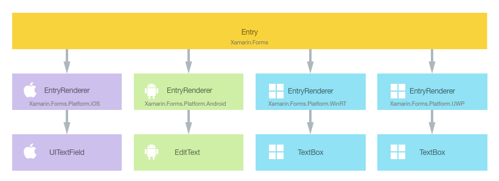
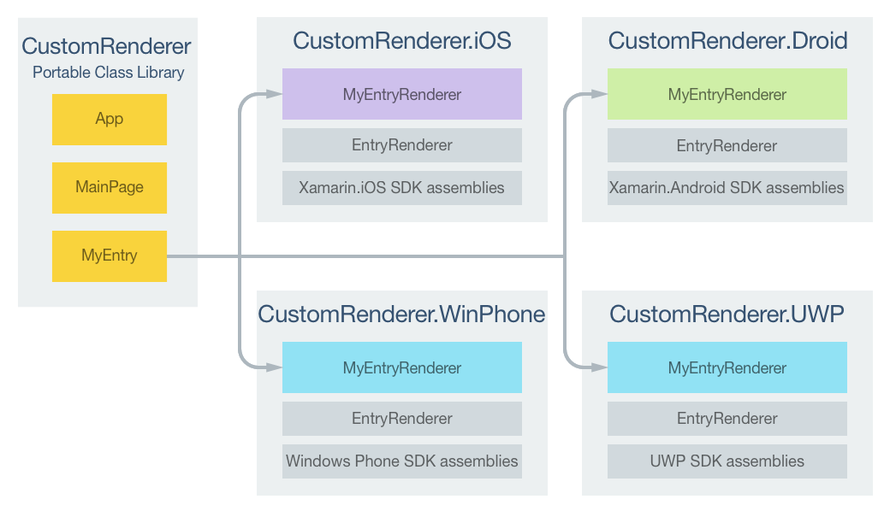
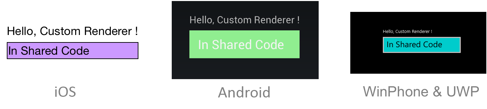

# Customizing an Entry

[ Download the sample](/samples/xamarin/xamarin-forms-samples/customrenderers-entry)

_The Xamarin.Forms Entry control allows a single line of text to be edited. This article demonstrates how to create a custom renderer for the Entry control, enabling developers to override the default native rendering with their own platform-specific customization._

Every Xamarin.Forms control has an accompanying renderer for each platform that creates an instance of a native control. When an [`Entry`](xref:Xamarin.Forms.Entry) control is rendered by a Xamarin.Forms application, in iOS the `EntryRenderer` class is instantiated, which in turns instantiates a native `UITextField` control. On the Android platform, the `EntryRenderer` class instantiates an `EditText` control. On the Universal Windows Platform (UWP), the `EntryRenderer` class instantiates a `TextBox` control. For more information about the renderer and native control classes that Xamarin.Forms controls map to, see [Renderer Base Classes and Native Controls](~/xamarin-forms/app-fundamentals/custom-renderer/renderers.md).

The following diagram illustrates the relationship between the [`Entry`](xref:Xamarin.Forms.Entry) control and the corresponding native controls that implement it:



The rendering process can be taken advantage of to implement platform-specific customizations by creating a custom renderer for the [`Entry`](xref:Xamarin.Forms.Entry) control on each platform. The process for doing this is as follows:

1. [Create](#creating-the-custom-entry-control) a Xamarin.Forms custom control.
1. [Consume](#consuming-the-custom-control) the custom control from Xamarin.Forms.
1. [Create](#creating-the-custom-renderer-on-each-platform) the custom renderer for the control on each platform.

Each item will now be discussed in turn, to implement an [`Entry`](xref:Xamarin.Forms.Entry) control that has a different background color on each platform.

> [!IMPORTANT]
> This article explains how to create a simple custom renderer. However, it's not necessary to create a custom renderer to implement an `Entry` that has a different background color on each platform. This can be more easily accomplished by using the [`Device`](xref:Xamarin.Forms.Device) class, or the `OnPlatform` markup extension, to provide platform-specific values. For more information, see [Providing Platform-Specific Values](~/xamarin-forms/platform/device.md#provide-platform-specific-values) and [OnPlatform Markup Extension](~/xamarin-forms/xaml/markup-extensions/consuming.md#onplatform-markup-extension).

## Creating the Custom Entry Control

A custom [`Entry`](xref:Xamarin.Forms.Entry) control can be created by subclassing the `Entry` control, as shown in the following code example:

```csharp
public class MyEntry : Entry
{
}
```

The `MyEntry` control is created in the .NET Standard library project and is simply an [`Entry`](xref:Xamarin.Forms.Entry) control. Customization of the control will be carried out in the custom renderer, so no additional implementation is required in the `MyEntry` control.

## Consuming the Custom Control

The `MyEntry` control can be referenced in XAML in the .NET Standard library project by declaring a namespace for its location and using the namespace prefix on the control element. The following code example shows how the `MyEntry` control can be consumed by a XAML page:

```xaml
<ContentPage ...
    xmlns:local="clr-namespace:CustomRenderer;assembly=CustomRenderer"
    ...>
    ...
    <local:MyEntry Text="In Shared Code" />
    ...
</ContentPage>
```

The `local` namespace prefix can be named anything. However, the `clr-namespace` and `assembly` values must match the details of the custom control. Once the namespace is declared the prefix is used to reference the custom control.

The following code example shows how the `MyEntry` control can be consumed by a C# page:

```csharp
public class MainPage : ContentPage
{
  public MainPage ()
  {
    Content = new StackLayout {
      Children = {
        new Label {
          Text = "Hello, Custom Renderer !",
        },
        new MyEntry {
          Text = "In Shared Code",
        }
      },
      VerticalOptions = LayoutOptions.CenterAndExpand,
      HorizontalOptions = LayoutOptions.CenterAndExpand,
    };
  }
}
```

This code instantiates a new [`ContentPage`](xref:Xamarin.Forms.ContentPage) object that will display a [`Label`](xref:Xamarin.Forms.Label) and `MyEntry` control centered both vertically and horizontally on the page.

A custom renderer can now be added to each application project to customize the control's appearance on each platform.

## Creating the Custom Renderer on each Platform

The process for creating the custom renderer class is as follows:

1. Create a subclass of the `EntryRenderer` class that renders the native control.
1. Override the `OnElementChanged` method that renders the native control and write logic to customize the control. This method is called when the corresponding Xamarin.Forms control is created.
1. Add an `ExportRenderer` attribute to the custom renderer class to specify that it will be used to render the Xamarin.Forms control. This attribute is used to register the custom renderer with Xamarin.Forms.

> [!NOTE]
> It is optional to provide a custom renderer in each platform project. If a custom renderer isn't registered, then the default renderer for the control's base class will be used.

The following diagram illustrates the responsibilities of each project in the sample application, along with the relationships between them:



The `MyEntry` control is rendered by platform-specific `MyEntryRenderer` classes, which all derive from the `EntryRenderer` class for each platform. This results in each `MyEntry` control being rendered with a platform-specific background color, as shown in the following screenshots:



The `EntryRenderer` class exposes the `OnElementChanged` method, which is called when the Xamarin.Forms control is created to render the corresponding native control. This method takes an `ElementChangedEventArgs` parameter that contains `OldElement` and `NewElement` properties. These properties represent the Xamarin.Forms element that the renderer *was* attached to, and the Xamarin.Forms element that the renderer *is* attached to, respectively. In the sample application the `OldElement` property will be `null` and the `NewElement` property will contain a reference to the `MyEntry` control.

An overridden version of the `OnElementChanged` method in the `MyEntryRenderer` class is the place to perform the native control customization. A typed reference to the native control being used on the platform can be accessed through the `Control` property. In addition, a reference to the Xamarin.Forms control that's being rendered can be obtained through the `Element` property, although it's not used in the sample application.

Each custom renderer class is decorated with an `ExportRenderer` attribute that registers the renderer with Xamarin.Forms. The attribute takes two parameters – the type name of the Xamarin.Forms control being rendered, and the type name of the custom renderer. The `assembly` prefix to the attribute specifies that the attribute applies to the entire assembly.

The following sections discuss the implementation of each platform-specific `MyEntryRenderer` custom renderer class.

### Creating the Custom Renderer on iOS

The following code example shows the custom renderer for the iOS platform:

```csharp
using Xamarin.Forms.Platform.iOS;

[assembly: ExportRenderer (typeof(MyEntry), typeof(MyEntryRenderer))]
namespace CustomRenderer.iOS
{
    public class MyEntryRenderer : EntryRenderer
    {
        protected override void OnElementChanged (ElementChangedEventArgs<Entry> e)
        {
            base.OnElementChanged (e);

            if (Control != null) {
                // do whatever you want to the UITextField here!
                Control.BackgroundColor = UIColor.FromRGB (204, 153, 255);
                Control.BorderStyle = UITextBorderStyle.Line;
            }
        }
    }
}
```

The call to the base class's `OnElementChanged` method instantiates an iOS `UITextField` control, with a reference to the control being assigned to the renderer's `Control` property. The background color is then set to light purple with the `UIColor.FromRGB` method.

### Creating the Custom Renderer on Android

The following code example shows the custom renderer for the Android platform:

```csharp
using Xamarin.Forms.Platform.Android;

[assembly: ExportRenderer(typeof(MyEntry), typeof(MyEntryRenderer))]
namespace CustomRenderer.Android
{
    class MyEntryRenderer : EntryRenderer
    {
        public MyEntryRenderer(Context context) : base(context)
        {
        }

        protected override void OnElementChanged(ElementChangedEventArgs<Entry> e)
        {
            base.OnElementChanged(e);

            if (Control != null)
            {
                Control.SetBackgroundColor(global::Android.Graphics.Color.LightGreen);
            }
        }
    }
}
```

The call to the base class's `OnElementChanged` method instantiates an Android `EditText` control, with a reference to the control being assigned to the renderer's `Control` property. The background color is then set to light green with the `Control.SetBackgroundColor` method.

### Creating the Custom Renderer on UWP

The following code example shows the custom renderer for UWP:

```csharp
[assembly: ExportRenderer(typeof(MyEntry), typeof(MyEntryRenderer))]
namespace CustomRenderer.UWP
{
    public class MyEntryRenderer : EntryRenderer
    {
        protected override void OnElementChanged(ElementChangedEventArgs<Entry> e)
        {
            base.OnElementChanged(e);

            if (Control != null)
            {
                Control.Background = new SolidColorBrush(Colors.Cyan);
            }
        }
    }
}
```

The call to the base class's `OnElementChanged` method instantiates a `TextBox` control, with a reference to the control being assigned to the renderer's `Control` property. The background color is then set to cyan by creating a `SolidColorBrush` instance.

## Summary

This article has demonstrated how to create a custom control renderer for the Xamarin.Forms [`Entry`](xref:Xamarin.Forms.Entry) control, enabling developers to override the default native rendering with their own platform-specific rendering. Custom renderers provide a powerful approach to customizing the appearance of Xamarin.Forms controls. They can be used for small styling changes or sophisticated platform-specific layout and behavior customization.

## Related Links

- [CustomRendererEntry (sample)](/samples/xamarin/xamarin-forms-samples/customrenderers-entry)