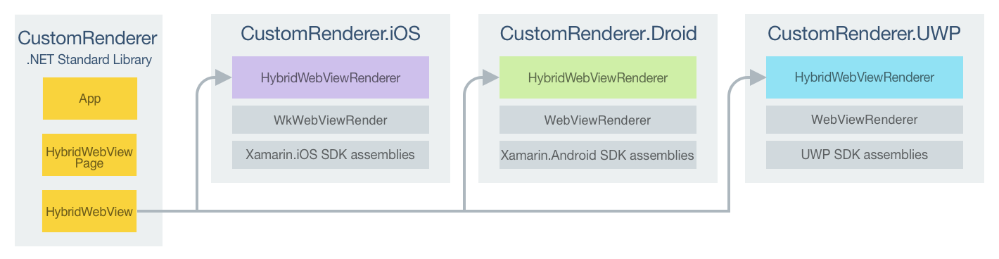

# Implementing a HybridWebView

[ Download the sample](https://developer.xamarin.com/samples/xamarin-forms/customrenderers/hybridwebview/)

_Xamarin.Forms custom user interface controls should derive from the View class, which is used to place layouts and controls on the screen. This article demonstrates how to create a custom renderer for a HybridWebView custom control, which demonstrates how to enhance the platform-specific web controls to allow C# code to be invoked from JavaScript._

Every Xamarin.Forms view has an accompanying renderer for each platform that creates an instance of a native control. When a [`View`](xref:Xamarin.Forms.View) is rendered by a Xamarin.Forms application in iOS, the `ViewRenderer` class is instantiated, which in turn instantiates a native `UIView` control. On the Android platform, the `ViewRenderer` class instantiates a `View` control. On the Universal Windows Platform (UWP), the `ViewRenderer` class instantiates a native `FrameworkElement` control. For more information about the renderer and native control classes that Xamarin.Forms controls map to, see [Renderer Base Classes and Native Controls](~/xamarin-forms/app-fundamentals/custom-renderer/renderers.md).

The following diagram illustrates the relationship between the [`View`](xref:Xamarin.Forms.View) and the corresponding native controls that implement it:


The rendering process can be used to implement platform-specific customizations by creating a custom renderer for a [`View`](xref:Xamarin.Forms.View) on each platform. The process for doing this is as follows:

1. [Create](#Creating_the_HybridWebView) the `HybridWebView` custom control.
1. [Consume](#Consuming_the_HybridWebView) the `HybridWebView`from Xamarin.Forms.
1. [Create](#Creating_the_Custom_Renderer_on_each_Platform) the custom renderer for the `HybridWebView` on each platform.

Each item will now be discussed in turn to implement a `HybridWebView` renderer that enhances the platform-specific web controls to allow C# code to be invoked from JavaScript. The `HybridWebView` instance will be used to display an HTML page that asks the user to enter their name. Then, when the user clicks an HTML button, a JavaScript function will invoke a C# `Action` that displays a pop-up containing the users name.

For more information about the process for invoking C# from JavaScript, see [Invoking C# from JavaScript](#Invoking_C_from_JavaScript). For more information about the HTML page, see [Creating the Web Page](#Creating_the_Web_Page).

<a name="Creating_the_HybridWebView" />

## Creating the HybridWebView

The `HybridWebView` custom control can be created by subclassing the [`View`](xref:Xamarin.Forms.View) class, as shown in the following code example:

```csharp
public class HybridWebView : View
{
  Action<string> action;
  public static readonly BindableProperty UriProperty = BindableProperty.Create (
    propertyName: "Uri",
    returnType: typeof(string),
    declaringType: typeof(HybridWebView),
    defaultValue: default(string));

  public string Uri {
    get { return (string)GetValue (UriProperty); }
    set { SetValue (UriProperty, value); }
  }

  public void RegisterAction (Action<string> callback)
  {
    action = callback;
  }

  public void Cleanup ()
  {
    action = null;
  }

  public void InvokeAction (string data)
  {
    if (action == null || data == null) {
      return;
    }
    action.Invoke (data);
  }
}
```

The `HybridWebView` custom control is created in the .NET Standard library project and defines the following API for the control:

- A `Uri` property that specifies the address of the web page to be loaded.
- A `RegisterAction` method that registers an `Action` with the control. The registered action will be invoked from JavaScript contained in the HTML file referenced through the `Uri` property.
- A `CleanUp` method that removes the reference to the registered `Action`.
- An `InvokeAction` method that invokes the registered `Action`. This method will be called from a custom renderer in each platform-specific project.

<a name="Consuming_the_HybridWebView" />

## Consuming the HybridWebView

The `HybridWebView` custom control can be referenced in XAML in the .NET Standard library project by declaring a namespace for its location and using the namespace prefix on the custom control. The following code example shows how the `HybridWebView` custom control can be consumed by a XAML page:

```xaml
<ContentPage ...
             xmlns:local="clr-namespace:CustomRenderer;assembly=CustomRenderer"
             x:Class="CustomRenderer.HybridWebViewPage"
             Padding="0,20,0,0">
    <ContentPage.Content>
        <local:HybridWebView x:Name="hybridWebView" Uri="index.html"
          HorizontalOptions="FillAndExpand" VerticalOptions="FillAndExpand" />
    </ContentPage.Content>
</ContentPage>
```

The `local` namespace prefix can be named anything. However, the `clr-namespace` and `assembly` values must match the details of the custom control. Once the namespace is declared, the prefix is used to reference the custom control.

The following code example shows how the `HybridWebView` custom control can be consumed by a C# page:

```csharp
public class HybridWebViewPageCS : ContentPage
{
  public HybridWebViewPageCS ()
  {
    var hybridWebView = new HybridWebView {
      Uri = "index.html",
      HorizontalOptions = LayoutOptions.FillAndExpand,
      VerticalOptions = LayoutOptions.FillAndExpand
    };
    ...
    Padding = new Thickness (0, 20, 0, 0);
    Content = hybridWebView;
  }
}
```

The `HybridWebView` instance will be used to display a native web control on each platform. It's `Uri` property is set to an HTML file that is stored in each platform-specific project, and which will be displayed by the native web control. The rendered HTML asks the user to enter their name, with a JavaScript function invoking a C# `Action` in response to an HTML button click.

The `HybridWebViewPage` registers the action to be invoked from JavaScript, as shown in the following code example:

```csharp
public partial class HybridWebViewPage : ContentPage
{
  public HybridWebViewPage ()
  {
    ...
    hybridWebView.RegisterAction (data => DisplayAlert ("Alert", "Hello " + data, "OK"));
  }
}
```

This action calls the [`DisplayAlert`](xref:Xamarin.Forms.Page.DisplayAlert(System.String,System.String,System.String)) method to display a modal pop-up that presents the name entered in the HTML page displayed by the `HybridWebView` instance.

A custom renderer can now be added to each application project to enhance the platform-specific web controls by allowing C# code to be invoked from JavaScript.

<a nane="Creating_the_Custom_Renderer_on_each_Platform" />

## Creating the Custom Renderer on each Platform

The process for creating the custom renderer class is as follows:

1. Create a subclass of the `ViewRenderer<T1,T2>` class that renders the custom control. The first type argument should be the custom control the renderer is for, in this case `HybridWebView`. The second type argument should be the native control that will implement the custom view.
1. Override the `OnElementChanged` method that renders the custom control and write logic to customize it. This method is called when the corresponding Xamarin.Forms custom control is created.
1. Add an `ExportRenderer` attribute to the custom renderer class to specify that it will be used to render the Xamarin.Forms custom control. This attribute is used to register the custom renderer with Xamarin.Forms.

> [!NOTE]
> For most Xamarin.Forms elements, it is optional to provide a custom renderer in each platform project. If a custom renderer isn't registered, then the default renderer for the control's base class will be used. However, custom renderers are required in each platform project when rendering a [View](xref:Xamarin.Forms.View) element.

The following diagram illustrates the responsibilities of each project in the sample application, along with the relationships between them:



The `HybridWebView` custom control is rendered by platform-specific renderer classes, which all derive from the `ViewRenderer` class for each platform. This results in each `HybridWebView` custom control being rendered with platform-specific web controls, as shown in the following screenshots:


The `ViewRenderer` class exposes the `OnElementChanged` method, which is called when the Xamarin.Forms custom control is created to render the corresponding native web control. This method takes an `ElementChangedEventArgs` parameter that contains `OldElement` and `NewElement` properties. These properties represent the Xamarin.Forms element that the renderer *was* attached to, and the Xamarin.Forms element that the renderer *is* attached to, respectively. In the sample application the `OldElement` property will be `null` and the `NewElement` property will contain a reference to the `HybridWebView` instance.

An overridden version of the `OnElementChanged` method, in each platform-specific renderer class, is the place to perform the native web control instantiation and customization. The `SetNativeControl` method should be used to instantiate the native web control, and this method will also assign the control reference to the `Control` property. In addition, a reference to the Xamarin.Forms control that's being rendered can be obtained through the `Element` property.

In some circumstances the `OnElementChanged` method can be called multiple times. Therefore, to prevent memory leaks, care must be taken when instantiating a new native control. The approach to use when instantiating a new native control in a custom renderer is shown in the following code example:

```csharp
protected override void OnElementChanged (ElementChangedEventArgs<NativeListView> e)
{
  base.OnElementChanged (e);

  if (Control == null) {
    // Instantiate the native control and assign it to the Control property with
    // the SetNativeControl method
  }

  if (e.OldElement != null) {
    // Unsubscribe from event handlers and cleanup any resources
  }

  if (e.NewElement != null) {
    // Configure the control and subscribe to event handlers
  }
}
```

A new native control should only be instantiated once, when the `Control` property is `null`. The control should only be configured and event handlers subscribed to when the custom renderer is attached to a new Xamarin.Forms element. Similarly, any event handlers that were subscribed to should only be unsubscribed from when the element the renderer is attached to changes. Adopting this approach will help to create a performant custom renderer that doesn't suffer from memory leaks.

Each custom renderer class is decorated with an `ExportRenderer` attribute that registers the renderer with Xamarin.Forms. The attribute takes two parameters – the type name of the Xamarin.Forms custom control being rendered, and the type name of the custom renderer. The `assembly` prefix to the attribute specifies that the attribute applies to the entire assembly.

The following sections discuss the structure of the web page loaded by each native web control, the process for invoking C# from JavaScript, and the implementation of this in each platform-specific custom renderer class.

<a name="Creating_the_Web_Page" />

### Creating the Web Page

The following code example shows the web page that will be displayed by the `HybridWebView` custom control:

```html
<html>
<body>
<script src="http://code.jquery.com/jquery-1.11.0.min.js"></script>
<h1>HybridWebView Test</h1>
<br/>
Enter name: <input type="text" id="name">
<br/>
<br/>
<button type="button" onclick="javascript:invokeCSCode($('#name').val());">Invoke C# Code</button>
<br/>
<p id="result">Result:</p>
<script type="text/javascript">
function log(str)
{
    $('#result').text($('#result').text() + " " + str);
}

function invokeCSCode(data) {
    try {
        log("Sending Data:" + data);
        invokeCSharpAction(data);
    }
    catch (err){
          log(err);
    }
}
</script>
</body>
</html>
```

The web page allows a user to enter their name in an `input` element, and provides a `button` element that will invoke C# code when clicked. The process for achieving this is as follows:

- When the user clicks on the `button` element, the `invokeCSCode` JavaScript function is called, with the value of the `input` element being passed to the function.
- The `invokeCSCode` function calls the `log` function to display the data it is sending to the C# `Action`. It then calls the `invokeCSharpAction` method to invoke the C# `Action`, passing the parameter received from the `input` element.

The `invokeCSharpAction` JavaScript function is not defined in the web page, and will be injected into it by each custom renderer.

<a name="Invoking_C_from_JavaScript" />

### Invoking C# from JavaScript

The process for invoking C# from JavaScript is identical on each platform:

- The custom renderer creates a native web control and loads the HTML file specified by the `HybridWebView.Uri` property.
- Once the web page is loaded, the custom renderer injects the `invokeCSharpAction` JavaScript function into the web page.
- When the user enters their name and clicks on the HTML `button` element, the `invokeCSCode` function is invoked, which in turn invokes the `invokeCSharpAction` function.
- The `invokeCSharpAction` function invokes a method in the custom renderer, which in turn invokes the `HybridWebView.InvokeAction` method.
- The `HybridWebView.InvokeAction` method invokes the registered `Action`.

The following sections will discuss how this process is implemented on each platform.

### Creating the Custom Renderer on iOS

The following code example shows the custom renderer for the iOS platform:

```csharp
[assembly: ExportRenderer (typeof(HybridWebView), typeof(HybridWebViewRenderer))]
namespace CustomRenderer.iOS
{
    public class HybridWebViewRenderer : ViewRenderer<HybridWebView, WKWebView>, IWKScriptMessageHandler
    {
        const string JavaScriptFunction = "function invokeCSharpAction(data){window.webkit.messageHandlers.invokeAction.postMessage(data);}";
        WKUserContentController userController;

        protected override void OnElementChanged (ElementChangedEventArgs<HybridWebView> e)
        {
            base.OnElementChanged (e);

            if (Control == null) {
                userController = new WKUserContentController ();
                var script = new WKUserScript (new NSString (JavaScriptFunction), WKUserScriptInjectionTime.AtDocumentEnd, false);
                userController.AddUserScript (script);
                userController.AddScriptMessageHandler (this, "invokeAction");

                var config = new WKWebViewConfiguration { UserContentController = userController };
                var webView = new WKWebView (Frame, config);
                SetNativeControl (webView);
            }
            if (e.OldElement != null) {
                userController.RemoveAllUserScripts ();
                userController.RemoveScriptMessageHandler ("invokeAction");
                var hybridWebView = e.OldElement as HybridWebView;
                hybridWebView.Cleanup ();
            }
            if (e.NewElement != null) {
                string fileName = Path.Combine (NSBundle.MainBundle.BundlePath, string.Format ("Content/{0}", Element.Uri));
                Control.LoadRequest (new NSUrlRequest (new NSUrl (fileName, false)));
            }
        }

        public void DidReceiveScriptMessage (WKUserContentController userContentController, WKScriptMessage message)
        {
            Element.InvokeAction (message.Body.ToString ());
        }
    }
}
```

The `HybridWebViewRenderer` class loads the web page specified in the `HybridWebView.Uri` property into a native [`WKWebView`](xref:WebKit.WKWebView) control, and the `invokeCSharpAction` JavaScript function is injected into the web page. Once the user enters their name and clicks the HTML `button` element, the `invokeCSharpAction` JavaScript function is executed, with the `DidReceiveScriptMessage` method being called after a message is received from the web page. In turn, this method invokes the `HybridWebView.InvokeAction` method, which will invoke the registered action to display the pop-up.

This functionality is achieved as follows:

- Provided that the `Control` property is `null`, the following operations are carried out:
  - A [`WKUserContentController`](xref:WebKit.WKUserContentController) instance is created, which allows posting messages and injecting user scripts into a web page.
  - A [`WKUserScript`](xref:WebKit.WKUserScript) instance is created to inject the `invokeCSharpAction` JavaScript function into the web page after the web page is loaded.
  - The [`WKUserContentController.AddUserScript`](xref:WebKit.WKUserContentController.AddUserScript(WebKit.WKUserScript)) method adds the [`WKUserScript`](xref:WebKit.WKUserScript) instance to the content controller.
  - The [`WKUserContentController.AddScriptMessageHandler`](xref:WebKit.WKUserContentController.AddScriptMessageHandler(WebKit.IWKScriptMessageHandler,System.String)) method adds a script message handler named `invokeAction` to the [`WKUserContentController`](xref:WebKit.WKUserContentController) instance, which will cause the JavaScript function `window.webkit.messageHandlers.invokeAction.postMessage(data)` to be defined in all frames in all web views that will use the `WKUserContentController` instance.
  - A [`WKWebViewConfiguration`](xref:WebKit.WKWebViewConfiguration) instance is created, with the [`WKUserContentController`](xref:WebKit.WKUserContentController)  instance being set as the content controller.
  - A [`WKWebView`](xref:WebKit.WKWebView) control is instantiated, and the `SetNativeControl` method is called to assign a reference to the `WKWebView` control to the `Control` property.
- Provided that the custom renderer is attached to a new Xamarin.Forms element:
  - The [`WKWebView.LoadRequest`](xref:WebKit.WKWebView.LoadRequest(Foundation.NSUrlRequest)) method loads the HTML file that's specified by the `HybridWebView.Uri` property. The code specifies that the file is stored in the `Content` folder of the project. Once the web page is displayed, the `invokeCSharpAction` JavaScript function will be injected into the web page.
- When the element the renderer is attached to changes:
  - Resources are released.

> [!NOTE]
> The `WKWebView` class is only supported in iOS 8 and later.

### Creating the Custom Renderer on Android

The following code example shows the custom renderer for the Android platform:

```csharp
[assembly: ExportRenderer(typeof(HybridWebView), typeof(HybridWebViewRenderer))]
namespace CustomRenderer.Droid
{
    public class HybridWebViewRenderer : ViewRenderer<HybridWebView, Android.Webkit.WebView>
    {
        const string JavascriptFunction = "function invokeCSharpAction(data){jsBridge.invokeAction(data);}";
        Context _context;

        public HybridWebViewRenderer(Context context) : base(context)
        {
            _context = context;
        }

        protected override void OnElementChanged(ElementChangedEventArgs<HybridWebView> e)
        {
            base.OnElementChanged(e);

            if (Control == null)
            {
                var webView = new Android.Webkit.WebView(_context);
                webView.Settings.JavaScriptEnabled = true;
                webView.SetWebViewClient(new JavascriptWebViewClient($"javascript: {JavascriptFunction}"));
                SetNativeControl(webView);
            }
            if (e.OldElement != null)
            {
                Control.RemoveJavascriptInterface("jsBridge");
                var hybridWebView = e.OldElement as HybridWebView;
                hybridWebView.Cleanup();
            }
            if (e.NewElement != null)
            {
                Control.AddJavascriptInterface(new JSBridge(this), "jsBridge");
                Control.LoadUrl($"file:///android_asset/Content/{Element.Uri}");
            }
        }
    }
}
```

The `HybridWebViewRenderer` class loads the web page specified in the `HybridWebView.Uri` property into a native [`WebView`](https://developer.xamarin.com/api/type/Android.Webkit.WebView/) control, and the `invokeCSharpAction` JavaScript function is injected into the web page, after the web page has finished loading, with the `OnPageFinished` override in the `JavascriptWebViewClient` class:

```csharp
public class JavascriptWebViewClient : WebViewClient
{
    string _javascript;

    public JavascriptWebViewClient(string javascript)
    {
        _javascript = javascript;
    }

    public override void OnPageFinished(WebView view, string url)
    {
        base.OnPageFinished(view, url);
        view.EvaluateJavascript(_javascript, null);
    }
}
```

Once the user enters their name and clicks the HTML `button` element, the `invokeCSharpAction` JavaScript function is executed. This functionality is achieved as follows:

- Provided that the `Control` property is `null`, the following operations are carried out:
  - A native [`WebView`](https://developer.xamarin.com/api/type/Android.Webkit.WebView/) instance is created, JavaScript is enabled in the control, and a `JavascriptWebViewClient` instance is set as the implementation of `WebViewClient`.
  - The `SetNativeControl` method is called to assign a reference to the native [`WebView`](https://developer.xamarin.com/api/type/Android.Webkit.WebView/) control to the `Control` property.
- Provided that the custom renderer is attached to a new Xamarin.Forms element:
  - The [`WebView.AddJavascriptInterface`](https://developer.xamarin.com/api/member/Android.Webkit.WebView.AddJavascriptInterface/p/Java.Lang.Object/System.String/) method injects a new `JSBridge` instance into the main frame of the WebView's JavaScript context, naming it `jsBridge`. This allows methods in the `JSBridge` class to be accessed from JavaScript.
  - The [`WebView.LoadUrl`](https://developer.xamarin.com/api/member/Android.Webkit.WebView.LoadUrl/p/System.String/) method loads the HTML file that's specified by the `HybridWebView.Uri` property. The code specifies that the file is stored in the `Content` folder of the project.
  - In the `JavascriptWebViewClient` class, the `invokeCSharpAction` JavaScript function is injected into the web page once the page has finished loading.
- When the element the renderer is attached to changes:
  - Resources are released.

When the `invokeCSharpAction` JavaScript function is executed, it in turn invokes the `JSBridge.InvokeAction` method, which is shown in the following code example:

```csharp
public class JSBridge : Java.Lang.Object
{
  readonly WeakReference<HybridWebViewRenderer> hybridWebViewRenderer;

  public JSBridge (HybridWebViewRenderer hybridRenderer)
  {
    hybridWebViewRenderer = new WeakReference <HybridWebViewRenderer> (hybridRenderer);
  }

  [JavascriptInterface]
  [Export ("invokeAction")]
  public void InvokeAction (string data)
  {
    HybridWebViewRenderer hybridRenderer;

    if (hybridWebViewRenderer != null && hybridWebViewRenderer.TryGetTarget (out hybridRenderer))
    {
      hybridRenderer.Element.InvokeAction (data);
    }
  }
}
```

The class must derive from `Java.Lang.Object`, and methods that are exposed to JavaScript must be decorated with the `[JavascriptInterface]` and `[Export]` attributes. Therefore, when the `invokeCSharpAction` JavaScript function is injected into the web page and is executed, it will call the `JSBridge.InvokeAction` method due to being decorated with the `[JavascriptInterface]` and `[Export("invokeAction")]` attributes. In turn, the `InvokeAction` method invokes the `HybridWebView.InvokeAction` method, which will invoked the registered action to display the pop-up.

> [!NOTE]
> Projects that use the `[Export]` attribute must include a reference to `Mono.Android.Export`, or a compiler error will result.

Note that the `JSBridge` class maintains a `WeakReference` to the `HybridWebViewRenderer` class. This is to avoid creating a circular reference between the two classes. For more information see [Weak References](https://msdn.microsoft.com/library/ms404247(v=vs.110).aspx) on MSDN.

### Creating the Custom Renderer on UWP

The following code example shows the custom renderer for UWP:

```csharp
[assembly: ExportRenderer(typeof(HybridWebView), typeof(HybridWebViewRenderer))]
namespace CustomRenderer.UWP
{
    public class HybridWebViewRenderer : ViewRenderer<HybridWebView, Windows.UI.Xaml.Controls.WebView>
    {
        const string JavaScriptFunction = "function invokeCSharpAction(data){window.external.notify(data);}";

        protected override void OnElementChanged(ElementChangedEventArgs<HybridWebView> e)
        {
            base.OnElementChanged(e);

            if (Control == null)
            {
                SetNativeControl(new Windows.UI.Xaml.Controls.WebView());
            }
            if (e.OldElement != null)
            {
                Control.NavigationCompleted -= OnWebViewNavigationCompleted;
                Control.ScriptNotify -= OnWebViewScriptNotify;
            }
            if (e.NewElement != null)
            {
                Control.NavigationCompleted += OnWebViewNavigationCompleted;
                Control.ScriptNotify += OnWebViewScriptNotify;
                Control.Source = new Uri(string.Format("ms-appx-web:///Content//{0}", Element.Uri));
            }
        }

        async void OnWebViewNavigationCompleted(WebView sender, WebViewNavigationCompletedEventArgs args)
        {
            if (args.IsSuccess)
            {
                // Inject JS script
                await Control.InvokeScriptAsync("eval", new[] { JavaScriptFunction });
            }
        }

        void OnWebViewScriptNotify(object sender, NotifyEventArgs e)
        {
            Element.InvokeAction(e.Value);
        }
    }
}
```

The `HybridWebViewRenderer` class loads the web page specified in the `HybridWebView.Uri` property into a native `WebView` control, and the `invokeCSharpAction` JavaScript function is injected into the web page, after the web page has loaded, with the `WebView.InvokeScriptAsync` method. Once the user enters their name and clicks the HTML `button` element, the `invokeCSharpAction` JavaScript function is executed, with the `OnWebViewScriptNotify` method being called after a notification is received from the web page. In turn, this method invokes the `HybridWebView.InvokeAction` method, which will invoke the registered action to display the pop-up.

This functionality is achieved as follows:

- Provided that the `Control` property is `null`, the following operations are carried out:
  - The `SetNativeControl` method is called to instantiate a new native `WebView` control and assign a reference to it to the `Control` property.
- Provided that the custom renderer is attached to a new Xamarin.Forms element:
  - Event handlers for the `NavigationCompleted` and `ScriptNotify` events are registered. The `NavigationCompleted` event fires when either the native `WebView` control has finished loading the current content or if navigation has failed. The `ScriptNotify` event fires when the content in the native `WebView` control uses JavaScript to pass a string to the application. The web page fires the `ScriptNotify` event by calling `window.external.notify` while passing a `string` parameter.
  - The `WebView.Source` property is set to the URI of the HTML file that's specified by the `HybridWebView.Uri` property. The code assumes that the file is stored in the `Content` folder of the project. Once the web page is displayed, the `NavigationCompleted` event will fire and the `OnWebViewNavigationCompleted` method will be invoked. The `invokeCSharpAction` JavaScript function will then be injected into the web page with the `WebView.InvokeScriptAsync` method, provided that the navigation completed successfully.
- When the element the renderer is attached to changes:
  - Events are unsubscribed from.

## Summary

This article has demonstrated how to create a custom renderer for a `HybridWebView` custom control, that demonstrates how to enhance the platform-specific web controls to allow C# code to be invoked from JavaScript.


## Related Links

- [CustomRendererHybridWebView (sample)](https://developer.xamarin.com/samples/xamarin-forms/customrenderers/hybridwebview/)
- [Call C# from JavaScript](https://github.com/xamarin/recipes/tree/master/Recipes/android/controls/webview/call_csharp_from_javascript)
