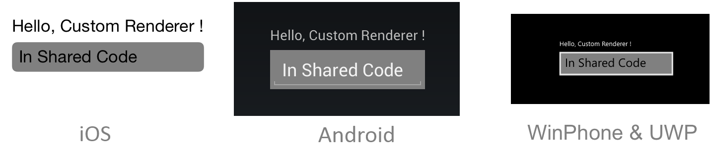

# Introduction to Custom Renderers

_Custom renderers provide a powerful approach for customizing the appearance and behavior of Xamarin.Forms controls. They can be used for small styling changes or sophisticated platform-specific layout and behavior customization. This article provides an introduction to custom renderers, and outlines the process for creating a custom renderer._

Xamarin.Forms [Pages, Layouts and Controls](~/xamarin-forms/user-interface/controls/index.md) present a common API to describe cross-platform mobile user interfaces. Each page, layout, and control is rendered differently on each platform, using a `Renderer` class that in turn creates a native control (corresponding to the Xamarin.Forms representation), arranges it on the screen, and adds the behavior specified in the shared code.

Developers can implement their own custom `Renderer` classes to customize the appearance and/or behavior of a control. Custom renderers for a given type can be added to one application project to customize the control in one place while allowing the default behavior on other platforms; or different custom renderers can be added to each application project to create a different look and feel on iOS, Android, and the Universal Windows Platform (UWP). However, implementing a custom renderer class to perform a simple control customization is often a heavy-weight response. Effects simplify this process, and are typically used for small styling changes. For more information, see [Effects](~/xamarin-forms/app-fundamentals/effects/index.md).

## Examining Why Custom Renderers are Necessary

Changing the appearance of a Xamarin.Forms control, without using a custom renderer, is a two-step process that involves creating a custom control through subclassing, and then consuming the custom control in place of the original control. The following code example shows an example of subclassing the `Entry` control:

```csharp
public class MyEntry : Entry
{
  public MyEntry ()
  {
    BackgroundColor = Color.Gray;
  }
}
```

The `MyEntry` control is an `Entry` control where the `BackgroundColor` is set to gray, and can be referenced in Xaml by declaring a namespace for its location and using the namespace prefix on the control element. The following code example shows how the `MyEntry` custom control can be consumed by a `ContentPage`:

```xaml
<ContentPage
    ...
    xmlns:local="clr-namespace:CustomRenderer;assembly=CustomRenderer"
    ...>
    ...
    <local:MyEntry Text="In Shared Code" />
    ...
</ContentPage>
```

The `local` namespace prefix can be anything. However, the `namespace` and `assembly` values must match the details of the custom control. Once the namespace is declared, the prefix is used to reference the custom control.

> [!NOTE]
> Defining the `xmlns` is much simpler in .NET Standard library projects than Shared Projects. A .NET Standard library is compiled into an assembly so it's easy to determine what the `assembly=CustomRenderer` value should be. When using Shared Projects, all the shared assets (including the XAML) are compiled into each of the referencing projects, which means that if the iOS, Android, and UWP projects have their own *assembly names* it is impossible to write the `xmlns` declaration because the value needs to be different for each application. Custom controls in XAML for Shared Projects will require every application project to be configured with the same assembly name.

The `MyEntry` custom control is then rendered on each platform, with a gray background, as shown in the following screenshots:



Changing the background color of the control on each platform has been accomplished purely through subclassing the control. However, this technique is limited in what it can achieve as it is not possible to take advantage of platform-specific enhancements and customizations. When they are required, custom renderers must be implemented.

## Creating a Custom Renderer Class

The process for creating a custom renderer class is as follows:

1. Create a subclass of the renderer class that renders the native control.
1. Override the method that renders the native control and write logic to customize the control. Often, the `OnElementChanged` method is used to render the native control, which is called when the corresponding Xamarin.Forms control is created.
1. Add an `ExportRenderer` attribute to the custom renderer class to specify that it will be used to render the Xamarin.Forms control. This attribute is used to register the custom renderer with Xamarin.Forms.

> [!NOTE]
> For most Xamarin.Forms elements, it is optional to provide a custom renderer in each platform project. If a custom renderer isn't registered, then the default renderer for the control's base class will be used. However, custom renderers are required in each platform project when rendering a [View](xref:Xamarin.Forms.View) or [ViewCell](xref:Xamarin.Forms.ViewCell) element.

The topics in this series will provide demonstrations and explanations of this process for different Xamarin.Forms elements.

## Troubleshooting

If a custom control is contained in a .NET Standard library project that's been added to the solution (i.e. not the .NET Standard library created by the Visual Studio for Mac/Visual Studio Xamarin.Forms App project template), an exception may occur in iOS when attempting to access the custom control. If this issue occurs it can be resolved by creating a reference to the custom control from the `AppDelegate` class:

```csharp
var temp = new ClassInPCL(); // in AppDelegate, but temp not used anywhere
```

This forces the compiler to recognize the `ClassInPCL` type by resolving it. Alternatively, the `Preserve` attribute can be added to the `AppDelegate` class to achieve the same result:

```csharp
[assembly: Preserve (typeof (ClassInPCL))]
```

This creates a reference to the `ClassInPCL` type, indicating that it's required at runtime. For more information, see [Preserving Code](~/ios/deploy-test/linker.md).

## Summary

This article has provided an introduction to custom renderers, and has outlined the process for creating a custom renderer. Custom renderers provide a powerful approach for customizing the appearance and behavior of Xamarin.Forms controls. They can be used for small styling changes or sophisticated platform-specific layout and behavior customization.

## Related Links

- [Effects](~/xamarin-forms/app-fundamentals/effects/index.md)
