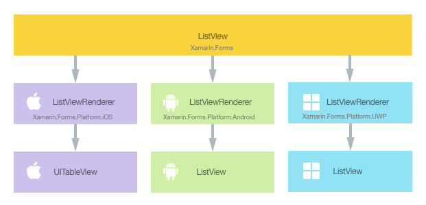
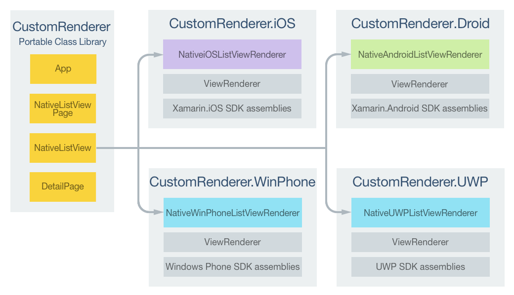
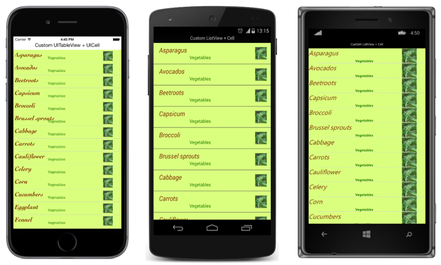

# Customizing a ListView

[ Download the sample](/samples/xamarin/xamarin-forms-samples/customrenderers-listview)

_A Xamarin.Forms ListView is a view that displays a collection of data as a vertical list. This article demonstrates how to create a custom renderer that encapsulates platform-specific list controls and native cell layouts, allowing more control over native list control performance._

Every Xamarin.Forms view has an accompanying renderer for each platform that creates an instance of a native control. When a [`ListView`](xref:Xamarin.Forms.ListView) is rendered by a Xamarin.Forms application, in iOS the `ListViewRenderer` class is instantiated, which in turn instantiates a native `UITableView` control. On the Android platform, the `ListViewRenderer` class instantiates a native `ListView` control. On the Universal Windows Platform (UWP), the `ListViewRenderer` class instantiates a native `ListView` control. For more information about the renderer and native control classes that Xamarin.Forms controls map to, see [Renderer Base Classes and Native Controls](~/xamarin-forms/app-fundamentals/custom-renderer/renderers.md).

The following diagram illustrates the relationship between the [`ListView`](xref:Xamarin.Forms.ListView) control and the corresponding native controls that implement it:



The rendering process can be taken advantage of to implement platform-specific customizations by creating a custom renderer for a [`ListView`](xref:Xamarin.Forms.ListView) on each platform. The process for doing this is as follows:

1. [Create](#creating-the-custom-listview-control) a Xamarin.Forms custom control.
1. [Consume](#consuming-the-custom-control) the custom control from Xamarin.Forms.
1. [Create](#creating-the-custom-renderer-on-each-platform) the custom renderer for the control on each platform.

Each item will now be discussed in turn, to implement a `NativeListView` renderer that takes advantage of platform-specific list controls and native cell layouts. This scenario is useful when porting an existing native app that contains list and cell code that can be re-used. In addition, it allows detailed customization of list control features that can affect performance, such as data virtualization.

## Creating the Custom ListView Control

A custom [`ListView`](xref:Xamarin.Forms.ListView) control can be created by subclassing the `ListView` class, as shown in the following code example:

```csharp
public class NativeListView : ListView
{
  public static readonly BindableProperty ItemsProperty =
    BindableProperty.Create ("Items", typeof(IEnumerable<DataSource>), typeof(NativeListView), new List<DataSource> ());

  public IEnumerable<DataSource> Items {
    get { return (IEnumerable<DataSource>)GetValue (ItemsProperty); }
    set { SetValue (ItemsProperty, value); }
  }

  public event EventHandler<SelectedItemChangedEventArgs> ItemSelected;

  public void NotifyItemSelected (object item)
  {
    if (ItemSelected != null) {
      ItemSelected (this, new SelectedItemChangedEventArgs (item));
    }
  }
}
```

The `NativeListView` is created in the .NET Standard library project and defines the API for the custom control. This control exposes an `Items` property that is used for populating the `ListView` with data, and which can be data bound to for display purposes. It also exposes an `ItemSelected` event that will be fired whenever an item is selected in a platform-specific native list control. For more information about data binding, see [Data Binding Basics](~/xamarin-forms/xaml/xaml-basics/data-binding-basics.md).

## Consuming the Custom Control

The `NativeListView` custom control can be referenced in Xaml in the .NET Standard library project by declaring a namespace for its location and using the namespace prefix on the control. The following code example shows how the `NativeListView` custom control can be consumed by a XAML page:

```xaml
<ContentPage ...
    xmlns:local="clr-namespace:CustomRenderer;assembly=CustomRenderer"
    ...>
    ...
    <ContentPage.Content>
          <Grid>
            <Grid.RowDefinitions>
              <RowDefinition Height="Auto"/>
              <RowDefinition Height="*" />
            </Grid.RowDefinitions>
          <Label Text="{x:Static local:App.Description}" HorizontalTextAlignment="Center" />
            <local:NativeListView Grid.Row="1" x:Name="nativeListView" ItemSelected="OnItemSelected" VerticalOptions="FillAndExpand" />
          </Grid>
      </ContentPage.Content>
</ContentPage>
```

The `local` namespace prefix can be named anything. However, the `clr-namespace` and `assembly` values must match the details of the custom control. Once the namespace is declared, the prefix is used to reference the custom control.

The following code example shows how the `NativeListView` custom control can be consumed by a C# page:

```csharp
public class MainPageCS : ContentPage
{
    NativeListView nativeListView;

    public MainPageCS()
    {
        nativeListView = new NativeListView
        {
            Items = DataSource.GetList(),
            VerticalOptions = LayoutOptions.FillAndExpand
        };

        switch (Device.RuntimePlatform)
        {
            case Device.iOS:
                Padding = new Thickness(0, 20, 0, 0);
                break;
            case Device.Android:
            case Device.UWP:
                Padding = new Thickness(0);
                break;
        }

        Content = new Grid
        {
            RowDefinitions = {
                new RowDefinition { Height = GridLength.Auto },
                new RowDefinition { Height = new GridLength (1, GridUnitType.Star) }
            },
            Children = {
                new Label { Text = App.Description, HorizontalTextAlignment = TextAlignment.Center },
                nativeListView
            }
        };
        nativeListView.ItemSelected += OnItemSelected;
    }
    ...
}
```

The `NativeListView` custom control uses platform-specific custom renderers to display a list of data, which is populated through the `Items` property. Each row in the list contains three items of data – a name, a category, and an image filename. The layout of each row in the list is defined by the platform-specific custom renderer.

> [!NOTE]
> Because the `NativeListView` custom control will be rendered using platform-specific list controls that include scrolling ability, the custom control should not be hosted in scrollable layout controls such as the [`ScrollView`](xref:Xamarin.Forms.ScrollView).

A custom renderer can now be added to each application project to create platform-specific list controls and native cell layouts.

## Creating the Custom Renderer on each Platform

The process for creating the custom renderer class is as follows:

1. Create a subclass of the `ListViewRenderer` class that renders the custom control.
1. Override the `OnElementChanged` method that renders the custom control and write logic to customize it. This method is called when the corresponding Xamarin.Forms [`ListView`](xref:Xamarin.Forms.ListView) is created.
1. Add an `ExportRenderer` attribute to the custom renderer class to specify that it will be used to render the Xamarin.Forms custom control. This attribute is used to register the custom renderer with Xamarin.Forms.

> [!NOTE]
> It is optional to provide a custom renderer in each platform project. If a custom renderer isn't registered, then the default renderer for the cell's base class will be used.

The following diagram illustrates the responsibilities of each project in the sample application, along with the relationships between them:



The `NativeListView` custom control is rendered by platform-specific renderer classes, which all derive from the `ListViewRenderer` class for each platform. This results in each `NativeListView` custom control being rendered with platform-specific list controls and native cell layouts, as shown in the following screenshots:



The `ListViewRenderer` class exposes the `OnElementChanged` method, which is called when the Xamarin.Forms custom control is created to render the corresponding native control. This method takes an `ElementChangedEventArgs` parameter, that contains `OldElement` and `NewElement` properties. These properties represent the Xamarin.Forms element that the renderer *was* attached to, and the Xamarin.Forms element that the renderer *is* attached to, respectively. In the sample application, the `OldElement` property will be `null` and the `NewElement` property will contain a reference to the `NativeListView` instance.

An overridden version of the `OnElementChanged` method, in each platform-specific renderer class, is the place to perform the native control customization. A typed reference to the native control being used on the platform can be accessed through the `Control` property. In addition, a reference to the Xamarin.Forms control that's being rendered can be obtained through the `Element` property.

Care must be taken when subscribing to event handlers in the `OnElementChanged` method, as demonstrated in the following code example:

```csharp
protected override void OnElementChanged (ElementChangedEventArgs<Xamarin.Forms.ListView> e)
{
  base.OnElementChanged (e);

  if (e.OldElement != null) {
    // Unsubscribe from event handlers and cleanup any resources
  }

  if (e.NewElement != null) {
    // Configure the native control and subscribe to event handlers
  }
}
```

The native control should only be configured and event handlers subscribed to when the custom renderer is attached to a new Xamarin.Forms element. Similarly, any event handlers that were subscribed to should be unsubscribed from only when the element the renderer is attached to changes. Adopting this approach will help to create a custom renderer that doesn't suffer from memory leaks.

An overridden version of the `OnElementPropertyChanged` method, in each platform-specific renderer class, is the place to respond to bindable property changes on the Xamarin.Forms custom control. A check for the property that's changed should always be made, as this override can be called many times.

Each custom renderer class is decorated with an `ExportRenderer` attribute that registers the renderer with Xamarin.Forms. The attribute takes two parameters – the type name of the Xamarin.Forms custom control being rendered, and the type name of the custom renderer. The `assembly` prefix to the attribute specifies that the attribute applies to the entire assembly.

The following sections discuss the implementation of each platform-specific custom renderer class.

### Creating the Custom Renderer on iOS

The following code example shows the custom renderer for the iOS platform:

```csharp
[assembly: ExportRenderer (typeof(NativeListView), typeof(NativeiOSListViewRenderer))]
namespace CustomRenderer.iOS
{
    public class NativeiOSListViewRenderer : ListViewRenderer
    {
        protected override void OnElementChanged (ElementChangedEventArgs<Xamarin.Forms.ListView> e)
        {
            base.OnElementChanged (e);

            if (e.OldElement != null) {
                // Unsubscribe
            }

            if (e.NewElement != null) {
                Control.Source = new NativeiOSListViewSource (e.NewElement as NativeListView);
            }
        }
    }
}
```

The `UITableView` control is configured by creating an instance of the `NativeiOSListViewSource` class, provided that the custom renderer is attached to a new Xamarin.Forms element. This class provides data to the `UITableView` control by overriding the `RowsInSection` and `GetCell` methods from the `UITableViewSource` class, and by exposing an `Items` property that contains the list of data to be displayed. The class also provides a `RowSelected` method override that invokes the `ItemSelected` event provided by the `NativeListView` custom control. For more information about the method overrides, see [Subclassing UITableViewSource](~/ios/user-interface/controls/tables/populating-a-table-with-data.md). The `GetCell` method returns a `UITableCellView` that's populated with data for each row in the list, and is shown in the following code example:

```csharp
public override UITableViewCell GetCell (UITableView tableView, NSIndexPath indexPath)
{
  // request a recycled cell to save memory
  NativeiOSListViewCell cell = tableView.DequeueReusableCell (cellIdentifier) as NativeiOSListViewCell;

  // if there are no cells to reuse, create a new one
  if (cell == null) {
    cell = new NativeiOSListViewCell (cellIdentifier);
  }

  if (String.IsNullOrWhiteSpace (tableItems [indexPath.Row].ImageFilename)) {
    cell.UpdateCell (tableItems [indexPath.Row].Name
      , tableItems [indexPath.Row].Category
      , null);
  } else {
    cell.UpdateCell (tableItems [indexPath.Row].Name
      , tableItems [indexPath.Row].Category
      , UIImage.FromFile ("Images/" + tableItems [indexPath.Row].ImageFilename + ".jpg"));
  }

  return cell;
}
```

This method creates a `NativeiOSListViewCell` instance for each row of data that will be displayed on the screen. The `NativeiOSCell` instance defines the layout of each cell and the cell's data. When a cell disappears from the screen due to scrolling, the cell will be made available for reuse. This avoids wasting memory by ensuring that there are only `NativeiOSCell` instances for the data being displayed on the screen, rather than all of the data in the list. For more information about cell reuse, see [Cell Reuse](~/ios/user-interface/controls/tables/populating-a-table-with-data.md). The `GetCell` method also reads the `ImageFilename` property of each row of data, provided that it exists, and reads the image and stores it as a `UIImage` instance, before updating the `NativeiOSListViewCell` instance with the data (name, category, and image) for the row.

The `NativeiOSListViewCell` class defines the layout for each cell, and is shown in the following code example:

```csharp
public class NativeiOSListViewCell : UITableViewCell
{
  UILabel headingLabel, subheadingLabel;
  UIImageView imageView;

  public NativeiOSListViewCell (NSString cellId) : base (UITableViewCellStyle.Default, cellId)
  {
    SelectionStyle = UITableViewCellSelectionStyle.Gray;

    ContentView.BackgroundColor = UIColor.FromRGB (218, 255, 127);

    imageView = new UIImageView ();

    headingLabel = new UILabel () {
      Font = UIFont.FromName ("Cochin-BoldItalic", 22f),
      TextColor = UIColor.FromRGB (127, 51, 0),
      BackgroundColor = UIColor.Clear
    };

    subheadingLabel = new UILabel () {
      Font = UIFont.FromName ("AmericanTypewriter", 12f),
      TextColor = UIColor.FromRGB (38, 127, 0),
      TextAlignment = UITextAlignment.Center,
      BackgroundColor = UIColor.Clear
    };

    ContentView.Add (headingLabel);
    ContentView.Add (subheadingLabel);
    ContentView.Add (imageView);
  }

  public void UpdateCell (string caption, string subtitle, UIImage image)
  {
    headingLabel.Text = caption;
    subheadingLabel.Text = subtitle;
    imageView.Image = image;
  }

  public override void LayoutSubviews ()
  {
    base.LayoutSubviews ();

    headingLabel.Frame = new CoreGraphics.CGRect (5, 4, ContentView.Bounds.Width - 63, 25);
    subheadingLabel.Frame = new CoreGraphics.CGRect (100, 18, 100, 20);
    imageView.Frame = new CoreGraphics.CGRect (ContentView.Bounds.Width - 63, 5, 33, 33);
  }
}
```

This class defines the controls used to render the cell's contents, and their layout. The `NativeiOSListViewCell` constructor creates instances of `UILabel` and `UIImageView` controls, and initializes their appearance. These controls are used to display each row's data, with the `UpdateCell` method being used to set this data on the `UILabel` and `UIImageView` instances. The location of these instances is set by the overridden `LayoutSubviews` method, by specifying their coordinates within the cell.

#### Responding to a Property Change on the Custom Control

If the `NativeListView.Items` property changes, due to items being added to or removed from the list, the custom renderer needs to respond by displaying the changes. This can be accomplished by overriding the `OnElementPropertyChanged` method, which is shown in the following code example:

```csharp
protected override void OnElementPropertyChanged (object sender, System.ComponentModel.PropertyChangedEventArgs e)
{
  base.OnElementPropertyChanged (sender, e);

  if (e.PropertyName == NativeListView.ItemsProperty.PropertyName) {
    Control.Source = new NativeiOSListViewSource (Element as NativeListView);
  }
}
```

The method creates a new instance of the `NativeiOSListViewSource` class that provides data to the `UITableView` control, provided that the bindable `NativeListView.Items` property has changed.

### Creating the Custom Renderer on Android

The following code example shows the custom renderer for the Android platform:

```csharp
[assembly: ExportRenderer(typeof(NativeListView), typeof(NativeAndroidListViewRenderer))]
namespace CustomRenderer.Droid
{
    public class NativeAndroidListViewRenderer : ListViewRenderer
    {
        Context _context;

        public NativeAndroidListViewRenderer(Context context) : base(context)
        {
            _context = context;
        }

        protected override void OnElementChanged(ElementChangedEventArgs<Xamarin.Forms.ListView> e)
        {
            base.OnElementChanged(e);

            if (e.OldElement != null)
            {
                // unsubscribe
                Control.ItemClick -= OnItemClick;
            }

            if (e.NewElement != null)
            {
                // subscribe
                Control.Adapter = new NativeAndroidListViewAdapter(_context as Android.App.Activity, e.NewElement as NativeListView);
                Control.ItemClick += OnItemClick;
            }
        }
        ...

        void OnItemClick(object sender, Android.Widget.AdapterView.ItemClickEventArgs e)
        {
            ((NativeListView)Element).NotifyItemSelected(((NativeListView)Element).Items.ToList()[e.Position - 1]);
        }
    }
}
```

The native `ListView` control is configured provided that the custom renderer is attached to a new Xamarin.Forms element. This configuration involves creating an instance of the `NativeAndroidListViewAdapter` class that provides data to the native `ListView` control, and registering an event handler to process the `ItemClick` event. In turn, this handler will invoke the `ItemSelected` event provided by the `NativeListView` custom control. The `ItemClick` event is unsubscribed from if the Xamarin.Forms element the renderer is attached to changes.

The `NativeAndroidListViewAdapter` derives from the `BaseAdapter` class and exposes an `Items` property that contains the list of data to be displayed, as well as overriding the `Count`, `GetView`, `GetItemId`, and `this[int]` methods. For more information about these method overrides, see [Implementing a ListAdapter](~/android/user-interface/layouts/list-view/populating.md). The `GetView` method returns a view for each row, populated with data, and is shown in the following code example:

```csharp
public override View GetView (int position, View convertView, ViewGroup parent)
{
  var item = tableItems [position];

  var view = convertView;
  if (view == null) {
    // no view to re-use, create new
    view = context.LayoutInflater.Inflate (Resource.Layout.NativeAndroidListViewCell, null);
  }
  view.FindViewById<TextView> (Resource.Id.Text1).Text = item.Name;
  view.FindViewById<TextView> (Resource.Id.Text2).Text = item.Category;

  // grab the old image and dispose of it
  if (view.FindViewById<ImageView> (Resource.Id.Image).Drawable != null) {
    using (var image = view.FindViewById<ImageView> (Resource.Id.Image).Drawable as BitmapDrawable) {
      if (image != null) {
        if (image.Bitmap != null) {
          //image.Bitmap.Recycle ();
          image.Bitmap.Dispose ();
        }
      }
    }
  }

  // If a new image is required, display it
  if (!String.IsNullOrWhiteSpace (item.ImageFilename)) {
    context.Resources.GetBitmapAsync (item.ImageFilename).ContinueWith ((t) => {
      var bitmap = t.Result;
      if (bitmap != null) {
        view.FindViewById<ImageView> (Resource.Id.Image).SetImageBitmap (bitmap);
        bitmap.Dispose ();
      }
    }, TaskScheduler.FromCurrentSynchronizationContext ());
  } else {
    // clear the image
    view.FindViewById<ImageView> (Resource.Id.Image).SetImageBitmap (null);
  }

  return view;
}
```

The `GetView` method is called to return the cell to be rendered, as a `View`, for each row of data in the list. It creates a `View` instance for each row of data that will be displayed on the screen, with the appearance of the `View` instance being defined in a layout file. When a cell disappears from the screen due to scrolling, the cell will be made available for reuse. This avoids wasting memory by ensuring that there are only `View` instances for the data being displayed on the screen, rather than all of the data in the list. For more information about view reuse, see [Row View Re-use](~/android/user-interface/layouts/list-view/populating.md).

The `GetView` method also populates the `View` instance with data, including reading the image data from the filename specified in the `ImageFilename` property.

The layout of each cell dispayed by the native `ListView` is defined in the `NativeAndroidListViewCell.axml` layout file, which is inflated by the `LayoutInflater.Inflate` method. The following code example shows the layout definition:

```xml
<?xml version="1.0" encoding="utf-8"?>
<RelativeLayout xmlns:android="http://schemas.android.com/apk/res/android"
    android:layout_width="fill_parent"
    android:layout_height="wrap_content"
    android:padding="8dp"
    android:background="@drawable/CustomSelector">
    <LinearLayout
        android:id="@+id/Text"
        android:orientation="vertical"
        android:layout_width="wrap_content"
        android:layout_height="wrap_content"
        android:paddingLeft="10dip">
        <TextView
            android:id="@+id/Text1"
            android:layout_width="wrap_content"
            android:layout_height="wrap_content"
            android:textColor="#FF7F3300"
            android:textSize="20dip"
            android:textStyle="italic" />
        <TextView
            android:id="@+id/Text2"
            android:layout_width="wrap_content"
            android:layout_height="wrap_content"
            android:textSize="14dip"
            android:textColor="#FF267F00"
            android:paddingLeft="100dip" />
    </LinearLayout>
    <ImageView
        android:id="@+id/Image"
        android:layout_width="48dp"
        android:layout_height="48dp"
        android:padding="5dp"
        android:src="@drawable/icon"
        android:layout_alignParentRight="true" />
</RelativeLayout>
```

This layout specifies that two `TextView` controls and an `ImageView` control are used to display the cell's content. The two `TextView` controls are vertically oriented within a `LinearLayout` control, with all the controls being contained within a `RelativeLayout`.

#### Responding to a Property Change on the Custom Control

If the `NativeListView.Items` property changes, due to items being added to or removed from the list, the custom renderer needs to respond by displaying the changes. This can be accomplished by overriding the `OnElementPropertyChanged` method, which is shown in the following code example:

```csharp
protected override void OnElementPropertyChanged (object sender, System.ComponentModel.PropertyChangedEventArgs e)
{
  base.OnElementPropertyChanged (sender, e);

  if (e.PropertyName == NativeListView.ItemsProperty.PropertyName) {
    Control.Adapter = new NativeAndroidListViewAdapter (_context as Android.App.Activity, Element as NativeListView);
  }
}
```

The method creates a new instance of the `NativeAndroidListViewAdapter` class that provides data to the native `ListView` control, provided that the bindable `NativeListView.Items` property has changed.

### Creating the Custom Renderer on UWP

The following code example shows the custom renderer for UWP:

```csharp
[assembly: ExportRenderer(typeof(NativeListView), typeof(NativeUWPListViewRenderer))]
namespace CustomRenderer.UWP
{
    public class NativeUWPListViewRenderer : ListViewRenderer
    {
        ListView listView;

        protected override void OnElementChanged(ElementChangedEventArgs<Xamarin.Forms.ListView> e)
        {
            base.OnElementChanged(e);

            listView = Control as ListView;

            if (e.OldElement != null)
            {
                // Unsubscribe
                listView.SelectionChanged -= OnSelectedItemChanged;
            }

            if (e.NewElement != null)
            {
                listView.SelectionMode = ListViewSelectionMode.Single;
                listView.IsItemClickEnabled = false;
                listView.ItemsSource = ((NativeListView)e.NewElement).Items;             
                listView.ItemTemplate = App.Current.Resources["ListViewItemTemplate"] as Windows.UI.Xaml.DataTemplate;
                // Subscribe
                listView.SelectionChanged += OnSelectedItemChanged;
            }  
        }

        void OnSelectedItemChanged(object sender, SelectionChangedEventArgs e)
        {
            ((NativeListView)Element).NotifyItemSelected(listView.SelectedItem);
        }
    }
}
```

The native `ListView` control is configured provided that the custom renderer is attached to a new Xamarin.Forms element. This configuration involves setting how the native `ListView` control will respond to items being selected, populating the data displayed by the control, defining the appearance and contents of each cell, and registering an event handler to process the `SelectionChanged` event. In turn, this handler will invoke the `ItemSelected` event provided by the `NativeListView` custom control. The `SelectionChanged` event is unsubscribed from if the Xamarin.Forms element the renderer is attached to changes.

The appearance and contents of each native `ListView` cell are defined by a `DataTemplate` named `ListViewItemTemplate`. This `DataTemplate` is stored in the application-level resource dictionary, and is shown in the following code example:

```xaml
<DataTemplate x:Key="ListViewItemTemplate">
    <Grid Background="#DAFF7F">
        <Grid.Resources>
            <local:ConcatImageExtensionConverter x:Name="ConcatImageExtensionConverter" />
        </Grid.Resources>
        <Grid.RowDefinitions>
            <RowDefinition Height="Auto" />
            <RowDefinition Height="Auto" />
        </Grid.RowDefinitions>
        <Grid.ColumnDefinitions>
            <ColumnDefinition Width="0.40*" />
            <ColumnDefinition Width="0.40*"/>
            <ColumnDefinition Width="0.20*" />
        </Grid.ColumnDefinitions>
        <TextBlock Grid.ColumnSpan="2" Foreground="#7F3300" FontStyle="Italic" FontSize="22" VerticalAlignment="Top" Text="{Binding Name}" />
        <TextBlock Grid.RowSpan="2" Grid.Column="1" Foreground="#267F00" FontWeight="Bold" FontSize="12" VerticalAlignment="Bottom" Text="{Binding Category}" />
        <Image Grid.RowSpan="2" Grid.Column="2" HorizontalAlignment="Left" VerticalAlignment="Center" Source="{Binding ImageFilename, Converter={StaticResource ConcatImageExtensionConverter}}" Width="50" Height="50" />
        <Line Grid.Row="1" Grid.ColumnSpan="3" X1="0" X2="1" Margin="30,20,0,0" StrokeThickness="1" Stroke="LightGray" Stretch="Fill" VerticalAlignment="Bottom" />
    </Grid>
</DataTemplate>
```

The `DataTemplate` specifies the controls used to display the contents of the cell, and their layout and appearance. Two `TextBlock` controls and an `Image` control are used to display the cell's content through data binding. In addition, an instance of the `ConcatImageExtensionConverter` is used to concatenate the `.jpg` file extension to each image file name. This ensures that the `Image` control can load and render the image when it's `Source` property is set.

#### Responding to a Property Change on the Custom Control

If the `NativeListView.Items` property changes, due to items being added to or removed from the list, the custom renderer needs to respond by displaying the changes. This can be accomplished by overriding the `OnElementPropertyChanged` method, which is shown in the following code example:

```csharp
protected override void OnElementPropertyChanged(object sender, System.ComponentModel.PropertyChangedEventArgs e)
{
    base.OnElementPropertyChanged(sender, e);

    if (e.PropertyName == NativeListView.ItemsProperty.PropertyName)
    {
        listView.ItemsSource = ((NativeListView)Element).Items;
    }
}
```

The method re-populates the native `ListView` control with the changed data, provided that the bindable `NativeListView.Items` property has changed.

## Summary

This article has demonstrated how to create a custom renderer that encapsulates platform-specific list controls and native cell layouts, allowing more control over native list control performance.

## Related Links

- [CustomRendererListView (sample)](/samples/xamarin/xamarin-forms-samples/customrenderers-listview)