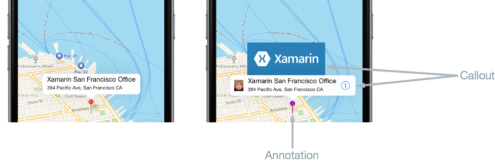

# Customizing a Map Pin

[ Download the sample](/samples/xamarin/xamarin-forms-samples/customrenderers-map-pin)

_This article demonstrates how to create a custom renderer for the Map control, which displays a native map with a customized pin and a customized view of the pin data on each platform._

Every Xamarin.Forms view has an accompanying renderer for each platform that creates an instance of a native control. When a [`Map`](xref:Xamarin.Forms.Maps.Map) is rendered by a Xamarin.Forms application in iOS, the `MapRenderer` class is instantiated, which in turn instantiates a native `MKMapView` control. On the Android platform, the `MapRenderer` class instantiates a native `MapView` control. On the Universal Windows Platform (UWP), the `MapRenderer` class instantiates a native `MapControl`. For more information about the renderer and native control classes that Xamarin.Forms controls map to, see [Renderer Base Classes and Native Controls](~/xamarin-forms/app-fundamentals/custom-renderer/renderers.md).

The following diagram illustrates the relationship between the [`Map`](xref:Xamarin.Forms.Maps.Map) and the corresponding native controls that implement it:


The rendering process can be used to implement platform-specific customizations by creating a custom renderer for a [`Map`](xref:Xamarin.Forms.Maps.Map) on each platform. The process for doing this is as follows:

1. [Create](#creating-the-custom-map) a Xamarin.Forms custom map.
1. [Consume](#consuming-the-custom-map) the custom map from Xamarin.Forms.
1. [Create](#creating-the-custom-renderer-on-each-platform) the custom renderer for the map on each platform.

Each item will now be discussed in turn, to implement a `CustomMap` renderer that displays a native map with a customized pin and a customized view of the pin data on each platform.

> [!NOTE]
> [`Xamarin.Forms.Maps`](xref:Xamarin.Forms.Maps) must be initialized and configured before use. For more information, see [`Maps Control`](~/xamarin-forms/user-interface/map/index.md).

## Creating the Custom Map

A custom map control can be created by subclassing the [`Map`](xref:Xamarin.Forms.Maps.Map) class, as shown in the following code example:

```csharp
public class CustomMap : Map
{
    public List<CustomPin> CustomPins { get; set; }
}
```

The `CustomMap` control is created in the .NET Standard library project and defines the API for the custom map. The custom map exposes the `CustomPins` property that represents the collection of `CustomPin` objects that will be rendered by the native map control on each platform. The `CustomPin` class is shown in the following code example:

```csharp
public class CustomPin : Pin
{
    public string Name { get; set; }
    public string Url { get; set; }
}
```

This class defines a `CustomPin` as inheriting the properties of the [`Pin`](xref:Xamarin.Forms.Maps.Pin) class, and adding `Name` and `Url` properties.

## Consuming the Custom Map

The `CustomMap` control can be referenced in XAML in the .NET Standard library project by declaring a namespace for its location and using the namespace prefix on the custom map control. The following code example shows how the `CustomMap` control can be consumed by a XAML page:

```xaml
<ContentPage ...
			       xmlns:local="clr-namespace:CustomRenderer;assembly=CustomRenderer">
	<local:CustomMap x:Name="customMap"
                   MapType="Street" />
</ContentPage>

```

The `local` namespace prefix can be named anything. However, the `clr-namespace` and `assembly` values must match the details of the custom map. Once the namespace is declared, the prefix is used to reference the custom map.

The following code example shows how the `CustomMap` control can be consumed by a C# page:

```csharp
public class MapPageCS : ContentPage
{
    public MapPageCS()
    {
        CustomMap customMap = new CustomMap
        {
            MapType = MapType.Street
        };
        // ...
        Content = customMap;
    }
}
```

The `CustomMap` instance will be used to display the native map on each platform. It's [`MapType`](xref:Xamarin.Forms.Maps.Map.MapType) property sets the display style of the [`Map`](xref:Xamarin.Forms.Maps.Map), with the possible values being defined in the [`MapType`](xref:Xamarin.Forms.Maps.MapType) enumeration.

The location of the map, and the pins it contains, are initialized as shown in the following code example:

```csharp
public MapPage()
{
    // ...
    CustomPin pin = new CustomPin
    {
        Type = PinType.Place,
        Position = new Position(37.79752, -122.40183),
        Label = "Xamarin San Francisco Office",
        Address = "394 Pacific Ave, San Francisco CA",
        Name = "Xamarin",
        Url = "http://xamarin.com/about/"
    };
    customMap.CustomPins = new List<CustomPin> { pin };
    customMap.Pins.Add(pin);
    customMap.MoveToRegion(MapSpan.FromCenterAndRadius(new Position(37.79752, -122.40183), Distance.FromMiles(1.0)));
}
```

This initialization adds a custom pin and positions the map's view with the [`MoveToRegion`](xref:Xamarin.Forms.Maps.Map.MoveToRegion*) method, which changes the position and zoom level of the map by creating a [`MapSpan`](xref:Xamarin.Forms.Maps.MapSpan) from a [`Position`](xref:Xamarin.Forms.Maps.Position) and a [`Distance`](xref:Xamarin.Forms.Maps.Distance).

A custom renderer can now be added to each application project to customize the native map controls.

## Creating the Custom Renderer on each Platform

The process for creating the custom renderer class is as follows:

1. Create a subclass of the `MapRenderer` class that renders the custom map.
1. Override the `OnElementChanged` method that renders the custom map and write logic to customize it. This method is called when the corresponding Xamarin.Forms custom map is created.
1. Add an `ExportRenderer` attribute to the custom renderer class to specify that it will be used to render the Xamarin.Forms custom map. This attribute is used to register the custom renderer with Xamarin.Forms.

> [!NOTE]
> It is optional to provide a custom renderer in each platform project. If a custom renderer isn't registered, then the default renderer for the control's base class will be used.

The following diagram illustrates the responsibilities of each project in the sample application, along with the relationships between them:


The `CustomMap` control is rendered by platform-specific renderer classes, which derive from the `MapRenderer` class for each platform. This results in each `CustomMap` control being rendered with platform-specific controls, as shown in the following screenshots:


The `MapRenderer` class exposes the `OnElementChanged` method, which is called when the Xamarin.Forms custom map is created to render the corresponding native control. This method takes an `ElementChangedEventArgs` parameter that contains `OldElement` and `NewElement` properties. These properties represent the Xamarin.Forms element that the renderer *was* attached to, and the Xamarin.Forms element that the renderer *is* attached to, respectively. In the sample application the `OldElement` property will be `null` and the `NewElement` property will contain a reference to the `CustomMap` instance.

An overridden version of the `OnElementChanged` method, in each platform-specific renderer class, is the place to perform the native control customization. A typed reference to the native control being used on the platform can be accessed through the `Control` property. In addition, a reference to the Xamarin.Forms control that's being rendered can be obtained through the `Element` property.

Care must be taken when subscribing to event handlers in the `OnElementChanged` method, as demonstrated in the following code example:

```csharp
protected override void OnElementChanged (ElementChangedEventArgs<Xamarin.Forms.View> e)
{
  base.OnElementChanged (e);

  if (e.OldElement != null)
  {
      // Unsubscribe from event handlers
  }

  if (e.NewElement != null)
  {
      // Configure the native control and subscribe to event handlers
  }
}
```

The native control should be configured and event handlers subscribed to only when the custom renderer is attached to a new Xamarin.Forms element. Similarly, any event handlers that were subscribed to should be unsubscribed from only when the element that the renderer is attached to changes. Adopting this approach will help to create a custom renderer that doesn't suffer from memory leaks.

Each custom renderer class is decorated with an `ExportRenderer` attribute that registers the renderer with Xamarin.Forms. The attribute takes two parameters – the type name of the Xamarin.Forms custom control being rendered, and the type name of the custom renderer. The `assembly` prefix to the attribute specifies that the attribute applies to the entire assembly.

The following sections discuss the implementation of each platform-specific custom renderer class.

### Creating the Custom Renderer on iOS

The following screenshots show the map, before and after customization:



On iOS the pin is called an *annotation*, and can be either a custom image or a system-defined pin of various colors. Annotations can optionally show a *callout*, which is displayed in response to the user selecting the annotation. The callout displays the `Label` and `Address` properties of the `Pin` instance, with optional left and right accessory views. In the screenshot above, the left accessory view is the image of a monkey, with the right accessory view being the *Information* button.

The following code example shows the custom renderer for the iOS platform:

```csharp
[assembly: ExportRenderer(typeof(CustomMap), typeof(CustomMapRenderer))]
namespace CustomRenderer.iOS
{
    public class CustomMapRenderer : MapRenderer
    {
        UIView customPinView;
        List<CustomPin> customPins;

        protected override void OnElementChanged(ElementChangedEventArgs<View> e)
        {
            base.OnElementChanged(e);

            if (e.OldElement != null)
            {
                var nativeMap = Control as MKMapView;
                if (nativeMap != null)
                {
                    nativeMap.RemoveAnnotations(nativeMap.Annotations);
                    nativeMap.GetViewForAnnotation = null;
                    nativeMap.CalloutAccessoryControlTapped -= OnCalloutAccessoryControlTapped;
                    nativeMap.DidSelectAnnotationView -= OnDidSelectAnnotationView;
                    nativeMap.DidDeselectAnnotationView -= OnDidDeselectAnnotationView;
                }
            }

            if (e.NewElement != null)
            {
                var formsMap = (CustomMap)e.NewElement;
                var nativeMap = Control as MKMapView;
                customPins = formsMap.CustomPins;

                nativeMap.GetViewForAnnotation = GetViewForAnnotation;
                nativeMap.CalloutAccessoryControlTapped += OnCalloutAccessoryControlTapped;
                nativeMap.DidSelectAnnotationView += OnDidSelectAnnotationView;
                nativeMap.DidDeselectAnnotationView += OnDidDeselectAnnotationView;
            }
        }
        // ...
    }
}
```

The `OnElementChanged` method performs the following configuration of the [`MKMapView`](xref:MapKit.MKMapView) instance, provided that the custom renderer is attached to a new Xamarin.Forms element:

- The [`GetViewForAnnotation`](xref:MapKit.MKMapView.GetViewForAnnotation*) property is set to the `GetViewForAnnotation` method. This method is called when the [location of the annotation becomes visible on the map](#displaying-the-annotation), and is used to customize the annotation prior to display.
- Event handlers for the `CalloutAccessoryControlTapped`, `DidSelectAnnotationView`, and `DidDeselectAnnotationView` events are registered. These events fire when the user [taps the right accessory in the callout](#tapping-on-the-right-callout-accessory-view), and when the user [selects](#selecting-the-annotation) and [deselects](#deselecting-the-annotation) the annotation, respectively. The events are unsubscribed from only when the element the renderer is attached to changes.

#### Displaying the Annotation

The `GetViewForAnnotation` method is called when the location of the annotation becomes visible on the map, and is used to customize the annotation prior to display. An annotation has two parts:

- `MkAnnotation` – includes the title, subtitle, and location of the annotation.
- `MkAnnotationView` – contains the image to represent the annotation, and optionally, a callout that is shown when the user taps the annotation.

The `GetViewForAnnotation` method accepts an `IMKAnnotation` that contains the annotation's data and returns an `MKAnnotationView` for display on the map, and is shown in the following code example:

```csharp
protected override MKAnnotationView GetViewForAnnotation(MKMapView mapView, IMKAnnotation annotation)
{
    MKAnnotationView annotationView = null;

    if (annotation is MKUserLocation)
        return null;

    var customPin = GetCustomPin(annotation as MKPointAnnotation);
    if (customPin == null)
    {
        throw new Exception("Custom pin not found");
    }

    annotationView = mapView.DequeueReusableAnnotation(customPin.Name);
    if (annotationView == null)
    {
        annotationView = new CustomMKAnnotationView(annotation, customPin.Name);
        annotationView.Image = UIImage.FromFile("pin.png");
        annotationView.CalloutOffset = new CGPoint(0, 0);
        annotationView.LeftCalloutAccessoryView = new UIImageView(UIImage.FromFile("monkey.png"));
        annotationView.RightCalloutAccessoryView = UIButton.FromType(UIButtonType.DetailDisclosure);
        ((CustomMKAnnotationView)annotationView).Name = customPin.Name;
        ((CustomMKAnnotationView)annotationView).Url = customPin.Url;
    }
    annotationView.CanShowCallout = true;

    return annotationView;
}
```

This method ensures that the annotation will be displayed as a custom image, rather than as system-defined pin, and that when the annotation is tapped a callout will be displayed that includes additional content to the left and right of the annotation title and address. This is accomplished as follows:

1. The `GetCustomPin` method is called to return the custom pin data for the annotation.
1. To conserve memory, the annotation's view is pooled for reuse with the call to [`DequeueReusableAnnotation`](xref:MapKit.MKMapView.DequeueReusableAnnotation*).
1. The `CustomMKAnnotationView` class extends the `MKAnnotationView` class with `Name` and `Url` properties that correspond to identical properties in the `CustomPin` instance. A new instance of the `CustomMKAnnotationView` is created, provided that the annotation is `null`:
    - The `CustomMKAnnotationView.Image` property is set to the image that will represent the annotation on the map.
    - The `CustomMKAnnotationView.CalloutOffset` property is set to a `CGPoint` that specifies that the callout will be centered above the annotation.
    - The `CustomMKAnnotationView.LeftCalloutAccessoryView` property is set to an image of a monkey that will appear to the left of the annotation title and address.
    - The `CustomMKAnnotationView.RightCalloutAccessoryView` property is set to an *Information* button that will appear to the right of the annotation title and address.
    - The `CustomMKAnnotationView.Name` property is set to the `CustomPin.Name` property returned by the `GetCustomPin` method. This enables the annotation to be identified so that it's [callout can be further customized](#selecting-the-annotation), if desired.
    - The `CustomMKAnnotationView.Url` property is set to the `CustomPin.Url` property returned by the `GetCustomPin` method. The URL will be navigated to when the user [taps the button displayed in the right callout accessory view](#tapping-on-the-right-callout-accessory-view).
1. The [`MKAnnotationView.CanShowCallout`](xref:MapKit.MKAnnotationView.CanShowCallout*) property is set to `true` so that the callout is displayed when the annotation is tapped.
1. The annotation is returned for display on the map.

#### Selecting the Annotation

When the user taps on the annotation, the `DidSelectAnnotationView` event fires, which in turn executes the `OnDidSelectAnnotationView` method:

```csharp
void OnDidSelectAnnotationView(object sender, MKAnnotationViewEventArgs e)
{
    CustomMKAnnotationView customView = e.View as CustomMKAnnotationView;
    customPinView = new UIView();

    if (customView.Name.Equals("Xamarin"))
    {
        customPinView.Frame = new CGRect(0, 0, 200, 84);
        var image = new UIImageView(new CGRect(0, 0, 200, 84));
        image.Image = UIImage.FromFile("xamarin.png");
        customPinView.AddSubview(image);
        customPinView.Center = new CGPoint(0, -(e.View.Frame.Height + 75));
        e.View.AddSubview(customPinView);
    }
}
```

This method extends the existing callout (that contains left and right accessory views) by adding a `UIView` instance to it that contains an image of the Xamarin logo, provided that the selected annotation has its `Name` property set to `Xamarin`. This allows for scenarios where different callouts can be displayed for different annotations. The `UIView` instance will be displayed centered above the existing callout.

#### Tapping on the Right Callout Accessory View

When the user taps on the *Information* button in the right callout accessory view, the `CalloutAccessoryControlTapped` event fires, which in turn executes the `OnCalloutAccessoryControlTapped` method:

```csharp
void OnCalloutAccessoryControlTapped(object sender, MKMapViewAccessoryTappedEventArgs e)
{
    CustomMKAnnotationView customView = e.View as CustomMKAnnotationView;
    if (!string.IsNullOrWhiteSpace(customView.Url))
    {
        UIApplication.SharedApplication.OpenUrl(new Foundation.NSUrl(customView.Url));
    }
}
```

This method opens a web browser and navigates to the address stored in the `CustomMKAnnotationView.Url` property. Note that the address was defined when creating the `CustomPin` collection in the .NET Standard library project.

#### Deselecting the Annotation

When the annotation is displayed and the user taps on the map, the `DidDeselectAnnotationView` event fires, which in turn executes the `OnDidDeselectAnnotationView` method:

```csharp
void OnDidDeselectAnnotationView(object sender, MKAnnotationViewEventArgs e)
{
    if (!e.View.Selected)
    {
        customPinView.RemoveFromSuperview();
        customPinView.Dispose();
        customPinView = null;
    }
}
```

This method ensures that when the existing callout is not selected, the extended part of the callout (the image of the Xamarin logo) will also stop being displayed, and its resources will be released.

For more information about customizing a `MKMapView` instance, see [iOS Maps](~/ios/user-interface/controls/ios-maps/index.md).

### Creating the Custom Renderer on Android

The following screenshots show the map, before and after customization:


On Android the pin is called a *marker*, and can either be a custom image or a system-defined marker of various colors. Markers can show an *info window*, which is displayed in response to the user tapping on the marker. The info window displays the `Label` and `Address` properties of the `Pin` instance, and can be customized to include other content. However, only one info window can be shown at once.

The following code example shows the custom renderer for the Android platform:

```csharp
[assembly: ExportRenderer(typeof(CustomMap), typeof(CustomMapRenderer))]
namespace CustomRenderer.Droid
{
    public class CustomMapRenderer : MapRenderer, GoogleMap.IInfoWindowAdapter
    {
        List<CustomPin> customPins;

        public CustomMapRenderer(Context context) : base(context)
        {
        }

        protected override void OnElementChanged(Xamarin.Forms.Platform.Android.ElementChangedEventArgs<Map> e)
        {
            base.OnElementChanged(e);

            if (e.OldElement != null)
            {
                NativeMap.InfoWindowClick -= OnInfoWindowClick;
            }

            if (e.NewElement != null)
            {
                var formsMap = (CustomMap)e.NewElement;
                customPins = formsMap.CustomPins;
            }
        }

        protected override void OnMapReady(GoogleMap map)
        {
            base.OnMapReady(map);

            NativeMap.InfoWindowClick += OnInfoWindowClick;
            NativeMap.SetInfoWindowAdapter(this);
        }
        ...
    }
}
```

Provided that the custom renderer is attached to a new Xamarin.Forms element, the `OnElementChanged` method retrieves the list of custom pins from the control. Once the `GoogleMap` instance is available, the `OnMapReady` override will be invoked. This method registers an event handler for the `InfoWindowClick` event, which fires when the [info window is clicked](#clicking-on-the-info-window), and is unsubscribed from only when the element the renderer is attached to changes. The `OnMapReady` override also calls the `SetInfoWindowAdapter` method to specify that the `CustomMapRenderer` class instance will provide the methods to customize the info window.

The `CustomMapRenderer` class implements the `GoogleMap.IInfoWindowAdapter` interface to [customize the info window](#customizing-the-info-window). This interface specifies that the following methods must be implemented:

- `public Android.Views.View GetInfoWindow(Marker marker)` – This method is called to return a custom info window for a marker. If it returns `null`, then the default window rendering will be used. If it returns a `View`, then that `View` will be placed inside the info window frame.
- `public Android.Views.View GetInfoContents(Marker marker)` – This method is called to return a `View` containing the content of the info window, and will only be called if the `GetInfoWindow` method returns `null`. If it returns `null`, then the default rendering of the info window content will be used.

In the sample application, only the info window content is customized, and so the `GetInfoWindow` method returns `null` to enable this.

#### Customizing the Marker

The icon used to represent a marker can be customized by calling the `MarkerOptions.SetIcon` method. This can be accomplished by overriding the `CreateMarker` method, which is invoked for each `Pin` that's added to the map:

```csharp
protected override MarkerOptions CreateMarker(Pin pin)
{
    var marker = new MarkerOptions();
    marker.SetPosition(new LatLng(pin.Position.Latitude, pin.Position.Longitude));
    marker.SetTitle(pin.Label);
    marker.SetSnippet(pin.Address);
    marker.SetIcon(BitmapDescriptorFactory.FromResource(Resource.Drawable.pin));
    return marker;
}
```

This method creates a new `MarkerOption` instance for each `Pin` instance. After setting the position, label, and address of the marker, its icon is set with the `SetIcon` method. This method takes a `BitmapDescriptor` object containing the data necessary to render the icon, with the `BitmapDescriptorFactory` class providing helper methods to simplify the creation of the `BitmapDescriptor`. For more information about using the `BitmapDescriptorFactory` class to customize a marker, see [Customizing a Marker](~/android/platform/maps-and-location/maps/maps-api.md).

> [!NOTE]
> If required, the `GetMarkerForPin` method can be invoked in your map renderer to retrieve a `Marker` from a `Pin`.

#### Customizing the Info Window

When a user taps on the marker, the `GetInfoContents` method is executed, provided that the `GetInfoWindow` method returns `null`. The following code example shows the `GetInfoContents` method:

```csharp
public Android.Views.View GetInfoContents(Marker marker)
{
    var inflater = Android.App.Application.Context.GetSystemService(Context.LayoutInflaterService) as Android.Views.LayoutInflater;
    if (inflater != null)
    {
        Android.Views.View view;

        var customPin = GetCustomPin(marker);
        if (customPin == null)
        {
            throw new Exception("Custom pin not found");
        }

        if (customPin.Name.Equals("Xamarin"))
        {
            view = inflater.Inflate(Resource.Layout.XamarinMapInfoWindow, null);
        }
        else
        {
            view = inflater.Inflate(Resource.Layout.MapInfoWindow, null);
        }

        var infoTitle = view.FindViewById<TextView>(Resource.Id.InfoWindowTitle);
        var infoSubtitle = view.FindViewById<TextView>(Resource.Id.InfoWindowSubtitle);

        if (infoTitle != null)
        {
            infoTitle.Text = marker.Title;
        }
        if (infoSubtitle != null)
        {
            infoSubtitle.Text = marker.Snippet;
        }

        return view;
    }
    return null;
}
```

This method returns a `View` containing the contents of the info window. This is accomplished as follows:

- A `LayoutInflater` instance is retrieved. This is used to instantiate a layout XML file into its corresponding `View`.
- The `GetCustomPin` method is called to return the custom pin data for the info window.
- The `XamarinMapInfoWindow` layout is inflated if the `CustomPin.Name` property is equal to `Xamarin`. Otherwise, the `MapInfoWindow` layout is inflated. This allows for scenarios where different info window layouts can be displayed for different markers.
- The `InfoWindowTitle` and `InfoWindowSubtitle` resources are retrieved from the inflated layout, and their `Text` properties are set to the corresponding data from the `Marker` instance, provided that the resources are not `null`.
- The `View` instance is returned for display on the map.

> [!NOTE]
> An info window is not a live `View`. Instead, Android will convert the `View` to a static bitmap and display that as an image. This means that while an info window can respond to a click event, it cannot respond to any touch events or gestures, and the individual controls in the info window cannot respond to their own click events.

#### Clicking on the Info Window

When the user clicks on the info window, the `InfoWindowClick` event fires, which in turn executes the `OnInfoWindowClick` method:

```csharp
void OnInfoWindowClick(object sender, GoogleMap.InfoWindowClickEventArgs e)
{
    var customPin = GetCustomPin(e.Marker);
    if (customPin == null)
    {
        throw new Exception("Custom pin not found");
    }

    if (!string.IsNullOrWhiteSpace(customPin.Url))
    {
        var url = Android.Net.Uri.Parse(customPin.Url);
        var intent = new Intent(Intent.ActionView, url);
        intent.AddFlags(ActivityFlags.NewTask);
        Android.App.Application.Context.StartActivity(intent);
    }
}
```

This method opens a web browser and navigates to the address stored in the `Url` property of the retrieved `CustomPin` instance for the `Marker`. Note that the address was defined when creating the `CustomPin` collection in the .NET Standard library project.

For more information about customizing a `MapView` instance, see [Maps API](~/android/platform/maps-and-location/maps/maps-api.md).

### Creating the Custom Renderer on the Universal Windows Platform

The following screenshots show the map, before and after customization:


On UWP the pin is called a *map icon*, and can either be a custom image or the system-defined default image. A map icon can show a `UserControl`, which is displayed in response to the user tapping on the map icon. The `UserControl` can display any content, including the `Label` and `Address` properties of the `Pin` instance.

The following code example shows the UWP custom renderer:

```csharp
[assembly: ExportRenderer(typeof(CustomMap), typeof(CustomMapRenderer))]
namespace CustomRenderer.UWP
{
    public class CustomMapRenderer : MapRenderer
    {
        MapControl nativeMap;
        List<CustomPin> customPins;
        XamarinMapOverlay mapOverlay;
        bool xamarinOverlayShown = false;

        protected override void OnElementChanged(ElementChangedEventArgs<Map> e)
        {
            base.OnElementChanged(e);

            if (e.OldElement != null)
            {
                nativeMap.MapElementClick -= OnMapElementClick;
                nativeMap.Children.Clear();
                mapOverlay = null;
                nativeMap = null;
            }

            if (e.NewElement != null)
            {
                var formsMap = (CustomMap)e.NewElement;
                nativeMap = Control as MapControl;
                customPins = formsMap.CustomPins;

                nativeMap.Children.Clear();
                nativeMap.MapElementClick += OnMapElementClick;

                foreach (var pin in customPins)
                {
                    var snPosition = new BasicGeoposition { Latitude = pin.Pin.Position.Latitude, Longitude = pin.Pin.Position.Longitude };
                    var snPoint = new Geopoint(snPosition);

                    var mapIcon = new MapIcon();
                    mapIcon.Image = RandomAccessStreamReference.CreateFromUri(new Uri("ms-appx:///pin.png"));
                    mapIcon.CollisionBehaviorDesired = MapElementCollisionBehavior.RemainVisible;
                    mapIcon.Location = snPoint;
                    mapIcon.NormalizedAnchorPoint = new Windows.Foundation.Point(0.5, 1.0);

                    nativeMap.MapElements.Add(mapIcon);                    
                }
            }
        }
        ...
    }
}
```

The `OnElementChanged` method performs the following operations, provided that the custom renderer is attached to a new Xamarin.Forms element:

- It clears the `MapControl.Children` collection to remove any existing user interface elements from the map, before registering an event handler for the `MapElementClick` event. This event fires when the user taps or clicks on a `MapElement` on the `MapControl`, and is unsubscribed from only when the element the renderer is attached to changes.
- Each pin in the `customPins` collection is displayed at the correct geographic location on the map as follows:
  - The location for the pin is created as a `Geopoint` instance.
  - A `MapIcon` instance is created to represent the pin.
  - The image used to represent the `MapIcon` is specified by setting the `MapIcon.Image` property. However, the map icon's image is not always guaranteed to be shown, as it may be obscured by other elements on the map. Therefore, the map icon's `CollisionBehaviorDesired` property is set to `MapElementCollisionBehavior.RemainVisible`, to ensure that it remains visible.
  - The location of the `MapIcon` is specified by setting the `MapIcon.Location` property.
  - The `MapIcon.NormalizedAnchorPoint` property is set to the approximate location of the pointer on the image. If this property retains its default value of (0,0), which represents the upper left corner of the image, changes in the zoom level of the map may result in the image pointing to a different location.
  - The `MapIcon` instance is added to the `MapControl.MapElements` collection. This results in the map icon being displayed on the `MapControl`.

> [!NOTE]
> When using the same image for multiple map icons, the `RandomAccessStreamReference` instance should be declared at the page or application level for best performance.

#### Displaying the UserControl

When a user taps on the map icon, the `OnMapElementClick` method is executed. The following code example shows this method:

```csharp
private void OnMapElementClick(MapControl sender, MapElementClickEventArgs args)
{
    var mapIcon = args.MapElements.FirstOrDefault(x => x is MapIcon) as MapIcon;
    if (mapIcon != null)
    {
        if (!xamarinOverlayShown)
        {
            var customPin = GetCustomPin(mapIcon.Location.Position);
            if (customPin == null)
            {
                throw new Exception("Custom pin not found");
            }

            if (customPin.Name.Equals("Xamarin"))
            {
                if (mapOverlay == null)
                {
                    mapOverlay = new XamarinMapOverlay(customPin);
                }

                var snPosition = new BasicGeoposition { Latitude = customPin.Position.Latitude, Longitude = customPin.Position.Longitude };
                var snPoint = new Geopoint(snPosition);

                nativeMap.Children.Add(mapOverlay);
                MapControl.SetLocation(mapOverlay, snPoint);
                MapControl.SetNormalizedAnchorPoint(mapOverlay, new Windows.Foundation.Point(0.5, 1.0));
                xamarinOverlayShown = true;
            }
        }
        else
        {
            nativeMap.Children.Remove(mapOverlay);
            xamarinOverlayShown = false;
        }
    }
}
```

This method creates a `UserControl` instance that displays information about the pin. This is accomplished as follows:

- The `MapIcon` instance is retrieved.
- The `GetCustomPin` method is called to return the custom pin data that will be displayed.
- A `XamarinMapOverlay` instance is created to display the custom pin data. This class is a user control.
- The geographic location at which to display the `XamarinMapOverlay` instance on the `MapControl` is created as a `Geopoint` instance.
- The `XamarinMapOverlay` instance is added to the `MapControl.Children` collection. This collection contains XAML user interface elements that will be displayed on the map.
- The geographic location of the `XamarinMapOverlay` instance on the map is set by calling the `SetLocation` method.
- The relative location on the `XamarinMapOverlay` instance, that corresponds to the specified location, is set by calling the `SetNormalizedAnchorPoint` method. This ensures that changes in the zoom level of the map result in the `XamarinMapOverlay` instance always being displayed at the correct location.

Alternatively, if information about the pin is already being displayed on the map, tapping on the map removes the `XamarinMapOverlay` instance from the `MapControl.Children` collection.

#### Tapping on the Information Button

When the user taps on the *Information* button in the `XamarinMapOverlay` user control, the `Tapped` event fires, which in turn executes the `OnInfoButtonTapped` method:

```csharp
private async void OnInfoButtonTapped(object sender, TappedRoutedEventArgs e)
{
    await Launcher.LaunchUriAsync(new Uri(customPin.Url));
}
```

This method opens a web browser and navigates to the address stored in the `Url` property of the `CustomPin` instance. Note that the address was defined when creating the `CustomPin` collection in the .NET Standard library project.

For more information about customizing a `MapControl` instance, see [Maps and Location Overview](/windows/uwp/maps-and-location/) on MSDN.

## Related Links

- [Maps Control](~/xamarin-forms/user-interface/map/index.md)
- [iOS Maps](~/ios/user-interface/controls/ios-maps/index.md)
- [Maps API](~/android/platform/maps-and-location/maps/maps-api.md)
- [Customized Pin (sample)](/samples/xamarin/xamarin-forms-samples/customrenderers-map-pin)