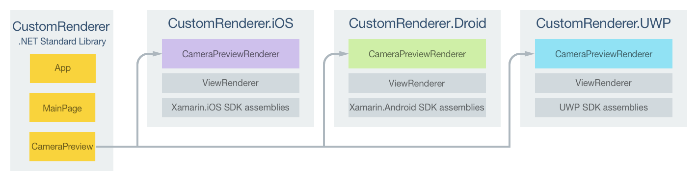
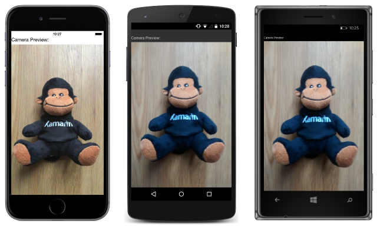

# Implementing a View

[ Download the sample](/samples/xamarin/xamarin-forms-samples/customrenderers-view)

_Xamarin.Forms custom user interface controls should derive from the View class, which is used to place layouts and controls on the screen. This article demonstrates how to create a custom renderer for a Xamarin.Forms custom control that's used to display a preview video stream from the device's camera._

Every Xamarin.Forms view has an accompanying renderer for each platform that creates an instance of a native control. When a [`View`](xref:Xamarin.Forms.View) is rendered by a Xamarin.Forms application in iOS, the `ViewRenderer` class is instantiated, which in turn instantiates a native `UIView` control. On the Android platform, the `ViewRenderer` class instantiates a native `View` control. On the Universal Windows Platform (UWP), the `ViewRenderer` class instantiates a native `FrameworkElement` control. For more information about the renderer and native control classes that Xamarin.Forms controls map to, see [Renderer Base Classes and Native Controls](~/xamarin-forms/app-fundamentals/custom-renderer/renderers.md).

> [!NOTE]
> Some controls on Android use fast renderers, which don't consume the `ViewRenderer` class. For more information about fast renderers, see [Xamarin.Forms Fast Renderers](~/xamarin-forms/internals/fast-renderers.md).

The following diagram illustrates the relationship between the [`View`](xref:Xamarin.Forms.View) and the corresponding native controls that implement it:


The rendering process can be used to implement platform-specific customizations by creating a custom renderer for a [`View`](xref:Xamarin.Forms.View) on each platform. The process for doing this is as follows:

1. [Create](#creating-the-custom-control) a Xamarin.Forms custom control.
1. [Consume](#consuming-the-custom-control) the custom control from Xamarin.Forms.
1. [Create](#creating-the-custom-renderer-on-each-platform) the custom renderer for the control on each platform.

Each item will now be discussed in turn, to implement a `CameraPreview` renderer that displays a preview video stream from the device's camera. Tapping on the video stream will stop and start it.

## Creating the Custom Control

A custom control can be created by subclassing the [`View`](xref:Xamarin.Forms.View) class, as shown in the following code example:

```csharp
public class CameraPreview : View
{
  public static readonly BindableProperty CameraProperty = BindableProperty.Create (
    propertyName: "Camera",
    returnType: typeof(CameraOptions),
    declaringType: typeof(CameraPreview),
    defaultValue: CameraOptions.Rear);

  public CameraOptions Camera
  {
    get { return (CameraOptions)GetValue (CameraProperty); }
    set { SetValue (CameraProperty, value); }
  }
}
```

The `CameraPreview` custom control is created in the .NET Standard library project and defines the API for the control. The custom control exposes a `Camera` property that's used for controlling whether the video stream should be displayed from the front or rear camera on the device. If a value isn't specified for the `Camera` property when the control is created, it defaults to specifying the rear camera.

## Consuming the Custom Control

The `CameraPreview` custom control can be referenced in XAML in the .NET Standard library project by declaring a namespace for its location and using the namespace prefix on the custom control element. The following code example shows how the `CameraPreview` custom control can be consumed by a XAML page:

```xaml
<ContentPage ...
             xmlns:local="clr-namespace:CustomRenderer;assembly=CustomRenderer"
             ...>
    <StackLayout>
        <Label Text="Camera Preview:" />
        <local:CameraPreview Camera="Rear"
                             HorizontalOptions="FillAndExpand"
                             VerticalOptions="FillAndExpand" />
    </StackLayout>
</ContentPage>
```

The `local` namespace prefix can be named anything. However, the `clr-namespace` and `assembly` values must match the details of the custom control. Once the namespace is declared, the prefix is used to reference the custom control.

The following code example shows how the `CameraPreview` custom control can be consumed by a C# page:

```csharp
public class MainPageCS : ContentPage
{
  public MainPageCS ()
  {
    ...
    Content = new StackLayout
    {
      Children =
      {
        new Label { Text = "Camera Preview:" },
        new CameraPreview
        {
          Camera = CameraOptions.Rear,
          HorizontalOptions = LayoutOptions.FillAndExpand,
          VerticalOptions = LayoutOptions.FillAndExpand
        }
      }
    };
  }
}
```

An instance of the `CameraPreview` custom control will be used to display the preview video stream from the device's camera. Aside from optionally specifying a value for the `Camera` property, customization of the control will be carried out in the custom renderer.

A custom renderer can now be added to each application project to create platform-specific camera preview controls.

## Creating the Custom Renderer on each Platform

The process for creating the custom renderer class on iOS and UWP is as follows:

1. Create a subclass of the `ViewRenderer<T1,T2>` class that renders the custom control. The first type argument should be the custom control the renderer is for, in this case `CameraPreview`. The second type argument should be the native control that will implement the custom control.
1. Override the `OnElementChanged` method that renders the custom control and write logic to customize it. This method is called when the corresponding Xamarin.Forms control is created.
1. Add an `ExportRenderer` attribute to the custom renderer class to specify that it will be used to render the Xamarin.Forms custom control. This attribute is used to register the custom renderer with Xamarin.Forms.

The process for creating the custom renderer class on Android, as a fast renderer, is as follows:

1. Create a subclass of the Android control that renders the custom control. In addition, specify that the subclass will implement the `IVisualElementRenderer` and `IViewRenderer` interfaces.
1. Implement the `IVisualElementRenderer` and `IViewRenderer` interfaces in the fast renderer class.
1. Add an `ExportRenderer` attribute to the custom renderer class to specify that it will be used to render the Xamarin.Forms custom control. This attribute is used to register the custom renderer with Xamarin.Forms.

> [!NOTE]
> For most Xamarin.Forms elements, it is optional to provide a custom renderer in each platform project. If a custom renderer isn't registered, then the default renderer for the control's base class will be used. However, custom renderers are required in each platform project when rendering a [View](xref:Xamarin.Forms.View) element.

The following diagram illustrates the responsibilities of each project in the sample application, along with the relationships between them:



The `CameraPreview` custom control is rendered by platform-specific renderer classes, which derive from the `ViewRenderer` class on iOS and UWP, and from the `FrameLayout` class on Android. This results in each `CameraPreview` custom control being rendered with platform-specific controls, as shown in the following screenshots:



The `ViewRenderer` class exposes the `OnElementChanged` method, which is called when the Xamarin.Forms custom control is created to render the corresponding native control. This method takes an `ElementChangedEventArgs` parameter that contains `OldElement` and `NewElement` properties. These properties represent the Xamarin.Forms element that the renderer *was* attached to, and the Xamarin.Forms element that the renderer *is* attached to, respectively. In the sample application, the `OldElement` property will be `null` and the `NewElement` property will contain a reference to the `CameraPreview` instance.

An overridden version of the `OnElementChanged` method, in each platform-specific renderer class, is the place to perform the native control instantiation and customization. The `SetNativeControl` method should be used to instantiate the native control, and this method will also assign the control reference to the `Control` property. In addition, a reference to the Xamarin.Forms control that's being rendered can be obtained through the `Element` property.

In some circumstances, the `OnElementChanged` method can be called multiple times. Therefore, to prevent memory leaks, care must be taken when instantiating a new native control. The approach to use when instantiating a new native control in a custom renderer is shown in the following code example:

```csharp
protected override void OnElementChanged (ElementChangedEventArgs<NativeListView> e)
{
  base.OnElementChanged (e);

  if (e.OldElement != null)
  {
    // Unsubscribe from event handlers and cleanup any resources
  }

  if (e.NewElement != null)
  {    
    if (Control == null)
    {
      // Instantiate the native control and assign it to the Control property with
      // the SetNativeControl method
    }
    // Configure the control and subscribe to event handlers
  }
}
```

A new native control should only be instantiated once, when the `Control` property is `null`. In addition, the control should only be created, configured, and event handlers subscribed to when the custom renderer is attached to a new Xamarin.Forms element. Similarly, any event handlers that were subscribed to should only be unsubscribed from when the element that the renderer is attached to changes. Adopting this approach will help to create a performant custom renderer that doesn't suffer from memory leaks.

> [!IMPORTANT]
> The `SetNativeControl` method should only be called if `e.NewElement` is not `null`.

Each custom renderer class is decorated with an `ExportRenderer` attribute that registers the renderer with Xamarin.Forms. The attribute takes two parameters – the type name of the Xamarin.Forms custom control being rendered, and the type name of the custom renderer. The `assembly` prefix to the attribute specifies that the attribute applies to the entire assembly.

The following sections discuss the implementation of each platform-specific custom renderer class.

### Creating the Custom Renderer on iOS

The following code example shows the custom renderer for the iOS platform:

```csharp
[assembly: ExportRenderer (typeof(CameraPreview), typeof(CameraPreviewRenderer))]
namespace CustomRenderer.iOS
{
    public class CameraPreviewRenderer : ViewRenderer<CameraPreview, UICameraPreview>
    {
        UICameraPreview uiCameraPreview;

        protected override void OnElementChanged (ElementChangedEventArgs<CameraPreview> e)
        {
            base.OnElementChanged (e);

            if (e.OldElement != null) {
                // Unsubscribe
                uiCameraPreview.Tapped -= OnCameraPreviewTapped;
            }
            if (e.NewElement != null) {
                if (Control == null) {
                  uiCameraPreview = new UICameraPreview (e.NewElement.Camera);
                  SetNativeControl (uiCameraPreview);
                }
                // Subscribe
                uiCameraPreview.Tapped += OnCameraPreviewTapped;
            }
        }

        void OnCameraPreviewTapped (object sender, EventArgs e)
        {
            if (uiCameraPreview.IsPreviewing) {
                uiCameraPreview.CaptureSession.StopRunning ();
                uiCameraPreview.IsPreviewing = false;
            } else {
                uiCameraPreview.CaptureSession.StartRunning ();
                uiCameraPreview.IsPreviewing = true;
            }
        }
        ...
    }
}
```

Provided that the `Control` property is `null`, the `SetNativeControl` method is called to instantiate a new `UICameraPreview` control and to assign a reference to it to the `Control` property. The `UICameraPreview` control is a platform-specific custom control that uses the `AVCapture` APIs to provide the preview stream from the camera. It exposes a `Tapped` event that's handled by the `OnCameraPreviewTapped` method to stop and start the video preview when it's tapped. The `Tapped` event is subscribed to when the custom renderer is attached to a new Xamarin.Forms element, and unsubscribed from only when the element the renderer is attached to changes.

### Creating the Custom Renderer on Android

The following code example shows the fast renderer for the Android platform:

```csharp
[assembly: ExportRenderer(typeof(CustomRenderer.CameraPreview), typeof(CameraPreviewRenderer))]
namespace CustomRenderer.Droid
{
    public class CameraPreviewRenderer : FrameLayout, IVisualElementRenderer, IViewRenderer
    {
        // ...
        CameraPreview element;
        VisualElementTracker visualElementTracker;
        VisualElementRenderer visualElementRenderer;
        FragmentManager fragmentManager;
        CameraFragment cameraFragment;

        FragmentManager FragmentManager => fragmentManager ??= Context.GetFragmentManager();

        public event EventHandler<VisualElementChangedEventArgs> ElementChanged;
        public event EventHandler<PropertyChangedEventArgs> ElementPropertyChanged;

        CameraPreview Element
        {
            get => element;
            set
            {
                if (element == value)
                {
                    return;
                }

                var oldElement = element;
                element = value;
                OnElementChanged(new ElementChangedEventArgs<CameraPreview>(oldElement, element));
            }
        }

        public CameraPreviewRenderer(Context context) : base(context)
        {
            visualElementRenderer = new VisualElementRenderer(this);
        }

        void OnElementChanged(ElementChangedEventArgs<CameraPreview> e)
        {
            CameraFragment newFragment = null;

            if (e.OldElement != null)
            {
                e.OldElement.PropertyChanged -= OnElementPropertyChanged;
                cameraFragment.Dispose();
            }
            if (e.NewElement != null)
            {
                this.EnsureId();

                e.NewElement.PropertyChanged += OnElementPropertyChanged;

                ElevationHelper.SetElevation(this, e.NewElement);
                newFragment = new CameraFragment { Element = element };
            }

            FragmentManager.BeginTransaction()
                .Replace(Id, cameraFragment = newFragment, "camera")
                .Commit();
            ElementChanged?.Invoke(this, new VisualElementChangedEventArgs(e.OldElement, e.NewElement));
        }

        async void OnElementPropertyChanged(object sender, PropertyChangedEventArgs e)
        {
            ElementPropertyChanged?.Invoke(this, e);

            switch (e.PropertyName)
            {
                case "Width":
                    await cameraFragment.RetrieveCameraDevice();
                    break;
            }
        }       
        // ...
    }
}
```

In this example, the `OnElementChanged` method creates a `CameraFragment` object, provided that the custom renderer is attached to a new Xamarin.Forms element. The `CameraFragment` type is a custom class that uses the `Camera2` API to provide the preview stream from the camera. The `CameraFragment` object is disposed of when the Xamarin.Forms element the renderer is attached to changes.

### Creating the Custom Renderer on UWP

The following code example shows the custom renderer for UWP:

```csharp
[assembly: ExportRenderer(typeof(CameraPreview), typeof(CameraPreviewRenderer))]
namespace CustomRenderer.UWP
{
    public class CameraPreviewRenderer : ViewRenderer<CameraPreview, Windows.UI.Xaml.Controls.CaptureElement>
    {
        ...
        CaptureElement _captureElement;
        bool _isPreviewing;

        protected override void OnElementChanged(ElementChangedEventArgs<CameraPreview> e)
        {
            base.OnElementChanged(e);

            if (e.OldElement != null)
            {
                // Unsubscribe
                Tapped -= OnCameraPreviewTapped;
                ...
            }
            if (e.NewElement != null)
            {
                if (Control == null)
                {
                  ...
                  _captureElement = new CaptureElement();
                  _captureElement.Stretch = Stretch.UniformToFill;

                  SetupCamera();
                  SetNativeControl(_captureElement);
                }
                // Subscribe
                Tapped += OnCameraPreviewTapped;
            }
        }

        async void OnCameraPreviewTapped(object sender, TappedRoutedEventArgs e)
        {
            if (_isPreviewing)
            {
                await StopPreviewAsync();
            }
            else
            {
                await StartPreviewAsync();
            }
        }
        ...
    }
}
```

Provided that the `Control` property is `null`, a new `CaptureElement` is instantiated and the `SetupCamera` method is called, which uses the `MediaCapture` API to provide the preview stream from the camera. The `SetNativeControl` method is then called to assign a reference to the `CaptureElement` instance to the `Control` property. The `CaptureElement` control exposes a `Tapped` event that's handled by the `OnCameraPreviewTapped` method to stop and start the video preview when it's tapped. The `Tapped` event is subscribed to when the custom renderer is attached to a new Xamarin.Forms element, and unsubscribed from only when the element the renderer is attached to changes.

> [!NOTE]
> It's important to stop and dispose of the objects that provide access to the camera in a UWP application. Failure to do so can interfere with other applications that attempt to access the device's camera. For more information, see [Display the camera preview](/windows/uwp/audio-video-camera/simple-camera-preview-access/).

## Summary

This article has demonstrated how to create a custom renderer for a Xamarin.Forms custom control that's used to display a preview video stream from the device's camera. Xamarin.Forms custom user interface controls should derive from the [`View`](xref:Xamarin.Forms.View) class, which is used to place layouts and controls on the screen.

## Related Links

- [CustomRendererView (sample)](/samples/xamarin/xamarin-forms-samples/customrenderers-view)